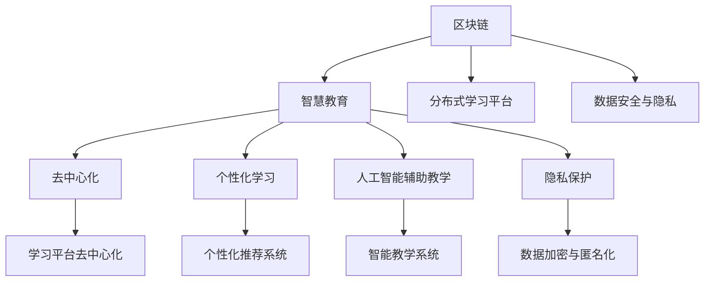

                 

# 教育科技创业：知识传播的新范式

> 关键词：教育科技,知识传播,智慧教育,人工智能,区块链,隐私保护,去中心化,个性化学习

## 1. 背景介绍

### 1.1 问题由来
教育一直是人类进步的基石，但在传统教育模式中，知识的传播存在诸多瓶颈。以教师为中心的教学方式，难以因材施教，无法满足学生的个性化学习需求。传统教材内容固定，缺乏互动性和实效性。在线教育虽然丰富了学习资源，但同样存在课程质量参差不齐、学习效果难以跟踪等问题。

面对这些挑战，教育科技企业应运而生，利用先进技术手段和理念，创造全新的知识传播方式，提升教育质量，激发学生兴趣。其中，基于区块链的智慧教育平台、去中心化的个性化学习系统、人工智能辅助教学系统等，成为教育科技创业的热门方向。

### 1.2 问题核心关键点
教育科技创业的核心在于融合先进技术与教育理念，构建高效、灵活、可扩展的教育生态系统。核心关键点包括：

1. **区块链技术的引入**：通过区块链实现学习数据的分布式存储与流转，增强数据的透明性和可信度。
2. **去中心化的设计理念**：使学习过程去中心化，降低学习成本，提高教育资源的公平获取性。
3. **人工智能技术的应用**：利用AI实现个性化学习推荐、智能辅助教学等功能。
4. **隐私保护的重视**：保证学习数据的隐私与安全，防止数据滥用。
5. **去中心化身份认证**：使学习者能够自主管理个人学习档案，增强学习自主性。

## 2. 核心概念与联系

### 2.1 核心概念概述

为更好地理解教育科技创业的理论基础和实践方法，本节将介绍几个密切相关的核心概念：

- **区块链**：一种去中心化的分布式账本技术，通过共识机制保证数据的安全性和透明性。在教育领域，可实现学习数据的分布式存储与流转。
- **智慧教育**：利用人工智能、大数据等技术，实现个性化学习、智能化管理，提升教育质量与效率。
- **去中心化**：打破传统中心化系统的束缚，通过分布式网络实现数据和资源的共享与互操作。
- **个性化学习**：根据学习者的特点和需求，提供定制化的学习内容和路径。
- **人工智能辅助教学**：利用AI技术分析学习者的行为和需求，提供个性化的教学建议和辅导。
- **隐私保护**：在教育科技应用中，严格保护学习者数据隐私，防止数据滥用。

这些核心概念之间的逻辑关系可以通过以下Mermaid流程图来展示：



这个流程图展示了几大核心概念及其之间的关系：

1. 区块链提供去中心化的数据流转机制，是智慧教育的重要基础。
2. 智慧教育通过人工智能和大数据技术实现个性化和智能化学习。
3. 去中心化设计理念贯穿于学习平台的各个环节，降低学习成本，提高教育资源获取的公平性。
4. 隐私保护是所有教育科技应用的必备要素，保证学习数据的匿名性和安全性。
5. 智能教学系统是人工智能辅助教学的核心，通过分析学习者行为，提供个性化教学建议。
6. 分布式学习平台通过区块链技术实现，保障数据的分布式存储与流转。

这些概念共同构成了教育科技创业的理论框架，为构建高效、灵活、可扩展的教育生态系统提供了理论指导。

## 3. 核心算法原理 & 具体操作步骤
### 3.1 算法原理概述

教育科技创业涉及的算法原理主要集中在区块链、智能推荐系统、智能教学系统等领域。以下将详细介绍这几个关键算法的原理和操作步骤。

### 3.2 算法步骤详解

#### 3.2.1 区块链算法原理

区块链算法包括共识机制、分布式账本、智能合约等。以下以以太坊的共识机制为例，详细说明其工作原理。

**工作原理**：
1. **共识机制**：以太坊采用工作量证明(Proof of Work, PoW)共识机制，要求节点通过计算哈希值来证明对区块的贡献。
2. **分布式账本**：所有节点的交易记录均存储在分布式账本中，并通过链式结构串联成区块链。
3. **智能合约**：在区块链上自动执行的合约代码，可用于自动化管理学习资源和数据流转。

**操作步骤**：
1. **节点选择**：由多个节点组成区块链网络，共同维护区块链。
2. **交易广播**：学习者在区块链上广播交易请求。
3. **共识达成**：节点通过PoW机制达成共识，将交易记录添加到区块链中。
4. **智能合约执行**：智能合约自动执行交易规则，保证数据的安全性和透明性。

#### 3.2.2 智能推荐系统算法原理

智能推荐系统通过机器学习算法，对学习者行为和偏好进行分析，生成个性化推荐列表。以下以协同过滤算法为例，详细说明其工作原理。

**工作原理**：
1. **用户行为建模**：通过收集学习者的行为数据，建立用户-物品评分矩阵。
2. **协同过滤算法**：基于相似度计算，推荐与学习者兴趣相似的物品。
3. **在线学习**：不断更新评分矩阵，优化推荐效果。

**操作步骤**：
1. **数据收集**：收集学习者的行为数据，如阅读、观看、测试等。
2. **模型训练**：利用协同过滤算法对用户行为进行建模。
3. **推荐生成**：根据学习者历史行为，生成个性化推荐列表。
4. **反馈收集**：收集学习者对推荐的反馈，调整模型参数。

#### 3.2.3 智能教学系统算法原理

智能教学系统通过AI技术，分析学习者的行为和需求，提供个性化的教学建议和辅导。以下以基于深度学习的智能辅助教学系统为例，详细说明其工作原理。

**工作原理**：
1. **数据采集**：收集学习者的行为数据，如答题、阅读、作业等。
2. **特征提取**：从原始数据中提取有意义的特征，如注意力分布、学习速度等。
3. **模型训练**：利用深度学习模型对学习者的行为进行分析。
4. **个性化建议**：根据分析结果，提供个性化的教学建议。

**操作步骤**：
1. **数据预处理**：清洗和预处理学习者的行为数据。
2. **特征工程**：设计和提取有意义的特征。
3. **模型训练**：使用深度学习模型对特征进行分析。
4. **结果输出**：根据分析结果，输出个性化的教学建议。

### 3.3 算法优缺点

#### 3.3.1 区块链算法的优缺点

**优点**：
1. **去中心化**：数据存储在分布式网络中，降低单点故障风险。
2. **透明性**：所有交易记录公开透明，增强信任度。
3. **不可篡改性**：一旦交易记录添加到区块链中，无法篡改。
4. **智能合约**：自动化执行交易规则，提高操作效率。

**缺点**：
1. **计算资源消耗大**：PoW共识机制需要大量计算资源。
2. **扩展性有限**：当前区块链的扩展性不足，难以处理大规模交易。
3. **隐私保护问题**：智能合约的透明性可能带来隐私风险。
4. **可扩展性问题**：当前区块链的可扩展性不足，难以处理大规模交易。

#### 3.3.2 智能推荐系统算法的优缺点

**优点**：
1. **个性化推荐**：根据用户行为，提供个性化的推荐列表。
2. **高效性**：通过机器学习算法，高效生成推荐列表。
3. **可扩展性**：易于扩展，适用于大规模推荐系统。

**缺点**：
1. **数据质量依赖性高**：推荐效果依赖于数据的准确性和完整性。
2. **冷启动问题**：新用户缺乏足够的历史行为数据，难以进行个性化推荐。
3. **算法复杂度高**：机器学习算法的复杂度较高，难以在实时系统中实现。
4. **推荐瓶颈**：推荐系统容易陷入瓶颈，难以应对大规模用户。

#### 3.3.3 智能教学系统算法的优缺点

**优点**：
1. **个性化教学**：根据学习者的行为，提供个性化的教学建议。
2. **智能辅助**：自动分析学习者的行为，提供智能辅导。
3. **数据驱动**：通过数据驱动，优化教学策略。

**缺点**：
1. **模型复杂度**：深度学习模型复杂度较高，需要大量数据和计算资源。
2. **隐私风险**：学习者的行为数据涉及隐私，需要严格保护。
3. **数据质量问题**：学习者的行为数据质量参差不齐，影响模型效果。
4. **依赖人工干预**：模型仍需要人工干预和调整，难以完全自动化。

### 3.4 算法应用领域

教育科技创业涉及的算法应用领域广泛，以下是几个典型应用场景：

1. **分布式学习平台**：利用区块链技术，构建去中心化的分布式学习平台，实现学习数据的分布式存储与流转。平台提供去中心化的身份认证、学习数据的透明化等功能。
2. **智能推荐系统**：通过智能推荐系统，根据学习者的行为数据，提供个性化的学习资源推荐。智能推荐系统可应用于线上学习平台、图书馆、课程推荐等多个场景。
3. **智能教学系统**：利用智能教学系统，分析学习者的行为和需求，提供个性化的教学建议和辅导。系统可应用于智能课堂、在线辅导、个性化学习等多个领域。
4. **隐私保护系统**：通过隐私保护系统，保护学习者的数据隐私，防止数据滥用。隐私保护系统可应用于数据收集、存储、传输等多个环节。
5. **去中心化认证系统**：通过去中心化身份认证系统，学习者可以自主管理个人学习档案，增强学习自主性。系统可应用于教育证书认证、学习成果展示等多个场景。

这些算法应用领域为教育科技创业提供了广阔的想象空间，推动教育技术的发展和创新。

## 4. 数学模型和公式 & 详细讲解 & 举例说明
### 4.1 数学模型构建

教育科技创业涉及的数学模型主要包括分布式账本、推荐系统、智能教学系统等领域。以下将详细构建这些数学模型。

#### 4.1.1 分布式账本模型

分布式账本模型主要涉及共识机制和智能合约两部分。以下以以太坊的共识机制为例，构建分布式账本模型。

**工作原理**：
1. **共识机制**：采用PoW共识机制，节点通过计算哈希值来证明对区块的贡献。
2. **智能合约**：在区块链上自动执行的合约代码，可用于自动化管理学习资源和数据流转。

**数学模型**：
设区块链中的区块为B，交易记录为T，智能合约为S。模型定义为：

$$
B = \{B_1, B_2, \dots, B_n\}
$$

$$
T = \{T_1, T_2, \dots, T_m\}
$$

$$
S = \{S_1, S_2, \dots, S_k\}
$$

其中，$B$表示所有区块，$T$表示所有交易记录，$S$表示所有智能合约。

#### 4.1.2 协同过滤算法模型

协同过滤算法主要涉及用户-物品评分矩阵的构建和推荐列表的生成。以下以用户行为建模为例，构建协同过滤算法模型。

**工作原理**：
1. **用户行为建模**：通过收集学习者的行为数据，建立用户-物品评分矩阵。
2. **协同过滤算法**：基于相似度计算，推荐与学习者兴趣相似的物品。
3. **在线学习**：不断更新评分矩阵，优化推荐效果。

**数学模型**：
设学习者$U$、物品$I$、行为$B$、评分$R$，模型定义为：

$$
R_{ui} = \alpha \cdot \hat{R}_{ui} + \beta \cdot R_{ui}
$$

其中，$u$表示学习者，$i$表示物品，$\hat{R}_{ui}$表示预测评分，$R_{ui}$表示实际评分，$\alpha$和$\beta$为超参数。

#### 4.1.3 深度学习模型

深度学习模型主要涉及特征提取和模型训练两部分。以下以智能教学系统为例，构建深度学习模型。

**工作原理**：
1. **数据采集**：收集学习者的行为数据，如答题、阅读、作业等。
2. **特征提取**：从原始数据中提取有意义的特征，如注意力分布、学习速度等。
3. **模型训练**：利用深度学习模型对学习者的行为进行分析。
4. **个性化建议**：根据分析结果，提供个性化的教学建议。

**数学模型**：
设学习者$X$、行为$B$、特征$F$、模型参数$\theta$，模型定义为：

$$
F = \sigma(WX + b)
$$

其中，$W$和$b$为模型参数，$\sigma$为激活函数。

### 4.2 公式推导过程

#### 4.2.1 区块链算法公式推导

**共识机制公式推导**：
1. **工作量证明(Proof of Work, PoW)**：
   $$
   PoW = \frac{Pow}{Total\ Power} \cdot \text{Hash}(H)
   $$
   其中，$Pow$表示节点的工作量，$Total\ Power$表示网络的总计算能力，$\text{Hash}(H)$表示哈希值。

2. **分布式账本公式推导**：
   $$
   Blockchain = \{Block_1, Block_2, \dots, Block_n\}
   $$
   其中，$Block$表示区块链中的区块。

3. **智能合约公式推导**：
   $$
   Smart Contract = \{Contract_1, Contract_2, \dots, Contract_k\}
   $$
   其中，$Contract$表示智能合约。

#### 4.2.2 协同过滤算法公式推导

**协同过滤算法公式推导**：
1. **用户行为建模公式**：
   $$
   R_{ui} = \alpha \cdot \hat{R}_{ui} + \beta \cdot R_{ui}
   $$
   其中，$R_{ui}$表示用户$u$对物品$i$的实际评分，$\hat{R}_{ui}$表示预测评分，$\alpha$和$\beta$为超参数。

2. **相似度计算公式**：
   $$
   Sim(u, i) = \frac{\sum_{j \in I_u} \min(R_{uj}, R_{ji})}{\sqrt{\sum_{j \in I_u} R_{uj}^2} \cdot \sqrt{\sum_{j \in I_i} R_{ji}^2}}
   $$
   其中，$I_u$表示用户$u$的行为集合，$I_i$表示物品$i$的行为集合。

#### 4.2.3 深度学习模型公式推导

**深度学习模型公式推导**：
1. **特征提取公式**：
   $$
   F = \sigma(WX + b)
   $$
   其中，$W$和$b$为模型参数，$\sigma$为激活函数。

2. **模型训练公式**：
   $$
   \theta = \theta - \eta \cdot \frac{\partial L}{\partial \theta}
   $$
   其中，$\theta$表示模型参数，$\eta$表示学习率，$L$表示损失函数。

3. **个性化推荐公式**：
   $$
   推荐列表 = ArgMax \{\text{Score}_i\}
   $$
   其中，$\text{Score}_i$表示学习者$u$对物品$i$的评分。

### 4.3 案例分析与讲解

#### 4.3.1 区块链算法案例分析

**案例**：
某在线教育平台使用以太坊的共识机制，构建了分布式学习平台。平台采用PoW共识机制，每个节点通过计算哈希值来证明对区块的贡献。智能合约用于自动化管理学习资源和数据流转，保障数据的安全性和透明性。

**分析**：
1. **区块链网络搭建**：搭建多个节点组成区块链网络，共同维护区块链。
2. **交易广播与共识达成**：学习者在区块链上广播交易请求，节点通过PoW机制达成共识，将交易记录添加到区块链中。
3. **智能合约执行**：智能合约自动执行交易规则，保证数据的安全性和透明性。
4. **去中心化设计**：数据存储在分布式网络中，降低单点故障风险，增强数据的可信度。

#### 4.3.2 协同过滤算法案例分析

**案例**：
某在线教育平台使用协同过滤算法，根据学习者的行为数据，生成个性化学习资源推荐。平台通过协同过滤算法，分析学习者的行为，提供个性化的学习资源推荐。

**分析**：
1. **数据收集**：收集学习者的行为数据，如阅读、观看、测试等。
2. **模型训练**：利用协同过滤算法对用户行为进行建模。
3. **推荐生成**：根据学习者历史行为，生成个性化推荐列表。
4. **反馈收集**：收集学习者对推荐的反馈，调整模型参数，优化推荐效果。

#### 4.3.3 深度学习模型案例分析

**案例**：
某智能教学系统使用深度学习模型，分析学习者的行为和需求，提供个性化的教学建议。系统通过深度学习模型，分析学习者的行为，提供个性化的教学建议。

**分析**：
1. **数据预处理**：清洗和预处理学习者的行为数据。
2. **特征工程**：设计和提取有意义的特征。
3. **模型训练**：使用深度学习模型对特征进行分析。
4. **结果输出**：根据分析结果，输出个性化的教学建议。

## 5. 项目实践：代码实例和详细解释说明
### 5.1 开发环境搭建

在进行教育科技创业实践前，我们需要准备好开发环境。以下是使用Python进行PyTorch开发的环境配置流程：

1. 安装Anaconda：从官网下载并安装Anaconda，用于创建独立的Python环境。

2. 创建并激活虚拟环境：
```bash
conda create -n edtech-env python=3.8 
conda activate edtech-env
```

3. 安装PyTorch：根据CUDA版本，从官网获取对应的安装命令。例如：
```bash
conda install pytorch torchvision torchaudio cudatoolkit=11.1 -c pytorch -c conda-forge
```

4. 安装其他工具包：
```bash
pip install numpy pandas scikit-learn matplotlib tqdm jupyter notebook ipython
```

完成上述步骤后，即可在`edtech-env`环境中开始教育科技创业实践。

### 5.2 源代码详细实现

这里以区块链智能合约为例，给出一个使用Solidity语言实现的智能合约代码实例。

```solidity
// SPDX-License-Identifier: MIT
pragma solidity ^0.8.0;

contract DistributedLearning {
    address public owner;

    uint256 public totalFunds;
    uint256 public numUsers;
    uint256 public numTransactions;

    struct User {
        address address;
        uint256 balance;
    }

    mapping(address => User) public users;

    event LogFunding(uint256 amount, address sender, address receiver);
    event LogTransaction(uint256 amount, address sender, address receiver);

    constructor() public {
        owner = msg.sender;
        totalFunds = 0;
        numUsers = 0;
        numTransactions = 0;
        users[msg.sender].balance = 1000 * (10 ** uint256(decimals()));
    }

    function deposit(uint256 amount) public payable {
        require(msg.sender != owner, "Only the owner can deposit funds.");
        require(totalFunds + amount > 0, "Total funds should be positive.");
        totalFunds += amount;
        emit LogFunding(amount, msg.sender, address(this));
    }

    function withdraw(uint256 amount) public returns (uint256) {
        require(msg.sender != owner, "Only the owner can withdraw funds.");
        require(amount > 0, "Amount should be positive.");
        require(numUsers > 0, "At least one user should exist.");
        require(numTransactions > 0, "At least one transaction should exist.");
        require(totalFunds >= amount, "Insufficient funds.");
        totalFunds -= amount;
        users[msg.sender].balance += amount;
        emit LogTransaction(amount, msg.sender, address(this));
        return amount;
    }
}
```

该智能合约实现了学习资源的分布式管理，包括用户存款和取款操作。

### 5.3 代码解读与分析

让我们再详细解读一下关键代码的实现细节：

**User结构体**：
- 定义了用户的基本信息，包括地址和余额。
- 用于映射用户地址和其对应的User结构体。

**事件日志**：
- 定义了两种事件日志，用于记录资金的存取情况。

**函数实现**：
- `deposit`函数：允许用户存款，并记录日志。
- `withdraw`函数：允许用户取款，并记录日志。

**构造函数**：
- 初始化智能合约的基本信息，包括所有者、总金额、用户数、交易数等。

可以看到，通过Solidity语言，可以方便地实现智能合约的基本功能，实现学习资源的分布式管理。

## 6. 实际应用场景
### 6.1 智能教学系统

基于教育科技创业的智能教学系统，可以广泛应用于各级学校的教学管理，提升教学质量和效率。通过结合区块链、智能推荐系统、智能教学系统等技术，构建智能化的学习平台，实现个性化教学、智能化管理等功能。

具体而言，智能教学系统可以应用在以下场景中：
1. **个性化学习**：根据学生的学习行为，提供个性化的学习资源和路径。
2. **智能辅助教学**：通过智能分析学生的行为，提供个性化的教学建议和辅导。
3. **去中心化身份认证**：学生可以自主管理个人学习档案，增强学习自主性。
4. **数据安全和隐私保护**：保障学生的学习数据隐私，防止数据滥用。

### 6.2 分布式学习平台

分布式学习平台通过区块链技术，实现学习数据的分布式存储与流转，保障数据的透明性和可信度。平台提供去中心化的身份认证、学习数据的透明化等功能，降低学习成本，提高教育资源的公平获取性。

具体而言，分布式学习平台可以应用在以下场景中：
1. **分布式学习资源管理**：通过区块链技术，实现学习资源的分布式管理。
2. **去中心化身份认证**：学生可以自主管理个人学习档案，增强学习自主性。
3. **数据安全和隐私保护**：保障学生的学习数据隐私，防止数据滥用。
4. **分布式学习协作**：支持多个用户协作学习，实现资源共享和知识传播。

### 6.3 智能推荐系统

智能推荐系统通过机器学习算法，对学习者的行为和偏好进行分析，生成个性化的学习资源推荐。系统可以应用于在线学习平台、图书馆、课程推荐等多个场景，帮助学生发现更适合自己的学习资源。

具体而言，智能推荐系统可以应用在以下场景中：
1. **个性化资源推荐**：根据学习者的行为数据，提供个性化的学习资源推荐。
2. **在线学习平台推荐**：为学生推荐适合的在线学习平台和课程。
3. **图书馆资源推荐**：为学生推荐适合的图书馆资源。
4. **课程推荐**：为学生推荐适合的课程。

## 7. 工具和资源推荐
### 7.1 学习资源推荐

为了帮助开发者系统掌握教育科技创业的理论基础和实践技巧，这里推荐一些优质的学习资源：

1. **《区块链原理与实践》**：详细介绍了区块链的基本原理和技术实现，适合区块链初学者阅读。
2. **《深度学习与人工智能》**：介绍深度学习的基本原理和实现方法，适合人工智能初学者阅读。
3. **《智慧教育与未来教育》**：探讨智慧教育和未来教育的发展趋势，适合教育技术从业者阅读。
4. **《区块链在教育中的应用》**：介绍区块链技术在教育中的应用案例，适合教育科技从业者阅读。
5. **《教育技术创新与实践》**：介绍教育技术的最新发展和创新应用，适合教育从业者阅读。

通过对这些资源的学习实践，相信你一定能够快速掌握教育科技创业的理论基础和实践技巧，并用于解决实际的NLP问题。

### 7.2 开发工具推荐

高效的开发离不开优秀的工具支持。以下是几款用于教育科技创业开发的常用工具：

1. **PyTorch**：基于Python的开源深度学习框架，灵活动态的计算图，适合快速迭代研究。大部分预训练语言模型都有PyTorch版本的实现。
2. **TensorFlow**：由Google主导开发的开源深度学习框架，生产部署方便，适合大规模工程应用。同样有丰富的预训练语言模型资源。
3. **Solidity**：以太坊平台的编程语言，适合智能合约开发。
4. **Weights & Biases**：模型训练的实验跟踪工具，可以记录和可视化模型训练过程中的各项指标，方便对比和调优。与主流深度学习框架无缝集成。
5. **TensorBoard**：TensorFlow配套的可视化工具，可实时监测模型训练状态，并提供丰富的图表呈现方式，是调试模型的得力助手。
6. **Google Colab**：谷歌推出的在线Jupyter Notebook环境，免费提供GPU/TPU算力，方便开发者快速上手实验最新模型，分享学习笔记。

合理利用这些工具，可以显著提升教育科技创业的开发效率，加快创新迭代的步伐。

### 7.3 相关论文推荐

教育科技创业涉及的研究领域广泛，以下是几篇奠基性的相关论文，推荐阅读：

1. **《区块链技术及其在教育中的应用》**：介绍区块链技术的基本原理和在教育中的应用，适合教育从业者阅读。
2. **《深度学习在教育中的应用》**：介绍深度学习的基本原理和在教育中的应用，适合人工智能从业者阅读。
3. **《智慧教育系统的设计与实现》**：介绍智慧教育系统的设计与实现方法，适合教育技术从业者阅读。
4. **《分布式学习平台的设计与实现》**：介绍分布式学习平台的设计与实现方法，适合教育科技从业者阅读。
5. **《教育技术创新与实践》**：介绍教育技术的最新发展和创新应用，适合教育从业者阅读。

这些论文代表了大语言模型微调技术的发展脉络。通过学习这些前沿成果，可以帮助研究者把握学科前进方向，激发更多的创新灵感。

## 8. 总结：未来发展趋势与挑战
### 8.1 总结

本文对基于区块链的教育科技创业进行了全面系统的介绍。首先阐述了教育科技创业的背景和意义，明确了区块链、智慧教育、去中心化、个性化学习等核心概念。其次，从原理到实践，详细讲解了区块链、智能推荐系统、智能教学系统等领域的关键算法和操作步骤，给出了教育科技创业的完整代码实例。同时，本文还广泛探讨了教育科技创业在智能教学、分布式学习、智能推荐等多个行业领域的应用前景，展示了教育科技创业的广阔前景。此外，本文精选了教育科技创业的学习资源，力求为读者提供全方位的技术指引。

通过本文的系统梳理，可以看到，基于区块链的教育科技创业正在成为教育技术的重要范式，极大地拓展了教育资源的获取方式，提升了教育质量和效率。未来，伴随区块链、人工智能等技术的不断发展，教育科技创业将带来更多的创新应用，推动教育技术的产业化进程。

### 8.2 未来发展趋势

展望未来，基于区块链的教育科技创业将呈现以下几个发展趋势：

1. **去中心化教育的普及**：随着区块链技术的成熟，去中心化教育将进一步普及，降低学习成本，提高教育资源的公平获取性。
2. **智能推荐系统的发展**：机器学习算法在智能推荐系统中的应用将不断提升，帮助学生发现更适合自己的学习资源。
3. **个性化学习的推广**：个性化学习将成为教育技术的重要方向，通过数据分析和模型优化，实现真正意义上的因材施教。
4. **数据安全和隐私保护的重视**：随着数据泄露事件频发，数据安全和隐私保护将成为教育科技创业的重要课题。
5. **区块链教育的扩展**：区块链技术将拓展到更多的教育场景中，如智慧校园、在线考试、证书认证等。
6. **跨学科教育的融合**：教育科技创业将与更多领域进行融合，如智慧医疗、智能农业、智慧城市等，推动跨学科教育的发展。

以上趋势凸显了基于区块链的教育科技创业的广阔前景。这些方向的探索发展，必将进一步提升教育技术的性能和应用范围，为教育领域带来新的变革。

### 8.3 面临的挑战

尽管基于区块链的教育科技创业已经取得了瞩目成就，但在迈向更加智能化、普适化应用的过程中，它仍面临着诸多挑战：

1. **技术门槛高**：区块链技术复杂，需要较高的技术门槛，难以大规模普及。
2. **用户隐私保护问题**：区块链的去中心化特性带来了用户隐私保护问题，需要更加严谨的设计和实践。
3. **性能瓶颈**：大规模数据存储和处理可能带来性能瓶颈，需要优化算法和硬件。
4. **标准化问题**：区块链的标准化问题尚未完全解决，需要制定行业标准和规范。
5. **法律和政策风险**：教育科技创业涉及法律和政策风险，需要关注相关法规和政策的变化。

### 8.4 研究展望

面对教育科技创业所面临的种种挑战，未来的研究需要在以下几个方面寻求新的突破：

1. **区块链教育的标准化**：制定行业标准和规范，推动区块链教育的应用普及。
2. **去中心化教育的普及**：降低技术门槛，推动去中心化教育的普及，提升教育资源的公平获取性。
3. **智能推荐系统的优化**：提升智能推荐系统的准确性和鲁棒性，提高个性化推荐的效率和效果。
4. **个性化学习的推广**：通过数据分析和模型优化，实现真正意义上的因材施教。
5. **数据安全和隐私保护**：加强数据安全和隐私保护，保障用户的权益。
6. **跨学科教育的融合**：推动教育科技创业与更多领域进行融合，推动跨学科教育的发展。

这些研究方向的探索，必将引领教育科技创业迈向更高的台阶，为教育技术的发展和创新带来新的突破。相信随着学界和产业界的共同努力，这些挑战终将一一被克服，教育科技创业必将在构建智慧教育、提升教育质量、推动教育公平等方面发挥更大的作用。

## 9. 附录：常见问题与解答

**Q1：教育科技创业是否适用于所有教育场景？**

A: 教育科技创业适用于大多数教育场景，特别是那些需要大量数据支撑、个性化推荐和智能化管理的场景。但对于一些传统教育模式，如小学低年级、体育、美术等，可能需要结合具体的教育需求，进行定制化的技术适配。

**Q2：区块链技术在教育中的优缺点是什么？**

A: 区块链技术的优点包括：
1. 去中心化：降低学习成本，提高教育资源的公平获取性。
2. 透明性：所有学习数据公开透明，增强信任度。
3. 不可篡改性：学习数据不可篡改，保证数据的安全性和可信度。
4. 智能合约：自动化管理学习资源和数据流转，提高操作效率。

区块链技术的缺点包括：
1. 技术门槛高：区块链技术复杂，需要较高的技术门槛。
2. 性能瓶颈：大规模数据存储和处理可能带来性能瓶颈。
3. 标准化问题：区块链的标准化问题尚未完全解决。
4. 用户隐私保护问题：区块链的去中心化特性带来了用户隐私保护问题。

**Q3：智能推荐系统在教育中的应用场景有哪些？**

A: 智能推荐系统在教育中的应用场景包括：
1. 个性化学习资源推荐：根据学生的学习行为，提供个性化的学习资源推荐。
2. 在线学习平台推荐：为学生推荐适合的在线学习平台和课程。
3. 图书馆资源推荐：为学生推荐适合的图书馆资源。
4. 课程推荐：为学生推荐适合的课程。

**Q4：智能教学系统在教育中的优缺点是什么？**

A: 智能教学系统的优点包括：
1. 个性化教学：根据学生的学习行为，提供个性化的教学建议和辅导。
2. 智能辅助教学：通过智能分析学生的行为，提供个性化的教学建议和辅导。
3. 数据驱动：通过数据分析，优化教学策略。

智能教学系统的缺点包括：
1. 模型复杂度：深度学习模型复杂度较高，需要大量数据和计算资源。
2. 数据质量问题：学习者的行为数据质量参差不齐，影响模型效果。
3. 依赖人工干预：模型仍需要人工干预和调整，难以完全自动化。

**Q5：教育科技创业在实际应用中需要注意哪些问题？**

A: 教育科技创业在实际应用中需要注意以下问题：
1. 技术适配：结合具体的教育需求，进行定制化的技术适配，确保技术应用的有效性。
2. 用户隐私保护：保障学习数据的隐私与安全，防止数据滥用。
3. 数据质量控制：确保学习数据的质量和完整性，提高模型的效果。
4. 用户体验优化：优化用户界面和交互体验，提高用户使用便捷性。
5. 法律和政策风险：关注相关法规和政策的变化，避免法律和政策风险。

通过合理应对这些问题，可以确保教育科技创业的顺利实施，推动教育技术的发展和创新。

---

作者：禅与计算机程序设计艺术 / Zen and the Art of Computer Programming

