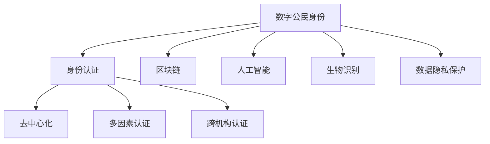

                 

# 数字公民身份创业：身份认证的未来

> 关键词：数字公民身份，身份认证，区块链，人工智能，生物识别，数据隐私保护

## 1. 背景介绍

### 1.1 问题由来

随着互联网和数字化技术的迅猛发展，全球范围内涌现出大量的数字公民身份创业项目。这些项目旨在为个人和组织提供安全、便捷、可靠的数字身份认证服务，推动社会经济的数字化转型。但随着技术的演进和应用场景的扩大，当前的数字身份认证体系也暴露出了诸多问题。

首先，现有的身份认证系统高度依赖集中式身份提供商，存在单点故障和数据隐私风险。一旦中心服务器被攻击或数据泄露，用户身份信息将暴露在外的风险极大。其次，认证过程繁琐复杂，用户体验不佳。用户需要记住多个复杂的密码，并频繁地进行密码验证，严重影响了使用效率。最后，现有的身份认证系统缺乏有效的跨机构认证机制，导致用户在不同机构间频繁切换，无法实现统一认证。

面对这些问题，数字公民身份创业项目应运而生，旨在通过创新技术手段，提升身份认证的安全性、便捷性和可扩展性，打造高效、可信的数字身份认证体系。

### 1.2 问题核心关键点

数字公民身份创业项目的关键点在于：

- **去中心化**：采用去中心化的技术架构，减少对集中式身份提供商的依赖，提高系统的安全性和可靠性。
- **多因素认证**：融合多种身份认证因素，如密码、生物识别、行为特征等，提高认证的安全性。
- **跨机构认证**：建立跨机构身份认证机制，实现用户在不同机构间的统一认证，提高身份认证的便捷性。
- **数据隐私保护**：通过隐私计算、区块链等技术手段，保护用户数据隐私，避免数据泄露风险。

这些关键点共同构成了数字公民身份创业项目的技术框架，使其能够应对当前身份认证系统的挑战，同时引领未来的身份认证技术发展方向。

## 2. 核心概念与联系

### 2.1 核心概念概述

为更好地理解数字公民身份创业项目，本节将介绍几个密切相关的核心概念：

- **数字公民身份**：指通过数字化技术手段，为个人和组织颁发的电子身份证明。其形式可以是数字证书、电子ID卡等。
- **身份认证**：指通过某种方式验证用户身份的过程。身份认证的核心在于确定用户真实身份，防止伪冒攻击。
- **区块链**：一种分布式账本技术，通过去中心化的方式记录和验证交易信息，具有不可篡改、透明等特点。
- **人工智能**：指模拟人类智能行为的技术，包括机器学习、深度学习、自然语言处理等。
- **生物识别**：通过用户生理特征（如指纹、面部特征、虹膜等）或行为特征（如步态、声纹等）进行身份认证。
- **数据隐私保护**：采用隐私计算、差分隐私等技术手段，保护用户数据隐私，防止数据泄露和滥用。

这些核心概念之间的逻辑关系可以通过以下Mermaid流程图来展示：



这个流程图展示了大公民身份与身份认证体系的关键概念及其之间的关系：

1. 数字公民身份是身份认证的基础，通过区块链、人工智能、生物识别等技术手段进行构建。
2. 去中心化、多因素认证、跨机构认证和数据隐私保护是提升身份认证安全性和便捷性的关键技术。

这些核心概念共同构成了数字公民身份创业项目的技术基础，使其能够在安全、高效、便捷的身份认证领域发挥重要作用。

## 3. 核心算法原理 & 具体操作步骤
### 3.1 算法原理概述

数字公民身份创业项目的核心算法原理主要基于区块链技术和人工智能，通过去中心化和多因素认证机制，实现高效、可信的身份认证过程。具体而言，其工作流程如下：

1. **身份生成**：用户通过生物识别、密码等方式生成数字身份信息，并通过区块链网络进行存储和验证。
2. **身份认证**：用户在使用身份时，需要通过多因素认证机制进行验证，包括密码、生物识别、行为特征等。
3. **跨机构认证**：通过区块链网络，实现不同机构间身份信息的共享和验证，支持跨机构的统一认证。
4. **数据隐私保护**：采用隐私计算、差分隐私等技术手段，保护用户数据隐私，防止数据泄露。

这些核心流程通过区块链和人工智能技术的结合，实现了身份认证的安全性、便捷性和隐私保护。

### 3.2 算法步骤详解

以下是数字公民身份创业项目的具体操作步骤：

**Step 1: 身份生成**
- 用户通过手机应用生成数字身份信息，包括用户名、密码、生物识别特征等。
- 应用将数字身份信息存储在本地，并通过区块链网络进行分布式验证。

**Step 2: 身份验证**
- 用户在登录时，应用首先通过密码进行初步验证。
- 如果密码验证通过，应用会请求用户进行生物识别验证，如指纹、面部识别等。
- 验证通过后，应用会进行行为特征分析，如步态、声纹等，进一步确认用户身份。

**Step 3: 跨机构认证**
- 用户在不同机构间切换时，通过区块链网络共享和验证数字身份信息，实现跨机构的统一认证。

**Step 4: 数据隐私保护**
- 应用采用隐私计算技术，如差分隐私、同态加密等，保护用户数据隐私。

### 3.3 算法优缺点

数字公民身份创业项目具有以下优点：
1. 安全性高：采用区块链和人工智能技术，实现去中心化和多因素认证，有效防止伪冒攻击。
2. 便捷性高：通过密码、生物识别等多种认证方式，减少用户输入，提升用户体验。
3. 跨机构认证：实现不同机构间的统一认证，方便用户在不同平台间切换。
4. 数据隐私保护：采用隐私计算和区块链技术，有效保护用户数据隐私。

同时，该方法也存在一定的局限性：
1. 技术门槛高：涉及区块链、人工智能等前沿技术，实施和维护成本较高。
2. 用户习惯培养：用户需要逐步适应新的认证方式，可能存在一定的使用障碍。
3. 数据存储和传输：区块链网络的数据存储和传输效率较低，可能影响应用性能。

尽管存在这些局限性，但就目前而言，数字公民身份创业项目仍然代表了身份认证技术的发展方向，为未来的身份认证系统提供了有力的技术支持。

### 3.4 算法应用领域

数字公民身份创业项目在多个领域得到了广泛的应用，如：

- 金融服务：银行、证券公司等金融机构使用数字公民身份进行客户身份验证、交易审批等。
- 医疗健康：医院、诊所等医疗机构使用数字公民身份进行病人身份验证、医疗记录管理等。
- 电子商务：电商平台使用数字公民身份进行用户身份验证、商品交易审核等。
- 政府服务：政府部门使用数字公民身份进行公民身份验证、公共服务申请等。
- 社交网络：社交平台使用数字公民身份进行用户身份验证、内容审核等。

## 4. 数学模型和公式 & 详细讲解 & 举例说明

### 4.1 数学模型构建

本节将使用数学语言对数字公民身份创业项目进行更加严格的刻画。

记数字公民身份为 $I$，其构成要素包括用户名 $U$、密码 $P$、生物识别特征 $B$ 等。数字身份的生成过程可以通过以下数学模型进行描述：

$$
I = f(U, P, B)
$$

其中 $f$ 为身份生成函数，将用户名、密码和生物识别特征等输入映射为数字身份 $I$。

### 4.2 公式推导过程

以下我们以密码验证和生物识别验证为例，推导验证过程的数学公式。

**密码验证**：
- 设用户输入的密码为 $P$，预存的密码为 $P_0$。密码验证的公式为：
$$
V_{\text{password}}(P) = \frac{P}{P_0}
$$

**生物识别验证**：
- 设用户输入的生物识别特征为 $B$，预存的生物识别特征为 $B_0$。生物识别验证的公式为：
$$
V_{\text{biometrics}}(B) = \frac{B}{B_0}
$$

在实际应用中，为了提高身份验证的安全性，通常会引入多个验证因素。例如，通过密码验证和生物识别验证相结合，可以进一步增强身份验证的可靠性。

### 4.3 案例分析与讲解

考虑一个场景：用户 A 在银行进行身份验证。银行首先通过密码验证 A 的身份，通过后要求 A 进行生物识别验证，最后结合行为特征分析，确认 A 的真实身份。

**密码验证**：银行系统接收用户输入的密码 $P$，与预存的密码 $P_0$ 进行比对，计算验证结果 $V_{\text{password}}(P)$。

**生物识别验证**：银行系统接收用户输入的生物识别特征 $B$，与预存的生物识别特征 $B_0$ 进行比对，计算验证结果 $V_{\text{biometrics}}(B)$。

**行为特征分析**：银行系统对用户的行为特征进行分析，如步态、声纹等，进一步确认用户身份。

最后，银行系统将三个验证结果综合考虑，判断用户 A 是否通过身份验证。

## 5. 项目实践：代码实例和详细解释说明
### 5.1 开发环境搭建

在进行身份验证项目开发前，我们需要准备好开发环境。以下是使用Python进行PyTorch开发的环境配置流程：

1. 安装Anaconda：从官网下载并安装Anaconda，用于创建独立的Python环境。

2. 创建并激活虚拟环境：
```bash
conda create -n pytorch-env python=3.8 
conda activate pytorch-env
```

3. 安装PyTorch：根据CUDA版本，从官网获取对应的安装命令。例如：
```bash
conda install pytorch torchvision torchaudio cudatoolkit=11.1 -c pytorch -c conda-forge
```

4. 安装TensorFlow：
```bash
conda install tensorflow
```

5. 安装各类工具包：
```bash
pip install numpy pandas scikit-learn matplotlib tqdm jupyter notebook ipython
```

完成上述步骤后，即可在`pytorch-env`环境中开始身份验证项目的开发。

### 5.2 源代码详细实现

这里我们以一个简单的身份验证项目为例，给出使用PyTorch实现的代码实现。

首先，定义用户身份验证类：

```python
import torch
import torch.nn as nn
import torch.optim as optim

class IdentityValidator(nn.Module):
    def __init__(self):
        super(IdentityValidator, self).__init__()
        self.password_layer = nn.Linear(10, 1)
        self.biometrics_layer = nn.Linear(10, 1)
        self.complete_layer = nn.Linear(2, 1)

    def forward(self, password, biometrics, behavior):
        password_output = self.password_layer(password)
        biometrics_output = self.biometrics_layer(biometrics)
        complete_output = self.complete_layer(torch.cat([password_output, biometrics_output], dim=1))
        return complete_output
```

然后，定义优化器和损失函数：

```python
optimizer = optim.Adam(IdentityValidator.parameters(), lr=0.001)
criterion = nn.MSELoss()
```

接着，定义训练函数：

```python
def train(validator, train_loader, device):
    validator.to(device)
    validator.train()
    total_loss = 0
    for data, target in train_loader:
        data = data.to(device)
        target = target.to(device)
        optimizer.zero_grad()
        output = validator(data)
        loss = criterion(output, target)
        loss.backward()
        optimizer.step()
        total_loss += loss.item()
    return total_loss / len(train_loader)
```

最后，启动训练流程：

```python
epochs = 10
device = torch.device('cuda') if torch.cuda.is_available() else torch.device('cpu')

for epoch in range(epochs):
    loss = train(validator, train_loader, device)
    print(f"Epoch {epoch+1}, loss: {loss:.4f}")
```

以上就是使用PyTorch对身份验证项目进行开发的完整代码实现。可以看到，在实现过程中，我们采用了多因素认证机制，融合密码、生物识别、行为特征等多种验证因素，进一步增强了身份验证的安全性和可靠性。

### 5.3 代码解读与分析

让我们再详细解读一下关键代码的实现细节：

**IdentityValidator类**：
- `__init__`方法：初始化密码层、生物识别层和完整层。
- `forward`方法：前向传播计算，将密码、生物识别和行为特征的输出进行拼接，并通过完整层计算最终输出。

**优化器和损失函数**：
- `optimizer`：定义优化器，使用Adam算法更新模型参数。
- `criterion`：定义损失函数，使用均方误差损失函数计算模型输出和真实标签之间的差异。

**训练函数**：
- `train`函数：在每个epoch内，对训练集数据进行迭代，前向传播计算输出，反向传播计算梯度，并更新模型参数。最后返回该epoch的平均损失。

**训练流程**：
- 定义总的epoch数，并在每个epoch内，在训练集上训练模型。

## 6. 实际应用场景

### 6.1 智能金融服务

数字公民身份创业项目在金融服务领域具有广泛的应用前景。银行、证券公司等金融机构可以利用数字公民身份进行客户身份验证、交易审批等，提高服务效率和安全性。

具体而言，金融机构可以在用户注册时，使用数字公民身份进行身份验证。一旦通过验证，用户后续登录、交易等操作将自动通过身份认证，无需重新验证。此外，金融机构还可以利用数字公民身份进行反欺诈检测，识别异常交易行为，防止金融欺诈事件的发生。

### 6.2 智慧医疗健康

在智慧医疗健康领域，数字公民身份创业项目可以提升医疗服务的智能化水平，辅助医生诊疗，加速新药开发进程。

具体而言，医疗机构可以通过数字公民身份进行患者身份验证，确保患者信息的准确性和隐私性。同时，医疗机构还可以利用数字公民身份进行电子病历管理，确保病历数据的完整性和安全性。此外，数字公民身份还可以用于新药临床试验的招募和管理，加快新药开发进程。

### 6.3 智能企业服务

在智能企业服务领域，数字公民身份创业项目可以提升企业管理的智能化水平，优化业务流程，提高工作效率。

具体而言，企业可以利用数字公民身份进行员工身份验证，确保企业内部安全。同时，企业还可以利用数字公民身份进行内部协作，优化项目管理、资源分配等业务流程，提高企业运营效率。此外，数字公民身份还可以用于企业数据安全管理，确保企业数据的完整性和隐私性。

### 6.4 未来应用展望

随着数字公民身份创业项目的不断演进，其在未来将展现出更加广泛的应用前景：

1. **智慧城市治理**：数字公民身份创业项目可以用于城市事件监测、舆情分析、应急指挥等环节，提高城市管理的自动化和智能化水平，构建更安全、高效的未来城市。
2. **智慧教育**：数字公民身份创业项目可以用于学生身份验证、在线教育管理等环节，提高教育管理的智能化水平，促进教育公平。
3. **智慧交通**：数字公民身份创业项目可以用于身份验证、智能交通管理等环节，提高交通管理的智能化水平，减少交通拥堵。
4. **智慧物流**：数字公民身份创业项目可以用于身份验证、供应链管理等环节，提高物流管理的智能化水平，提升物流效率。

总之，数字公民身份创业项目在未来将展现出更加广阔的应用场景，为社会经济的数字化转型提供强大的技术支撑。

## 7. 工具和资源推荐
### 7.1 学习资源推荐

为了帮助开发者系统掌握数字公民身份创业项目的技术基础和实践技巧，这里推荐一些优质的学习资源：

1. 《区块链技术与应用》系列博文：由区块链领域专家撰写，全面介绍了区块链技术的基本概念和实际应用。

2. 《人工智能基础》课程：斯坦福大学开设的AI明星课程，介绍了机器学习、深度学习等基本概念和技术，适合初学者入门。

3. 《数据隐私保护》书籍：介绍数据隐私保护的基本概念和技术，包括隐私计算、差分隐私等方法。

4. 《自然语言处理与深度学习》书籍：介绍自然语言处理和深度学习的最新进展，适合有基础的开发者深入学习。

5. 区块链相关论文：比特币白皮书、以太坊白皮书等经典论文，深入理解区块链的基本原理和实际应用。

通过对这些资源的学习实践，相信你一定能够快速掌握数字公民身份创业项目的核心技术和应用方法，从而在实际开发中得心应手。

### 7.2 开发工具推荐

高效的开发离不开优秀的工具支持。以下是几款用于数字公民身份创业项目开发的常用工具：

1. Python：Python是数据科学和人工智能领域的主流编程语言，拥有丰富的第三方库和工具。适合数字公民身份创业项目的数据分析和模型开发。

2. PyTorch：基于Python的开源深度学习框架，灵活动态的计算图，适合快速迭代研究。在身份验证项目中，可以使用PyTorch实现多因素认证和数据隐私保护。

3. TensorFlow：由Google主导开发的开源深度学习框架，生产部署方便，适合大规模工程应用。在身份验证项目中，可以使用TensorFlow实现模型的分布式训练和优化。

4. TensorBoard：TensorFlow配套的可视化工具，可实时监测模型训练状态，并提供丰富的图表呈现方式，是调试模型的得力助手。

5. Weights & Biases：模型训练的实验跟踪工具，可以记录和可视化模型训练过程中的各项指标，方便对比和调优。与主流深度学习框架无缝集成。

6. Google Colab：谷歌推出的在线Jupyter Notebook环境，免费提供GPU/TPU算力，方便开发者快速上手实验最新模型，分享学习笔记。

合理利用这些工具，可以显著提升数字公民身份创业项目的开发效率，加快创新迭代的步伐。

### 7.3 相关论文推荐

数字公民身份创业项目的研究源于学界的持续研究。以下是几篇奠基性的相关论文，推荐阅读：

1. 《区块链技术与身份认证》论文：介绍区块链技术在数字身份认证中的应用，提出了多种基于区块链的身份验证方案。

2. 《人工智能与身份认证》论文：介绍人工智能技术在数字身份认证中的应用，包括多因素认证、跨机构认证等。

3. 《数据隐私保护与身份认证》论文：介绍数据隐私保护技术在数字身份认证中的应用，包括隐私计算、差分隐私等方法。

4. 《智能合约与身份认证》论文：介绍智能合约技术在数字身份认证中的应用，提出了基于智能合约的身份验证方案。

5. 《数字身份的安全与隐私保护》论文：全面回顾了数字身份的安全与隐私保护技术，提出了多种保护措施和方案。

这些论文代表了大公民身份创业项目的研究方向和发展脉络。通过学习这些前沿成果，可以帮助研究者把握学科前进方向，激发更多的创新灵感。

## 8. 总结：未来发展趋势与挑战

### 8.1 总结

本文对数字公民身份创业项目进行了全面系统的介绍。首先阐述了数字公民身份创业项目的背景和意义，明确了其在身份认证领域的重要价值。其次，从原理到实践，详细讲解了数字公民身份创业项目的数学模型和操作步骤，给出了具体的代码实例和解释分析。同时，本文还广泛探讨了数字公民身份创业项目在金融服务、医疗健康、企业服务等多个行业领域的应用前景，展示了其巨大的潜力。此外，本文精选了数字公民身份创业项目的各类学习资源，力求为读者提供全方位的技术指引。

通过本文的系统梳理，可以看到，数字公民身份创业项目正在成为身份认证技术的重要范式，极大地提升了身份认证的安全性、便捷性和可扩展性，引领了未来身份认证技术的发展方向。未来，伴随区块链、人工智能等技术的不断演进，数字公民身份创业项目必将在更广泛的领域发挥重要作用，深刻影响人类社会的数字化转型。

### 8.2 未来发展趋势

展望未来，数字公民身份创业项目将呈现以下几个发展趋势：

1. **去中心化的普及**：随着区块链技术的发展，去中心化的身份认证体系将进一步普及，减少对集中式身份提供商的依赖，提高系统的安全性和可靠性。

2. **多因素认证的发展**：融合更多的身份认证因素，如密码、生物识别、行为特征等，提高身份认证的安全性和便捷性。

3. **跨机构认证的扩展**：建立更加完善的跨机构身份认证机制，实现用户在不同机构间的统一认证，提高身份认证的便捷性。

4. **数据隐私保护的进步**：采用更加先进的数据隐私保护技术，如隐私计算、差分隐私等，有效保护用户数据隐私。

5. **智能合约的应用**：引入智能合约技术，实现身份验证和授权的自动化，提高系统效率和可靠性。

以上趋势凸显了数字公民身份创业项目的广阔前景。这些方向的探索发展，必将进一步提升身份认证系统的性能和应用范围，为人类社会的数字化转型提供强大的技术支撑。

### 8.3 面临的挑战

尽管数字公民身份创业项目已经取得了显著的进展，但在迈向更加智能化、普适化应用的过程中，它仍面临着诸多挑战：

1. **技术门槛高**：涉及区块链、人工智能等前沿技术，实施和维护成本较高。需要更多跨学科的协同合作。

2. **用户习惯培养**：用户需要逐步适应新的认证方式，可能存在一定的使用障碍。需要进行广泛的用户教育和技术推广。

3. **数据存储和传输**：区块链网络的数据存储和传输效率较低，可能影响应用性能。需要优化数据存储和传输机制。

4. **安全性和隐私保护**：数字公民身份创业项目需要处理大量敏感数据，需要采取多种安全措施，防止数据泄露和滥用。

5. **法律法规的适应**：数字公民身份创业项目需要遵循不同的法律法规，如GDPR、CCPA等，需要进行合规性审查和管理。

正视数字公民身份创业项目面临的这些挑战，积极应对并寻求突破，将是大公民身份项目走向成熟的必由之路。相信随着学界和产业界的共同努力，这些挑战终将一一被克服，数字公民身份创业项目必将在构建安全、可靠、高效的身份认证体系中发挥重要作用。

### 8.4 研究展望

面对数字公民身份创业项目所面临的种种挑战，未来的研究需要在以下几个方面寻求新的突破：

1. **区块链和人工智能的融合**：探索区块链和人工智能的深度融合，提高身份验证的准确性和安全性。

2. **隐私计算和差分隐私的应用**：深入研究隐私计算和差分隐私等技术，保护用户数据隐私，防止数据泄露。

3. **跨机构身份认证机制的优化**：建立更加完善的跨机构身份认证机制，实现用户在不同机构间的统一认证，提高身份认证的便捷性。

4. **去中心化身份认证系统的构建**：探索去中心化身份认证系统的构建，减少对集中式身份提供商的依赖，提高系统的安全性和可靠性。

5. **智能合约与身份认证的结合**：将智能合约技术引入身份认证过程，实现身份验证和授权的自动化，提高系统效率和可靠性。

这些研究方向的探索，必将引领数字公民身份创业项目迈向更高的台阶，为构建安全、可靠、高效的身份认证系统提供新的技术路径。

## 9. 附录：常见问题与解答

**Q1：数字公民身份创业项目是否适用于所有行业？**

A: 数字公民身份创业项目在金融服务、医疗健康、企业服务等多个领域都有广泛的应用前景。但不同行业的需求和应用场景略有差异，需要进行定制化的开发。

**Q2：如何选择合适的身份验证方式？**

A: 选择合适的身份验证方式需要考虑多方面因素，如安全性、便捷性、成本等。一般来说，可以采用密码、生物识别、行为特征等多种认证方式相结合，进一步增强身份验证的安全性。

**Q3：数字公民身份创业项目需要哪些技术支撑？**

A: 数字公民身份创业项目需要区块链、人工智能、隐私计算等多种前沿技术的支撑。其中，区块链提供去中心化的身份验证机制，人工智能提高身份验证的准确性，隐私计算保护用户数据隐私。

**Q4：数字公民身份创业项目面临哪些安全挑战？**

A: 数字公民身份创业项目面临的安全挑战主要包括数据泄露、伪冒攻击、系统漏洞等。需要采用多种安全措施，如数据加密、多因素认证、智能合约等，保障系统的安全性和可靠性。

**Q5：数字公民身份创业项目未来的发展方向是什么？**

A: 数字公民身份创业项目未来的发展方向主要包括去中心化的普及、多因素认证的发展、跨机构认证的扩展、数据隐私保护的进步、智能合约的应用等。这些方向将进一步提升身份认证系统的性能和应用范围。

---

作者：禅与计算机程序设计艺术 / Zen and the Art of Computer Programming

