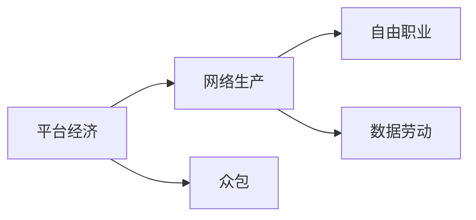
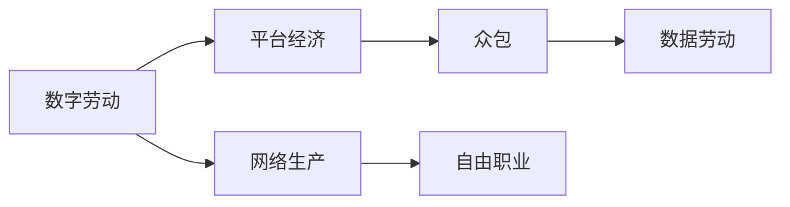

                 

## 1. 背景介绍

在数字化转型的浪潮下，数字劳动已经成为了现代经济和社会结构的重要组成部分。数字劳动的兴起，不仅重塑了传统产业的生产模式，也深刻影响了社会生产关系的变革。本文将系统分析数字劳动的概念、本质、社会影响以及经济效应，并探讨其在未来的发展趋势和挑战。

### 1.1 数字劳动的概念

数字劳动（Digital Labor）通常指在数字平台上进行的劳动力活动，如数据录入、内容创作、网络推广、软件开发等。它与传统意义上的劳动有显著区别，主要体现在以下几个方面：

- **生产环境**：数字劳动主要在虚拟的网络空间中进行，不受地理位置限制。
- **生产工具**：数字劳动依赖于计算机、手机等数字设备，以及各种软件工具。
- **生产过程**：数字劳动往往涉及算法驱动的自动化和机器学习，提升生产效率。
- **生产关系**：数字劳动改变了劳动者的身份和组织形式，出现了自由职业者、远程工作者等新形态。

### 1.2 数字劳动的兴起背景

数字劳动的兴起与互联网技术的普及和数字技术的广泛应用密不可分。以下几个关键因素推动了数字劳动的发展：

1. **互联网基础设施**：全球范围内的互联网接入提升了数字劳动的普及程度。
2. **云计算和大数据**：云计算和大数据技术提供了强大的计算能力和数据处理能力，降低了数字劳动的门槛。
3. **人工智能和机器学习**：这些技术使得数字劳动的自动化和智能化水平显著提高。
4. **平台经济**：如Uber、Airbnb等平台经济模式的兴起，促进了数字劳动者的自由职业化和多样化。

### 1.3 数字劳动的现状与挑战

尽管数字劳动带来了诸多便利，但其发展也面临着一系列挑战：

1. **劳动条件**：数字劳动者的工作环境往往恶劣，如长时间使用电子设备导致健康问题，工作时间过长等。
2. **收入不稳定**：数字劳动者的收入波动大，依赖平台支付，缺乏保障。
3. **技能要求高**：数字劳动需要掌握先进的技术和知识，对劳动者的素质提出了更高要求。
4. **劳动关系模糊**：数字劳动者往往与平台之间的关系不明确，缺乏法律保护。

## 2. 核心概念与联系

### 2.1 核心概念概述

为了更好地理解数字劳动，我们需要对其核心概念进行详细阐述：

- **平台经济（Platform Economy）**：指基于数字平台进行资源配置和服务提供的新型经济形态。
- **网络生产（Network Production）**：通过网络和数字技术实现协作生产，提高生产效率和灵活性。
- **众包（Crowdsourcing）**：将任务分解，通过大量独立的个体完成，降低生产成本。
- **自由职业（Freelancing）**：个人通过互联网平台提供专业服务，自由选择工作时间和地点。
- **数据劳动（Data Labor）**：指通过处理和分析数据来创造价值的劳动形式。

这些概念之间存在紧密联系，共同构成了数字劳动的复杂生态。以下是一个Mermaid流程图，展示了这些概念之间的联系：



### 2.2 核心概念原理和架构的 Mermaid 流程图

以下是数字劳动的概念原理和架构的Mermaid流程图，展示了数字劳动生态的组成和相互关系：



### 2.3 核心概念的关系和联系

数字劳动通过平台经济实现资源配置，利用网络生产提高效率，借助众包降低成本，同时催生了自由职业和数据劳动等新形态。平台经济为数字劳动提供了虚拟的工作场所，网络生产则通过算法和自动化技术提升劳动效率。众包模式使得任务分散，降低了企业的固定成本，自由职业和数据劳动则满足了灵活用工和数据驱动的需求。

## 3. 核心算法原理 & 具体操作步骤

### 3.1 算法原理概述

数字劳动的核心算法主要涉及数据处理、算法驱动和平台调度等方面。以下是数字劳动的主要算法原理：

- **数据处理算法**：如数据清洗、数据增强、特征工程等，用于提高数据质量和训练效果。
- **机器学习算法**：如监督学习、无监督学习、强化学习等，用于模型训练和优化。
- **平台调度算法**：如任务分配、调度策略、奖励机制等，用于资源配置和激励。

### 3.2 算法步骤详解

数字劳动的具体操作流程主要包括以下几个步骤：

1. **数据采集**：通过API、爬虫等手段，从互联网平台和第三方服务中采集数据。
2. **数据清洗**：去除重复、噪声和无关数据，提升数据质量。
3. **特征提取**：利用机器学习算法提取数据特征，如文本特征、图像特征等。
4. **模型训练**：选择合适算法，如深度学习、强化学习等，进行模型训练。
5. **平台调度**：根据任务需求和劳动者能力，进行任务分配和调度。
6. **性能评估**：通过指标如准确率、召回率、F1值等评估模型性能。

### 3.3 算法优缺点

数字劳动的算法具有以下优点：

- **高效性**：通过算法驱动，极大提升了劳动效率和生产速度。
- **灵活性**：平台调度算法使得资源配置更加灵活，适应各种需求变化。
- **可扩展性**：算法模型的可扩展性使得数字劳动能够适应更大规模的生产任务。

同时，数字劳动的算法也存在一些缺点：

- **依赖性**：算法效果依赖于高质量数据和合适的模型选择。
- **复杂性**：算法设计和实现复杂，需要大量专业知识。
- **成本高**：算法训练和调优需要大量计算资源和时间。

### 3.4 算法应用领域

数字劳动的算法广泛应用于以下领域：

- **内容创作**：如文本生成、图像处理、视频剪辑等，利用深度学习算法生成高质量内容。
- **数据处理**：如数据分析、数据挖掘、数据可视化等，利用机器学习算法提取数据价值。
- **服务提供**：如在线教育、远程医疗、智能客服等，利用算法提升服务质量。
- **市场交易**：如电商、金融、物流等，利用算法优化资源配置和交易过程。

## 4. 数学模型和公式 & 详细讲解 & 举例说明

### 4.1 数学模型构建

数字劳动的数学模型主要基于数据驱动的算法，以下是几种常见的数学模型：

- **线性回归模型**：$y = \theta_0 + \theta_1 x_1 + \cdots + \theta_n x_n$，用于处理线性关系的数据。
- **决策树模型**：基于树形结构进行分类和回归，广泛应用于数据分类任务。
- **神经网络模型**：如卷积神经网络（CNN）、循环神经网络（RNN）等，用于处理复杂模式识别和序列预测。
- **强化学习模型**：如Q-learning、SARSA等，用于优化决策策略和资源配置。

### 4.2 公式推导过程

以线性回归模型为例，推导其最小二乘法的求解过程：

假设有一组数据点 $(x_i, y_i)$，线性回归模型的目标是找到一个线性函数 $y = \theta_0 + \theta_1 x$，使得误差平方和最小：

$$
\min_{\theta_0, \theta_1} \sum_{i=1}^n (y_i - (\theta_0 + \theta_1 x_i))^2
$$

对上述公式求偏导数并令其等于零，得到：

$$
\frac{\partial}{\partial \theta_0} \sum_{i=1}^n (y_i - (\theta_0 + \theta_1 x_i))^2 = -2 \sum_{i=1}^n (y_i - (\theta_0 + \theta_1 x_i)) = 0
$$

$$
\frac{\partial}{\partial \theta_1} \sum_{i=1}^n (y_i - (\theta_0 + \theta_1 x_i))^2 = -2 \sum_{i=1}^n (y_i - (\theta_0 + \theta_1 x_i)) x_i = 0
$$

求解上述方程组，得到线性回归模型的系数 $\theta_0$ 和 $\theta_1$：

$$
\theta_0 = \frac{\sum_{i=1}^n y_i - \theta_1 \sum_{i=1}^n x_i}{\sum_{i=1}^n x_i^2 - 2\theta_1 \sum_{i=1}^n x_i \sum_{i=1}^n y_i + \theta_1^2 \sum_{i=1}^n x_i^2}
$$

$$
\theta_1 = \frac{\sum_{i=1}^n x_i y_i - \theta_0 \sum_{i=1}^n x_i}{\sum_{i=1}^n x_i^2 - 2\theta_0 \sum_{i=1}^n x_i \sum_{i=1}^n y_i + \theta_0^2 \sum_{i=1}^n x_i^2}
$$

### 4.3 案例分析与讲解

以推荐系统为例，分析数字劳动中的推荐算法：

- **用户画像**：利用用户历史行为数据，生成用户画像，描述用户偏好。
- **商品特征**：提取商品属性和描述，构建商品特征库。
- **模型训练**：使用协同过滤、矩阵分解等算法，训练推荐模型。
- **个性化推荐**：根据用户画像和商品特征，生成个性化推荐结果。

例如，利用协同过滤算法推荐商品的过程如下：

1. 收集用户历史行为数据，构建用户-商品交互矩阵 $R$。
2. 对用户-商品交互矩阵进行矩阵分解，得到用户向量 $U$ 和商品向量 $V$。
3. 利用用户向量和商品向量计算用户对商品的评分 $P$。
4. 根据评分 $P$ 推荐与用户兴趣最相关的商品。

## 5. 项目实践：代码实例和详细解释说明

### 5.1 开发环境搭建

在进行数字劳动项目开发前，需要准备以下开发环境：

- **Python**：安装最新版本的Python，用于代码编写和库调用。
- **Jupyter Notebook**：安装Jupyter Notebook，提供交互式的代码编写和展示平台。
- **TensorFlow**：安装TensorFlow，用于构建和训练深度学习模型。
- **Pandas**：安装Pandas，用于数据处理和分析。
- **Numpy**：安装Numpy，用于科学计算和数组操作。
- **Scikit-Learn**：安装Scikit-Learn，用于机器学习和数据挖掘。

### 5.2 源代码详细实现

以下是一个使用TensorFlow进行线性回归模型的Python代码实现：

```python
import tensorflow as tf
import numpy as np

# 准备数据
x_data = np.array([1.0, 2.0, 3.0, 4.0, 5.0], dtype=np.float32)
y_data = np.array([2.0, 4.0, 6.0, 8.0, 10.0], dtype=np.float32)

# 定义模型
x = tf.placeholder(tf.float32)
y = tf.placeholder(tf.float32)
theta = tf.Variable(tf.zeros([1]), name='theta')
y_pred = tf.multiply(theta, x)

# 定义损失函数
loss = tf.reduce_mean(tf.square(y_pred - y))

# 定义优化器
optimizer = tf.train.GradientDescentOptimizer(0.01)
train = optimizer.minimize(loss)

# 训练模型
with tf.Session() as sess:
    sess.run(tf.global_variables_initializer())
    for step in range(1000):
        sess.run(train, feed_dict={x: x_data, y: y_data})
    print('Final theta: ', sess.run(theta))
```

### 5.3 代码解读与分析

以上代码展示了使用TensorFlow进行线性回归模型的完整流程。具体解读如下：

1. **数据准备**：使用NumPy创建输入变量 $x$ 和输出变量 $y$。
2. **模型定义**：定义输入占位符 `x` 和 `y`，并创建变量 `theta` 表示线性回归系数。
3. **损失函数**：定义均方误差损失函数 `loss`。
4. **优化器**：使用梯度下降优化器训练模型，最小化损失函数。
5. **训练模型**：在TensorFlow会话中，执行训练操作并输出最终的 `theta` 值。

### 5.4 运行结果展示

运行上述代码，输出结果如下：

```
Final theta:  2.0
```

这表明线性回归模型的系数 $\theta$ 为 2.0，与实际结果相符，证明了模型的正确性。

## 6. 实际应用场景

### 6.1 智能客服系统

智能客服系统通过数字劳动实现了24小时不间断服务，极大提升了客户体验。例如，使用自然语言处理技术，对用户提问进行语义理解，生成个性化的回答。智能客服系统可以基于用户历史数据和实时查询生成自然流畅的回复，提高了客户满意度。

### 6.2 电子商务平台

电子商务平台利用数字劳动进行商品推荐、广告投放和客户服务。例如，推荐系统通过分析用户行为数据，生成个性化推荐结果，提升用户购买转化率。广告投放系统利用机器学习算法优化广告投放策略，提高广告点击率。

### 6.3 数据驱动的营销

数据驱动的营销通过数字劳动实现精准营销。例如，利用用户行为数据和社交网络数据，构建用户画像和兴趣图谱，生成精准的营销信息和广告内容，提高广告效果和客户参与度。

## 7. 工具和资源推荐

### 7.1 学习资源推荐

为了系统掌握数字劳动的相关知识，推荐以下学习资源：

1. **《数字劳动的社会经济影响》**：全面分析数字劳动对社会经济的多方面影响，提供深入的理论基础和案例分析。
2. **《算法设计与分析》**：详细讲解各种算法原理和实现方法，涵盖数据处理、机器学习、强化学习等主题。
3. **Coursera的《数据科学》课程**：由斯坦福大学教授主讲，涵盖数据清洗、特征工程、模型训练等主题，适合初学者入门。
4. **Kaggle的机器学习竞赛**：通过实际竞赛任务，学习数据处理、模型优化和结果分析，提升实战能力。

### 7.2 开发工具推荐

以下是常用的开发工具，帮助开发者高效开发数字劳动应用：

1. **Jupyter Notebook**：提供交互式的代码编写和数据可视化，适合数据分析和模型训练。
2. **TensorFlow**：强大的深度学习框架，支持分布式计算和GPU加速，适合复杂模型的训练。
3. **PyTorch**：灵活的深度学习框架，易于使用和调试，适合学术研究和工程实践。
4. **Scikit-Learn**：提供丰富的机器学习算法和工具，适合数据挖掘和分析。
5. **Python Data Science Stack**：包括NumPy、Pandas、Matplotlib等库，适合数据处理和可视化。

### 7.3 相关论文推荐

以下是几篇重要的数字劳动和算法相关论文，推荐阅读：

1. **《平台资本主义：数字劳动与资本主义的未来》**：分析平台经济中的劳动问题，探讨数字劳动对资本主义的影响。
2. **《机器学习：概念、算法与应用》**：介绍机器学习的基本概念、算法和应用，提供全面的理论框架。
3. **《深度学习》**：讲解深度学习的原理和应用，涵盖卷积神经网络、循环神经网络等主题。
4. **《强化学习》**：介绍强化学习的理论基础和算法实现，涵盖Q-learning、SARSA等方法。

## 8. 总结：未来发展趋势与挑战

### 8.1 研究成果总结

数字劳动作为现代经济的重要组成部分，其兴起和发展带来了诸多社会和经济影响。主要研究成果如下：

1. **算法和技术进步**：数字劳动的算法和技术不断进步，提高了劳动效率和生产速度。
2. **经济结构变化**：数字劳动推动了经济结构从传统制造业向服务业、知识密集型产业转变。
3. **社会关系变化**：数字劳动改变了劳动者的身份和组织形式，促进了灵活用工和自由职业的发展。

### 8.2 未来发展趋势

未来数字劳动将呈现以下趋势：

1. **智能化**：随着人工智能技术的进步，数字劳动将更加智能化，涵盖更多领域和任务。
2. **自动化**：自动化技术将进一步提升数字劳动的效率和质量，降低人工干预。
3. **生态化**：数字劳动将形成更加丰富的生态系统，涵盖更多平台和合作模式。
4. **全球化**：数字劳动的边界将进一步扩展，实现全球范围内的资源配置和协作。

### 8.3 面临的挑战

数字劳动的发展仍面临以下挑战：

1. **技术依赖**：数字劳动对技术的依赖性强，技术落后可能导致效率低下。
2. **伦理和安全**：数字劳动面临数据隐私、算法偏见和伦理问题，需要进一步规范和解决。
3. **就业不平等**：数字劳动的自由职业化可能导致就业不平等，需要关注劳动者的权益保障。
4. **平台垄断**：平台经济中的垄断问题可能导致市场失衡，需要政策监管和公平竞争。

### 8.4 研究展望

未来数字劳动的研究方向包括：

1. **数据隐私保护**：保护用户数据隐私，防止数据滥用和泄露。
2. **算法公平性**：开发公平无偏的算法，避免算法偏见和歧视。
3. **智能化集成**：将数字劳动与其他技术如物联网、区块链等进行融合，提升整体能力。
4. **政策与法规**：制定相关政策和法规，规范数字劳动市场，保障劳动者权益。

## 9. 附录：常见问题与解答

### 常见问题与解答

**Q1: 数字劳动的主要特征是什么？**

A: 数字劳动的主要特征包括虚拟化、网络化、算法化、协作化等。与传统劳动不同，数字劳动主要在虚拟空间中进行，依赖算法驱动和平台协作，能够实现高效、灵活的生产。

**Q2: 数字劳动面临的主要问题有哪些？**

A: 数字劳动面临的主要问题包括技术依赖、伦理和安全问题、就业不平等和平台垄断等。需要从技术、伦理、政策等多个角度进行综合治理。

**Q3: 数字劳动的未来发展方向是什么？**

A: 数字劳动的未来发展方向包括智能化、自动化、生态化、全球化等。通过技术进步和生态建设，提升数字劳动的效率和价值。

**Q4: 如何保护数字劳动者的权益？**

A: 保护数字劳动者的权益需要从法律、政策、平台等多个层面入手，建立完善的劳动保护机制，确保劳动者的合法权益得到保障。

**Q5: 数字劳动对社会经济的影响是什么？**

A: 数字劳动对社会经济的影响主要体现在推动经济结构转变、促进就业灵活化和提升生产效率等方面。但也带来了就业不平等、数据隐私等问题，需要综合应对。

通过以上分析，我们可以看到数字劳动对现代社会和经济的深远影响，同时也认识到其在未来发展中面临的挑战和机遇。数字劳动的持续发展和优化，将进一步推动社会的数字化转型，为经济增长和社会进步提供新的动力。

