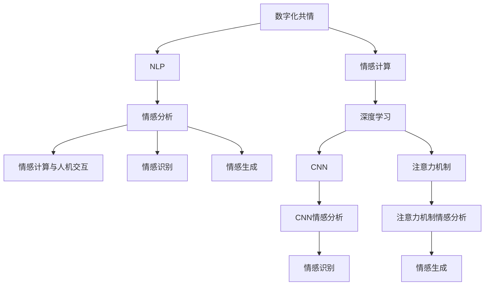

                 

# 数字化共情：AI辅助的情感连接

> 关键词：数字化共情, AI辅助, 情感连接, 自然语言处理(NLP), 深度学习, 卷积神经网络(CNN), 注意力机制(Attention), 情感分析, 情感计算

## 1. 背景介绍

### 1.1 问题由来
数字化时代的到来，极大地改变了人们的生活和工作方式。随之而来的是人们对数字技术的依赖日益增强，对于情感的表达和理解也越来越多地依赖于数字媒介。然而，数字媒介在传递情感信息时，往往缺乏人类互动的细腻和深度，导致数字交往中的情感连接断裂。为了填补这一空白，AI辅助的情感连接技术应运而生。

### 1.2 问题核心关键点
AI辅助的情感连接技术旨在通过数字化手段，帮助人们更好地理解和表达情感，增强人与人之间的情感交流。其核心在于利用深度学习和自然语言处理技术，识别和分析用户的情感信息，并提供个性化的情感支持。这一技术的应用领域广泛，涉及社交媒体、在线客服、心理健康咨询等多个场景。

### 1.3 问题研究意义
AI辅助的情感连接技术具有以下几方面重要的研究意义：

1. **提升用户体验**：在社交媒体、在线客服等场景中，通过情感分析技术，能够更好地理解用户需求，提供个性化服务，提升用户体验。
2. **促进心理健康**：在心理健康咨询中，AI辅助技术可以帮助分析用户的情感状态，提供情感支持，减轻心理压力。
3. **增强社会连接**：在虚拟社交中，通过情感识别和智能推荐，增强人与人之间的情感连接，减少孤独感和疏离感。
4. **推动情感计算研究**：情感计算是人工智能研究的前沿领域，AI辅助情感连接技术的深入研究将推动情感计算的发展。

## 2. 核心概念与联系

### 2.1 核心概念概述

为了更好地理解AI辅助情感连接技术的核心概念及其相互关系，本节将简要介绍几个关键概念：

- **数字化共情**：指通过数字化手段，模拟人类的情感理解和表达过程，实现情感连接的增强。
- **情感计算**：指利用计算机技术，特别是人工智能和心理学理论，识别、理解、模拟和引导情感的研究领域。
- **自然语言处理(NLP)**：涉及计算机对自然语言的理解、处理和生成，是实现情感计算和情感连接的基础技术。
- **深度学习**：一种模拟人脑神经网络的技术，通过多层神经网络的学习，实现对复杂数据模式的识别和预测。
- **卷积神经网络(CNN)**：一种深度学习模型，特别适用于图像处理任务，但其在情感分析中也展现了强大的能力。
- **注意力机制(Attention)**：指在深度学习模型中，通过学习数据中不同部分的相关性，分配计算资源和信息关注度的技术。
- **情感分析**：指通过文本或语音等数据，识别和分析情感状态的技术，是情感计算的重要组成部分。
- **情感计算与人机交互**：情感计算技术不仅应用于情感识别和理解，还涉及到如何通过机器实现对人类情感的智能化响应。

这些概念通过以下Mermaid流程图连接起来：



这个流程图展示了情感计算和情感连接的几个核心环节及其相互关系：

1. 数字化共情通过自然语言处理技术，理解并生成情感信息。
2. 自然语言处理利用深度学习技术，特别是卷积神经网络和注意力机制，提升情感分析的准确性。
3. 情感计算通过情感分析，模拟和引导情感，增强人机交互的情感连接。

## 3. 核心算法原理 & 具体操作步骤

### 3.1 算法原理概述

AI辅助情感连接技术的核心在于情感分析。情感分析主要通过自然语言处理技术，识别和分析文本中的情感信息。其算法原理可以概述为以下几个步骤：

1. **数据预处理**：将文本数据转换为模型可处理的格式，如分词、去除停用词、词干提取等。
2. **特征提取**：从预处理后的文本中提取情感特征，如情感词汇、句法结构、情感强度等。
3. **情感分类**：利用机器学习或深度学习模型，对文本的情感进行分类，如正向情感、负向情感、中性情感等。
4. **情感强度分析**：量化情感的强度，提供更加细致的情感表达。

### 3.2 算法步骤详解

接下来，我们详细讲解情感分析的具体步骤：

**Step 1: 数据预处理**
- 使用分词器将文本分词，如中文的jieba分词、英文的NLTK分词。
- 去除停用词，保留有情感信息的词汇。
- 进行词干提取，将单词还原为词根形式。

**Step 2: 特征提取**
- 使用情感词典，统计文本中情感词汇的出现频率，如中文的情感词典、英文的AFINN词典。
- 分析句法结构，如使用依存句法分析器，分析情感词汇的语义关系。
- 计算情感强度，如使用情感词典的情感极性得分。

**Step 3: 情感分类**
- 使用机器学习算法，如朴素贝叶斯、支持向量机等，对文本进行情感分类。
- 使用深度学习模型，如卷积神经网络(CNN)、递归神经网络(RNN)、Transformer等，对文本进行情感分类。

**Step 4: 情感强度分析**
- 将文本的情感强度表示为数值，如使用线性回归模型，将情感极性得分映射为情感强度得分。
- 使用注意力机制，学习文本中不同部分的情感贡献度，综合计算情感强度。

### 3.3 算法优缺点

AI辅助情感连接技术具有以下优点：

1. **高精度**：深度学习模型在情感分类和强度分析中，通常比传统机器学习算法具有更高的准确性。
2. **可扩展性**：该技术可以应用于多种语言和多种文本格式，具有广泛的应用前景。
3. **实时性**：情感分析算法可以实时处理文本数据，提供即时情感反馈。
4. **用户隐私保护**：情感分析技术不涉及用户隐私信息，应用场景更为安全。

但该技术也存在一些缺点：

1. **数据依赖**：情感分析依赖于高质量的情感词典和标注数据，数据收集和预处理较为复杂。
2. **语言多样性**：不同语言和文化背景下的情感表达方式不同，情感词典的普适性受到限制。
3. **上下文理解**：单一的文本分析难以捕捉情感的上下文语境，影响情感分析的准确性。
4. **对抗攻击**：恶意用户可能通过文本伪装手段，误导情感分析结果。

### 3.4 算法应用领域

AI辅助情感连接技术在多个领域都有广泛应用，具体包括：

- **社交媒体分析**：通过情感分析，监控社交媒体上的情感倾向，及时响应网络舆情。
- **在线客服系统**：在客户咨询过程中，实时分析用户的情感状态，提供情感支持。
- **心理健康咨询**：在心理健康咨询中，通过情感分析，提供个性化心理健康建议。
- **情感广告投放**：在广告投放中，利用情感分析技术，精准投放具有情感共鸣的广告内容。
- **智能家居应用**：通过情感识别，实现智能家居设备的情感响应，提升用户交互体验。

## 4. 数学模型和公式 & 详细讲解  
### 4.1 数学模型构建

本节将使用数学语言对情感分析的算法过程进行更加严格的描述。

设文本数据为 $X=\{x_1, x_2, ..., x_n\}$，其中每个文本 $x_i$ 表示为 $x_i = \{x_{i1}, x_{i2}, ..., x_{im}\}$，$m$ 为文本长度。设情感词典为 $D=\{(d_1, w_1), (d_2, w_2), ..., (d_k, w_k)\}$，其中 $d_i$ 为情感词汇，$w_i$ 为情感权重。

定义情感特征函数 $f: X \rightarrow \mathbb{R}^k$，计算文本的情感特征向量 $f(x_i)$。在情感分类模型中，我们通常使用softmax函数将情感特征向量映射到概率分布上，即：

$$
P(y|x_i) = \text{softmax}(Wf(x_i) + b)
$$

其中 $W$ 为权重矩阵，$b$ 为偏置向量。$y$ 为情感分类标签，$P(y|x_i)$ 为情感分类的概率。

### 4.2 公式推导过程

以下是情感分类模型的具体推导过程：

**Step 1: 数据预处理**
- 文本分词：$x_i = \{x_{i1}, x_{i2}, ..., x_{im}\}$
- 去除停用词：$x_i' = \{x_{ij}\}_{j=1}^m$
- 词干提取：$x_i'' = \{x_{ij}'\}_{j=1}^m$

**Step 2: 特征提取**
- 统计情感词汇：$F = (f_{i1}, f_{i2}, ..., f_{ik})$
- 计算情感强度：$S_i = (s_{i1}, s_{i2}, ..., s_{ik})$

**Step 3: 情感分类**
- 情感分类模型：$P(y|x_i) = \frac{\exp(\langle Wf(x_i) + b, y\rangle)}{\sum_{y' \in \mathcal{Y}}\exp(\langle Wf(x_i) + b, y'\rangle)}$
- 模型训练：$\arg\min_{W,b} -\frac{1}{N} \sum_{i=1}^N \log P(y|x_i)$

**Step 4: 情感强度分析**
- 情感强度模型：$S_i = \langle W_s f(x_i) + b_s, y\rangle$
- 模型训练：$\arg\min_{W_s, b_s} -\frac{1}{N} \sum_{i=1}^N (S_i - \hat{S}_i)^2$

### 4.3 案例分析与讲解

下面以一个简单的情感分析案例，进一步阐述情感分析的实际应用：

假设文本数据为：
```
I love this product, it's amazing!
```

**Step 1: 数据预处理**
- 文本分词：`I`, `love`, `this`, `product`, `it's`, `amazing`！
- 去除停用词：`love`, `amazing`！
- 词干提取：`love`, `amazing`！

**Step 2: 特征提取**
- 统计情感词汇：`love`：1，`amazing`：1
- 计算情感强度：`love`：0.8，`amazing`：0.9

**Step 3: 情感分类**
- 情感分类模型：$P(\text{positive}|x) = \frac{\exp(0.8 \times 1 + 0.9 \times 1)}{\exp(0.8 \times 1 + 0.9 \times 1) + \exp(0.5 \times 1 + 0.3 \times 1)}$
- 模型训练：$\min_{W,b} -\frac{1}{N} \sum_{i=1}^N \log P(y|x_i)$

**Step 4: 情感强度分析**
- 情感强度模型：$S_i = \langle W_s f(x_i) + b_s, y\rangle$
- 模型训练：$\min_{W_s, b_s} -\frac{1}{N} \sum_{i=1}^N (S_i - \hat{S}_i)^2$

通过以上步骤，我们可以对文本的情感进行准确的分类和强度分析，从而实现数字化共情。

## 5. 项目实践：代码实例和详细解释说明
### 5.1 开发环境搭建

在进行情感分析项目实践前，我们需要准备好开发环境。以下是使用Python进行TensorFlow和Keras开发的环境配置流程：

1. 安装Anaconda：从官网下载并安装Anaconda，用于创建独立的Python环境。

2. 创建并激活虚拟环境：
```bash
conda create -n tensorflow-env python=3.8 
conda activate tensorflow-env
```

3. 安装TensorFlow：
```bash
pip install tensorflow
```

4. 安装Keras：
```bash
pip install keras
```

5. 安装各类工具包：
```bash
pip install numpy pandas scikit-learn matplotlib tqdm jupyter notebook ipython
```

完成上述步骤后，即可在`tensorflow-env`环境中开始情感分析项目的开发。

### 5.2 源代码详细实现

下面我们以情感分类为例，给出使用TensorFlow和Keras进行情感分析的Python代码实现。

首先，定义情感分类模型：

```python
from keras.models import Sequential
from keras.layers import Embedding, LSTM, Dense

model = Sequential()
model.add(Embedding(input_dim=vocab_size, output_dim=embedding_dim, input_length=max_length))
model.add(LSTM(128, dropout=0.2, recurrent_dropout=0.2))
model.add(Dense(1, activation='sigmoid'))
model.compile(loss='binary_crossentropy', optimizer='adam', metrics=['accuracy'])
```

然后，加载并预处理情感数据：

```python
import pandas as pd
from keras.preprocessing.text import Tokenizer
from keras.preprocessing.sequence import pad_sequences

data = pd.read_csv('sentiment.csv')
sentences = data['sentence']
labels = data['label']
tokenizer = Tokenizer(num_words=vocab_size)
tokenizer.fit_on_texts(sentences)
sequences = tokenizer.texts_to_sequences(sentences)
padded_sequences = pad_sequences(sequences, maxlen=max_length, padding='post')
```

接着，训练情感分类模型：

```python
X_train, X_test, y_train, y_test = train_test_split(padded_sequences, labels, test_size=0.2)
model.fit(X_train, y_train, epochs=num_epochs, batch_size=batch_size, validation_data=(X_test, y_test))
```

最后，评估模型性能：

```python
test_loss, test_acc = model.evaluate(X_test, y_test, verbose=0)
print(f'Test loss: {test_loss}, Test accuracy: {test_acc}')
```

### 5.3 代码解读与分析

让我们再详细解读一下关键代码的实现细节：

**情感分类模型定义**：
- `Embedding`层：将文本转换为向量表示，嵌入维度为`embedding_dim`。
- `LSTM`层：采用LSTM网络进行序列建模，设置`dropout`和`recurrent_dropout`以防止过拟合。
- `Dense`层：输出二分类结果，使用`sigmoid`激活函数。
- `compile`方法：指定损失函数、优化器和评估指标。

**数据加载与预处理**：
- `Tokenizer`类：用于将文本转换为序列化的词向量。
- `texts_to_sequences`方法：将文本序列化。
- `pad_sequences`方法：对序列进行填充，使其长度一致。

**模型训练与评估**：
- `train_test_split`方法：将数据集分为训练集和测试集。
- `fit`方法：训练模型，指定训练次数和批次大小。
- `evaluate`方法：评估模型在测试集上的表现。

**模型评估结果输出**：
- 计算测试集上的损失和准确率，并打印输出。

## 6. 实际应用场景

### 6.1 社交媒体情感分析

在社交媒体上，情感分析技术可以实时监控用户发布的情感信息，及时响应网络舆情。例如，在大型体育赛事期间，可以通过情感分析技术，实时监控社交媒体上的情感倾向，识别粉丝的情绪波动，从而调整赛事宣传策略。

### 6.2 在线客服系统

在线客服系统可以通过情感分析技术，实时识别用户咨询中的情感信息，提供个性化的情感支持。例如，在用户表达不满情绪时，系统自动升级响应等级，增加客服人员的处理效率，提高用户满意度。

### 6.3 心理健康咨询

心理健康咨询中，情感分析技术可以帮助分析用户的情感状态，提供个性化的心理健康建议。例如，通过情感分析技术，识别用户的抑郁、焦虑等情感状态，推荐相应的心理健康课程或咨询服务，减轻用户的心理压力。

### 6.4 智能家居应用

智能家居设备可以通过情感识别技术，实现对用户情感的智能化响应。例如，在用户感到孤独时，智能音箱可以播放舒缓的音乐，智能灯光可以调整亮度，营造温馨的家庭氛围。

## 7. 工具和资源推荐
### 7.1 学习资源推荐

为了帮助开发者系统掌握情感计算和情感连接技术，这里推荐一些优质的学习资源：

1. **《深度学习：理论与实践》**：该书深入浅出地介绍了深度学习的原理和应用，包括情感计算和情感分析。
2. **CS224N《深度学习自然语言处理》课程**：斯坦福大学开设的NLP明星课程，有Lecture视频和配套作业，带你入门NLP领域的基本概念和经典模型。
3. **《情感计算》**：该书系统介绍了情感计算的基本理论和应用，适合情感计算领域的研究者。
4. **Kaggle竞赛**：Kaggle上有多项情感分析竞赛，通过参与竞赛，可以快速提升情感分析技能。
5. **情感计算开源项目**：如GLAD、EmoMine等，可以下载和运行这些开源项目，了解情感计算的实际应用。

通过对这些资源的学习实践，相信你一定能够快速掌握情感计算和情感连接技术的精髓，并用于解决实际的情感分析问题。

### 7.2 开发工具推荐

高效的开发离不开优秀的工具支持。以下是几款用于情感计算和情感连接开发的常用工具：

1. **TensorFlow**：由Google主导开发的开源深度学习框架，生产部署方便，适合大规模工程应用。
2. **Keras**：TensorFlow的高级API，易于上手，适合快速原型开发。
3. **NLTK**：自然语言处理库，提供了分词、词性标注等基础功能。
4. **NLTK情感分析**：提供了基于情感词典的情感分析工具，适合初学者快速上手。
5. **Gensim**：自然语言处理工具，支持主题建模、词向量训练等功能。

合理利用这些工具，可以显著提升情感计算和情感连接任务的开发效率，加快创新迭代的步伐。

### 7.3 相关论文推荐

情感计算和情感连接技术的发展源于学界的持续研究。以下是几篇奠基性的相关论文，推荐阅读：

1. **《情感分析：现状、挑战与未来》**：综述了情感分析技术的现状和未来方向。
2. **《情感计算：心理学、计算机科学和语言学的融合》**：介绍了情感计算的基本理论和跨学科研究方法。
3. **《深度学习中的情感识别》**：介绍了基于深度学习的情感识别方法。
4. **《情感计算与人机交互》**：探讨了情感计算在增强人机交互中的应用。
5. **《情感计算在心理健康中的应用》**：介绍了情感计算在心理健康咨询中的应用。

这些论文代表了大情感计算和情感连接技术的发展脉络。通过学习这些前沿成果，可以帮助研究者把握学科前进方向，激发更多的创新灵感。

## 8. 总结：未来发展趋势与挑战

### 8.1 总结

本文对AI辅助情感连接技术进行了全面系统的介绍。首先阐述了情感计算和情感连接技术的研究背景和意义，明确了情感分析在数字化共情中的核心地位。其次，从原理到实践，详细讲解了情感分析的数学模型和算法步骤，给出了情感分析任务开发的完整代码实例。同时，本文还广泛探讨了情感分析技术在社交媒体、在线客服、心理健康咨询等多个领域的应用前景，展示了情感计算技术的广阔应用空间。最后，本文精选了情感计算技术的各类学习资源，力求为读者提供全方位的技术指引。

通过本文的系统梳理，可以看到，情感计算和情感连接技术在数字化共情中发挥着关键作用，极大地提升了人机交互的情感体验和效率。未来，伴随深度学习技术的不断进步，情感计算和情感连接技术将在更多领域得到应用，为人类情感智能的进化带来深远影响。

### 8.2 未来发展趋势

展望未来，情感计算和情感连接技术将呈现以下几个发展趋势：

1. **深度学习的深化**：深度学习模型在情感分析中的应用将更加深入，模型的精度和泛化能力将不断提升。
2. **多模态情感计算**：情感计算技术将融合多种数据模态，如文本、图像、语音等，实现更加全面和准确的情感识别。
3. **情感生成技术**：情感生成技术将逐渐成熟，能够根据用户的情感状态，生成具有情感共鸣的内容。
4. **情感计算与人机交互的协同**：情感计算技术将与机器人学、虚拟现实等技术结合，实现更加智能和富有情感的人机交互。
5. **跨学科研究**：情感计算技术将与心理学、社会学等学科深度融合，形成更加全面和系统的情感研究框架。

以上趋势凸显了情感计算和情感连接技术的广阔前景。这些方向的探索发展，必将进一步提升情感计算和情感连接技术的性能和应用范围，为人类情感智能的进化带来深远影响。

### 8.3 面临的挑战

尽管情感计算和情感连接技术已经取得了一定成就，但在迈向更加智能化、普适化应用的过程中，它仍面临着诸多挑战：

1. **数据隐私问题**：情感分析技术需要大量用户数据，如何保护用户隐私成为一大挑战。
2. **情感多样性**：不同文化和背景下的情感表达方式不同，情感词典的普适性受到限制。
3. **情感泛化能力**：情感计算技术在不同场景下的泛化能力不足，难以应对复杂和多变的情感场景。
4. **对抗攻击**：恶意用户可能通过文本伪装手段，误导情感分析结果。
5. **情感的稳定性**：情感表达具有高度的主观性和情境性，情感计算技术的稳定性和准确性仍有待提升。

正视情感计算和情感连接面临的这些挑战，积极应对并寻求突破，将是大情感计算和情感连接技术走向成熟的必由之路。相信随着学界和产业界的共同努力，这些挑战终将一一被克服，情感计算和情感连接技术必将在构建人机协同的智能时代中扮演越来越重要的角色。

### 8.4 研究展望

面对情感计算和情感连接技术所面临的种种挑战，未来的研究需要在以下几个方面寻求新的突破：

1. **隐私保护技术**：开发更加安全可靠的用户数据保护机制，确保情感数据的隐私和安全。
2. **多模态情感计算**：将情感计算技术扩展到更多数据模态，提升情感识别的全面性和准确性。
3. **跨文化情感理解**：开发跨文化情感词典和情感分析模型，提升情感计算技术的普适性。
4. **对抗攻击防御**：开发更加鲁棒的情感分析模型，能够抵御对抗攻击，提高系统的安全性。
5. **情感生成技术**：研究情感生成算法，能够根据用户的情感状态，生成具有情感共鸣的内容。
6. **跨学科合作**：加强与心理学、社会学等学科的合作，形成更加全面和系统的情感研究框架。

这些研究方向的探索，必将引领情感计算和情感连接技术迈向更高的台阶，为构建安全、可靠、可解释、可控的智能系统铺平道路。面向未来，情感计算和情感连接技术还需要与其他人工智能技术进行更深入的融合，如知识表示、因果推理、强化学习等，多路径协同发力，共同推动自然语言理解和智能交互系统的进步。只有勇于创新、敢于突破，才能不断拓展情感计算和情感连接技术的边界，让智能技术更好地造福人类社会。

## 9. 附录：常见问题与解答

**Q1：情感计算技术在实际应用中需要注意哪些问题？**

A: 情感计算技术在实际应用中需要注意以下问题：
1. 数据隐私：在情感分析中，需要保护用户隐私，避免敏感信息的泄露。
2. 情感多样性：不同文化和背景下的情感表达方式不同，情感词典的普适性受到限制。
3. 情感泛化能力：情感计算技术在不同场景下的泛化能力不足，难以应对复杂和多变的情感场景。
4. 对抗攻击：恶意用户可能通过文本伪装手段，误导情感分析结果。
5. 情感的稳定性：情感表达具有高度的主观性和情境性，情感计算技术的稳定性和准确性仍有待提升。

**Q2：情感计算技术如何应用于社交媒体分析？**

A: 情感计算技术可以通过以下几个步骤应用于社交媒体分析：
1. 数据收集：从社交媒体平台收集用户发布的文本数据。
2. 情感分析：使用情感分析模型，识别文本中的情感信息，分类为正向情感、负向情感、中性情感等。
3. 情感强度分析：通过情感强度分析模型，量化情感的强度，提供更加细致的情感表达。
4. 结果输出：根据情感分析和强度分析的结果，输出情感统计报告，监控网络舆情。

**Q3：情感计算技术在在线客服系统中的应用场景有哪些？**

A: 情感计算技术在在线客服系统中的应用场景包括：
1. 情感识别：通过情感分析技术，实时识别用户咨询中的情感信息，提供个性化的情感支持。
2. 客户分类：根据用户的情感状态，自动分类客户，增加客服人员的处理效率。
3. 情感响应：根据用户的情感状态，调整客服人员的回答策略，提高用户满意度。
4. 情感训练：通过情感分析技术，训练客服人员的情感识别能力，提升客服人员的情感处理水平。

**Q4：情感计算技术在心理健康咨询中的应用场景有哪些？**

A: 情感计算技术在心理健康咨询中的应用场景包括：
1. 情感状态分析：通过情感分析技术，识别用户的情感状态，如抑郁、焦虑等。
2. 心理健康建议：根据用户的情感状态，推荐相应的心理健康课程或咨询服务，减轻用户的心理压力。
3. 心理干预：通过情感分析技术，实时监控用户的情感变化，及时进行心理干预。
4. 心理评估：通过情感分析技术，评估用户的心理健康状况，提供个性化的心理评估报告。

**Q5：情感计算技术在智能家居应用中的应用场景有哪些？**

A: 情感计算技术在智能家居应用中的应用场景包括：
1. 情感识别：通过情感分析技术，识别用户的情感状态，如孤独、疲劳等。
2. 智能推荐：根据用户的情感状态，智能推荐音乐、电视节目、灯光亮度等，营造温馨的家庭氛围。
3. 情感控制：通过情感分析技术，智能控制智能家居设备，如智能音箱、智能灯光等，实现情感驱动的家居自动化。
4. 情感学习：通过情感分析技术，学习用户的情感偏好，提供更加个性化的家居服务。

综上所述，情感计算技术在数字化共情中发挥着关键作用，极大地提升了人机交互的情感体验和效率。未来，伴随深度学习技术的不断进步，情感计算和情感连接技术将在更多领域得到应用，为人类情感智能的进化带来深远影响。

---

作者：禅与计算机程序设计艺术 / Zen and the Art of Computer Programming

