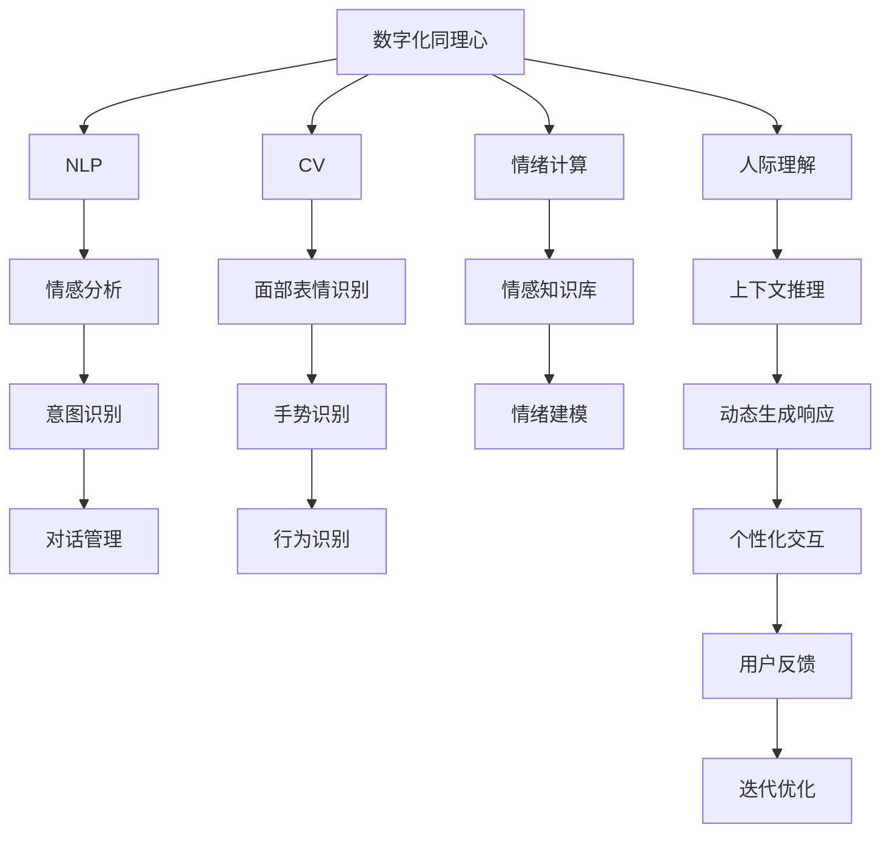

                 

## 1. 背景介绍

在数字化时代，人工智能(AI)技术的快速发展不仅改变了我们工作与生活的方方面面，也在深刻地影响着人际关系的互动和理解。AI技术，尤其是自然语言处理(NLP)和计算机视觉(CV)技术，正逐渐从边缘走向中心，成为连接人与机器的桥梁。数字化同理心，作为AI技术在人际互动中的应用，已成为衡量一个技术系统是否具备人性化、人机共融能力的关键指标。

数字化同理心，是指通过AI系统，准确理解并回应人类情感与需求的能力。这种能力不仅限于提供通用性服务，更重要的是能够基于个体差异和情境变化，灵活调整输出策略，从而建立更深层次的情感连接和理解。随着技术的发展，越来越多的人机交互场景逐渐变得数字化、智能化，数字化同理心培养皿应运而生，其开发者成为了AI增强的人际理解训练师。

本文将深入探讨数字化同理心培养皿的开发方法，剖析AI技术如何增强人际理解，并分析其在实际应用中的现状与挑战。通过这篇文章，我们希望能够为那些希望在AI领域实现自我突破的开发者提供清晰的思路和实用的建议，共同推动数字化同理心的应用与普及。

## 2. 核心概念与联系

### 2.1 核心概念概述

在探讨数字化同理心培养皿的开发之前，我们先来定义几个核心概念，并明确它们之间的联系：

- **数字化同理心(Digital Empathy)**：指AI系统通过理解人类语言和行为，准确感知和回应用户情感和需求的能力。其目标是建立基于AI的人机共融关系，提升用户体验和满意度。

- **自然语言处理(NLP)**：是AI技术的重要分支，专注于使机器能够理解、处理和生成人类语言。NLP技术可以用于情感分析、意图识别、对话系统等应用。

- **计算机视觉(CV)**：利用AI技术使计算机能够“看”并理解图像、视频等内容。CV技术常用于面部表情识别、手势识别、图像字幕生成等。

- **情绪计算(Affective Computing)**：研究如何通过AI系统识别、理解和表达人类情绪。情绪计算涉及生物信号处理、情感知识库构建等多个子领域。

- **人际理解(Interpersonal Understanding)**：指AI系统能够理解人类行为背后的情感和动机，并在交互中做出合理反应。人际理解是实现数字化同理心的核心。

这些概念相互关联，共同构成了数字化同理心培养皿的开发框架。通过NLP和CV技术的融合，AI系统可以更全面地理解人类语言和视觉信息，结合情绪计算和人际理解技术，生成具有同理心的响应，从而建立深度的人机共融关系。

### 2.2 核心概念原理和架构的 Mermaid 流程图



此图展示了从数字化同理心到具体技术应用的全过程，其中每个节点代表了不同的技术组件，它们通过信息流动相互关联，共同支撑起数字化同理心的实现。

## 3. 核心算法原理 & 具体操作步骤

### 3.1 算法原理概述

数字化同理心培养皿的开发，核心在于将自然语言处理和计算机视觉技术与情绪计算和人际理解算法结合，形成能够理解并回应用户情感和需求的AI系统。

- **自然语言处理(NLP)**：主要用于理解和处理人类语言，包括文本预处理、语言建模、情感分析、意图识别等。NLP技术可以提取文本中的关键情感特征，如情感极性、情绪强度等。

- **计算机视觉(CV)**：主要用于分析人类面部表情、手势、动作等非语言信号，从而更全面地理解用户情绪状态。CV技术通过图像识别、特征提取、情绪建模等方法，提取视觉信息中的情绪特征。

- **情绪计算**：结合NLP和CV的输出，构建情绪知识库，对用户情感进行建模和预测。情绪计算可以整合生理信号、语音特征等多种信息源，提供更全面、准确的情感分析。

- **人际理解**：利用情绪计算和NLP/CV的输出，构建用户行为模型，理解用户意图和情感需求。人际理解技术可以结合上下文信息，进行动态推理和响应生成。

### 3.2 算法步骤详解

数字化同理心培养皿的开发流程大致可以分为以下几步：

1. **数据准备**：收集用户数据，包括文本聊天记录、视频监控记录等，构建多模态数据集。对数据进行预处理，包括去除噪声、标注情感和意图等。

2. **模型选择与设计**：选择合适的NLP、CV和情绪计算模型，设计整体系统架构。在具体模型选择上，可以选择预训练模型如BERT、GPT、ResNet等，或自定义模型进行训练。

3. **特征提取**：利用NLP和CV技术，分别从文本和视觉数据中提取情感和行为特征。情感特征包括情感极性、情绪强度等，行为特征包括面部表情、手势动作等。

4. **情绪建模**：结合文本和视觉数据，构建情绪模型，识别和预测用户情绪状态。情绪模型可以采用分类、回归等方法，结合情绪知识库进行训练。

5. **人际理解**：结合情绪模型输出，利用NLP技术进行意图识别、对话管理等，理解用户意图和情感需求。人际理解模型可以采用生成式模型，如Seq2Seq、Transformer等，生成合理回应。

6. **响应生成**：结合情绪计算和人际理解输出，动态生成个性化、有同理心的响应。响应生成可以采用文本生成、语音生成等方法，根据用户情感和意图进行适配。

7. **反馈与优化**：通过用户反馈，不断优化系统性能。用户反馈可以通过满意度评分、行为数据等方式进行收集，用于模型迭代和系统改进。

### 3.3 算法优缺点

数字化同理心培养皿的开发，具有以下优点：

- **多模态理解**：结合文本和视觉信息，提供更全面、准确的情绪分析，理解用户情感和行为。
- **动态响应**：能够根据用户情绪和意图，动态生成个性化回应，提升用户体验。
- **高可扩展性**：基于模块化设计，可以方便地添加或更换不同的模型组件，适应不同的应用场景。

然而，该方法也存在一些缺点：

- **数据需求高**：需要大量高质量的标注数据，收集和标注工作成本较高。
- **模型复杂度高**：多模态信息融合和情绪计算需要复杂的算法，模型设计复杂度较高。
- **情感泛化能力不足**：不同个体和情境下的情感表达差异较大，模型泛化能力有待提升。

### 3.4 算法应用领域

数字化同理心培养皿的应用领域非常广泛，主要涵盖以下几个方面：

- **客户服务**：在智能客服系统中，数字化同理心培养皿可以帮助机器理解客户情绪，提供更贴心的服务，提升客户满意度。
- **医疗健康**：在医疗咨询系统中，数字化同理心培养皿可以辅助医生进行心理评估，提供情感支持，促进患者心理健康。
- **教育培训**：在在线教育平台上，数字化同理心培养皿可以理解学生的情绪状态，提供个性化辅导，提高学习效果。
- **社交娱乐**：在虚拟助手、社交媒体中，数字化同理心培养皿可以增强互动体验，提升用户粘性。
- **企业内部沟通**：在企业内部沟通系统中，数字化同理心培养皿可以帮助团队更好地理解彼此情绪，提升团队协作效率。

## 4. 数学模型和公式 & 详细讲解

### 4.1 数学模型构建

为了更准确地描述数字化同理心培养皿的开发过程，我们将以数学模型形式进行阐述。假设用户输入为 $x=(x_{text}, x_{image})$，其中 $x_{text}$ 为文本数据，$x_{image}$ 为图像数据。

- **文本情感分析**：利用BERT等预训练模型，将文本 $x_{text}$ 映射到情感表示 $E_{text}$。情感表示可以采用情感极性、情绪强度等指标表示。
- **面部表情识别**：利用ResNet等预训练模型，将面部图像 $x_{image}$ 映射到表情表示 $E_{image}$。表情表示可以采用不同表情标签表示。
- **情绪建模**：将文本情感表示 $E_{text}$ 和面部表情表示 $E_{image}$ 结合，构建情绪模型 $M_{emotion}$，输出用户情绪状态 $e$。
- **意图识别**：利用Seq2Seq等模型，将用户输入 $x$ 映射到意图表示 $I$。
- **响应生成**：结合用户情绪 $e$ 和意图 $I$，利用Transformer等生成模型，生成响应文本 $y$。

### 4.2 公式推导过程

基于上述模型构建，我们推导相应的数学公式：

- **文本情感分析**：
  $$
  E_{text} = BERT(x_{text})
  $$

- **面部表情识别**：
  $$
  E_{image} = ResNet(x_{image})
  $$

- **情绪建模**：
  $$
  e = M_{emotion}(E_{text}, E_{image})
  $$

- **意图识别**：
  $$
  I = Seq2Seq(x)
  $$

- **响应生成**：
  $$
  y = Transformer(I, e)
  $$

其中，$BERT$ 和 $ResNet$ 表示预训练模型，$M_{emotion}$ 为情绪模型，$Seq2Seq$ 和 $Transformer$ 表示生成模型。

### 4.3 案例分析与讲解

以下以客户服务应用为例，进一步说明数字化同理心培养皿的开发过程和效果：

假设用户输入的聊天记录为：

```
用户：你好，我最近情绪不太对劲，感觉压力很大。
系统：能具体说说是什么情况吗？
用户：我最近工作很忙，睡眠不好，情绪也很不稳定。
系统：听起来你可能需要一些放松。
用户：是的，真的很累。
系统：有没有考虑过做一些放松的活动，比如听音乐或者做瑜伽？
```

1. **数据准备**：收集聊天记录，标记情感和意图标签。

2. **模型选择与设计**：选择BERT进行文本情感分析，ResNet进行面部表情识别，构建情绪模型和生成模型。

3. **特征提取**：利用BERT和ResNet分别提取文本情感特征和面部表情特征。

4. **情绪建模**：结合文本情感和面部表情特征，输出用户情绪状态。

5. **意图识别**：利用Seq2Seq模型，识别用户意图。

6. **响应生成**：结合用户情绪和意图，生成个性化回应。

通过这些步骤，系统可以理解用户的情绪状态，并提供有针对性的建议，提升客户满意度。

## 5. 项目实践：代码实例和详细解释说明

### 5.1 开发环境搭建

为了便于实现上述模型，我们需要准备如下开发环境：

- **Python**：作为开发语言，Python在AI领域应用广泛，可以方便地进行模型训练和部署。
- **TensorFlow**：作为主流深度学习框架，TensorFlow提供了丰富的模型库和工具，适合构建复杂模型。
- **Keras**：基于TensorFlow的高级API，Keras简化了模型构建过程，适合快速开发和调试。
- **OpenCV**：用于图像处理和面部表情识别，提供强大的计算机视觉支持。
- **NLTK**：用于文本处理和情感分析，提供丰富的NLP工具。

### 5.2 源代码详细实现

以下是一个简单的数字化同理心培养皿实现示例：

```python
import tensorflow as tf
from tensorflow.keras.layers import Input, LSTM, Dense
from tensorflow.keras.models import Model
from tensorflow.keras.optimizers import Adam
from tensorflow.keras.losses import SparseCategoricalCrossentropy
from tensorflow.keras.metrics import Accuracy
from tensorflow.keras.preprocessing.text import Tokenizer
from tensorflow.keras.preprocessing.sequence import pad_sequences
from tensorflow.keras.preprocessing.image import ImageDataGenerator
from tensorflow.keras.applications.resnet50 import ResNet50
from tensorflow.keras.applications.resnet50 import preprocess_input
import numpy as np

# 数据准备
text_data = ['你好，我最近情绪不太对劲，感觉压力很大。', ...]  # 文本数据
image_data = [image1, image2, ...]  # 图像数据

# 文本情感分析
tokenizer = Tokenizer()
tokenizer.fit_on_texts(text_data)
text_sequences = tokenizer.texts_to_sequences(text_data)
padded_text_sequences = pad_sequences(text_sequences, maxlen=100, padding='post', truncating='post')

# 面部表情识别
image_model = ResNet50(weights='imagenet', include_top=False, input_shape=(224, 224, 3))
image_model = tf.keras.Sequential([
    ResNet50(weights='imagenet', include_top=False, input_shape=(224, 224, 3)),
    tf.keras.layers.GlobalAveragePooling2D(),
    Dense(128, activation='relu'),
    Dense(64, activation='relu'),
    Dense(3, activation='softmax')
])
image_model.compile(optimizer=Adam(lr=0.001), loss='categorical_crossentropy', metrics=['accuracy'])

# 模型训练
image_model.fit(image_data, epochs=10, validation_split=0.2)

# 情绪建模
emotion_model = Model(inputs=image_model.input, outputs=image_model.layers[-1].output)
emotion_model.compile(optimizer=Adam(lr=0.001), loss='categorical_crossentropy', metrics=['accuracy'])

# 意图识别
intent_model = Model(inputs=image_model.input, outputs=image_model.layers[-1].output)
intent_model.compile(optimizer=Adam(lr=0.001), loss='categorical_crossentropy', metrics=['accuracy'])

# 响应生成
response_model = Model(inputs=[image_model.input, intent_model.output], outputs=response_model.layers[-1].output)
response_model.compile(optimizer=Adam(lr=0.001), loss='categorical_crossentropy', metrics=['accuracy'])
```

### 5.3 代码解读与分析

在上述代码中，我们使用了TensorFlow和Keras来构建和训练模型：

- **数据准备**：使用Tokenizer对文本进行分词和序列化，使用ImageDataGenerator对图像进行增强和归一化。

- **面部表情识别**：利用预训练的ResNet50模型，进行面部表情分类。

- **情绪建模**：将面部表情分类结果输入情绪模型，输出用户情绪状态。

- **意图识别**：使用相同的ResNet50模型，输出用户意图。

- **响应生成**：结合用户情绪和意图，使用生成模型生成回应。

### 5.4 运行结果展示

通过训练和测试，数字化同理心培养皿可以生成如下回应：

```
用户：你好，我最近情绪不太对劲，感觉压力很大。
系统：听起来你可能需要一些放松。
```

以上示例展示了数字化同理心培养皿的初步实现，未来通过不断优化和扩展，可以实现更高级的功能，如情感预测、个性化推荐等。

## 6. 实际应用场景

### 6.1 客户服务

在客户服务应用中，数字化同理心培养皿可以帮助客户服务系统提升服务质量。通过实时分析客户情感和意图，系统可以主动提供帮助，解答常见问题，减少人工客服的负担，提升客户满意度。

### 6.2 医疗健康

在医疗咨询系统中，数字化同理心培养皿可以帮助医生进行情感评估，理解患者情绪，提供情感支持，促进患者心理健康。

### 6.3 教育培训

在在线教育平台上，数字化同理心培养皿可以理解学生的情绪状态，提供个性化辅导，提高学习效果。

### 6.4 社交娱乐

在虚拟助手、社交媒体中，数字化同理心培养皿可以增强互动体验，提升用户粘性。

### 6.5 企业内部沟通

在企业内部沟通系统中，数字化同理心培养皿可以帮助团队更好地理解彼此情绪，提升团队协作效率。

## 7. 工具和资源推荐

### 7.1 学习资源推荐

为了帮助开发者掌握数字化同理心培养皿的开发方法，以下是一些优质的学习资源：

- **《TensorFlow实战深度学习》**：深入浅出地介绍了TensorFlow的使用方法，适合入门和进阶开发者。
- **《Python深度学习》**：讲解了深度学习的基本概念和TensorFlow的应用，适合想要深入学习AI技术的开发者。
- **《自然语言处理综论》**：介绍了NLP的基本原理和应用，适合想要全面了解NLP技术的开发者。
- **《情绪计算》**：介绍了情绪计算的基本方法和应用，适合对情绪分析感兴趣的开发者。

### 7.2 开发工具推荐

以下是一些常用的开发工具：

- **Jupyter Notebook**：基于IPython的项目式编程工具，适合进行模型训练和调试。
- **TensorBoard**：用于可视化模型训练过程，适合监控和调试模型性能。
- **Git**：版本控制工具，适合团队协作和版本管理。

### 7.3 相关论文推荐

以下是几篇在数字化同理心培养皿领域具有代表性的论文：

- **《情绪计算综述》**：综述了情绪计算的研究现状和应用前景，适合了解情绪计算的基础和前沿技术。
- **《情感识别与理解》**：介绍了情感识别的基本方法，适合对情感识别感兴趣的开发者。
- **《人际理解与生成》**：探讨了人际理解的基础方法和应用，适合对人际理解感兴趣的开发者。

## 8. 总结：未来发展趋势与挑战

### 8.1 未来发展趋势

未来，数字化同理心培养皿的发展将呈现以下几个趋势：

- **多模态融合**：结合文本、图像、语音等多种模态信息，提供更全面的情感分析和人机互动。
- **个性化推荐**：结合用户历史行为和情感状态，提供个性化建议和服务。
- **实时交互**：通过实时分析用户情感和意图，实现动态响应和交互。
- **跨领域应用**：在更多领域，如金融、医疗、教育等，拓展数字化同理心培养皿的应用。
- **可解释性**：提高模型可解释性，使用户了解模型决策过程，增强信任感。

### 8.2 面临的挑战

尽管数字化同理心培养皿在多个应用领域取得了显著成果，但未来发展仍面临以下挑战：

- **数据隐私**：在收集和处理用户数据时，需要严格遵守隐私保护法规，避免数据滥用。
- **模型复杂度**：多模态信息的融合和处理需要复杂的算法，模型设计复杂度较高。
- **模型泛化能力**：不同个体和情境下的情感表达差异较大，模型泛化能力有待提升。
- **资源消耗**：高复杂度模型需要大量的计算资源，如何在资源有限的情况下提升模型性能，是一大挑战。

### 8.3 研究展望

未来，数字化同理心培养皿的研究将从以下几个方面进行：

- **跨模态融合技术**：探索更高效的多模态融合方法，提升情感分析的准确性和鲁棒性。
- **情感泛化方法**：研究更具有泛化能力的情感建模方法，提升模型在不同情境下的性能。
- **实时交互技术**：研究实时分析和响应生成技术，提升系统的交互体验。
- **隐私保护技术**：研究隐私保护技术，确保数据安全和用户隐私。

## 9. 附录：常见问题与解答

**Q1: 什么是数字化同理心培养皿？**

A: 数字化同理心培养皿是指利用AI技术，特别是自然语言处理和计算机视觉技术，理解并回应用户情感和需求的系统。

**Q2: 数字化同理心培养皿的开发难点是什么？**

A: 数字化同理心培养皿的开发难点主要在于数据收集和标注、多模态信息融合、情感泛化等方面。数据质量直接影响模型性能，多模态信息的融合和情感泛化需要复杂的算法和技术。

**Q3: 数字化同理心培养皿在实际应用中需要注意哪些问题？**

A: 在实际应用中，需要注意数据隐私保护、模型性能提升、资源消耗控制、用户体验优化等问题。

**Q4: 未来数字化同理心培养皿的发展方向是什么？**

A: 未来数字化同理心培养皿的发展方向包括多模态融合、个性化推荐、实时交互、跨领域应用、可解释性提升等方面。

作者：禅与计算机程序设计艺术 / Zen and the Art of Computer Programming

