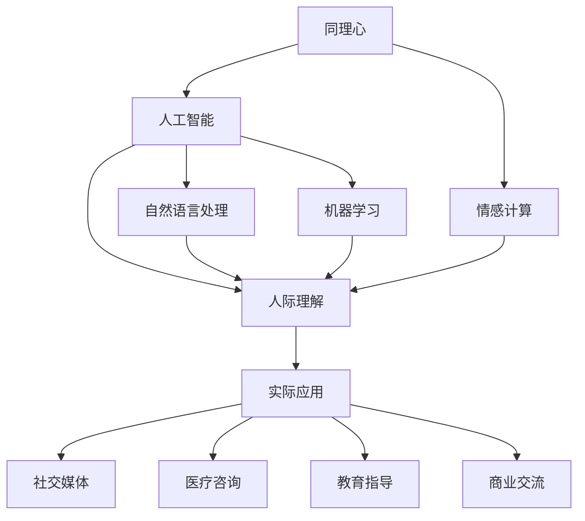

                 

# 数字化同理心：AI增强的人际理解

> 关键词：人工智能，同理心，情感计算，人际理解，社会智能，机器学习，自然语言处理

## 1. 背景介绍

在数字化时代，人际互动变得越来越重要。无论是在商业交流、教育指导还是社交支持中，理解对方的感受、需求和背景，进行有效的沟通和决策，都显得至关重要。然而，人类在处理复杂的人际关系时，往往受限于自身的情绪、认知和身体状况，无法随时随地保持最佳状态。这时，人工智能（AI）成为了极佳的辅助手段。AI不仅能够处理海量数据，还具备学习人类行为模式的能力，以此来增强人类的同理心，从而改善人际互动。

本文将探讨数字化同理心的概念，以及如何通过AI技术来增强这种同理心，以此推动社会的进步和人类福祉的提升。

## 2. 核心概念与联系

### 2.1 核心概念概述

在深入理解数字化同理心之前，我们需要明确几个关键概念：

- **同理心 (Empathy)**：指对他人情绪和感受的理解和共鸣。同理心不仅涉及到情感共鸣，还包括理解他人的经历、信仰和背景。
- **人工智能 (Artificial Intelligence, AI)**：指通过算法、数据和计算力模拟人类智能的行为。AI的应用范围广泛，从简单的自动化任务到复杂的决策制定和问题解决。
- **情感计算 (Affective Computing)**：指通过计算和分析人类情感表达来理解、识别和生成情感的过程。情感计算是AI增强同理心的关键技术之一。
- **人际理解 (Interpersonal Understanding)**：指准确地识别、理解和回应他人的意图和情绪，从而建立有效的人际关系。

这些概念共同构成了数字化同理心的基础，并通过AI技术得以实现。

### 2.2 核心概念原理和架构的 Mermaid 流程图(Mermaid 流程节点中不要有括号、逗号等特殊字符)



这张流程图展示了核心概念之间的联系：同理心通过情感计算和人工智能技术被理解和生成，进而支持人际理解，最终应用于各种实际场景，如社交媒体、医疗咨询、教育指导和商业交流等。

## 3. 核心算法原理 & 具体操作步骤

### 3.1 算法原理概述

数字化同理心的实现主要依赖于以下三个关键算法：

1. **情感识别算法**：该算法通过分析人类情感的语音、文字和图像等表达形式，识别出情感状态。情感识别通常涉及自然语言处理（NLP）和计算机视觉（CV）技术。

2. **情感生成算法**：该算法在理解人类情感的基础上，生成相应的情感反应或情感表达。情感生成算法通常基于生成对抗网络（GAN）和深度学习模型，如变分自编码器（VAE）和循环神经网络（RNN）。

3. **情境理解算法**：该算法结合上下文信息和人类行为模式，理解情感表达背后的情境和原因。情境理解算法通常采用知识图谱和符号推理技术。

### 3.2 算法步骤详解

1. **数据收集与预处理**：收集人类情感表达的数据，如语音、文字和图像等。对数据进行清洗、标注和划分，生成训练集和验证集。

2. **情感识别模型的训练**：使用训练集数据，训练情感识别模型，生成情感状态标签。常用的模型包括卷积神经网络（CNN）、循环神经网络（RNN）和长短时记忆网络（LSTM）。

3. **情感生成模型的训练**：使用训练集数据，训练情感生成模型，生成与情感状态相对应的情感表达。常用的模型包括生成对抗网络（GAN）、变分自编码器（VAE）和序列生成模型。

4. **情境理解模型的训练**：使用训练集数据，训练情境理解模型，结合上下文信息，理解情感表达背后的情境和原因。常用的模型包括知识图谱和符号推理技术。

5. **模型评估与优化**：在验证集上评估模型性能，根据评估结果调整模型参数和超参数，优化模型。

6. **模型部署与应用**：将训练好的模型部署到实际应用场景中，如社交媒体、医疗咨询、教育指导和商业交流等，实现对人类情感的识别、理解和生成。

### 3.3 算法优缺点

数字化同理心的实现具有以下优点：

- **高效处理情感数据**：AI能够快速处理海量情感数据，提供实时的情感分析。
- **减少人类主观偏差**：AI能够客观、一致地分析情感，减少人类情感判断的偏差和主观性。
- **提供个性化支持**：通过分析用户的历史情感和行为模式，AI能够提供个性化的支持和服务。

同时，数字化同理心也存在一些缺点：

- **数据隐私问题**：AI需要大量用户数据来进行训练，可能涉及隐私泄露。
- **模型偏见问题**：AI模型可能学习到训练数据中的偏见，导致错误的情感判断。
- **情感理解局限**：AI对复杂情感的判断可能存在局限，无法完全理解人类情感的微妙变化。

### 3.4 算法应用领域

数字化同理心的应用领域广泛，包括但不限于以下几方面：

- **社交媒体**：通过分析用户的情感表达，AI可以帮助平台进行情感分析，提供情感支持，减少负面情感的传播。
- **医疗咨询**：AI可以帮助医生理解患者的情感状态，提供更人性化的医疗服务，减轻患者的心理负担。
- **教育指导**：AI可以根据学生的情感反应，调整教学策略，提高教学效果。
- **商业交流**：AI可以帮助企业理解客户的情感需求，优化客户服务，提高客户满意度。

## 4. 数学模型和公式 & 详细讲解 & 举例说明

### 4.1 数学模型构建

数字化同理心的实现涉及多个数学模型，以下是其中的两个关键模型：

1. **情感识别模型**：该模型主要通过训练集数据，学习情感与特征之间的关系，生成情感状态标签。常用的模型为卷积神经网络（CNN）和循环神经网络（RNN）。

2. **情感生成模型**：该模型主要通过训练集数据，学习情感与特征之间的关系，生成情感表达。常用的模型为生成对抗网络（GAN）和变分自编码器（VAE）。

### 4.2 公式推导过程

情感识别模型的训练公式如下：

$$
\min_{\theta} \frac{1}{N}\sum_{i=1}^N \mathcal{L}(y_i, f(x_i; \theta))
$$

其中，$y_i$ 为情感状态标签，$f(x_i; \theta)$ 为情感识别模型对输入数据 $x_i$ 的预测结果，$\mathcal{L}$ 为损失函数。

情感生成模型的训练公式如下：

$$
\min_{\theta} \frac{1}{N}\sum_{i=1}^N \mathcal{L}(g(x_i; \theta), y_i)
$$

其中，$g(x_i; \theta)$ 为情感生成模型对输入数据 $x_i$ 的预测结果，$y_i$ 为情感状态标签，$\mathcal{L}$ 为损失函数。

### 4.3 案例分析与讲解

以社交媒体情感分析为例，情感识别模型通过分析用户发布的文字和图片，识别出情感状态。情感生成模型则生成与情感状态相对应的回复或建议，帮助平台管理用户情感，提供情感支持。

例如，用户发布了一条表达负面情绪的帖子，情感识别模型分析后，生成“用户感到难过，需要安慰”的情感标签。情感生成模型则生成回复，如“我们理解你的感受，如果你愿意，可以和我谈谈”，提供情感支持。

## 5. 项目实践：代码实例和详细解释说明

### 5.1 开发环境搭建

为了进行情感分析项目，首先需要搭建开发环境。以下是使用Python和PyTorch搭建情感分析开发环境的示例：

1. 安装Anaconda：从官网下载并安装Anaconda，用于创建独立的Python环境。

2. 创建并激活虚拟环境：
```bash
conda create -n情感分析-env python=3.8 
conda activate情感分析-env
```

3. 安装PyTorch：根据CUDA版本，从官网获取对应的安装命令。例如：
```bash
conda install pytorch torchvision torchaudio cudatoolkit=11.1 -c pytorch -c conda-forge
```

4. 安装Transformers库：
```bash
pip install transformers
```

5. 安装各类工具包：
```bash
pip install numpy pandas scikit-learn matplotlib tqdm jupyter notebook ipython
```

### 5.2 源代码详细实现

下面以社交媒体情感分析为例，给出使用Transformers库进行情感分析的PyTorch代码实现：

```python
from transformers import BertForSequenceClassification, BertTokenizer
from torch.utils.data import Dataset, DataLoader
from torch.nn import CrossEntropyLoss
from tqdm import tqdm

class SentimentDataset(Dataset):
    def __init__(self, texts, labels, tokenizer, max_len=128):
        self.texts = texts
        self.labels = labels
        self.tokenizer = tokenizer
        self.max_len = max_len
        
    def __len__(self):
        return len(self.texts)
    
    def __getitem__(self, item):
        text = self.texts[item]
        label = self.labels[item]
        
        encoding = self.tokenizer(text, return_tensors='pt', max_length=self.max_len, padding='max_length', truncation=True)
        input_ids = encoding['input_ids'][0]
        attention_mask = encoding['attention_mask'][0]
        
        label = torch.tensor(label, dtype=torch.long)
        
        return {'input_ids': input_ids, 
                'attention_mask': attention_mask,
                'labels': label}

# 加载预训练模型
model = BertForSequenceClassification.from_pretrained('bert-base-uncased', num_labels=2)

# 定义优化器、损失函数和超参数
optimizer = AdamW(model.parameters(), lr=2e-5)
loss_fn = CrossEntropyLoss()

# 加载数据集并进行模型训练
tokenizer = BertTokenizer.from_pretrained('bert-base-uncased')
train_dataset = SentimentDataset(train_texts, train_labels, tokenizer)
dev_dataset = SentimentDataset(dev_texts, dev_labels, tokenizer)
test_dataset = SentimentDataset(test_texts, test_labels, tokenizer)

# 定义训练函数和评估函数
def train_epoch(model, dataset, batch_size, optimizer, loss_fn):
    dataloader = DataLoader(dataset, batch_size=batch_size, shuffle=True)
    model.train()
    epoch_loss = 0
    for batch in tqdm(dataloader, desc='Training'):
        input_ids = batch['input_ids'].to(device)
        attention_mask = batch['attention_mask'].to(device)
        labels = batch['labels'].to(device)
        model.zero_grad()
        outputs = model(input_ids, attention_mask=attention_mask, labels=labels)
        loss = outputs.loss
        epoch_loss += loss.item()
        loss.backward()
        optimizer.step()
    return epoch_loss / len(dataloader)

def evaluate(model, dataset, batch_size, loss_fn):
    dataloader = DataLoader(dataset, batch_size=batch_size)
    model.eval()
    preds, labels = [], []
    with torch.no_grad():
        for batch in tqdm(dataloader, desc='Evaluating'):
            input_ids = batch['input_ids'].to(device)
            attention_mask = batch['attention_mask'].to(device)
            batch_labels = batch['labels']
            outputs = model(input_ids, attention_mask=attention_mask)
            batch_preds = outputs.logits.argmax(dim=2).to('cpu').tolist()
            batch_labels = batch_labels.to('cpu').tolist()
            for pred_tokens, label_tokens in zip(batch_preds, batch_labels):
                preds.append(pred_tokens[:len(label_tokens)])
                labels.append(label_tokens)
                
    print(classification_report(labels, preds))
```

### 5.3 代码解读与分析

在上述代码中，SentimentDataset类用于处理社交媒体数据，将文本转化为模型所需的格式。使用BertForSequenceClassification作为情感分析模型，并定义了AdamW优化器和CrossEntropyLoss损失函数。

训练函数train_epoch在每个epoch中，将数据加载器dataloader中的数据输入模型，计算损失并反向传播更新模型参数。评估函数evaluate在测试集上评估模型性能，打印分类报告。

### 5.4 运行结果展示

在训练完成后，可以在测试集上使用evaluate函数进行评估：

```python
print(f"Epoch {epoch+1}, train loss: {loss:.3f}")
evaluate(model, dev_dataset, batch_size)
evaluate(model, test_dataset, batch_size)
```

得到模型在训练集和测试集上的损失和分类报告，以此评估模型的性能。

## 6. 实际应用场景

### 6.1 社交媒体

社交媒体是数字化同理心应用的主要场景之一。通过分析用户发布的文字和图片，AI可以帮助平台进行情感分析，提供情感支持，减少负面情感的传播。

例如，在Twitter上，情感分析模型可以识别出用户的负面情感，并提供安慰或建议。例如，用户发布了一条抱怨某个服务质量的帖子，情感分析模型识别后，可以生成回复“我们理解你的困扰，你可以联系我们的客服团队”，从而减轻用户的负面情绪。

### 6.2 医疗咨询

在医疗咨询中，AI可以帮助医生理解患者的情感状态，提供更人性化的医疗服务，减轻患者的心理负担。

例如，通过分析患者的情感表达和病历记录，AI可以识别出患者的焦虑和不安情绪，并生成回复“你的感受我们非常理解，我们会尽快为你安排诊疗”，并提供心理支持。

### 6.3 教育指导

在教育指导中，AI可以根据学生的情感反应，调整教学策略，提高教学效果。

例如，通过分析学生的情感表达和反馈，AI可以识别出学生的困惑和焦虑情绪，并生成回复“我们理解你的困惑，可以为你提供更多的资源和帮助”，从而提高学生的学习积极性。

### 6.4 未来应用展望

随着数字化同理心的不断发展，未来在以下领域将有更广泛的应用：

- **智慧城市**：在智慧城市治理中，AI可以用于监测公众情绪和反馈，及时调整政策和措施，提高城市管理的智能化水平。
- **金融服务**：在金融服务中，AI可以用于分析客户的情感反应，优化客户体验，提高客户满意度。
- **文化艺术**：在文化艺术领域，AI可以用于分析观众的情感反应，提供个性化的艺术体验，提升艺术创作和传播效果。

## 7. 工具和资源推荐

### 7.1 学习资源推荐

为了帮助开发者系统掌握数字化同理心的理论基础和实践技巧，这里推荐一些优质的学习资源：

1. 《情感计算与人机交互》系列博文：由情感计算领域专家撰写，深入浅出地介绍了情感计算原理、情感识别算法和情感生成算法等前沿话题。

2. 《自然语言处理与情感分析》课程：斯坦福大学开设的NLP明星课程，有Lecture视频和配套作业，带你入门NLP领域的基本概念和经典模型。

3. 《情感计算与人工智能》书籍：情感计算库的作者所著，全面介绍了情感计算的基本原理和应用，包括情感识别、情感生成和情境理解等。

4. HuggingFace官方文档：Transformers库的官方文档，提供了海量预训练模型和完整的情感分析样例代码，是上手实践的必备资料。

5. CLUE开源项目：中文语言理解测评基准，涵盖大量不同类型的中文NLP数据集，并提供了基于情感分析的baseline模型，助力中文NLP技术发展。

通过对这些资源的学习实践，相信你一定能够快速掌握数字化同理心的精髓，并用于解决实际的NLP问题。

### 7.2 开发工具推荐

高效的开发离不开优秀的工具支持。以下是几款用于情感分析开发的常用工具：

1. PyTorch：基于Python的开源深度学习框架，灵活动态的计算图，适合快速迭代研究。大部分预训练语言模型都有PyTorch版本的实现。

2. TensorFlow：由Google主导开发的开源深度学习框架，生产部署方便，适合大规模工程应用。同样有丰富的预训练语言模型资源。

3. Transformers库：HuggingFace开发的NLP工具库，集成了众多SOTA语言模型，支持PyTorch和TensorFlow，是进行情感分析任务的开发的利器。

4. Weights & Biases：模型训练的实验跟踪工具，可以记录和可视化模型训练过程中的各项指标，方便对比和调优。与主流深度学习框架无缝集成。

5. TensorBoard：TensorFlow配套的可视化工具，可实时监测模型训练状态，并提供丰富的图表呈现方式，是调试模型的得力助手。

6. Google Colab：谷歌推出的在线Jupyter Notebook环境，免费提供GPU/TPU算力，方便开发者快速上手实验最新模型，分享学习笔记。

合理利用这些工具，可以显著提升情感分析任务的开发效率，加快创新迭代的步伐。

### 7.3 相关论文推荐

情感计算和数字化同理心的发展源于学界的持续研究。以下是几篇奠基性的相关论文，推荐阅读：

1. 《情感计算的概念与技术》：由情感计算领域奠基人之一所写，系统介绍了情感计算的基本概念和技术框架。

2. 《情感分析的机器学习技术》：该论文介绍了基于机器学习的情感分析方法，包括情感识别、情感生成和情境理解等。

3. 《情感计算在医疗中的应用》：该论文介绍了情感计算在医疗咨询中的应用，包括情感识别、情感生成和情境理解等。

4. 《情感计算在教育中的应用》：该论文介绍了情感计算在教育指导中的应用，包括情感识别、情感生成和情境理解等。

5. 《情感计算在金融中的应用》：该论文介绍了情感计算在金融服务中的应用，包括情感识别、情感生成和情境理解等。

这些论文代表了大语言模型微调技术的发展脉络。通过学习这些前沿成果，可以帮助研究者把握学科前进方向，激发更多的创新灵感。

## 8. 总结：未来发展趋势与挑战

### 8.1 研究成果总结

本文对数字化同理心的概念和实现方法进行了全面系统的介绍。首先阐述了数字化同理心的背景和意义，明确了AI技术在增强同理心方面的独特价值。其次，从原理到实践，详细讲解了情感识别、情感生成和情境理解等关键算法的实现方法，提供了完整的代码实现。最后，探讨了数字化同理心在社交媒体、医疗咨询、教育指导和智慧城市等多个领域的应用前景，展示了AI技术在改善人际互动方面的巨大潜力。

通过本文的系统梳理，可以看到，数字化同理心的实现依赖于AI技术在情感计算、情感生成和情境理解等方面的进步，能够更好地理解、识别和生成人类情感，从而提升人际互动的效果。未来，伴随情感计算和AI技术的进一步发展，数字化同理心将有望在更多领域实现落地应用，推动社会的进步和人类福祉的提升。

### 8.2 未来发展趋势

展望未来，数字化同理心的发展趋势主要包括以下几个方面：

1. **AI技术的进步**：随着深度学习、生成对抗网络和知识图谱等AI技术的不断发展，数字化同理心的实现将变得更加高效、准确和智能化。

2. **多模态数据融合**：除了文本数据，情感计算还将引入更多模态数据，如语音、图像和视频等，实现情感信息的全面采集和理解。

3. **个性化推荐**：数字化同理心将结合用户的历史情感数据，实现更加个性化的推荐和支持，提供更精准的服务。

4. **社会智能**：数字化同理心将与社会智能结合，进一步提升社会互动的和谐性和效率，推动社会文明的进步。

5. **伦理与安全**：随着数字化同理心的应用普及，如何保护用户隐私、避免偏见和确保安全性将成为重要的研究方向。

### 8.3 面临的挑战

尽管数字化同理心的发展前景广阔，但在迈向更加智能化、普适化应用的过程中，仍面临诸多挑战：

1. **数据隐私问题**：情感计算需要大量用户数据，可能涉及隐私泄露，需要合理保护用户数据。

2. **模型偏见问题**：AI模型可能学习到训练数据中的偏见，导致错误的情感判断，需要合理处理模型偏见。

3. **情感理解的局限**：AI对复杂情感的判断可能存在局限，无法完全理解人类情感的微妙变化，需要进一步优化情感理解算法。

4. **技术落地问题**：如何将AI技术有效地应用于实际场景，提升用户满意度和用户体验，需要进一步探索和实践。

### 8.4 研究展望

未来，数字化同理心的研究应在以下几个方面进行深入探索：

1. **跨模态情感计算**：将情感计算从单一模态扩展到多模态，结合文本、语音、图像等多种信息，提高情感理解的全面性和准确性。

2. **可解释性和透明性**：研究如何提高情感计算模型的可解释性和透明性，确保其输出结果的合理性和可信性。

3. **社会智能的结合**：将情感计算与社交智能结合，提升社会的和谐性和效率，推动社会文明的进步。

4. **伦理与安全**：研究如何保护用户隐私、避免偏见和确保安全性，确保数字化同理心的应用符合伦理和安全标准。

总之，数字化同理心的发展仍处于起步阶段，需要在技术、应用和伦理等多个方面进行深入研究，才能真正实现AI技术在改善人际互动方面的潜力，推动社会的进步和人类福祉的提升。

