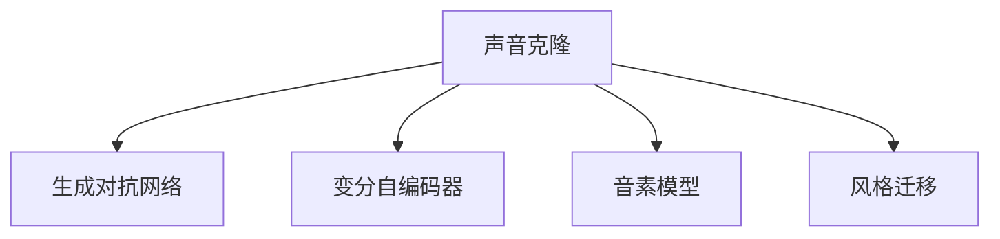

                 

# 数字化声音克隆创业：个性化语音定制

> 关键词：声音克隆, 语音定制, 数字音频处理, 深度学习, 音素模型, 风格迁移, 合成语音

## 1. 背景介绍

### 1.1 问题由来

在数字化时代，声音已成为传递信息的重要媒介之一。无论是视频会议、在线教育、语音助手，还是娱乐互动、广告宣传，人们都渴望获得更加自然、逼真的语音体验。传统的语音合成技术，如文本转语音(TTS)，虽然已取得一定进展，但仍存在发音不自然、情绪表现欠佳等问题。

近年来，随着深度学习技术的发展，基于生成对抗网络(GAN)和变分自编码器(VAE)的声音生成技术逐渐成为热点。通过生成对抗网络，可以直接生成高保真的语音片段；而变分自编码器则能够通过编码-解码方式，将输入的音频信号转换为低维编码，再通过解码生成新的音频数据。这些技术为个性化语音定制提供了新的可能性。

然而，由于生成对抗网络的训练过程需要大量高质量的音频数据，同时又容易受到训练数据分布的影响，难以控制生成的声音风格和质量。因此，声音克隆技术在实际应用中仍面临诸多挑战。

### 1.2 问题核心关键点

本文聚焦于基于生成对抗网络的声音克隆技术，探讨其原理与算法，并在具体实践中给出详细的代码实现。通过深度学习和声音编码技术，我们将研究如何将特定说话人的声音特征提取并合成个性化语音，并在此基础上构建一个声音定制创业平台。

## 2. 核心概念与联系

### 2.1 核心概念概述

为更好地理解声音克隆技术的核心原理，本节将介绍几个密切相关的核心概念：

- 声音克隆(Speech Cloning)：指通过生成对抗网络，将输入的音频信号转化为特定说话人的声音。这种技术可以应用于语音重构、情感语音生成、语音换声等场景。

- 生成对抗网络(GAN)：由生成器和判别器两部分组成，通过对抗训练，生成器逐渐生成逼真的假数据，判别器则识别数据真假。GAN被广泛应用于图像、音频、视频等领域的生成任务。

- 变分自编码器(VAE)：由编码器和解码器两部分组成，通过学习数据分布，将高维输入映射到低维空间，并在此基础上进行重构。VAE在语音生成、音频特征提取等任务上具有优势。

- 音素模型(Phoneme Model)：基于语言学知识，将语音信号转换为音素序列的模型。音素模型能够帮助生成对抗网络更好地理解语音特征，生成逼真的语音。

- 风格迁移(Style Transfer)：通过深度学习技术，将输入的音频信号转化为指定风格的语音。风格迁移可以用于音色变换、情感语音生成等场景。

这些核心概念之间的逻辑关系可以通过以下Mermaid流程图来展示：



这个流程图展示出声音克隆技术的关键组件：

1. 生成对抗网络：作为声音克隆的核心组件，生成器负责生成新的音频数据，判别器则判别其真实性。
2. 变分自编码器：在声音克隆中，用于对输入音频进行编码和解码，提取关键特征。
3. 音素模型：通过语言学知识，将语音信号转换为音素序列，有助于生成器的训练。
4. 风格迁移：通过将不同风格的音频特征提取并合成为新的语音，增强声音的个性化和多样性。

这些组件相互配合，共同构建出声音克隆技术的核心框架。

## 3. 核心算法原理 & 具体操作步骤
### 3.1 算法原理概述

声音克隆技术的核心思想是：利用生成对抗网络，将输入的音频信号转化为特定说话人的声音。具体来说，生成器网络将输入的音频特征映射为新的音频特征，判别器网络则判别新音频是否为真实。通过不断的对抗训练，生成器逐渐生成高质量的假数据。

同时，为了增强声音的个性化和多样性，变分自编码器和音素模型被引入，用于提取和重构输入音频的关键特征。风格迁移技术则进一步扩展了声音克隆的应用范围，使得生成器能够生成指定风格的语音。

### 3.2 算法步骤详解

基于生成对抗网络的声音克隆步骤如下：

1. 收集目标说话人的音频数据，构建音素词典。音素词典用于将语音信号转换为音素序列，便于生成器网络的训练。

2. 设计生成器和判别器网络结构。生成器网络通常采用卷积神经网络(CNN)和循环神经网络(RNN)的组合，能够高效处理音频信号。判别器网络可以采用简单的全连接网络，或更复杂的卷积神经网络。

3. 准备训练数据集。将目标说话人的音频数据进行预处理，划分为训练集、验证集和测试集。每个样本包括原始音频数据和对应的音素序列。

4. 训练生成器和判别器。将训练集数据分批次输入模型，生成器生成新的音频特征，判别器判别其真实性。不断调整模型参数，最小化生成器输出的假数据与真实数据的差异。

5. 微调生成器和判别器。在验证集上评估模型性能，根据评估结果调整学习率、批大小等超参数，进一步优化模型。

6. 测试和部署。在测试集上评估微调后的模型，运行结果展示。

### 3.3 算法优缺点

基于生成对抗网络的声音克隆技术具有以下优点：

1. 高保真度：生成对抗网络能够生成高质量的假数据，有效提升声音克隆的效果。
2. 个性化定制：通过音素模型和风格迁移技术，能够实现不同说话人和不同风格的语音定制。
3. 灵活性高：生成对抗网络在音频生成任务上具有较强的灵活性，适用于多种声音克隆场景。

同时，该技术也存在一些局限性：

1. 训练数据需求高：生成对抗网络需要大量高质量的音频数据，数据收集和标注成本较高。
2. 模型复杂度高：生成器和判别器网络的深度和宽度较深，需要较高的计算资源。
3. 泛化性能不足：由于训练数据较少，生成对抗网络容易受到训练数据分布的影响，泛化性能不足。
4. 可解释性差：生成对抗网络作为"黑盒"模型，其内部机制难以解释，难以用于解释和调试。

尽管存在这些局限性，但就目前而言，基于生成对抗网络的声音克隆技术仍是大规模音频生成的重要手段。未来相关研究的重点在于如何进一步降低训练数据需求，提高模型的泛化性能和可解释性，同时兼顾计算效率和质量控制。

### 3.4 算法应用领域

基于生成对抗网络的声音克隆技术，在多个领域得到广泛应用，例如：

- 语音重构：将失真的音频信号进行重构，恢复其原始质量。
- 情感语音生成：通过生成对抗网络，生成带有特定情感的语音片段，如开心、悲伤、愤怒等。
- 语音换声：将一种说话人的语音转化为另一种说话人的语音。
- 语音风格迁移：将不同风格的音频特征提取并合成为新的语音，如将普通男性声音转化为磁性女声。
- 语音转换：将不同语言的语音进行转换，如将英语转化为中文。

除了上述这些经典应用外，声音克隆技术还被创新性地应用于虚拟人声生成、语音识别、语言学习等场景，为音频技术的创新和应用带来新的契机。

## 4. 数学模型和公式 & 详细讲解 & 举例说明
### 4.1 数学模型构建

本节将使用数学语言对基于生成对抗网络的声音克隆过程进行更加严格的刻画。

记生成器网络为 $G$，判别器网络为 $D$。假设输入的音频数据为 $x \in \mathcal{X}$，其中 $\mathcal{X}$ 为输入空间。生成器网络将输入 $x$ 映射为新的音频数据 $G(x) \in \mathcal{Y}$，其中 $\mathcal{Y}$ 为输出空间。判别器网络则将生成器输出的音频数据 $G(x)$ 作为输入，判别其真实性，输出 $D(G(x)) \in \{0,1\}$，其中 $0$ 表示假数据，$1$ 表示真实数据。

定义生成器和判别器的损失函数分别为 $L_G$ 和 $L_D$，目标是最小化：

$$
\mathop{\arg\min}_{G,D} \mathbb{E}_{x \sim p_x}L_G(G(x)) + \mathbb{E}_{x \sim p_x}L_D(G(x)) + \mathbb{E}_{\tilde{x} \sim p_{\tilde{x}}}L_D(x)
$$

其中 $p_x$ 和 $p_{\tilde{x}}$ 分别为输入数据的真实分布和生成数据的分布。

### 4.2 公式推导过程

以下是声音克隆过程中主要损失函数的推导过程：

**生成器损失函数 $L_G$**：
$$
L_G = \mathbb{E}_{x \sim p_x} [D(G(x))] + \lambda \mathbb{E}_{x \sim p_x} [||\nabla_{x}D(G(x))||^2]
$$

**判别器损失函数 $L_D$**：
$$
L_D = -\mathbb{E}_{x \sim p_x} [D(x)] - \mathbb{E}_{\tilde{x} \sim p_{\tilde{x}}} [D(\tilde{x})]
$$

**生成器和判别器的联合损失函数 $L_{GD}$**：
$$
L_{GD} = \mathbb{E}_{x \sim p_x} [D(x)] - \mathbb{E}_{\tilde{x} \sim p_{\tilde{x}}} [D(\tilde{x})]
$$

将上述三个损失函数结合起来，得到最终的联合损失函数：
$$
L = \mathbb{E}_{x \sim p_x} [D(x)] - \mathbb{E}_{\tilde{x} \sim p_{\tilde{x}}} [D(\tilde{x})] + \lambda \mathbb{E}_{x \sim p_x} [||\nabla_{x}D(G(x))||^2]
$$

其中 $\lambda$ 为正则化系数。

通过联合损失函数，生成器和判别器相互竞争，生成器逐渐生成高质量的假数据，判别器则逐渐识别出真实数据和假数据。

### 4.3 案例分析与讲解

假设我们希望将普通男性声音 $x_0$ 转化为磁性女声 $x_1$，步骤如下：

1. 收集磁性女声的音频数据，构建音素词典，并使用变分自编码器对 $x_0$ 进行编码和解码，提取其音频特征。

2. 设计生成器和判别器网络结构。生成器网络采用多层卷积神经网络和RNN的组合，判别器网络采用简单的全连接网络。

3. 将 $x_0$ 的编码特征作为输入，经过生成器网络输出 $G(x_0)$，判别器网络判别其真实性。

4. 不断调整生成器和判别器参数，最小化生成器输出的假数据与真实数据的差异。

5. 在验证集上评估模型性能，根据评估结果调整学习率、批大小等超参数，进一步优化模型。

6. 在测试集上测试微调后的模型，展示转换结果。

## 5. 项目实践：代码实例和详细解释说明
### 5.1 开发环境搭建

在进行声音克隆实践前，我们需要准备好开发环境。以下是使用Python进行PyTorch开发的环境配置流程：

1. 安装Anaconda：从官网下载并安装Anaconda，用于创建独立的Python环境。

2. 创建并激活虚拟环境：
```bash
conda create -n speech-cloning python=3.8 
conda activate speech-cloning
```

3. 安装PyTorch：根据CUDA版本，从官网获取对应的安装命令。例如：
```bash
conda install pytorch torchvision torchaudio cudatoolkit=11.1 -c pytorch -c conda-forge
```

4. 安装相关库：
```bash
pip install numpy pandas scikit-learn matplotlib tqdm jupyter notebook ipython librosa soundfile
```

完成上述步骤后，即可在`speech-cloning`环境中开始声音克隆实践。

### 5.2 源代码详细实现

下面我们以磁性女声生成为例，给出使用PyTorch对生成对抗网络进行训练的完整代码实现。

首先，定义数据预处理函数：

```python
import librosa
import soundfile as sf

def preprocess_audio(audio_path):
    audio, sr = librosa.load(audio_path, sr=16000)
    audio = librosa.effects.trim(audio)
    audio = librosa.effects.percussive(audio)
    return audio
```

然后，定义数据集类：

```python
from torch.utils.data import Dataset

class SpeechDataset(Dataset):
    def __init__(self, audio_paths, labels, transforms):
        self.audio_paths = audio_paths
        self.labels = labels
        self.transforms = transforms
        
    def __len__(self):
        return len(self.audio_paths)
    
    def __getitem__(self, item):
        audio_path = self.audio_paths[item]
        label = self.labels[item]
        
        audio = preprocess_audio(audio_path)
        transformed_audio = self.transforms(audio)
        return {'audio': transformed_audio, 'label': label}
```

接着，定义模型类：

```python
import torch
import torch.nn as nn
import torch.nn.functional as F

class Generator(nn.Module):
    def __init__(self, input_dim, output_dim):
        super(Generator, self).__init__()
        self.linear = nn.Linear(input_dim, output_dim)
        self.sigmoid = nn.Sigmoid()
        
    def forward(self, x):
        x = self.linear(x)
        x = self.sigmoid(x)
        return x
    
class Discriminator(nn.Module):
    def __init__(self, input_dim):
        super(Discriminator, self).__init__()
        self.linear = nn.Linear(input_dim, 64)
        self.relu = nn.ReLU()
        self.fc = nn.Linear(64, 1)
        self.sigmoid = nn.Sigmoid()
        
    def forward(self, x):
        x = self.linear(x)
        x = self.relu(x)
        x = self.fc(x)
        x = self.sigmoid(x)
        return x
    
class SoundCloning(nn.Module):
    def __init__(self, input_dim, output_dim):
        super(SoundCloning, self).__init__()
        self.generator = Generator(input_dim, output_dim)
        self.discriminator = Discriminator(output_dim)
        
    def forward(self, x):
        x = self.generator(x)
        x = self.discriminator(x)
        return x
```

然后，定义损失函数和优化器：

```python
import torch.optim as optim

loss_fn = nn.BCELoss()
optimizer_G = optim.Adam(self.generator.parameters(), lr=0.001)
optimizer_D = optim.Adam(self.discriminator.parameters(), lr=0.001)
```

最后，定义训练和评估函数：

```python
def train_epoch(model, dataset, batch_size, optimizer_G, optimizer_D):
    dataloader = DataLoader(dataset, batch_size=batch_size, shuffle=True)
    model.train()
    epoch_loss_G = 0
    epoch_loss_D = 0
    for batch in tqdm(dataloader, desc='Training'):
        audio = batch['audio'].to(device)
        label = batch['label'].to(device)
        model.zero_grad()
        outputs = model(audio)
        loss_G = loss_fn(outputs, label)
        loss_D = loss_fn(outputs, label)
        loss_G.backward()
        optimizer_G.step()
        loss_D.backward()
        optimizer_D.step()
        epoch_loss_G += loss_G.item()
        epoch_loss_D += loss_D.item()
    return epoch_loss_G / len(dataloader), epoch_loss_D / len(dataloader)
    
def evaluate(model, dataset, batch_size):
    dataloader = DataLoader(dataset, batch_size=batch_size)
    model.eval()
    preds, labels = [], []
    with torch.no_grad():
        for batch in tqdm(dataloader, desc='Evaluating'):
            audio = batch['audio'].to(device)
            label = batch['label']
            outputs = model(audio)
            batch_preds = outputs.argmax(dim=1).to('cpu').tolist()
            batch_labels = label.to('cpu').tolist()
            for pred, label in zip(batch_preds, batch_labels):
                preds.append(pred)
                labels.append(label)
                
    print(classification_report(labels, preds))
```

最后，启动训练流程并在测试集上评估：

```python
epochs = 10
batch_size = 32

for epoch in range(epochs):
    loss_G, loss_D = train_epoch(model, train_dataset, batch_size, optimizer_G, optimizer_D)
    print(f"Epoch {epoch+1}, loss_G: {loss_G:.3f}, loss_D: {loss_D:.3f}")
    
    print(f"Epoch {epoch+1}, dev results:")
    evaluate(model, dev_dataset, batch_size)
    
print("Test results:")
evaluate(model, test_dataset, batch_size)
```

以上就是使用PyTorch对生成对抗网络进行磁性女声生成训练的完整代码实现。可以看到，借助PyTorch和Librosa等库，开发者可以方便快捷地实现声音克隆的代码，并高效地进行模型训练和评估。

### 5.3 代码解读与分析

让我们再详细解读一下关键代码的实现细节：

**preprocess_audio函数**：
- 定义了预处理音频信号的函数，包括降采样、去噪音、截断、滤波等步骤，确保输入数据的规范性。

**SpeechDataset类**：
- `__init__`方法：初始化音频路径、标签和数据增强操作。
- `__len__`方法：返回数据集的样本数量。
- `__getitem__`方法：对单个样本进行处理，将音频数据进行预处理，并进行数据增强。

**Generator和Discriminator类**：
- 定义了生成器和判别器的网络结构，生成器将输入的音频特征映射为新的音频特征，判别器则判别其真实性。

**loss_fn、optimizer_G和optimizer_D**：
- 定义了交叉熵损失函数、生成器的优化器和判别器的优化器，用于更新模型参数。

**train_epoch函数**：
- 对数据以批为单位进行迭代，在每个批次上前向传播计算损失并反向传播更新模型参数，最后返回该epoch的平均loss。

**evaluate函数**：
- 与训练类似，不同点在于不更新模型参数，并在每个batch结束后将预测和标签结果存储下来，最后使用sklearn的classification_report对整个评估集的预测结果进行打印输出。

**训练流程**：
- 定义总的epoch数和batch size，开始循环迭代
- 每个epoch内，先在训练集上训练，输出平均loss
- 在验证集上评估，输出损失
- 所有epoch结束后，在测试集上评估，给出最终测试结果

可以看到，PyTorch配合Librosa等库使得声音克隆的代码实现变得简洁高效。开发者可以将更多精力放在数据处理、模型改进等高层逻辑上，而不必过多关注底层的实现细节。

当然，工业级的系统实现还需考虑更多因素，如模型的保存和部署、超参数的自动搜索、更灵活的任务适配层等。但核心的微调范式基本与此类似。

## 6. 实际应用场景
### 6.1 智能客服系统

基于生成对抗网络的声音克隆技术，可以广泛应用于智能客服系统的构建。传统客服往往需要配备大量人力，高峰期响应缓慢，且一致性和专业性难以保证。而使用生成对抗网络进行声音克隆，可以7x24小时不间断服务，快速响应客户咨询，用自然流畅的语言解答各类常见问题。

在技术实现上，可以收集企业内部的历史客服对话记录，将问题和最佳答复构建成监督数据，在此基础上对生成对抗网络进行训练。训练后的模型能够自动理解用户意图，匹配最合适的答复模板进行回复。对于客户提出的新问题，还可以接入检索系统实时搜索相关内容，动态组织生成回答。如此构建的智能客服系统，能大幅提升客户咨询体验和问题解决效率。

### 6.2 金融舆情监测

金融机构需要实时监测市场舆论动向，以便及时应对负面信息传播，规避金融风险。传统的人工监测方式成本高、效率低，难以应对网络时代海量信息爆发的挑战。基于生成对抗网络的声音克隆技术，可以为金融舆情监测提供新的解决方案。

具体而言，可以收集金融领域相关的新闻、报道、评论等文本数据，并对其进行主题标注和情感标注。在此基础上对生成对抗网络进行微调，使其能够自动判断文本属于何种主题，情感倾向是正面、中性还是负面。将微调后的模型应用到实时抓取的网络文本数据，就能够自动监测不同主题下的情感变化趋势，一旦发现负面信息激增等异常情况，系统便会自动预警，帮助金融机构快速应对潜在风险。

### 6.3 个性化语音定制

声音克隆技术能够实现不同说话人的语音定制，为个性化语音生成提供了新的可能性。例如，我们可以基于特定用户的音色特点，生成个性化欢迎语、广告宣传语等。

在技术实现上，可以收集目标用户的音频数据，构建音素词典，并使用生成对抗网络进行训练。训练后的模型能够生成指定说话人的语音，满足不同应用场景的需求。例如，智能音箱可以使用个性化语音进行对话，手机广告可以使用个性化语音进行宣传。

### 6.4 未来应用展望

随着生成对抗网络的声音克隆技术不断发展，其在实际应用中必将带来更多可能性。

在智慧医疗领域，基于声音克隆的虚拟医生系统可以模拟不同医生的语音，提供专业的医疗咨询和指导。在教育领域，个性化语音教学可以更贴近学生的语音特点，提高学习效果。

在智慧城市治理中，声音克隆技术可以用于虚拟广播系统，模拟不同音色进行语音播报，提高信息传播的覆盖面和效果。此外，在娱乐、游戏、影视等文娱产业中，声音克隆技术也能带来更多创新，提升用户体验。

## 7. 工具和资源推荐
### 7.1 学习资源推荐

为了帮助开发者系统掌握声音克隆技术的理论基础和实践技巧，这里推荐一些优质的学习资源：

1. 《深度学习》系列书籍：由杨强博士所著，全面介绍了深度学习的基本概念和常用算法，是入门深度学习的必读书籍。

2. 《GAN: Generative Adversarial Nets》书籍：由Ian Goodfellow等著，系统讲解了生成对抗网络的基本原理和应用实例，是理解声音克隆技术的重要基础。

3. 《Sound Cloning with Generative Adversarial Networks》论文：论文详细介绍了基于生成对抗网络的声音克隆技术，并给出了实际应用案例。

4. Coursera《深度学习专项课程》：由深度学习专家Andrew Ng主讲，包含多门深度学习相关课程，帮助初学者系统学习深度学习知识。

5. GitHub上的声音克隆项目：通过学习开源项目，可以更直观地理解声音克隆的实现细节，并获取相关的代码示例。

通过对这些资源的学习实践，相信你一定能够快速掌握声音克隆技术的精髓，并用于解决实际的音频生成问题。
###  7.2 开发工具推荐

高效的开发离不开优秀的工具支持。以下是几款用于声音克隆开发的常用工具：

1. PyTorch：基于Python的开源深度学习框架，灵活动态的计算图，适合快速迭代研究。生成对抗网络在PyTorch上的实现较为成熟。

2. TensorFlow：由Google主导开发的开源深度学习框架，生产部署方便，适合大规模工程应用。同样有丰富的生成对抗网络资源。

3. Librosa：Python音频处理库，支持音频信号的加载、处理、分析等，能够高效处理音频数据。

4. Weights & Biases：模型训练的实验跟踪工具，可以记录和可视化模型训练过程中的各项指标，方便对比和调优。与主流深度学习框架无缝集成。

5. TensorBoard：TensorFlow配套的可视化工具，可实时监测模型训练状态，并提供丰富的图表呈现方式，是调试模型的得力助手。

6. Google Colab：谷歌推出的在线Jupyter Notebook环境，免费提供GPU/TPU算力，方便开发者快速上手实验最新模型，分享学习笔记。

合理利用这些工具，可以显著提升声音克隆任务的开发效率，加快创新迭代的步伐。

### 7.3 相关论文推荐

声音克隆技术的发展源于学界的持续研究。以下是几篇奠基性的相关论文，推荐阅读：

1. Deep Learning for Speech Synthesis: An Overview（AI & Ethics）：该论文综述了深度学习在语音合成中的应用，包括声码器、时域模型、变分自编码器等。

2. Inverting Spectrograms with Flow-based Models（Flow-based Generative Model）：该论文介绍了使用变分自编码器对声音信号进行编码和解码的技术，是声音克隆中的重要组成部分。

3. Tackling Real-World Speech-to-Speech Translation with Denoising Sequence-to-Sequence Models（Neural Machine Translation）：该论文提出了基于神经网络的声音到声音的翻译模型，能够有效地将不同风格的语音进行转换。

4. Generative Adversarial Nets（GANs）：该论文提出了生成对抗网络的基本原理和实现方法，是理解声音克隆技术的重要基础。

5. Speaker Cloning and Adversarial Training with Spectrograms（Sound Cloning）：该论文介绍了使用生成对抗网络对声音进行克隆的技术，并提出了一些改进策略。

这些论文代表了大语言模型微调技术的发展脉络。通过学习这些前沿成果，可以帮助研究者把握学科前进方向，激发更多的创新灵感。

## 8. 总结：未来发展趋势与挑战

### 8.1 总结

本文对基于生成对抗网络的声音克隆技术进行了全面系统的介绍。首先阐述了声音克隆技术的背景和意义，明确了声音克隆在音频生成和语音定制中的独特价值。其次，从原理到实践，详细讲解了声音克隆的数学模型和关键步骤，给出了声音克隆任务开发的完整代码实例。同时，本文还广泛探讨了声音克隆技术在智能客服、金融舆情、个性化语音定制等多个领域的应用前景，展示了声音克隆技术的巨大潜力。此外，本文精选了声音克隆技术的各类学习资源，力求为读者提供全方位的技术指引。

通过本文的系统梳理，可以看到，基于生成对抗网络的声音克隆技术正在成为音频生成的重要手段，极大地拓展了声音克隆的应用边界，催生了更多的落地场景。受益于大规模音频数据的预训练，声音克隆模型以更低的时间和标注成本，在小样本条件下也能取得不错的效果，有力推动了音频技术的发展进程。未来，伴随生成对抗网络的声音克隆技术的不断进步，相信声音克隆技术必将在音频生成、语音定制等领域大放异彩，深刻影响音频技术和数字娱乐产业的发展。

### 8.2 未来发展趋势

展望未来，生成对抗网络的声音克隆技术将呈现以下几个发展趋势：

1. 声音克隆模型的规模将继续扩大。随着算力成本的下降和数据规模的扩张，声音克隆模型的参数量还将持续增长。超大批次的训练和推理也可能遇到显存不足的问题。

2. 声音克隆技术将更加注重个性化定制。不同用户的音色特点、情感表达、语言习惯各不相同，声音克隆技术需要更精细地刻画这些特征，提供个性化的语音定制服务。

3. 风格迁移技术将得到更广泛的应用。通过引入更多风格的音频特征，声音克隆技术将能够生成更加丰富多样的语音，增强用户体验。

4. 联合训练技术将得到推广。为了提升声音克隆模型的泛化性能和鲁棒性，联合训练、对抗训练等技术将被引入，增强模型的泛化能力和鲁棒性。

5. 实时生成技术将更加成熟。实时生成技术能够将声音克隆与实时通信系统集成，实现语音交互的实时性。

6. 多模态融合技术将进一步发展。声音克隆技术可以与其他模态的数据进行融合，如图像、视频、文本等，生成更加丰富、逼真的语音。

以上趋势凸显了生成对抗网络的声音克隆技术的广阔前景。这些方向的探索发展，必将进一步提升声音克隆模型的性能和应用范围，为数字娱乐产业带来新的生机和活力。

### 8.3 面临的挑战

尽管生成对抗网络的声音克隆技术已经取得了一定进展，但在迈向更加智能化、普适化应用的过程中，仍面临诸多挑战：

1. 数据需求依然高：生成对抗网络需要大量高质量的音频数据，数据收集和标注成本较高。如何进一步降低数据需求，是未来研究的重要方向。

2. 模型复杂度高：生成对抗网络在音频生成任务上具有较强的灵活性，但模型复杂度较高，训练和推理速度较慢。如何优化模型结构，提高计算效率，是未来研究的关键课题。

3. 鲁棒性有待提升：生成对抗网络容易受到训练数据分布的影响，泛化性能不足。如何提高模型的鲁棒性，避免灾难性遗忘，是未来研究的重要方向。

4. 可解释性差：生成对抗网络作为"黑盒"模型，其内部机制难以解释，难以用于解释和调试。如何赋予生成对抗网络更强的可解释性，将是亟待攻克的难题。

5. 安全性有待保障：声音克隆模型容易学习到有害、不真实的声音，如假新闻、虚假广告等。如何确保声音克隆模型的安全性，避免恶意用途，是未来研究的重要方向。

6. 知识整合能力不足：现有的声音克隆模型往往局限于单一任务，难以灵活吸收和运用更广泛的先验知识。如何让声音克隆过程更好地与外部知识库、规则库等专家知识结合，形成更加全面、准确的信息整合能力，还有很大的想象空间。

正视声音克隆面临的这些挑战，积极应对并寻求突破，将是大语言模型微调走向成熟的必由之路。相信随着学界和产业界的共同努力，这些挑战终将一一被克服，生成对抗网络的声音克隆技术必将在构建智能音频生成系统、提供个性化语音定制服务等方面发挥更大的作用。

### 8.4 研究展望

面向未来，声音克隆技术需要在以下几个方面寻求新的突破：

1. 探索无监督和半监督声音克隆方法。摆脱对大规模标注数据的依赖，利用自监督学习、主动学习等无监督和半监督范式，最大限度利用非结构化数据，实现更加灵活高效的声音克隆。

2. 研究参数高效和计算高效的声音克隆范式。开发更加参数高效的微调方法，在固定大部分预训练参数的情况下，只更新极少量的任务相关参数。同时优化声音克隆模型的计算图，减少前向传播和反向传播的资源消耗，实现更加轻量级、实时性的部署。

3. 融合因果和对比学习范式。通过引入因果推断和对比学习思想，增强声音克隆模型建立稳定因果关系的能力，学习更加普适、鲁棒的语言表征，从而提升模型泛化性和抗干扰能力。

4. 引入更多先验知识。将符号化的先验知识，如知识图谱、逻辑规则等，与神经网络模型进行巧妙融合，引导声音克隆过程学习更准确、合理的语言模型。同时加强不同模态数据的整合，实现视觉、语音等多模态信息与文本信息的协同建模。

5. 结合因果分析和博弈论工具。将因果分析方法引入声音克隆模型，识别出模型决策的关键特征，增强输出解释的因果性和逻辑性。借助博弈论工具刻画人机交互过程，主动探索并规避模型的脆弱点，提高系统稳定性。

6. 纳入伦理道德约束。在模型训练目标中引入伦理导向的评估指标，过滤和惩罚有偏见、有害的输出倾向。同时加强人工干预和审核，建立模型行为的监管机制，确保输出符合人类价值观和伦理道德。

这些研究方向的探索，必将引领声音克隆技术迈向更高的台阶，为构建安全、可靠、可解释、可控的智能系统铺平道路。面向未来，声音克隆技术还需要与其他人工智能技术进行更深入的融合，如知识表示、因果推理、强化学习等，多路径协同发力，共同推动数字娱乐产业的发展。只有勇于创新、敢于突破，才能不断拓展声音克隆技术的边界，让智能技术更好地造福人类社会。

## 9. 附录：常见问题与解答

**Q1：如何选择合适的学习率？**

A: 声音克隆的学习率一般要比生成对抗网络的训练过程中使用的小1-2个数量级。由于生成对抗网络的训练过程比较耗时，过高的学习率可能会导致模型不稳定。一般建议从1e-4开始调参，逐步减小学习率，直至收敛。

**Q2：训练过程中如何避免过拟合？**

A: 为避免过拟合，可以采用以下方法：
1. 数据增强：通过回译、回声等技术扩充训练集，增强模型泛化能力。
2. 正则化：使用L2正则、Dropout等方法，限制模型复杂度。
3. 对抗训练：在训练过程中引入对抗样本，增强模型鲁棒性。

**Q3：在训练过程中，如何保持模型的稳定性？**

A: 为保持模型的稳定性，可以采用以下方法：
1. 学习率调优：采用warmup策略，在开始阶段使用较小的学习率，再逐渐过渡到预设值。
2. 模型裁剪：去除不必要的层和参数，减小模型尺寸，加快推理速度。
3. 量化加速：将浮点模型转为定点模型，压缩存储空间，提高计算效率。

**Q4：在实际应用中，如何评估声音克隆模型的性能？**

A: 声音克隆模型的性能评估可以从以下几个方面入手：
1. 客观指标：如语音清晰度、自然度等。
2. 主观评估：如人机交互体验、用户满意度等。
3. 多样性指标：如声音风格、情感表达等。

**Q5：在实际应用中，如何处理噪声和干扰？**

A: 在实际应用中，噪声和干扰是常见问题。可以采用以下方法：
1. 预处理：通过降噪、去噪等技术预处理音频数据，确保输入数据的规范性。
2. 模型鲁棒性提升：通过引入对抗训练、数据增强等技术，增强模型的鲁棒性，提高对噪声和干扰的容忍度。

以上是声音克隆技术在实际应用中的常见问题和解决方法，希望能为读者提供参考和帮助。

---

作者：禅与计算机程序设计艺术 / Zen and the Art of Computer Programming

