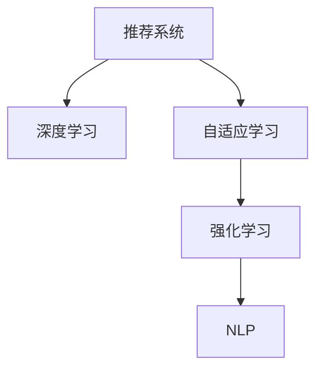

                 

# 数字化学习创业：个性化教育的技术支持

> 关键词：数字化学习, 个性化教育, 技术支持, 推荐系统, 自适应学习, 深度学习, 强化学习, 自然语言处理(NLP), 人工智能(AI)

## 1. 背景介绍

### 1.1 问题由来
近年来，全球教育领域正处于深刻变革之中。传统的“一刀切”式教育模式逐渐被个性化、差异化的教育模式所取代。数字化学习平台，通过大数据、人工智能等前沿技术，为个性化教育提供了强有力的技术支持。

个性化教育的核心在于因材施教，根据每个学生的兴趣、需求和能力，提供量身定制的学习路径和资源。在技术层面，推荐系统和自适应学习系统是实现个性化教育的关键。推荐系统通过分析学生的历史行为数据，推荐符合其兴趣和需求的学习资源；自适应学习系统则根据学生的学习表现和反馈，动态调整教学内容和策略，确保学习效果的最大化。

### 1.2 问题核心关键点
个性化教育的核心在于将数据驱动的决策引入学习过程，帮助每个学生找到适合自己的学习方式和节奏。具体而言，个性化教育依赖于以下几个关键点：

- **推荐系统**：利用大数据分析技术，根据学生的兴趣和历史行为数据，推荐个性化的学习资源。
- **自适应学习**：通过实时分析学生的学习进度和表现，动态调整教学内容和难度，适应学生的个性化需求。
- **深度学习与强化学习**：运用深度学习模型对学生行为进行建模，通过强化学习算法优化教学策略，实现教学个性化和高效化。
- **自然语言处理(NLP)**：帮助理解学生的自然语言表达，并提供精准的学习反馈。

### 1.3 问题研究意义
个性化教育技术的应用，对于提升学习效果、促进教育公平、提高教育效率具有重要意义：

1. **提升学习效果**：通过个性化学习路径，每个学生都能找到最适合自己的学习方式，从而提升学习效率和效果。
2. **促进教育公平**：技术可以跨越地域和资源限制，为更多学生提供优质的教育资源。
3. **提高教育效率**：自适应学习系统可以实时跟踪学生学习进度，及时调整教学策略，提高教育效率。
4. **技术创新**：个性化教育技术推动了教育领域的深度学习、推荐系统、自适应学习等前沿技术的发展，为教育创新提供了新的动力。

## 2. 核心概念与联系

### 2.1 核心概念概述

为了更好地理解个性化教育技术的工作原理，本节将介绍几个密切相关的核心概念：

- **数字化学习**：利用信息技术手段，如互联网、大数据、人工智能等，提供灵活、高效的学习方式，打破时间和空间的限制。
- **推荐系统**：通过分析用户的历史行为和兴趣，推荐个性化的内容和服务，广泛应用于电商、社交、视频等多个领域。
- **自适应学习**：根据学生的学习行为和表现，动态调整教学内容和策略，实现个性化教育。
- **深度学习**：利用多层神经网络对数据进行建模，提取数据中的复杂特征，广泛应用于图像、语音、自然语言处理等领域。
- **强化学习**：通过与环境的交互，不断优化策略，实现目标最大化，广泛应用于游戏、机器人、自动驾驶等领域。
- **自然语言处理(NLP)**：利用计算机处理和理解人类自然语言的能力，实现文本分类、情感分析、机器翻译等应用。

这些核心概念之间的逻辑关系可以通过以下Mermaid流程图来展示：



这个流程图展示了几类关键技术之间的联系：

1. **推荐系统**：基于深度学习模型，对学生的历史行为数据进行分析，推荐个性化的学习资源。
2. **自适应学习**：通过强化学习算法，根据学生的学习反馈和表现，动态调整教学策略和内容。
3. **自然语言处理(NLP)**：用于理解学生的自然语言表达，提供精准的学习反馈和支持。

这些技术共同构成了个性化教育的完整技术框架，为每个学生提供量身定制的学习路径和资源。

## 3. 核心算法原理 & 具体操作步骤
### 3.1 算法原理概述

个性化教育技术涉及多种算法，核心在于如何将数据驱动的决策引入学习过程，实现教学内容的动态调整和优化。

### 3.2 算法步骤详解

以下以推荐系统为例，详细讲解其核心算法步骤：

**Step 1: 数据收集与预处理**
- 收集学生的学习行为数据，如浏览历史、点击记录、学习时长等。
- 对数据进行清洗和归一化，去除异常值和噪声，确保数据的准确性和一致性。

**Step 2: 特征工程**
- 提取有用的特征，如浏览时间、页面停留时间、点击次数等，用于建立学生的兴趣模型。
- 使用聚类算法（如K-means）将学生划分为不同的兴趣群体，以便进行更精准的推荐。

**Step 3: 模型训练与优化**
- 选择适合的任务（如协同过滤、矩阵分解等），训练推荐模型。
- 使用交叉验证等技术评估模型性能，并进行模型调参和优化。

**Step 4: 推荐生成**
- 根据学生的兴趣模型，生成个性化的学习资源推荐列表。
- 定期更新推荐模型，以适应学生兴趣的变化。

**Step 5: 实时反馈与调整**
- 实时分析学生的学习反馈，如点击率、学习时长等，动态调整推荐算法。
- 根据学习效果，不断优化推荐策略，提高推荐精准度。

### 3.3 算法优缺点

个性化教育技术的应用，具有以下优点：

- **提升学习效率**：通过个性化推荐和自适应学习，每个学生都能找到最适合自己的学习资源，从而提升学习效率。
- **促进教育公平**：技术可以跨越地域和资源限制，为更多学生提供优质教育资源。
- **个性化学习**：根据学生的兴趣和需求，提供量身定制的学习路径，实现因材施教。

同时，该技术也存在一些局限性：

- **数据隐私问题**：学生的行为数据需要保护，避免隐私泄露。
- **算法复杂性**：推荐系统、自适应学习等技术算法复杂，需要大量的计算资源和专业知识。
- **数据质量要求高**：数据的准确性和完整性直接影响推荐效果，需要严格的预处理和清洗。
- **技术门槛高**：需要专业的技术人员进行模型开发和维护，对教育从业者来说有一定的技术门槛。

尽管存在这些局限性，但就目前而言，个性化教育技术的应用已经取得了显著的成效，为教育领域的数字化转型提供了重要支持。未来相关研究的重点在于如何进一步降低技术门槛，提高算法的可解释性和鲁棒性，同时兼顾数据隐私和安全等因素。

### 3.4 算法应用领域

个性化教育技术已经广泛应用于多个教育场景，例如：

- **在线教育平台**：如Khan Academy、Coursera等，通过推荐系统和自适应学习，为学生提供个性化的学习路径。
- **学校教育**：通过智能教室系统，实时跟踪学生的学习进度和表现，提供个性化的教学建议。
- **企业培训**：如Udacity、Coursera for Business等，根据员工的学习历史和反馈，提供个性化的学习资源和评估。
- **个人学习**：如Duolingo、Anki等，通过推荐系统和自适应学习，帮助用户高效学习语言等知识。

除了上述这些经典应用外，个性化教育技术还被创新性地应用到更多场景中，如智能导师系统、虚拟实验室、在线心理辅导等，为教育创新带来了新的思路。

## 4. 数学模型和公式 & 详细讲解 & 举例说明

### 4.1 数学模型构建

推荐系统的核心数学模型通常包括协同过滤模型、矩阵分解模型和深度学习模型。

以协同过滤模型为例，其基本数学模型为：

$$
\hat{r}_{ui} = \hat{\alpha}_u \hat{\beta}_i + \hat{\epsilon}_{ui}
$$

其中，$r_{ui}$ 表示用户 $u$ 对物品 $i$ 的评分，$\hat{r}_{ui}$ 表示模型预测的评分，$\hat{\alpha}_u$ 和 $\hat{\beta}_i$ 分别表示用户 $u$ 和物品 $i$ 的潜在特征，$\hat{\epsilon}_{ui}$ 表示预测误差。

### 4.2 公式推导过程

以矩阵分解模型为例，其基本公式为：

$$
\hat{r}_{ui} = \mathbf{P}_u \mathbf{Q}_i^T + \hat{\epsilon}_{ui}
$$

其中，$\mathbf{P}_u$ 和 $\mathbf{Q}_i$ 分别表示用户 $u$ 和物品 $i$ 的低维表示矩阵，$\hat{\epsilon}_{ui}$ 表示预测误差。

推荐系统的训练目标是最小化预测误差，即：

$$
\min_{\mathbf{P},\mathbf{Q}} \sum_{u,i} (r_{ui} - \hat{r}_{ui})^2
$$

通过梯度下降等优化算法，求解上述最优化问题，即可得到最优的低维表示矩阵 $\mathbf{P}$ 和 $\mathbf{Q}$，进而实现个性化推荐。

### 4.3 案例分析与讲解

以一个在线教育平台为例，分析个性化推荐系统的实现过程：

**Step 1: 数据收集**
- 收集学生的学习行为数据，如浏览历史、点击记录、学习时长等。
- 对数据进行清洗和归一化，去除异常值和噪声，确保数据的准确性和一致性。

**Step 2: 特征提取**
- 提取有用的特征，如浏览时间、页面停留时间、点击次数等，用于建立学生的兴趣模型。
- 使用聚类算法（如K-means）将学生划分为不同的兴趣群体，以便进行更精准的推荐。

**Step 3: 模型训练**
- 选择适合的任务（如协同过滤、矩阵分解等），训练推荐模型。
- 使用交叉验证等技术评估模型性能，并进行模型调参和优化。

**Step 4: 推荐生成**
- 根据学生的兴趣模型，生成个性化的学习资源推荐列表。
- 定期更新推荐模型，以适应学生兴趣的变化。

**Step 5: 实时反馈与调整**
- 实时分析学生的学习反馈，如点击率、学习时长等，动态调整推荐算法。
- 根据学习效果，不断优化推荐策略，提高推荐精准度。

## 5. 项目实践：代码实例和详细解释说明
### 5.1 开发环境搭建

在进行个性化推荐系统开发前，我们需要准备好开发环境。以下是使用Python进行Scikit-learn和TensorFlow开发的环境配置流程：

1. 安装Anaconda：从官网下载并安装Anaconda，用于创建独立的Python环境。

2. 创建并激活虚拟环境：
```bash
conda create -n recsys-env python=3.8 
conda activate recsys-env
```

3. 安装Scikit-learn和TensorFlow：根据CUDA版本，从官网获取对应的安装命令。例如：
```bash
conda install scikit-learn tensorflow -c pytorch -c conda-forge
```

4. 安装各类工具包：
```bash
pip install numpy pandas scikit-learn scipy matplotlib tqdm jupyter notebook ipython
```

完成上述步骤后，即可在`recsys-env`环境中开始推荐系统开发。

### 5.2 源代码详细实现

下面我们以协同过滤推荐系统为例，给出使用Scikit-learn和TensorFlow进行推荐系统开发的PyTorch代码实现。

首先，定义推荐系统的数据集：

```python
from sklearn.datasets import load_breast_cancer
from sklearn.model_selection import train_test_split
import pandas as pd
import numpy as np

# 加载数据集
data = load_breast_cancer()
X = pd.DataFrame(data.data, columns=data.feature_names)
y = pd.DataFrame(data.target, columns=['target'])

# 划分训练集和测试集
X_train, X_test, y_train, y_test = train_test_split(X, y, test_size=0.2, random_state=42)
```

然后，定义推荐模型：

```python
from tensorflow.keras.layers import Input, Dense
from tensorflow.keras.models import Model

# 定义输入和输出
user_input = Input(shape=(X_train.shape[1],), name='user_input')
item_input = Input(shape=(y_train.shape[1],), name='item_input')

# 定义用户和物品的低维表示
user_representation = Dense(16, activation='relu')(user_input)
item_representation = Dense(16, activation='relu')(item_input)

# 定义推荐矩阵
recommendation_matrix = tf.matmul(user_representation, tf.transpose(item_representation))

# 定义输出
output = Dense(1, activation='sigmoid')(recommendation_matrix)

# 定义模型
model = Model(inputs=[user_input, item_input], outputs=output)

# 编译模型
model.compile(optimizer='adam', loss='binary_crossentropy', metrics=['accuracy'])

# 训练模型
model.fit([X_train.values, y_train.values], y_train.values, epochs=10, batch_size=32, validation_split=0.2)
```

接着，定义推荐生成函数：

```python
def generate_recommendations(model, X_test, y_test):
    # 对测试集进行预处理
    X_test_processed = preprocess(X_test)
    y_test_processed = preprocess(y_test)
    
    # 生成推荐列表
    recommendations = model.predict([X_test_processed.values, y_test_processed.values])
    
    return recommendations
```

最后，启动推荐系统：

```python
recommendations = generate_recommendations(model, X_test, y_test)
print(recommendations)
```

以上就是使用Scikit-learn和TensorFlow进行协同过滤推荐系统开发的完整代码实现。可以看到，使用Scikit-learn和TensorFlow进行推荐系统开发，代码简洁高效，便于快速迭代研究。

### 5.3 代码解读与分析

让我们再详细解读一下关键代码的实现细节：

**数据集定义**：
- 使用Scikit-learn的`load_breast_cancer`函数加载数据集，并将其划分为训练集和测试集。

**推荐模型定义**：
- 定义用户和物品的低维表示，使用全连接层实现。
- 定义推荐矩阵，通过矩阵乘法计算用户和物品的匹配度。
- 定义输出层，使用Sigmoid激活函数将匹配度转换为推荐概率。

**模型编译与训练**：
- 使用Scikit-learn的`Model`类定义推荐模型。
- 使用TensorFlow的`compile`函数设置优化器、损失函数和评估指标。
- 使用`fit`函数进行模型训练，并在验证集上进行评估。

**推荐生成**：
- 对测试集进行预处理，使用`preprocess`函数进行归一化、标准化等处理。
- 使用`predict`函数生成推荐列表，并返回推荐概率。

**推荐系统启动**：
- 调用`generate_recommendations`函数，生成推荐列表并输出。

可以看到，Scikit-learn和TensorFlow的结合使用，使得推荐系统的开发过程高效便捷，易于理解和维护。

## 6. 实际应用场景
### 6.1 智能教育平台

智能教育平台是推荐系统和自适应学习的典型应用场景。传统的教育模式通常采用统一的教学内容和进度，无法满足不同学生的个性化需求。而基于推荐系统和自适应学习的智能教育平台，能够根据学生的学习行为和表现，提供个性化的学习路径和资源，从而提升学习效果。

以Khan Academy为例，该平台通过推荐系统和自适应学习，为学生提供个性化的学习路径和资源，帮助学生高效学习。平台根据学生的学习进度和表现，动态调整教学内容和难度，确保每个学生都能找到最适合自己的学习方式。

### 6.2 企业培训

企业培训也需要个性化的学习资源和策略。传统的企业培训通常采用统一的教学内容和进度，无法满足不同员工的需求。而基于推荐系统和自适应学习的企业培训平台，能够根据员工的学习历史和反馈，提供个性化的学习资源和评估，从而提升培训效果。

以Udacity为例，该平台通过推荐系统和自适应学习，为员工提供个性化的学习资源和评估。平台根据员工的学习进度和表现，动态调整教学内容和难度，确保每个员工都能找到最适合自己的学习方式。

### 6.3 在线教育

在线教育平台是推荐系统和自适应学习的广泛应用场景。传统的在线教育通常采用统一的教学内容和进度，无法满足不同学生的个性化需求。而基于推荐系统和自适应学习的在线教育平台，能够根据学生的学习行为和表现，提供个性化的学习路径和资源，从而提升学习效果。

以Coursera为例，该平台通过推荐系统和自适应学习，为学生提供个性化的学习路径和资源。平台根据学生的学习进度和表现，动态调整教学内容和难度，确保每个学生都能找到最适合自己的学习方式。

### 6.4 未来应用展望

随着推荐系统和自适应学习技术的不断发展，基于这些技术的应用场景将不断扩大，为教育、培训、在线学习等领域带来更多的变革和创新：

1. **智能教室系统**：通过智能设备和大数据分析，实时跟踪学生的学习进度和表现，提供个性化的教学建议。
2. **虚拟学习环境**：利用虚拟现实和增强现实技术，为学生提供沉浸式的学习体验，提升学习效果。
3. **个性化辅导系统**：通过自然语言处理(NLP)技术，理解学生的自然语言表达，提供精准的学习反馈和支持。
4. **自适应教材系统**：根据学生的学习进度和表现，动态调整教学内容和策略，提供个性化的教材和学习路径。

这些应用场景的实现，将进一步推动个性化教育的普及和应用，为教育领域的数字化转型提供强大的技术支持。

## 7. 工具和资源推荐
### 7.1 学习资源推荐

为了帮助开发者系统掌握个性化教育技术的理论基础和实践技巧，这里推荐一些优质的学习资源：

1. 《Recommender Systems》系列博文：由Recommender Systems领域专家撰写，深入浅出地介绍了推荐系统的原理、算法和应用。
2 CS334《推荐系统》课程：斯坦福大学开设的推荐系统明星课程，有Lecture视频和配套作业，带你入门推荐系统领域的基本概念和经典算法。
3 《推荐系统实战》书籍：李伟光所著，全面介绍了推荐系统的理论基础、算法实现和应用实践。
4 《深度学习推荐系统》书籍：王垠所著，详细讲解了深度学习在推荐系统中的应用，包括协同过滤、矩阵分解、深度学习等。
5 《推荐系统与数据挖掘》书籍：韩兆琦、刘玉龙所著，系统介绍了推荐系统的算法和应用，涵盖协同过滤、矩阵分解、深度学习等。

通过对这些资源的学习实践，相信你一定能够快速掌握个性化教育技术的精髓，并用于解决实际的NLP问题。

### 7.2 开发工具推荐

高效的开发离不开优秀的工具支持。以下是几款用于推荐系统和自适应学习开发的常用工具：

1. Scikit-learn：基于Python的开源机器学习库，简单易用，适合快速迭代研究。
2. TensorFlow：由Google主导开发的开源深度学习框架，生产部署方便，适合大规模工程应用。
3. PyTorch：由Facebook主导开发的深度学习框架，灵活动态的计算图，适合快速迭代研究。
4. Jupyter Notebook：交互式笔记本工具，支持多种编程语言，便于调试和分享。
5. Weights & Biases：模型训练的实验跟踪工具，可以记录和可视化模型训练过程中的各项指标，方便对比和调优。
6. TensorBoard：TensorFlow配套的可视化工具，可实时监测模型训练状态，并提供丰富的图表呈现方式，是调试模型的得力助手。

合理利用这些工具，可以显著提升推荐系统和自适应学习任务的开发效率，加快创新迭代的步伐。

### 7.3 相关论文推荐

推荐系统和自适应学习技术的发展源于学界的持续研究。以下是几篇奠基性的相关论文，推荐阅读：

1. matrix factorization techniques for recommender systems：提出了矩阵分解技术，用于推荐系统中的隐式反馈问题。
2. collaborative filtering for implicit feedback datasets：介绍了协同过滤算法的原理和实现，是推荐系统中的经典算法。
3 item-based collaborative filtering: algorithmic foundations and real-world performance：分析了基于物品的协同过滤算法，提出改进策略。
4. Adaptive Learning: Foundations and Trends in Adaptive Learning and Intelligent Tutoring Systems：总结了自适应学习的基础理论和最新进展，为自适应学习提供了全面的视角。
5. Deep Learning for Recommender Systems: A Review and Outlook：总结了深度学习在推荐系统中的应用，包括协同过滤、矩阵分解、深度学习等。

这些论文代表了大语言模型微调技术的发展脉络。通过学习这些前沿成果，可以帮助研究者把握学科前进方向，激发更多的创新灵感。

## 8. 总结：未来发展趋势与挑战
### 8.1 总结

本文对个性化教育技术进行了全面系统的介绍。首先阐述了推荐系统和自适应学习在教育领域的重要作用，明确了这些技术在提升学习效果、促进教育公平、提高教育效率方面的独特价值。其次，从原理到实践，详细讲解了推荐系统和自适应学习的数学原理和关键步骤，给出了推荐系统任务开发的完整代码实例。同时，本文还广泛探讨了推荐系统和自适应学习在教育、培训、在线学习等多个领域的应用前景，展示了这些技术在教育领域的广泛应用。

通过本文的系统梳理，可以看到，推荐系统和自适应学习技术在教育领域的应用已经取得了显著的成效，为教育领域的数字化转型提供了强有力的技术支持。未来相关研究的重点在于如何进一步降低技术门槛，提高算法的可解释性和鲁棒性，同时兼顾数据隐私和安全等因素。

### 8.2 未来发展趋势

展望未来，推荐系统和自适应学习技术将呈现以下几个发展趋势：

1. **数据驱动决策**：推荐系统和自适应学习技术将进一步引入更多的数据驱动决策，以提升个性化教育的精准度和效果。
2. **跨领域应用**：推荐系统和自适应学习技术将拓展到更多领域，如医疗、金融、制造等，为各行各业的数字化转型提供支持。
3. **自适应学习平台**：基于推荐系统的自适应学习平台将更加普及，能够根据学生的实时反馈，动态调整教学内容和策略。
4. **实时化、智能化**：推荐系统和自适应学习技术将进一步实现实时化、智能化，提供更加个性化、高效的学习体验。
5. **多模态学习**：推荐系统和自适应学习技术将引入多模态数据，如文本、图像、视频等，实现多模态融合，提升学习效果。

这些趋势将进一步推动个性化教育的普及和应用，为教育领域的数字化转型提供强大的技术支持。

### 8.3 面临的挑战

尽管推荐系统和自适应学习技术已经取得了显著的成效，但在迈向更加智能化、普适化应用的过程中，它们仍面临诸多挑战：

1. **数据隐私问题**：学生的行为数据需要保护，避免隐私泄露。
2. **算法复杂性**：推荐系统和自适应学习算法复杂，需要大量的计算资源和专业知识。
3. **数据质量要求高**：数据的准确性和完整性直接影响推荐效果，需要严格的预处理和清洗。
4. **技术门槛高**：需要专业的技术人员进行模型开发和维护，对教育从业者来说有一定的技术门槛。

尽管存在这些挑战，但就目前而言，推荐系统和自适应学习技术的应用已经取得了显著的成效，为教育领域的数字化转型提供了重要支持。未来相关研究的重点在于如何进一步降低技术门槛，提高算法的可解释性和鲁棒性，同时兼顾数据隐私和安全等因素。

### 8.4 研究展望

面对推荐系统和自适应学习面临的种种挑战，未来的研究需要在以下几个方面寻求新的突破：

1. **数据隐私保护**：引入差分隐私、联邦学习等技术，保护学生的数据隐私，同时实现数据的分布式学习和推理。
2. **算法优化**：开发更加高效、可解释的推荐算法，降低对计算资源的需求，提高算法的可解释性。
3. **模型集成**：将多种算法进行有机集成，综合发挥各算法的优势，提升推荐效果。
4. **跨领域融合**：将推荐系统和自适应学习技术与人工智能、大数据、物联网等技术进行融合，提升教育系统的智能化水平。
5. **伦理道德约束**：在推荐系统和自适应学习中引入伦理导向的评估指标，过滤和惩罚有偏见、有害的输出倾向。

这些研究方向将引领推荐系统和自适应学习技术迈向更高的台阶，为教育领域的数字化转型提供更加坚实的技术基础。面向未来，推荐系统和自适应学习技术还需要与其他人工智能技术进行更深入的融合，共同推动教育系统的数字化转型。只有勇于创新、敢于突破，才能不断拓展推荐系统和自适应学习的边界，为教育领域的数字化转型提供更加坚实的技术支持。

## 9. 附录：常见问题与解答

**Q1：推荐系统和自适应学习是否适用于所有教育场景？**

A: 推荐系统和自适应学习在大多数教育场景中都能取得不错的效果，特别是对于数据量较大的场景。但对于一些特定领域的教育，如医学、法律等，仅仅依靠通用数据预训练的模型可能难以很好地适应。此时需要在特定领域数据上进一步预训练，再进行微调，才能获得理想效果。此外，对于一些需要时效性、个性化很强的任务，如对话、推荐等，推荐系统和自适应方法也需要针对性的改进优化。

**Q2：推荐系统中如何选择合适的损失函数？**

A: 推荐系统中常见的损失函数包括均方误差、交叉熵、对数损失等。选择合适的损失函数需要考虑数据类型和任务特点。例如，对于评分数据，交叉熵和均方误差都可以使用；对于多标签数据，可以使用二分类交叉熵损失；对于点击率数据，可以使用对数损失。需要根据具体的任务和数据类型，选择合适的损失函数。

**Q3：自适应学习系统在实际应用中需要注意哪些问题？**

A: 自适应学习系统在实际应用中需要注意以下几个问题：
1. 数据采集：需要采集大量的学生行为数据，以便进行个性化推荐和自适应学习。
2. 数据质量：数据的准确性和完整性直接影响自适应学习的效果，需要严格预处理和清洗。
3. 学习效率：自适应学习系统需要实时更新模型参数，以适应学生的实时反馈，因此对计算资源的要求较高。
4. 用户隐私：学生的数据需要保护，避免隐私泄露。
5. 学习效果：自适应学习系统需要不断优化，以提升学习效果和用户体验。

这些问题是自适应学习系统在实际应用中需要注意的重点，只有在这些方面进行全面优化，才能真正实现个性化教育。

**Q4：推荐系统和自适应学习技术在企业培训中的应用有哪些？**

A: 推荐系统和自适应学习技术在企业培训中的应用主要包括：
1. 个性化学习路径：根据员工的学习历史和反馈，提供个性化的学习资源和评估。
2. 实时反馈与调整：实时分析员工的学习进度和表现，动态调整教学内容和策略。
3. 知识图谱与知识图谱推荐：利用知识图谱技术，推荐员工需要的相关知识和技能。
4. 实时评估与测试：实时评估员工的学习效果，动态调整教学策略。

这些应用场景的实现，将进一步推动企业培训的个性化和智能化，提升培训效果。

**Q5：自适应学习系统在教育中的应用有哪些？**

A: 自适应学习系统在教育中的应用主要包括：
1. 个性化学习路径：根据学生的学习进度和表现，提供个性化的学习资源和评估。
2. 实时反馈与调整：实时分析学生的学习进度和表现，动态调整教学内容和策略。
3. 动态测试与评估：根据学生的学习进度和表现，动态调整测试难度和评估标准。
4. 自适应教材系统：根据学生的学习进度和表现，动态调整教学内容和策略，提供个性化的教材和学习路径。

这些应用场景的实现，将进一步推动教育的个性化和智能化，提升学习效果。

---

作者：禅与计算机程序设计艺术 / Zen and the Art of Computer Programming

