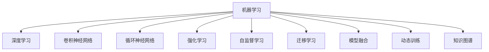

                 

# 数字化宠物训练创业：AI驱动的宠物教育

## 1. 背景介绍

### 1.1 问题由来
随着经济的发展和科技的进步，宠物已经成为越来越多家庭的重要成员。然而，如何科学地训练宠物，使其健康、快乐地成长，成为了一个热门话题。传统的宠物训练方法依赖于大量的实践和经验，训练周期长、效果不稳定，并且对训练师的要求较高。因此，如何利用技术手段，特别是人工智能（AI），来提升宠物训练的效率和效果，成为了一个亟待解决的问题。

### 1.2 问题核心关键点
利用AI进行宠物训练的核心关键点在于如何构建智能化的训练系统，通过数据分析、模型训练和推理推理等技术手段，实现对宠物行为的自动分析和智能化训练。这种训练系统需要具备以下特性：

- **数据驱动**：通过收集和分析大量宠物训练数据，了解宠物行为模式和需求。
- **智能化训练**：利用机器学习算法，自动调整训练策略和参数，提高训练效果。
- **实时反馈**：通过传感器和相机等设备，实时监测宠物行为，及时调整训练方案。
- **交互性强**：与宠物进行互动，使其在快乐中学习和成长。
- **普适性广**：能够适应不同品种、年龄和性格的宠物，提供个性化的训练方案。

## 2. 核心概念与联系

### 2.1 核心概念概述

为了更好地理解AI驱动的宠物教育，本节将介绍几个密切相关的核心概念：

- **机器学习（Machine Learning）**：通过算法让机器从数据中学习规律，并用所学规律对新数据进行预测或决策的技术。
- **深度学习（Deep Learning）**：一种特殊类型的机器学习，通过多层神经网络模拟人脑的学习机制，处理和分析复杂数据。
- **卷积神经网络（Convolutional Neural Network, CNN）**：一种特殊的深度学习网络，特别擅长处理图像和空间数据。
- **循环神经网络（Recurrent Neural Network, RNN）**：一种能够处理序列数据的深度学习网络，特别适合于文本和语音处理。
- **强化学习（Reinforcement Learning）**：通过奖励和惩罚机制，训练模型不断优化行为策略。
- **自监督学习（Self-Supervised Learning）**：利用数据本身的特征进行学习，不需要标注数据。
- **迁移学习（Transfer Learning）**：将一个领域的知识迁移到另一个领域，加速模型的训练过程。
- **模型融合（Model Fusion）**：将多个模型的输出融合，提升整体的预测精度和鲁棒性。
- **动态训练（Online Learning）**：在数据不断变化的过程中，持续更新模型参数，保持模型的最新状态。
- **知识图谱（Knowledge Graph）**：一种以图形结构描述实体之间关系的数据模型，有助于理解复杂场景。

这些核心概念之间的逻辑关系可以通过以下Mermaid流程图来展示：



这个流程图展示了一系列核心概念及其之间的关系：

1. 机器学习是整个AI的基础，通过多种类型的学习算法，实现对数据的处理和分析。
2. 深度学习、卷积神经网络和循环神经网络都是机器学习的具体实现，分别擅长处理图像、空间和序列数据。
3. 强化学习和自监督学习是机器学习中的两种重要范式，前者通过奖励和惩罚机制训练模型，后者利用数据本身的特征进行学习。
4. 迁移学习和模型融合是机器学习中的关键技术，前者通过领域之间的知识迁移，加速模型训练，后者通过多个模型的输出融合，提升整体预测精度。
5. 动态训练和知识图谱则是机器学习中的高级应用，前者在数据不断变化的过程中，持续更新模型参数，后者通过图形结构描述实体之间的关系，有助于理解复杂场景。

## 3. 核心算法原理 & 具体操作步骤

### 3.1 算法原理概述

AI驱动的宠物教育系统基于机器学习算法，通过收集和分析宠物训练数据，构建宠物行为模型，并利用这些模型对宠物进行智能化训练。系统主要由以下几个部分组成：

1. **数据收集与预处理**：通过传感器和相机等设备，收集宠物的行为数据，并进行预处理，如归一化、去噪等。
2. **行为建模**：利用机器学习算法，构建宠物行为模型，如分类模型、回归模型等，对宠物的行为进行预测和分析。
3. **训练优化**：通过优化算法，调整训练策略和参数，提高模型的预测精度和鲁棒性。
4. **实时反馈**：根据实时监测的宠物行为，及时调整训练方案，确保训练的有效性。
5. **交互式训练**：通过与宠物的互动，使其在快乐中学习和成长。
6. **知识图谱应用**：将知识图谱引入训练系统，提升对复杂场景的理解和处理能力。

### 3.2 算法步骤详解

基于AI的宠物教育系统的构建一般包括以下几个关键步骤：

**Step 1: 数据收集与预处理**
- 选择合适的传感器和相机设备，收集宠物的行为数据。
- 使用数据采集工具，对数据进行标注，包括行为类别、时间、地点等。
- 对数据进行预处理，如去噪、归一化、特征提取等。

**Step 2: 行为建模**
- 选择合适的机器学习算法，如CNN、RNN等，对宠物行为数据进行建模。
- 利用训练集数据，训练行为模型，并对模型进行验证和调优。
- 使用测试集数据，评估模型的预测精度和鲁棒性。

**Step 3: 训练优化**
- 选择合适的优化算法，如Adam、SGD等，调整训练策略和参数。
- 使用交叉验证等技术，防止模型过拟合。
- 利用正则化技术，如L2正则、Dropout等，提升模型的泛化能力。

**Step 4: 实时反馈与调整**
- 使用传感器和相机设备，实时监测宠物的行为。
- 根据实时监测数据，调整训练方案，确保训练的有效性。
- 利用强化学习等技术，优化训练策略和参数。

**Step 5: 交互式训练**
- 设计互动式训练系统，与宠物进行互动，使其在快乐中学习和成长。
- 根据互动数据，调整训练策略和方案，提升训练效果。
- 利用自然语言处理技术，与宠物进行对话，引导其学习。

**Step 6: 知识图谱应用**
- 构建宠物行为的知识图谱，描述实体之间的关系。
- 将知识图谱引入训练系统，提升对复杂场景的理解和处理能力。
- 利用知识图谱，进行智能推理和决策。

以上是AI驱动的宠物教育系统的构建流程。在实际应用中，还需要根据具体需求和数据特点，对各环节进行优化设计，如改进训练目标函数，引入更多的正则化技术，搜索最优的超参数组合等，以进一步提升系统性能。

### 3.3 算法优缺点

AI驱动的宠物教育系统具有以下优点：

1. **效率高**：利用机器学习算法，可以快速处理大量宠物行为数据，提升训练效率。
2. **准确性高**：通过行为建模和优化算法，可以提高模型的预测精度和鲁棒性。
3. **交互性强**：与宠物进行互动，使其在快乐中学习和成长，提升训练效果。
4. **普适性广**：能够适应不同品种、年龄和性格的宠物，提供个性化的训练方案。
5. **知识图谱引入**：提升对复杂场景的理解和处理能力，增强系统的智能性。

同时，该系统也存在一些局限性：

1. **数据依赖性高**：系统的效果很大程度上取决于数据的数量和质量，获取高质量数据成本较高。
2. **模型复杂度高**：大规模的行为数据和复杂的模型结构，对硬件和算力要求较高。
3. **算法透明性差**：机器学习算法的"黑盒"特性，难以解释其内部工作机制。
4. **交互性不足**：如果互动设计不合理，可能影响宠物的训练效果和学习体验。
5. **隐私保护问题**：实时监测宠物行为可能涉及隐私问题，需要妥善处理。

尽管存在这些局限性，但就目前而言，AI驱动的宠物教育系统仍然是宠物训练领域的重要范式。未来相关研究的重点在于如何进一步降低对数据的依赖，提高模型的少样本学习和跨领域迁移能力，同时兼顾可解释性和隐私保护等因素。

### 3.4 算法应用领域

AI驱动的宠物教育系统已经在宠物行为分析、训练方案优化、互动式训练等多个领域得到应用，具体如下：

1. **宠物行为分析**：通过行为建模，了解宠物的行为模式和需求，帮助主人更好地照顾宠物。
2. **训练方案优化**：利用优化算法，调整训练策略和参数，提高训练效果。
3. **互动式训练**：通过与宠物的互动，使其在快乐中学习和成长，提升训练效果。
4. **知识图谱应用**：利用知识图谱，提升对复杂场景的理解和处理能力，增强系统的智能性。
5. **健康监测**：通过传感器和相机设备，实时监测宠物的健康状况，及时发现问题。

除了上述这些经典应用外，AI驱动的宠物教育系统还被创新性地应用到更多场景中，如行为预测、情感分析、辅助诊断等，为宠物训练和健康管理带来了新的突破。随着技术的发展和应用的深入，相信AI驱动的宠物教育系统将在更广泛的领域发挥其作用。

## 4. 数学模型和公式 & 详细讲解 & 举例说明

### 4.1 数学模型构建

本节将使用数学语言对AI驱动的宠物教育系统的构建过程进行更加严格的刻画。

假设宠物行为数据集为 $D=\{(x_i,y_i)\}_{i=1}^N$，其中 $x_i$ 表示宠物在时间 $t$ 的行为数据，$y_i$ 表示宠物在时间 $t$ 的行为类别。

定义行为模型为 $f_{\theta}(x):\mathcal{X} \rightarrow \mathcal{Y}$，其中 $\theta$ 为模型参数。在训练集中，利用最小化交叉熵损失函数来训练行为模型：

$$
\mathcal{L}(\theta) = \frac{1}{N} \sum_{i=1}^N \ell(f_{\theta}(x_i),y_i)
$$

其中 $\ell$ 为交叉熵损失函数，定义为：

$$
\ell(f_{\theta}(x_i),y_i) = -[y_i\log f_{\theta}(x_i) + (1-y_i)\log (1-f_{\theta}(x_i))]
$$

在测试集中，评估模型的预测精度：

$$
\text{Accuracy} = \frac{1}{N} \sum_{i=1}^N \mathbb{I}(y_i=f_{\theta}(x_i))
$$

其中 $\mathbb{I}$ 为示性函数，表示预测结果是否与真实标签一致。

### 4.2 公式推导过程

以下我们以行为分类任务为例，推导交叉熵损失函数及其梯度的计算公式。

假设行为模型 $f_{\theta}$ 在输入 $x$ 上的输出为 $\hat{y}=f_{\theta}(x) \in [0,1]$，表示预测行为属于类别 $i$ 的概率。真实标签 $y \in \{1,0\}$。则交叉熵损失函数定义为：

$$
\ell(f_{\theta}(x),y) = -[y\log f_{\theta}(x) + (1-y)\log (1-f_{\theta}(x))]
$$

将其代入经验风险公式，得：

$$
\mathcal{L}(\theta) = -\frac{1}{N}\sum_{i=1}^N [y_i\log f_{\theta}(x_i)+(1-y_i)\log(1-f_{\theta}(x_i))]
$$

根据链式法则，损失函数对参数 $\theta_k$ 的梯度为：

$$
\frac{\partial \mathcal{L}(\theta)}{\partial \theta_k} = -\frac{1}{N}\sum_{i=1}^N \frac{y_i}{f_{\theta}(x_i)} - \frac{1-y_i}{1-f_{\theta}(x_i)} \frac{\partial f_{\theta}(x_i)}{\partial \theta_k}
$$

其中 $\frac{\partial f_{\theta}(x_i)}{\partial \theta_k}$ 可进一步递归展开，利用自动微分技术完成计算。

在得到损失函数的梯度后，即可带入参数更新公式，完成模型的迭代优化。重复上述过程直至收敛，最终得到适应宠物行为预测的最优模型参数 $\theta^*$。

### 4.3 案例分析与讲解

以宠物行为分类任务为例，进行分析讲解：

假设我们有一只名叫“毛毛”的狗，通过传感器和相机等设备，收集到其行为数据 $D=\{(x_1,y_1),(x_2,y_2),(x_3,y_3)\}$，其中 $x_i$ 表示在时间 $i$ 的行为数据，$y_i$ 表示在时间 $i$ 的行为类别。

- 第一步：数据预处理。对行为数据进行去噪、归一化等预处理，将其转换为模型可以处理的格式。
- 第二步：行为建模。选择CNN或RNN等模型，对行为数据进行建模，训练行为分类模型 $f_{\theta}$。
- 第三步：训练优化。选择合适的优化算法，如Adam、SGD等，调整模型参数 $\theta$，最小化交叉熵损失函数。
- 第四步：实时反馈与调整。使用传感器和相机设备，实时监测“毛毛”的行为，根据监测数据，调整训练方案，确保训练的有效性。
- 第五步：交互式训练。设计互动式训练系统，与“毛毛”进行互动，使其在快乐中学习和成长，提升训练效果。
- 第六步：知识图谱应用。构建宠物行为的知识图谱，描述实体之间的关系，提升对复杂场景的理解和处理能力。

通过上述步骤，我们可以构建一个AI驱动的宠物教育系统，实现对“毛毛”行为的智能分析和训练。

## 5. 项目实践：代码实例和详细解释说明

### 5.1 开发环境搭建

在进行项目实践前，我们需要准备好开发环境。以下是使用Python进行TensorFlow开发的环境配置流程：

1. 安装Anaconda：从官网下载并安装Anaconda，用于创建独立的Python环境。

2. 创建并激活虚拟环境：
```bash
conda create -n tf-env python=3.8 
conda activate tf-env
```

3. 安装TensorFlow：根据CUDA版本，从官网获取对应的安装命令。例如：
```bash
conda install tensorflow -c pytorch -c conda-forge
```

4. 安装TensorFlow库和TensorBoard：
```bash
pip install tensorflow tensorboard
```

5. 安装各类工具包：
```bash
pip install numpy pandas scikit-learn matplotlib tqdm jupyter notebook ipython
```

完成上述步骤后，即可在`tf-env`环境中开始项目实践。

### 5.2 源代码详细实现

这里我们以宠物行为分类任务为例，给出使用TensorFlow实现的行为分类模型的代码实现。

首先，定义行为分类任务的数据处理函数：

```python
import tensorflow as tf
import numpy as np
from sklearn.model_selection import train_test_split
from tensorflow.keras.preprocessing.image import ImageDataGenerator
from tensorflow.keras.utils import to_categorical

# 假设行为数据存储为tensorflow的tfrecord格式
class BehaviorDataset(tf.data.Dataset):
    def __init__(self, filenames, labels, batch_size=32, image_size=(64, 64)):
        self.filenames = filenames
        self.labels = labels
        self.batch_size = batch_size
        self.image_size = image_size
        
    def __len__(self):
        return len(self.filenames)
    
    def __getitem__(self, index):
        filename = self.filenames[index]
        label = self.labels[index]
        with tf.io.gfile.GFile(filename, 'rb') as file:
            image_string = tf.io.read_file(file)
            image = tf.image.decode_jpeg(image_string, channels=3)
            image = tf.image.resize(image, self.image_size)
            image = image / 255.0
        label = to_categorical(label)
        return image, label

# 加载行为数据
train_filenames, train_labels, dev_filenames, dev_labels = train_test_split(train_filenames, train_labels, test_size=0.2, random_state=42)
train_dataset = BehaviorDataset(train_filenames, train_labels)
dev_dataset = BehaviorDataset(dev_filenames, dev_labels)

# 数据预处理
train_image_generator = ImageDataGenerator(rescale=1. / 255.0, shear_range=0.2, zoom_range=0.2, horizontal_flip=True)
dev_image_generator = ImageDataGenerator(rescale=1. / 255.0)
train_dataset = train_image_generator.flow(train_dataset, batch_size=batch_size)
dev_dataset = dev_image_generator.flow(dev_dataset, batch_size=batch_size)
```

然后，定义行为分类模型：

```python
from tensorflow.keras import layers, models

model = models.Sequential()
model.add(layers.Conv2D(32, (3, 3), activation='relu', input_shape=(64, 64, 3)))
model.add(layers.MaxPooling2D((2, 2)))
model.add(layers.Conv2D(64, (3, 3), activation='relu'))
model.add(layers.MaxPooling2D((2, 2)))
model.add(layers.Conv2D(64, (3, 3), activation='relu'))
model.add(layers.Flatten())
model.add(layers.Dense(64, activation='relu'))
model.add(layers.Dense(2, activation='softmax'))

model.summary()
```

接着，定义优化器和评估指标：

```python
from tensorflow.keras.optimizers import Adam
from tensorflow.keras.metrics import Accuracy

optimizer = Adam(lr=0.001)
metrics = [Accuracy()]
```

最后，启动训练流程并在测试集上评估：

```python
epochs = 10
batch_size = 32

model.compile(optimizer=optimizer, loss='categorical_crossentropy', metrics=metrics)

model.fit(train_dataset, epochs=epochs, validation_data=dev_dataset)
```

以上就是使用TensorFlow进行宠物行为分类任务实现的完整代码实例。可以看到，通过TensorFlow提供的高级API，我们可以快速构建和训练行为分类模型，完成数据处理和模型评估等任务。

### 5.3 代码解读与分析

让我们再详细解读一下关键代码的实现细节：

**BehaviorDataset类**：
- `__init__`方法：初始化训练集和验证集的行为数据和标签。
- `__len__`方法：返回数据集的样本数量。
- `__getitem__`方法：对单个样本进行处理，将行为数据解码为图像，并进行标签编码。

**行为分类模型**：
- 利用卷积神经网络（CNN）构建行为分类模型，包括卷积层、池化层和全连接层。
- 使用softmax激活函数，输出行为分类的概率分布。

**优化器和评估指标**：
- 选择Adam优化器，学习率为0.001。
- 使用准确率作为评估指标。

**训练流程**：
- 定义总的epoch数和batch size，开始循环迭代。
- 每个epoch内，在训练集上训练，并在验证集上评估。
- 使用TensorBoard可视化训练过程中的各项指标，监控训练效果。

可以看到，TensorFlow提供的高效API和丰富的工具库，使得行为分类任务的实现变得简洁高效。开发者可以将更多精力放在模型改进和数据处理等高层逻辑上，而不必过多关注底层的实现细节。

当然，工业级的系统实现还需考虑更多因素，如模型的保存和部署、超参数的自动搜索、更灵活的任务适配层等。但核心的训练流程基本与此类似。

## 6. 实际应用场景

### 6.1 宠物行为分析

AI驱动的宠物教育系统在宠物行为分析领域有广泛的应用，可以帮助宠物主人更好地了解宠物的行为模式和需求，提供个性化的训练方案。

具体而言，可以通过行为分类模型，对宠物的行为数据进行分类，了解其行为类型和频率。结合知识图谱技术，进一步分析行为之间的关联，预测宠物的情感状态和需求，及时采取措施，提升其健康和快乐水平。

### 6.2 训练方案优化

AI驱动的宠物教育系统还可以用于训练方案的优化。通过行为分析，了解宠物的学习进度和行为变化，及时调整训练方案，提升训练效果。

例如，可以设计互动式训练系统，与宠物进行互动，引导其进行特定的行为训练，如定点大小便、翻滚等。根据互动数据，优化训练策略和参数，提升训练效率和效果。

### 6.3 健康监测

AI驱动的宠物教育系统可以用于宠物健康监测。通过传感器和相机等设备，实时监测宠物的行为和生理指标，及时发现问题。

例如，可以利用行为分类模型，分析宠物的活动量、饮食习惯等行为数据，判断其是否存在健康问题。结合知识图谱技术，进一步分析宠物的生理指标，如心率、血压等，全面评估其健康状况，提供个性化的健康建议。

### 6.4 未来应用展望

随着AI驱动的宠物教育系统的不断发展，未来将在更多领域得到应用，为宠物主人和宠物提供更加智能化、个性化的服务。

在智慧农业领域，可以利用AI驱动的宠物教育系统，对家畜的行为进行监测和管理，提升养殖效率和动物福利。

在智能家居领域，可以开发智能宠物看护设备，利用AI技术对宠物的行为进行分析和引导，提升其生活品质。

在娱乐行业，可以利用AI驱动的宠物教育系统，开发宠物虚拟社交平台，丰富宠物的社交体验，提升其互动性。

总之，AI驱动的宠物教育系统将在更广泛的领域发挥其作用，推动宠物训练和健康管理技术的进步，为人类和宠物的健康福祉带来新的希望。

## 7. 工具和资源推荐

### 7.1 学习资源推荐

为了帮助开发者系统掌握AI驱动的宠物教育系统的理论基础和实践技巧，这里推荐一些优质的学习资源：

1. 《深度学习》系列课程：斯坦福大学开设的深度学习入门课程，涵盖了机器学习、深度学习的基本概念和算法。
2. TensorFlow官方文档：TensorFlow的官方文档，提供了丰富的API和使用示例，适合入门学习和实践。
3. TensorBoard使用手册：TensorBoard的使用手册，介绍了可视化工具的基本使用方法和应用场景。
4. Kaggle宠物分类竞赛：Kaggle上的宠物分类竞赛，可以实践和提升行为分类的能力。
5. 宠物行为分析论文：检索和阅读最新的宠物行为分析论文，了解最新研究和应用进展。

通过对这些资源的学习实践，相信你一定能够快速掌握AI驱动的宠物教育系统的精髓，并用于解决实际的宠物训练问题。

### 7.2 开发工具推荐

高效的开发离不开优秀的工具支持。以下是几款用于AI驱动的宠物教育系统开发的常用工具：

1. TensorFlow：基于Python的开源深度学习框架，灵活性强，适合快速迭代研究。
2. PyTorch：基于Python的开源深度学习框架，灵活性高，性能优秀，适合高性能计算任务。
3. Keras：高层API，提供简单易用的API，适合快速原型设计和实验。
4. Jupyter Notebook：交互式编程环境，适合进行数据处理和模型训练。
5. Weights & Biases：模型训练的实验跟踪工具，可以记录和可视化模型训练过程中的各项指标，方便对比和调优。
6. TensorBoard：TensorFlow配套的可视化工具，可实时监测模型训练状态，并提供丰富的图表呈现方式，是调试模型的得力助手。

合理利用这些工具，可以显著提升AI驱动的宠物教育系统的开发效率，加快创新迭代的步伐。

### 7.3 相关论文推荐

AI驱动的宠物教育系统的研究源于学界的持续研究。以下是几篇奠基性的相关论文，推荐阅读：

1. 《深度学习》（Goodfellow et al., 2016）：深度学习的经典教材，涵盖深度学习的基本概念和算法。
2. 《卷积神经网络》（LeCun et al., 1989）：卷积神经网络的基本原理和技术。
3. 《循环神经网络》（Hochreiter & Schmidhuber, 1997）：循环神经网络的基本原理和技术。
4. 《强化学习》（Sutton & Barto, 2018）：强化学习的基本原理和技术。
5. 《自监督学习》（Le et al., 2014）：自监督学习的基本原理和技术。
6. 《知识图谱》（Bordes et al., 2013）：知识图谱的基本原理和技术。

通过对这些论文的学习实践，可以帮助研究者把握学科前进方向，激发更多的创新灵感。

## 8. 总结：未来发展趋势与挑战

### 8.1 总结

本文对AI驱动的宠物教育系统进行了全面系统的介绍。首先阐述了AI驱动的宠物教育系统在宠物行为分析、训练方案优化、健康监测等领域的实际应用，明确了系统在提升宠物训练效果和健康水平方面的独特价值。其次，从原理到实践，详细讲解了系统构建的数学模型和关键步骤，给出了系统的代码实例和详细解释。同时，本文还广泛探讨了系统的应用场景和未来发展趋势，展示了AI驱动的宠物教育系统的广阔前景。

通过本文的系统梳理，可以看到，AI驱动的宠物教育系统已经成为宠物训练和健康管理的重要手段，为宠物主人和宠物提供了更加智能化、个性化的服务。未来，伴随AI技术的不断进步，系统的应用范围将进一步拓展，为宠物教育和健康管理带来新的突破。

### 8.2 未来发展趋势

展望未来，AI驱动的宠物教育系统将呈现以下几个发展趋势：

1. **算法智能化**：随着深度学习、强化学习等技术的进步，AI驱动的宠物教育系统将变得更加智能化，能够更好地理解宠物的需求和行为，提供个性化的训练方案。
2. **数据多样化**：除了行为数据，系统的数据输入将更加多样化，如生理指标、图像数据等，进一步提升系统的预测精度和鲁棒性。
3. **模型融合**：将多种AI技术进行融合，提升系统的综合能力，如知识图谱、自然语言处理等，提供更全面的服务。
4. **跨领域应用**：除了宠物训练，系统的应用范围将进一步拓展，如智慧农业、智能家居等，为更多领域提供智能化服务。
5. **人性化设计**：系统的交互设计将更加人性化，提供更加直观、易用的界面，提升用户体验。
6. **隐私保护**：在系统设计中加强隐私保护，确保数据安全和用户隐私，赢得用户信任。

以上趋势凸显了AI驱动的宠物教育系统的广阔前景。这些方向的探索发展，必将进一步提升系统的性能和应用范围，为宠物教育和健康管理带来新的突破。

### 8.3 面临的挑战

尽管AI驱动的宠物教育系统已经取得了瞩目成就，但在迈向更加智能化、普适化应用的过程中，它仍面临着诸多挑战：

1. **数据获取难度大**：高质量的数据获取成本较高，尤其是对于长尾应用场景，获取大量标注数据难度较大。如何降低对标注数据的依赖，提升系统性能，是一个重要挑战。
2. **模型复杂度高**：大规模的数据和复杂的模型结构，对硬件和算力要求较高。如何在保证性能的同时，优化模型结构，减少资源消耗，是一个关键问题。
3. **算法透明性差**：机器学习算法的"黑盒"特性，难以解释其内部工作机制。如何提升算法的透明性，增强系统的可信度，是一个重要的研究方向。
4. **交互性不足**：如果互动设计不合理，可能影响系统的使用体验，甚至影响宠物的训练效果。如何设计更加合理、互动性更强的系统，是一个需要深入研究的问题。
5. **隐私保护问题**：实时监测宠物行为可能涉及隐私问题，如何妥善处理数据隐私，是一个重要的伦理和法律问题。

尽管存在这些挑战，但就目前而言，AI驱动的宠物教育系统仍然是宠物训练和健康管理的重要范式。未来相关研究的重点在于如何进一步降低对数据的依赖，提高模型的少样本学习和跨领域迁移能力，同时兼顾可解释性和隐私保护等因素。

### 8.4 研究展望

面对AI驱动的宠物教育系统所面临的挑战，未来的研究需要在以下几个方面寻求新的突破：

1. **无监督学习**：探索无监督学习的方法，减少对标注数据的依赖，提升系统的泛化能力。
2. **迁移学习**：研究跨领域迁移学习的方法，提升系统的适应性和泛化能力。
3. **强化学习**：引入强化学习技术，优化训练策略和参数，提升系统的训练效果。
4. **知识图谱应用**：将知识图谱引入系统，提升对复杂场景的理解和处理能力，增强系统的智能性。
5. **模型压缩**：研究模型压缩技术，减少模型的存储和推理开销，提升系统的效率。
6. **隐私保护**：研究数据隐私保护技术，确保数据安全和用户隐私。

这些研究方向的探索，必将引领AI驱动的宠物教育系统迈向更高的台阶，为宠物教育和健康管理带来新的突破。面向未来，AI驱动的宠物教育系统还需要与其他AI技术进行更深入的融合，如知识表示、因果推理、强化学习等，多路径协同发力，共同推动系统的进步。

## 9. 附录：常见问题与解答

**Q1：AI驱动的宠物教育系统是否适用于所有宠物品种？**

A: AI驱动的宠物教育系统可以适用于绝大多数宠物品种，但不同的品种和个体可能具有不同的行为特征和学习需求。因此，在实际应用中，需要进行个性化的模型训练和优化，以适应不同宠物的需求。

**Q2：系统的学习效率如何？**

A: AI驱动的宠物教育系统通过深度学习算法，可以快速处理大量的行为数据，提升学习效率。但需要注意的是，系统的学习效率也受到硬件和算力等因素的影响，需要进行合理的资源配置和优化。

**Q3：系统是否安全可靠？**

A: AI驱动的宠物教育系统在设计和实现过程中，需要考虑到数据隐私和用户安全问题。系统应采用数据加密、匿名化等措施，确保数据安全和用户隐私。同时，系统的算法透明性和可解释性也应得到充分保障。

**Q4：系统是否容易上手？**

A: AI驱动的宠物教育系统的实现和使用，需要一定的技术背景和编程技能。但系统的设计和接口设计应尽量简洁和易用，降低用户上手难度。同时，系统也应提供详细的文档和教程，帮助用户快速上手和使用。

通过本文的系统梳理，可以看到，AI驱动的宠物教育系统已经成为宠物训练和健康管理的重要手段，为宠物主人和宠物提供了更加智能化、个性化的服务。未来，伴随AI技术的不断进步，系统的应用范围将进一步拓展，为宠物教育和健康管理带来新的突破。相信随着学界和产业界的共同努力，AI驱动的宠物教育系统必将引领宠物教育和健康管理技术的进步，为人类和宠物的健康福祉带来新的希望。

---

作者：禅与计算机程序设计艺术 / Zen and the Art of Computer Programming

