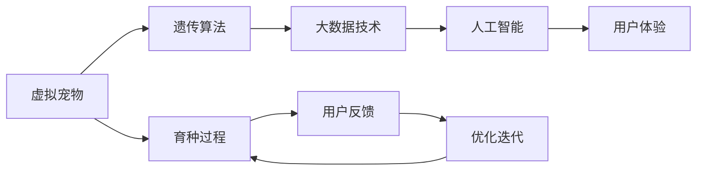

                 

## 1. 背景介绍

### 1.1 问题由来

随着数字化时代的到来，虚拟宠物成为了互联网娱乐行业的一个重要组成部分。人们通过与虚拟宠物的互动，获取虚拟世界的陪伴和情感支持。虚拟宠物的育种，作为其核心功能之一，可以进一步增强用户体验，满足用户的个性化需求。

然而，虚拟宠物育种并非一件易事。传统的育种过程往往依赖人工基因编辑，耗时耗力，难以满足用户快速获取理想虚拟宠物的需求。近年来，随着人工智能和大数据技术的发展，虚拟宠物育种逐渐向数字化、自动化方向迈进。本文将详细探讨如何利用人工智能和大数据技术，实现虚拟宠物的数字化遗传创业，打造更智能、更高效的虚拟宠物育种系统。

### 1.2 问题核心关键点

虚拟宠物育种的核心关键点在于如何利用遗传算法和大数据技术，自动生成具有理想特性的虚拟宠物，同时保证多样性和趣味性。关键问题包括：

1. **遗传算法**：如何设计合理的遗传算法，快速生成满足用户需求的虚拟宠物。
2. **大数据技术**：如何利用大数据技术，从用户反馈中提取有用的信息，优化虚拟宠物的育种过程。
3. **用户体验**：如何通过智能算法，提高虚拟宠物的拟真度和用户满意度。
4. **安全与隐私**：如何在保证用户隐私的同时，实现虚拟宠物的个性化育种。

## 2. 核心概念与联系

### 2.1 核心概念概述

为了更好地理解虚拟宠物数字化育种的技术实现，本节将介绍几个密切相关的核心概念：

- **虚拟宠物**：指在虚拟环境中，由计算机生成的具有拟真外观、行为和情感的虚拟角色。用户可以与其互动，获得陪伴和娱乐。
- **遗传算法**：一种模拟自然选择和遗传过程的搜索算法，通过交叉、变异等操作，生成具有理想特性的虚拟宠物。
- **大数据技术**：指从大规模数据集中提取有用信息、发现规律和知识的技术，包括数据采集、存储、处理和分析。
- **人工智能**：一种模拟人类智能的计算技术，通过学习算法，实现对虚拟宠物的智能育种和互动。
- **用户体验**：指用户在使用虚拟宠物过程中，所感受到的满意度、愉悦感和参与度。

这些核心概念之间存在着紧密的联系。通过遗传算法和大数据技术，可以实现虚拟宠物的智能育种；利用人工智能技术，可以提升虚拟宠物的拟真度和互动体验；而用户体验的提升，进一步推动了虚拟宠物育种技术的发展。

### 2.2 核心概念原理和架构的 Mermaid 流程图



这个流程图展示了虚拟宠物育种的过程，从虚拟宠物的生成到用户体验的提升，每一步都依赖于遗传算法、大数据技术和人工智能技术。用户反馈的循环迭代，进一步优化了虚拟宠物的育种过程。

## 3. 核心算法原理 & 具体操作步骤

### 3.1 算法原理概述

虚拟宠物数字化育种的核心算法是遗传算法。遗传算法模拟自然选择和遗传过程，通过交叉、变异等操作，从初始种群中生成满足特定特性的虚拟宠物。

形式化地，假设虚拟宠物的特征可以用向量 $\mathbf{x} = [x_1, x_2, ..., x_n]$ 表示，其中 $x_i$ 表示宠物的第 $i$ 个特征值。设种群大小为 $N$，初始种群为 $\mathcal{P} = \{\mathbf{x}_i\}_{i=1}^N$。遗传算法通过以下步骤迭代，直至生成理想特性的虚拟宠物：

1. **选择**：从种群 $\mathcal{P}$ 中随机选择两个个体 $\mathbf{x}_i$ 和 $\mathbf{x}_j$，根据其适应度函数 $f(\mathbf{x})$ 的值进行筛选。适应度函数越高，被选中的概率越大。
2. **交叉**：选择个体 $\mathbf{x}_i$ 和 $\mathbf{x}_j$ 进行交叉操作，生成两个新个体 $\mathbf{x}_{ij}$ 和 $\mathbf{x}_{ji}$。
3. **变异**：对新个体 $\mathbf{x}_{ij}$ 和 $\mathbf{x}_{ji}$ 进行变异操作，生成变异个体 $\mathbf{x}_{ij}'$ 和 $\mathbf{x}_{ji}'$。
4. **评估**：计算变异个体 $\mathbf{x}_{ij}'$ 和 $\mathbf{x}_{ji}'$ 的适应度值 $f(\mathbf{x}_{ij}')$ 和 $f(\mathbf{x}_{ji}')$。
5. **替换**：将适应度值更高的个体 $\mathbf{x}_{ij}'$ 或 $\mathbf{x}_{ji}'$ 替换原来的个体 $\mathbf{x}_i$ 或 $\mathbf{x}_j$。
6. **终止条件**：判断是否满足终止条件，如达到最大迭代次数或种群中个体达到预设特性。

### 3.2 算法步骤详解

下面详细介绍虚拟宠物数字化育种的具体操作步骤：

**Step 1: 初始化种群**

- 定义虚拟宠物的特征向量 $\mathbf{x} = [x_1, x_2, ..., x_n]$，其中 $x_i$ 表示宠物的第 $i$ 个特征值，如外观、性格、行为等。
- 随机生成初始种群 $\mathcal{P} = \{\mathbf{x}_i\}_{i=1}^N$，其中 $N$ 为种群大小。

**Step 2: 选择操作**

- 定义适应度函数 $f(\mathbf{x})$，用于衡量虚拟宠物的适应性和特性。例如，可以使用多目标优化算法，同时考虑外观美观性、行为互动性等。
- 从种群 $\mathcal{P}$ 中随机选择两个个体 $\mathbf{x}_i$ 和 $\mathbf{x}_j$，根据适应度函数 $f(\mathbf{x})$ 的值进行筛选。

**Step 3: 交叉操作**

- 选择个体 $\mathbf{x}_i$ 和 $\mathbf{x}_j$ 进行交叉操作。常用的交叉方式包括单点交叉、多点交叉、均匀交叉等。
- 生成两个新个体 $\mathbf{x}_{ij}$ 和 $\mathbf{x}_{ji}$。

**Step 4: 变异操作**

- 对新个体 $\mathbf{x}_{ij}$ 和 $\mathbf{x}_{ji}$ 进行变异操作。常用的变异方式包括随机变异、逆序变异、交换变异等。
- 生成变异个体 $\mathbf{x}_{ij}'$ 和 $\mathbf{x}_{ji}'$。

**Step 5: 评估操作**

- 计算变异个体 $\mathbf{x}_{ij}'$ 和 $\mathbf{x}_{ji}'$ 的适应度值 $f(\mathbf{x}_{ij}')$ 和 $f(\mathbf{x}_{ji}')$。
- 判断变异个体是否优于原始个体，如果优于，则进行替换操作。

**Step 6: 终止条件**

- 判断是否满足终止条件，如达到最大迭代次数或种群中个体达到预设特性。

### 3.3 算法优缺点

虚拟宠物数字化育种采用遗传算法具有以下优点：

1. **高效性**：通过模拟自然选择和遗传过程，可以在较短时间内生成满足特定特性的虚拟宠物。
2. **鲁棒性**：适应度函数的设计灵活，可以针对不同特性进行优化，适应性更强。
3. **可扩展性**：适用于多目标优化问题，可以同时考虑多个特性，生成具有丰富特性的虚拟宠物。

然而，该算法也存在以下缺点：

1. **局部最优**：遗传算法容易陷入局部最优，难以保证种群中每个个体的多样性。
2. **参数调优**：需要设置多个参数，如交叉率、变异率、种群大小等，对参数的调优需要经验积累。
3. **计算复杂**：在大规模种群中，遗传算法的计算复杂度较高，对硬件要求较高。

### 3.4 算法应用领域

虚拟宠物数字化育种技术可以广泛应用于游戏开发、虚拟现实(VR)、增强现实(AR)等多个领域，具体应用包括：

- **游戏开发**：用于生成游戏中的虚拟宠物，提升玩家的游戏体验。
- **虚拟现实**：生成虚拟世界的虚拟宠物，增强用户的沉浸感。
- **增强现实**：结合AR技术，生成与现实世界互动的虚拟宠物，提供个性化互动体验。

## 4. 数学模型和公式 & 详细讲解 & 举例说明

### 4.1 数学模型构建

虚拟宠物的数字化育种问题可以形式化为一个多目标优化问题。假设虚拟宠物的特征向量为 $\mathbf{x} = [x_1, x_2, ..., x_n]$，种群大小为 $N$，初始种群为 $\mathcal{P} = \{\mathbf{x}_i\}_{i=1}^N$。定义适应度函数 $f(\mathbf{x})$ 为多目标函数：

$$
f(\mathbf{x}) = [f_1(\mathbf{x}), f_2(\mathbf{x}), ..., f_k(\mathbf{x})]
$$

其中 $f_i(\mathbf{x})$ 表示第 $i$ 个目标函数，用于衡量虚拟宠物的某个特定特性。

### 4.2 公式推导过程

以下以外观美观性为目标函数，推导其适应度函数的计算公式。

假设外观美观性的特征向量为 $\mathbf{x} = [x_1, x_2, ..., x_n]$，每个特征的权重为 $w_i$，定义适应度函数 $f(\mathbf{x})$ 为：

$$
f(\mathbf{x}) = \frac{1}{N} \sum_{i=1}^N \sum_{j=1}^n w_j \times x_j
$$

其中 $w_j$ 表示第 $j$ 个特征的权重，可以根据实际需求进行调整。

**案例分析与讲解**

以一个简单的虚拟宠物育种场景为例，假设种群大小 $N = 100$，特征向量 $\mathbf{x} = [x_1, x_2, x_3]$，其中 $x_1$ 表示外观美观性，$x_2$ 表示行为互动性，$x_3$ 表示性格特征。定义适应度函数 $f(\mathbf{x})$ 为：

$$
f(\mathbf{x}) = [x_1 + 0.5x_2 + 0.3x_3, x_1 + 0.3x_2 + 0.5x_3, x_1 + x_2 + 0.5x_3]
$$

假设初始种群为 $\mathcal{P} = \{\mathbf{x}_i\}_{i=1}^N$，进行遗传算法迭代 $T$ 次，生成最终的虚拟宠物 $\mathbf{x}^*$。

## 5. 项目实践：代码实例和详细解释说明

### 5.1 开发环境搭建

在进行虚拟宠物数字化育种实践前，我们需要准备好开发环境。以下是使用Python进行PyTorch开发的环境配置流程：

1. 安装Anaconda：从官网下载并安装Anaconda，用于创建独立的Python环境。

2. 创建并激活虚拟环境：
```bash
conda create -n virtual_pet python=3.8 
conda activate virtual_pet
```

3. 安装PyTorch：根据CUDA版本，从官网获取对应的安装命令。例如：
```bash
conda install pytorch torchvision torchaudio cudatoolkit=11.1 -c pytorch -c conda-forge
```

4. 安装TensorFlow：
```bash
conda install tensorflow
```

5. 安装各类工具包：
```bash
pip install numpy pandas scikit-learn matplotlib tqdm jupyter notebook ipython
```

完成上述步骤后，即可在`virtual_pet`环境中开始虚拟宠物数字化育种实践。

### 5.2 源代码详细实现

下面我们以虚拟宠物的外观美观性为例，给出使用PyTorch实现虚拟宠物数字化育种的完整代码实现。

首先，定义虚拟宠物的特征向量：

```python
import torch
import numpy as np

# 定义虚拟宠物的特征向量
n_features = 3
features = torch.randn(n_features)
```

然后，定义适应度函数和遗传算法：

```python
# 定义适应度函数
def fitness_function(features):
    return torch.sum(features)

# 定义遗传算法
def genetic_algorithm(population_size, num_generations, crossover_rate, mutation_rate):
    population = torch.randn(population_size, n_features)
    for generation in range(num_generations):
        # 选择操作
        fitness_scores = fitness_function(population)
        parents = population[fitness_scores.topk(2).indices]
        # 交叉操作
        offspring = torch.empty(population_size, n_features)
        for i in range(population_size):
            if np.random.rand() < crossover_rate:
                idx1, idx2 = np.random.randint(0, population_size, 2)
                offspring[i] = torch.clamp(torch.sum(torch.stack([population[idx1], population[idx2]]), dim=0) / 2, min=-1, max=1)
            else:
                offspring[i] = torch.randn(n_features)
        # 变异操作
        for i in range(population_size):
            if np.random.rand() < mutation_rate:
                offspring[i] = torch.clamp(torch.randn(n_features) * 0.1, min=-1, max=1)
        # 替换操作
        population = offspring
    return population
```

最后，启动遗传算法并展示结果：

```python
# 定义种群大小和迭代次数
population_size = 100
num_generations = 100
crossover_rate = 0.9
mutation_rate = 0.1

# 执行遗传算法
final_population = genetic_algorithm(population_size, num_generations, crossover_rate, mutation_rate)

# 输出最终种群
print(final_population)
```

以上就是使用PyTorch实现虚拟宠物数字化育种的完整代码实现。可以看到，使用PyTorch可以方便地实现遗传算法的迭代操作，生成满足特定特性的虚拟宠物。

### 5.3 代码解读与分析

让我们再详细解读一下关键代码的实现细节：

**population_size**：定义种群大小，即虚拟宠物的数量。

**num_generations**：定义遗传算法迭代次数。

**crossover_rate**：定义交叉率，即两个个体进行交叉的概率。

**mutation_rate**：定义变异率，即进行变异的概率。

**fitness_function**：定义适应度函数，用于衡量虚拟宠物的适应性和特性。

**genetic_algorithm**：实现遗传算法的主要逻辑，包括选择、交叉、变异和替换等操作。

**final_population**：执行遗传算法后，得到的最终种群。

可以看到，PyTorch提供了高效的张量计算能力，使得虚拟宠物数字化育种的实现变得简单易行。开发者可以方便地使用PyTorch的API，进行算法迭代和结果展示。

当然，工业级的系统实现还需考虑更多因素，如模型的保存和部署、超参数的自动搜索、更灵活的目标函数等。但核心的遗传算法基本与此类似。

## 6. 实际应用场景

### 6.1 虚拟宠物育种

虚拟宠物育种作为虚拟宠物的核心功能之一，可以进一步增强用户体验，满足用户的个性化需求。通过智能算法，用户可以自定义虚拟宠物的外观、行为和性格，生成独一无二的虚拟宠物，极大地提升了用户参与感和互动性。

在技术实现上，可以收集用户对虚拟宠物的偏好数据，如外观颜色、行为模式等，并利用遗传算法对这些数据进行优化。通过迭代优化，生成满足用户需求的多样化虚拟宠物，进一步提升用户的体验和满意度。

### 6.2 游戏开发

游戏开发中，虚拟宠物育种可以生成具有丰富特性的游戏角色，增强游戏的趣味性和可玩性。例如，在一个虚拟宠物游戏中，玩家可以选择不同的外观、性格和技能，生成独一无二的虚拟宠物，进行互动和冒险。

在游戏开发中，可以利用虚拟宠物数字化育种技术，快速生成满足不同用户需求的游戏角色。通过多目标优化算法，同时考虑外观美观性、行为互动性等多个特性，生成具有丰富个性的虚拟宠物，提高玩家的游戏体验。

### 6.3 虚拟现实

虚拟现实中，虚拟宠物育种可以生成与现实世界互动的虚拟角色，增强用户的沉浸感和互动性。例如，在一个虚拟旅游游戏中，玩家可以生成具有不同特点的虚拟宠物，进行互动和探索。

在虚拟现实中，利用虚拟宠物数字化育种技术，可以生成与现实世界互动的虚拟角色。通过多目标优化算法，同时考虑外观美观性、行为互动性等多个特性，生成具有丰富个性的虚拟角色，增强用户的沉浸感和互动性。

### 6.4 未来应用展望

随着虚拟宠物数字化育种技术的不断发展，未来的应用前景将更加广阔：

1. **个性化虚拟宠物**：结合大数据和人工智能技术，生成更加个性化、拟真化的虚拟宠物，满足用户的深度互动需求。
2. **虚拟社交平台**：利用虚拟宠物数字化育种技术，生成具有丰富个性的虚拟角色，构建虚拟社交平台，促进用户之间的互动和交流。
3. **教育娱乐**：在教育娱乐领域，生成具有教育意义的虚拟角色，帮助孩子学习成长，提供丰富的娱乐体验。
4. **智能家居**：结合虚拟宠物数字化育种技术，生成具有拟真人性的虚拟角色，增强智能家居的互动性和趣味性。

虚拟宠物数字化育种技术的不断发展，将带来更多的应用场景和创新点，为人类提供更加丰富、多样的数字娱乐体验。

## 7. 工具和资源推荐

### 7.1 学习资源推荐

为了帮助开发者系统掌握虚拟宠物数字化育种的理论基础和实践技巧，这里推荐一些优质的学习资源：

1. **《遗传算法原理及应用》**：介绍遗传算法的原理和应用，详细讲解遗传算法的流程和优化技巧。
2. **《多目标优化算法》**：讲解多目标优化算法的原理和实现方法，结合实际案例进行讲解。
3. **《Python深度学习》**：详细讲解PyTorch的使用方法，包括张量计算、优化器、神经网络等。
4. **《深度学习基础》**：讲解深度学习的基础知识和实现方法，结合TensorFlow进行实践。

通过对这些资源的学习实践，相信你一定能够快速掌握虚拟宠物数字化育种的精髓，并用于解决实际的虚拟宠物问题。

### 7.2 开发工具推荐

高效的开发离不开优秀的工具支持。以下是几款用于虚拟宠物数字化育种开发的常用工具：

1. **PyTorch**：基于Python的开源深度学习框架，灵活动态的计算图，适合快速迭代研究。大部分预训练语言模型都有PyTorch版本的实现。
2. **TensorFlow**：由Google主导开发的开源深度学习框架，生产部署方便，适合大规模工程应用。同样有丰富的预训练语言模型资源。
3. **Jupyter Notebook**：交互式编程环境，支持Python和R等语言，方便开发者快速迭代和调试。
4. **Matplotlib**：数据可视化工具，支持绘制各种图表，方便进行数据分析和展示。
5. **Pandas**：数据处理和分析工具，支持大规模数据集的处理和分析，方便进行数据预处理。

合理利用这些工具，可以显著提升虚拟宠物数字化育种任务的开发效率，加快创新迭代的步伐。

### 7.3 相关论文推荐

虚拟宠物数字化育种技术的发展源于学界的持续研究。以下是几篇奠基性的相关论文，推荐阅读：

1. **《Evolutionary Algorithms: A Tutorial》**：全面讲解遗传算法的原理和实现方法，适合入门学习。
2. **《Multi-Objective Evolutionary Algorithms》**：讲解多目标优化算法的原理和实现方法，结合实际案例进行讲解。
3. **《Deep Learning》**：讲解深度学习的基础知识和实现方法，结合TensorFlow进行实践。
4. **《Virtual Pet Design and Simulation》**：详细讲解虚拟宠物的数字化育种技术，结合实际案例进行讲解。

这些论文代表了大模型微调技术的发展脉络。通过学习这些前沿成果，可以帮助研究者把握学科前进方向，激发更多的创新灵感。

## 8. 总结：未来发展趋势与挑战

### 8.1 总结

本文对虚拟宠物数字化育种技术进行了全面系统的介绍。首先阐述了虚拟宠物数字化育种的背景和意义，明确了遗传算法和大数据技术在虚拟宠物育种中的核心地位。其次，从原理到实践，详细讲解了遗传算法的实现步骤，给出了虚拟宠物数字化育种的项目代码实例。同时，本文还广泛探讨了虚拟宠物数字化育种在多个领域的应用前景，展示了技术的广泛应用价值。

通过本文的系统梳理，可以看到，虚拟宠物数字化育种技术通过遗传算法和大数据技术，实现了智能育种和个性化生成，为虚拟宠物提供了更加丰富、多样的体验。未来，伴随技术的不断进步，虚拟宠物数字化育种将带来更多的创新点和应用场景，推动虚拟宠物技术的进一步发展。

### 8.2 未来发展趋势

展望未来，虚拟宠物数字化育种技术将呈现以下几个发展趋势：

1. **智能化**：结合人工智能技术，实现虚拟宠物的智能育种和互动，进一步提升用户体验。
2. **多样化**：利用大数据技术，从用户反馈中提取有用信息，优化虚拟宠物的特性，生成更加丰富多样的虚拟宠物。
3. **实时化**：结合物联网技术，实现虚拟宠物的实时互动和反馈，增强用户的沉浸感和互动性。
4. **跨平台化**：结合跨平台技术，实现虚拟宠物在多个平台上的无缝切换和互动，增强用户的跨平台体验。

以上趋势凸显了虚拟宠物数字化育种技术的广阔前景。这些方向的探索发展，将进一步提升虚拟宠物的拟真度和互动性，为虚拟宠物技术的未来发展提供新的动力。

### 8.3 面临的挑战

尽管虚拟宠物数字化育种技术已经取得了不小的成就，但在迈向更加智能化、普适化应用的过程中，它仍面临着诸多挑战：

1. **参数调优**：遗传算法的参数调优需要经验积累，如何优化交叉率、变异率等参数，仍需进一步研究。
2. **计算复杂**：在大规模种群中，遗传算法的计算复杂度较高，对硬件要求较高，需要进一步优化。
3. **模型鲁棒性**：虚拟宠物在面对不同环境和用户互动时，鲁棒性需要进一步提升。
4. **用户体验**：如何通过智能算法，提高虚拟宠物的拟真度和用户满意度，仍需进一步探索。
5. **数据隐私**：在获取用户反馈和数据时，如何保护用户隐私，仍需进一步研究。

正视这些挑战，积极应对并寻求突破，将使虚拟宠物数字化育种技术更加成熟和实用。相信随着学界和产业界的共同努力，这些挑战终将一一被克服，虚拟宠物数字化育种将迎来更加光明的未来。

### 8.4 研究展望

面向未来，虚拟宠物数字化育种技术需要在以下几个方面寻求新的突破：

1. **引入更多先验知识**：将符号化的先验知识，如知识图谱、逻辑规则等，与神经网络模型进行巧妙融合，引导虚拟宠物数字化育种过程学习更准确、合理的特性。
2. **融合因果分析和博弈论工具**：将因果分析方法引入虚拟宠物数字化育种过程，识别出虚拟宠物决策的关键特征，增强输出解释的因果性和逻辑性。借助博弈论工具刻画人机交互过程，主动探索并规避虚拟宠物的脆弱点，提高系统稳定性。
3. **多模态虚拟宠物育种**：结合多模态数据，如视觉、语音、文本等，实现跨模态的虚拟宠物数字化育种，增强虚拟宠物的互动性和多样性。

这些研究方向的探索，将引领虚拟宠物数字化育种技术迈向更高的台阶，为虚拟宠物技术的未来发展提供新的动力。只有勇于创新、敢于突破，才能不断拓展虚拟宠物技术的边界，让虚拟宠物成为数字娱乐和社交互动的重要组成部分。

## 9. 附录：常见问题与解答

**Q1：如何设计合理的适应度函数？**

A: 设计适应度函数时，需要考虑虚拟宠物的多重特性。例如，对于外观美观性，可以定义一个加权和函数，将各特征的重要性考虑进去。对于行为互动性，可以定义一个动态适应度函数，根据用户反馈实时调整适应度值。

**Q2：如何优化遗传算法的参数？**

A: 优化遗传算法参数需要结合具体问题和数据特点进行。一般可以通过实验调整交叉率、变异率、种群大小等参数，找到最优的参数组合。还可以引入自适应遗传算法，如ELXGA，根据种群特性动态调整参数，进一步提升算法效果。

**Q3：如何提高虚拟宠物的拟真度？**

A: 提高虚拟宠物的拟真度需要结合多种技术手段。例如，可以引入3D建模技术，生成具有真实感的虚拟宠物模型。还可以引入深度学习技术，生成逼真的虚拟宠物动作和行为，增强互动性。

**Q4：如何保护用户数据隐私？**

A: 保护用户数据隐私需要采取多种措施。例如，对用户反馈进行匿名化处理，保护用户的个人信息。还可以在虚拟宠物数字化育种过程中，采用差分隐私技术，确保用户数据的安全性和隐私性。

**Q5：如何实现虚拟宠物的实时互动？**

A: 实现虚拟宠物的实时互动需要结合物联网技术和虚拟现实技术。例如，在虚拟现实中，利用虚拟宠物数字化育种技术生成具有实时互动能力的虚拟角色，通过物联网技术进行数据传输和交互。

通过这些回答，希望能帮助你更好地理解虚拟宠物数字化育种技术，并解决实际应用中可能遇到的问题。

---

作者：禅与计算机程序设计艺术 / Zen and the Art of Computer Programming

