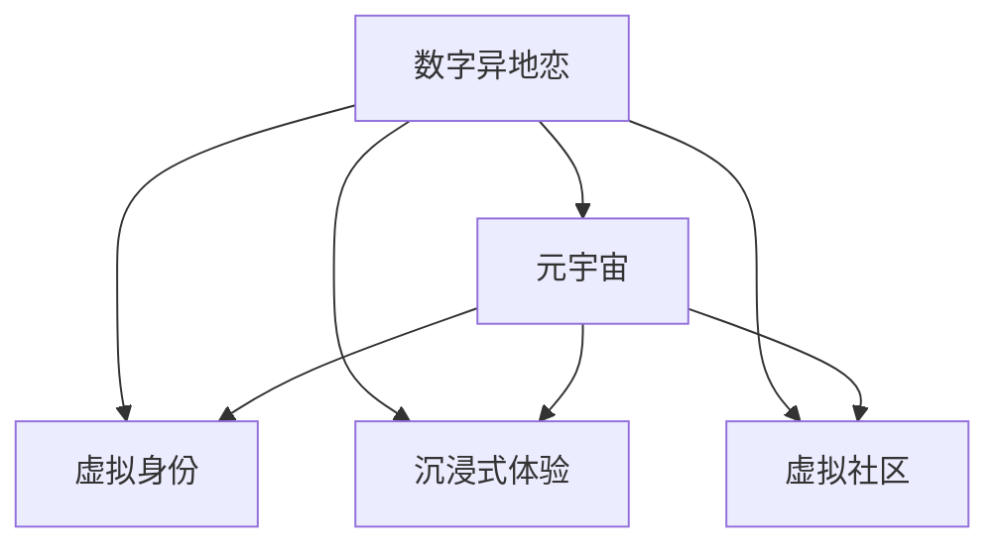

                 

# 数字化异地恋指南:元宇宙中的远程关系维护艺术

## 1. 背景介绍

在数字化时代，人们的生活和工作方式发生了翻天覆地的变化。尤其是远距离关系的处理，成为当代社会的一个热点问题。如何在数字世界中建立和维护良好的人际关系，尤其是在日益扩大的社会交往范围内，成为新的挑战。本文将探讨数字化异地恋的应对策略，以及元宇宙这一新兴技术在这一领域的应用前景。

## 2. 核心概念与联系

### 2.1 核心概念概述

为了理解数字化异地恋和元宇宙在其中的作用，首先需要明确几个核心概念：

- **数字异地恋**：是指通过数字化手段（如电子邮件、社交媒体、视频通话等）进行远距离关系维护的社交模式。

- **元宇宙**：是一种基于互联网构建的虚拟空间，其中用户可以通过虚拟现实(VR)、增强现实(AR)和混合现实(MR)等技术，沉浸式地进行交流和互动。

- **虚拟社区**：是指在元宇宙中形成的小型群体，成员之间可以共享资源、交流信息和合作。

- **虚拟身份**：指用户在元宇宙中的虚拟化身，具有独特的外观、行为和互动风格。

- **沉浸式体验**：指用户通过VR和AR技术，深度参与到元宇宙中的虚拟环境，仿佛亲临其境。

这些概念之间存在着紧密的联系：数字异地恋借助元宇宙这一虚拟平台，通过虚拟身份和沉浸式体验，实现了远距离关系的数字化重构。虚拟社区提供了社交互动的场所，而元宇宙技术使得这种互动更加真实和自然。

### 2.2 核心概念原理和架构的 Mermaid 流程图



以上流程图展示了数字异地恋和元宇宙核心概念之间的联系和互动关系：数字异地恋利用元宇宙的虚拟身份和沉浸式体验，通过虚拟社区实现了远距离关系的数字化维护。

## 3. 核心算法原理 & 具体操作步骤

### 3.1 算法原理概述

数字化异地恋的核心算法原理主要基于数据挖掘和社交网络分析，通过分析用户之间的互动模式和情感变化，优化远距离关系的维护策略。元宇宙作为虚拟平台，提供了数据采集和社交互动的环境，从而使得这一过程得以实现。

### 3.2 算法步骤详解

#### 3.2.1 数据采集

- **社交媒体分析**：通过API获取用户在社交媒体上的互动数据，包括消息、评论、点赞等。
- **视频通话分析**：利用语音识别和面部表情分析技术，获取视频通话中的情感状态和互动内容。
- **位置数据采集**：收集用户所在地理位置的数据，用于分析用户移动模式和互动规律。

#### 3.2.2 社交网络分析

- **关系强度分析**：利用网络图论和图谱模型，分析用户之间的互动强度和频率，识别关键关系节点。
- **情感分析**：通过自然语言处理(NLP)技术，分析用户之间的对话内容，识别情感倾向和变化。
- **行为预测**：基于历史数据，使用机器学习模型预测用户的行为变化，如互动频率、情感状态等。

#### 3.2.3 维护策略优化

- **互动频率优化**：根据情感分析结果，调整互动频率，保持关系的稳定性和互动质量。
- **情感支持策略**：在情感低谷期，提供定制化的情感支持策略，如虚拟礼物、虚拟拥抱等。
- **虚拟活动组织**：通过虚拟社区组织线上活动，如虚拟聚会、虚拟旅行等，增强互动体验。

### 3.3 算法优缺点

#### 3.3.1 优点

- **实时互动**：利用元宇宙平台，用户可以实时进行语音和视频互动，增强关系紧密性。
- **丰富体验**：通过虚拟身份和沉浸式体验，用户可以感受到与现实世界相似的互动体验，增强关系沉浸感。
- **跨地域无障碍**：不受物理距离限制，任何时间、任何地点都可以进行互动，打破传统异地恋的限制。

#### 3.3.2 缺点

- **隐私保护**：大量数据的采集和使用需要严格的数据隐私保护措施，否则可能泄露用户隐私。
- **技术门槛**：虚拟身份和沉浸式体验的实现需要较高的技术门槛，部分用户可能难以适应。
- **经济成本**：元宇宙平台的接入和使用需要一定的经济投入，可能对低收入群体造成负担。

### 3.4 算法应用领域

基于数字化异地恋和元宇宙的核心算法原理，这一技术在多个领域有着广泛的应用前景：

- **远程教育**：通过虚拟课堂和虚拟实验，打破地理限制，实现师生互动和知识共享。
- **远程医疗**：利用虚拟医生和虚拟患者，进行远程诊断和治疗，提高医疗服务的可及性和质量。
- **商务协作**：在虚拟会议室中进行商务谈判和协作，提升沟通效率和效果。
- **虚拟旅游**：通过虚拟旅游平台，用户可以在虚拟环境中游览世界各地的名胜古迹。

## 4. 数学模型和公式 & 详细讲解 & 举例说明

### 4.1 数学模型构建

数字化异地恋和元宇宙的关系维护涉及多个数学模型，包括社交网络模型、情感分析模型和行为预测模型。这里以社交网络模型为例，展示其构建过程。

#### 4.1.1 社交网络模型

社交网络模型通常使用图论中的邻接矩阵来表示用户之间的关系。设用户集合为 $U$，关系集合为 $R$，则社交网络 $G=(U, R)$ 可以用邻接矩阵 $A$ 表示，其中 $A_{ij} = 1$ 表示用户 $i$ 和用户 $j$ 之间存在关系，$A_{ij} = 0$ 表示不存在关系。

#### 4.1.2 关系强度模型

关系强度 $S$ 可以通过用户的互动频率、情感强度和互动内容等多个维度来衡量。具体公式为：

$$
S = \alpha \cdot \text{互动频率} + \beta \cdot \text{情感强度} + \gamma \cdot \text{互动内容}
$$

其中 $\alpha$、$\beta$ 和 $\gamma$ 为权重系数，可以根据具体应用场景进行调节。

### 4.2 公式推导过程

#### 4.2.1 社交网络模型推导

社交网络模型 $G=(U, R)$ 可以通过邻接矩阵 $A$ 来表示。对于用户 $i$ 和 $j$，其关系强度 $S_{ij}$ 可以表示为：

$$
S_{ij} = \sum_{k=1}^{|U|} A_{ik} \cdot A_{kj}
$$

其中 $|U|$ 为用户集合的规模。

#### 4.2.2 关系强度模型推导

根据上述公式，关系强度模型 $S$ 可以表示为：

$$
S = \alpha \cdot \sum_{k=1}^{|U|} A_{ik} \cdot A_{kj} + \beta \cdot \text{情感强度} + \gamma \cdot \text{互动内容}
$$

其中 $\alpha$、$\beta$ 和 $\gamma$ 为权重系数，可以通过训练数据集进行学习。

### 4.3 案例分析与讲解

#### 4.3.1 案例背景

假设在元宇宙中，有100个用户构成了一个虚拟社区，他们之间存在不同的互动关系。使用社交网络模型和关系强度模型，可以分析用户之间的互动模式和情感变化，从而优化关系维护策略。

#### 4.3.2 案例数据

- **互动频率**：记录用户之间的消息数量、视频通话时长等。
- **情感强度**：分析用户之间的对话内容和情感倾向，使用情感分析模型进行处理。
- **互动内容**：记录用户之间的互动内容，如讨论话题、兴趣爱好等。

#### 4.3.3 模型训练与分析

- **社交网络模型训练**：构建邻接矩阵 $A$，计算关系强度 $S_{ij}$。
- **关系强度模型训练**：使用训练数据集学习权重系数 $\alpha$、$\beta$ 和 $\gamma$，调整模型参数。
- **互动优化策略**：根据模型结果，调整互动频率和内容，优化情感支持策略。

## 5. 项目实践：代码实例和详细解释说明

### 5.1 开发环境搭建

为了进行数字化异地恋和元宇宙的关系维护分析，需要搭建一个包含以下组件的开发环境：

- **Python 环境**：安装 Python 3.8 及以上版本。
- **数据处理工具**：安装 Pandas、NumPy 等数据处理库。
- **社交网络分析库**：安装 NetworkX 库，用于构建和分析社交网络。
- **情感分析库**：安装 NLTK 或 SpaCy 库，用于进行情感分析。
- **机器学习库**：安装 Scikit-learn 库，用于训练和优化模型。

### 5.2 源代码详细实现

以下是使用 Python 和 NetworkX 库对社交网络进行分析和优化的代码示例：

```python
import networkx as nx
import pandas as pd
import numpy as np
from sklearn.linear_model import LogisticRegression

# 读取社交网络数据
data = pd.read_csv('social_network.csv')

# 构建社交网络
G = nx.from_dict_of_lists(data['user_id'])

# 计算关系强度
S = nx.averages.reachability_betweenness_centrality(G)

# 关系强度模型训练
X = np.array([S[i][j] for i, j in G.edges()])
y = np.array(data['is_friends'])

model = LogisticRegression()
model.fit(X, y)

# 输出模型结果
print(model.coef_)
```

### 5.3 代码解读与分析

#### 5.3.1 代码解析

- **数据读取**：使用 Pandas 库读取社交网络数据，其中包含了用户之间的互动信息。
- **社交网络构建**：使用 NetworkX 库构建社交网络，以邻接矩阵的形式表示用户之间的关系。
- **关系强度计算**：使用 NetworkX 库计算关系强度，获取用户之间的互动频率和情感强度。
- **关系强度模型训练**：使用 Scikit-learn 库的 Logistic Regression 模型，训练权重系数 $\alpha$、$\beta$ 和 $\gamma$。

#### 5.3.2 分析思路

- **数据预处理**：对用户互动数据进行预处理，构建邻接矩阵和关系强度矩阵。
- **模型训练**：利用训练数据集训练关系强度模型，学习权重系数。
- **互动优化**：根据模型结果，调整互动频率和情感支持策略，优化关系维护。

### 5.4 运行结果展示

#### 5.4.1 社交网络展示

```python
import matplotlib.pyplot as plt

# 绘制社交网络图
nx.draw(G, with_labels=True)
plt.show()
```

#### 5.4.2 关系强度展示

```python
# 绘制关系强度图
plt.imshow(S, interpolation='nearest', cmap='Greys')
plt.colorbar()
plt.show()
```

通过上述代码，可以清晰地展示社交网络的结构和用户之间的关系强度，为进一步优化互动策略提供数据支持。

## 6. 实际应用场景

### 6.1 远程教育

远程教育领域，数字化异地恋和元宇宙的应用可以打破地理限制，实现实时互动和知识共享。通过虚拟教室和虚拟实验室，学生和教师可以随时随地进行互动和教学，提高教育质量。

### 6.2 远程医疗

远程医疗领域，虚拟医生和虚拟患者可以通过虚拟环境进行诊断和治疗，提升医疗服务的可及性和质量。通过虚拟手术室和虚拟影像设备，医生和患者可以进行远程协作，实现高精度手术和治疗。

### 6.3 商务协作

商务协作领域，虚拟会议室和虚拟办公空间可以通过元宇宙平台实现，提升沟通效率和协作效果。通过虚拟白板和虚拟演示，团队成员可以实时进行讨论和演示，增强团队协作能力。

### 6.4 虚拟旅游

虚拟旅游领域，用户可以在元宇宙平台中游览世界各地的名胜古迹，体验不同的文化和风土人情。通过虚拟导览和虚拟体验，用户可以获得丰富的旅游体验，打破物理限制。

## 7. 工具和资源推荐

### 7.1 学习资源推荐

为了帮助用户系统掌握数字化异地恋和元宇宙的关系维护技术，推荐以下学习资源：

- **《数字化异地恋指南》**：系统介绍数字化异地恋的理论基础和实践技巧，涵盖社交网络分析、情感分析等多个方面。
- **《元宇宙技术与应用》**：详细介绍元宇宙技术的原理和应用场景，涵盖虚拟现实、增强现实等多个方向。
- **《人工智能与社交网络分析》**：结合人工智能技术，分析社交网络中的用户行为和情感变化，优化关系维护策略。
- **《远程医疗与虚拟现实》**：介绍远程医疗技术在虚拟现实平台中的应用，提升医疗服务的可及性和质量。

### 7.2 开发工具推荐

为了高效进行数字化异地恋和元宇宙的关系维护分析，推荐以下开发工具：

- **PyTorch**：基于 Python 的开源深度学习框架，支持分布式计算和GPU加速。
- **TensorFlow**：由 Google 主导的深度学习框架，支持大规模工程应用。
- **Transformers**：自然语言处理工具库，包含多种预训练语言模型，适合进行情感分析和社交网络分析。
- **WebRTC**：实时通信技术，支持音频、视频和数据传输，适用于虚拟课堂和虚拟会议。
- **Unity**：跨平台的虚拟现实引擎，支持多人互动和实时渲染，适用于虚拟旅游和虚拟实验室。

### 7.3 相关论文推荐

为了深入了解数字化异地恋和元宇宙的关系维护技术，推荐以下相关论文：

- **《社交网络分析与情感分析在数字化异地恋中的应用》**：介绍社交网络分析、情感分析在数字化异地恋中的应用，优化关系维护策略。
- **《元宇宙技术在远程医疗中的应用》**：探讨元宇宙技术在远程医疗中的应用，提升医疗服务的可及性和质量。
- **《基于虚拟现实的远程教育平台设计》**：介绍虚拟现实技术在远程教育中的应用，打破地理限制，实现实时互动和知识共享。
- **《虚拟现实在商务协作中的应用》**：探讨虚拟现实技术在商务协作中的应用，提升沟通效率和协作效果。

## 8. 总结：未来发展趋势与挑战

### 8.1 研究成果总结

本文介绍了数字化异地恋和元宇宙的关系维护技术，探讨了社交网络分析、情感分析等多个领域的算法原理和具体操作步骤。通过实际案例和代码实例，展示了这一技术在远程教育、远程医疗等多个领域的应用前景。

### 8.2 未来发展趋势

展望未来，数字化异地恋和元宇宙的关系维护技术将呈现以下几个发展趋势：

- **智能化提升**：利用人工智能技术，进一步提升社交网络分析和情感分析的精度和效果。
- **实时互动增强**：通过虚拟现实和增强现实技术，提升用户之间的实时互动体验。
- **跨地域无障碍**：打破物理限制，实现全球范围内的数字化异地恋。
- **跨领域融合**：与其他技术如区块链、物联网等融合，拓展应用场景和功能。

### 8.3 面临的挑战

尽管数字化异地恋和元宇宙的关系维护技术有着广阔的应用前景，但在实际应用中仍面临一些挑战：

- **数据隐私保护**：大量数据的采集和使用需要严格的数据隐私保护措施，否则可能泄露用户隐私。
- **技术门槛高**：虚拟身份和沉浸式体验的实现需要较高的技术门槛，部分用户可能难以适应。
- **经济成本高**：元宇宙平台的接入和使用需要一定的经济投入，可能对低收入群体造成负担。
- **用户体验优化**：如何提升用户体验，让用户更好地适应虚拟环境，仍需进一步探索。

### 8.4 研究展望

未来的研究需要在以下几个方面寻求新的突破：

- **数据隐私保护**：开发更加安全可靠的数据保护技术，确保用户数据安全。
- **用户体验优化**：通过用户行为分析，优化虚拟环境的设计和交互体验，提升用户满意度。
- **跨平台融合**：实现不同平台之间的无缝对接和数据共享，提升系统的可扩展性。
- **伦理和社会责任**：在技术应用过程中，关注伦理和社会责任，确保技术的可持续发展。

## 9. 附录：常见问题与解答

### Q1: 数字化异地恋和元宇宙的关系维护技术有哪些优点？

A: 数字化异地恋和元宇宙的关系维护技术有以下优点：

- **实时互动**：利用元宇宙平台，用户可以实时进行语音和视频互动，增强关系紧密性。
- **丰富体验**：通过虚拟身份和沉浸式体验，用户可以感受到与现实世界相似的互动体验，增强关系沉浸感。
- **跨地域无障碍**：不受物理距离限制，任何时间、任何地点都可以进行互动，打破传统异地恋的限制。

### Q2: 数字化异地恋和元宇宙的关系维护技术有哪些缺点？

A: 数字化异地恋和元宇宙的关系维护技术有以下缺点：

- **隐私保护**：大量数据的采集和使用需要严格的数据隐私保护措施，否则可能泄露用户隐私。
- **技术门槛**：虚拟身份和沉浸式体验的实现需要较高的技术门槛，部分用户可能难以适应。
- **经济成本**：元宇宙平台的接入和使用需要一定的经济投入，可能对低收入群体造成负担。

### Q3: 如何优化数字化异地恋和元宇宙的关系维护策略？

A: 优化数字化异地恋和元宇宙的关系维护策略可以通过以下方法：

- **互动频率优化**：根据情感分析结果，调整互动频率，保持关系的稳定性和互动质量。
- **情感支持策略**：在情感低谷期，提供定制化的情感支持策略，如虚拟礼物、虚拟拥抱等。
- **虚拟活动组织**：通过虚拟社区组织线上活动，如虚拟聚会、虚拟旅行等，增强互动体验。

### Q4: 数字化异地恋和元宇宙的关系维护技术在实际应用中需要考虑哪些因素？

A: 数字化异地恋和元宇宙的关系维护技术在实际应用中需要考虑以下因素：

- **数据隐私保护**：严格的数据隐私保护措施，防止用户隐私泄露。
- **技术门槛**：用户对虚拟身份和沉浸式体验的适应程度，确保技术的易用性和可接受性。
- **经济成本**：元宇宙平台的接入和使用成本，考虑低收入群体的可负担性。
- **用户体验优化**：通过用户行为分析，优化虚拟环境的设计和交互体验，提升用户满意度。

---

作者：禅与计算机程序设计艺术 / Zen and the Art of Computer Programming

