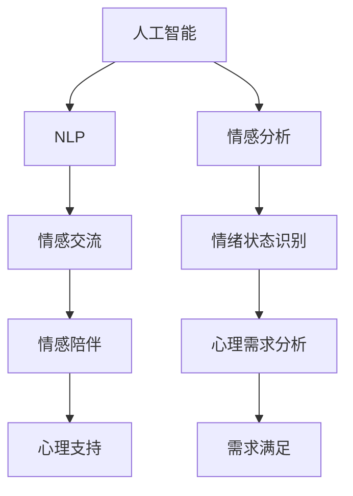

                 

## 1. 背景介绍

### 1.1 问题由来

当前，人们的生活节奏日益加快，心理压力不断增加，对心理支持和情感陪伴的需求日益迫切。然而，传统的心理咨询和治疗方式存在诸多局限，如资源匮乏、价格昂贵、隐私保护不充分等问题。基于人工智能(AI)的情感陪伴技术，以其低成本、高普及性、无时间地点限制等优势，成为满足人们心理需求的重要途径。数字化情感陪伴，即通过AI技术实现的心理支持与情感陪伴，正在逐步成为新兴的心理健康服务模式。

### 1.2 问题核心关键点

数字化情感陪伴的实现核心在于人工智能技术在心理学、情感分析、自然语言处理(NLP)等领域的应用。以下是几个关键技术点：

- **人工智能**：使用机器学习和深度学习算法，实现对用户心理状态和情感倾向的精准判断。
- **自然语言处理(NLP)**：利用语言理解、文本生成等技术，构建智能对话系统，实现情感交流。
- **情感分析**：通过分析用户语言、表情、行为等数据，识别其情绪状态和心理需求。
- **隐私保护**：采用加密技术、匿名化处理等手段，保护用户隐私信息。

这些技术点相互交织，共同构成了数字化情感陪伴系统的技术框架。通过系统地应用这些技术，可以实现对用户的持续情感陪伴和心理支持。

### 1.3 问题研究意义

数字化情感陪伴的广泛应用，对于提升人们心理健康水平、缓解社会压力、提高生活质量具有重要意义：

1. **提升心理健康水平**：通过智能陪伴，可以提供全天候、个性化的心理支持，帮助用户缓解压力，提升情绪稳定性和心理健康水平。
2. **缓解社会压力**：随着城市化进程加快，心理压力成为主要社会问题。数字化情感陪伴技术为人们提供了一种新的心理减压方式，有助于缓解社会压力。
3. **提高生活质量**：情感陪伴和心理支持是提升生活质量的重要组成部分，数字化情感陪伴技术有助于实现这一目标。
4. **推动AI技术应用**：数字化情感陪伴是AI技术在心理健康领域的典型应用，有助于推动AI技术的普及和发展。

## 2. 核心概念与联系

### 2.1 核心概念概述

为更好地理解数字化情感陪伴系统的实现机制，本节将介绍几个关键概念：

- **人工智能**：使用机器学习和深度学习算法，实现对用户心理状态和情感倾向的精准判断。
- **自然语言处理(NLP)**：利用语言理解、文本生成等技术，构建智能对话系统，实现情感交流。
- **情感分析**：通过分析用户语言、表情、行为等数据，识别其情绪状态和心理需求。
- **隐私保护**：采用加密技术、匿名化处理等手段，保护用户隐私信息。

这些核心概念之间的逻辑关系可以通过以下Mermaid流程图来展示：



这个流程图展示了核心概念之间的相互关系：

1. 人工智能通过深度学习算法对用户进行情感和心理状态的判断。
2. NLP技术实现与用户的自然语言交互，构建情感交流的基础。
3. 情感分析通过分析用户数据识别其情绪状态和心理需求。
4. 根据情感分析结果，系统提供针对性的情感陪伴和心理支持。
5. 隐私保护确保用户数据的安全和匿名性。

## 3. 核心算法原理 & 具体操作步骤

### 3.1 算法原理概述

数字化情感陪伴系统的核心算法包括自然语言处理、情感分析和心理支持等多个部分。以下是各部分的基本原理：

- **自然语言处理**：使用词向量、卷积神经网络(CNN)、长短时记忆网络(LSTM)等深度学习模型，实现对用户输入文本的理解和生成。
- **情感分析**：利用情感词典、情感分类器等技术，对用户文本和语音数据进行情感极性和强度的分析。
- **心理支持**：根据情感分析结果，采用推荐系统、生成对抗网络(GAN)等技术，提供个性化的心理支持内容。

### 3.2 算法步骤详解

数字化情感陪伴系统的实现涉及多个步骤，包括数据采集、模型训练、用户交互和心理支持等。

**Step 1: 数据采集与预处理**
- 收集用户语音、文本、表情等数据，并进行数据清洗、标注和预处理，如分词、去除停用词、标准化等。
- 使用预训练模型(如BERT)进行语言理解，获取用户意图和情感倾向。

**Step 2: 模型训练与优化**
- 训练深度学习模型(如LSTM、CNN)进行情感分类和情感生成。
- 使用迁移学习等方法，在少量标注数据上微调预训练模型，提升模型性能。
- 采用交叉验证、超参数调优等技术，优化模型训练过程。

**Step 3: 用户交互与情感分析**
- 构建智能对话系统，实现与用户的自然语言交互。
- 通过语音、文本、表情等多模态数据，分析用户情绪和心理状态。
- 使用情感词典和情感分类器对用户数据进行情感极性和强度分析。

**Step 4: 心理支持与反馈优化**
- 根据情感分析结果，生成针对性的心理支持内容，如故事、建议、音乐等。
- 对用户反馈进行评估，调整模型参数和心理支持内容，提升系统效果。
- 循环迭代上述过程，持续改进系统性能。

### 3.3 算法优缺点

数字化情感陪伴系统具有以下优点：

1. **高效普及**：AI技术可以实现全天候、低成本的情感陪伴，快速普及，满足不同用户需求。
2. **个性化服务**：系统能够根据用户情感和心理状态提供个性化支持，提升用户体验。
3. **实时交互**：智能对话系统可以实现实时情感交流，及时响应用户需求。
4. **隐私保护**：采用匿名化、加密等技术，保障用户隐私安全。

然而，该系统也存在一些局限性：

1. **数据质量要求高**：系统性能依赖于高质量的标注数据和用户反馈，数据采集难度大。
2. **情感理解有限**：当前情感分析技术还难以完全理解复杂的人类情感，可能出现误判。
3. **用户体验单一**：目前系统的功能以情感交流和心理支持为主，缺乏多样化的互动形式。
4. **隐私保护需加强**：尽管隐私保护技术应用广泛，但在数据处理和存储过程中仍需高度关注隐私安全问题。

### 3.4 算法应用领域

数字化情感陪伴技术已经在多个领域得到了应用，包括但不限于：

- **心理健康服务**：为抑郁症、焦虑症等患者提供心理支持和情感陪伴。
- **老年陪伴**：帮助老年人缓解孤独感，提供心理关怀和情感支持。
- **教育支持**：为学生提供心理辅导和学习支持，帮助缓解学习压力。
- **健康管理**：为慢性病患者提供心理支持和生活指导，帮助其保持良好情绪。
- **社交互动**：为社交障碍者提供情感交流平台，促进其社会融入。

## 4. 数学模型和公式 & 详细讲解 & 举例说明

### 4.1 数学模型构建

本节将使用数学语言对数字化情感陪伴系统的核心算法进行更加严格的刻画。

假设用户输入文本为 $x_i$，其情感极性为 $y_i \in \{0,1\}$，情感强度为 $z_i \in [0,1]$。情感分析模型为 $M_{\theta}$，其中 $\theta$ 为模型参数。则情感分析的目标是最小化经验风险：

$$
\mathcal{L}(\theta) = \frac{1}{N}\sum_{i=1}^N \ell(y_i, z_i, M_{\theta}(x_i))
$$

其中 $\ell$ 为损失函数，$\ell(y_i, z_i, M_{\theta}(x_i))$ 表示情感分析模型的预测结果与真实标签之间的差异。

情感分析模型的预测结果为 $M_{\theta}(x_i) = (p(y_i=1|x_i), p(z_i|x_i))$，其中 $p(y_i=1|x_i)$ 为情感极性预测概率，$p(z_i|x_i)$ 为情感强度预测概率。则损失函数可以表示为：

$$
\ell(y_i, z_i, M_{\theta}(x_i)) = \begin{cases}
p(y_i=1|x_i) \log p(y_i=1|x_i) + p(y_i=0|x_i) \log p(y_i=0|x_i) & \text{if } y_i = 0 \\
z_i \log p(z_i|x_i) + (1-z_i) \log (1-p(z_i|x_i)) & \text{if } y_i = 1
\end{cases}
$$

### 4.2 公式推导过程

以下我们以情感分类为例，推导损失函数的推导过程。

假设情感分类模型的预测结果为 $M_{\theta}(x_i) = (p(y_i=1|x_i), p(y_i=0|x_i))$，则情感分类损失函数为：

$$
\ell(y_i, M_{\theta}(x_i)) = -(y_i \log p(y_i=1|x_i) + (1-y_i) \log p(y_i=0|x_i))
$$

将其代入经验风险公式，得：

$$
\mathcal{L}(\theta) = -\frac{1}{N}\sum_{i=1}^N \ell(y_i, M_{\theta}(x_i))
$$

对模型参数 $\theta$ 进行优化，即可得到情感分类模型的最优参数 $\hat{\theta}$。

### 4.3 案例分析与讲解

假设我们有一个情感分类任务，使用LSTM模型进行训练。用户输入文本为 "I feel so sad today"，情感分析模型的预测结果为 $M_{\theta}(x_i) = (0.8, 0.5)$，则损失函数为：

$$
\ell(y_i, z_i, M_{\theta}(x_i)) = - (1 \log 0.8 + 0.5 \log 0.5) = -1.1519
$$

通过上述损失函数的计算，模型可以根据用户输入文本的情感极性和强度，生成针对性的心理支持内容。

## 5. 项目实践：代码实例和详细解释说明

### 5.1 开发环境搭建

在进行数字化情感陪伴系统的开发前，我们需要准备好开发环境。以下是使用Python进行TensorFlow开发的环境配置流程：

1. 安装Anaconda：从官网下载并安装Anaconda，用于创建独立的Python环境。

2. 创建并激活虚拟环境：
```bash
conda create -n tf-env python=3.8 
conda activate tf-env
```

3. 安装TensorFlow：根据CUDA版本，从官网获取对应的安装命令。例如：
```bash
conda install tensorflow tensorflow-gpu -c conda-forge -c pypi
```

4. 安装TensorFlow Hub：用于获取预训练模型和通用数据集。

5. 安装TensorFlow Addons：用于增强TensorFlow的功能，如模型导出、并行化等。

6. 安装各类工具包：
```bash
pip install numpy pandas scikit-learn matplotlib tqdm jupyter notebook ipython
```

完成上述步骤后，即可在`tf-env`环境中开始开发实践。

### 5.2 源代码详细实现

下面以情感分类任务为例，给出使用TensorFlow进行情感分析的代码实现。

首先，定义情感分类模型的输入和输出：

```python
import tensorflow as tf
from tensorflow.keras.layers import LSTM, Dense

# 定义模型输入和输出
x = tf.keras.Input(shape=(MAX_SEQUENCE_LENGTH,), dtype=tf.int32, name='x')
y = tf.keras.Input(shape=(), dtype=tf.int32, name='y')
```

然后，定义模型结构：

```python
# 定义LSTM模型
lstm = LSTM(128, return_sequences=True)(x)
lstm = LSTM(128, return_sequences=True)(lstm)
lstm = LSTM(128, return_sequences=True)(lstm)
lstm = Dense(64, activation='relu')(lstm)

# 定义输出层
output = Dense(1, activation='sigmoid')(lstm)
```

接着，定义损失函数和优化器：

```python
# 定义损失函数
loss_fn = tf.keras.losses.BinaryCrossentropy(from_logits=True)

# 定义优化器
optimizer = tf.keras.optimizers.Adam(learning_rate=0.001)

# 定义模型
model = tf.keras.Model(inputs=[x, y], outputs=[output])

# 编译模型
model.compile(optimizer=optimizer, loss=loss_fn, metrics=['accuracy'])
```

最后，启动训练流程：

```python
# 训练模型
model.fit(X_train, [y_train, z_train], epochs=10, batch_size=32, validation_data=(X_val, [y_val, z_val]))
```

### 5.3 代码解读与分析

让我们再详细解读一下关键代码的实现细节：

**x和y的定义**：
- `x` 表示输入文本，`y` 表示情感极性标签。

**LSTM模型结构**：
- 使用三层LSTM进行情感分类，每个LSTM层的输出都进行归一化处理，最后通过一个全连接层输出情感极性的预测概率。

**损失函数和优化器**：
- 使用二元交叉熵作为损失函数，因为情感极性为二分类问题。
- 使用Adam优化器，学习率为0.001。

**模型训练**：
- 在训练集上训练模型，使用交叉验证策略，每隔几个epoch在验证集上评估模型性能。

## 6. 实际应用场景

### 6.1 心理健康服务

数字化情感陪伴技术在心理健康服务中的应用，可以显著提升患者心理支持和治疗效果。传统心理治疗过程繁琐，需消耗大量时间资源，而数字化情感陪伴系统可以全天候提供心理支持，提升患者的治疗体验和效果。

具体而言，数字化情感陪伴系统可以集成到心理健康应用中，通过智能聊天机器人与用户进行互动，实时监测用户情绪和心理状态，根据用户需求提供针对性的心理支持内容。例如，对于抑郁患者，系统可以推荐积极的心理故事、音乐、运动等，帮助患者缓解情绪，提高心理健康水平。

### 6.2 老年陪伴

老年人面临孤独、社交障碍等问题，数字化情感陪伴系统可以提供情感交流和心理支持，帮助他们缓解孤独感，提高生活质量。

通过智能聊天机器人与老年人进行互动，系统可以理解老年人的情感需求，并提供个性化的情感交流内容。例如，通过语音识别技术，机器人可以实时分析老年人的情绪变化，调整交互内容和节奏，使交流更加自然流畅。

### 6.3 教育支持

学生面临学习压力和情感困扰，数字化情感陪伴系统可以提供心理辅导和学习支持，帮助学生缓解压力，提升学习效果。

数字化情感陪伴系统可以集成到在线教育平台中，通过智能聊天机器人与学生进行互动，实时监测学生的情绪和心理状态，根据需求提供心理辅导和学习建议。例如，对于焦虑学生，系统可以推荐放松技巧、时间管理策略等，帮助其调节情绪，提升学习效率。

### 6.4 未来应用展望

随着数字化情感陪伴技术的发展，其在更多领域的应用将逐渐展开，为人们提供更加多样化和高效的心理支持服务。

在智慧医疗领域，数字化情感陪伴系统可以与医疗设备结合，实时监测患者的情感状态，提供个性化的心理支持和治疗建议，帮助患者更好地应对疾病。

在社交互动中，系统可以为社交障碍者提供情感交流平台，促进其社会融入，缓解孤独感，提升生活质量。

在企业人力资源管理中，数字化情感陪伴系统可以提供员工心理支持，缓解工作压力，提升员工满意度和工作效率。

此外，在金融理财、娱乐休闲等更多领域，数字化情感陪伴技术也将迎来广阔应用前景，为人们带来更加智能和个性化的心理支持服务。

## 7. 工具和资源推荐

### 7.1 学习资源推荐

为了帮助开发者系统掌握数字化情感陪伴技术的实现机制，这里推荐一些优质的学习资源：

1. 《TensorFlow实战》系列博文：由TensorFlow官方团队撰写，深入浅出地介绍了TensorFlow的各个模块和应用场景，是TensorFlow学习的不二选择。

2. 《自然语言处理与深度学习》课程：斯坦福大学开设的NLP明星课程，涵盖了NLP领域的经典理论和最新进展，适合进阶学习。

3. 《深度学习框架TensorFlow》书籍：谷歌官方推出的TensorFlow教程，全面介绍了TensorFlow的使用方法和最佳实践，是TensorFlow学习的必备资料。

4. Coursera《深度学习》课程：由斯坦福大学Andrew Ng教授主讲，介绍了深度学习的理论和实践，是深度学习学习者的首选课程。

5. Kaggle竞赛：通过参与Kaggle的情感分析竞赛，可以锻炼数据分析和模型训练能力，了解前沿技术应用。

通过对这些资源的学习实践，相信你一定能够快速掌握数字化情感陪伴技术的实现机制，并用于解决实际的情感陪伴问题。

### 7.2 开发工具推荐

高效的开发离不开优秀的工具支持。以下是几款用于数字化情感陪伴系统开发的常用工具：

1. TensorFlow：由Google主导开发的开源深度学习框架，生产部署方便，适合大规模工程应用。

2. TensorFlow Hub：提供预训练模型和通用数据集，方便快速集成到系统中。

3. TensorFlow Addons：增强TensorFlow的功能，如模型导出、并行化等。

4. Jupyter Notebook：常用的交互式编程环境，方便开发和测试模型。

5. PyCharm：广泛使用的Python IDE，提供了丰富的开发和调试工具，适合大规模项目开发。

合理利用这些工具，可以显著提升数字化情感陪伴系统的开发效率，加快创新迭代的步伐。

### 7.3 相关论文推荐

数字化情感陪伴技术的发展源于学界的持续研究。以下是几篇奠基性的相关论文，推荐阅读：

1. Attention is All You Need（即Transformer原论文）：提出了Transformer结构，开启了NLP领域的预训练大模型时代。

2. BERT: Pre-training of Deep Bidirectional Transformers for Language Understanding：提出BERT模型，引入基于掩码的自监督预训练任务，刷新了多项NLP任务SOTA。

3. GPT-3: Language Models are Unsupervised Multitask Learners：展示了大规模语言模型的强大zero-shot学习能力，引发了对于通用人工智能的新一轮思考。

4. Transformers for Natural Language Processing：由Google AI团队撰写，全面介绍了Transformer在NLP中的应用和效果。

5. Sequence-to-Sequence Learning with Neural Networks：介绍了序列到序列模型在机器翻译、情感分析等NLP任务中的应用。

这些论文代表了大规模语言模型和情感分析技术的发展脉络。通过学习这些前沿成果，可以帮助研究者把握学科前进方向，激发更多的创新灵感。

## 8. 总结：未来发展趋势与挑战

### 8.1 总结

本文对数字化情感陪伴技术进行了全面系统的介绍。首先阐述了数字化情感陪伴系统的实现背景和意义，明确了其作为AI技术在心理健康领域的重要应用。其次，从原理到实践，详细讲解了系统构建的各个环节，给出了情感分类任务的完整代码实例。同时，本文还广泛探讨了系统在心理健康服务、老年陪伴、教育支持等多个行业领域的应用前景，展示了数字化情感陪伴技术的巨大潜力。最后，精选了系统的学习资源、开发工具和相关论文，力求为开发者提供全方位的技术指引。

通过本文的系统梳理，可以看到，数字化情感陪伴技术正在成为新兴的心理健康服务模式，显著提升了心理支持和治疗效果。AI技术在情感交流、心理分析、隐私保护等方面的应用，为人们提供了全天候、低成本的情感陪伴，促进了心理健康的普及和发展。未来，伴随技术的持续演进和应用场景的不断拓展，数字化情感陪伴系统必将在更广泛的领域发挥作用，为社会带来深远的变革。

### 8.2 未来发展趋势

展望未来，数字化情感陪伴技术将呈现以下几个发展趋势：

1. **多模态融合**：系统将逐步融合语音、图像、行为等多种模态数据，提升情感分析的准确性和多样性。

2. **个性化定制**：通过分析用户历史数据和行为模式，系统将提供更加个性化、定制化的心理支持内容。

3. **实时交互**：系统将实现实时情感交流和心理支持，提升用户体验和互动效果。

4. **隐私保护强化**：随着数据隐私保护的不断重视，系统将采用更加严格的隐私保护技术，保障用户数据安全。

5. **跨领域应用**：系统将拓展到更多行业领域，如金融、教育、医疗等，为不同用户提供多样化的心理支持服务。

6. **增强现实与虚拟现实结合**：通过增强现实(AR)和虚拟现实(VR)技术，系统将提供更加沉浸式、互动式的情感交流体验。

以上趋势凸显了数字化情感陪伴技术的广阔前景。这些方向的探索发展，必将进一步提升系统性能，拓展应用场景，满足不同用户的心理需求。

### 8.3 面临的挑战

尽管数字化情感陪伴技术已经取得了瞩目成就，但在迈向更加智能化、普适化应用的过程中，它仍面临诸多挑战：

1. **数据质量瓶颈**：系统性能依赖于高质量的标注数据和用户反馈，数据采集难度大。
2. **情感理解复杂**：人类情感复杂多样，当前情感分析技术还难以完全理解复杂的人类情感，可能出现误判。
3. **用户体验单一**：目前系统的功能以情感交流和心理支持为主，缺乏多样化的互动形式。
4. **隐私保护需加强**：尽管隐私保护技术应用广泛，但在数据处理和存储过程中仍需高度关注隐私安全问题。
5. **技术成熟度不足**：当前系统仍面临一些技术难题，如情感理解的准确性、系统鲁棒性等。

### 8.4 研究展望

面对数字化情感陪伴技术所面临的挑战，未来的研究需要在以下几个方面寻求新的突破：

1. **多模态情感分析**：结合语音、图像、行为等多种数据源，提升情感分析的准确性和泛化能力。

2. **深度学习模型优化**：开发更加高效的深度学习模型，提高系统性能和计算效率。

3. **个性化推荐系统**：引入推荐系统算法，为用户提供个性化心理支持内容。

4. **隐私保护技术增强**：采用更加严格的隐私保护技术，保障用户数据安全。

5. **情感理解增强**：通过更先进的算法和技术，提升系统对复杂情感的理解能力。

6. **情感反馈优化**：通过用户反馈，不断优化系统模型和交互策略，提升用户体验。

这些研究方向的探索，必将引领数字化情感陪伴技术迈向更高的台阶，为构建安全、可靠、可解释、可控的智能系统铺平道路。面向未来，数字化情感陪伴技术还需要与其他人工智能技术进行更深入的融合，如知识表示、因果推理、强化学习等，多路径协同发力，共同推动情感陪伴系统的进步。只有勇于创新、敢于突破，才能不断拓展情感陪伴技术的边界，让AI技术更好地服务于人类社会。

## 9. 附录：常见问题与解答

**Q1：数字化情感陪伴系统如何实现个性化心理支持？**

A: 数字化情感陪伴系统通过情感分析技术，实时监测用户情绪和心理状态，根据分析结果提供针对性的心理支持内容。例如，对于焦虑用户，系统可以推荐放松技巧、时间管理策略等，帮助其缓解情绪。

**Q2：系统如何进行多模态数据融合？**

A: 系统可以通过结合语音识别、图像识别、行为分析等多模态数据，提升情感分析的准确性和多样性。例如，在聊天过程中，系统可以实时分析用户的语音和表情，结合文本输入，综合判断用户情绪状态。

**Q3：系统如何保护用户隐私？**

A: 系统采用匿名化、加密等技术，保障用户数据的安全和隐私。例如，在用户数据采集和处理过程中，系统会对数据进行去标识化处理，避免个人信息泄露。

**Q4：系统如何实现实时交互？**

A: 系统通过实时监测用户情绪和心理状态，根据用户需求提供即时反馈和支持。例如，在智能聊天过程中，系统可以实时分析用户输入和反馈，调整交流内容和节奏，提升用户体验。

**Q5：系统如何进行情感分析？**

A: 系统使用深度学习模型，如LSTM、CNN等，对用户输入文本进行情感分类和情感强度预测。例如，在情感分类任务中，系统使用LSTM模型对用户文本进行情感分析，输出情感极性概率和情感强度概率。

通过回答这些常见问题，我们希望能够帮助开发者更好地理解数字化情感陪伴系统的实现机制，并应用到实际开发中。

