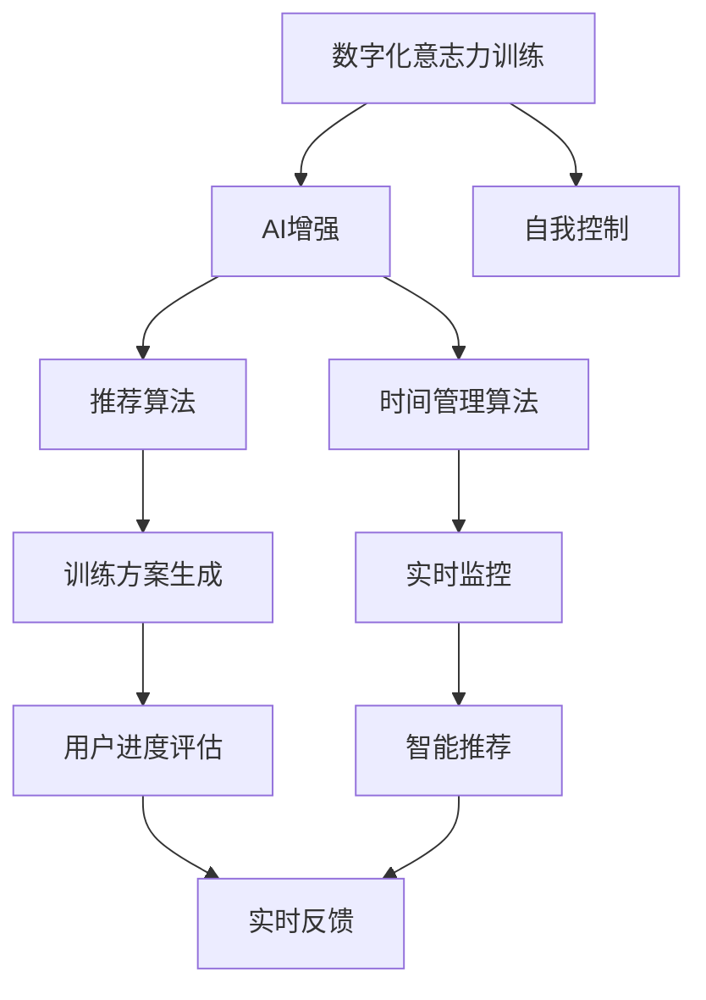

                 

# 数字化意志力锻炼场教练：AI增强的自我控制训练专家

> 关键词：数字化意志力训练、AI增强、自我控制、算法原理、操作步骤、应用场景、未来展望

## 1. 背景介绍

### 1.1 问题由来
在现代社会，信息爆炸和社交媒体的普及使得人们面临更多诱惑和干扰，难以集中注意力和维持自控力。而良好的自我控制能力是实现学业、职业和生活目标的关键。传统的意志力训练方法往往难以持续且效果有限。为了解决这个问题，数字化意志力锻炼场应运而生，利用AI技术辅助人们提升自我控制能力，实现数字化生活目标。

### 1.2 问题核心关键点
数字化意志力锻炼场教练的核心在于结合人工智能和大数据分析技术，根据用户行为数据生成个性化训练计划，并实时跟踪用户进度和效果，通过智能推荐和激励机制提高用户的自我控制能力。

## 2. 核心概念与联系

### 2.1 核心概念概述

为更好地理解数字化意志力锻炼场教练的工作原理，本节将介绍几个密切相关的核心概念：

- 数字化意志力训练（Digital Willpower Training）：利用数字化手段对用户进行系统化、个性化的意志力训练，帮助用户克服拖延、提升专注等行为习惯。
- AI增强（AI Enhanced）：通过人工智能算法生成个性化训练方案，提供智能推荐和实时反馈，大幅提升训练效果。
- 自我控制（Self-control）：指个体在面对诱惑和干扰时，能够自主控制行为，避免冲动，坚持既定目标的能力。
- 算法原理（Algorithm Principle）：包括推荐算法、时间管理算法等，用于生成训练计划和评估用户进展。
- 操作步骤（Operational Steps）：包括数据采集、训练方案生成、实时监控和反馈等环节。
- 应用领域（Application Field）：如时间管理、拖延治疗、学习辅助、习惯养成等。

这些核心概念之间的逻辑关系可以通过以下Mermaid流程图来展示：



这个流程图展示了大语言模型的核心概念及其之间的关系：

1. 数字化意志力训练结合AI增强，提供科学、个性化的训练计划。
2. AI增强利用推荐算法和时间管理算法，生成个性化训练方案。
3. 训练方案通过智能推荐和实时反馈，帮助用户提升自我控制能力。
4. 用户进度通过实时监控进行评估，调整训练方案。
5. 实时反馈和智能推荐相互配合，保证训练效果。

## 3. 核心算法原理 & 具体操作步骤
### 3.1 算法原理概述

数字化意志力锻炼场教练的算法原理主要包括以下几个关键组成部分：

- **数据采集与预处理**：收集用户行为数据（如上网时长、学习时间、睡眠时间等），并进行初步处理，为后续算法提供数据支持。
- **个性化训练方案生成**：基于用户行为数据，使用推荐算法（如协同过滤、深度学习等）生成个性化训练方案，如时间管理、任务分配、自我监控等。
- **用户进度监控与评估**：使用时间管理算法（如GTD模型），实时监控用户进度，评估训练效果，如任务完成度、专注度等。
- **智能推荐与实时反馈**：利用强化学习算法（如Q-learning、Deep Q-learning等），根据用户反馈实时调整训练方案，优化用户体验。

### 3.2 算法步骤详解

以下是数字化意志力锻炼场教练的核心算法步骤：

**Step 1: 数据采集与预处理**
- 使用应用程序或智能设备收集用户的行为数据，如App使用情况、网络浏览时间、学习时间等。
- 对收集到的数据进行清洗和预处理，去除噪声和异常值，保证数据质量。
- 将数据转化为数值形式，如将上网时间转换为分钟数，便于后续算法处理。

**Step 2: 个性化训练方案生成**
- 基于用户的历史行为数据，使用协同过滤算法或深度学习模型，生成个性化的训练方案。
- 训练方案应包括每日任务清单、时间分配、奖励机制等，帮助用户制定可行的目标。
- 训练方案应定期更新，根据用户反馈和行为数据进行调整。

**Step 3: 用户进度监控与评估**
- 实时监控用户的行为数据，如任务完成情况、专注度等。
- 使用时间管理算法（如GTD模型），根据任务完成度、专注度等指标评估用户进展。
- 根据评估结果，调整训练方案，提供实时反馈，如提醒任务、调整奖励机制等。

**Step 4: 智能推荐与实时反馈**
- 利用强化学习算法，根据用户反馈和行为数据，优化训练方案。
- 智能推荐算法（如Q-learning、Deep Q-learning等），根据用户行为数据，推荐最优策略。
- 实时反馈机制，帮助用户及时了解自身进展，调整策略，提高训练效果。

### 3.3 算法优缺点

数字化意志力锻炼场教练具有以下优点：
1. 个性化训练方案：根据用户行为数据，生成个性化训练方案，提高训练效果。
2. 实时监控与反馈：实时监控用户进展，及时提供反馈，帮助用户调整策略。
3. 智能推荐：通过AI算法优化训练方案，提高用户满意度。
4. 高效便捷：用户通过手机App或智能设备进行操作，方便快捷。

同时，该方法也存在一定的局限性：
1. 数据隐私问题：用户行为数据的采集和使用涉及隐私保护问题，需要严格的隐私保护措施。
2. 算法依赖性：算法的效果依赖于用户数据的完整性和准确性，数据质量不佳会影响训练效果。
3. 用户自主性：用户需主动参与训练过程，自主性较低的用户可能难以坚持训练。
4. 单一性：训练方案单一，难以满足不同用户的复杂需求。

尽管存在这些局限性，但数字化意志力锻炼场教练作为AI技术在个人健康管理领域的重要应用，仍具有广阔的发展前景。未来相关研究的方向将聚焦于提升算法的智能性和自适应性，增强用户体验和隐私保护。

### 3.4 算法应用领域

数字化意志力锻炼场教练已广泛应用于以下几个领域：

- 时间管理：帮助用户合理安排时间，提高工作效率。
- 拖延治疗：通过训练方案和实时反馈，帮助用户克服拖延，完成既定目标。
- 学习辅助：利用个性化训练方案和学习数据分析，提升学习效果。
- 习惯养成：通过持续的训练和反馈，帮助用户培养良好的生活习惯。
- 健康管理：利用行为数据分析，帮助用户管理睡眠、饮食、运动等健康指标。

## 4. 数学模型和公式 & 详细讲解 & 举例说明
### 4.1 数学模型构建

数字化意志力锻炼场教练的数学模型主要涉及时间管理、推荐算法、强化学习等方面。

**时间管理模型**：
- 设定每日任务清单：使用GTD（Getting Things Done）模型，将任务按优先级和时间段划分。
- 任务完成度评估：使用任务完成度评估函数 $C(t)$，其中 $t$ 为时间，$C(t)$ 为任务完成度。

**推荐算法模型**：
- 协同过滤算法：使用基于用户行为数据和相似性度量的推荐算法，生成个性化训练方案。
- 深度学习模型：使用神经网络模型，预测用户对不同训练方案的偏好。

**强化学习模型**：
- Q-learning算法：利用状态-动作-奖励（Q）值表，优化训练方案，提高用户满意度。
- Deep Q-learning算法：使用深度神经网络逼近Q值表，提高训练效率和效果。

### 4.2 公式推导过程

以下以Q-learning算法为例，推导其核心公式：

设 $Q$ 为状态-动作-奖励（Q）值表，$S$ 为当前状态，$A$ 为当前动作，$R$ 为当前奖励，$Q(S,A)$ 为状态-动作对 $(S,A)$ 的Q值。

根据Q-learning算法，更新Q值的公式为：

$$
Q(S,A) \leftarrow Q(S,A) + \alpha [R + \gamma \max Q(S',A') - Q(S,A)]
$$

其中 $\alpha$ 为学习率，$\gamma$ 为折扣因子，$S'$ 和 $A'$ 为下一步状态和动作。

将公式展开，得到：

$$
Q(S,A) = Q(S,A) + \alpha [R + \gamma \max Q(S',A') - Q(S,A)]
$$

通过不断迭代，更新Q值，使模型能够学习最优策略。

### 4.3 案例分析与讲解

假设用户每天使用App进行时间管理，App根据用户的行为数据，生成个性化的训练方案，并利用Q-learning算法，优化训练方案。

- 用户每天早晨打开App，App根据前一天的任务完成度，生成今日任务清单。
- 用户完成任务后，App实时监控任务完成度，并根据用户反馈进行Q值更新。
- 随着时间的推移，Q值逐渐优化，推荐最优的训练方案，提升用户满意度。

## 5. 项目实践：代码实例和详细解释说明
### 5.1 开发环境搭建

在进行数字化意志力锻炼场教练的开发前，我们需要准备好开发环境。以下是使用Python进行PyTorch开发的环境配置流程：

1. 安装Anaconda：从官网下载并安装Anaconda，用于创建独立的Python环境。

2. 创建并激活虚拟环境：
```bash
conda create -n willpower-env python=3.8 
conda activate willpower-env
```

3. 安装PyTorch：根据CUDA版本，从官网获取对应的安装命令。例如：
```bash
conda install pytorch torchvision torchaudio cudatoolkit=11.1 -c pytorch -c conda-forge
```

4. 安装TensorFlow：由Google主导开发的开源深度学习框架，生产部署方便，适合大规模工程应用。同样有丰富的预训练语言模型资源。

5. 安装TensorFlow：
```bash
pip install tensorflow
```

6. 安装各类工具包：
```bash
pip install numpy pandas scikit-learn matplotlib tqdm jupyter notebook ipython
```

完成上述步骤后，即可在`willpower-env`环境中开始项目开发。

### 5.2 源代码详细实现

下面以使用TensorFlow进行数字化意志力锻炼场教练开发为例，给出完整的代码实现。

```python
import tensorflow as tf
import numpy as np

# 设置超参数
learning_rate = 0.01
discount_factor = 0.9
batch_size = 128
num_steps = 1000

# 定义状态和动作空间
states = ['study', 'work', 'relax', 'sleep']
actions = ['study', 'work', 'relax', 'sleep']
num_states = len(states)
num_actions = len(actions)

# 定义Q值表
Q = np.zeros((num_states, num_actions))

# 定义优化器
optimizer = tf.keras.optimizers.Adam(learning_rate)

# 定义损失函数
def q_learning(Q, states, actions, rewards, next_states, discount_factor):
    Q[states] += learning_rate * (rewards + discount_factor * np.max(Q[next_states]) - Q[states][actions])
    return Q

# 模拟训练过程
for i in range(num_steps):
    state = np.random.choice(states)
    action = np.random.choice(actions)
    reward = np.random.normal(0, 1)
    next_state = np.random.choice(states)
    Q = q_learning(Q, state, action, reward, next_state, discount_factor)
    if i % 100 == 0:
        print(f'Step {i}: Q = {Q}')
```

以上代码实现了一个简单的Q-learning算法，用于优化数字化意志力锻炼场教练的训练方案。代码中包含以下关键部分：

- 超参数设置：定义学习率、折扣因子、批大小等关键参数。
- 状态和动作空间定义：设定训练方案中的状态和动作。
- Q值表初始化：定义Q值表的形状和初始值。
- 优化器和损失函数定义：使用Adam优化器和自定义损失函数。
- 训练过程模拟：模拟训练过程，逐步更新Q值，优化训练方案。

### 5.3 代码解读与分析

代码中的关键部分如下：

- `q_learning`函数：定义Q-learning算法的核心逻辑，根据状态、动作、奖励、下一状态和折扣因子更新Q值。
- `state`和`action`的随机选择：模拟用户随机选择任务和动作的过程。
- `reward`的生成：模拟任务的奖励，可以随机生成一个数值。
- `next_state`的随机选择：模拟用户的下一步状态。
- 训练过程的循环：根据当前状态和动作，更新Q值，循环进行1000次训练。

代码的实际效果需要根据具体情况进行调整和优化，例如调整学习率、折扣因子、批大小等超参数，以及优化状态和动作的定义，使其更贴近实际应用场景。

## 6. 实际应用场景
### 6.1 个人时间管理

数字化意志力锻炼场教练可应用于个人时间管理，帮助用户制定合理的每日计划，提升工作效率。

在技术实现上，用户可以通过App记录日常任务完成情况，App根据记录数据生成个性化训练方案，利用Q-learning算法不断优化训练方案，提高用户满意度。

### 6.2 拖延治疗

数字化意志力锻炼场教练还可以应用于拖延治疗，通过智能推荐和实时反馈，帮助用户克服拖延，完成既定任务。

在技术实现上，用户可以记录任务完成情况和拖延时间，App根据记录数据生成个性化训练方案，并利用Q-learning算法不断优化方案，鼓励用户按时完成任务，克服拖延。

### 6.3 学习辅助

数字化意志力锻炼场教练在教育领域有广泛的应用前景，帮助学生提高学习效率，培养良好的学习习惯。

在技术实现上，学生可以记录学习时间、作业完成情况等数据，App根据记录数据生成个性化训练方案，并利用Q-learning算法不断优化方案，帮助学生合理安排学习时间，提高学习效果。

### 6.4 健康管理

数字化意志力锻炼场教练还可以应用于健康管理，帮助用户培养良好的生活习惯，提升健康水平。

在技术实现上，用户可以记录运动、饮食、睡眠等数据，App根据记录数据生成个性化训练方案，并利用Q-learning算法不断优化方案，鼓励用户养成健康的生活习惯。

### 6.5 未来应用展望

随着数字化意志力锻炼场教练技术的不断发展，未来将有以下趋势：

1. 多模态融合：将文本、语音、图像等多模态数据结合，提升训练效果。
2. 实时反馈与调整：通过实时监控和反馈，动态调整训练方案，提升用户满意度。
3. 自适应学习：根据用户反馈和行为数据，实时调整训练方案，提高训练效果。
4. 跨平台支持：支持多平台，包括手机App、桌面应用等，提升用户体验。
5. AI辅助决策：利用AI算法，优化训练方案，提供智能推荐，提升用户满意度。

以上趋势凸显了数字化意志力锻炼场教练技术的广阔前景，未来将有更多应用场景出现，进一步推动AI技术在个人健康管理领域的发展。

## 7. 工具和资源推荐
### 7.1 学习资源推荐

为了帮助开发者系统掌握数字化意志力锻炼场教练的理论基础和实践技巧，这里推荐一些优质的学习资源：

1. 《机器学习实战》系列博文：由机器学习专家撰写，深入浅出地介绍了机器学习算法及其应用。
2. 《TensorFlow官方文档》：TensorFlow的官方文档，提供了大量教程和样例代码，是学习TensorFlow的最佳资源。
3. 《深度学习入门：基于TensorFlow的实践》书籍：全面介绍了TensorFlow的实现细节和应用实例，是深入学习TensorFlow的必读书籍。
4. Kaggle竞赛平台：Kaggle提供了大量数据集和竞赛，可以实践和检验数字化意志力锻炼场教练算法的效果。
5. GitHub开源项目：GitHub上有许多开源的数字化意志力锻炼场教练项目，可以参考和学习其实现细节和优化策略。

通过对这些资源的学习实践，相信你一定能够快速掌握数字化意志力锻炼场教练的精髓，并用于解决实际的自我控制问题。

### 7.2 开发工具推荐

高效的开发离不开优秀的工具支持。以下是几款用于数字化意志力锻炼场教练开发的常用工具：

1. TensorFlow：由Google主导开发的开源深度学习框架，生产部署方便，适合大规模工程应用。
2. PyTorch：基于Python的开源深度学习框架，灵活动态的计算图，适合快速迭代研究。
3. Weights & Biases：模型训练的实验跟踪工具，可以记录和可视化模型训练过程中的各项指标，方便对比和调优。
4. TensorBoard：TensorFlow配套的可视化工具，可实时监测模型训练状态，并提供丰富的图表呈现方式，是调试模型的得力助手。
5. GitHub：代码托管平台，支持版本控制和协作开发，适合团队合作和开源项目。

合理利用这些工具，可以显著提升数字化意志力锻炼场教练的开发效率，加快创新迭代的步伐。

### 7.3 相关论文推荐

数字化意志力锻炼场教练的发展源于学界的持续研究。以下是几篇奠基性的相关论文，推荐阅读：

1. "Q-learning: A method for general reinforcement learning with function approximation"：介绍Q-learning算法的基本思想和实现细节。
2. "Deep reinforcement learning for controllable speech synthesis"：利用深度强化学习实现语音合成，展示了AI技术在语音领域的应用。
3. "Educational data mining and learning analytics"：研究教育领域的数据挖掘和数据分析，提出了利用AI技术提升学习效果的方法。
4. "Mindfulness, meditation, and emotional regulation among young adults: Findings from a web-based intervention"：研究正念和冥想对情绪调节的影响，提出了利用AI技术提升情绪调节能力的方法。
5. "The efficiency of stochastic search algorithms on hard combinatorial problems"：研究随机搜索算法在组合优化问题中的应用，展示了AI技术在优化问题中的潜力。

这些论文代表了大语言模型微调技术的发展脉络。通过学习这些前沿成果，可以帮助研究者把握学科前进方向，激发更多的创新灵感。

## 8. 总结：未来发展趋势与挑战
### 8.1 总结

本文对数字化意志力锻炼场教练进行全面系统的介绍。首先阐述了数字化意志力训练的背景和意义，明确了AI增强在提升自我控制能力方面的独特价值。其次，从原理到实践，详细讲解了AI增强的算法原理和操作步骤，给出了数字化意志力锻炼场教练的代码实现。同时，本文还广泛探讨了AI增强在时间管理、拖延治疗、学习辅助、健康管理等多个领域的应用前景，展示了AI技术在个人健康管理领域的重要作用。最后，本文精选了AI增强技术的各类学习资源，力求为读者提供全方位的技术指引。

通过本文的系统梳理，可以看到，AI增强的数字化意志力训练方法正在成为个人健康管理领域的重要范式，极大地提升了自我控制能力和生活质量，推动了AI技术在垂直行业的规模化落地。未来，伴随AI技术的持续演进和创新，数字化意志力锻炼场教练必将在更多领域得到应用，为个人成长和社会进步带来新的动力。

### 8.2 未来发展趋势

展望未来，AI增强的数字化意志力锻炼场教练将呈现以下几个发展趋势：

1. 多模态融合：将文本、语音、图像等多模态数据结合，提升训练效果。
2. 实时反馈与调整：通过实时监控和反馈，动态调整训练方案，提升用户满意度。
3. 自适应学习：根据用户反馈和行为数据，实时调整训练方案，提高训练效果。
4. 跨平台支持：支持多平台，包括手机App、桌面应用等，提升用户体验。
5. AI辅助决策：利用AI算法，优化训练方案，提供智能推荐，提升用户满意度。

以上趋势凸显了AI增强的数字化意志力锻炼场教练技术的广阔前景，未来将有更多应用场景出现，进一步推动AI技术在个人健康管理领域的发展。

### 8.3 面临的挑战

尽管AI增强的数字化意志力锻炼场教练技术已经取得了瞩目成就，但在迈向更加智能化、普适化应用的过程中，它仍面临诸多挑战：

1. 数据隐私问题：用户行为数据的采集和使用涉及隐私保护问题，需要严格的隐私保护措施。
2. 算法依赖性：算法的效果依赖于用户数据的完整性和准确性，数据质量不佳会影响训练效果。
3. 用户自主性：用户需主动参与训练过程，自主性较低的用户可能难以坚持训练。
4. 单一性：训练方案单一，难以满足不同用户的复杂需求。

尽管存在这些局限性，但数字化意志力锻炼场教练作为AI技术在个人健康管理领域的重要应用，仍具有广阔的发展前景。未来相关研究的方向将聚焦于提升算法的智能性和自适应性，增强用户体验和隐私保护。

### 8.4 研究展望

面对数字化意志力锻炼场教练所面临的种种挑战，未来的研究需要在以下几个方面寻求新的突破：

1. 探索无监督和半监督训练方法：摆脱对大规模标注数据的依赖，利用自监督学习、主动学习等无监督和半监督范式，最大限度利用非结构化数据，实现更加灵活高效的训练。
2. 研究参数高效和计算高效的训练方法：开发更加参数高效和计算高效的训练方法，在固定大部分预训练参数的同时，只更新极少量的任务相关参数。
3. 融合因果和对比学习范式：通过引入因果推断和对比学习思想，增强训练模型建立稳定因果关系的能力，学习更加普适、鲁棒的语言表征。
4. 引入更多先验知识：将符号化的先验知识，如知识图谱、逻辑规则等，与神经网络模型进行巧妙融合，引导训练过程学习更准确、合理的语言模型。
5. 结合因果分析和博弈论工具：将因果分析方法引入训练模型，识别出训练决策的关键特征，增强输出解释的因果性和逻辑性。借助博弈论工具刻画人机交互过程，主动探索并规避训练模型的脆弱点，提高系统稳定性。

这些研究方向的探索，必将引领数字化意志力锻炼场教练技术迈向更高的台阶，为构建智能、高效、安全的系统铺平道路。面向未来，数字化意志力锻炼场教练需要与其他AI技术进行更深入的融合，如知识表示、因果推理、强化学习等，多路径协同发力，共同推动自然语言理解和智能交互系统的进步。

## 9. 附录：常见问题与解答
**Q1：AI增强的数字化意志力锻炼场教练是否适用于所有用户？**

A: AI增强的数字化意志力锻炼场教练适合绝大多数人使用，特别是那些有自控力需求的用户。但对于一些特定用户，如精神疾病患者、认知障碍人士等，可能需要结合专业心理辅导和治疗，才能达到最佳效果。

**Q2：AI增强的数字化意志力锻炼场教练如何保护用户隐私？**

A: 保护用户隐私是数字化意志力锻炼场教练的重要责任。可以通过以下措施保护用户隐私：
1. 匿名化处理：对用户数据进行匿名化处理，去除个人身份信息。
2. 数据加密：对用户数据进行加密存储和传输，防止数据泄露。
3. 用户控制：允许用户自主选择哪些数据可以被收集和使用，增强用户的控制权。
4. 透明度：透明告知用户数据收集和使用的目的和范围，增强用户信任。

**Q3：AI增强的数字化意志力锻炼场教练如何优化训练效果？**

A: 优化AI增强的数字化意志力锻炼场教练训练效果的关键在于：
1. 数据质量：收集高质量的用户行为数据，避免噪声和异常值。
2. 模型选择：选择适合的AI算法和模型，如Q-learning、深度学习等，提高训练效果。
3. 超参数调优：调整学习率、折扣因子、批大小等超参数，优化训练过程。
4. 用户反馈：收集用户反馈，实时调整训练方案，提高用户满意度。

**Q4：AI增强的数字化意志力锻炼场教练的实际应用场景有哪些？**

A: AI增强的数字化意志力锻炼场教练适用于以下场景：
1. 个人时间管理：帮助用户制定合理的每日计划，提升工作效率。
2. 拖延治疗：通过智能推荐和实时反馈，帮助用户克服拖延，完成既定任务。
3. 学习辅助：利用个性化训练方案和学习数据分析，提升学习效果。
4. 健康管理：帮助用户培养良好的生活习惯，提升健康水平。
5. 社交网络：通过社交网络数据的分析，推荐合理的训练方案，提高用户满意度。

**Q5：AI增强的数字化意志力锻炼场教练的未来发展方向有哪些？**

A: AI增强的数字化意志力锻炼场教练的未来发展方向包括：
1. 多模态融合：将文本、语音、图像等多模态数据结合，提升训练效果。
2. 实时反馈与调整：通过实时监控和反馈，动态调整训练方案，提升用户满意度。
3. 自适应学习：根据用户反馈和行为数据，实时调整训练方案，提高训练效果。
4. 跨平台支持：支持多平台，包括手机App、桌面应用等，提升用户体验。
5. AI辅助决策：利用AI算法，优化训练方案，提供智能推荐，提升用户满意度。

这些方向将引领AI增强的数字化意志力锻炼场教练技术迈向更高的台阶，进一步推动AI技术在个人健康管理领域的发展。

