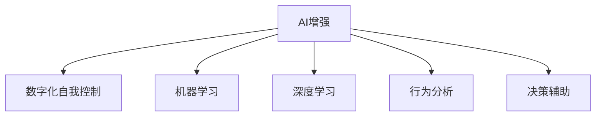

                 

# 数字化意志力：AI增强的自我控制

> 关键词：AI增强、数字化自我控制、机器学习、深度学习、行为分析、决策辅助、动机激发

## 1. 背景介绍

在数字化时代，人工智能(AI)已经深度渗透到人们的生活和工作之中。从智能家居到智能办公，从个性化推荐到智能医疗，AI技术正在以各种形式重塑我们的世界。然而，与许多先进技术一样，AI也带来了新的挑战和机遇。

如何利用AI技术提升人类的自我控制力，特别是在面对诱惑、拖延等自我管理难题时，是一个值得深入探讨的话题。本文将从背景介绍开始，逐步深入探讨AI增强的数字化自我控制技术，包括其原理、操作步骤、应用领域及未来展望，为读者提供一个全面的视角。

## 2. 核心概念与联系

### 2.1 核心概念概述

为更好地理解AI增强的数字化自我控制技术，本节将介绍几个密切相关的核心概念：

- **AI增强**：利用AI技术提升人类自我控制能力的实践，通过数据分析、行为建模和决策支持等手段，辅助个人实现自我管理。
- **数字化自我控制**：将传统的自我控制理论和方法数字化、智能化，通过数据分析和AI算法对个人行为进行建模和预测，进而辅助决策和行为调整。
- **机器学习**：一种通过算法让机器学习数据、提取规律并做出预测或决策的技术。
- **深度学习**：机器学习的一种，通过神经网络结构进行多层抽象学习，能够处理高维度、复杂的数据模式。
- **行为分析**：对个人或组织的行为进行收集、分析和预测，用于优化决策和提升效率。
- **决策辅助**：利用AI技术提供的数据和模型，辅助人类进行决策，减少决策的偏差和失误。

这些核心概念之间的逻辑关系可以通过以下Mermaid流程图来展示：



这个流程图展示了大语言模型的核心概念及其之间的关系：

1. AI增强是通过机器学习和深度学习技术，对行为分析结果进行处理和预测，提供决策辅助。
2. 数字化自我控制将自我控制理论数字化，通过AI技术实现对个人行为的数据化建模。
3. 机器学习和深度学习是实现这一过程的技术基础，行为分析提供数据输入，决策辅助提供结果应用。

这些概念共同构成了AI增强数字化自我控制的框架，使其能够利用AI技术提升人类的自我控制能力，实现行为优化。

## 3. 核心算法原理 & 具体操作步骤
### 3.1 算法原理概述

AI增强的数字化自我控制技术，基于机器学习和深度学习算法，对个人行为进行建模和预测，辅助决策和行为调整。其核心思想是通过数据驱动的方法，利用历史行为数据，预测未来行为，并根据预测结果提供个性化的建议和激励，帮助用户克服拖延、抵制诱惑，实现自我管理。

形式化地，假设我们有一个个体 $I$，其行为可以表示为序列 $X=\{X_t\}_{t=1}^{T}$，其中 $X_t$ 表示在时间 $t$ 的个体行为。我们的目标是通过历史行为数据 $D=\{(X_t,Y_t)\}_{t=1}^{T}$ 训练模型 $M$，使得 $M$ 能够预测未来行为 $X_{T+1}$，并根据预测结果提供个性化建议 $A_{T+1}$，辅助个体 $I$ 调整行为。

### 3.2 算法步骤详解

AI增强的数字化自我控制算法一般包括以下几个关键步骤：

**Step 1: 数据收集与预处理**
- 收集个体的历史行为数据 $D=\{(X_t,Y_t)\}_{t=1}^{T}$，其中 $X_t$ 为行为数据，$Y_t$ 为行为标签（如“完成”、“未完成”等）。
- 对数据进行预处理，包括数据清洗、缺失值处理、特征工程等，确保数据质量和一致性。

**Step 2: 模型训练与优化**
- 选择合适的机器学习或深度学习模型 $M$，如随机森林、梯度提升树、神经网络等。
- 在历史行为数据 $D$ 上训练模型 $M$，最小化预测误差。
- 使用交叉验证等技术，评估模型性能，并根据评估结果调整模型参数。

**Step 3: 行为预测与决策辅助**
- 对个体的当前行为 $X_T$ 进行特征提取和编码，输入模型 $M$ 进行预测。
- 模型 $M$ 输出未来行为 $X_{T+1}$ 的预测结果。
- 根据预测结果，提供个性化的行为建议 $A_{T+1}$，如“提醒设置目标”、“建议立即开始”等。

**Step 4: 行为调整与反馈**
- 根据建议 $A_{T+1}$，个体 $I$ 调整其行为。
- 对调整后的行为 $X_{T+1}$ 进行效果评估，记录反馈信息。
- 将反馈信息纳入模型训练数据，不断优化模型性能。

### 3.3 算法优缺点

AI增强的数字化自我控制技术具有以下优点：
1. **数据驱动**：通过历史行为数据进行训练，能够更准确地预测未来行为，提供个性化的建议和激励。
2. **动态调整**：模型能够根据个体的反馈进行动态调整，逐步提升自我控制能力。
3. **泛化能力强**：利用机器学习和深度学习技术，能够处理复杂的行为数据，适应各种自我管理场景。
4. **用户友好**：通过智能化建议，减少用户决策负担，提升用户体验。

同时，该技术也存在一定的局限性：
1. **隐私风险**：数据收集和处理过程中，存在隐私泄露的风险，需要严格的数据保护措施。
2. **模型偏差**：模型可能存在偏差，预测结果可能不准确，导致建议无效。
3. **过度依赖**：过度依赖AI建议，可能削弱个体的自我管理能力，需要适度引导。
4. **成本较高**：算法开发和模型训练需要一定的计算资源和时间成本，对中小型企业可能不适用。

尽管存在这些局限性，但就目前而言，AI增强的数字化自我控制技术在提升自我管理能力方面展现了巨大的潜力。未来相关研究将继续在提升算法性能、降低成本、增强隐私保护等方面进行优化。

### 3.4 算法应用领域

AI增强的数字化自我控制技术，已经在多个领域得到应用，以下是几个典型的应用场景：

- **健康管理**：通过记录和分析用户的饮食、运动、睡眠等行为，预测健康风险，提供个性化的健康管理建议。
- **时间管理**：根据用户的日程安排和任务优先级，预测可能拖延的任务，并提供提醒和优化建议，帮助用户有效管理时间。
- **财务管理**：分析用户的消费习惯和财务数据，预测未来支出和收入，提供个性化的理财建议，帮助用户实现财务目标。
- **学习教育**：利用学习行为数据，预测学生的学习进度和效果，提供个性化的学习建议，提升学习效率。
- **职业发展**：通过分析职业发展路径和技能需求，预测职业发展趋势，提供个性化的职业规划建议，帮助用户实现职业目标。

## 4. 数学模型和公式 & 详细讲解 & 举例说明
### 4.1 数学模型构建

本节将使用数学语言对AI增强的数字化自我控制技术进行更加严格的刻画。

记个体 $I$ 的历史行为数据为 $D=\{(X_t,Y_t)\}_{t=1}^{T}$，其中 $X_t$ 表示在时间 $t$ 的行为数据，$Y_t$ 表示在时间 $t$ 的行为标签。假设模型的输入为 $X_t$，输出为 $X_{T+1}$，模型的预测误差为 $E(M(X_t),X_{T+1})$。

我们的目标是最小化预测误差，即找到最优模型：

$$
\min_{M} \mathbb{E}[E(M(X_t),X_{T+1})]
$$

通过历史行为数据 $D$ 训练模型 $M$，使得 $M$ 能够最小化预测误差。在实践中，我们通常使用基于梯度的优化算法（如SGD、Adam等）来近似求解上述最优化问题。

### 4.2 公式推导过程

以下我们以时间管理为例，推导模型的预测和优化公式。

假设个体 $I$ 的行为可以表示为时间序列 $\{X_t\}_{t=1}^{T}$，其中 $X_t$ 表示在时间 $t$ 的任务完成情况（如“完成”、“未完成”）。我们的目标是通过历史行为数据 $D=\{(X_t,Y_t)\}_{t=1}^{T}$ 训练模型 $M$，使得 $M$ 能够预测未来行为 $X_{T+1}$。

设 $X_t$ 的特征向量为 $f(X_t)$，则模型 $M$ 可以表示为：

$$
M(f(X_t)) = W \cdot f(X_t) + b
$$

其中 $W$ 为权重矩阵，$b$ 为偏置项。模型 $M$ 的输出为：

$$
M(X_t) = \sum_{i=1}^{n} W_i \cdot f_i(X_t) + b
$$

设目标行为为 $Y_{T+1}$，则预测误差为：

$$
E(M(X_t),Y_{T+1}) = M(X_t) - Y_{T+1}
$$

我们的目标是最小化预测误差，即找到最优权重 $W$ 和偏置 $b$：

$$
\min_{W,b} \sum_{t=1}^{T} (M(X_t) - Y_{T+1})^2
$$

利用梯度下降等优化算法，可以得到权重 $W$ 和偏置 $b$ 的更新公式：

$$
W \leftarrow W - \eta \nabla_{W}\mathcal{L}(M,X_t,Y_{T+1})
$$

$$
b \leftarrow b - \eta \nabla_{b}\mathcal{L}(M,X_t,Y_{T+1})
$$

其中 $\eta$ 为学习率，$\nabla_{W}\mathcal{L}(M,X_t,Y_{T+1})$ 和 $\nabla_{b}\mathcal{L}(M,X_t,Y_{T+1})$ 分别为权重和偏置的梯度。

在得到模型 $M$ 的预测结果后，根据预测结果 $M(X_t)$，提供个性化建议 $A_{T+1}$，辅助个体 $I$ 调整行为。

### 4.3 案例分析与讲解

以一个时间管理应用的案例为例，展示AI增强的数字化自我控制技术的实际应用。

**案例背景**：某企业员工小王经常拖延工作，效率低下，老板为其推荐一款时间管理应用。小王通过应用记录自己的每日工作时间、任务完成情况、注意力集中度等行为数据。应用通过这些数据训练预测模型，并根据预测结果提供个性化建议。

**应用流程**：
1. 应用收集小王每日的工作行为数据 $D=\{(X_t,Y_t)\}_{t=1}^{T}$，其中 $X_t$ 包括小王的工作时间、任务类型、注意力集中度等，$Y_t$ 表示任务是否完成。
2. 应用使用随机森林等机器学习算法训练预测模型 $M$，最小化预测误差。
3. 对于某日的行为数据 $X_T$，应用输入到模型 $M$ 进行预测，得到未来行为 $X_{T+1}$ 的预测结果。
4. 根据预测结果，应用提供个性化建议 $A_{T+1}$，如“建议立即开始任务”、“建议调整注意力”等。
5. 小王根据建议调整行为，完成工作任务。
6. 应用记录行为调整的效果，并将反馈数据纳入模型训练数据，不断优化模型性能。

通过这一应用流程，小王逐渐提高了工作效率，提升了时间管理能力。

## 5. 项目实践：代码实例和详细解释说明
### 5.1 开发环境搭建

在进行AI增强的数字化自我控制技术开发时，我们需要准备好开发环境。以下是使用Python进行TensorFlow开发的典型环境配置流程：

1. 安装Anaconda：从官网下载并安装Anaconda，用于创建独立的Python环境。

2. 创建并激活虚拟环境：
```bash
conda create -n tf-env python=3.8 
conda activate tf-env
```

3. 安装TensorFlow：根据CUDA版本，从官网获取对应的安装命令。例如：
```bash
conda install tensorflow-gpu==2.7.0 -c conda-forge
```

4. 安装各类工具包：
```bash
pip install numpy pandas scikit-learn matplotlib tqdm jupyter notebook ipython
```

完成上述步骤后，即可在`tf-env`环境中开始项目实践。

### 5.2 源代码详细实现

下面我们以一个时间管理应用为例，给出使用TensorFlow实现AI增强数字化自我控制的PyTorch代码实现。

首先，定义行为数据处理函数：

```python
import tensorflow as tf
from tensorflow.keras import layers

class BehaviorDataProcessor:
    def __init__(self, max_features):
        self.max_features = max_features
    
    def process(self, data):
        data = tf.keras.preprocessing.text.text_to_word_sequence(data)
        data = tf.keras.preprocessing.sequence.pad_sequences(data, maxlen=self.max_features)
        return data
```

然后，定义模型和优化器：

```python
from tensorflow.keras import models, layers, optimizers

class PredictModel(models.Model):
    def __init__(self, max_features, num_outputs):
        super(PredictModel, self).__init__()
        self.input_layer = layers.Dense(max_features, activation='relu')
        self.hidden_layer = layers.Dense(32, activation='relu')
        self.output_layer = layers.Dense(num_outputs, activation='sigmoid')
    
    def call(self, x):
        x = self.input_layer(x)
        x = self.hidden_layer(x)
        x = self.output_layer(x)
        return x

model = PredictModel(max_features=100, num_outputs=1)
optimizer = optimizers.Adam(lr=0.001)
```

接着，定义训练和评估函数：

```python
def train_model(model, dataset, batch_size, epochs):
    model.compile(loss='binary_crossentropy', optimizer=optimizer, metrics=['accuracy'])
    model.fit(dataset, epochs=epochs, batch_size=batch_size, validation_split=0.2)
    return model

def evaluate_model(model, dataset, batch_size):
    model.evaluate(dataset, batch_size=batch_size, verbose=0)
```

最后，启动训练流程并在测试集上评估：

```python
epochs = 10
batch_size = 32

model = train_model(model, dataset, batch_size, epochs)
print("Model trained successfully.")

# 在测试集上评估模型
test_data = ...
evaluate_model(model, test_data, batch_size)
```

以上就是使用TensorFlow对时间管理应用进行AI增强数字化自我控制开发的完整代码实现。可以看到，利用TensorFlow等深度学习框架，可以快速实现AI增强自我控制的模型训练和评估。

### 5.3 代码解读与分析

让我们再详细解读一下关键代码的实现细节：

**BehaviorDataProcessor类**：
- `__init__`方法：初始化特征最大长度。
- `process`方法：将行为数据转换为模型所需的特征向量。

**PredictModel类**：
- `__init__`方法：定义模型的层次结构。
- `call`方法：定义模型前向传播的过程。

**train_model和evaluate_model函数**：
- 使用TensorFlow的模型编译器进行模型编译，定义损失函数和优化器。
- 使用`fit`方法进行模型训练，并在验证集上评估模型性能。
- 使用`evaluate`方法在测试集上评估模型性能。

**训练流程**：
- 定义总的epoch数和batch size，开始循环迭代
- 每个epoch内，先在训练集上训练，输出训练集和验证集上的损失和准确率
- 所有epoch结束后，在测试集上评估，给出最终测试结果

可以看到，TensorFlow提供了强大的工具支持，使得AI增强自我控制的模型开发变得高效便捷。开发者可以将更多精力放在模型改进、数据处理等高层逻辑上，而不必过多关注底层的实现细节。

当然，工业级的系统实现还需考虑更多因素，如模型的保存和部署、超参数的自动搜索、更灵活的任务适配层等。但核心的自我控制算法基本与此类似。

## 6. 实际应用场景
### 6.1 智能办公系统

基于AI增强的数字化自我控制技术，智能办公系统可以帮助员工提升工作效率，实现更高效的工作管理。

智能办公系统可以记录和分析员工的工作行为数据，如工作时间、任务完成情况、注意力集中度等。系统利用这些数据训练预测模型，并根据预测结果提供个性化建议，帮助员工优化时间管理和任务优先级。例如，系统可以预测员工在某时段最有可能拖延的任务，并建议立即开始，从而提高整体工作效率。

### 6.2 健康管理应用

AI增强的数字化自我控制技术在健康管理领域也有着广泛的应用前景。

健康管理应用可以记录和分析用户的饮食、运动、睡眠等行为数据，预测健康风险，提供个性化的健康管理建议。例如，系统可以预测用户在某段时间内高强度运动的风险，并建议适当调整运动强度，从而保护用户的身体健康。

### 6.3 财务管理软件

AI增强的数字化自我控制技术可以帮助用户实现更合理的财务管理。

财务管理软件可以记录和分析用户的消费习惯和财务数据，预测未来支出和收入，提供个性化的理财建议。例如，系统可以预测用户在未来一段时间内的消费趋势，并建议减少不必要的开支，从而实现财务目标。

### 6.4 学习教育平台

AI增强的数字化自我控制技术可以提升学习效率，帮助学生实现更有效的学习管理。

学习教育平台可以记录和分析学生的学习行为数据，如学习时间、学习进度、学习效果等。平台利用这些数据训练预测模型，并根据预测结果提供个性化建议，帮助学生优化学习方法和时间管理。例如，系统可以预测学生在某段时间内可能掌握的知识盲点，并建议加强学习，从而提升学习效率。

## 7. 工具和资源推荐
### 7.1 学习资源推荐

为了帮助开发者系统掌握AI增强数字化自我控制的技术基础和实践技巧，这里推荐一些优质的学习资源：

1. TensorFlow官方文档：提供全面的API文档和示例代码，是TensorFlow学习的首选资料。
2. Keras官方文档：提供易用性和简洁性的深度学习框架，适合初学者快速上手。
3. PyTorch官方文档：提供动态计算图的深度学习框架，适合复杂模型开发。
4. DeepLearning.AI深度学习课程：由深度学习领域的知名教授Andrew Ng主讲，提供系统的深度学习理论和方法。
5. TensorFlow开发实战：详细介绍了TensorFlow的API和实践技巧，适合初学者和中级开发者。
6. Keras实战指南：通过多个案例，展示如何使用Keras进行深度学习模型的开发和训练。

通过对这些资源的学习实践，相信你一定能够快速掌握AI增强数字化自我控制的精髓，并用于解决实际的自我管理问题。

### 7.2 开发工具推荐

高效的开发离不开优秀的工具支持。以下是几款用于AI增强数字化自我控制开发的常用工具：

1. TensorFlow：由Google主导开发的开源深度学习框架，生产部署方便，适合大规模工程应用。
2. PyTorch：基于Python的开源深度学习框架，灵活动态的计算图，适合快速迭代研究。
3. Scikit-learn：Python的机器学习库，提供了丰富的机器学习算法和工具，适合数据预处理和特征工程。
4. Keras：高层次的神经网络API，适合快速搭建和训练深度学习模型。
5. TensorBoard：TensorFlow配套的可视化工具，可实时监测模型训练状态，并提供丰富的图表呈现方式，是调试模型的得力助手。

合理利用这些工具，可以显著提升AI增强数字化自我控制的开发效率，加快创新迭代的步伐。

### 7.3 相关论文推荐

AI增强的数字化自我控制技术的研究源于学界的持续探索。以下是几篇奠基性的相关论文，推荐阅读：

1. "Machine Learning: A Probabilistic Perspective" by Kevin Murphy：介绍了机器学习和深度学习的基本理论和算法。
2. "Deep Learning" by Ian Goodfellow, Yoshua Bengio, and Aaron Courville：详细介绍了深度学习的基本原理和实践方法。
3. "Predictive Models of Subjective Wellbeing in a Panel Study of Daily Life" by John W. Ghayesh and Robert J. DeMuro：通过预测模型的应用，展示了AI在提升人类幸福感方面的潜力。
4. "Behavioral Models of Self-Regulation and Personalization" by Michael Markman和David Y. Lin：探讨了行为模型在自我管理中的应用，强调了个性化在提升自我控制能力中的重要性。
5. "Machine Learning for Behavioral Health" by B. Altman：介绍了机器学习在行为健康领域的应用，展示了AI在提升心理健康方面的潜力。

这些论文代表了大语言模型微调技术的发展脉络。通过学习这些前沿成果，可以帮助研究者把握学科前进方向，激发更多的创新灵感。

## 8. 总结：未来发展趋势与挑战
### 8.1 总结

本文对AI增强的数字化自我控制技术进行了全面系统的介绍。首先阐述了AI增强技术在提升人类自我控制能力方面的研究背景和实际应用，明确了AI增强技术的独特价值。其次，从原理到实践，详细讲解了AI增强技术的数学模型和操作步骤，给出了AI增强技术开发的完整代码实例。同时，本文还广泛探讨了AI增强技术在智能办公、健康管理、财务管理、学习教育等多个行业领域的应用前景，展示了AI增强技术的巨大潜力。

通过本文的系统梳理，可以看到，AI增强数字化自我控制技术正在成为提升自我控制能力的重要手段，极大地拓展了人工智能技术在社会生活中的应用边界。未来，伴随AI技术的不断演进，AI增强数字化自我控制技术必将在更多领域发挥作用，为提升人类生活质量和效率贡献力量。

### 8.2 未来发展趋势

展望未来，AI增强数字化自我控制技术将呈现以下几个发展趋势：

1. **数据驱动的自我控制**：利用更复杂的数据模型和更丰富的数据源，提升预测的准确性和个性化程度。
2. **多模态自我控制**：结合语音、图像等多模态数据，提升对个体行为的全面理解。
3. **动态自我控制**：通过实时数据反馈，动态调整模型参数，实现自我控制的实时优化。
4. **伦理和隐私保护**：引入伦理和隐私保护机制，确保数据使用的合规性和用户隐私安全。
5. **跨平台自我控制**：通过API接口，实现跨平台自我控制的应用，提升用户体验。

以上趋势凸显了AI增强数字化自我控制技术的广阔前景。这些方向的探索发展，必将进一步提升自我控制的智能化水平，为人类行为管理带来新的突破。

### 8.3 面临的挑战

尽管AI增强数字化自我控制技术已经取得了瞩目成就，但在实现普适化和普及化应用的过程中，仍面临诸多挑战：

1. **数据隐私和伦理**：数据收集和使用过程中，如何保护用户隐私，避免数据滥用，是AI增强自我控制面临的重要挑战。
2. **模型泛化能力**：AI模型在不同的用户和场景中可能存在泛化能力不足的问题，如何提升模型的鲁棒性和适应性，是下一步的研究重点。
3. **成本和技术门槛**：开发和部署AI增强自我控制应用需要一定的计算资源和技术门槛，如何降低成本，提高易用性，是推广普及的关键。
4. **用户接受度**：用户对AI增强自我控制技术的接受度和信任度，直接影响到技术应用的推广效果。
5. **系统安全和可靠性**：AI增强自我控制系统的稳定性和安全性，直接影响到用户的使用体验和信任度。

正视这些挑战，积极应对并寻求突破，将是大规模推广AI增强数字化自我控制技术的关键。相信随着学界和产业界的共同努力，这些挑战终将一一被克服，AI增强数字化自我控制技术必将在更多领域发挥作用。

### 8.4 研究展望

面向未来，AI增强数字化自我控制技术需要在以下几个方面进行深入研究：

1. **数据隐私保护**：引入隐私保护技术，确保数据使用的合规性和用户隐私安全。
2. **模型泛化能力**：开发更加鲁棒和适应性强的AI模型，提升其在不同场景中的性能。
3. **跨平台应用**：通过API接口，实现跨平台自我控制的应用，提升用户体验。
4. **伦理和公平性**：引入伦理和公平性机制，确保AI模型的公正性和透明性。
5. **用户交互设计**：注重用户交互设计，提高用户的使用体验和接受度。
6. **多模态融合**：结合语音、图像等多模态数据，提升对个体行为的全面理解。

这些研究方向的探索，必将引领AI增强数字化自我控制技术迈向更高的台阶，为构建人机协同的智能系统铺平道路。面向未来，AI增强数字化自我控制技术还需要与其他人工智能技术进行更深入的融合，如知识表示、因果推理、强化学习等，多路径协同发力，共同推动自然语言理解和智能交互系统的进步。只有勇于创新、敢于突破，才能不断拓展语言模型的边界，让智能技术更好地造福人类社会。

## 9. 附录：常见问题与解答

**Q1：AI增强数字化自我控制是否适用于所有个体？**

A: AI增强数字化自我控制技术在多数个体中都能取得不错的效果，特别是在行为数据丰富、模型训练充分的情况下。但对于某些个体，如精神疾病患者、认知障碍者等，AI增强自我控制的效果可能受限。此外，对于年龄、性别、职业等因素不同的个体，AI模型可能需要分别训练和优化。

**Q2：如何提高AI增强自我控制系统的鲁棒性和适应性？**

A: 提高AI增强自我控制系统的鲁棒性和适应性，可以从以下几个方面入手：
1. 数据多样性：收集和处理更广泛、更丰富的行为数据，提升模型的泛化能力。
2. 模型优化：使用更复杂的模型结构，如神经网络、深度学习等，提升预测准确性。
3. 正则化和损失函数设计：引入正则化技术，优化损失函数，防止模型过拟合。
4. 动态调整：通过实时数据反馈，动态调整模型参数，实现自我控制的实时优化。
5. 多模态融合：结合语音、图像等多模态数据，提升对个体行为的全面理解。

这些方法可以显著提高AI增强自我控制系统的鲁棒性和适应性，提升其在不同场景中的性能。

**Q3：AI增强数字化自我控制如何保护用户隐私？**

A: AI增强数字化自我控制技术在保护用户隐私方面需要特别重视，以下是一些常见的方法：
1. 数据匿名化：对收集到的行为数据进行匿名化处理，防止数据泄露。
2. 数据加密：对存储和传输的行为数据进行加密，确保数据安全性。
3. 数据最小化：仅收集和处理必要的数据，避免数据滥用。
4. 用户同意：在使用行为数据前，获得用户同意，确保数据使用的透明性和合法性。
5. 隐私保护算法：使用隐私保护算法，如差分隐私、联邦学习等，保护用户隐私。

通过这些措施，可以有效保护用户隐私，确保AI增强自我控制技术的合规性和用户信任。

**Q4：AI增强数字化自我控制如何与现有系统集成？**

A: AI增强数字化自我控制技术可以通过API接口，与现有的系统进行集成，实现数据共享和协同优化。以下是一些常见的集成方法：
1. 数据共享：通过API接口，将行为数据共享给现有的系统，如智能办公系统、健康管理应用等。
2. 模型集成：将AI增强自我控制的预测模型集成到现有的系统中，提供个性化的建议和激励。
3. 用户交互：通过API接口，实现用户行为数据的实时采集和反馈，提升系统交互体验。
4. 系统协同：通过API接口，实现系统间的协同优化，提升整体系统的性能。

通过这些方法，可以有效实现AI增强数字化自我控制技术与现有系统的集成，提升系统的智能化水平。

**Q5：AI增强数字化自我控制如何评估其效果？**

A: AI增强数字化自我控制技术的效果评估可以从多个维度进行：
1. 预测准确性：通过交叉验证等方法，评估模型在测试集上的预测准确性。
2. 行为改善：通过对比实验，评估用户行为改善的程度和效果。
3. 用户满意度：通过问卷调查等方式，评估用户对AI增强自我控制系统的满意度和接受度。
4. 成本效益：通过成本分析，评估AI增强自我控制系统的经济效益和社会效益。

通过这些评估方法，可以有效衡量AI增强数字化自我控制技术的效果，确保技术应用的可靠性和有效性。

---

作者：禅与计算机程序设计艺术 / Zen and the Art of Computer Programming

