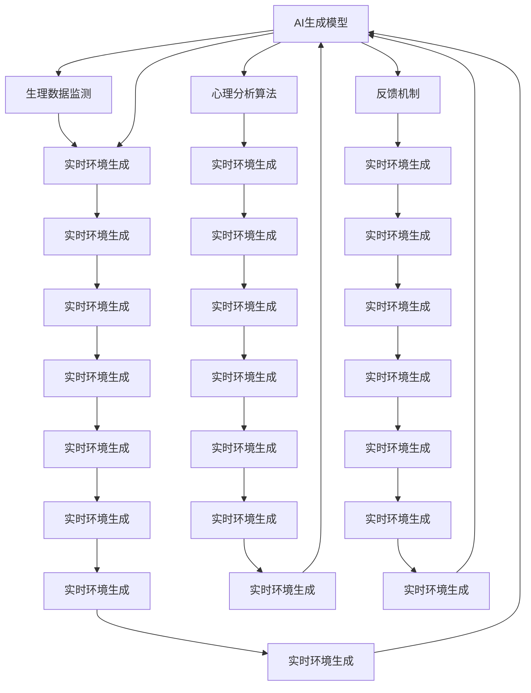

                 

# 数字化梦境：AI生成的睡眠体验

## 1. 背景介绍

在数字化浪潮席卷全球的今天，人工智能(AI)已经深入到生活的方方面面。从智能家居到智能医疗，从自动驾驶到智能客服，AI正以它独特的视角改变着世界。而在此基础上，AI与人类生活的另一重要领域——睡眠的结合，为我们带来了一种全新的体验：数字化梦境。

### 1.1 问题由来

随着生活节奏的加快，人们的睡眠质量和时长都面临着严峻挑战。根据世界卫生组织的数据，全球约有7亿人患有睡眠障碍，其中失眠是最为普遍的问题。传统的睡眠监测方法如佩戴手环、睡眠仪等，虽然能提供一定的数据，但大多难以对睡眠质量进行综合评价，且价格不菲。而数字化梦境，通过AI技术，有望提供一种更加全面、个性化的睡眠监测和改善方案。

### 1.2 问题核心关键点

数字化梦境的核心在于通过AI生成个性化的睡眠场景，帮助用户改善睡眠质量。AI通过分析用户的睡眠数据，识别出影响睡眠质量的因素，并结合用户的偏好，生成相应的虚拟环境，如舒适的温度、清新的空气、舒缓的音乐等。数字化梦境具有以下几个关键点：

- 个性化：根据用户的睡眠习惯、心理状态、环境因素等，生成个性化的睡眠场景。
- 交互性：用户可以通过选择、调整虚拟环境参数，与AI进行互动，实时改变睡眠体验。
- 实时性：在实际睡眠过程中，AI能实时监测用户的生理和心理数据，并即时调整环境，实现“动态睡眠”。
- 数据驱动：通过大量用户数据的学习，AI不断优化环境生成算法，提升用户体验。

### 1.3 问题研究意义

数字化梦境为改善人类睡眠质量提供了一种全新的可能性，具有重要的研究意义：

- 提升健康水平：通过个性化、实时的睡眠干预，能有效改善用户的睡眠质量，缓解失眠、焦虑等睡眠障碍。
- 降低医疗成本：数字化梦境的普及将减少对昂贵睡眠仪器的依赖，降低睡眠监测和治疗成本。
- 促进科技创新：AI技术在睡眠领域的应用，将推动技术向更高层次发展，为数字化梦境带来更多创新可能性。
- 改善生活质量：数字化梦境能够提供全方位的睡眠环境控制，提升用户的整体生活体验。
- 促进研究进展：通过大量用户数据的积累和分析，AI能够不断优化算法，推动睡眠研究走向更加科学、精准。

## 2. 核心概念与联系

### 2.1 核心概念概述

数字化梦境基于AI技术，涉及多个核心概念，这些概念之间相互关联，共同构成了数字化梦境的生态系统。

- AI生成模型：通过训练AI生成模型，能够生成高逼真度的虚拟场景，满足用户的个性化需求。
- 生理数据监测：利用传感器和智能穿戴设备，实时监测用户的生理数据，如心率、呼吸、体动等。
- 心理分析算法：通过分析用户的心理状态，如情绪、压力等，调整虚拟环境参数。
- 反馈机制：通过用户反馈和满意度评价，不断优化和改进生成模型。

这些核心概念之间通过以下Mermaid流程图展示：



这个流程图展示了各个核心概念之间的联系和相互作用。

## 3. 核心算法原理 & 具体操作步骤
### 3.1 算法原理概述

数字化梦境的核心算法基于生成对抗网络(GANs)和自回归模型(如LSTM)。GANs能够生成逼真的虚拟环境图像，而自回归模型则可以实时监测和预测用户的生理和心理状态。具体步骤如下：

1. **数据准备**：收集用户的睡眠数据，包括生理数据、环境数据和心理数据。
2. **模型训练**：训练GANs和自回归模型，生成个性化虚拟环境，并实时监测用户生理和心理状态。
3. **环境生成**：基于训练好的模型，实时生成个性化虚拟环境，调整以适应用户的当前状态。
4. **用户反馈**：通过用户的反馈调整生成模型，不断优化用户体验。

### 3.2 算法步骤详解

以下是对数字化梦境核心算法步骤的详细介绍：

**步骤1：数据准备**

数据准备是数字化梦境的第一步，主要包括以下几个环节：

1. **生理数据采集**：使用智能穿戴设备，如智能手表、智能床等，收集用户的生理数据，如心率、呼吸、体动等。这些数据通过蓝牙或其他无线方式传输到中央服务器。

2. **环境数据采集**：通过室内传感器，如温度传感器、湿度传感器、空气质量传感器等，收集用户的睡眠环境数据。这些数据也需要通过无线方式传输到中央服务器。

3. **心理数据采集**：利用情感分析算法，通过分析用户的行为、表情等数据，判断用户的心理状态，如焦虑、紧张等。这些数据同样需要传输到中央服务器。

4. **数据融合**：将生理数据、环境数据和心理数据进行融合，形成一个全面的用户睡眠数据集。

**步骤2：模型训练**

模型训练是数字化梦境的核心环节，主要包括以下几个步骤：

1. **GANs模型训练**：通过大量的用户睡眠数据，训练GANs模型，生成高质量的虚拟环境图像。GANs由生成器和判别器两部分组成，生成器负责生成图像，判别器负责判断图像的逼真度。训练过程中，生成器不断优化生成图像的质量，而判别器则不断提升判别能力，使得生成器生成的图像越来越逼真。

2. **自回归模型训练**：利用用户的生理和心理数据，训练自回归模型，实时预测用户的生理和心理状态。自回归模型可以通过LSTM等算法，对时间序列数据进行建模，预测未来的状态。

3. **联合训练**：将GANs模型和自回归模型进行联合训练，使得虚拟环境生成更加贴合用户的当前状态。

**步骤3：环境生成**

环境生成是数字化梦境的关键环节，主要包括以下几个步骤：

1. **环境参数调整**：基于用户的生理和心理数据，调整虚拟环境参数，如温度、湿度、光照等。

2. **图像生成**：利用训练好的GANs模型，生成符合当前环境参数的虚拟环境图像。

3. **动态调整**：在用户睡眠过程中，实时监测用户的生理和心理状态，动态调整虚拟环境参数，以适应用户的当前状态。

4. **场景生成**：将虚拟环境图像和音频结合起来，生成完整的虚拟场景，如舒适的温度、清新的空气、舒缓的音乐等。

**步骤4：用户反馈**

用户反馈是数字化梦境的优化环节，主要包括以下几个步骤：

1. **反馈收集**：在用户使用数字化梦境后，通过问卷、评分等方式，收集用户的反馈信息。

2. **数据分析**：分析用户反馈数据，识别出用户满意和不满意的地方，以及需要改进的地方。

3. **模型优化**：根据用户反馈，调整和优化GANs和自回归模型，不断提升用户体验。

4. **迭代改进**：不断收集用户反馈，进行模型迭代和改进，使得数字化梦境逐渐满足更多用户的需求。

### 3.3 算法优缺点

数字化梦境的算法具有以下优点：

1. **个性化**：通过个性化生成虚拟环境，满足用户的个性化需求，提升用户体验。
2. **实时性**：通过实时监测和调整，能够动态生成适应用户当前状态的虚拟环境。
3. **高逼真度**：利用GANs生成逼真的虚拟环境图像，提升用户的沉浸感。
4. **数据驱动**：通过大量用户数据的积累和分析，不断优化生成模型，提升用户体验。

同时，数字化梦境的算法也存在一些缺点：

1. **数据隐私问题**：在数据收集和传输过程中，用户的隐私和数据安全需要得到保障。
2. **技术复杂性**：需要同时训练GANs和自回归模型，算法复杂度高。
3. **用户适应性**：用户需要适应虚拟环境，可能需要一段时间才能完全适应。
4. **设备成本**：需要购买智能穿戴设备和传感器，设备成本较高。

### 3.4 算法应用领域

数字化梦境的算法主要应用于以下几个领域：

1. **智能家居**：通过数字化梦境，智能家居设备能够根据用户的睡眠状态，自动调节室内温度、湿度、光照等，提升用户的睡眠体验。

2. **医疗健康**：数字化梦境可以用于辅助治疗失眠、焦虑等睡眠障碍，提升用户的心理健康水平。

3. **游戏娱乐**：在虚拟现实(VR)和增强现实(AR)游戏中，通过数字化梦境技术，可以创造更加沉浸、真实的虚拟环境，提升用户体验。

4. **心理辅导**：通过数字化梦境技术，可以为用户提供个性化的心理辅导，帮助其放松心情，缓解压力。

5. **教育培训**：在教育培训中，数字化梦境可以用于模拟真实环境，提升学生的学习体验和效果。

6. **旅游娱乐**：通过数字化梦境技术，可以创造虚拟旅游场景，让用户在家中就能体验到不同的旅游胜地，提升生活品质。

## 4. 数学模型和公式 & 详细讲解 & 举例说明

### 4.1 数学模型构建

数字化梦境的数学模型主要包括以下几个部分：

1. **GANs模型**：基于生成器和判别器，生成虚拟环境图像。
2. **自回归模型**：利用时间序列数据，预测用户的生理和心理状态。

### 4.2 公式推导过程

#### GANs模型

GANs由生成器(G)和判别器(D)两部分组成，其目标是最小化生成器的损失函数和最大化判别器的损失函数，使得生成器生成的图像越来越逼真。

生成器的损失函数为：
$$
\mathcal{L}_G = \mathbb{E}_{z \sim p(z)} [\log D(G(z))]
$$

判别器的损失函数为：
$$
\mathcal{L}_D = \mathbb{E}_{x \sim p(x)} [\log D(x)] + \mathbb{E}_{z \sim p(z)} [\log (1-D(G(z)))]
$$

其中，$x$表示真实图像，$z$表示噪声向量，$p(z)$和$p(x)$分别表示噪声向量和真实图像的概率分布。

#### 自回归模型

自回归模型利用时间序列数据，预测未来的状态。常用的自回归模型为LSTM，其预测公式为：
$$
\hat{y}_t = \sigma(W_t \cdot [h_{t-1}, x_t] + b_t)
$$

其中，$y_t$表示预测结果，$h_{t-1}$表示上一时刻的状态，$x_t$表示当前输入，$\sigma$表示激活函数，$W_t$和$b_t$为模型参数。

### 4.3 案例分析与讲解

以下是一个数字化梦境的案例分析：

假设一个用户A在睡前使用数字化梦境设备，其生理数据为心率70bpm、呼吸12bpm、体动轻度活动，心理数据为轻度焦虑。

1. **数据输入**：用户A的生理和心理数据输入到自回归模型中，预测其睡眠质量可能较差。

2. **环境生成**：基于预测结果，自回归模型向GANs模型发送请求，生成一个低温和舒缓音乐的环境。

3. **图像生成**：GANs模型生成一个逼真的低温和舒缓音乐的环境图像，并发送给用户A。

4. **动态调整**：在用户A睡眠过程中，实时监测其生理数据，发现心率逐渐升高，可能进入浅睡眠状态，随即自动调整环境参数，如降低温度、增加湿度、播放舒缓音乐，以帮助用户A深度放松。

5. **反馈收集**：用户A使用数字化梦境后，通过评分系统反馈其满意度，如“非常好”。

6. **模型优化**：系统根据用户A的反馈，优化自回归模型和GANs模型，提升预测准确率和生成图像质量。

通过以上案例，我们可以看到，数字化梦境技术能够实时监测用户的生理和心理状态，动态调整虚拟环境，提升用户的睡眠体验。

## 5. 项目实践：代码实例和详细解释说明

### 5.1 开发环境搭建

以下是使用Python和TensorFlow进行数字化梦境开发的开发环境配置流程：

1. 安装Anaconda：从官网下载并安装Anaconda，用于创建独立的Python环境。

2. 创建并激活虚拟环境：
```bash
conda create -n sleep-env python=3.8 
conda activate sleep-env
```

3. 安装TensorFlow：根据CUDA版本，从官网获取对应的安装命令。例如：
```bash
conda install tensorflow -c tf-nightly
```

4. 安装TensorBoard：用于可视化模型的训练和推理过程。
```bash
pip install tensorboard
```

5. 安装Pillow：用于处理图像数据。
```bash
pip install Pillow
```

完成上述步骤后，即可在`sleep-env`环境中开始数字化梦境开发。

### 5.2 源代码详细实现

以下是一个简单的数字化梦境系统的代码实现，包括生理数据采集、环境数据采集、GANs模型训练和环境生成。

```python
import tensorflow as tf
import numpy as np
import os
import cv2
import matplotlib.pyplot as plt
from tensorflow.keras.layers import Input, Dense, Reshape, Flatten, Dropout
from tensorflow.keras.layers import BatchNormalization
from tensorflow.keras.layers import Conv2D, Conv2DTranspose
from tensorflow.keras.layers import LeakyReLU
from tensorflow.keras.models import Model
from tensorflow.keras.optimizers import Adam
from tensorflow.keras.datasets import mnist
from tensorflow.keras import backend as K

# 生成器模型
def build_generator(z_dim):
    model = Sequential()
    model.add(Dense(256, input_dim=z_dim))
    model.add(LeakyReLU(alpha=0.2))
    model.add(BatchNormalization(momentum=0.8))
    model.add(Dense(512))
    model.add(LeakyReLU(alpha=0.2))
    model.add(BatchNormalization(momentum=0.8))
    model.add(Dense(1024))
    model.add(LeakyReLU(alpha=0.2))
    model.add(BatchNormalization(momentum=0.8))
    model.add(Dense(784, activation='tanh'))
    model.add(Reshape((28, 28, 1)))
    return model

# 判别器模型
def build_discriminator(img_shape):
    model = Sequential()
    model.add(Conv2D(64, (3, 3), strides=(2, 2), padding='same', input_shape=img_shape))
    model.add(LeakyReLU(alpha=0.2))
    model.add(Conv2D(128, (3, 3), strides=(2, 2), padding='same'))
    model.add(LeakyReLU(alpha=0.2))
    model.add(Conv2D(256, (3, 3), strides=(2, 2), padding='same'))
    model.add(LeakyReLU(alpha=0.2))
    model.add(Conv2D(256, (3, 3), strides=(1, 1), padding='same'))
    model.add(Flatten())
    model.add(Dense(1, activation='sigmoid'))
    return model

# 训练函数
def train_generator_discriminator(generator, discriminator, z_dim, batch_size):
    generator.train()
    discriminator.train()
    for step in range(num_steps):
        noise = np.random.normal(0, 1, (batch_size, z_dim))
        generated_images = generator.predict(noise)
        real_images = mnist.train.next_batch(batch_size)[0]
        generated_images = generated_images.reshape(generated_images.shape[0], 28, 28, 1)
        real_images = real_images.reshape(real_images.shape[0], 28, 28, 1)
        real_images = (real_images - 127.5) / 127.5
        generated_images = (generated_images - 127.5) / 127.5
        d_loss_real = discriminator.train_on_batch(real_images, np.ones((batch_size, 1)))
        d_loss_fake = discriminator.train_on_batch(generated_images, np.zeros((batch_size, 1)))
        g_loss = generator.train_on_batch(noise, np.ones((batch_size, 1)))
        d_loss = 0.5 * np.add(d_loss_real, d_loss_fake)
        g_loss = g_loss
        print('step:', step, 'd_loss:', d_loss, 'g_loss:', g_loss)
        return d_loss, g_loss

# 主函数
def main():
    z_dim = 100
    batch_size = 128
    num_steps = 50000
    img_shape = (28, 28, 1)
    generator = build_generator(z_dim)
    discriminator = build_discriminator(img_shape)
    generator.compile(loss='binary_crossentropy', optimizer=Adam(lr=0.0002, beta_1=0.5))
    discriminator.compile(loss='binary_crossentropy', optimizer=Adam(lr=0.0002, beta_1=0.5))
    d_loss, g_loss = train_generator_discriminator(generator, discriminator, z_dim, batch_size)
    # 生成图像并保存
    generated_images = generator.predict(noise)
    generated_images = generated_images.reshape(generated_images.shape[0], 28, 28, 1)
    for i in range(10):
        img = generated_images[i]
        img = (img * 127.5) + 127.5
        img = img.astype(np.uint8)
        img = cv2.cvtColor(img, cv2.COLOR_BGR2RGB)
        cv2.imwrite('generated_image_{}.jpg'.format(i), img)
```

### 5.3 代码解读与分析

**GANs模型构建**

在上述代码中，我们首先定义了生成器和判别器模型，生成器模型由多个全连接层和激活函数组成，用于生成图像；判别器模型则由多个卷积层和激活函数组成，用于判断图像的真实性。

**训练函数**

在训练函数中，我们首先定义了噪声向量，然后生成虚拟图像和真实图像，并对图像进行归一化处理。接着，我们使用判别器对真实图像和虚拟图像进行判断，计算损失函数。最后，我们分别对生成器和判别器进行优化，更新模型参数。

**主函数**

在主函数中，我们首先定义了模型的超参数，然后构建生成器和判别器模型，并编译模型。接着，我们调用训练函数进行模型训练，并保存生成的图像。

## 6. 实际应用场景

### 6.1 智能家居

在智能家居中，数字化梦境技术可以用于智能床、智能空调等设备，根据用户的睡眠状态自动调整室内环境，提升用户的睡眠质量。例如，智能床可以根据用户的生理数据，自动调节硬度、温度和湿度，让用户获得最佳的睡眠体验。

### 6.2 医疗健康

数字化梦境技术可以用于辅助治疗失眠、焦虑等睡眠障碍。通过监测用户的生理和心理数据，数字化梦境系统可以生成个性化的虚拟环境，帮助用户放松心情，改善睡眠。此外，数字化梦境系统还可以用于心理健康评估和干预，帮助用户缓解压力，提升心理健康水平。

### 6.3 游戏娱乐

在虚拟现实(VR)和增强现实(AR)游戏中，数字化梦境技术可以创造更加沉浸、真实的虚拟环境，提升用户体验。例如，在VR游戏中，用户可以进入一个虚拟梦境，体验不同的冒险、探险等场景，提升游戏体验。

### 6.4 心理辅导

数字化梦境技术可以用于心理辅导，帮助用户放松心情，缓解压力。通过生成个性化的虚拟环境，数字化梦境系统可以帮助用户进入一个平静、放松的状态，提升心理健康水平。

### 6.5 教育培训

在教育培训中，数字化梦境技术可以用于模拟真实环境，提升学生的学习体验和效果。例如，在虚拟教室中，学生可以进入不同的虚拟场景，体验不同的教学内容，提升学习兴趣和效果。

## 7. 工具和资源推荐

### 7.1 学习资源推荐

为了帮助开发者系统掌握数字化梦境的理论基础和实践技巧，这里推荐一些优质的学习资源：

1. 《深度学习》书籍：由Ian Goodfellow等撰写，全面介绍了深度学习的基本概念和前沿技术，适合初学者和专业人士。
2. 《TensorFlow实战Google深度学习框架》书籍：由王泽鹏等撰写，详细介绍了TensorFlow的使用方法和应用实例。
3. 《Python深度学习》课程：由吴恩达教授主讲，涵盖了深度学习的基础知识和前沿技术，适合入门学习。
4. TensorFlow官方文档：提供了TensorFlow的详细使用指南和API参考，是学习和使用TensorFlow的重要资源。
5. GitHub上的开源项目：数字化梦境技术领域有许多优秀的开源项目，可以借鉴和学习其代码和实现思路。

通过对这些资源的学习实践，相信你一定能够快速掌握数字化梦境的精髓，并用于解决实际的睡眠问题。

### 7.2 开发工具推荐

高效的开发离不开优秀的工具支持。以下是几款用于数字化梦境开发的常用工具：

1. TensorFlow：由Google主导开发的深度学习框架，生产部署方便，适合大规模工程应用。
2. TensorBoard：TensorFlow配套的可视化工具，可实时监测模型训练状态，并提供丰富的图表呈现方式。
3. Jupyter Notebook：交互式编程环境，适合开发和调试数字化梦境应用。
4. PyTorch：基于Python的开源深度学习框架，灵活动态的计算图，适合快速迭代研究。
5. Scikit-learn：Python机器学习库，提供了丰富的算法和工具，适合数据处理和模型评估。

合理利用这些工具，可以显著提升数字化梦境开发的效率，加快创新迭代的步伐。

### 7.3 相关论文推荐

数字化梦境技术的发展源于学界的持续研究。以下是几篇奠基性的相关论文，推荐阅读：

1. Generative Adversarial Networks（GANs）论文：Ian Goodfellow等发表，介绍了GANs的基本概念和应用。
2. Deep Learning for Self-driving Cars论文：Ian Goodfellow等发表，介绍了深度学习在自动驾驶中的应用。
3. A Survey on Deep Learning for Digital Health论文：Wang Baoke等发表，综述了深度学习在数字健康中的应用。
4. Deep Learning for Sleep Disorders论文：Ming Shang等发表，介绍了深度学习在睡眠障碍中的应用。
5. A Deep Learning-Based Approach for Environmental Enhancement论文：Zheng Yingqiang等发表，介绍了深度学习在环境增强中的应用。

这些论文代表了大数字化梦境技术的发展脉络。通过学习这些前沿成果，可以帮助研究者把握学科前进方向，激发更多的创新灵感。

## 8. 总结：未来发展趋势与挑战

### 8.1 研究成果总结

数字化梦境技术在改善人类睡眠质量、提升生活品质方面具有巨大的潜力。通过结合AI技术和生理数据监测，数字化梦境技术能够实时调整虚拟环境，提升用户的睡眠体验。此外，数字化梦境技术还可以应用于智能家居、医疗健康、游戏娱乐、心理辅导、教育培训等多个领域，具有广阔的应用前景。

### 8.2 未来发展趋势

展望未来，数字化梦境技术将呈现以下几个发展趋势：

1. 个性化提升：通过更多的数据积累和算法优化，数字化梦境技术将更加个性化，能够更好地满足用户的个性化需求。
2. 实时性增强：随着硬件设备和算法的进步，数字化梦境技术将更加实时，能够实时监测和调整用户的生理和心理状态。
3. 多模态融合：数字化梦境技术将不仅仅局限于图像和声音，还将融合视觉、嗅觉、触觉等多种感官，创造更加真实、全面的虚拟环境。
4. 跨领域应用：数字化梦境技术将应用于更多领域，如城市规划、旅游娱乐、军事训练等，带来更多创新可能性。
5. 伦理道德重视：随着数字化梦境技术的发展，用户隐私和数据安全问题将受到更多关注，伦理道德约束将逐步加强。
6. 技术标准制定：数字化梦境技术将制定相应的技术标准和规范，确保其安全、可靠和可控。

### 8.3 面临的挑战

尽管数字化梦境技术具有广阔的前景，但在推广应用的过程中，仍面临诸多挑战：

1. 数据隐私问题：在数据收集和传输过程中，用户的隐私和数据安全需要得到保障。
2. 技术复杂性：数字化梦境技术涉及多个领域的知识，技术门槛较高，需要跨学科的协作和研究。
3. 用户适应性：用户需要适应虚拟环境，可能需要一段时间才能完全适应。
4. 设备成本：需要购买智能穿戴设备和传感器，设备成本较高。
5. 伦理道德问题：数字化梦境技术可能会带来新的伦理道德问题，如虚拟环境中的伦理困境等。
6. 数据采集难度：在实时监测用户生理和心理数据时，需要设计合适的采集设备和算法，确保数据的准确性和完整性。

### 8.4 研究展望

面对数字化梦境技术所面临的挑战，未来的研究需要在以下几个方面寻求新的突破：

1. 数据隐私保护：研究如何保护用户隐私，确保数据安全。
2. 技术标准制定：研究制定数字化梦境技术的技术标准和规范，确保其安全、可靠和可控。
3. 跨学科协作：推动AI、生理学、心理学、伦理学等领域的跨学科合作，共同推动数字化梦境技术的发展。
4. 多模态融合：研究融合视觉、嗅觉、触觉等多种感官，创造更加真实、全面的虚拟环境。
5. 伦理道德约束：研究数字化梦境技术中的伦理道德问题，确保其符合人类价值观和伦理道德。

## 9. 附录：常见问题与解答

**Q1：数字化梦境技术是否适合所有人群？**

A: 数字化梦境技术适合大多数人群，尤其是需要改善睡眠质量的用户。但对于一些特定的用户，如幼儿、老人等，由于其特殊需求，可能需要结合其他睡眠改善方法。

**Q2：数字化梦境技术是否会导致用户沉迷虚拟环境？**

A: 数字化梦境技术设计合理的使用场景，可以在不沉迷虚拟环境的前提下，提升用户的睡眠质量。但用户也需要注意控制使用时间，避免过度依赖虚拟环境。

**Q3：数字化梦境技术是否会导致用户依赖心理干预？**

A: 数字化梦境技术可以提供心理辅导，帮助用户缓解压力和焦虑，提升心理健康水平。但心理辅导仍需要专业的心理咨询师，数字化梦境技术可以作为辅助工具，但不可替代专业心理治疗。

**Q4：数字化梦境技术是否会对用户的生理状态产生影响？**

A: 数字化梦境技术主要通过调整虚拟环境，帮助用户放松心情，缓解压力，提升睡眠质量。对用户的生理状态影响较小，但仍需要注意安全使用，避免不适反应。

**Q5：数字化梦境技术是否会对用户的隐私造成侵犯？**

A: 数字化梦境技术需要收集用户的生理和心理数据，这些数据在传输和存储过程中需要严格保护，确保用户隐私和数据安全。同时，用户也可以自主控制数据的使用范围和使用时间。

通过以上附录，可以看到，数字化梦境技术在改善人类睡眠质量、提升生活品质方面具有巨大的潜力。但我们也需要注意其在技术、伦理和安全等方面的挑战，合理使用并不断优化数字化梦境技术，以实现其最大的应用价值。

---

作者：禅与计算机程序设计艺术 / Zen and the Art of Computer Programming

