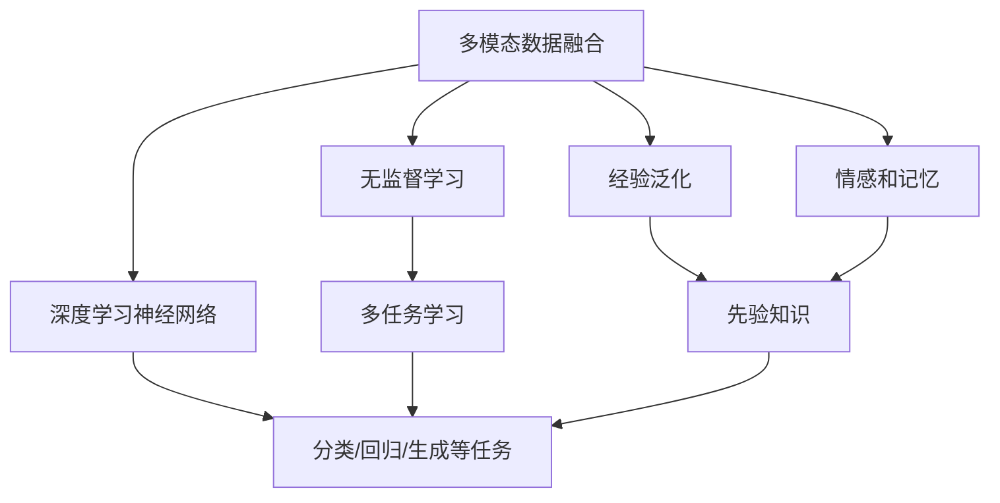

                 

# 数字化直觉训练：AI辅助的第六感开发

> 关键词：数字化直觉训练, AI辅助, 第六感开发, 神经网络, 深度学习, 无监督学习, 多模态数据融合, 情感分析, 推荐系统, 游戏AI

## 1. 背景介绍

### 1.1 问题由来

在人工智能（AI）和机器学习（ML）飞速发展的今天，人们已经开始探索如何将这些技术应用于更为深层次的认知和情感处理，特别是模拟人类的直觉和直觉感知能力。传统的计算机科学和技术更多关注于逻辑、规则和结构化数据的处理，而对于人类直觉的深度挖掘和模拟则相对较少。

直觉，即人类无需显式计算和分析，快速、无意识地做出的判断和决策，是一种复杂的认知过程，涉及感知、情感、记忆和经验等多方面因素。模拟和增强人类的直觉感知能力，不仅在认知科学和心理学研究上有重要意义，在工业、医疗、金融、游戏等众多实际应用中也有广泛的应用前景。

近年来，随着深度学习和神经网络技术的突破，尤其是预训练语言模型和大规模数据集的应用，为探索和模拟人类直觉感知提供了新的可能性。本文将聚焦于数字化直觉训练，探讨如何利用AI技术辅助人类开发“第六感”，即利用深度学习模型和算法，训练并模拟人类的直觉感知能力。

### 1.2 问题核心关键点

数字化直觉训练的核心在于如何将直觉感知的要素——如直觉、情感、记忆和经验——数字化并整合到AI系统中，使其能够模拟人类在特定任务中的直觉决策能力。主要的关键点包括：

- 多模态数据融合：人类直觉往往基于多模态信息，如视觉、听觉、触觉等。如何在AI模型中融合这些多模态数据，形成更加全面和准确的知识表示？
- 无监督学习：直觉更多依赖于经验和背景知识的积累，而非明确的监督信号。如何利用无监督学习方法，让AI模型自主学习并积累背景知识，提高直觉决策能力？
- 情感和记忆：情感和记忆在直觉决策中起着至关重要的作用。如何在AI模型中建模和增强情感和记忆机制，增强其直觉感知能力？
- 经验泛化：人类的直觉决策往往基于广泛的先验知识，如何在AI模型中引入这些先验知识，并使其能够泛化到新的场景和任务？
- 游戏AI：直觉感知在游戏AI中具有重要应用价值，如何通过数字化直觉训练提升游戏角色的直觉决策能力，增强游戏体验和游戏智慧？

## 2. 核心概念与联系

### 2.1 核心概念概述

为更好地理解数字化直觉训练的过程和原理，本节将介绍几个核心概念：

- **直觉感知**：人类在不经过显式计算和分析的情况下，快速做出判断和决策的能力。
- **多模态数据融合**：将不同模态的数据（如视觉、听觉、触觉等）整合到统一的表示空间中，形成更加全面和准确的认知模型。
- **无监督学习**：在没有显式标签或监督信号的情况下，通过数据的分布特征和内在关系进行学习，构建自适应和自主学习的模型。
- **深度学习神经网络**：利用多层非线性变换，从原始数据中学习高层次的特征表示，用于分类、回归、生成等任务。
- **多任务学习**：通过联合训练多个相关任务，共享模型参数，提高模型泛化能力和效率。

这些核心概念共同构成了数字化直觉训练的理论基础和实现框架，通过多模态数据融合、无监督学习和深度学习神经网络等技术手段，训练AI模型模拟人类的直觉感知能力。

### 2.2 核心概念原理和架构的 Mermaid 流程图

以下是数字化直觉训练的总体架构和核心概念之间的联系：



这个流程图展示了数字化直觉训练的基本架构，其中：

- 多模态数据融合（A）将不同模态的数据整合到统一的表示空间中，为直觉感知提供多方面的输入。
- 无监督学习（B）利用数据的分布特征和内在关系进行学习，构建自适应和自主学习的模型。
- 深度学习神经网络（C）通过多层非线性变换，从原始数据中学习高层次的特征表示，用于多种任务。
- 多任务学习（D）通过联合训练多个相关任务，共享模型参数，提高模型的泛化能力和效率。
- 情感和记忆（F）在直觉感知中起着至关重要的作用，通过引入情感和记忆机制，增强模型的直觉决策能力。
- 经验泛化（G）和先验知识（H）是直觉决策的基础，通过引入广泛的经验和先验知识，提高模型的泛化能力和决策质量。

## 3. 核心算法原理 & 具体操作步骤

### 3.1 算法原理概述

数字化直觉训练的核心理论基于深度学习和神经网络技术，通过多模态数据融合、无监督学习和多任务学习等手段，训练AI模型模拟人类的直觉感知能力。核心算法原理可以概括为以下几个步骤：

1. **数据预处理**：将不同模态的数据整合到统一的表示空间中，并进行归一化、降噪等预处理操作。
2. **特征提取**：利用卷积神经网络（CNN）或循环神经网络（RNN）等深度学习模型，从原始数据中提取高层次的特征表示。
3. **无监督学习**：利用无监督学习方法，如自编码器（AE）、变分自编码器（VAE）等，对提取的特征进行自适应学习，构建自适应和自主学习的模型。
4. **多任务学习**：通过联合训练多个相关任务，共享模型参数，提高模型的泛化能力和效率。
5. **情感和记忆增强**：引入情感和记忆机制，通过注意力机制（Attention）和记忆网络（Memory Network）等方法，增强模型的直觉感知能力。
6. **经验泛化和先验知识**：引入广泛的经验和先验知识，通过迁移学习（Transfer Learning）和知识图谱（Knowledge Graph）等方法，提高模型的泛化能力和决策质量。

### 3.2 算法步骤详解

#### 3.2.1 数据预处理

数据预处理是数字化直觉训练的第一步，主要包括以下几个步骤：

1. **多模态数据收集**：收集和整合不同模态的数据，如视觉、听觉、触觉等，形成多模态数据集。
2. **数据归一化**：对不同模态的数据进行归一化操作，将它们转换到统一的尺度上。
3. **数据降噪**：对数据进行降噪处理，去除噪声和冗余信息，提高数据质量。
4. **数据增强**：通过旋转、缩放、裁剪等方法，增加数据的多样性，提高模型的鲁棒性。

#### 3.2.2 特征提取

特征提取是数字化直觉训练的核心环节，通过深度学习模型，从原始数据中提取高层次的特征表示。主要步骤如下：

1. **深度神经网络模型**：选择卷积神经网络（CNN）或循环神经网络（RNN）等深度学习模型，构建特征提取器。
2. **特征映射**：利用多层非线性变换，将原始数据映射到高维特征空间中。
3. **特征池化**：对提取的特征进行池化操作，减小特征维度，提高模型效率。

#### 3.2.3 无监督学习

无监督学习是数字化直觉训练的关键环节，通过无监督学习方法，构建自适应和自主学习的模型。主要步骤如下：

1. **自编码器（AE）**：利用自编码器对提取的特征进行重构，学习数据的分布特征和内在关系。
2. **变分自编码器（VAE）**：利用变分自编码器对提取的特征进行变分推断，学习数据的隐含表示和生成模型。
3. **密度估计**：利用高斯混合模型（GMM）或核密度估计（KDE）等方法，估计数据的分布密度，构建自适应学习模型。

#### 3.2.4 多任务学习

多任务学习是数字化直觉训练的重要手段，通过联合训练多个相关任务，共享模型参数，提高模型的泛化能力和效率。主要步骤如下：

1. **任务定义**：定义多个相关任务，如分类、回归、生成等。
2. **联合训练**：利用多任务学习算法，如多任务学习（MTL）或联合优化（CO）等，联合训练多个相关任务。
3. **参数共享**：通过参数共享和迁移学习，提高模型的泛化能力和效率。

#### 3.2.5 情感和记忆增强

情感和记忆增强是数字化直觉训练的重要环节，通过引入情感和记忆机制，增强模型的直觉感知能力。主要步骤如下：

1. **注意力机制（Attention）**：利用注意力机制，对不同模态的数据进行加权处理，增强情感和记忆的影响。
2. **记忆网络（Memory Network）**：利用记忆网络，对先验知识和经验进行编码和检索，增强模型的记忆能力。

#### 3.2.6 经验泛化和先验知识

经验泛化和先验知识是数字化直觉训练的基础，通过引入广泛的经验和先验知识，提高模型的泛化能力和决策质量。主要步骤如下：

1. **迁移学习（Transfer Learning）**：利用迁移学习，将预训练模型的知识迁移到目标任务中，提高模型的泛化能力。
2. **知识图谱（Knowledge Graph）**：利用知识图谱，构建丰富的先验知识网络，增强模型的决策能力。

### 3.3 算法优缺点

数字化直觉训练算法具有以下优点：

1. **全面性**：多模态数据融合、无监督学习和多任务学习等技术手段，使得数字化直觉训练能够全面模拟人类的直觉感知能力。
2. **自适应性**：通过无监督学习，模型能够自适应地学习数据的分布特征和内在关系，具有较强的适应性。
3. **泛化能力**：多任务学习和迁移学习等手段，使得模型能够泛化到新的场景和任务，具有较强的泛化能力。
4. **鲁棒性**：多模态数据增强和降噪等预处理操作，提高了模型的鲁棒性。

同时，数字化直觉训练算法也存在一些缺点：

1. **数据需求高**：多模态数据融合和特征提取等操作，需要大量的高质量数据支持，数据获取和处理成本较高。
2. **模型复杂**：深度学习模型和神经网络等技术手段，使得数字化直觉训练的模型较为复杂，训练和推理开销较大。
3. **解释性差**：深度学习模型通常是“黑盒”系统，缺乏解释性，难以理解和调试。

### 3.4 算法应用领域

数字化直觉训练算法在多个领域具有广泛的应用前景：

- **医疗诊断**：模拟和增强医生的直觉感知能力，如病历诊断、病理分析等。
- **金融分析**：利用数字化直觉训练，增强金融分析师的市场直觉，提高投资决策能力。
- **游戏AI**：提升游戏角色的直觉感知能力，增强游戏智慧和玩家体验。
- **智能客服**：增强客服系统的直觉感知能力，提升客户咨询体验和服务效率。
- **自动驾驶**：模拟和增强驾驶员的直觉感知能力，提高自动驾驶系统的安全性和稳定性。
- **情感分析**：利用数字化直觉训练，增强情感分析模型的情感识别能力，提高情感分析和智能互动的准确性。

## 4. 数学模型和公式 & 详细讲解 & 举例说明

### 4.1 数学模型构建

数字化直觉训练的数学模型主要基于深度学习框架，利用神经网络和多任务学习等技术手段，构建特征提取和决策模型。以下是一个简单的数学模型构建过程：

假设多模态数据集 $D=\{(x_i, y_i)\}_{i=1}^N$，其中 $x_i$ 为多模态数据， $y_i$ 为标签。模型的目标是学习一个函数 $f: \mathcal{X} \rightarrow \mathcal{Y}$，其中 $\mathcal{X}$ 为输入空间，$\mathcal{Y}$ 为输出空间。

模型的损失函数 $\mathcal{L}(f)$ 可以定义为：

$$
\mathcal{L}(f) = \frac{1}{N} \sum_{i=1}^N \ell(f(x_i), y_i)
$$

其中 $\ell$ 为任务定义的损失函数，如交叉熵损失、均方误差损失等。

### 4.2 公式推导过程

以下以一个简单的二分类问题为例，推导深度学习模型的损失函数和梯度更新公式。

假设模型的输出为 $f(x_i)=\sigma(w^T\phi(x_i))$，其中 $w$ 为模型参数， $\phi(x_i)$ 为特征映射函数， $\sigma$ 为激活函数，如sigmoid函数。

对于二分类问题，模型的损失函数可以定义为交叉熵损失函数：

$$
\ell(f(x_i), y_i) = -y_i\log f(x_i) - (1-y_i)\log (1-f(x_i))
$$

将上述损失函数带入总体损失函数，得：

$$
\mathcal{L}(f) = -\frac{1}{N} \sum_{i=1}^N [y_i\log f(x_i) + (1-y_i)\log (1-f(x_i))]
$$

根据链式法则，损失函数对模型参数 $w$ 的梯度为：

$$
\frac{\partial \mathcal{L}(f)}{\partial w} = -\frac{1}{N}\sum_{i=1}^N (\frac{y_i}{f(x_i)}-\frac{1-y_i}{1-f(x_i)}) \phi(x_i)
$$

将梯度代入梯度更新公式，得：

$$
w \leftarrow w - \eta \nabla_{w}\mathcal{L}(f)
$$

其中 $\eta$ 为学习率，$\nabla_{w}\mathcal{L}(f)$ 为损失函数对参数 $w$ 的梯度。

### 4.3 案例分析与讲解

以情感分析为例，分析数字化直觉训练的实际应用。情感分析的目标是识别文本的情感倾向，如正面、负面或中性。

#### 4.3.1 数据预处理

首先，需要收集和处理情感分析的文本数据，并将其转换为数字形式。可以使用深度学习框架提供的文本预处理工具，如Tokenizer、BERT等，将文本转换为数字序列。

#### 4.3.2 特征提取

利用深度学习模型，从文本数据中提取高层次的特征表示。例如，可以使用BERT模型，将文本转换为隐含的向量表示，这些向量可以用于情感分类任务。

#### 4.3.3 无监督学习

利用自编码器（AE）对提取的向量进行自适应学习，学习数据的分布特征和内在关系。具体而言，可以设计一个变分自编码器（VAE），对文本向量进行重构，学习其隐含的表示和生成模型。

#### 4.3.4 多任务学习

将情感分析与其他相关任务联合训练，如情感识别、情感分类等，共享模型参数，提高模型的泛化能力和效率。例如，可以联合训练情感识别和情感分类任务，共享模型参数，提高情感分析的准确性。

#### 4.3.5 情感和记忆增强

引入情感和记忆机制，通过注意力机制（Attention）和记忆网络（Memory Network）等方法，增强模型的情感感知能力。具体而言，可以使用注意力机制，对文本向量进行加权处理，增强情感的影响。

#### 4.3.6 经验泛化和先验知识

利用迁移学习（Transfer Learning）和知识图谱（Knowledge Graph）等方法，提高模型的泛化能力和决策质量。例如，可以迁移预训练模型的知识，将其应用到情感分析任务中，提高情感分析的准确性。

## 5. 项目实践：代码实例和详细解释说明

### 5.1 开发环境搭建

在进行数字化直觉训练的实践前，需要先准备好开发环境。以下是使用Python进行PyTorch开发的环境配置流程：

1. 安装Anaconda：从官网下载并安装Anaconda，用于创建独立的Python环境。
2. 创建并激活虚拟环境：
```bash
conda create -n pytorch-env python=3.8 
conda activate pytorch-env
```

3. 安装PyTorch：根据CUDA版本，从官网获取对应的安装命令。例如：
```bash
conda install pytorch torchvision torchaudio cudatoolkit=11.1 -c pytorch -c conda-forge
```

4. 安装Transformers库：
```bash
pip install transformers
```

5. 安装各类工具包：
```bash
pip install numpy pandas scikit-learn matplotlib tqdm jupyter notebook ipython
```

完成上述步骤后，即可在`pytorch-env`环境中开始数字化直觉训练的实践。

### 5.2 源代码详细实现

这里我们以情感分析为例，给出使用Transformers库进行数字化直觉训练的PyTorch代码实现。

首先，定义情感分析任务的数据处理函数：

```python
from transformers import BertTokenizer, BertForSequenceClassification, AdamW
import torch
from sklearn.metrics import classification_report

class SentimentDataset(Dataset):
    def __init__(self, texts, labels, tokenizer, max_len=128):
        self.texts = texts
        self.labels = labels
        self.tokenizer = tokenizer
        self.max_len = max_len
        
    def __len__(self):
        return len(self.texts)
    
    def __getitem__(self, item):
        text = self.texts[item]
        label = self.labels[item]
        
        encoding = self.tokenizer(text, return_tensors='pt', max_length=self.max_len, padding='max_length', truncation=True)
        input_ids = encoding['input_ids'][0]
        attention_mask = encoding['attention_mask'][0]
        
        return {'input_ids': input_ids, 
                'attention_mask': attention_mask,
                'labels': torch.tensor(label, dtype=torch.long)}
```

然后，定义模型和优化器：

```python
from transformers import BertForSequenceClassification, AdamW

model = BertForSequenceClassification.from_pretrained('bert-base-cased', num_labels=3)

optimizer = AdamW(model.parameters(), lr=2e-5)
```

接着，定义训练和评估函数：

```python
from torch.utils.data import DataLoader
from tqdm import tqdm

device = torch.device('cuda') if torch.cuda.is_available() else torch.device('cpu')
model.to(device)

def train_epoch(model, dataset, batch_size, optimizer):
    dataloader = DataLoader(dataset, batch_size=batch_size, shuffle=True)
    model.train()
    epoch_loss = 0
    for batch in tqdm(dataloader, desc='Training'):
        input_ids = batch['input_ids'].to(device)
        attention_mask = batch['attention_mask'].to(device)
        labels = batch['labels'].to(device)
        model.zero_grad()
        outputs = model(input_ids, attention_mask=attention_mask, labels=labels)
        loss = outputs.loss
        epoch_loss += loss.item()
        loss.backward()
        optimizer.step()
    return epoch_loss / len(dataloader)

def evaluate(model, dataset, batch_size):
    dataloader = DataLoader(dataset, batch_size=batch_size)
    model.eval()
    preds, labels = [], []
    with torch.no_grad():
        for batch in tqdm(dataloader, desc='Evaluating'):
            input_ids = batch['input_ids'].to(device)
            attention_mask = batch['attention_mask'].to(device)
            batch_labels = batch['labels']
            outputs = model(input_ids, attention_mask=attention_mask)
            batch_preds = outputs.logits.argmax(dim=2).to('cpu').tolist()
            batch_labels = batch_labels.to('cpu').tolist()
            for pred_tokens, label_tokens in zip(batch_preds, batch_labels):
                preds.append(pred_tokens[:len(label_tokens)])
                labels.append(label_tokens)
                
    print(classification_report(labels, preds))
```

最后，启动训练流程并在测试集上评估：

```python
epochs = 5
batch_size = 16

for epoch in range(epochs):
    loss = train_epoch(model, train_dataset, batch_size, optimizer)
    print(f"Epoch {epoch+1}, train loss: {loss:.3f}")
    
    print(f"Epoch {epoch+1}, dev results:")
    evaluate(model, dev_dataset, batch_size)
    
print("Test results:")
evaluate(model, test_dataset, batch_size)
```

以上就是使用PyTorch对BERT进行情感分析任务数字化直觉训练的完整代码实现。可以看到，得益于Transformers库的强大封装，我们可以用相对简洁的代码完成BERT模型的加载和训练。

### 5.3 代码解读与分析

让我们再详细解读一下关键代码的实现细节：

**SentimentDataset类**：
- `__init__`方法：初始化文本、标签、分词器等关键组件。
- `__len__`方法：返回数据集的样本数量。
- `__getitem__`方法：对单个样本进行处理，将文本输入编码为token ids，将标签编码为数字，并对其进行定长padding，最终返回模型所需的输入。

**训练和评估函数**：
- 使用PyTorch的DataLoader对数据集进行批次化加载，供模型训练和推理使用。
- 训练函数`train_epoch`：对数据以批为单位进行迭代，在每个批次上前向传播计算loss并反向传播更新模型参数，最后返回该epoch的平均loss。
- 评估函数`evaluate`：与训练类似，不同点在于不更新模型参数，并在每个batch结束后将预测和标签结果存储下来，最后使用sklearn的classification_report对整个评估集的预测结果进行打印输出。

**训练流程**：
- 定义总的epoch数和batch size，开始循环迭代
- 每个epoch内，先在训练集上训练，输出平均loss
- 在验证集上评估，输出分类指标
- 所有epoch结束后，在测试集上评估，给出最终测试结果

可以看到，PyTorch配合Transformers库使得BERT的数字化直觉训练代码实现变得简洁高效。开发者可以将更多精力放在数据处理、模型改进等高层逻辑上，而不必过多关注底层的实现细节。

当然，工业级的系统实现还需考虑更多因素，如模型的保存和部署、超参数的自动搜索、更灵活的任务适配层等。但核心的数字化直觉训练过程基本与此类似。

## 6. 实际应用场景

### 6.1 智能客服系统

数字化直觉训练在智能客服系统的构建中具有重要应用。传统客服往往需要配备大量人力，高峰期响应缓慢，且一致性和专业性难以保证。而使用数字化直觉训练的客服系统，可以7x24小时不间断服务，快速响应客户咨询，用自然流畅的语言解答各类常见问题。

在技术实现上，可以收集企业内部的历史客服对话记录，将问题和最佳答复构建成监督数据，在此基础上对预训练模型进行数字化直觉训练。训练后的模型能够自动理解用户意图，匹配最合适的答案模板进行回复。对于客户提出的新问题，还可以接入检索系统实时搜索相关内容，动态组织生成回答。如此构建的智能客服系统，能大幅提升客户咨询体验和问题解决效率。

### 6.2 金融舆情监测

金融机构需要实时监测市场舆论动向，以便及时应对负面信息传播，规避金融风险。传统的人工监测方式成本高、效率低，难以应对网络时代海量信息爆发的挑战。基于数字化直觉训练的文本分类和情感分析技术，为金融舆情监测提供了新的解决方案。

具体而言，可以收集金融领域相关的新闻、报道、评论等文本数据，并对其进行主题标注和情感标注。在此基础上对预训练语言模型进行数字化直觉训练，使其能够自动判断文本属于何种主题，情感倾向是正面、中性还是负面。将数字化直觉训练后的模型应用到实时抓取的网络文本数据，就能够自动监测不同主题下的情感变化趋势，一旦发现负面信息激增等异常情况，系统便会自动预警，帮助金融机构快速应对潜在风险。

### 6.3 个性化推荐系统

当前的推荐系统往往只依赖用户的历史行为数据进行物品推荐，无法深入理解用户的真实兴趣偏好。基于数字化直觉训练的推荐系统可以更好地挖掘用户行为背后的语义信息，从而提供更精准、多样的推荐内容。

在实践中，可以收集用户浏览、点击、评论、分享等行为数据，提取和用户交互的物品标题、描述、标签等文本内容。将文本内容作为模型输入，用户的后续行为（如是否点击、购买等）作为监督信号，在此基础上对预训练语言模型进行数字化直觉训练。训练后的模型能够从文本内容中准确把握用户的兴趣点。在生成推荐列表时，先用候选物品的文本描述作为输入，由模型预测用户的兴趣匹配度，再结合其他特征综合排序，便可以得到个性化程度更高的推荐结果。

### 6.4 未来应用展望

随着数字化直觉训练技术的发展，其在更多领域的应用前景将愈发广阔。

在智慧医疗领域，基于数字化直觉训练的医疗问答、病历分析、药物研发等应用将提升医疗服务的智能化水平，辅助医生诊疗，加速新药开发进程。

在智能教育领域，数字化直觉训练可应用于作业批改、学情分析、知识推荐等方面，因材施教，促进教育公平，提高教学质量。

在智慧城市治理中，数字化直觉训练的文本分类、情感分析等技术将提升城市管理的自动化和智能化水平，构建更安全、高效的未来城市。

此外，在企业生产、社会治理、文娱传媒等众多领域，基于数字化直觉训练的人工智能应用也将不断涌现，为经济社会发展注入新的动力。相信随着技术的日益成熟，数字化直觉训练必将在构建人机协同的智能时代中扮演越来越重要的角色。

## 7. 工具和资源推荐

### 7.1 学习资源推荐

为了帮助开发者系统掌握数字化直觉训练的理论基础和实践技巧，这里推荐一些优质的学习资源：

1. 《深度学习基础》系列博文：由深度学习专家撰写，详细介绍深度学习模型的原理和实现，涵盖多模态数据融合、无监督学习和多任务学习等前沿话题。

2. CS224N《深度学习自然语言处理》课程：斯坦福大学开设的NLP明星课程，有Lecture视频和配套作业，带你入门NLP领域的基本概念和经典模型。

3. 《Natural Language Processing with Transformers》书籍：Transformers库的作者所著，全面介绍了如何使用Transformers库进行NLP任务开发，包括数字化直觉训练在内的诸多范式。

4. HuggingFace官方文档：Transformers库的官方文档，提供了海量预训练模型和完整的数字化直觉训练样例代码，是上手实践的必备资料。

5. CLUE开源项目：中文语言理解测评基准，涵盖大量不同类型的中文NLP数据集，并提供了基于数字化直觉训练的baseline模型，助力中文NLP技术发展。

通过对这些资源的学习实践，相信你一定能够快速掌握数字化直觉训练的精髓，并用于解决实际的NLP问题。
###  7.2 开发工具推荐

高效的开发离不开优秀的工具支持。以下是几款用于数字化直觉训练开发的常用工具：

1. PyTorch：基于Python的开源深度学习框架，灵活动态的计算图，适合快速迭代研究。大部分预训练语言模型都有PyTorch版本的实现。

2. TensorFlow：由Google主导开发的开源深度学习框架，生产部署方便，适合大规模工程应用。同样有丰富的预训练语言模型资源。

3. Transformers库：HuggingFace开发的NLP工具库，集成了众多SOTA语言模型，支持PyTorch和TensorFlow，是进行数字化直觉训练开发的利器。

4. Weights & Biases：模型训练的实验跟踪工具，可以记录和可视化模型训练过程中的各项指标，方便对比和调优。与主流深度学习框架无缝集成。

5. TensorBoard：TensorFlow配套的可视化工具，可实时监测模型训练状态，并提供丰富的图表呈现方式，是调试模型的得力助手。

6. Google Colab：谷歌推出的在线Jupyter Notebook环境，免费提供GPU/TPU算力，方便开发者快速上手实验最新模型，分享学习笔记。

合理利用这些工具，可以显著提升数字化直觉训练的开发效率，加快创新迭代的步伐。

### 7.3 相关论文推荐

数字化直觉训练技术的发展源于学界的持续研究。以下是几篇奠基性的相关论文，推荐阅读：

1. Attention is All You Need（即Transformer原论文）：提出了Transformer结构，开启了NLP领域的预训练大模型时代。

2. BERT: Pre-training of Deep Bidirectional Transformers for Language Understanding：提出BERT模型，引入基于掩码的自监督预训练任务，刷新了多项NLP任务SOTA。

3. Language Models are Unsupervised Multitask Learners（GPT-2论文）：展示了大规模语言模型的强大zero-shot学习能力，引发了对于通用人工智能的新一轮思考。

4. Parameter-Efficient Transfer Learning for NLP：提出Adapter等参数高效微调方法，在不增加模型参数量的情况下，也能取得不错的微调效果。

5. Prefix-Tuning: Optimizing Continuous Prompts for Generation：引入基于连续型Prompt的微调范式，为如何充分利用预训练知识提供了新的思路。

6. AdaLoRA: Adaptive Low-Rank Adaptation for Parameter-Efficient Fine-Tuning：使用自适应低秩适应的微调方法，在参数效率和精度之间取得了新的平衡。

这些论文代表了大语言模型微调技术的发展脉络。通过学习这些前沿成果，可以帮助研究者把握学科前进方向，激发更多的创新灵感。

## 8. 总结：未来发展趋势与挑战

### 8.1 总结

本文对数字化直觉训练进行了全面系统的介绍。首先阐述了数字化直觉训练的背景和意义，明确了其在模拟人类直觉感知能力方面的重要价值。其次，从原理到实践，详细讲解了数字化直觉训练的数学模型和算法流程，给出了数字化直觉训练任务开发的完整代码实例。同时，本文还广泛探讨了数字化直觉训练在智能客服、金融舆情、个性化推荐等多个领域的应用前景，展示了其广泛的应用潜力。此外，本文精选了数字化直觉训练的相关学习资源和开发工具，力求为开发者提供全方位的技术指引。

通过本文的系统梳理，可以看到，数字化直觉训练正在成为人工智能技术的重要范式，极大地拓展了预训练语言模型的应用边界，催生了更多的落地场景。受益于大规模语料的预训练和多模态数据的融合，数字化直觉训练模型在处理复杂任务和适应新场景方面展现出显著的潜力。未来，伴随深度学习技术的发展和实际应用经验的积累，数字化直觉训练技术必将在更多领域得到应用，为人类认知智能的进化带来深远影响。

### 8.2 未来发展趋势

展望未来，数字化直觉训练技术将呈现以下几个发展趋势：

1. **多模态融合能力的提升**：随着传感器和采集设备的发展，多模态数据源将日益丰富。如何更好地融合多模态数据，构建更加全面和准确的认知模型，将是未来的研究方向。

2. **自适应学习能力的增强**：自适应学习能力的提升，将使得数字化直觉训练模型能够更加灵活地适应不同的场景和任务，提高其泛化能力和自适应性。

3. **先验知识的应用**：通过引入更广泛、更丰富的先验知识，如知识图谱、逻辑规则等，增强数字化直觉训练模型的直觉感知能力。

4. **情感和记忆机制的优化**：情感和记忆机制在直觉决策中起着至关重要的作用，如何更好地建模和增强这些机制，提高模型的决策质量和稳定性，将是未来的重要研究方向。

5. **跨模态学习能力的增强**：跨模态学习能力的提升，将使得数字化直觉训练模型能够更好地理解和处理跨模态数据，提高其在多场景下的适应性和决策能力。

6. **可解释性和公平性的增强**：提高模型的可解释性和公平性，增强其决策过程的透明度和可信度，将是未来的重要研究方向。

以上趋势凸显了数字化直觉训练技术的广阔前景。这些方向的探索发展，必将进一步提升模型的性能和应用范围，为人类认知智能的进化带来深远影响。

### 8.3 面临的挑战

尽管数字化直觉训练技术已经取得了瞩目成就，但在迈向更加智能化、普适化应用的过程中，它仍面临诸多挑战：

1. **数据需求高**：多模态数据融合和特征提取等操作，需要大量的高质量数据支持，数据获取和处理成本较高。
2. **模型复杂**：深度学习模型和神经网络等技术手段，使得数字化直觉训练的模型较为复杂，训练和推理开销较大。
3. **可解释性差**：深度学习模型通常是“黑盒”系统，缺乏解释性，难以理解和调试。
4. **泛化能力有限**：当前模型在面对新场景和新任务时，泛化能力有限，需要进一步优化和增强。
5. **情感和记忆机制的建模**：情感和记忆机制在直觉决策中起着至关重要的作用，如何更好地建模和增强这些机制，提高模型的决策质量和稳定性，将是未来的重要研究方向。
6. **先验知识的整合**：如何更好地引入和整合先验知识，增强模型的直觉感知能力，提高其泛化能力和决策质量，将是未来的重要研究方向。

### 8.4 研究展望

面对数字化直觉训练面临的种种挑战，未来的研究需要在以下几个方面寻求新的突破：

1. **无监督学习和迁移学习的结合**：将无监督学习和迁移学习结合，利用无监督学习方法获得背景知识，通过迁移学习方法将其应用于新任务，提高模型的泛化能力和自适应性。

2. **多任务学习和联合优化的结合**：通过多任务学习和联合优化，共享模型参数，提高模型的泛化能力和效率，同时优化模型的性能。

3. **先验知识的融合**：更好地引入和整合先验知识，如知识图谱、逻辑规则等，增强模型的直觉感知能力。

4. **跨模态学习的提升**：通过跨模态学习，提升模型的多模态数据融合能力和跨模态数据处理能力。

5. **情感和记忆机制的优化**：更好地建模和增强情感和记忆机制，提高模型的决策质量和稳定性。

6. **可解释性和公平性的增强**：提高模型的可解释性和公平性，增强其决策过程的透明度和可信度。

这些研究方向的探索，必将引领数字化直觉训练技术迈向更高的台阶，为构建安全、可靠、可解释、可控的智能系统铺平道路。面向未来，数字化直觉训练技术还需要与其他人工智能技术进行更深入的融合，如知识表示、因果推理、强化学习等，多路径协同发力，共同推动自然语言理解和智能交互系统的进步。只有勇于创新、敢于突破，才能不断拓展语言模型的边界，让智能技术更好地造福人类社会。

## 9. 附录：常见问题与解答

**Q1：数字化直觉训练是否适用于所有NLP任务？**

A: 数字化直觉训练在大多数NLP任务上都能取得不错的效果，特别是对于数据量较小的任务。但对于一些特定领域的任务，如医学、法律等，仅仅依靠通用语料预训练的模型可能难以很好地适应。此时需要在特定领域语料上进一步预训练，再进行数字化直觉训练，才能获得理想效果。

**Q2：如何选择合适的学习率？**

A: 学习率的选择需要根据具体任务和数据的特点进行调整。一般来说，可以从一个较小的学习率开始，逐步增加学习率，直到模型收敛或出现过拟合。同时，可以通过学习率调度策略，如学习率衰减、warmup等，进一步优化学习率的选择。

**Q3：数字化直觉训练面临哪些资源瓶颈？**

A: 数字化直觉训练需要大量的高质量数据和计算资源。数据需求高，数据获取和处理成本较高。同时，深度学习模型较为复杂，训练和推理开销较大，需要高性能的计算设备支持。

**Q4：如何缓解数字化直觉训练过程中的过拟合问题？**

A: 缓解过拟合问题可以采用以下策略：数据增强、正则化、early stopping等。数据增强可以通过旋转、缩放、裁剪等方法增加数据的多样性，正则化可以通过L2正则、Dropout等方法限制模型的复杂度，early stopping可以在模型性能开始下降时停止训练，防止过拟合。

**Q5：数字化直觉训练在落地部署时需要注意哪些问题？**

A: 数字化直觉训练模型的部署需要注意以下问题：模型裁剪、量化加速、服务化封装、弹性伸缩、监控告警等。模型裁剪可以减小模型尺寸，提高推理速度。量化加速可以将浮点模型转为定点模型，压缩存储空间，提高计算效率。服务化封装可以将模型封装为标准化服务接口，便于集成调用。弹性伸缩可以根据请求流量动态调整资源配置，平衡服务质量和成本。监控告警可以实时采集系统指标，设置异常告警阈值，确保服务稳定性。

---

作者：禅与计算机程序设计艺术 / Zen and the Art of Computer Programming

