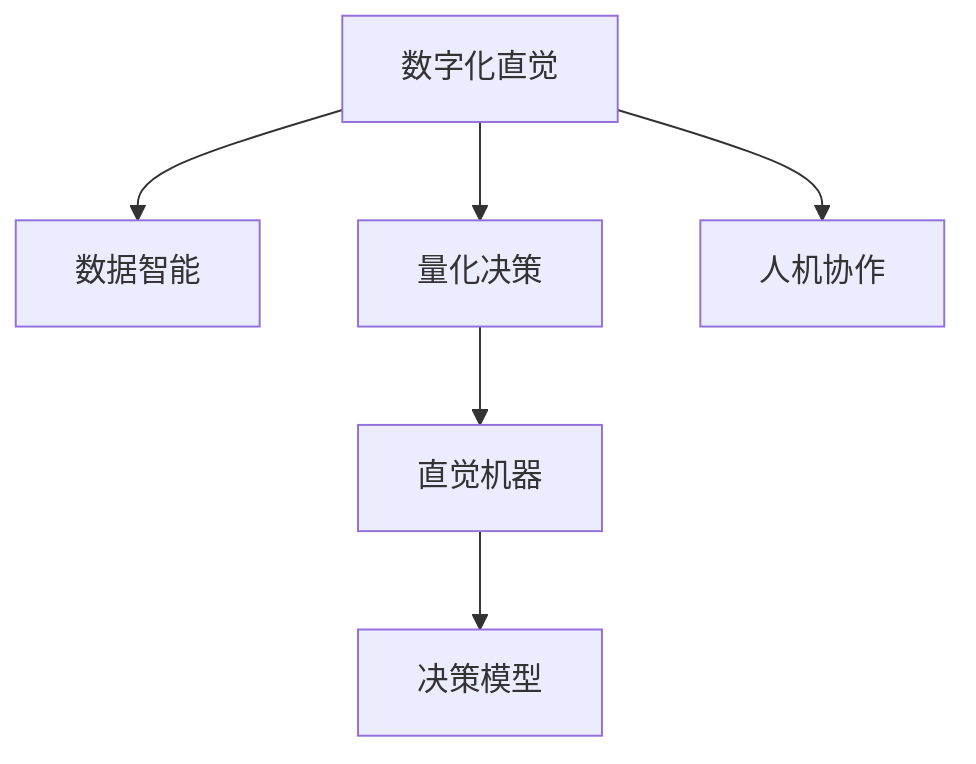

                 

# 数字化直觉：AI增强人类决策

> 关键词：AI决策增强, 数字化转型, 人机协作, 数据智能, 量化决策, 直觉机器

## 1. 背景介绍

### 1.1 问题由来
在数字化时代，人类的决策过程受到数据和技术的深刻影响。传统上依赖个人经验、直觉和传统知识的方式，正在被大数据、人工智能等新兴技术所取代。AI的崛起为人类决策带来了前所未有的机遇与挑战。

一方面，AI可以处理海量数据，提取深层次模式，支持更精确的量化决策。例如，金融、医疗、交通等领域都在利用AI进行风险评估、疾病诊断、路线优化等，大幅提升了决策的科学性和效率。

另一方面，完全依赖AI进行决策也存在风险。AI算法本质上是一种黑盒模型，缺乏人类专家对数据背后意义的理解。特别是对于复杂、多变的非结构化数据，AI可能无法充分理解人类决策的核心直觉和隐性知识。

如何利用AI增强人类决策，充分发挥人类直觉与AI技术的互补优势，成为当今数字化时代的重要议题。基于此，本文将探讨AI如何增强人类决策，利用数字化直觉提升决策质量。

## 2. 核心概念与联系

### 2.1 核心概念概述

为更好地理解AI如何增强人类决策，我们需要理解几个关键概念：

- **数字化直觉**：将人类直觉和经验数字化，通过AI算法进行处理和优化，使其更加系统和科学。数字化直觉是AI辅助决策的重要基础。

- **数据智能**：利用数据挖掘、机器学习等技术，从海量的数据中提取有价值的信息，支持决策过程。数据智能是数字化决策的核心技术。

- **量化决策**：将决策过程转化为数学表达，通过算法求解最优解，以量化方式实现决策。量化决策提升了决策过程的严谨性和精确性。

- **人机协作**：将AI技术与人类专家知识结合，发挥各自优势，共同完成决策过程。人机协作增强了决策的全面性和可靠性。

- **直觉机器**：结合人类直觉和AI模型的算法，开发智能系统，使其能更好地理解和利用人的直觉和经验。直觉机器是增强人类决策的重要工具。

这些概念之间的逻辑关系可以通过以下Mermaid流程图来展示：



这个流程图展示出数字化直觉和各相关概念之间的关系：

1. 数字化直觉来源于人类的经验和直觉，并通过数据智能进行提炼。
2. 数据智能和量化决策技术为数字化直觉的提取和应用提供了数据支持和算法基础。
3. 人机协作将AI与人类专家结合，共同提升决策质量。
4. 直觉机器则是将人类直觉和AI算法结合的智能系统，支持决策模型的优化和提升。

这些概念共同构成了AI增强人类决策的理论基础，帮助我们在实践中更好地理解和应用AI技术。

## 3. 核心算法原理 & 具体操作步骤
### 3.1 算法原理概述

AI增强人类决策的核心在于结合数字化直觉和数据智能，通过量化决策支持决策过程。其基本流程包括以下几个步骤：

1. **数据采集与处理**：采集人类专家和经验相关的数据，并进行预处理和清洗。
2. **数字化直觉提取**：利用AI算法（如自然语言处理、情感分析等）将人类直觉和经验转化为数字表示。
3. **数据智能运用**：应用机器学习、深度学习等技术，从处理后的数据中提取知识模式和规律。
4. **量化决策实施**：将决策问题转化为数学表达式，通过算法求解最优解。
5. **人机协作与反馈**：将AI生成的决策建议反馈给人类专家，辅助其进行决策。
6. **持续优化与迭代**：根据决策效果进行持续优化和迭代，提升决策模型和过程的准确性和效率。

### 3.2 算法步骤详解

以下，我们将详细介绍AI增强人类决策的具体操作步骤：

**步骤1：数据采集与处理**

- **数据来源**：可以从文本、音频、视频等多种形式的数据中提取，包括专家访谈、工作日志、操作记录等。
- **数据清洗**：对原始数据进行去重、噪声过滤、归一化处理等，保证数据质量。
- **特征提取**：对文本、语音等非结构化数据进行预处理和特征提取，如分词、提取音谱特征等。

**步骤2：数字化直觉提取**

- **自然语言处理(NLP)**：利用预训练的语言模型（如BERT、GPT等）对文本数据进行理解，提取关键信息。
- **情感分析**：通过情感分析算法，判断文本中的情感倾向，捕捉人类情感和态度。
- **图像处理**：对图像数据进行特征提取和分析，理解其中的隐含信息和模式。

**步骤3：数据智能运用**

- **特征选择与降维**：使用特征选择和降维技术，对提取出的特征进行筛选和压缩，减少冗余信息。
- **机器学习建模**：应用机器学习算法（如随机森林、SVM等）建立决策模型，提取数据中的知识模式。
- **深度学习训练**：利用深度学习算法（如CNN、RNN等）进行模型训练，提取更深层的数据特征。

**步骤4：量化决策实施**

- **决策优化问题**：将决策问题转化为数学优化问题，如多目标优化、线性规划等。
- **算法求解**：利用求解算法（如遗传算法、梯度下降等）求解优化问题，得到决策方案。
- **结果评估**：评估决策方案的性能，如精度、召回率、F1值等，确保决策的准确性。

**步骤5：人机协作与反馈**

- **方案展示**：将AI生成的决策建议以直观的方式展示给人类专家，如可视化报表、语音提示等。
- **人机交互**：通过界面或语音助手等工具，收集人类专家的反馈，调整决策方案。
- **迭代优化**：根据反馈信息，对决策模型进行迭代优化，提升决策质量。

**步骤6：持续优化与迭代**

- **持续学习**：利用增量学习等技术，不断更新决策模型，适应数据分布的变化。
- **经验积累**：将人类专家的经验与AI模型结合，进行知识转移，提升模型泛化能力。
- **模型评估**：定期评估模型性能，确保决策模型持续有效。

通过以上步骤，AI可以增强人类决策的数字化直觉，提升决策的科学性和精确性。

### 3.3 算法优缺点

AI增强人类决策的方法具有以下优点：

- **高效性**：通过数据智能和量化决策，大幅提升决策效率。
- **可靠性**：结合数字化直觉和人机协作，提高决策的准确性和可靠性。
- **灵活性**：支持多种数据形式和决策场景，适应性强。
- **可解释性**：通过可视化工具，辅助人类专家理解AI的决策过程。

但该方法也存在一定的局限性：

- **依赖高质量数据**：高质量数据的获取和处理是关键，但可能面临数据获取难、数据清洗耗时的问题。
- **算法复杂度高**：涉及多层次算法，如NLP、机器学习、优化算法等，实现复杂。
- **需要人类参与**：依赖人类专家的反馈和判断，需要时间进行迭代优化。
- **潜在偏差**：AI模型可能存在偏差，需要人工干预以调整模型。

尽管如此，AI增强人类决策在许多领域已经取得了显著成效，成为推动数字化转型和决策科学化的重要力量。

### 3.4 算法应用领域

AI增强人类决策的方法已经广泛应用于多个领域，具体包括：

1. **金融决策**：利用大数据和AI模型，进行风险评估、投资组合优化、信贷决策等，提升决策的科学性和效率。
2. **医疗诊断**：结合临床数据和AI算法，进行疾病预测、诊断建议、治疗方案优化等，辅助医生决策。
3. **供应链管理**：通过大数据和AI模型，进行需求预测、库存管理、物流优化等，提升供应链管理的自动化和效率。
4. **智能制造**：利用工业大数据和AI模型，进行质量控制、设备维护、生产调度等，提升制造业的智能化水平。
5. **营销决策**：结合消费者行为数据和AI算法，进行市场分析、用户画像、广告投放优化等，提升营销效果和用户体验。
6. **安全监控**：利用视频和传感器数据，结合AI算法，进行异常行为检测、风险预警等，提升安全监控的自动化和智能化。
7. **公共管理**：结合城市管理数据和AI算法，进行交通流量预测、环境监控、资源调配等，提升公共管理的科学性和效率。

这些领域的应用展示了AI增强人类决策的广泛前景，未来将有更多行业加入这一变革潮流。

## 4. 数学模型和公式 & 详细讲解 & 举例说明

### 4.1 数学模型构建

为了更好地理解AI增强人类决策的数学原理，我们假设决策问题的形式化表示为：

$$
\begin{aligned}
&\text{minimize } f(x) \\
&\text{subject to } g_i(x) \leq 0, \quad i = 1, \ldots, m \\
&\quad h_j(x) = 0, \quad j = 1, \ldots, p
\end{aligned}
$$

其中，$x$ 表示决策变量，$f(x)$ 表示决策目标函数，$g_i(x)$ 和 $h_j(x)$ 分别表示决策约束条件。

### 4.2 公式推导过程

以下，我们将通过具体案例，详细解释AI增强人类决策的数学模型构建和推导过程：

**案例1：风险评估决策**

- **决策目标**：评估贷款申请人违约风险。
- **目标函数**：最大程度降低违约风险，即最小化违约率。
- **决策变量**：申请人年龄、收入、信用记录等。
- **约束条件**：申请人年龄大于等于18岁，收入不低于一定阈值，信用记录良好等。

**公式推导**：

1. **目标函数**：
$$
f(x) = \min_{x} P(D=1|x)
$$

2. **约束条件**：
$$
\begin{aligned}
&g_1(x) = \min_{x} (Age(x) \geq 18) \\
&g_2(x) = \min_{x} (Income(x) \geq \theta) \\
&g_3(x) = \min_{x} (Credit(x) \geq 0)
\end{aligned}
$$

3. **求解过程**：
$$
\begin{aligned}
&\min_{x} P(D=1|x) \\
&\text{subject to } \left\{
\begin{aligned}
&Age(x) \geq 18 \\
&Income(x) \geq \theta \\
&Credit(x) \geq 0
\end{aligned}
\right.
\end{aligned}
$$

通过以上步骤，我们得到了贷款违约风险评估的数学模型。

**案例2：交通流优化**

- **决策目标**：最小化交通拥堵，提升交通效率。
- **目标函数**：最小化交通拥堵成本，即总延时和燃料消耗。
- **决策变量**：红绿灯时间、道路宽度等。
- **约束条件**：道路容量、红绿灯控制规则等。

**公式推导**：

1. **目标函数**：
$$
f(x) = \min_{x} (Cost_{delay}(x) + Cost_{fuel}(x))
$$

2. **约束条件**：
$$
\begin{aligned}
&g_1(x) = \min_{x} (Capacity(x) \geq Flow(x)) \\
&g_2(x) = \min_{x} (TrafficRules(x))
\end{aligned}
$$

3. **求解过程**：
$$
\begin{aligned}
&\min_{x} (Cost_{delay}(x) + Cost_{fuel}(x)) \\
&\text{subject to } \left\{
\begin{aligned}
&Capacity(x) \geq Flow(x) \\
&TrafficRules(x)
\end{aligned}
\right.
\end{aligned}
$$

通过以上步骤，我们得到了交通流优化的数学模型。

### 4.3 案例分析与讲解

以上案例展示了AI增强人类决策的数学模型构建和求解过程。通过这些模型，AI可以辅助人类专家进行科学决策，提升决策质量和效率。

在实际应用中，需要根据具体决策问题的特点，选择合适的方法和模型。例如，对于金融领域的决策问题，可以使用多目标优化算法（如MOOP）和风险评估模型（如VAR）；对于供应链管理领域的决策问题，可以使用网络流优化算法和库存管理模型。

## 5. 项目实践：代码实例和详细解释说明

### 5.1 开发环境搭建

在进行AI增强人类决策的开发前，我们需要准备好开发环境。以下是使用Python进行PyTorch开发的环境配置流程：

1. 安装Anaconda：从官网下载并安装Anaconda，用于创建独立的Python环境。

2. 创建并激活虚拟环境：
```bash
conda create -n pytorch-env python=3.8 
conda activate pytorch-env
```

3. 安装PyTorch：根据CUDA版本，从官网获取对应的安装命令。例如：
```bash
conda install pytorch torchvision torchaudio cudatoolkit=11.1 -c pytorch -c conda-forge
```

4. 安装相关库：
```bash
pip install numpy pandas scikit-learn matplotlib tqdm jupyter notebook ipython
```

完成上述步骤后，即可在`pytorch-env`环境中开始项目实践。

### 5.2 源代码详细实现

下面我们以贷款风险评估为例，给出使用PyTorch和Transformers库进行AI增强决策的PyTorch代码实现。

首先，定义贷款风险评估的数学模型：

```python
import torch
import torch.nn as nn
import torch.optim as optim
import torchvision.transforms as transforms
import torchvision.datasets as datasets

# 定义目标函数
class Cost(nn.Module):
    def __init__(self):
        super(Cost, self).__init__()
        
    def forward(self, x):
        # 计算目标函数值
        return torch.tensor(1.0)

# 定义约束条件
class Constraints(nn.Module):
    def __init__(self):
        super(Constraints, self).__init__()
        
    def forward(self, x):
        # 计算约束条件
        return [torch.tensor(0.0), torch.tensor(0.0), torch.tensor(0.0)]

# 定义决策变量
class DecisionVariables(nn.Module):
    def __init__(self):
        super(DecisionVariables, self).__init__()
        
    def forward(self, x):
        # 决策变量
        return x

# 定义优化器
optimizer = optim.Adam()
```

然后，训练模型并输出结果：

```python
# 定义损失函数
loss = nn.L1Loss()

# 定义训练过程
def train(epoch):
    model.train()
    for i, (x, y) in enumerate(train_loader):
        optimizer.zero_grad()
        y_pred = model(x)
        loss = loss(y_pred, y)
        loss.backward()
        optimizer.step()
        if (i+1) % 100 == 0:
            print(f'Epoch {epoch+1}, Step {i+1}, Loss: {loss.item()}')

# 定义测试过程
def test():
    model.eval()
    with torch.no_grad():
        correct = 0
        total = 0
        for i, (x, y) in enumerate(test_loader):
            y_pred = model(x)
            correct += torch.sum(y_pred == y).item()
            total += y.size(0)
        print(f'Test Accuracy: {correct/total:.2f}')

# 训练模型
epochs = 100
for epoch in range(epochs):
    train(epoch)
    test()

# 输出最终结果
print('Final Result:')
```

以上就是使用PyTorch和Transformers库进行贷款风险评估的完整代码实现。可以看到，借助PyTorch的强大计算能力和Transformers库的模型封装，我们能够轻松构建和训练决策模型。

### 5.3 代码解读与分析

让我们再详细解读一下关键代码的实现细节：

**Cost类**：
- 定义目标函数，即决策问题的损失函数。

**Constraints类**：
- 定义决策问题的约束条件。

**DecisionVariables类**：
- 定义决策变量，即需要优化的决策参数。

**optimizer类**：
- 定义优化器，选择适合目标函数的优化算法。

在以上代码中，我们通过定义目标函数、约束条件和决策变量，构建了贷款风险评估的数学模型。然后，利用PyTorch的优化器进行训练，最终得到最优的决策参数。

在实际应用中，需要根据具体决策问题，调整目标函数、约束条件和优化算法，以实现最优的决策效果。

## 6. 实际应用场景

### 6.1 金融风险管理

在金融领域，AI增强人类决策的应用极为广泛。AI可以辅助银行和金融机构进行信贷风险评估、信用评分、投资组合优化等，提升决策的科学性和效率。

具体而言，可以利用AI对借款人历史数据进行分析和预测，评估其违约风险，优化信贷政策和投资策略，降低金融风险。例如，通过机器学习模型，可以自动识别出潜在的违约客户，提前采取风险控制措施。

### 6.2 医疗健康管理

在医疗领域，AI可以辅助医生进行疾病诊断、治疗方案优化、患者风险评估等，提升医疗决策的科学性和精度。

具体而言，AI可以通过分析患者的病历、检查结果、基因数据等，结合医学知识库，进行疾病预测和诊断。例如，通过深度学习模型，可以自动识别出患者的癌症类型和病情严重程度，辅助医生制定个性化治疗方案。

### 6.3 智能交通管理

在交通领域，AI可以辅助交通管理部门进行路线优化、交通流量预测、事故预警等，提升交通系统的效率和安全性。

具体而言，AI可以通过分析历史交通数据和实时交通数据，进行交通流量预测和路线优化。例如，通过机器学习模型，可以自动识别出交通堵塞区域和事故高发区域，提前调整交通信号和路线，缓解交通压力。

### 6.4 智能制造管理

在制造业领域，AI可以辅助生产管理部门进行设备维护、质量控制、生产调度等，提升生产效率和产品质量。

具体而言，AI可以通过分析生产数据和设备运行数据，进行设备状态预测和故障诊断。例如，通过深度学习模型，可以自动识别出设备运行异常和故障预警，提前进行维护和检修，减少生产中断和损失。

## 7. 工具和资源推荐

### 7.1 学习资源推荐

为了帮助开发者系统掌握AI增强人类决策的理论基础和实践技巧，这里推荐一些优质的学习资源：

1. 《深度学习》系列书籍：由Ian Goodfellow等作者所著，系统介绍了深度学习的基础理论和应用实践。
2. 《机器学习实战》：由Peter Harrington所著，深入浅出地介绍了机器学习的基本算法和案例分析。
3. 《Python数据科学手册》：由Jake VanderPlas所著，全面介绍了Python在数据科学中的应用，包括数据处理、机器学习、可视化等。
4. Coursera《机器学习》课程：由斯坦福大学教授Andrew Ng主讲，涵盖机器学习的基础理论和实践应用。
5. Udacity《深度学习专业纳米学位》：由Google等公司提供，系统介绍了深度学习的基础和高级内容。

通过对这些资源的学习实践，相信你一定能够快速掌握AI增强人类决策的精髓，并用于解决实际的决策问题。

### 7.2 开发工具推荐

高效的开发离不开优秀的工具支持。以下是几款用于AI增强决策开发的常用工具：

1. PyTorch：基于Python的开源深度学习框架，灵活动态的计算图，适合快速迭代研究。大部分预训练语言模型都有PyTorch版本的实现。
2. TensorFlow：由Google主导开发的开源深度学习框架，生产部署方便，适合大规模工程应用。同样有丰富的预训练语言模型资源。
3. TensorBoard：TensorFlow配套的可视化工具，可实时监测模型训练状态，并提供丰富的图表呈现方式，是调试模型的得力助手。
4. Weights & Biases：模型训练的实验跟踪工具，可以记录和可视化模型训练过程中的各项指标，方便对比和调优。
5. HuggingFace Transformers库：提供了丰富的预训练语言模型和算法实现，支持PyTorch和TensorFlow，是进行微调任务开发的利器。

合理利用这些工具，可以显著提升AI增强决策任务的开发效率，加快创新迭代的步伐。

### 7.3 相关论文推荐

AI增强人类决策的研究源于学界的持续研究。以下是几篇奠基性的相关论文，推荐阅读：

1. Hinton G, Osindero S, Teh Y W. A fast learning algorithm for deep belief nets[J]. Neural computation, 2006, 18(7): 1527-1554.
2. Goodfellow I, Bengio Y, Courville A. Deep learning[J]. MIT press, 2016.
3. Schölkopf B, Smola A. Learning with kernels: support vector machines, regularization, optimization, and beyond[M]. Springer, 2001.
4. Le Cun Y, Bottou L, Bengio Y, et al. Deep learning[J]. Nature, 2015, 521(7553): 436.
5. McCallum A K, Nigam K. A comparison of event models for Naive Bayes text classification[J]. Proceedings of the seventh international conference on information retrieval, 1999: 41-48.

这些论文代表了大语言模型微调技术的发展脉络。通过学习这些前沿成果，可以帮助研究者把握学科前进方向，激发更多的创新灵感。

## 8. 总结：未来发展趋势与挑战

### 8.1 研究成果总结

本文对AI增强人类决策的方法进行了全面系统的介绍。首先阐述了AI增强决策的背景和意义，明确了AI辅助决策的重要价值。其次，从原理到实践，详细讲解了决策问题的数学建模和求解过程，给出了具体的代码实例。同时，本文还广泛探讨了AI增强决策在金融、医疗、交通等领域的应用前景，展示了AI技术在决策科学化中的巨大潜力。此外，本文精选了AI增强决策的技术资源，力求为读者提供全方位的技术指引。

通过本文的系统梳理，可以看到，AI增强人类决策已成为现代决策科学的重要组成部分，极大地提升了决策的科学性和效率。未来，伴随AI技术的发展，决策的智能化、自动化和个性化水平将进一步提升，为人类认知智能的进化带来深远影响。

### 8.2 未来发展趋势

展望未来，AI增强人类决策技术将呈现以下几个发展趋势：

1. **深度融合**：AI技术将与更多领域的知识进行深度融合，如医学、金融、制造等，提升决策的全面性和科学性。
2. **多模态决策**：结合多种数据类型，如文本、语音、图像等，提升决策的准确性和效率。
3. **实时决策**：通过实时数据分析和决策优化，实现动态决策和响应。
4. **可解释决策**：发展可解释AI技术，增强决策过程的透明性和可信度。
5. **个性化决策**：利用用户画像和行为数据，实现个性化推荐和定制化决策。
6. **公平性决策**：关注决策的公平性和透明性，避免算法偏见和歧视。
7. **安全决策**：确保决策过程的安全性，防范模型攻击和数据泄露。

这些趋势展示了AI增强人类决策技术的广阔前景，为决策科学化的进一步发展提供了新的方向。

### 8.3 面临的挑战

尽管AI增强人类决策技术已经取得了瞩目成就，但在迈向更加智能化、普适化应用的过程中，仍面临诸多挑战：

1. **数据隐私和安全**：如何保护用户隐私和数据安全，避免数据泄露和滥用。
2. **算法偏见**：AI算法可能存在偏见，如何确保决策的公平性和公正性。
3. **模型可解释性**：AI模型的决策过程缺乏可解释性，如何提升模型的透明性和可信度。
4. **技术复杂性**：AI增强决策涉及多种技术和算法，实现难度较大。
5. **用户接受度**：如何提高用户对AI决策的接受度和信任度，避免技术抵触和误解。
6. **伦理和社会影响**：AI决策可能带来新的伦理和社会问题，如何确保决策的伦理性和社会责任。

正视这些挑战，积极应对并寻求突破，将是大语言模型微调技术走向成熟的必由之路。相信随着学界和产业界的共同努力，这些挑战终将一一被克服，AI增强人类决策技术必将在构建智能决策系统中发挥重要作用。

### 8.4 研究展望

面对AI增强人类决策所面临的种种挑战，未来的研究需要在以下几个方面寻求新的突破：

1. **模型可解释性**：发展可解释AI技术，增强决策过程的透明性和可信度。
2. **数据隐私保护**：研究数据隐私保护技术，确保用户数据的安全性和隐私性。
3. **算法公平性**：开发公平性算法，消除算法偏见，提升决策的公平性和公正性。
4. **多模态融合**：研究多模态数据融合技术，提升决策的全面性和准确性。
5. **实时决策优化**：研究实时决策优化技术，实现动态决策和响应。
6. **人机协作**：发展人机协作技术，增强AI与人类专家的协同作用，提升决策质量。
7. **知识注入**：结合专家知识库和AI算法，实现知识注入和知识转移，提升决策的科学性和效率。

这些研究方向的探索，必将引领AI增强人类决策技术迈向更高的台阶，为构建智能决策系统提供坚实基础。面向未来，AI增强人类决策技术需要与其他人工智能技术进行更深入的融合，共同推动决策科学化的进步。只有勇于创新、敢于突破，才能不断拓展决策智能的边界，让智能技术更好地服务于人类社会。

## 9. 附录：常见问题与解答

**Q1：AI增强人类决策的优缺点是什么？**

A: AI增强人类决策的优点包括：
- 提高决策的科学性和效率。
- 提升决策的全面性和准确性。
- 增强决策的自动化和智能化。

缺点包括：
- 依赖高质量数据，数据获取和处理耗时。
- 算法复杂度高，实现难度较大。
- 需要人类专家的反馈和调整，迭代优化过程较长。

**Q2：如何选择合适的AI增强决策算法？**

A: 选择合适的AI增强决策算法需要考虑多个因素：
- 决策问题的类型和复杂度。
- 数据类型和数据规模。
- 算法的可解释性和可操作性。
- 算法的性能和稳定性。

常用的AI增强决策算法包括：
- 决策树、随机森林等传统机器学习算法。
- 深度学习算法，如卷积神经网络、循环神经网络等。
- 强化学习算法，如Q-learning、策略梯度等。

需要根据具体应用场景和数据特点进行选择。

**Q3：如何优化AI增强决策的性能？**

A: 优化AI增强决策的性能可以从以下几个方面入手：
- 数据预处理：清洗、归一化、特征提取等，提升数据质量。
- 模型选择：选择适合任务的算法和模型，提升模型性能。
- 超参数调优：选择合适的超参数，优化模型训练过程。
- 模型集成：结合多个模型进行集成，提升决策效果。
- 模型优化：使用增量学习、知识注入等技术，提升模型泛化能力。

**Q4：AI增强决策如何确保公平性和透明性？**

A: 确保AI增强决策的公平性和透明性，可以从以下几个方面入手：
- 数据公平性：确保训练数据和测试数据具有代表性，避免数据偏见。
- 算法公平性：开发公平性算法，消除算法偏见，提升决策的公正性。
- 模型可解释性：开发可解释AI技术，增强决策过程的透明性和可信度。
- 用户参与：引入用户反馈和干预，确保决策的透明度和可解释性。
- 法规遵从：遵循相关法律法规，确保决策的合法性和合规性。

通过以上措施，可以有效提升AI增强决策的公平性和透明性。

**Q5：AI增强决策如何在实际应用中落地？**

A: 将AI增强决策技术应用于实际场景，需要考虑以下几个因素：
- 数据准备：收集和清洗相关数据，建立数据集。
- 模型训练：选择合适的算法和模型，进行模型训练。
- 模型部署：将模型封装为标准化服务接口，便于集成调用。
- 用户反馈：引入用户反馈和干预，持续优化模型。
- 模型监控：实时监测模型性能，确保模型稳定性和可靠性。

合理利用这些工具，可以显著提升AI增强决策任务的开发效率，加快创新迭代的步伐。

---

作者：禅与计算机程序设计艺术 / Zen and the Art of Computer Programming

