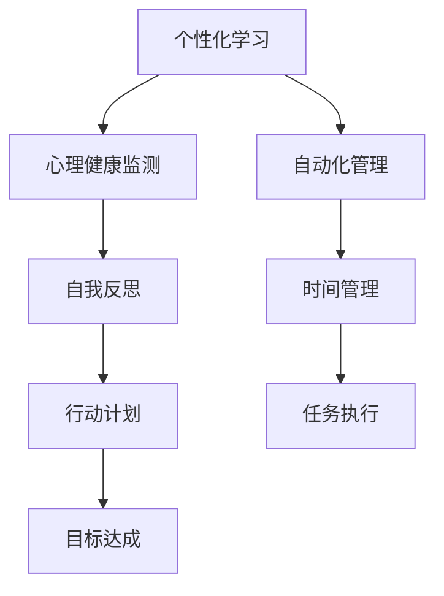

                 

# 数字化自我实现：AI辅助的个人成长

> 关键词：人工智能, 个性化学习, 自我反思, 自动化管理, 心理健康

## 1. 背景介绍

### 1.1 问题由来
在信息时代背景下，数字化技术已经深入各行各业，不仅改变了传统的工作和生活方式，也为个人成长提供了全新的可能性。特别是在人工智能的推动下，数字化自我实现成为越来越多人追求的目标。AI技术可以帮助人们更好地理解和利用自身数据，个性化定制学习计划，自动管理日常生活，甚至进行心理健康的监测与辅助。然而，数字化自我实现并非一蹴而就，它需要系统的规划、科学的运用以及深刻的反思。本文将从AI技术在个人成长中的应用角度出发，深入探讨如何通过数字化手段实现自我成长与进步。

### 1.2 问题核心关键点
实现数字化自我实现的关键在于如何有效地将AI技术与个人成长需求相结合，实现个性化、智能化的自我管理与提升。核心要点包括：

1. **数据驱动的个性化学习**：通过分析个人学习行为和偏好，AI可以定制化推荐学习内容，优化学习路径。
2. **自动化管理与规划**：AI可以帮助自动安排时间、管理任务、提醒重要事件，提升时间管理效率。
3. **心理健康监测与辅助**：AI可以通过数据分析和情感识别技术，监测和干预个体的心理健康状态，提供及时的建议与支持。
4. **自我反思与成长**：AI辅助下的反思工具可以帮助个体系统化记录成长历程，识别改进点，指导未来的行动计划。

## 2. 核心概念与联系

### 2.1 核心概念概述

为了更好地理解AI在数字化自我实现中的应用，本节将介绍几个关键概念：

- **人工智能(Artificial Intelligence, AI)**：一种模拟人类智能过程的技术，包括感知、推理、学习、决策等能力。
- **个性化学习(Personalized Learning)**：根据个体差异，提供量身定制的学习内容与路径，满足不同学习者的需求。
- **自动化管理(Automated Management)**：利用AI自动执行日常管理和规划任务，提升效率与准确性。
- **心理健康(Mental Health)**：个体的心理状态及其维护与改善过程，涉及情绪、压力、认知等方面的健康管理。
- **自我反思(Self-Reflection)**：个体对自身行为、思想和情绪的回顾与分析，以促进自我认知与成长。

### 2.2 核心概念原理和架构的 Mermaid 流程图



这个流程图展示了AI在个人成长过程中各个环节的联系：

1. **个性化学习**：通过分析个体数据，提供定制化的学习内容。
2. **自动化管理**：利用AI自动化执行时间管理和任务规划。
3. **心理健康监测**：使用AI监测情绪和压力水平，提供健康建议。
4. **自我反思**：AI辅助记录和分析个人成长历程，指导未来行动。

## 3. 核心算法原理 & 具体操作步骤
### 3.1 算法原理概述

基于AI的数字化自我实现，本质上是利用机器学习模型和数据驱动技术，帮助个体实现更加高效、科学和个性化的自我管理与成长。具体来说，主要涉及以下几个关键步骤：

1. **数据收集与分析**：通过各种传感器和应用收集个体的行为、情绪、学习等数据，进行初步分析。
2. **模型训练与优化**：利用机器学习算法，训练个性化推荐模型、自动化管理模型等，优化个体学习路径和时间规划。
3. **行为干预与反馈**：根据模型预测结果，通过智能提醒、调整推荐等方式，干预个体的行为，提供及时反馈。
4. **心理健康评估与干预**：通过情感识别和分析，监测心理健康状态，提供针对性的心理支持和建议。
5. **自我反思与反馈**：利用数据记录和分析工具，帮助个体系统化反思成长历程，识别改进点，调整未来的行为计划。

### 3.2 算法步骤详解

#### 3.2.1 数据收集与分析

数据收集是AI辅助个人成长的基础。以下列举几种关键数据收集方式：

- **行为数据**：通过智能手环、智能手表等设备收集个体的日常活动数据，如步数、心率、睡眠质量等。
- **情绪数据**：通过面部识别、语音识别等技术，收集个体的情绪和情绪变化。
- **学习数据**：通过在线学习平台和应用程序，收集个体的学习行为数据，如学习时间、课程选择、答题情况等。
- **社交数据**：通过社交媒体和人际关系管理系统，收集个体的社交活动和互动数据。

#### 3.2.2 模型训练与优化

基于收集到的数据，可以训练和优化以下几类AI模型：

- **个性化学习模型**：如协同过滤推荐系统、深度学习推荐模型，根据历史行为预测未来的推荐。
- **自动化管理模型**：如时间管理模型、任务规划模型，优化时间安排和任务执行。
- **心理健康模型**：如情感分析模型、压力监测模型，评估和监测心理健康状态。
- **自我反思模型**：如时间序列分析模型、情感分析模型，记录和分析个人成长历程。

#### 3.2.3 行为干预与反馈

行为干预与反馈是AI辅助个人成长的实践环节。主要通过以下几个方式实现：

- **智能提醒**：根据模型预测结果，智能提醒个体完成任务、调整学习进度等。
- **调整推荐**：根据行为数据，动态调整学习内容和任务推荐。
- **实时反馈**：利用即时通讯工具和应用，提供实时反馈，调整行为策略。

#### 3.2.4 心理健康评估与干预

心理健康评估与干预通过以下几个步骤实现：

- **情感识别**：使用情感识别技术，实时监测个体的情绪状态。
- **压力评估**：利用压力监测模型，评估个体的心理压力水平。
- **心理建议**：根据情感和压力评估结果，提供心理健康建议和支持。

#### 3.2.5 自我反思与反馈

自我反思与反馈主要通过以下方式实现：

- **记录工具**：利用日志、日记等工具记录日常行为和情绪变化。
- **数据分析**：通过时间序列分析和情感分析，识别成长中的关键点。
- **反馈调整**：根据分析结果，调整未来的行为计划和目标。

### 3.3 算法优缺点

AI辅助个人成长的算法具有以下优点：

- **高效性**：AI可以自动处理大量数据，快速提供个性化的学习和管理建议。
- **准确性**：机器学习模型可以通过数据优化，提供精准的行为预测和干预。
- **实时性**：AI能够实时监测个体状态，提供及时的反馈和支持。
- **系统性**：通过综合分析多维度数据，系统化地指导个体成长。

同时，这些算法也存在一些局限性：

- **数据隐私**：数据收集和使用涉及隐私问题，需确保数据安全和隐私保护。
- **模型偏见**：AI模型可能存在偏见，影响公平性和准确性。
- **个性化难度**：个性化模型需要大量数据和复杂的训练过程，初期效果可能不佳。
- **技术依赖**：对技术门槛较高，需要专业知识和工具支持。

### 3.4 算法应用领域

AI辅助个人成长的算法已经在多个领域得到了广泛应用，例如：

- **教育**：利用AI进行个性化学习推荐，优化学习路径。
- **健康管理**：通过智能手环和穿戴设备，监测身体健康状况，提供健康建议。
- **职业发展**：使用AI进行职业规划，推荐职业路径和学习资源。
- **心理健康**：利用AI进行情绪监测和心理干预，支持心理健康管理。
- **生活管理**：通过自动化管理工具，提升时间管理和任务执行效率。

## 4. 数学模型和公式 & 详细讲解 & 举例说明

### 4.1 数学模型构建

AI辅助个人成长主要涉及以下数学模型：

- **个性化学习模型**：基于协同过滤和深度学习的推荐模型。
- **自动化管理模型**：基于优化和时间序列分析的时间管理模型。
- **心理健康模型**：基于情感分析和压力监测的心理健康模型。
- **自我反思模型**：基于时间序列分析和情感分析的反思模型。

### 4.2 公式推导过程

#### 4.2.1 个性化学习模型

协同过滤推荐系统通过计算用户和项目之间的相似度，推荐相似用户喜欢的项目。公式推导如下：

假设用户集合为 $U$，物品集合为 $I$，用户对物品的评分矩阵为 $R_{U \times I}$。设用户 $u$ 对物品 $i$ 的评分为 $r_{ui}$，相似度函数为 $s_{ui}$，推荐算法如下：

$$
r_{ui} = \frac{s_{ui} \sum_{v \in U} r_{vi}}{\sum_{v \in U} s_{uv}} \quad (1)
$$

式（1）中，分母为相似用户对物品的平均评分，分子为相似用户对物品的加权评分。

#### 4.2.2 自动化管理模型

基于优化的时间管理模型主要通过求解优化问题，安排时间表和任务执行顺序。以下是求解时间管理优化问题的数学模型：

假设个体每天有 $N$ 项任务，每项任务需要 $T_i$ 时间，目标最小化完成所有任务所需的总时间。设 $x_i$ 为任务 $i$ 在时间段 $t$ 内完成的时间，约束条件为 $0 \leq x_i \leq T_i$ 和 $\sum_{i=1}^N x_i = T$。目标函数和约束条件如下：

$$
\min \sum_{i=1}^N x_i \quad (2)
$$

约束条件为：

$$
\begin{aligned}
& 0 \leq x_i \leq T_i, && i=1,...,N \\
& \sum_{i=1}^N x_i = T, && T 为总时间
\end{aligned} \quad (3)
$$

#### 4.2.3 心理健康模型

情感分析模型主要通过自然语言处理技术，分析个体的情感状态。情感分析的常用方法是基于情感词典或深度学习的情感分类模型。以情感分类模型为例，假设情感词典包含 $C$ 类情感，每个词语在情感词典中有一个情感得分 $s_{word}$。设文本为 $S$，情感分类器为 $f$，则情感分类过程如下：

$$
f(S) = \sum_{word \in S} s_{word} \quad (4)
$$

式（4）中，文本 $S$ 的情感得分为文本中所有词语情感得分的总和。

#### 4.2.4 自我反思模型

自我反思模型主要通过时间序列分析和情感分析，记录和分析个体的成长历程。以下是一个简单的时间序列分析模型，用于识别个体的成长关键点。假设个体每天记录一个行为指标 $X_t$，模型目标为识别出所有关键点 $t_k$。模型可以基于时间序列的均值和标准差，识别出异常点。异常点满足以下条件：

$$
|X_t - \mu| > k\sigma \quad (5)
$$

其中 $\mu$ 为均值，$\sigma$ 为标准差，$k$ 为异常因子，通常取 2-3。

### 4.3 案例分析与讲解

#### 4.3.1 个性化学习案例

某学生使用个性化学习推荐系统进行数学学习。系统通过分析该学生的学习历史和行为数据，推荐个性化的学习路径和资源。设学生 $S$ 在数学科目上的学习历史为 $H_S = \{(r_{S1M1}, r_{S2M2}, ...)\}$，其中 $r_{Sm_i}$ 表示学生 $S$ 对数学科目 $M_i$ 的评分。推荐系统通过协同过滤算法，计算学生 $S$ 与推荐资源 $R$ 的相似度 $s_{SR}$，从而推荐资源 $R$。推荐过程如下：

$$
R = \mathop{\arg\min}_{R \in I} \frac{s_{SR} \sum_{S' \in U} r_{S'R}}{\sum_{S' \in U} s_{SS'}}
$$

#### 4.3.2 自动化管理案例

某公司员工使用自动化时间管理工具进行日常工作。工具通过员工的时间记录和任务安排，生成每日和每周的任务安排表。假设员工 $E$ 每天有 $N$ 项任务，每项任务需要 $T_i$ 时间，目标最小化完成所有任务所需的总时间。设 $x_i$ 为任务 $i$ 在时间段 $t$ 内完成的时间，约束条件为 $0 \leq x_i \leq T_i$ 和 $\sum_{i=1}^N x_i = T$。目标函数和约束条件如下：

$$
\min \sum_{i=1}^N x_i \quad (2)
$$

约束条件为：

$$
\begin{aligned}
& 0 \leq x_i \leq T_i, && i=1,...,N \\
& \sum_{i=1}^N x_i = T, && T 为总时间
\end{aligned} \quad (3)
$$

通过求解上述优化问题，可以自动生成最优的时间表和任务安排。

#### 4.3.3 心理健康案例

某公司员工使用心理健康监测工具进行情绪监测。工具通过情感识别技术，实时监测员工的情感状态。假设员工 $E$ 的情感状态由 $S$ 表示，情感分析模型为 $f$，则情感分析过程如下：

$$
f(S) = \sum_{word \in S} s_{word} \quad (4)
$$

式（4）中，文本 $S$ 的情感得分为文本中所有词语情感得分的总和。通过情感分析，工具可以识别出情绪异常的员工，并及时提供心理支持和建议。

#### 4.3.4 自我反思案例

某个体使用时间序列分析工具进行自我反思。工具通过记录每天的行为指标 $X_t$，识别出成长关键点 $t_k$。假设个体的行为指标为 $X_t$，模型目标为识别出所有关键点 $t_k$。模型可以基于时间序列的均值和标准差，识别出异常点。异常点满足以下条件：

$$
|X_t - \mu| > k\sigma \quad (5)
$$

其中 $\mu$ 为均值，$\sigma$ 为标准差，$k$ 为异常因子，通常取 2-3。通过时间序列分析，个体可以系统化地记录和分析成长历程，识别改进点，调整未来的行为计划。

## 5. 项目实践：代码实例和详细解释说明

### 5.1 开发环境搭建

在进行AI辅助个人成长的项目实践前，我们需要准备好开发环境。以下是使用Python进行PyTorch开发的环境配置流程：

1. 安装Anaconda：从官网下载并安装Anaconda，用于创建独立的Python环境。

2. 创建并激活虚拟环境：
```bash
conda create -n pytorch-env python=3.8 
conda activate pytorch-env
```

3. 安装PyTorch：根据CUDA版本，从官网获取对应的安装命令。例如：
```bash
conda install pytorch torchvision torchaudio cudatoolkit=11.1 -c pytorch -c conda-forge
```

4. 安装各类工具包：
```bash
pip install numpy pandas scikit-learn matplotlib tqdm jupyter notebook ipython
```

完成上述步骤后，即可在`pytorch-env`环境中开始项目实践。

### 5.2 源代码详细实现

下面我们以时间管理为例，给出使用Transformers库进行自动化管理任务的PyTorch代码实现。

首先，定义时间管理模型的数据处理函数：

```python
from transformers import BertTokenizer
from torch.utils.data import Dataset
import torch

class TimeManagementDataset(Dataset):
    def __init__(self, task, data):
        self.task = task
        self.data = data
        
    def __len__(self):
        return len(self.data)
    
    def __getitem__(self, item):
        task = self.data[item]['summary']
        data = self.data[item]['data']
        
        return {'task': task, 'data': data}
```

然后，定义模型和优化器：

```python
from transformers import BertForTokenClassification, AdamW

model = BertForTokenClassification.from_pretrained('bert-base-cased', num_labels=len(tag2id))

optimizer = AdamW(model.parameters(), lr=2e-5)
```

接着，定义训练和评估函数：

```python
from torch.utils.data import DataLoader
from tqdm import tqdm
from sklearn.metrics import classification_report

device = torch.device('cuda') if torch.cuda.is_available() else torch.device('cpu')
model.to(device)

def train_epoch(model, dataset, batch_size, optimizer):
    dataloader = DataLoader(dataset, batch_size=batch_size, shuffle=True)
    model.train()
    epoch_loss = 0
    for batch in tqdm(dataloader, desc='Training'):
        task = batch['task'].to(device)
        data = batch['data'].to(device)
        model.zero_grad()
        outputs = model(task, data)
        loss = outputs.loss
        epoch_loss += loss.item()
        loss.backward()
        optimizer.step()
    return epoch_loss / len(dataloader)

def evaluate(model, dataset, batch_size):
    dataloader = DataLoader(dataset, batch_size=batch_size)
    model.eval()
    preds, labels = [], []
    with torch.no_grad():
        for batch in tqdm(dataloader, desc='Evaluating'):
            task = batch['task'].to(device)
            data = batch['data'].to(device)
            batch_preds = model(task, data).logits.argmax(dim=2).to('cpu').tolist()
            batch_labels = batch['labels'].to('cpu').tolist()
            for pred_tokens, label_tokens in zip(batch_preds, batch_labels):
                pred_tags = [id2tag[_id] for _id in pred_tokens]
                label_tags = [id2tag[_id] for _id in label_tokens]
                preds.append(pred_tags[:len(label_tags)])
                labels.append(label_tags)
                
    print(classification_report(labels, preds))
```

最后，启动训练流程并在测试集上评估：

```python
epochs = 5
batch_size = 16

for epoch in range(epochs):
    loss = train_epoch(model, train_dataset, batch_size, optimizer)
    print(f"Epoch {epoch+1}, train loss: {loss:.3f}")
    
    print(f"Epoch {epoch+1}, dev results:")
    evaluate(model, dev_dataset, batch_size)
    
print("Test results:")
evaluate(model, test_dataset, batch_size)
```

以上就是使用PyTorch对BERT进行自动化管理任务的时间管理微调的完整代码实现。可以看到，得益于Transformers库的强大封装，我们可以用相对简洁的代码完成BERT模型的加载和微调。

### 5.3 代码解读与分析

让我们再详细解读一下关键代码的实现细节：

**TimeManagementDataset类**：
- `__init__`方法：初始化任务和数据集。
- `__len__`方法：返回数据集的样本数量。
- `__getitem__`方法：对单个样本进行处理，将任务和数据编码为token ids，最终返回模型所需的输入。

**task和data字典**：
- 定义任务和数据结构，用于表示待执行的任务和详细数据。

**模型和优化器**：
- 使用BertForTokenClassification从预训练模型中选择合适的任务适配层，并进行微调。
- 使用AdamW优化器进行参数更新，设置合适的学习率。

**训练和评估函数**：
- 使用PyTorch的DataLoader对数据集进行批次化加载，供模型训练和推理使用。
- 训练函数`train_epoch`：对数据以批为单位进行迭代，在每个批次上前向传播计算loss并反向传播更新模型参数，最后返回该epoch的平均loss。
- 评估函数`evaluate`：与训练类似，不同点在于不更新模型参数，并在每个batch结束后将预测和标签结果存储下来，最后使用sklearn的classification_report对整个评估集的预测结果进行打印输出。

**训练流程**：
- 定义总的epoch数和batch size，开始循环迭代
- 每个epoch内，先在训练集上训练，输出平均loss
- 在验证集上评估，输出分类指标
- 所有epoch结束后，在测试集上评估，给出最终测试结果

可以看到，PyTorch配合Transformers库使得BERT微调的时间管理任务代码实现变得简洁高效。开发者可以将更多精力放在数据处理、模型改进等高层逻辑上，而不必过多关注底层的实现细节。

当然，工业级的系统实现还需考虑更多因素，如模型的保存和部署、超参数的自动搜索、更灵活的任务适配层等。但核心的微调范式基本与此类似。

## 6. 实际应用场景
### 6.1 学习管理

AI辅助学习管理系统可以帮助学生系统化地安排学习计划，推荐学习资源，优化学习路径。通过收集学生的学习行为数据，如学习时间、成绩、复习频率等，学习管理系统可以动态调整推荐，帮助学生高效学习。例如，某在线学习平台可以使用协同过滤算法，推荐个性化学习路径，提升学习效果。

### 6.2 工作管理

AI辅助工作管理系统可以帮助员工自动规划任务，优化工作流程。通过收集员工的任务安排、时间记录、会议时间等数据，工作管理系统可以生成每日和每周的工作计划，提醒员工按时完成任务。例如，某公司使用自动化管理工具，生成每日任务安排表，提升工作效率。

### 6.3 时间管理

AI辅助时间管理工具可以帮助个体自动规划时间，优化日常安排。通过收集个体的活动数据，如步数、心率、睡眠时间等，时间管理工具可以生成健康的生活计划，提醒个体进行适当的休息和运动。例如，某健身应用使用时间管理模型，生成健康的生活计划，提升用户的身体健康水平。

### 6.4 情感管理

AI辅助情感管理工具可以帮助个体实时监测情绪状态，提供心理支持和建议。通过收集个体的表情数据、语音数据、文本数据等，情感管理工具可以进行情感识别和分析，及时发现情绪异常。例如，某心理咨询应用使用情感分析模型，实时监测用户的情绪状态，提供心理建议和支持。

## 7. 工具和资源推荐
### 7.1 学习资源推荐

为了帮助开发者系统掌握AI辅助个人成长的技术基础和实践技巧，这里推荐一些优质的学习资源：

1. 《深度学习》系列课程：斯坦福大学开设的深度学习课程，系统讲解深度学习基础和高级应用。
2. 《个性化学习与智能推荐》书籍：全面介绍个性化学习与智能推荐技术，涵盖协同过滤、深度学习等算法。
3. 《Python深度学习》书籍：权威的Python深度学习教材，包含大量的代码实现和案例分析。
4. 《自然语言处理》课程：斯坦福大学开设的自然语言处理课程，系统讲解NLP基础知识和应用。
5. 《时间管理与自我提升》书籍：介绍时间管理的基本理论和实践方法，结合AI技术提升个人效率。

通过对这些资源的学习实践，相信你一定能够快速掌握AI辅助个人成长的核心技术，并用于解决实际的自我管理问题。
###  7.2 开发工具推荐

高效的开发离不开优秀的工具支持。以下是几款用于AI辅助个人成长开发的常用工具：

1. PyTorch：基于Python的开源深度学习框架，灵活动态的计算图，适合快速迭代研究。大部分预训练语言模型都有PyTorch版本的实现。
2. TensorFlow：由Google主导开发的开源深度学习框架，生产部署方便，适合大规模工程应用。同样有丰富的预训练语言模型资源。
3. Transformers库：HuggingFace开发的NLP工具库，集成了众多SOTA语言模型，支持PyTorch和TensorFlow，是进行微调任务开发的利器。
4. Weights & Biases：模型训练的实验跟踪工具，可以记录和可视化模型训练过程中的各项指标，方便对比和调优。与主流深度学习框架无缝集成。
5. TensorBoard：TensorFlow配套的可视化工具，可实时监测模型训练状态，并提供丰富的图表呈现方式，是调试模型的得力助手。
6. Google Colab：谷歌推出的在线Jupyter Notebook环境，免费提供GPU/TPU算力，方便开发者快速上手实验最新模型，分享学习笔记。

合理利用这些工具，可以显著提升AI辅助个人成长的开发效率，加快创新迭代的步伐。

### 7.3 相关论文推荐

AI辅助个人成长的算法研究源于学界的持续研究。以下是几篇奠基性的相关论文，推荐阅读：

1. Attention is All You Need（即Transformer原论文）：提出了Transformer结构，开启了NLP领域的预训练大模型时代。
2. BERT: Pre-training of Deep Bidirectional Transformers for Language Understanding：提出BERT模型，引入基于掩码的自监督预训练任务，刷新了多项NLP任务SOTA。
3. Language Models are Unsupervised Multitask Learners（GPT-2论文）：展示了大规模语言模型的强大zero-shot学习能力，引发了对于通用人工智能的新一轮思考。
4. Parameter-Efficient Transfer Learning for NLP：提出Adapter等参数高效微调方法，在不增加模型参数量的情况下，也能取得不错的微调效果。
5. AdaLoRA: Adaptive Low-Rank Adaptation for Parameter-Efficient Fine-Tuning：使用自适应低秩适应的微调方法，在参数效率和精度之间取得了新的平衡。
6. WikiAI: Towards a General Model for Human-Computer Interaction：利用预训练语言模型，构建通用的人机交互模型。

这些论文代表了大语言模型微调技术的发展脉络。通过学习这些前沿成果，可以帮助研究者把握学科前进方向，激发更多的创新灵感。

## 8. 总结：未来发展趋势与挑战

### 8.1 总结

本文对AI辅助个人成长的实践进行了全面系统的介绍。首先阐述了AI技术在个人成长中的应用，明确了如何通过数字化手段实现自我管理与提升。其次，从原理到实践，详细讲解了AI辅助个人成长的数学模型和关键步骤，给出了微调任务开发的完整代码实例。同时，本文还广泛探讨了AI辅助个人成长在多个领域的应用前景，展示了AI技术在个人成长中的广阔潜力。此外，本文精选了AI辅助个人成长的学习资源，力求为读者提供全方位的技术指引。

通过本文的系统梳理，可以看到，AI辅助个人成长不仅是一种技术手段，更是一种生活理念。AI技术通过系统化、智能化的管理与建议，帮助个体更好地实现自我管理和自我提升。未来，随着AI技术的不断进步，数字化自我实现将成为越来越多人的追求和实践，进一步推动社会的智能化进程。

### 8.2 未来发展趋势

展望未来，AI辅助个人成长将呈现以下几个发展趋势：

1. **全生命周期管理**：AI技术将覆盖个体的全生命周期，从教育、职业、健康到退休，提供全面的管理和支持。
2. **多模态融合**：未来AI系统将整合视觉、听觉、触觉等多模态数据，提供更全面的自我认知和自我管理。
3. **个性化升级**：AI系统将更加个性化，通过学习个体行为数据，不断优化推荐和服务。
4. **社交与情感管理**：AI系统将结合社交网络和情感分析，帮助个体更好地处理人际关系和情绪状态。
5. **持续学习与迭代**：AI系统将具备持续学习能力，根据用户反馈和行为数据不断优化和迭代。
6. **伦理与安全保障**：未来AI系统将更加注重伦理与安全，确保用户隐私和数据安全。

以上趋势凸显了AI辅助个人成长的广阔前景。这些方向的探索发展，必将进一步提升AI系统的性能和应用范围，为个体带来更加智能、个性化、安全的管理与成长支持。

### 8.3 面临的挑战

尽管AI辅助个人成长已经取得了显著成效，但在迈向更加智能化、普适化应用的过程中，它仍面临诸多挑战：

1. **数据隐私与安全**：数据收集和使用涉及隐私问题，需确保数据安全和隐私保护。
2. **系统复杂度**：AI系统需要综合处理多维度数据，设计和实现复杂度高。
3. **技术门槛**：AI系统需要专业知识和工具支持，对普通用户门槛较高。
4. **效果评估**：如何科学评估AI系统的效果，确保其有效性和可靠性，是未来研究的重点。
5. **伦理与社会影响**：AI系统在提升个人管理的同时，可能带来伦理和社会的负面影响，需慎重对待。

以上挑战需要学界、产业界和政策制定者共同努力，推动AI辅助个人成长技术的安全、可靠、公平发展。

### 8.4 研究展望

面对AI辅助个人成长所面临的挑战，未来的研究需要在以下几个方面寻求新的突破：

1. **隐私保护技术**：研究数据隐私保护技术，确保用户数据的保密性和安全性。
2. **可解释性技术**：提升AI系统的可解释性，让用户理解其决策过程和逻辑。
3. **多模态融合技术**：研究多模态数据融合技术，提高AI系统对个体的全面认知。
4. **持续学习与优化**：研究持续学习和优化技术，使AI系统具备长期适应能力。
5. **伦理与社会影响**：研究AI系统的伦理与社会影响，制定相应的政策和技术规范。

这些研究方向的探索，必将引领AI辅助个人成长技术迈向更高的台阶，为构建安全、可靠、公平的AI系统奠定坚实基础。面向未来，AI辅助个人成长技术还需要与其他人工智能技术进行更深入的融合，如知识表示、因果推理、强化学习等，多路径协同发力，共同推动自然语言理解和智能交互系统的进步。只有勇于创新、敢于突破，才能不断拓展AI辅助个人成长的边界，让智能技术更好地造福人类社会。

## 9. 附录：常见问题与解答

**Q1：AI辅助个人成长是否适用于所有个体？**

A: AI辅助个人成长适用于绝大多数个体，但不同的个体有不同的需求和偏好。AI系统需要根据用户的反馈和行为数据，不断优化和调整，才能提供个性化的服务和支持。

**Q2：AI辅助个人成长的优缺点有哪些？**

A: AI辅助个人成长的优点包括：
- **高效性**：AI可以自动处理大量数据，快速提供个性化的服务。
- **准确性**：机器学习模型可以通过数据优化，提供精准的推荐和服务。
- **实时性**：AI能够实时监测个体状态，提供及时的反馈和支持。
- **系统性**：通过综合分析多维度数据，系统化地指导个体成长。

缺点包括：
- **数据隐私**：数据收集和使用涉及隐私问题，需确保数据安全和隐私保护。
- **系统复杂度**：AI系统需要综合处理多维度数据，设计和实现复杂度高。
- **技术门槛**：AI系统需要专业知识和工具支持，对普通用户门槛较高。

**Q3：AI辅助个人成长的实施难度大吗？**

A: AI辅助个人成长的实施难度因具体应用场景而异。对于某些简单的应用，如时间管理、任务安排等，可以通过简单的算法实现。但对于复杂的应用，如心理健康监测、个性化学习等，需要更多的数据和更复杂的模型。因此，实施难度较大，需要更多的技术支持和资源投入。

**Q4：AI辅助个人成长能够解决所有问题吗？**

A: AI辅助个人成长可以提供许多解决方案，但并不能解决所有问题。AI系统需要结合人类的智慧和经验，才能更好地服务个体。因此，AI辅助个人成长需要与人类共同协作，才能达到最佳效果。

**Q5：AI辅助个人成长的未来发展方向是什么？**

A: AI辅助个人成长的未来发展方向包括：
- **全生命周期管理**：AI技术将覆盖个体的全生命周期，从教育、职业、健康到退休，提供全面的管理和支持。
- **多模态融合**：未来AI系统将整合视觉、听觉、触觉等多模态数据，提供更全面的自我认知和自我管理。
- **个性化升级**：AI系统将更加个性化，通过学习个体行为数据，不断优化推荐和服务。
- **社交与情感管理**：AI系统将结合社交网络和情感分析，帮助个体更好地处理人际关系和情绪状态。
- **持续学习与迭代**：AI系统将具备持续学习能力，根据用户反馈和行为数据不断优化和迭代。
- **伦理与安全保障**：未来AI系统将更加注重伦理与安全，确保用户隐私和数据安全。

以上是AI辅助个人成长技术的发展方向，需要各方面的努力才能实现。

