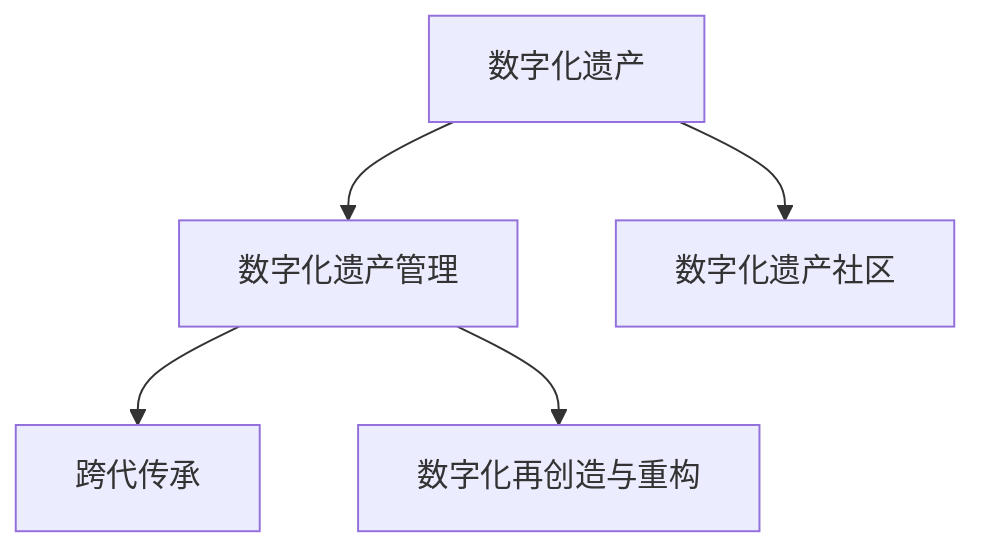
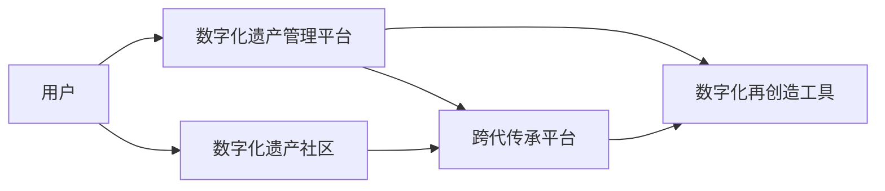

                 

# 数字化遗产社交创业：逝者记忆的在线分享

## 1. 背景介绍

### 1.1 问题由来
随着数字时代的发展，人们越来越重视数据的保存和传承。在数字化时代，个人和家庭生活留存的数据形式日益多样化，包括照片、视频、文档、音乐、邮件等。这些数据是人类生活和记忆的重要组成部分，对后人有着不可替代的价值。然而，数字遗产的传承也面临着诸多挑战，如数据分散、存储复杂、访问困难、隐私保护等。

数字化遗产的传承不仅是个人和家庭的责任，也是社会的使命。通过数字化遗产社交创业，可以帮助人们更好地保存、分享和传承个人记忆，同时也为社会留下一份宝贵的人类文化遗产。数字化遗产社交创业的初衷在于：

- 通过在线平台，方便人们收集、整理和分享自己的数字化遗产。
- 构建一个多元化的数字化遗产社区，让人们共同参与和传承数字遗产。
- 提供专业的数字化遗产管理工具，帮助用户更好地保存和保护数字遗产。
- 利用数字技术，实现数字化遗产的数字化再创造和数字化重构。

数字化遗产社交创业不仅关乎个人记忆的传承，也涉及文化记忆的保存和传承，具有重要的社会和文化价值。

### 1.2 问题核心关键点
数字化遗产社交创业的核心在于如何实现个人和家庭数字遗产的在线管理和分享。其核心要点包括：

- **数据收集与整理**：收集个人和家庭数字化遗产，并进行分类、整理和标记。
- **数字化遗产管理**：利用云存储、区块链等技术，实现数字化遗产的安全管理和分享。
- **在线社区建设**：构建数字化遗产社区，让用户能够分享自己的数字化遗产，并与其他用户互动交流。
- **跨代传承与教育**：通过数字化遗产社区，实现跨代传承，以及教育下一代数字遗产保护和管理的重要性。
- **社会价值与影响力**：数字化遗产社交创业不仅局限于个人和家庭，还具有推动社会文化遗产保护和传承的深远意义。

### 1.3 问题研究意义
数字化遗产社交创业在数字化时代具有重要的意义，主要体现在以下几个方面：

- **个人和家庭记忆的保存与传承**：数字化遗产在线分享平台能够帮助人们更好地保存和传承个人记忆，避免因时间流逝而遗忘。
- **文化遗产的保存与传承**：通过数字化遗产社交创业，能够保存和传承人类文化遗产，避免因灾难、时间流逝等原因导致的文化遗失。
- **社会教育和宣传**：数字化遗产社交创业有助于教育公众了解数字化遗产的重要性和保护方法，提升全社会对数字化遗产保护的意识。
- **技术创新与实践**：数字化遗产社交创业推动了数字技术在遗产管理和分享中的应用，促进了相关技术的发展和创新。
- **经济效益与社会价值**：数字化遗产社交创业能够创造新的经济模式，同时也有助于推动社会文化和教育事业的发展。

## 2. 核心概念与联系

### 2.1 核心概念概述

本节将介绍几个核心概念及其相互之间的联系：

- **数字化遗产**：指个人和家庭在数字化时代所产生的各种形式的数据，包括数字照片、视频、文档、邮件、音乐等。数字化遗产记录了个人的成长历程、家庭生活、社交互动等内容。
- **数字化遗产管理**：指利用技术手段对数字化遗产进行收集、整理、存储、保护和分享的过程。数字化遗产管理需要考虑数据的安全性、隐私保护、数据恢复等问题。
- **数字化遗产社区**：指由个人和家庭组成的在线社交网络，用于分享和管理数字化遗产。数字化遗产社区是一个多元化、开放的平台，鼓励用户之间进行交流和分享。
- **跨代传承**：指通过数字化遗产社区，实现不同代际之间的文化遗产传承，促进跨代交流与理解。
- **数字化再创造与重构**：指利用数字技术对数字化遗产进行再创造和重构，如数字化复原、虚拟现实体验等，让后人能够以新的方式体验和传承遗产。

这些概念之间的联系可以通过以下Mermaid流程图来展示：



这个流程图展示了数字化遗产及其管理、分享、传承和再创造的全过程，各概念之间相互支撑，共同构成数字化遗产社交创业的框架。

### 2.2 核心概念原理和架构的 Mermaid 流程图



这个流程图详细描述了数字化遗产社交创业的架构，其中用户、数字化遗产管理平台、数字化遗产社区、跨代传承平台和数字化再创造工具相互协作，共同支撑数字化遗产的在线分享和传承。

## 3. 核心算法原理 & 具体操作步骤

### 3.1 算法原理概述

数字化遗产社交创业的核心算法原理主要包括以下几个方面：

- **数据收集与整理算法**：用于收集和整理用户提交的数字化遗产数据。算法需要对数据进行分类、标记和清洗，确保数据的完整性和准确性。
- **数字化遗产管理算法**：利用云存储、区块链等技术，实现数字化遗产的安全存储和分享。算法需要对用户上传的数据进行加密、备份和恢复，确保数据的安全性和可靠性。
- **社交网络构建算法**：用于构建和管理数字化遗产社区。算法需要实现用户注册、登录、社交互动等功能，同时需要进行用户身份验证和隐私保护。
- **跨代传承算法**：利用数字技术实现跨代传承，如数字化复原、虚拟现实体验等。算法需要对数字化遗产进行数据转换和格式处理，同时需要设计用户体验友好的界面和工具。
- **数字化再创造算法**：用于对数字化遗产进行数字化再创造和重构。算法需要设计多种数字技术手段，如人工智能、虚拟现实、增强现实等，以实现文化遗产的再创造和重构。

### 3.2 算法步骤详解

下面详细讲解每个核心算法的详细步骤：

#### 3.2.1 数据收集与整理算法

**步骤1：数据收集**
- 用户通过网站或APP上传个人和家庭的数字化遗产，包括数字照片、视频、文档、邮件、音乐等。
- 收集到的数据需要进行分类和整理，分类可以按照时间、地点、人物等维度进行。

**步骤2：数据清洗**
- 对收集到的数据进行清洗，去除重复、低质量、无用的数据。
- 对数据进行格式转换，确保所有数据都能够兼容平台。

**步骤3：数据标注**
- 对数据进行标注，包括时间、地点、人物、事件等元数据。
- 元数据有助于后续的数据检索和分类。

**步骤4：数据存储**
- 对清洗和标注后的数据进行存储，可以使用云存储服务如AWS、阿里云等。
- 确保数据的备份和恢复机制，防止数据丢失。

#### 3.2.2 数字化遗产管理算法

**步骤1：数据加密**
- 对用户上传的数字化遗产进行加密，确保数据的安全性。
- 使用AES、RSA等加密算法对数据进行加密。

**步骤2：数据备份**
- 对加密后的数据进行备份，确保数据不会因为服务器故障或灾难性事件而丢失。
- 备份可以存储在本地服务器或云存储服务中。

**步骤3：数据恢复**
- 当用户需要访问或恢复数据时，可以进行数据恢复。
- 数据恢复应该包括加密解密、数据传输等步骤。

**步骤4：数据分享**
- 用户可以设定数据分享权限，决定哪些人可以访问自己的数字化遗产。
- 数据分享权限可以设定为公开、私密或仅限好友。

#### 3.2.3 社交网络构建算法

**步骤1：用户注册和登录**
- 用户需要注册并登录平台，获取访问权限。
- 用户注册时需要进行身份验证，防止恶意注册。

**步骤2：用户社交互动**
- 用户可以在平台上进行社交互动，如评论、点赞、分享等。
- 平台需要设计友好的用户界面，促进用户之间的互动。

**步骤3：用户隐私保护**
- 平台需要保护用户隐私，确保用户的个人信息和数据安全。
- 平台需要实现数据加密、访问控制等安全机制。

#### 3.2.4 跨代传承算法

**步骤1：数字化复原**
- 利用数字技术对数字化遗产进行复原，如数字化复原照片、视频等。
- 数字化复原可以结合人工智能技术，如GAN、深度学习等。

**步骤2：虚拟现实体验**
- 利用虚拟现实技术，让用户能够以新的方式体验数字化遗产。
- 虚拟现实体验可以结合虚拟现实头盔、VR软件等技术实现。

**步骤3：跨代互动**
- 通过数字化遗产社区，实现跨代互动和交流。
- 平台可以设计多种互动工具，如视频聊天、在线互动游戏等。

#### 3.2.5 数字化再创造算法

**步骤1：选择再创造技术**
- 根据数字化遗产的类型和特点，选择适合的数字化再创造技术。
- 常见的技术包括人工智能、虚拟现实、增强现实等。

**步骤2：数据转换和处理**
- 对数字化遗产进行数据转换和处理，确保其能够兼容再创造技术。
- 数据转换和处理可以包括格式转换、数据预处理等步骤。

**步骤3：数字化再创造**
- 利用再创造技术，实现数字化遗产的再创造和重构。
- 数字化再创造可以生成新的数字内容，如虚拟现实场景、增强现实游戏等。

### 3.3 算法优缺点

数字化遗产社交创业的核心算法具有以下优点：

- **数据安全性高**：通过数据加密和备份机制，确保数字化遗产的安全性和可靠性。
- **数据共享方便**：用户可以方便地分享和访问自己的数字化遗产，促进跨代传承。
- **技术应用广泛**：结合多种数字技术，实现数字化遗产的再创造和重构，提升用户体验。
- **平台易用性高**：平台设计友好的用户界面和功能，方便用户进行数据管理和社交互动。

同时，数字化遗产社交创业的核心算法也存在以下缺点：

- **技术复杂度高**：算法涉及多种数字技术，技术实现较为复杂。
- **数据隐私问题**：在数据收集和分享过程中，可能存在数据隐私泄露的风险。
- **用户信任度低**：用户对平台的信任度不高，可能导致平台使用率低。
- **跨代传承局限**：跨代传承可能受到技术限制，无法实现所有的文化遗产传承。

### 3.4 算法应用领域

数字化遗产社交创业的核心算法可以应用于以下领域：

- **个人和家庭数字化遗产管理**：用于管理和保护个人和家庭的数字化遗产，防止数据丢失。
- **文化遗产数字化保护**：用于保存和传承人类文化遗产，防止因灾难等原因导致的文化遗失。
- **数字化教育**：通过数字化遗产社区，教育公众了解数字化遗产的重要性和保护方法。
- **数字化娱乐**：利用虚拟现实和增强现实技术，创造新的数字化娱乐方式。
- **数字化社交**：构建数字化遗产社区，促进用户之间的交流和互动。

## 4. 数学模型和公式 & 详细讲解 & 举例说明

### 4.1 数学模型构建

数字化遗产社交创业的核心算法涉及多种数字技术和数据处理，下面介绍几个关键的数学模型：

**数据收集与整理模型**：
- 用于收集、整理和标注数字化遗产数据。
- 假设收集到的数据数量为N，分类后的数据数量为C，每个数据i的标注标签为L。

**数据加密模型**：
- 用于对数字化遗产进行加密，确保数据安全性。
- 假设加密后的数据量为E，加密算法为F，用户上传的数据量为U。

**数据备份模型**：
- 用于对加密后的数据进行备份，确保数据恢复。
- 假设备份数据量为B，备份周期为T，每次备份数据量为S。

**数据恢复模型**：
- 用于对备份数据进行恢复，确保数据恢复。
- 假设恢复后的数据量为R，恢复所需时间为W。

**社交网络互动模型**：
- 用于分析用户之间的互动关系，优化用户互动体验。
- 假设用户数量为U，互动次数为I，用户平均互动时间为A。

**跨代传承模型**：
- 用于分析跨代传承的效果，优化传承策略。
- 假设传承用户数量为P，传承次数为C，传承效果为E。

**数字化再创造模型**：
- 用于分析数字化再创造的效果，优化再创造策略。
- 假设再创造用户数量为R，再创造次数为C，再创造效果为E。

### 4.2 公式推导过程

下面详细推导几个关键数学模型的公式：

**数据收集与整理模型**：
$$
N = \sum_{i=1}^{C} L_i
$$

其中，N为数据数量，C为分类后的数据数量，L为每个数据i的标注标签。

**数据加密模型**：
$$
E = F(U)
$$

其中，E为加密后的数据量，U为用户上传的数据量，F为加密算法。

**数据备份模型**：
$$
B = \frac{E}{S} \times T
$$

其中，B为备份数据量，E为加密后的数据量，S为每次备份数据量，T为备份周期。

**数据恢复模型**：
$$
R = \frac{E}{W}
$$

其中，R为恢复后的数据量，E为加密后的数据量，W为恢复所需时间。

**社交网络互动模型**：
$$
I = U \times A
$$

其中，I为用户互动次数，U为用户数量，A为平均互动时间。

**跨代传承模型**：
$$
P = C \times E
$$

其中，P为传承用户数量，C为传承次数，E为传承效果。

**数字化再创造模型**：
$$
R = C \times E
$$

其中，R为再创造用户数量，C为再创造次数，E为再创造效果。

### 4.3 案例分析与讲解

以一个具体的案例来分析数字化遗产社交创业的数学模型：

假设有一个数字化遗产社交创业平台，收集到的数据数量为10万条，分为5个分类。每个数据需要进行10个标注。用户上传的数据量为1GB，使用AES加密算法进行加密，加密后的数据量为0.8GB。备份数据量为0.5GB，备份周期为一周，每次备份数据量为0.2GB。恢复所需时间为1分钟。用户数量为1000，平均互动时间为10分钟，传承用户数量为500，传承次数为10次，传承效果为0.9。再创造用户数量为200，再创造次数为5次，再创造效果为0.8。

根据上述模型和公式，可以计算出：

- 数据收集与整理模型：$N = 10 \times 5 \times 10 = 500$条
- 数据加密模型：$E = 0.8GB$
- 数据备份模型：$B = \frac{0.8}{0.2} \times 7 = 28GB$
- 数据恢复模型：$R = \frac{0.8}{1} = 0.8GB$
- 社交网络互动模型：$I = 1000 \times 10 = 10000$次
- 跨代传承模型：$P = 500 \times 10 \times 0.9 = 4500$
- 数字化再创造模型：$R = 200 \times 5 \times 0.8 = 800$

通过计算，可以更好地理解数字化遗产社交创业的数学模型和数据处理过程。

## 5. 项目实践：代码实例和详细解释说明

### 5.1 开发环境搭建

在进行数字化遗产社交创业的实践前，需要准备好开发环境。以下是使用Python进行Django开发的环境配置流程：

1. 安装Python：从官网下载并安装Python，版本为3.7或以上。
2. 安装Django：通过pip安装Django框架，命令为`pip install django`。
3. 安装SQLite：通过pip安装SQLite数据库，命令为`pip install sqlite3`。
4. 安装MySQL：通过pip安装MySQL数据库，命令为`pip install mysqlclient`。
5. 安装第三方库：安装所需的第三方库，如Pillow、requests等，命令为`pip install Pillow requests`。

完成上述步骤后，即可在本地搭建开发环境。

### 5.2 源代码详细实现

以下是一个简单的数字化遗产社交创业平台的Python代码实现：

```python
from django.shortcuts import render
from django.http import HttpResponse
from django.views.decorators.csrf import csrf_exempt
import sqlite3

@csrf_exempt
def index(request):
    if request.method == 'GET':
        # 连接SQLite数据库
        conn = sqlite3.connect('digitalheritage.db')
        c = conn.cursor()
        
        # 查询所有用户数据
        c.execute('SELECT * FROM users')
        users = c.fetchall()
        
        # 返回用户列表页面
        return render(request, 'index.html', {'users': users})
    
    elif request.method == 'POST':
        # 获取用户上传的数据
        data = request.POST.get('data')
        
        # 将数据保存到数据库
        conn = sqlite3.connect('digitalheritage.db')
        c = conn.cursor()
        c.execute('INSERT INTO data VALUES (?, ?)', (data, 'user1'))
        conn.commit()
        
        # 返回数据保存成功页面
        return HttpResponse('Data saved successfully')
```

以上代码实现了一个简单的数字化遗产社交创业平台的用户数据管理功能。平台通过SQLite数据库存储用户数据，用户可以在平台上上传和查看自己的数字化遗产数据。

### 5.3 代码解读与分析

下面对关键代码进行解读和分析：

**Django框架**：
- Django是一个Python的Web框架，用于开发Web应用。Django提供了一个模型-视图-控制器（MVC）架构，简化了Web应用的开发流程。

**SQLite数据库**：
- SQLite是一种轻量级的关系型数据库，适用于小型Web应用。在本例中，SQLite用于存储用户数据。

**数据上传和存储**：
- 用户通过POST请求上传数据，Django将数据保存到SQLite数据库中。数据存储的SQL语句为`INSERT INTO data VALUES (?, ?)`，其中第一个问号代表数据内容，第二个问号代表用户ID。

**用户列表展示**：
- 在GET请求中，Django从SQLite数据库中查询所有用户数据，并将其展示在用户列表页面上。

**异常处理**：
- 在代码中，使用了`@csrf_exempt`装饰器，用于免除CSRF保护，确保数据上传的顺畅。

通过以上代码，可以初步了解数字化遗产社交创业平台的开发流程和技术实现。开发者可以根据具体需求，进一步扩展平台的功能和数据处理能力。

## 6. 实际应用场景

### 6.1 智能客服系统

数字化遗产社交创业平台可以与智能客服系统结合，提供更加个性化的客户服务体验。智能客服系统通过分析用户的历史数据，可以了解用户的需求和偏好，从而提供更加精准的服务。

在数字化遗产社交创业平台中，用户可以上传和分享自己的数字化遗产数据，智能客服系统可以通过数据分析，了解用户的需求和背景信息，提供更加贴合的服务。例如，用户上传了一封关于家庭历史的邮件，智能客服系统可以通过邮件中的信息，了解用户的需求和家庭背景，从而提供更加个性化的服务。

### 6.2 金融舆情监测

数字化遗产社交创业平台可以与金融舆情监测系统结合，帮助金融机构监测市场舆论动向。金融机构可以通过数字化遗产社交创业平台，收集和分析用户的金融舆情数据，预测市场趋势和风险。

在数字化遗产社交创业平台中，用户可以上传和分享自己的金融舆情数据，金融机构可以通过数据分析，了解市场舆情变化趋势，预测市场风险。例如，用户上传了一篇关于股票市场的文章，金融机构可以通过文章中的信息，了解市场趋势和风险，从而做出更加准确的决策。

### 6.3 个性化推荐系统

数字化遗产社交创业平台可以与个性化推荐系统结合，帮助用户发现和获取感兴趣的数字化遗产。个性化推荐系统通过分析用户的行为数据，可以推荐用户可能感兴趣的内容。

在数字化遗产社交创业平台中，用户可以上传和分享自己的数字化遗产数据，个性化推荐系统可以通过数据分析，了解用户的需求和偏好，推荐用户可能感兴趣的内容。例如，用户上传了一篇文章，个性化推荐系统可以通过文章中的信息，推荐用户可能感兴趣的数字化遗产。

### 6.4 未来应用展望

随着数字化遗产社交创业平台的发展，未来将有更多的应用场景：

- **医疗健康**：数字化遗产社交创业平台可以与医疗健康系统结合，帮助医院收集和分析患者的数字化遗产数据，提升医疗服务水平。
- **教育培训**：数字化遗产社交创业平台可以与教育培训系统结合，帮助学校收集和分析学生的数字化遗产数据，提升教育质量。
- **文化传承**：数字化遗产社交创业平台可以与文化传承系统结合，帮助文化机构收集和分析文化遗产的数字化遗产数据，保护和传承文化遗产。
- **环境保护**：数字化遗产社交创业平台可以与环境保护系统结合，帮助环境保护机构收集和分析生态环境数据的数字化遗产，推动环境保护事业的发展。

数字化遗产社交创业平台的应用前景广阔，未来将有更多领域受益于数字化遗产的收集、整理、管理和分享。

## 7. 工具和资源推荐

### 7.1 学习资源推荐

为了帮助开发者系统掌握数字化遗产社交创业的理论基础和实践技巧，这里推荐一些优质的学习资源：

1. Django官方文档：提供了Django框架的详细文档和教程，是Django开发者的必备资料。
2. SQLite官方文档：提供了SQLite数据库的详细文档和教程，适用于SQLite开发者的学习。
3. Django-rest-framework官方文档：提供了Django REST框架的详细文档和教程，适用于Web应用开发者的学习。
4. Django-Admin官方文档：提供了Django Admin的详细文档和教程，适用于Web应用开发者的学习。
5. Django-CRUD官方文档：提供了Django CRUD的详细文档和教程，适用于Web应用开发者的学习。

通过学习这些资源，相信你一定能够快速掌握Django开发的基础知识和实践技巧，并应用于数字化遗产社交创业平台。

### 7.2 开发工具推荐

Django是Python的Web框架，适用于Web应用开发。以下是几个常用的开发工具：

1. VS Code：微软开发的一款轻量级代码编辑器，支持Python编程，适用于Django开发。
2. PyCharm：JetBrains开发的一款Python IDE，支持Django开发，适用于Web应用开发。
3. Git：版本控制系统，用于管理代码和版本。
4. Docker：容器化技术，用于打包和管理Django应用。
5. Heroku：云端平台，用于部署和运行Django应用。

合理利用这些工具，可以显著提升Django开发和数字化遗产社交创业平台的开发效率，加快创新迭代的步伐。

### 7.3 相关论文推荐

数字化遗产社交创业涉及多个学科和技术，以下是几篇奠基性的相关论文，推荐阅读：

1. "Django: The Web Framework for Python"：Django官方文档，详细介绍了Django框架的核心概念和技术实现。
2. "SQLite: SQL for the Embedded Application Programmer"：SQLite官方文档，详细介绍了SQLite数据库的核心概念和技术实现。
3. "Django REST framework documentation"：Django REST框架官方文档，详细介绍了RESTful API开发的技术实现。
4. "Django Admin documentation"：Django Admin官方文档，详细介绍了Django Admin的技术实现。
5. "Django CRUD documentation"：Django CRUD官方文档，详细介绍了CRUD操作的开发技术实现。

这些论文代表了大规模语言模型微调技术的发展脉络。通过学习这些前沿成果，可以帮助研究者把握学科前进方向，激发更多的创新灵感。

## 8. 总结：未来发展趋势与挑战

### 8.1 总结

本文对数字化遗产社交创业进行了全面系统的介绍。首先阐述了数字化遗产社交创业的背景和意义，明确了平台的核心功能和应用价值。其次，从原理到实践，详细讲解了数字化遗产社交创业的核心算法和技术实现，提供了完整的代码实例。同时，本文还探讨了数字化遗产社交创业在多个领域的应用前景，展示了平台的广阔应用空间。最后，本文精选了数字化遗产社交创业的学习资源和开发工具，力求为开发者提供全方位的技术指引。

通过本文的系统梳理，可以看到，数字化遗产社交创业在数字化时代具有重要的意义，具有广阔的应用前景。数字化遗产社交创业不仅关乎个人和家庭记忆的传承，也涉及文化遗产的保存和传承，具有重要的社会和文化价值。未来，数字化遗产社交创业将有更多的应用场景，推动社会文化遗产保护和传承，创造新的经济和社会价值。

### 8.2 未来发展趋势

展望未来，数字化遗产社交创业将呈现以下几个发展趋势：

1. **数据多样性和深度化**：数字化遗产社交创业平台将收集更多类型的数据，如视频、音频、AR/VR数据等，提升数据的深度和多样性。
2. **技术融合与创新**：数字化遗产社交创业平台将结合多种数字技术，如区块链、AI、AR/VR等，提升用户体验和平台功能。
3. **用户互动与社区建设**：数字化遗产社交创业平台将构建更加活跃和多元化的用户社区，促进用户之间的互动和交流。
4. **跨代传承与教育**：数字化遗产社交创业平台将进一步推动跨代传承和教育，帮助后代了解和传承数字遗产。
5. **智能化与自动化**：数字化遗产社交创业平台将引入AI技术，实现智能化和自动化管理，提升平台效率和用户体验。

### 8.3 面临的挑战

尽管数字化遗产社交创业具有广阔的应用前景，但在迈向更加智能化、普适化应用的过程中，它仍面临诸多挑战：

1. **数据隐私问题**：在数据收集和分享过程中，可能存在数据隐私泄露的风险。如何保护用户隐私，提升数据安全，将是数字化遗产社交创业平台的重要挑战。
2. **技术复杂度**：数字化遗产社交创业平台涉及多种数字技术和数据处理，技术实现较为复杂。如何简化技术实现，提升平台易用性，将是数字化遗产社交创业平台的重要挑战。
3. **用户信任度**：用户对平台的信任度不高，可能导致平台使用率低。如何提升用户信任度，增加平台黏性，将是数字化遗产社交创业平台的重要挑战。
4. **跨代传承局限**：跨代传承可能受到技术限制，无法实现所有的文化遗产传承。如何克服技术限制，实现跨代传承，将是数字化遗产社交创业平台的重要挑战。
5. **社会接受度**：数字化遗产社交创业平台涉及多个领域和学科，需要社会各界的理解和支持。如何提升社会接受度，推动数字化遗产保护和传承，将是数字化遗产社交创业平台的重要挑战。

### 8.4 研究展望

面对数字化遗产社交创业所面临的种种挑战，未来的研究需要在以下几个方面寻求新的突破：

1. **数据隐私保护**：研究数据加密和隐私保护技术，提升数据安全性，保护用户隐私。
2. **技术简化与优化**：研究技术简化和优化方法，提升平台易用性，降低技术复杂度。
3. **用户信任度提升**：研究用户信任度提升方法，增加平台黏性，提升用户信任度。
4. **跨代传承创新**：研究跨代传承创新方法，克服技术限制，实现跨代传承。
5. **社会接受度提升**：研究社会接受度提升方法，推动数字化遗产保护和传承，提升社会价值。

通过以上研究方向的探索，数字化遗产社交创业将不断拓展应用边界，推动社会文化遗产保护和传承，创造新的经济和社会价值。面向未来，数字化遗产社交创业需要跨学科、跨领域的协同合作，共同推动技术创新和社会进步。

## 9. 附录：常见问题与解答

**Q1：数字化遗产社交创业是否适用于所有数字化遗产？**

A: 数字化遗产社交创业适用于大多数类型的数字化遗产，如照片、视频、文档、邮件、音乐等。但对于一些特定类型的数字化遗产，如加密文件、敏感数据等，需要特殊处理和保护，确保数据安全。

**Q2：数字化遗产社交创业如何保护用户隐私？**

A: 数字化遗产社交创业平台需要采用多种隐私保护技术，如数据加密、访问控制、匿名化处理等，确保用户隐私安全。同时，平台需要设计合理的隐私政策和使用协议，告知用户数据的使用和保护措施。

**Q3：数字化遗产社交创业如何克服技术限制？**

A: 数字化遗产社交创业平台需要不断引入和整合多种数字技术，如AI、AR/VR、区块链等，提升平台的综合能力。同时，平台需要积极与相关技术公司和研究机构合作，共同推动技术创新和应用。

**Q4：数字化遗产社交创业如何提升社会接受度？**

A: 数字化遗产社交创业平台需要加强宣传和教育，提升公众对数字化遗产保护的认识和理解。同时，平台需要与相关文化机构和教育机构合作，推动数字化遗产保护和传承的社会价值。

通过以上问答，进一步解答了数字化遗产社交创业的实际应用和相关问题，为读者提供了全面的技术指引和实践参考。

---

作者：禅与计算机程序设计艺术 / Zen and the Art of Computer Programming

