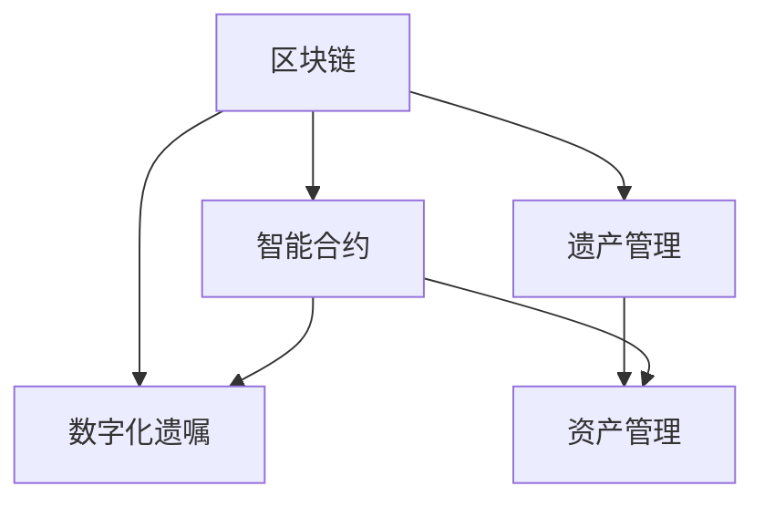

                 

# 数字化遗嘱创业：区块链在遗产管理中的应用

> 关键词：区块链, 数字化遗嘱, 遗产管理, 智能合约, 去中心化, 隐私保护, 资产管理

## 1. 背景介绍

在现代社会中，遗产管理已成为人们越来越关注的问题。随着经济的发展和财富的积累，人们对于财产的传承和管理有了更高的要求。传统的遗产管理方式存在诸多问题，如遗嘱有效性争议、财产分配不均、隐私泄露等。这些问题不仅给家庭带来了巨大的痛苦，也对社会稳定和经济发展产生了负面影响。

区块链技术的出现，为解决这些遗产管理问题提供了一种全新的可能性。区块链的去中心化、不可篡改、透明性和可追溯性等特性，为数字化遗嘱和遗产管理提供了可靠的技术支持。数字化遗嘱通过智能合约等技术手段，能够确保遗嘱的执行和财产的有效分配，同时保护遗嘱执行的隐私和安全性。

## 2. 核心概念与联系

### 2.1 核心概念概述

为更好地理解区块链在遗产管理中的应用，本节将介绍几个密切相关的核心概念：

- **区块链**：一种去中心化的分布式账本技术，通过节点之间的共识机制，实现数据的透明、不可篡改和可追溯。
- **智能合约**：一种运行在区块链上的程序，用于自动执行、控制或文档记录合约中的条款。
- **数字化遗嘱**：通过智能合约技术实现的遗嘱，能够在指定条件下自动执行，保障遗嘱的执行力和隐私性。
- **遗产管理**：涉及财产的分配、继承、管理和保护等过程，是数字化遗嘱应用的核心场景。
- **去中心化**：无需中心服务器，所有参与方通过网络节点直接进行交互和通信。
- **隐私保护**：保护遗嘱执行和财产分配过程中的敏感信息，防止信息泄露。
- **资产管理**：涉及各类财产的管理、跟踪和保护，是遗产管理的重要组成部分。

这些核心概念之间的逻辑关系可以通过以下Mermaid流程图来展示：



这个流程图展示了几者之间的关系：

1. 区块链提供底层技术支持，智能合约在此基础上实现业务逻辑。
2. 数字化遗嘱通过智能合约自动执行，是遗产管理的关键应用之一。
3. 遗产管理涉及财产的管理和保护，数字化遗嘱和智能合约是实现这一过程的重要工具。
4. 资产管理是遗产管理的一部分，智能合约提供对财产的精确控制和管理。

## 3. 核心算法原理 & 具体操作步骤
### 3.1 算法原理概述

数字化遗嘱和遗产管理中的区块链应用，主要依赖智能合约的执行来实现。智能合约是运行在区块链上的程序，能够自动执行、控制或记录合同条款。数字化遗嘱通过智能合约，能够实现遗嘱的自动执行和财产的精确分配。

具体而言，智能合约通过预设的条件触发执行，如遗嘱的生效条件、继承人的资格等。在满足预设条件时，智能合约自动执行遗嘱条款，确保财产按照遗嘱的意愿进行分配。

### 3.2 算法步骤详解

数字化遗嘱的实现步骤如下：

**Step 1: 编写遗嘱智能合约**
- 遗嘱智能合约需要定义遗嘱条款、继承人资格、执行条件等，并根据法律要求进行编写。
- 使用Solidity等编程语言编写智能合约代码，确保代码的准确性和可执行性。

**Step 2: 部署智能合约**
- 将编写的智能合约代码部署到区块链网络，通常需要支付一定的费用。
- 确保智能合约在区块链上被正确部署，并记录在区块链的区块中。

**Step 3: 编写遗嘱文档**
- 遗嘱文档需要包括遗嘱条款、继承人信息、遗嘱生效条件等，并确保文档内容的真实性。
- 使用非对称加密技术对遗嘱文档进行加密，确保其机密性和完整性。

**Step 4: 提交遗嘱文档**
- 将加密后的遗嘱文档提交到智能合约的执行环境中。
- 智能合约对遗嘱文档进行验证，确保其符合预设条件。

**Step 5: 执行遗嘱**
- 在满足预设条件时，智能合约自动执行遗嘱条款，完成财产的分配。
- 分配结果记录在区块链上，确保其不可篡改和可追溯。

### 3.3 算法优缺点

区块链技术在数字化遗嘱和遗产管理中的应用，具有以下优点：

- 去中心化：避免了中心服务器带来的单点故障，提高了系统的稳定性和可靠性。
- 不可篡改：一旦遗嘱被记录在区块链上，无法被篡改或删除，确保了遗嘱的有效性和权威性。
- 可追溯性：所有遗嘱操作和财产分配过程均有记录，能够追溯和验证。
- 隐私保护：使用非对称加密技术，保障了遗嘱文档的机密性和完整性。

同时，也存在一些缺点：

- 技术复杂性：区块链和智能合约技术需要较高的专业知识和编程技能。
- 交易成本：智能合约的部署和执行需要支付一定的费用，增加了使用成本。
- 执行效率：智能合约的执行过程相对较慢，可能影响系统的响应速度。

### 3.4 算法应用领域

区块链技术在数字化遗嘱和遗产管理中的应用，具有广泛的前景和潜力。除了传统的遗产管理外，还包括以下领域：

- **数字版权管理**：使用区块链记录版权信息，确保版权的归属和保护。
- **数字身份认证**：通过区块链实现数字身份认证和授权，保障身份信息的安全性。
- **供应链管理**：使用区块链记录供应链信息，确保产品和服务的真实性和可靠性。
- **知识产权保护**：使用区块链记录知识产权信息，保障知识产权的合法性和有效性。
- **金融交易**：使用区块链进行去中心化交易，提高交易的透明度和安全性。

## 4. 数学模型和公式 & 详细讲解 & 举例说明

### 4.1 数学模型构建

区块链的数学模型通常包括共识算法、加密算法、哈希函数等。以共识算法为例，常用的有PoW(工作量证明)和PoS(权益证明)等。

假设区块链网络中有N个节点，共识算法的基本过程如下：

1. 每个节点接收新的区块信息。
2. 节点通过哈希函数计算区块摘要。
3. 节点根据预设规则计算出新块的高度。
4. 节点通过PoW或PoS等共识算法选择新块的生成节点。
5. 新块的生成节点将区块信息广播给其他节点。
6. 其他节点验证新块的合法性。
7. 若合法，其他节点接受新块并更新本地区块链。

### 4.2 公式推导过程

以PoW共识算法为例，新块生成节点的选择过程如下：

设当前区块的高度为H，新区块的高度为H'，新区块生成节点选择的难度为D。则新区块生成节点需要满足以下条件：

1. 新区块难度D小于当前区块难度D0。
2. 新区块哈希值满足一定的哈希函数要求。
3. 新区块中的区块摘要符合要求。

具体而言，新区块生成节点的计算过程如下：

1. 计算新区块难度D'，满足D'<D0。
2. 计算新区块的区块摘要H'。
3. 计算新区块高度H'，满足H'>H。
4. 计算新区块哈希值H''，满足H''满足预设要求。
5. 若满足以上条件，则新区块生成节点成功，并广播新区块信息。

### 4.3 案例分析与讲解

假设有一个数字版权管理系统，使用区块链技术记录版权信息和交易过程。版权信息的存储过程如下：

1. 版权人将版权信息上传到区块链网络。
2. 版权信息经过哈希函数处理，生成区块摘要。
3. 区块摘要记录在区块链上，并根据PoW共识算法计算新区块。
4. 新块中的版权信息被记录，并广播给其他节点。
5. 其他节点验证新区块的合法性，并更新本地区块链。

这个过程确保了版权信息的透明、不可篡改和可追溯性，避免了版权侵权和非法交易。

## 5. 项目实践：代码实例和详细解释说明

### 5.1 开发环境搭建

在进行数字化遗嘱的实践前，我们需要准备好开发环境。以下是使用Python进行Solidity开发的流程：

1. 安装Solidity编译器：
```bash
npm install -g solc
```

2. 创建并激活虚拟环境：
```bash
conda create --name solidity-env python=3.8 
conda activate solidity-env
```

3. 安装Solidity开发工具：
```bash
pip install solc-web3
```

4. 安装Web3开发工具：
```bash
pip install web3
```

完成上述步骤后，即可在`solidity-env`环境中开始编写和测试智能合约。

### 5.2 源代码详细实现

以下是一个简单的遗嘱智能合约代码示例：

```solidity
// SPDX-License-Identifier: MIT
pragma solidity ^0.8.0;

contract MyWill {
    address public executor;
    bool public isExecuted;

    function execute(bool _isExecuted) public onlyOwner {
        isExecuted = _isExecuted;
        executor.send(0, 1 ether);
    }
    
    function executorIsBusy() public view returns (bool) {
        return isExecuted;
    }
    
    function addExecutor(address _executor) public onlyOwner {
        executor = _executor;
    }
}
```

### 5.3 代码解读与分析

让我们再详细解读一下关键代码的实现细节：

**MyWill智能合约**：
- `execute`方法：在遗嘱执行人满足执行条件时，调用此方法执行遗嘱条款，并将遗嘱执行资金发送给执行人。
- `executorIsBusy`方法：判断遗嘱执行人是否已经忙碌，防止重复执行。
- `addExecutor`方法：在遗嘱执行前，将遗嘱执行人地址设置为合约的执行者。

**示例代码**：
- 使用Solidity语言编写智能合约代码。
- 使用Solidity编译器编译合约代码。
- 使用Web3工具部署智能合约到区块链网络。

### 5.4 运行结果展示

假设我们部署了上述智能合约，并设置了遗嘱执行条件为“遗嘱执行人年龄达到18岁”。当遗嘱执行人达到18岁后，可以调用`execute`方法执行遗嘱。在满足条件后，智能合约将执行遗嘱条款，并将资金发送给遗嘱执行人。

```bash
$ solc MyWill.sol -o build/MyWill.build
$ myWill = web3.eth.getContract(MyWill.build.MyWill.address, MyWill.abi);
$ myWill.setExecutor(addressOfMyExecutor);
$ myWill.execute(false);
```

## 6. 实际应用场景

### 6.1 遗产管理

在遗产管理中，数字化遗嘱和智能合约技术可以确保遗嘱的有效性和执行力度。具体而言，数字化遗嘱通过智能合约自动执行，确保财产按照遗嘱的意愿进行分配，避免了遗嘱执行的争议和纠纷。

### 6.2 数字版权管理

在数字版权管理中，区块链技术可以确保版权信息的透明、不可篡改和可追溯性。版权人可以将版权信息上传至区块链，并设置相应的执行条件，确保版权信息的合法性和有效性。

### 6.3 数字身份认证

在数字身份认证中，区块链技术可以确保身份信息的真实性和保密性。用户可以使用区块链技术记录和管理自己的身份信息，并在需要时进行验证和授权。

### 6.4 未来应用展望

随着区块链技术的不断发展，数字化遗嘱和遗产管理将有更广泛的应用前景。未来，区块链技术将在以下领域得到进一步的应用：

- **供应链管理**：使用区块链记录供应链信息，确保产品和服务的真实性和可靠性。
- **金融交易**：使用区块链进行去中心化交易，提高交易的透明度和安全性。
- **知识产权保护**：使用区块链记录知识产权信息，保障知识产权的合法性和有效性。

区块链技术将在更多的应用场景中发挥作用，为数字化社会的建设提供技术支持。

## 7. 工具和资源推荐

### 7.1 学习资源推荐

为了帮助开发者系统掌握区块链在遗产管理中的应用，这里推荐一些优质的学习资源：

1. 《区块链原理与实践》书籍：系统介绍了区块链技术的基本原理和应用场景，适合初学者入门。
2. Solidity官方文档：Solidity语言的官方文档，提供了详细的智能合约开发教程和示例。
3. Web3官方文档：Web3工具的官方文档，提供了丰富的区块链开发工具和库。
4. Ethereum官方网站：Ethereum区块链的官方网站，提供了最新的技术更新和开发者资源。
5. 《智能合约安全》课程：由区块链安全专家授课，讲解智能合约开发中的常见安全问题和防御措施。

通过对这些资源的学习实践，相信你一定能够快速掌握区块链在遗产管理中的应用，并用于解决实际的业务问题。

### 7.2 开发工具推荐

高效的开发离不开优秀的工具支持。以下是几款用于区块链开发的常用工具：

1. Solidity编译器：用于将Solidity代码编译为以太坊虚拟机(VM)字节码。
2. Web3开发工具：用于开发和测试以太坊智能合约的开发环境。
3. Truffle框架：Ethereum开发的开源框架，提供了丰富的开发工具和库。
4. MetaMask钱包：基于Web3技术的钱包，支持以太坊和其它以太坊兼容区块链网络。
5. Remix开发环境：基于Web3的智能合约开发平台，支持Solidity和Vite普拉框架。

合理利用这些工具，可以显著提升区块链应用的开发效率，加快创新迭代的步伐。

### 7.3 相关论文推荐

区块链技术在遗产管理中的应用，还处于不断发展和探索中。以下是几篇奠基性的相关论文，推荐阅读：

1. "Ethereum: A Secure Blockchain-based Platform for Decentralized Applications"：Ethereum的官方论文，介绍了Ethereum区块链的基本架构和应用场景。
2. "Smart Contracts: A Survey of the Programming Paradigm"：关于智能合约编程的综述性论文，介绍了智能合约的基本概念和实现方法。
3. "Blockchain-based Digital Will: A Survey"：区块链技术在数字化遗嘱中的应用综述，介绍了数字化遗嘱的基本原理和实现技术。
4. "Decentralized Autonomy in Blockchain-based Digital Will"：探讨区块链在数字化遗嘱中的自治和可执行性，提出了几种自治模型。
5. "A Survey of Blockchain-Based Digital Identity Management"：区块链技术在数字身份管理中的应用综述，介绍了数字身份管理的概念和实现方法。

这些论文代表了大语言模型微调技术的发展脉络。通过学习这些前沿成果，可以帮助研究者把握学科前进方向，激发更多的创新灵感。

## 8. 总结：未来发展趋势与挑战

### 8.1 总结

本文对区块链在遗产管理中的应用进行了全面系统的介绍。首先阐述了数字化遗嘱和遗产管理的背景和重要性，明确了区块链技术在此领域的独特价值。其次，从原理到实践，详细讲解了数字化遗嘱的数学模型和操作步骤，给出了智能合约的代码实例。同时，本文还广泛探讨了区块链技术在遗产管理中的应用场景，展示了区块链技术的前景和潜力。此外，本文精选了区块链技术的各类学习资源，力求为读者提供全方位的技术指引。

通过本文的系统梳理，可以看到，区块链技术在遗产管理中的应用具有广阔的前景。通过智能合约等技术手段，区块链能够确保遗嘱的有效执行，保障财产的精确分配，同时保护遗嘱执行的隐私和安全性。未来，伴随区块链技术的不断演进，数字化遗嘱和遗产管理必将在更多的场景中得到应用，为遗产管理带来革命性的变革。

### 8.2 未来发展趋势

展望未来，区块链技术在遗产管理中的应用将呈现以下几个发展趋势：

1. 去中心化程度提升：未来区块链网络将进一步去中心化，提高系统的稳定性和安全性。
2. 交易速度和效率提高：通过优化共识算法和扩展技术，区块链的交易速度和效率将得到提升。
3. 多链互操作性增强：区块链之间的互操作性将得到增强，实现不同区块链网络之间的无缝协作。
4. 隐私保护技术发展：未来将涌现更多隐私保护技术，保障数据和信息的机密性。
5. 智能合约功能增强：未来智能合约将具备更丰富的功能和更灵活的编程方式，提升智能合约的实用性和可扩展性。

以上趋势凸显了区块链技术在遗产管理中的广阔前景。这些方向的探索发展，必将进一步提升数字化遗嘱和遗产管理系统的性能和应用范围，为遗产管理带来革命性的变革。

### 8.3 面临的挑战

尽管区块链技术在遗产管理中具有广阔的前景，但在迈向更加智能化、普适化应用的过程中，它仍面临着诸多挑战：

1. 技术复杂性：区块链和智能合约技术需要较高的专业知识和编程技能，入门门槛较高。
2. 交易成本：智能合约的部署和执行需要支付一定的费用，增加了使用成本。
3. 执行效率：智能合约的执行过程相对较慢，可能影响系统的响应速度。
4. 隐私保护：在遗产管理中，隐私保护是一个重要的需求，如何平衡隐私保护和信息公开是一个难题。
5. 法律监管：区块链技术在遗产管理中的应用还需要面对法律监管的问题，需要与现有法律体系相协调。

### 8.4 研究展望

面对区块链技术在遗产管理中面临的挑战，未来的研究需要在以下几个方面寻求新的突破：

1. 简化智能合约编程：开发更易用、更高效的智能合约编程工具，降低开发门槛，提高开发效率。
2. 降低交易成本：研究更高效的共识算法和扩展技术，降低智能合约的交易成本。
3. 提升执行效率：优化智能合约的执行机制，提高系统的响应速度。
4. 增强隐私保护：研究更多隐私保护技术，保障数据的机密性和完整性。
5. 加强法律监管：建立区块链技术的法律监管机制，确保技术应用的合法性和合规性。

这些研究方向将推动区块链技术在遗产管理中的进一步应用和发展，为数字化遗嘱和遗产管理带来更广阔的前景。

## 9. 附录：常见问题与解答

**Q1：数字身份认证在区块链技术中的应用有哪些优势？**

A: 数字身份认证在区块链技术中的应用具有以下优势：

1. 去中心化：避免了中心服务器带来的单点故障，提高了系统的稳定性和可靠性。
2. 不可篡改：一旦身份信息被记录在区块链上，无法被篡改或删除，确保了身份信息的真实性和权威性。
3. 隐私保护：使用非对称加密技术，保障了身份信息的机密性和完整性。
4. 可追溯性：所有身份操作和验证过程均有记录，能够追溯和验证。

**Q2：在区块链上部署智能合约需要考虑哪些因素？**

A: 在区块链上部署智能合约需要考虑以下因素：

1. 代码的正确性：确保智能合约代码的准确性和可执行性，避免智能合约的错误执行。
2. 安全性：智能合约需要考虑安全问题，避免智能合约的攻击和漏洞。
3. 效率：智能合约需要考虑执行效率，避免智能合约的执行过程中出现延迟。
4. 可扩展性：智能合约需要考虑可扩展性，避免智能合约的执行过程中出现性能瓶颈。
5. 法律合规性：智能合约需要考虑法律合规性，避免智能合约的执行过程中出现法律风险。

**Q3：如何提高区块链交易的速度和效率？**

A: 提高区块链交易的速度和效率可以从以下几个方面入手：

1. 优化共识算法：研究更高效的共识算法，提高区块链网络的交易速度。
2. 扩展技术：采用扩展技术，如分片、状态通道等，提高区块链网络的交易效率。
3. 智能合约优化：优化智能合约的执行机制，提高智能合约的执行效率。
4. 跨链技术：采用跨链技术，实现不同区块链网络之间的数据共享和互操作，提高交易效率。

**Q4：区块链技术在遗产管理中的应用有哪些优势？**

A: 区块链技术在遗产管理中的应用具有以下优势：

1. 去中心化：避免了中心服务器带来的单点故障，提高了系统的稳定性和可靠性。
2. 不可篡改：一旦遗产信息被记录在区块链上，无法被篡改或删除，确保了遗产信息的真实性和权威性。
3. 可追溯性：所有遗产操作和财产分配过程均有记录，能够追溯和验证。
4. 隐私保护：使用非对称加密技术，保障了遗产信息的机密性和完整性。

**Q5：区块链技术在数字版权管理中的应用有哪些优势？**

A: 区块链技术在数字版权管理中的应用具有以下优势：

1. 去中心化：避免了中心服务器带来的单点故障，提高了系统的稳定性和可靠性。
2. 不可篡改：一旦版权信息被记录在区块链上，无法被篡改或删除，确保了版权信息的真实性和权威性。
3. 可追溯性：所有版权操作和版权信息的变更均有记录，能够追溯和验证。
4. 隐私保护：使用非对称加密技术，保障了版权信息的机密性和完整性。

---

作者：禅与计算机程序设计艺术 / Zen and the Art of Computer Programming

