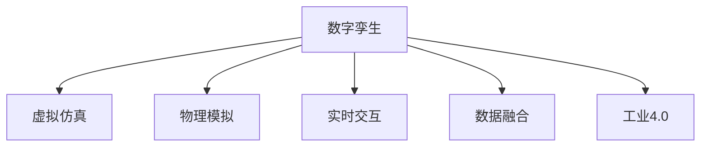

                 

# 数字孪生技术：虚拟世界与物理世界的桥梁

> 关键词：数字孪生,虚拟仿真,物理模拟,实时交互,数据融合,工业4.0

## 1. 背景介绍

### 1.1 问题由来
随着信息技术的迅猛发展，人类已经步入智能化的新时代，各行各业都在积极探索如何通过数字化手段提升生产效率和运营管理水平。数字孪生技术（Digital Twin）作为智能制造、智慧城市、智能运维等领域的关键技术，正在加速改变传统的工业运行方式和城市管理模式。

数字孪生技术融合了虚拟仿真、物联网(IoT)、人工智能(AI)、大数据等前沿技术，能够在虚拟空间中创建实体对象的精确复刻，实现对实体世界多维度信息的采集和分析，并在实时交互中动态反馈和优化，为决策者提供强大的决策支持。在制造业中，数字孪生可以驱动产品质量、生产效率、供应链管理的全面提升。在城市管理中，数字孪生可以优化交通、能源、环境等公共资源配置，提升城市治理能力和市民生活质量。

尽管数字孪生技术已经取得了显著成果，但在实际落地应用过程中，仍面临诸多挑战。数据采集精度、模型仿真精度、实时计算能力、人机交互体验等方面仍需进一步优化和提升。本文将详细探讨数字孪生的核心概念、算法原理、实施步骤，并通过实际案例展示其在各领域的广泛应用，最后提出未来技术的发展趋势和面临的挑战。

## 2. 核心概念与联系

### 2.1 核心概念概述

为更好地理解数字孪生技术，本节将介绍几个密切相关的核心概念：

- 数字孪生(Digital Twin)：通过虚拟仿真、数据融合、实时交互等技术，在虚拟空间中创建实体对象的精确复刻，实现对实体世界多维度信息的采集和分析。
- 虚拟仿真(Virtual Simulation)：通过软件和硬件技术，在虚拟空间中模拟真实世界的过程和状态，进行科学计算和数据可视化，为实体世界的运行和优化提供依据。
- 物理模拟(Physical Simulation)：通过物理定律和算法，在虚拟空间中模拟真实世界的物理过程，如流体、结构、热力学等，以验证和优化设计方案。
- 实时交互(Real-time Interaction)：通过交互界面和控制机制，使虚拟空间与实体世界实时同步，支持用户对虚拟环境的探索和操作。
- 数据融合(Data Fusion)：通过多源异构数据的集成和融合，构建全面、准确的实体世界模型，提升数据的质量和可用性。
- 工业4.0(Industry 4.0)：以智能制造、智慧城市、智能运维等为代表的数字化转型，实现信息物理系统的高度融合，推动生产和管理方式的变革。

这些核心概念之间的逻辑关系可以通过以下Mermaid流程图来展示：

这个流程图展示数字孪生的核心概念及其之间的关系：

1. 数字孪生通过虚拟仿真和物理模拟，创建实体对象的精确复刻。
2. 数据融合将多源异构数据集成，提升模型精度。
3. 实时交互支持虚拟世界与实体世界的动态反馈。
4. 工业4.0代表数字化转型的重要方向，数字孪生是其中关键技术之一。

这些概念共同构成了数字孪生的核心技术框架，使其能够在复杂系统中实现全面、动态的模拟和优化。

## 3. 核心算法原理 & 具体操作步骤
### 3.1 算法原理概述

数字孪生的核心算法原理主要涉及以下几个关键技术：

- 多源异构数据采集：通过传感器、物联网设备等手段，实时采集实体世界的各种数据，包括物理量、状态、行为等。
- 数据融合与处理：利用数据融合技术，对多源异构数据进行去重、清洗、归一化等处理，构建全面、准确的实体世界模型。
- 物理仿真与模拟：基于物理定律和仿真算法，在虚拟空间中模拟实体世界的物理过程，验证和优化设计方案。
- 实时计算与优化：通过实时计算和优化算法，对虚拟模型进行动态更新和优化，反映实体世界的变化。
- 人机交互与控制：通过交互界面和控制机制，实现虚拟世界与实体世界的实时交互，支持用户的操作和决策。

### 3.2 算法步骤详解

数字孪生的构建和应用通常包括以下几个关键步骤：

**Step 1: 数据采集与预处理**
- 选择合适的传感器和物联网设备，实时采集实体世界的各种数据，包括温度、压力、振动、位置等。
- 对采集到的数据进行去重、清洗、归一化等处理，构建统一、规范的数据格式。

**Step 2: 数据融合与建模**
- 使用数据融合技术，如卡尔曼滤波、粒子滤波等，对多源异构数据进行集成和融合，构建全面、准确的实体世界模型。
- 利用虚拟仿真工具，如ANSYS、Simulia等，建立虚拟空间中的实体对象模型。

**Step 3: 物理仿真与验证**
- 通过物理仿真算法，如有限元分析、分子动力学等，在虚拟空间中模拟实体世界的物理过程，验证和优化设计方案。
- 将仿真结果与实际测试结果进行对比，评估仿真精度和可靠性。

**Step 4: 实时计算与控制**
- 利用实时计算算法，如蒙特卡罗方法、动态规划等，对虚拟模型进行动态更新和优化，反映实体世界的变化。
- 通过实时计算结果，指导实体世界的运行和控制，提升生产效率和质量。

**Step 5: 人机交互与展示**
- 设计交互界面和控制机制，支持用户对虚拟世界的探索和操作。
- 利用数据可视化和图形界面技术，展示虚拟世界的状态和结果，支持用户进行数据分析和决策。

### 3.3 算法优缺点

数字孪生的构建和应用具有以下优点：

- 全面性：数字孪生可以全面、动态地反映实体世界的运行状态，提供多维度、全方位的信息支持。
- 实时性：数字孪生能够实现对实体世界的实时仿真和优化，支持动态决策和调整。
- 灵活性：数字孪生可以根据具体需求，灵活配置传感器、仿真算法等，满足不同场景的应用需求。
- 仿真精度：数字孪生结合物理仿真和数据融合技术，可以提供高精度的虚拟仿真结果，验证和优化实体世界的运行。

同时，数字孪生也存在一定的局限性：

- 数据采集精度：实体世界的数据采集精度和传输效率是制约数字孪生质量的关键因素。
- 仿真复杂度：物理仿真的复杂度和计算成本较高，需要高效算法和硬件支持。
- 实时计算能力：实时计算要求高性能计算资源，可能面临计算瓶颈。
- 用户交互体验：人机交互界面和体验设计需要精细化和个性化，提升用户的使用效果。

尽管存在这些局限性，但数字孪生技术仍然具有巨大的应用前景和发展潜力，在工业4.0、智慧城市、智能运维等领域发挥着越来越重要的作用。

### 3.4 算法应用领域

数字孪生技术已经在工业制造、智慧城市、智能运维等多个领域得到了广泛应用：

- 智能制造：通过数字孪生技术，可以实现设备的虚拟仿真、生产流程的优化、质量控制的全生命周期管理。
- 智慧城市：通过数字孪生技术，可以实现城市交通、能源、环境等公共资源的动态优化配置，提升城市治理能力和生活质量。
- 智能运维：通过数字孪生技术，可以实现设备的实时监控、故障诊断、预测性维护，提升运维效率和可靠性。

除了上述这些经典领域外，数字孪生技术还在更多场景中得到了创新应用，如智慧农业、智慧物流、智能建筑等，为各行各业带来了新的发展机遇。

## 4. 数学模型和公式 & 详细讲解  
### 4.1 数学模型构建

本节将使用数学语言对数字孪生技术的核心算法进行更加严格的刻画。

记实体对象为 $O$，在虚拟空间中创建其数字孪生 $O_t$，并通过多源异构数据 $D$ 对其进行实时监测和反馈。假设实体对象的状态函数为 $s_t$，控制函数为 $u_t$，则数字孪生的动态演化可以表示为：

$$
s_{t+1} = f(s_t,u_t)
$$

其中 $f$ 为状态转移函数，$u_t$ 为控制输入。数字孪生的目标是通过数据融合、物理仿真和实时计算，优化控制策略，使得实体对象 $O$ 的运行状态 $s_t$ 逼近理想状态。

### 4.2 公式推导过程

以智能制造中的数字孪生应用为例，推导数字孪生的动态优化模型。

假设实体对象为机床 $O$，其运行状态 $s_t$ 包括温度、压力、振动等物理量。通过传感器采集 $D$ 实时监测 $O$ 的状态，并通过数据融合技术 $F$ 得到状态向量 $s_t$。数字孪生 $O_t$ 通过物理仿真算法 $S$ 模拟 $O$ 的物理过程，并生成仿真结果 $s'_t$。

数字孪生的目标是通过控制输入 $u_t$ 调整 $O_t$ 的行为，使得 $s'_t$ 逼近理想状态 $s^*$。假设 $s_t$ 与 $s'_t$ 之间的误差函数为 $e_t = s_t - s'_t$，则数字孪生的优化目标为：

$$
\min_{u_t} \mathbb{E}[e^2_t]
$$

其中 $\mathbb{E}$ 表示对时间 $t$ 的期望。通过使用卡尔曼滤波、粒子滤波等算法进行数据融合和状态预测，得到 $s_t$ 的估计值 $\hat{s}_t$，则可以构建数字孪生的最小二乘控制问题：

$$
\min_{u_t} \mathbb{E}[(s_t - \hat{s}_t)^2]
$$

利用蒙特卡罗方法进行数值仿真，可以得到 $s'_t$ 的估计值 $\hat{s}'_t$，则可以构建数字孪生的最小二乘控制问题：

$$
\min_{u_t} \mathbb{E}[(s'_t - \hat{s}'_t)^2]
$$

通过求解上述最小二乘控制问题，得到最优的控制策略 $u_t^*$，并将其应用于实体对象 $O$ 的控制中，实现数字孪生的动态优化。

## 5. 项目实践：代码实例和详细解释说明
### 5.1 开发环境搭建

在进行数字孪生项目实践前，我们需要准备好开发环境。以下是使用Python进行Simulink开发的环境配置流程：

1. 安装Matlab：从官网下载并安装Matlab，获取Simulink等工具箱。
2. 安装MATLAB Support Package for Simulink, Embedded and FMI：在Simulink中安装需要的工具箱和模型库。
3. 安装Data Acquisition Toolbox：用于实时采集实体世界的各种数据，如温度、压力、振动等。
4. 安装Control System Toolbox：用于设计控制器和仿真算法。
5. 安装Optimization Toolbox：用于解决优化问题。

完成上述步骤后，即可在Matlab中开始数字孪生项目实践。

### 5.2 源代码详细实现

这里我们以智能制造中的数字孪生应用为例，给出使用Simulink进行数字孪生项目开发的详细代码实现。

**Step 1: 数据采集与预处理**

1. 连接实体世界中的传感器和物联网设备，实时采集机床 $O$ 的温度、压力、振动等数据。

2. 通过Data Acquisition Toolbox进行数据采集，将采集到的数据存储到数组 $D_t$ 中。

3. 对数据进行去重、清洗、归一化等处理，构建统一、规范的数据格式。

**Step 2: 数据融合与建模**

1. 使用粒子滤波算法对多源异构数据进行集成和融合，构建状态向量 $s_t$。

2. 利用Control System Toolbox中的模型参数化工具，建立机床 $O$ 的虚拟仿真模型 $O_t$。

**Step 3: 物理仿真与验证**

1. 通过有限元分析等物理仿真算法，在虚拟空间中模拟机床 $O$ 的物理过程，生成仿真结果 $s'_t$。

2. 将仿真结果与实际测试结果进行对比，评估仿真精度和可靠性。

**Step 4: 实时计算与控制**

1. 利用Optimization Toolbox中的最小二乘算法，求解数字孪生的最小二乘控制问题，得到最优的控制策略 $u_t^*$。

2. 通过Control System Toolbox中的控制器设计工具，设计控制算法，将最优控制策略 $u_t^*$ 应用于实体对象 $O$ 的控制中。

**Step 5: 人机交互与展示**

1. 设计交互界面和控制机制，支持用户对虚拟世界的探索和操作。

2. 利用图形界面技术，展示虚拟世界的状态和结果，支持用户进行数据分析和决策。

### 5.3 代码解读与分析

让我们再详细解读一下关键代码的实现细节：

**粒子滤波算法**：
- 定义粒子 $x_i$，初始化粒子数为 $N$，粒子的状态向量为 $x_i^0$。
- 通过数据融合算法，得到观测向量 $y_t$。
- 根据观测向量 $y_t$ 更新粒子的状态，得到新的粒子状态 $x_i^1$。
- 通过蒙特卡罗方法，生成新的粒子 $x_i^2$。
- 重复上述步骤，得到最终的粒子状态 $x_i^T$。

**有限元分析算法**：
- 定义实体对象的边界条件和载荷，建立有限元模型。
- 通过求解方程组，得到实体对象的应力和应变分布，生成仿真结果 $s'_t$。
- 将仿真结果 $s'_t$ 与实际测试结果进行对比，评估仿真精度和可靠性。

**最小二乘控制算法**：
- 定义状态函数 $s_t$ 和控制函数 $u_t$，构建数字孪生的最小二乘控制问题。
- 通过求解优化问题，得到最优的控制策略 $u_t^*$。
- 将最优控制策略 $u_t^*$ 应用于实体对象 $O$ 的控制中，实现数字孪生的动态优化。

### 5.4 运行结果展示

在实际应用中，数字孪生的运行结果通常包括：

- 实时监测数据：通过交互界面展示实体世界的运行状态，支持用户实时查看和分析。
- 仿真结果：通过图形界面展示虚拟仿真结果，支持用户进行对比和优化。
- 控制策略：通过控制算法生成最优控制策略，支持用户对实体对象进行动态调整。

通过数字孪生的运行结果，用户可以全面、实时地了解实体世界的运行状态和性能，进行动态优化和决策。

## 6. 实际应用场景
### 6.1 智能制造

在智能制造中，数字孪生技术可以全面提升生产效率和质量，优化供应链管理。具体而言，数字孪生可以用于：

- 设备监控与故障诊断：通过实时监测设备运行状态，及时发现设备异常，进行预测性维护。
- 生产流程优化：通过虚拟仿真和实时计算，优化生产流程，提高生产效率和质量。
- 质量控制：通过虚拟仿真和数据融合，实时反馈产品质量，进行缺陷检测和修复。

### 6.2 智慧城市

在智慧城市中，数字孪生技术可以优化交通、能源、环境等公共资源的配置，提升城市治理能力和生活质量。具体而言，数字孪生可以用于：

- 交通管理：通过虚拟仿真和实时计算，优化交通流量，减少拥堵和事故。
- 能源管理：通过虚拟仿真和数据融合，优化能源配置，降低能耗和成本。
- 环境监测：通过虚拟仿真和实时计算，监测环境变化，进行污染治理和生态保护。

### 6.3 智能运维

在智能运维中，数字孪生技术可以全面提升设备的运行效率和可靠性，优化维护成本。具体而言，数字孪生可以用于：

- 设备监控与维护：通过实时监测设备运行状态，进行故障预测和预防性维护。
- 设备优化设计：通过虚拟仿真和数据融合，优化设备设计方案，提升性能和可靠性。
- 数据融合与决策：通过数据融合技术，集成多源异构数据，支持精准的决策和控制。

### 6.4 未来应用展望

随着数字孪生技术的发展，其应用场景将不断扩展，涵盖更多行业和领域。未来数字孪生的发展趋势可能包括：

- 更多领域的应用：数字孪生技术将逐步拓展到医疗、教育、农业等多个领域，提供更全面、精准的服务。
- 多模态融合：数字孪生技术将结合视觉、语音、传感器等多种数据源，实现全面的数据融合和优化。
- 智能化决策：数字孪生技术将通过人工智能算法，进行更智能的决策和控制，提升整体系统的性能和效率。
- 实时化部署：数字孪生技术将实现更高效的实时计算和控制，支持实时化的应用场景。
- 跨领域协同：数字孪生技术将通过云平台和数据共享机制，实现跨领域的协同和集成，推动产业的协同创新。

## 7. 工具和资源推荐
### 7.1 学习资源推荐

为了帮助开发者系统掌握数字孪生的理论基础和实践技巧，这里推荐一些优质的学习资源：

1. 《数字孪生技术及其应用》系列博文：由数字孪生技术专家撰写，深入浅出地介绍了数字孪生的基本概念和实际应用。

2. 《数字孪生理论与实践》课程：斯坦福大学开设的数字孪生课程，涵盖数字孪生的理论基础和实践技巧，适合初学者和专业人士。

3. 《数字孪生：从概念到实践》书籍：全面介绍了数字孪生的基本概念、核心算法和应用案例，是学习数字孪生的重要参考资料。

4. Simulink官方文档：Simulink官方文档提供了完整的数字孪生工具链和示例代码，是数字孪生开发的必备资源。

5. MATLAB Simulink Cloud：免费的在线Simulink环境，支持云计算和协同开发，方便开发者快速上手实验最新模型。

通过对这些资源的学习实践，相信你一定能够快速掌握数字孪生的精髓，并用于解决实际的数字孪生问题。

### 7.2 开发工具推荐

高效的开发离不开优秀的工具支持。以下是几款用于数字孪生开发的常用工具：

1. Simulink：由MathWorks开发的Simulink，是数字孪生开发的理想平台，支持多学科建模、仿真和控制。

2. Python：Python的Sympy、SciPy、NumPy等库提供了强大的数学计算和仿真工具，支持数字孪生算法开发。

3. MATLAB：MATLAB的Simulink、Optimization Toolbox、Data Acquisition Toolbox等工具箱，提供了全面的数字孪生开发环境。

4. Autodesk Inventor：Autodesk Inventor提供了全面的虚拟仿真工具，支持三维模型的设计、仿真和分析。

5. Open CASCADE：Open CASCADE提供了高效的三维几何计算工具，支持数字孪生中的几何建模和仿真。

合理利用这些工具，可以显著提升数字孪生开发和实验的效率，加快创新迭代的步伐。

### 7.3 相关论文推荐

数字孪生技术的发展源于学界的持续研究。以下是几篇奠基性的相关论文，推荐阅读：

1. Digital Twin Technology: A Survey on Models, Technologies, and Applications：概述数字孪生技术的发展历程和应用场景，是数字孪生领域的重要综述。

2. Digital Twin for Smart Manufacturing: A Review and Future Directions：总结了数字孪生技术在智能制造中的应用现状和未来趋势，是智能制造领域的重要综述。

3. Digital Twin for Smart Cities: A Review and Future Directions：总结了数字孪生技术在智慧城市中的应用现状和未来趋势，是智慧城市领域的重要综述。

4. Digital Twin for Smart Maintenance: A Review and Future Directions：总结了数字孪生技术在智能运维中的应用现状和未来趋势，是智能运维领域的重要综述。

这些论文代表了大规模语言模型微调技术的发展脉络。通过学习这些前沿成果，可以帮助研究者把握学科前进方向，激发更多的创新灵感。

## 8. 总结：未来发展趋势与挑战
### 8.1 总结

本文对数字孪生技术的核心概念、算法原理、实施步骤进行了全面系统的介绍。首先阐述了数字孪生的基本概念和应用场景，明确了数字孪生在智能制造、智慧城市、智能运维等领域的重要价值。其次，从原理到实践，详细讲解了数字孪生的数学模型和核心算法，并通过实际案例展示其在各领域的广泛应用，最后提出未来技术的发展趋势和面临的挑战。

通过本文的系统梳理，可以看到，数字孪生技术正在成为智能制造、智慧城市、智能运维等领域的重要技术手段，极大地提升了生产效率和运营管理水平。数字孪生技术的广泛应用，也使得各行各业逐步迈向智能化、数字化转型，为经济发展和社会进步注入了新的动力。

### 8.2 未来发展趋势

展望未来，数字孪生技术将呈现以下几个发展趋势：

1. 更高精度的虚拟仿真：未来的数字孪生将通过更高级的仿真算法和模型，实现更高精度的虚拟仿真，提升仿真精度和效率。

2. 更广泛的数据融合：未来的数字孪生将支持更多数据源的融合，包括图像、语音、传感器数据等，实现更全面的数据融合和分析。

3. 更智能的决策支持：未来的数字孪生将结合人工智能算法，进行更智能的决策和控制，支持动态优化和自适应调整。

4. 更高效的实时计算：未来的数字孪生将通过分布式计算和边缘计算，实现更高效的实时计算和控制，支持实时化的应用场景。

5. 更全面的协同集成：未来的数字孪生将通过云平台和数据共享机制，实现跨领域的协同和集成，推动产业的协同创新。

以上趋势凸显了数字孪生技术的广阔前景。这些方向的探索发展，必将进一步提升数字孪生系统的性能和应用范围，为人类认知智能的进化带来深远影响。

### 8.3 面临的挑战

尽管数字孪生技术已经取得了显著成果，但在迈向更加智能化、普适化应用的过程中，仍面临诸多挑战：

1. 数据采集精度：实体世界的数据采集精度和传输效率是制约数字孪生质量的关键因素。

2. 仿真复杂度：物理仿真的复杂度和计算成本较高，需要高效算法和硬件支持。

3. 实时计算能力：实时计算要求高性能计算资源，可能面临计算瓶颈。

4. 用户交互体验：人机交互界面和体验设计需要精细化和个性化，提升用户的使用效果。

5. 跨领域协同：数字孪生技术需要与云计算、物联网、人工智能等技术进行深度集成，面临技术和标准协同的挑战。

尽管存在这些挑战，但数字孪生技术的优势和发展前景不可忽视。相信随着学界和产业界的共同努力，这些挑战终将一一被克服，数字孪生必将在构建人机协同的智能时代中扮演越来越重要的角色。

### 8.4 研究展望

面对数字孪生技术所面临的种种挑战，未来的研究需要在以下几个方面寻求新的突破：

1. 探索更高效的数据采集和传输技术，提升实体世界的监测精度和实时性。

2. 研究更高效的物理仿真算法和模型，降低仿真计算成本，提升仿真精度。

3. 开发更智能的决策和控制算法，支持动态优化和自适应调整，提升整体系统的性能和效率。

4. 引入更多先验知识，结合知识图谱、逻辑规则等专家知识，增强数字孪生的决策能力。

5. 结合人工智能、云计算、物联网等技术，实现跨领域的协同和集成，推动产业的协同创新。

这些研究方向的探索，必将引领数字孪生技术迈向更高的台阶，为构建安全、可靠、可解释、可控的智能系统铺平道路。面向未来，数字孪生技术还需要与其他人工智能技术进行更深入的融合，如知识表示、因果推理、强化学习等，多路径协同发力，共同推动智能交互系统的进步。只有勇于创新、敢于突破，才能不断拓展数字孪生的边界，让智能技术更好地造福人类社会。

## 9. 附录：常见问题与解答

**Q1：数字孪生和虚拟仿真有什么区别？**

A: 数字孪生是基于虚拟仿真技术，通过多源异构数据的集成和融合，构建虚拟空间中的实体对象复刻。虚拟仿真则是通过软件和硬件技术，在虚拟空间中模拟真实世界的过程和状态，进行科学计算和数据可视化。数字孪生是一种利用虚拟仿真技术，实现实体世界与虚拟世界的动态映射和优化的技术。

**Q2：数字孪生技术的核心算法包括哪些？**

A: 数字孪生的核心算法包括多源异构数据采集、数据融合与处理、物理仿真与模拟、实时计算与控制、人机交互与展示等。其中，多源异构数据采集和数据融合算法是数字孪生构建的基础，物理仿真和实时计算算法是数字孪生优化的核心，人机交互和展示算法则是数字孪生应用的重要手段。

**Q3：数字孪生技术有哪些实际应用案例？**

A: 数字孪生技术已经在智能制造、智慧城市、智能运维等多个领域得到了广泛应用。例如，在智能制造中，数字孪生可以用于设备监控、生产流程优化、质量控制等；在智慧城市中，数字孪生可以用于交通管理、能源管理、环境监测等；在智能运维中，数字孪生可以用于设备监控、故障诊断、维护优化等。

**Q4：数字孪生技术的未来发展方向有哪些？**

A: 数字孪生技术的未来发展方向包括更高精度的虚拟仿真、更广泛的数据融合、更智能的决策支持、更高效的实时计算、更全面的协同集成等。这些方向将推动数字孪生技术的不断演进，提升其在各领域的应用效果和价值。

**Q5：如何应对数字孪生技术面临的挑战？**

A: 针对数字孪生技术面临的挑战，可以从数据采集精度、仿真复杂度、实时计算能力、用户交互体验、跨领域协同等方面进行突破。例如，提升数据采集精度和传输效率，优化仿真算法和模型，引入先验知识和专家知识，采用分布式计算和边缘计算，设计和优化人机交互界面等。

这些问题的解答，帮助读者更好地理解和掌握数字孪生技术的核心概念、算法原理和实际应用。通过本文的系统梳理，可以看到，数字孪生技术正在成为智能制造、智慧城市、智能运维等领域的重要技术手段，为人类认知智能的进化带来了深远影响。

---

作者：禅与计算机程序设计艺术 / Zen and the Art of Computer Programming

