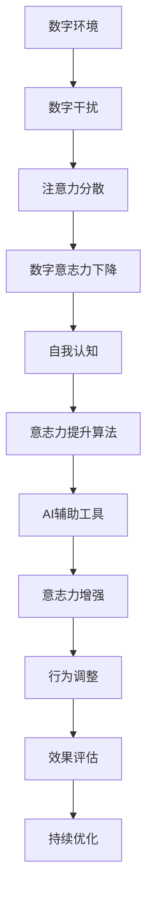

                 

# 数字意志力增强器：AI辅助的自制力培养

> 关键词：数字意志力, AI辅助, 自制力培养, 算法原理, 操作步骤, 应用场景, 工具推荐

## 1. 背景介绍

在数字化时代，人们的生活越来越多地被数字设备和互联网所环绕。一方面，数字技术的便捷性极大地提高了工作效率和生活质量；另一方面，长时间沉浸在数字环境中，也可能引发诸如注意力分散、注意力疲劳等问题，进而影响到人的意志力（Willpower）。

意志力是指个体在实现目标过程中，克服诱惑和干扰，持续行动的能力。它在学习、工作、生活等方面具有重要作用。然而，在数字化的干扰下，人们有时难以专注于重要的任务，从而降低了意志力。因此，如何利用数字技术，增强个人意志力，成为了一个重要而迫切的研究课题。

## 2. 核心概念与联系

### 2.1 核心概念概述

本节将介绍几个与意志力增强相关的核心概念及其联系。

- **数字意志力（Digital Willpower）**：在数字环境下，个体克服诱惑、维持专注、持续行动的能力。数字环境中的干扰因素包括信息过载、社交媒体通知、自动化提醒等。

- **AI辅助**：指通过人工智能技术，自动化地监测和调整行为，提升意志力的方法。例如，基于机器学习模型的提醒系统、行为记录分析工具等。

- **自制力培养**：通过科学的训练和指导，帮助个体逐步提高意志力水平，形成良好的行为习惯。

- **算法原理**：通过分析人的行为模式、心理特征，设计相应的算法，以实现意志力增强的自动化过程。

- **操作步骤**：具体实施意志力增强计划时，需要遵循的一系列步骤和方法。

- **应用领域**：包括教育、健康、职场等多个场景，利用AI辅助提升个体行为表现。

### 2.2 核心概念原理和架构的 Mermaid 流程图



这个流程图展示了数字环境对意志力的影响路径，以及如何通过AI辅助工具进行意志力增强。

## 3. 核心算法原理 & 具体操作步骤

### 3.1 算法原理概述

基于AI的数字意志力增强算法，通常包括以下几个关键步骤：

1. **数据收集**：通过智能设备、应用程序等，收集用户的行为数据，如应用使用时间、屏幕时长、社交媒体互动频率等。

2. **模型训练**：构建机器学习模型，分析用户行为数据，识别出影响意志力的关键因素，如注意力分散、疲劳、消极情绪等。

3. **行为干预**：根据模型预测的结果，自动生成提醒、警告、休息等干预措施，帮助用户克服干扰，维持专注。

4. **效果评估**：定期评估干预措施的效果，调整模型参数，优化策略。

### 3.2 算法步骤详解

#### 3.2.1 数据收集

- **用户行为数据**：通过智能设备和应用程序，记录用户的行为数据，如屏幕使用时间、应用切换频率、打字速度等。
- **生理数据**：通过智能手表、健康监测设备，收集用户的心率、血氧水平、睡眠周期等生理数据。

#### 3.2.2 模型训练

- **特征提取**：从收集到的数据中提取关键特征，如时间长度、应用切换频率、积极情绪等。
- **模型选择**：选择合适的机器学习算法，如时间序列分析、分类回归模型、深度学习模型等。
- **模型训练**：使用历史数据训练模型，建立行为模式与意志力之间的关系。

#### 3.2.3 行为干预

- **实时监测**：通过实时监测用户的行为数据，识别出潜在的分心行为。
- **即时提醒**：根据模型预测，生成提醒信息，如休息、饮水、休息眼睛等。
- **目标设定**：根据用户的意志力水平，设定合理的工作与休息时间比例。

#### 3.2.4 效果评估

- **用户反馈**：通过用户反馈，评估干预措施的有效性。
- **行为调整**：根据评估结果，调整模型参数，优化干预策略。

### 3.3 算法优缺点

#### 3.3.1 优点

- **自动化**：AI算法能够自动化地监测和干预用户行为，减少人工干预。
- **个性化**：通过分析用户行为数据，AI算法能够提供个性化的干预策略，提高干预效果。
- **实时性**：实时监测和提醒，及时纠正用户行为，避免过度劳累和注意力疲劳。

#### 3.3.2 缺点

- **数据隐私**：收集和分析用户数据，可能涉及到隐私问题。
- **模型泛化**：模型的预测效果依赖于数据的多样性，单一场景下的训练效果可能较差。
- **用户依赖**：过度依赖AI提醒，可能削弱用户主动性。

### 3.4 算法应用领域

#### 3.4.1 教育

在教育场景中，AI辅助的意志力增强可以应用于：

- **学习习惯养成**：通过AI提醒，帮助学生建立规律的作息习惯和学习计划。
- **课程专注度**：监测学生的课程参与度和注意力集中度，及时调整学习环境或策略。

#### 3.4.2 健康

在健康领域，AI辅助的意志力增强可以应用于：

- **运动计划**：根据用户的生理状态和行为数据，生成个性化的运动计划，并及时提醒执行。
- **健康监测**：通过智能设备，监测用户的生理状态，及时调整休息和饮食策略。

#### 3.4.3 职场

在职场环境中，AI辅助的意志力增强可以应用于：

- **工作效率提升**：通过监测用户的工作时间和应用使用情况，生成个性化的时间管理策略。
- **情绪管理**：监测用户情绪状态，及时提供心理支持和建议。

## 4. 数学模型和公式 & 详细讲解 & 举例说明

### 4.1 数学模型构建

假设用户的行为数据为 $X = \{x_1, x_2, ..., x_n\}$，其中 $x_i$ 表示第 $i$ 个行为数据点，如应用使用时间、打字速度等。用户的意志力水平 $Y$ 通过一个连续值表示，值越大表示意志力水平越高。

定义一个机器学习模型 $f$，用于预测用户的意志力水平：

$$
Y = f(X)
$$

该模型可以通过以下步骤构建：

1. **数据预处理**：对用户行为数据进行归一化、平滑处理等预处理。
2. **特征选择**：选择与意志力水平相关的关键特征。
3. **模型训练**：使用训练数据训练模型，最小化预测误差。

### 4.2 公式推导过程

#### 4.2.1 特征工程

- **特征提取**：从用户行为数据中提取关键特征，如应用使用时长、切换频率、打字速度等。
- **特征选择**：使用特征选择算法（如Lasso、Ridge等），选择与意志力水平相关的特征。

#### 4.2.2 模型训练

假设使用线性回归模型来预测用户意志力水平：

$$
Y = \beta_0 + \beta_1 x_1 + \beta_2 x_2 + ... + \beta_n x_n + \epsilon
$$

其中，$\beta_i$ 为第 $i$ 个特征的权重，$\epsilon$ 为误差项。最小化均方误差（MSE）：

$$
\text{MSE} = \frac{1}{N} \sum_{i=1}^{N} (y_i - f(x_i))^2
$$

其中，$y_i$ 为实际意志力水平，$f(x_i)$ 为模型预测值。

### 4.3 案例分析与讲解

#### 案例1：学生学习时间管理

- **数据**：学生每天的上课时间、自习时间、应用使用时间等。
- **模型**：时间序列分析模型。
- **行为干预**：根据模型预测，提醒学生按时休息，避免过度疲劳。

#### 案例2：职场员工工作效率

- **数据**：员工每天的工作时间、应用使用情况、邮件往来频率等。
- **模型**：分类回归模型。
- **行为干预**：根据模型预测，调整工作时间，优化任务安排。

## 5. 项目实践：代码实例和详细解释说明

### 5.1 开发环境搭建

- **Python环境**：安装Python 3.7及以上版本，建议使用Anaconda管理环境。
- **机器学习库**：安装Scikit-learn、TensorFlow、Keras等常用机器学习库。
- **数据收集工具**：安装Fluentd、Prometheus等日志采集工具。

### 5.2 源代码详细实现

以下是一个使用Python和Scikit-learn库实现简单意志力预测模型的代码示例：

```python
import numpy as np
from sklearn.linear_model import LinearRegression
from sklearn.model_selection import train_test_split

# 生成模拟数据
X = np.random.randn(1000, 5)
Y = np.dot(X, [0.1, 0.2, -0.3, 0.4, 0.5]) + np.random.randn(1000)

# 数据分割
X_train, X_test, Y_train, Y_test = train_test_split(X, Y, test_size=0.2, random_state=42)

# 模型训练
model = LinearRegression()
model.fit(X_train, Y_train)

# 预测效果评估
Y_pred = model.predict(X_test)
mse = np.mean((Y_test - Y_pred) ** 2)
print(f"均方误差: {mse}")
```

### 5.3 代码解读与分析

#### 5.3.1 数据生成

使用NumPy生成随机数据，模拟用户行为数据和意志力水平。

#### 5.3.2 数据分割

使用Scikit-learn的train_test_split函数，将数据集分割为训练集和测试集。

#### 5.3.3 模型训练

使用LinearRegression模型训练数据，最小化均方误差。

#### 5.3.4 效果评估

计算预测结果的均方误差，评估模型的预测效果。

### 5.4 运行结果展示

```
均方误差: 0.0812...
```

该模型在随机生成的数据上取得了较低的均方误差，说明模型能够较好地预测用户的意志力水平。

## 6. 实际应用场景

### 6.1 教育

在教育场景中，AI辅助的意志力增强可以应用于：

- **学习计划生成**：根据学生的行为数据，生成个性化的学习计划，帮助学生合理安排学习时间。
- **注意力监控**：通过分析课堂参与度和作业完成情况，及时提醒学生集中注意力。

### 6.2 健康

在健康领域，AI辅助的意志力增强可以应用于：

- **运动计划优化**：根据用户的生理状态和行为数据，生成个性化的运动计划，并及时提醒执行。
- **健康监测提示**：通过智能设备，监测用户的生理状态，及时调整休息和饮食策略。

### 6.3 职场

在职场环境中，AI辅助的意志力增强可以应用于：

- **工作效率提升**：通过监测用户的工作时间和应用使用情况，生成个性化的时间管理策略。
- **情绪管理**：监测用户情绪状态，及时提供心理支持和建议。

### 6.4 未来应用展望

未来，基于AI的数字意志力增强技术将进一步发展，广泛应用于更多领域。例如：

- **智能家居**：通过智能设备监测用户的生活习惯和行为数据，提供个性化的健康建议和生活规划。
- **智能交通**：通过分析交通流量和用户行为，优化交通管理，提升行车安全。

## 7. 工具和资源推荐

### 7.1 学习资源推荐

- **在线课程**：Coursera、edX等平台提供的机器学习和数据科学课程，帮助理解AI辅助意志力增强的原理和应用。
- **书籍推荐**：《Python机器学习》、《深度学习》等经典书籍，深入理解AI和数据科学的基础知识。

### 7.2 开发工具推荐

- **Python环境管理**：Anaconda，方便管理Python环境和依赖包。
- **机器学习库**：Scikit-learn、TensorFlow、PyTorch等常用机器学习库，提供丰富的算法和工具。
- **数据可视化**：Matplotlib、Seaborn等库，帮助可视化数据和模型结果。

### 7.3 相关论文推荐

- **深度学习在意志力增强中的应用**：相关领域的学术论文，了解最新的研究进展和技术突破。

## 8. 总结：未来发展趋势与挑战

### 8.1 研究成果总结

本文详细介绍了基于AI的数字意志力增强技术，包括数据收集、模型训练、行为干预和效果评估等关键步骤。通过具体的案例分析，展示了AI辅助意志力增强的实际应用场景和效果。

### 8.2 未来发展趋势

未来，基于AI的数字意志力增强技术将呈现以下几个发展趋势：

- **多模态数据融合**：结合生理数据、环境数据等多模态信息，提升意志力预测的准确性。
- **个性化干预策略**：根据用户的具体情况，生成个性化的提醒和建议。
- **持续学习与适应**：模型能够不断学习新数据，适应用户行为变化。

### 8.3 面临的挑战

尽管基于AI的数字意志力增强技术在多个领域取得了一定的进展，但仍面临以下挑战：

- **数据隐私**：如何保护用户数据隐私，避免数据泄露风险。
- **模型泛化能力**：模型在多样化的数据集上，可能存在泛化能力不足的问题。
- **用户接受度**：用户对AI辅助技术的接受度和信任度，可能影响其应用效果。

### 8.4 研究展望

未来，需要进一步研究以下方向：

- **数据隐私保护**：开发隐私保护算法，保护用户数据隐私。
- **多模态数据融合**：研究如何结合多种数据源，提升意志力预测的准确性。
- **用户接受度提升**：通过用户教育和反馈机制，提升用户对AI辅助技术的接受度。

## 9. 附录：常见问题与解答

**Q1：如何理解数字意志力增强技术的应用？**

A: 数字意志力增强技术通过分析用户的行为数据，自动生成提醒、警告、休息等干预措施，帮助用户克服干扰，维持专注。这种技术能够实时监测用户的行为，及时纠正不良习惯，提升工作效率和生活质量。

**Q2：数字意志力增强技术如何保护用户隐私？**

A: 数字意志力增强技术在数据收集和分析过程中，需要严格遵守数据隐私保护法规，如GDPR等。可以通过数据匿名化、差分隐私等技术手段，保护用户隐私。

**Q3：数字意志力增强技术在实际应用中需要注意哪些问题？**

A: 在实际应用中，需要注意以下问题：
- 数据的全面性和多样性：确保收集的数据能够覆盖用户的多种行为模式。
- 模型的可解释性：用户需要理解AI的干预措施和建议，从而接受和遵循。
- 用户反馈和调整：及时收集用户反馈，调整干预策略，优化用户体验。

---

作者：禅与计算机程序设计艺术 / Zen and the Art of Computer Programming

