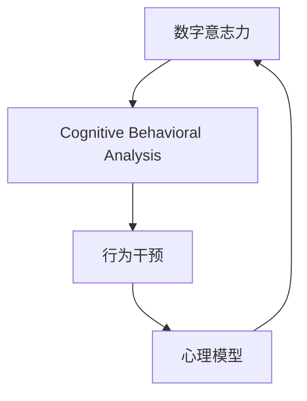

                 

# 数字意志力增强技术：AI辅助的自制力培养方法

> 关键词：数字意志力, AI辅助, 自制力培养, 心理模型, 认知行为分析, 行为干预

## 1. 背景介绍

在数字时代，信息的泛滥使得人们常常被海量的数据和屏幕中的内容吸引，进而分散注意力，难以专注于重要任务，这成为现代生活中普遍存在的问题。与此同时，现代社会对个人自制力的需求日益增加，有效管理时间和精力成为了个体在学业、工作、生活等各方面取得成功的关键。因此，如何利用技术手段增强数字时代的自制力，成为了当前研究的前沿课题。

### 1.1 问题由来
随着互联网的普及，人们的生活逐渐与数字设备深度绑定，尤其是在年轻一代中，智能手机、电脑等设备的广泛使用已经改变了人们的行为模式。例如，社交媒体平台（如微博、微信、Instagram等）上的信息流，不断更新的新闻网站，以及各类娱乐应用（如视频、游戏等），都在争夺用户的注意力，导致注意力分散问题日益严重。

与此同时，面对工作、学习、生活中的各种挑战，个体需要更高水平的自制力来管理时间和精力，避免被外界干扰所打断，保证重要任务的完成。然而，传统的自制力培养方法往往依赖于自我约束和外部监督，效果有限，且难以量化和标准化。

### 1.2 问题核心关键点
目前，AI辅助的自制力培养方法正成为研究的焦点。通过利用机器学习、认知行为分析等技术，AI可以精确测量和干预用户的心理状态和行为模式，提供个性化的指导和支持，从而帮助用户增强自制力。

关键问题包括：
1. **心理模型的构建**：如何准确理解和刻画用户的心理状态和行为模式。
2. **认知行为分析**：如何通过数据分析识别和预测用户的自制力水平。
3. **行为干预**：如何基于用户心理状态和行为模式进行个性化的干预，提升自制力。

### 1.3 问题研究意义
AI辅助的自制力培养方法具有显著的研究意义：
1. **提高生产力和效率**：通过提高用户的工作和学习效率，帮助他们在繁忙的工作和生活环境中更好地管理时间。
2. **改善心理健康**：自制力较弱的用户易受外界干扰，导致焦虑、压力等心理问题，通过提升自制力可以有效缓解这些问题。
3. **促进健康生活方式**：自制力强的人更可能遵守健康的生活习惯，如规律饮食、充足睡眠、适量运动等，对身体健康有益。
4. **教育和社会影响**：自制力强的个体在社会中更具竞争力，教育系统和社会环境中的自制力培养技术，有助于培养一代有责任感、自律性强的社会成员。

## 2. 核心概念与联系

### 2.1 核心概念概述

为更好地理解AI辅助的自制力培养方法，本节将介绍几个关键概念：

- **数字意志力(Digital Self-Discipline)**：指个体在数字环境中，通过自我管理和外在干预，有效控制自己的注意力和行为，从而提升工作和学习效率的能力。

- **认知行为分析(Cognitive Behavioral Analysis, CBA)**：一种基于心理学原理的行为分析方法，通过观察和分析用户的行为数据，理解其心理状态和行为动机，进而进行干预。

- **行为干预(Behavioral Intervention)**：通过人工智能算法预测用户的行为模式，提供个性化的指导和支持，帮助用户改变不良行为，提升自制力。

- **心理模型(Psychological Model)**：用于刻画用户心理状态和行为模式的数学模型，如用户注意力模型、情绪模型等。

这些核心概念之间的关系可以通过以下Mermaid流程图来展示：



这个流程图展示了数字意志力培养的核心流程：
1. 通过认知行为分析，理解用户的行为和心理状态。
2. 根据心理模型，预测和干预用户的行为。
3. 通过行为干预，逐步提升用户的自制力。
4. 通过心理模型的更新和迭代，持续优化干预效果。

## 3. 核心算法原理 & 具体操作步骤
### 3.1 算法原理概述

AI辅助的自制力培养方法，本质上是一种基于认知行为分析和行为干预的心理技术。其核心思想是：利用AI技术，实时监测和分析用户在数字环境中的行为数据，通过精准的预测和个性化的指导，逐步提升用户的自制力。

形式化地，假设用户的行为数据为 $\{x_t\}$，其中 $x_t$ 表示在时间 $t$ 时的行为数据，包括但不限于浏览时间、使用应用、输入文本、点击行为等。设用户的心理状态为 $\psi_t$，行为干预策略为 $\pi_t$。目标是通过历史行为数据和当前心理状态，预测用户未来行为 $y_{t+1}$，并设计行为干预策略 $\pi_t$，使得 $y_{t+1}$ 更符合用户的目标，即提升自制力。

微调的关键在于如何构建有效的心理模型，利用认知行为分析，预测用户行为，并设计个性化的干预策略。具体步骤如下：

1. **数据收集**：通过各类数字设备（如手机、电脑）和应用程序，实时收集用户的数字行为数据。
2. **数据预处理**：对收集到的数据进行清洗和预处理，去除噪声和不相关的信息。
3. **心理模型构建**：利用机器学习算法，如时间序列模型、神经网络模型等，构建用户心理状态的数学模型。
4. **行为预测**：根据构建的心理模型，预测用户未来的行为。
5. **行为干预**：基于预测结果，设计个性化的行为干预策略，如提醒、限制、奖励等。
6. **干预效果评估**：通过反馈机制，评估干预策略的效果，并不断调整和优化策略。

### 3.2 算法步骤详解

**Step 1: 数据收集和预处理**
- 使用各类数字设备内置的应用程序，记录用户的行为数据，如屏幕使用时间、浏览内容、应用使用情况等。
- 清洗数据，去除异常值和不相关的信息，确保数据质量。

**Step 2: 心理模型构建**
- 利用机器学习算法，如时间序列模型、LSTM网络等，构建用户心理状态的模型。
- 根据模型预测用户当前的心理状态，如注意力水平、情绪状态等。

**Step 3: 行为预测**
- 通过预测用户未来的行为，评估其自制力水平。如预测用户是否会打开社交媒体，打开后的停留时间等。
- 利用预测结果，判断用户是否需要干预，以及干预的方式和强度。

**Step 4: 行为干预**
- 根据预测结果，设计个性化的行为干预策略。如提醒用户当前的工作目标，限制应用使用时间，提供奖励机制等。
- 通过应用程序或消息推送，及时通知用户干预策略。

**Step 5: 干预效果评估**
- 记录干预后的用户行为数据，比较干预前后的变化。
- 利用反馈机制，收集用户的满意度，评估干预效果。
- 根据评估结果，调整和优化干预策略。

### 3.3 算法优缺点

AI辅助的自制力培养方法具有以下优点：
1. **实时性和精准性**：通过实时监测和数据分析，可以精准地理解用户心理状态和行为模式，提供即时干预。
2. **个性化定制**：基于用户的行为数据和心理模型，进行个性化干预，提升干预效果。
3. **数据驱动**：通过数据分析，持续优化干预策略，实现持续改进。
4. **可量化和可追踪**：通过行为数据和反馈机制，可以量化自制力的提升程度，追踪干预效果。

同时，该方法也存在一定的局限性：
1. **隐私和安全问题**：大量实时行为数据的收集和存储，可能涉及隐私和安全问题，需确保数据保护。
2. **数据噪音和偏差**：数据收集过程中可能存在噪音和不完整信息，影响模型预测的准确性。
3. **干预效果因人而异**：不同的用户对干预策略的响应可能存在差异，需持续优化策略。
4. **过度依赖技术**：过度依赖技术手段，可能忽视用户的主观能动性，影响干预效果。

尽管存在这些局限性，但就目前而言，AI辅助的自制力培养方法仍是大规模数字环境下的有效手段。未来相关研究的重点在于如何进一步提升数据质量，增强模型鲁棒性，以及设计更加个性化的干预策略。

### 3.4 算法应用领域

AI辅助的自制力培养方法，已经在多个领域得到了应用，涵盖了教育、工作、生活等多个方面：

- **教育**：利用AI技术，提升学生的学习效率和自制力，帮助他们在学业上取得更好的成绩。
- **工作**：通过智能工作助手，帮助员工管理时间，提升工作效率，减少工作压力。
- **健康**：通过健康监测应用，鼓励用户养成健康的生活习惯，如规律作息、适量运动等。
- **娱乐**：通过游戏化干预，控制用户的游戏时间，避免过度沉迷。

除了上述这些应用场景外，AI辅助的自制力培养方法还在心理健康支持、金融理财管理、社交媒体使用控制等诸多领域，展现出广阔的前景。

## 4. 数学模型和公式 & 详细讲解
### 4.1 数学模型构建

本节将使用数学语言对AI辅助的自制力培养方法进行更加严格的刻画。

设用户的行为数据为 $\{x_t\}$，其中 $x_t$ 表示在时间 $t$ 时的行为数据，包括但不限于浏览时间、使用应用、输入文本、点击行为等。设用户的心理状态为 $\psi_t$，行为干预策略为 $\pi_t$。

定义用户行为数据和心理状态的关系为：
$$
\psi_t = f(\{x_t\}, \psi_{t-1}, \pi_{t-1})
$$
其中 $f$ 为行为数据和心理状态的映射函数，$\psi_{t-1}$ 为前一时刻的心理状态，$\pi_{t-1}$ 为前一时刻的行为干预策略。

根据心理模型，预测用户未来的行为 $y_{t+1}$，设定行为干预目标 $\tau$，行为干预策略 $\pi_t$ 应满足：
$$
y_{t+1} = g(\psi_t, \pi_t)
$$
其中 $g$ 为行为干预策略与行为预测的关系函数。

目标是最小化用户未来行为与目标的差距：
$$
\min_{\pi_t} \|y_{t+1} - \tau\|
$$

### 4.2 公式推导过程

以下我们以用户注意力水平预测为例，推导时间序列模型和LSTM网络的公式。

假设用户注意力水平在时间 $t$ 的状态为 $\psi_t$，行为数据为 $x_t$，行为预测为 $y_{t+1}$。行为干预策略 $\pi_t$ 可以是提醒、限制、奖励等，其效果用参数 $w$ 表示。

首先，构建时间序列模型：
$$
\psi_t = \alpha \psi_{t-1} + \beta x_t + \gamma w_t
$$
其中 $\alpha$、$\beta$、$\gamma$ 为模型参数，$w_t$ 为时间 $t$ 的行为干预策略参数。

通过时间序列模型预测用户未来行为：
$$
y_{t+1} = h(\psi_t, \pi_t)
$$
其中 $h$ 为注意力水平与行为预测的关系函数。

接下来，构建LSTM网络模型：
$$
\psi_t = \text{LSTM}(\{x_t\}, \psi_{t-1}, \pi_{t-1})
$$
其中 $\text{LSTM}$ 为长短时记忆网络，可以捕捉时间序列中的长期依赖关系。

通过LSTM网络预测用户未来行为：
$$
y_{t+1} = h(\psi_t, \pi_t)
$$

### 4.3 案例分析与讲解

考虑一个典型的应用场景：用户使用智能手机应用进行学习。应用程序记录用户每天的学习时间、应用使用次数、查看笔记的情况等行为数据，利用这些数据预测用户的注意力水平。

具体步骤如下：
1. **数据收集**：应用程序记录用户每天的学习时间、应用使用次数、查看笔记的情况等行为数据。
2. **数据预处理**：清洗数据，去除异常值和不相关的信息，确保数据质量。
3. **心理模型构建**：利用时间序列模型或LSTM网络，构建用户注意力水平的数学模型。
4. **行为预测**：根据构建的模型，预测用户未来的学习时间，评估其自制力水平。
5. **行为干预**：根据预测结果，设计个性化的行为干预策略，如提醒用户当前的学习目标，限制应用使用时间，提供奖励机制等。
6. **干预效果评估**：记录干预后的用户行为数据，比较干预前后的变化，收集用户的满意度，评估干预效果。

## 5. 项目实践：代码实例和详细解释说明
### 5.1 开发环境搭建

在进行自制力培养方法开发前，我们需要准备好开发环境。以下是使用Python进行PyTorch开发的环境配置流程：

1. 安装Anaconda：从官网下载并安装Anaconda，用于创建独立的Python环境。

2. 创建并激活虚拟环境：
```bash
conda create -n pytorch-env python=3.8 
conda activate pytorch-env
```

3. 安装PyTorch：根据CUDA版本，从官网获取对应的安装命令。例如：
```bash
conda install pytorch torchvision torchaudio cudatoolkit=11.1 -c pytorch -c conda-forge
```

4. 安装TensorFlow：从官网下载并安装TensorFlow。

5. 安装各类工具包：
```bash
pip install numpy pandas scikit-learn matplotlib tqdm jupyter notebook ipython
```

完成上述步骤后，即可在`pytorch-env`环境中开始自制力培养方法的开发实践。

### 5.2 源代码详细实现

下面我们以时间序列模型为例，给出使用PyTorch进行自制力预测和行为干预的PyTorch代码实现。

首先，定义时间序列模型：

```python
import torch
import torch.nn as nn
import torch.optim as optim

class TimeSeriesModel(nn.Module):
    def __init__(self, input_size, hidden_size, output_size):
        super(TimeSeriesModel, self).__init__()
        self.lstm = nn.LSTM(input_size, hidden_size, num_layers=2, batch_first=True)
        self.linear = nn.Linear(hidden_size, output_size)
        
    def forward(self, x, h=None):
        if h is None:
            h = (torch.zeros(2, x.size(0), self.lstm.hidden_size), torch.zeros(2, x.size(0), self.lstm.hidden_size))
        out, (h_n, c_n) = self.lstm(x, h)
        out = self.linear(out)
        return out, h_n
        
# 定义模型参数
input_size = 3
hidden_size = 50
output_size = 1

model = TimeSeriesModel(input_size, hidden_size, output_size)
optimizer = optim.Adam(model.parameters(), lr=0.001)

# 定义训练数据
train_data = torch.tensor([[1.0, 2.0, 3.0], [2.0, 3.0, 4.0], [3.0, 4.0, 5.0]], dtype=torch.float)
train_labels = torch.tensor([[0.5], [0.8], [0.9]], dtype=torch.float)

# 定义训练函数
def train_model(model, optimizer, train_data, train_labels, epochs):
    for epoch in range(epochs):
        model.train()
        optimizer.zero_grad()
        predictions, _ = model(train_data)
        loss = nn.MSELoss()(predictions, train_labels)
        loss.backward()
        optimizer.step()
        print(f"Epoch {epoch+1}, Loss: {loss.item():.3f}")
    
# 训练模型
train_model(model, optimizer, train_data, train_labels, 100)
```

然后，定义行为干预函数：

```python
import numpy as np

class BehaviorIntervention:
    def __init__(self, model, threshold):
        self.model = model
        self.threshold = threshold
        
    def predict_and_intervene(self, data):
        with torch.no_grad():
            predictions, _ = self.model(data)
            predicted_value = predictions.numpy().flatten()[0]
            if predicted_value < self.threshold:
                intervention = "Remind of Study Goal"
            else:
                intervention = "No Intervention"
            print(f"Predicted Value: {predicted_value}, Intervention: {intervention}")
    
# 定义行为干预对象
intervention_model = BehaviorIntervention(model, threshold=0.6)

# 进行行为干预
data = torch.tensor([[1.0, 2.0, 3.0]])
intervention_model.predict_and_intervene(data)
```

以上代码实现了一个基于时间序列模型进行注意力水平预测和行为干预的简单示例。具体步骤如下：

1. **模型定义**：定义时间序列模型，包括LSTM层和线性层。
2. **模型训练**：使用训练数据对模型进行训练，最小化预测误差。
3. **行为干预**：定义行为干预类，根据预测结果设计干预策略。
4. **行为干预实例**：创建行为干预对象，并调用其预测和干预方法。

### 5.3 代码解读与分析

让我们再详细解读一下关键代码的实现细节：

**TimeSeriesModel类**：
- `__init__`方法：初始化LSTM层和线性层。
- `forward`方法：前向传播计算模型输出。

**train_model函数**：
- 在每个epoch内，对模型进行前向传播、计算损失并反向传播更新参数，输出每个epoch的平均损失。

**BehaviorIntervention类**：
- `__init__`方法：初始化模型和干预阈值。
- `predict_and_intervene`方法：根据模型预测结果，设计干预策略并输出。

**代码运行**：
- 训练模型，输出每个epoch的损失。
- 创建行为干预对象，调用其预测和干预方法，输出预测值和干预策略。

## 6. 实际应用场景
### 6.1 智能学习助手

智能学习助手是AI辅助自制力培养的一个重要应用场景。智能学习助手能够根据学生的学习行为数据，实时监测其注意力水平，并提供个性化的学习建议和提醒，帮助学生提升学习效率和自制力。

具体实现包括：
1. **数据收集**：通过学习管理系统(LMS)或专门的应用程序，记录学生的学习行为数据，如学习时间、应用使用情况、笔记查看情况等。
2. **数据预处理**：清洗数据，去除异常值和不相关的信息。
3. **心理模型构建**：利用时间序列模型或LSTM网络，构建学生的注意力水平模型。
4. **行为预测**：根据构建的模型，预测学生未来的学习时间，评估其自制力水平。
5. **行为干预**：根据预测结果，设计个性化的行为干预策略，如提醒学生当前的学习目标，限制应用使用时间，提供奖励机制等。
6. **干预效果评估**：记录干预后的学生行为数据，比较干预前后的变化，收集学生的满意度，评估干预效果。

### 6.2 企业员工管理系统

企业员工管理系统是另一个重要应用场景。企业可以通过AI技术，提升员工的工作效率和自制力，帮助他们在繁忙的工作环境中更好地管理时间和精力。

具体实现包括：
1. **数据收集**：通过企业内部的办公系统或专门的应用程序，记录员工的工作行为数据，如工作时间、应用使用情况、会议参与情况等。
2. **数据预处理**：清洗数据，去除异常值和不相关的信息。
3. **心理模型构建**：利用时间序列模型或LSTM网络，构建员工的工作状态模型。
4. **行为预测**：根据构建的模型，预测员工未来的工作时间，评估其自制力水平。
5. **行为干预**：根据预测结果，设计个性化的行为干预策略，如提醒员工当前的工作目标，限制应用使用时间，提供奖励机制等。
6. **干预效果评估**：记录干预后的员工行为数据，比较干预前后的变化，收集员工的满意度，评估干预效果。

### 6.3 健康生活方式管理系统

健康生活方式管理系统是提升自制力的重要应用场景。健康应用可以通过AI技术，鼓励用户养成健康的生活习惯，如规律饮食、充足睡眠、适量运动等。

具体实现包括：
1. **数据收集**：通过健康监测应用，记录用户的生活习惯数据，如饮食、睡眠、运动情况等。
2. **数据预处理**：清洗数据，去除异常值和不相关的信息。
3. **心理模型构建**：利用时间序列模型或LSTM网络，构建用户的生活习惯模型。
4. **行为预测**：根据构建的模型，预测用户未来的生活习惯，评估其自制力水平。
5. **行为干预**：根据预测结果，设计个性化的行为干预策略，如提醒用户当前的生活目标，限制不健康的生活习惯，提供奖励机制等。
6. **干预效果评估**：记录干预后的用户行为数据，比较干预前后的变化，收集用户的满意度，评估干预效果。

### 6.4 未来应用展望

随着AI技术的发展，自制力培养方法将逐步渗透到更多领域，为个体提供全方位的自制力提升支持。未来，以下方向值得探索：

1. **多模态数据融合**：将文本、图像、声音等多模态数据结合，构建更全面、准确的用户行为模型。
2. **个性化干预设计**：基于用户的具体需求和偏好，设计更加个性化的行为干预策略，提升干预效果。
3. **动态调整策略**：根据用户行为的变化，动态调整干预策略，实现持续改进。
4. **跨平台应用**：将自制力培养方法应用于不同平台，如手机、电脑、可穿戴设备等，形成统一的自制力管理系统。
5. **社会影响力**：通过企业和教育系统的大规模部署，推动自制力培养技术的社会普及，形成良性循环。

## 7. 工具和资源推荐
### 7.1 学习资源推荐

为了帮助开发者系统掌握自制力培养方法的理论基础和实践技巧，这里推荐一些优质的学习资源：

1. **《AI辅助心理与行为分析》系列博文**：由心理与行为分析专家撰写，深入浅出地介绍了AI在心理行为分析中的应用，涵盖时间序列模型、LSTM网络等关键技术。

2. **《机器学习在心理与行为分析中的应用》课程**：斯坦福大学开设的在线课程，系统讲解机器学习在心理行为分析中的应用，包括时间序列模型、深度学习等。

3. **《认知行为分析与干预》书籍**：心理与行为分析领域的经典教材，详细介绍了认知行为分析的原理和实践方法。

4. **Transformers库官方文档**：PyTorch库的官方文档，提供了丰富的预训练语言模型和行为分析工具，是进行自制力培养方法开发的必备资料。

5. **CLUE开源项目**：中文语言理解测评基准，涵盖大量不同类型的中文NLP数据集，并提供了基于自制力培养的baseline模型，助力中文NLP技术发展。

通过对这些资源的学习实践，相信你一定能够快速掌握自制力培养方法的精髓，并用于解决实际的自制力问题。

### 7.2 开发工具推荐

高效的开发离不开优秀的工具支持。以下是几款用于自制力培养方法开发的常用工具：

1. PyTorch：基于Python的开源深度学习框架，灵活动态的计算图，适合快速迭代研究。大部分预训练语言模型都有PyTorch版本的实现。

2. TensorFlow：由Google主导开发的开源深度学习框架，生产部署方便，适合大规模工程应用。同样有丰富的预训练语言模型资源。

3. Transformers库：HuggingFace开发的NLP工具库，集成了众多SOTA语言模型，支持PyTorch和TensorFlow，是进行自制力培养方法开发的利器。

4. Weights & Biases：模型训练的实验跟踪工具，可以记录和可视化模型训练过程中的各项指标，方便对比和调优。与主流深度学习框架无缝集成。

5. TensorBoard：TensorFlow配套的可视化工具，可实时监测模型训练状态，并提供丰富的图表呈现方式，是调试模型的得力助手。

6. Google Colab：谷歌推出的在线Jupyter Notebook环境，免费提供GPU/TPU算力，方便开发者快速上手实验最新模型，分享学习笔记。

合理利用这些工具，可以显著提升自制力培养方法的开发效率，加快创新迭代的步伐。

### 7.3 相关论文推荐

自制力培养方法的研究源于学界的持续研究。以下是几篇奠基性的相关论文，推荐阅读：

1. **Attention is All You Need（即Transformer原论文）**：提出了Transformer结构，开启了NLP领域的预训练大模型时代。

2. **Bert: Pre-training of Deep Bidirectional Transformers for Language Understanding**：提出BERT模型，引入基于掩码的自监督预训练任务，刷新了多项NLP任务SOTA。

3. **Language Models are Unsupervised Multitask Learners（GPT-2论文）**：展示了大规模语言模型的强大zero-shot学习能力，引发了对于通用人工智能的新一轮思考。

4. **Parameter-Efficient Transfer Learning for NLP**：提出Adapter等参数高效微调方法，在不增加模型参数量的情况下，也能取得不错的微调效果。

5. **Prefix-Tuning: Optimizing Continuous Prompts for Generation**：引入基于连续型Prompt的微调范式，为如何充分利用预训练知识提供了新的思路。

6. **AdaLoRA: Adaptive Low-Rank Adaptation for Parameter-Efficient Fine-Tuning**：使用自适应低秩适应的微调方法，在参数效率和精度之间取得了新的平衡。

这些论文代表了大语言模型微调技术的发展脉络。通过学习这些前沿成果，可以帮助研究者把握学科前进方向，激发更多的创新灵感。

## 8. 总结：未来发展趋势与挑战

### 8.1 总结

本文对AI辅助的自制力培养方法进行了全面系统的介绍。首先阐述了自制力培养方法的研究背景和意义，明确了AI技术在提升个体自制力方面的独特价值。其次，从原理到实践，详细讲解了认知行为分析和行为干预的核心步骤，给出了自制力培养方法开发的完整代码实例。同时，本文还广泛探讨了自制力培养方法在智能学习助手、企业员工管理系统、健康生活方式管理系统等多个领域的应用前景，展示了其广阔的前景。

通过本文的系统梳理，可以看到，AI辅助的自制力培养方法正在成为数字时代提高个体自制力的重要手段，极大地拓展了人们的工作效率和生活质量。得益于机器学习、认知行为分析等技术的进步，自制力培养方法展现出前所未有的发展潜力。未来，伴随算力、数据和模型的不断进步，自制力培养技术将进一步普及和深化，为个体和社会带来更多福祉。

### 8.2 未来发展趋势

展望未来，自制力培养方法将呈现以下几个发展趋势：

1. **智能化水平提升**：随着深度学习和大数据分析技术的发展，自制力培养方法将更加智能化和个性化，能够更好地适应不同用户的需求。

2. **多模态数据融合**：将文本、图像、声音等多模态数据结合，构建更全面、准确的用户行为模型，提升自制力培养的效果。

3. **动态调整策略**：根据用户行为的变化，动态调整干预策略，实现持续改进，提升干预效果。

4. **跨平台应用**：将自制力培养方法应用于不同平台，如手机、电脑、可穿戴设备等，形成统一的自制力管理系统。

5. **社会影响力扩大**：通过企业和教育系统的大规模部署，推动自制力培养技术的社会普及，形成良性循环。

6. **伦理和隐私问题重视**：在提升自制力效果的同时，更加重视用户隐私和数据安全，确保技术应用的可信赖性和公平性。

以上趋势凸显了自制力培养技术的广阔前景。这些方向的探索发展，必将进一步提升自制力培养方法的智能化水平，为个体和社会带来更多福祉。

### 8.3 面临的挑战

尽管自制力培养方法已经取得了显著的进展，但在迈向更加智能化、普适化应用的过程中，仍面临诸多挑战：

1. **数据质量和隐私问题**：大规模实时行为数据的收集和存储，可能涉及隐私和安全问题，需确保数据保护。
2. **算法复杂性和计算成本**：深度学习模型的训练和推理需要大量计算资源，需优化算法和资源使用效率。
3. **用户接受度和干预效果**：过度依赖技术手段，可能忽视用户的主观能动性，影响干预效果，需提升用户接受度和干预效果的可见性。
4. **跨领域应用难度**：不同领域的行为模式差异较大，需针对不同场景设计特定的行为模型和干预策略。
5. **干预效果的持续性**：干预效果可能随时间推移而衰减，需持续优化干预策略，实现长期提升。

尽管存在这些挑战，但通过技术不断迭代和优化，自制力培养方法仍然具有广阔的应用前景和巨大的潜力。未来研究需要在多个维度上寻求突破，如算法优化、用户行为理解、隐私保护等，才能实现更高效、更普适的自制力培养。

### 8.4 研究展望

面向未来，自制力培养技术需要在以下几个方面寻求新的突破：

1. **数据隐私和安全**：在提升自制力效果的同时，更加重视用户隐私和数据安全，确保技术应用的可信赖性和公平性。

2. **跨领域应用**：将自制力培养方法应用于不同领域，如教育、企业、健康等，形成通用的自制力管理系统。

3. **多模态数据融合**：将文本、图像、声音等多模态数据结合，构建更全面、准确的用户行为模型，提升自制力培养的效果。

4. **动态调整策略**：根据用户行为的变化，动态调整干预策略，实现持续改进，提升干预效果。

5. **跨平台应用**：将自制力培养方法应用于不同平台，如手机、电脑、可穿戴设备等，形成统一的自制力管理系统。

6. **社会影响力扩大**：通过企业和教育系统的大规模部署，推动自制力培养技术的社会普及，形成良性循环。

这些研究方向将进一步推动自制力培养技术的发展，为个体和社会带来更多福祉。相信随着技术的不断进步，自制力培养技术将成为数字时代提升个体自律性、提升生产力和生活品质的重要手段。

## 9. 附录：常见问题与解答

**Q1：AI辅助的自制力培养方法是否适用于所有用户？**

A: AI辅助的自制力培养方法在不同用户中的应用效果可能存在差异，主要取决于以下几个因素：
1. **用户特性**：不同用户的自制力水平、行为模式和心理状态各异，需要个性化的干预策略。
2. **数据质量**：高质量、完整的数据是自制力培养方法有效的前提，数据不足或数据噪音可能影响干预效果。
3. **干预策略**：不同的干预策略可能对不同用户产生不同的效果，需要根据用户特性和数据情况灵活选择。

**Q2：如何确保AI辅助的自制力培养方法的公正性和伦理性？**

A: 确保自制力培养方法的公正性和伦理性，需要在以下几个方面进行努力：
1. **透明度**：公开算法原理和数据处理方式，让用户了解干预过程。
2. **可解释性**：通过可视化工具，解释模型预测和干预策略的依据。
3. **公平性**：确保干预策略不偏向某一特定群体，避免对某些用户的不公平待遇。
4. **隐私保护**：严格遵守数据隐私保护法规，确保用户数据的安全和匿名。

**Q3：如何提高AI辅助的自制力培养方法的干预效果？**

A: 提高干预效果需要综合考虑多个因素：
1. **数据质量**：收集高质量、完整的数据，减少数据噪音。
2. **算法优化**：不断优化算法和模型，提升预测准确性和干预效果。
3. **个性化干预**：根据用户特性和行为模式，设计个性化的干预策略。
4. **用户参与度**：通过互动机制，提升用户对干预策略的接受度和参与度。

**Q4：如何设计合理的干预策略？**

A: 设计合理的干预策略需要考虑以下因素：
1. **目标设定**：明确干预目标，如提高学习效率、改善工作表现等。
2. **行为预测**：根据行为数据和心理模型，预测用户未来的行为。
3. **策略设计**：基于预测结果，设计个性化的干预策略，如提醒、限制、奖励等。
4. **效果评估**：通过反馈机制，评估干预策略的效果，不断优化和调整策略。

**Q5：如何平衡技术干预和用户主观能动性？**

A: 平衡技术干预和用户主观能动性，需要在以下几个方面进行努力：
1. **用户教育**：通过教育提升用户对技术干预的理解和接受度。
2. **用户反馈**：收集用户的反馈意见，优化干预策略。
3. **自主选择**：赋予用户一定的自主选择权，让用户参与干预策略的设计和调整。

这些研究方向的探索，必将引领自制力培养技术迈向更高的台阶，为构建安全、可靠、可解释、可控的智能系统铺平道路。面向未来，自制力培养技术还需要与其他人工智能技术进行更深入的融合，如知识表示、因果推理、强化学习等，多路径协同发力，共同推动自然语言理解和智能交互系统的进步。只有勇于创新、敢于突破，才能不断拓展语言模型的边界，让智能技术更好地造福人类社会。

---

作者：禅与计算机程序设计艺术 / Zen and the Art of Computer Programming

