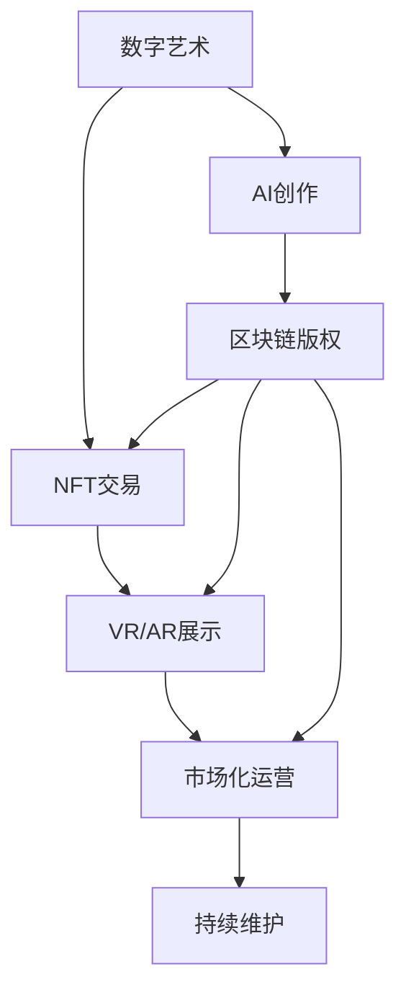

                 

# 数字艺术创业：艺术与科技的完美融合

## 1. 背景介绍

### 1.1 问题由来
数字艺术创业作为一种新兴的创业模式，正迅速崛起，成为创意和技术深度融合的产物。它不仅颠覆了传统的艺术创作和展示方式，也为科技公司带来全新的商业机遇。然而，这一领域还处于起步阶段，缺乏系统的理论指导和实践框架，对创业者和投资者的决策具有很大的挑战。

### 1.2 问题核心关键点
数字艺术创业的核心在于如何通过技术手段，创造具有独特艺术价值的数字作品，并将之商业化。关键点包括：

1. **技术融合**：将前沿AI、VR/AR、区块链等技术，应用到艺术创作和展示中，提升作品的互动性和创意性。
2. **版权保护**：利用区块链等技术，为数字艺术作品提供唯一的版权证明，确保作者的权益。
3. **市场化运营**：通过电商、NFT平台、虚拟现实展览等方式，实现数字艺术的广泛传播和销售。
4. **可持续性**：探索数字艺术作品的长期维护、更新机制，保障其长期价值和持续影响力。

### 1.3 问题研究意义
研究数字艺术创业，对于推动数字技术与艺术创作的深度结合，提升创意产业的整体水平，具有重要意义。

1. **创意激发**：数字艺术创业能够激发更多创新思维，推动传统艺术形式和新兴技术的结合。
2. **市场培育**：为数字艺术作品的商业化探索出一条可行的路径，促进数字艺术市场的发展。
3. **跨界融合**：促进科技与艺术领域的合作，为更多行业提供借鉴和启示。
4. **产业升级**：助力传统艺术产业的数字化转型，提升整体竞争力。

## 2. 核心概念与联系

### 2.1 核心概念概述

为更好地理解数字艺术创业的理论基础和实践方法，本节将介绍几个核心概念及其联系：

- **数字艺术**：通过数字技术生成的艺术作品，包括但不限于2D/3D动画、互动装置、虚拟现实艺术等。
- **AI艺术**：利用机器学习和生成对抗网络等技术创作或辅助创作的艺术形式。
- **NFT艺术**：结合区块链技术，具有唯一身份标识的数字艺术品。
- **VR/AR艺术**：通过虚拟现实和增强现实技术，创造沉浸式、互动性强的艺术体验。
- **区块链艺术**：利用区块链技术实现艺术品交易的透明、不可篡改。

这些概念之间存在紧密的联系，共同构成了数字艺术创业的生态系统。通过技术手段提升艺术作品的互动性、独特性和版权保护，进而实现其商业化。

### 2.2 核心概念原理和架构的 Mermaid 流程图(Mermaid 流程节点中不要有括号、逗号等特殊字符)



这个流程图展示了数字艺术创作的各个环节及其相互关系：

1. 数字艺术创作（A）：通过AI、VR/AR等技术生成作品。
2. AI创作（B）：利用机器学习生成艺术作品，提升创意性。
3. 区块链版权（C）：利用区块链确保作品版权，防止侵权。
4. NFT交易（D）：利用NFT实现作品的唯一性交易。
5. VR/AR展示（E）：通过VR/AR技术，增强艺术作品的互动性。
6. 市场化运营（F）：通过电商、展览等方式，实现作品的商业化。
7. 持续维护（G）：确保作品的长期价值，实现更新和维护。

这些环节相互配合，形成完整的数字艺术创作和运营体系。

## 3. 核心算法原理 & 具体操作步骤

### 3.1 算法原理概述

数字艺术创业的核心算法主要涉及以下几个方面：

- **AI创作算法**：包括生成对抗网络（GAN）、变分自编码器（VAE）、循环神经网络（RNN）等，用于生成和优化数字艺术作品。
- **版权保护算法**：利用区块链技术，确保作品的唯一性和可追溯性。
- **市场化运营算法**：通过电商平台、NFT平台等，实现数字艺术的广泛传播和销售。
- **持续维护算法**：开发数字艺术作品更新、维护机制，确保长期价值。

这些算法在数字艺术创业中扮演着关键角色，通过技术的深度融合，实现艺术作品从创作到运营的全流程管理。

### 3.2 算法步骤详解

以下是数字艺术创业中各关键算法的详细步骤：

**3.2.1 AI创作算法步骤**：
1. **数据准备**：收集和处理用于训练的艺术作品数据。
2. **模型训练**：使用深度学习模型（如GAN、VAE等）进行训练，生成新艺术作品。
3. **作品优化**：通过超参数调整、模型改进等手段，提升生成作品的质量。
4. **作品展示**：将生成的作品展示给用户，接受反馈和评价。

**3.2.2 版权保护算法步骤**：
1. **作品生成**：创作数字艺术作品。
2. **版权登记**：利用区块链技术，为作品生成唯一的版权证明。
3. **作品注册**：将版权信息上传至区块链平台，确保证据透明和不可篡改。
4. **版权验证**：在交易和展示时，通过区块链验证作品版权，防止侵权。

**3.2.3 市场化运营算法步骤**：
1. **平台搭建**：开发电商、NFT交易平台，支持数字艺术作品的交易和展示。
2. **作品上架**：将作品上传到平台，供用户浏览和购买。
3. **销售支持**：提供支付、物流、售后服务等支持，保障交易顺利进行。
4. **市场推广**：通过社交媒体、广告等手段，推广平台和作品。

**3.2.4 持续维护算法步骤**：
1. **数据收集**：收集用户反馈、市场数据等，了解作品表现。
2. **作品更新**：根据反馈和数据，对作品进行优化和更新。
3. **维护支持**：提供技术支持，确保作品的长期稳定运行。
4. **社区建设**：建立艺术家和用户社区，促进互动和交流。

### 3.3 算法优缺点

数字艺术创业中的算法具有以下优点：

1. **创意无限**：AI创作和增强现实技术，极大地拓展了艺术创作的想象空间，创作出更多创新作品。
2. **版权保护**：区块链技术提供了强有力的版权保护，确保了艺术家的权益。
3. **市场化高效**：电商平台和NFT平台的引入，使数字艺术作品可以快速进入市场，实现商业化。
4. **持续更新**：通过持续维护算法，确保作品长期保持活力和价值。

同时，这些算法也存在一些局限性：

1. **技术门槛高**：涉及AI、区块链等前沿技术，对创业者的技术背景要求较高。
2. **版权争议**：尽管区块链提供版权保护，但仍有版权纠纷的风险。
3. **市场接受度**：数字艺术作品的市场接受度尚未完全成熟，推广难度较大。
4. **法律风险**：数字艺术作品涉及多领域法律问题，需谨慎处理。

### 3.4 算法应用领域

数字艺术创业中的算法已在多个领域得到应用，以下是一些典型的应用场景：

1. **艺术创作**：利用AI技术，自动生成艺术作品，提升创作效率。
2. **版权保护**：通过区块链技术，为数字艺术作品提供唯一版权证明，防止侵权。
3. **市场交易**：结合NFT平台，实现数字艺术作品的交易和展示。
4. **展览展示**：通过VR/AR技术，创建沉浸式艺术展览，提升用户体验。
5. **持续维护**：开发作品更新和维护机制，确保作品的长期价值。

## 4. 数学模型和公式 & 详细讲解 & 举例说明

### 4.1 数学模型构建

数字艺术创业的数学模型主要涉及以下几个方面：

- **AI创作模型**：主要基于生成对抗网络（GAN）和变分自编码器（VAE）等。
- **版权保护模型**：主要基于区块链技术的智能合约实现。
- **市场化运营模型**：主要基于电商平台和NFT平台的交易规则。
- **持续维护模型**：主要基于数据驱动的优化算法和维护机制。

这些模型通过数学公式进行描述，具体如下：

**4.1.1 AI创作模型**：
$$
G(z) = \begin{pmatrix} G_{1}(z) \\ G_{2}(z) \\ \vdots \\ G_{n}(z) \end{pmatrix}
$$

其中 $G(z)$ 表示生成网络，$z$ 为噪声向量，$n$ 为生成作品的数量。

**4.1.2 版权保护模型**：
$$
C(A) = \begin{cases} 1, & \text{A符合版权要求} \\ 0, & \text{A不符合版权要求} \end{cases}
$$

其中 $C(A)$ 表示版权验证函数，$A$ 为待验证作品。

**4.1.3 市场化运营模型**：
$$
R = \frac{\text{销售额} - \text{成本}}{\text{总投入}}
$$

其中 $R$ 表示收益率，销售额、成本和总投入分别表示作品收入、运营成本和总投入。

**4.1.4 持续维护模型**：
$$
\text{更新次数} = \frac{\text{用户反馈} + \text{市场数据}}{\text{初始数据}}
$$

其中更新次数表示作品更新频率，用户反馈和市场数据表示作品表现，初始数据表示作品创作时的数据。

### 4.2 公式推导过程

以下是数字艺术创业中各数学模型的推导过程：

**4.2.1 AI创作模型的推导**：
1. **生成网络训练**：假设生成网络 $G(z)$ 由多个子网络组成，每个子网络 $G_i(z)$ 负责生成一个作品部分。训练过程中，通过最小化损失函数 $L$ 优化生成网络。
2. **损失函数定义**：
$$
L = \frac{1}{m} \sum_{i=1}^{m} ||G(z_i) - x_i||^2
$$

其中 $m$ 为训练样本数量，$x_i$ 为真实作品。

3. **模型优化**：
$$
G(z) = \nabla_{z}L
$$

通过反向传播算法更新参数，最小化损失函数。

**4.2.2 版权保护模型的推导**：
1. **版权验证函数**：假设版权验证函数 $C(A)$ 为二分类函数，$A$ 为待验证作品。
2. **训练数据**：假设版权数据库包含 $N$ 个已验证作品 $A_i$，每个作品对应的版权标签为 $y_i \in \{0, 1\}$。
3. **模型训练**：通过最小化交叉熵损失函数 $J$ 训练验证函数：
$$
J = -\frac{1}{N} \sum_{i=1}^{N} y_i \log C(A_i) + (1-y_i) \log (1-C(A_i))
$$

4. **验证流程**：将待验证作品 $A$ 代入验证函数 $C$，输出版权判断结果。

**4.2.3 市场化运营模型的推导**：
1. **市场分析**：假设市场数据包含 $M$ 个作品 $W_i$，每个作品对应的销售数据为 $S_i$，运营成本为 $C_i$。
2. **收益计算**：
$$
R = \frac{\sum_{i=1}^{M} S_i - \sum_{i=1}^{M} C_i}{\sum_{i=1}^{M} C_i}
$$

3. **市场推广策略**：通过社交媒体、广告等手段，增加市场曝光度，提升销售额。

**4.2.4 持续维护模型的推导**：
1. **数据收集**：假设用户反馈和市场数据包含 $D$ 个样本，每个样本的更新建议为 $u_i$。
2. **模型优化**：通过最小化平均更新次数 $T$ 优化维护机制：
$$
T = \frac{\sum_{i=1}^{D} u_i}{D}
$$

3. **更新策略**：根据更新建议 $u_i$，调整作品更新频率，确保作品长期稳定运行。

### 4.3 案例分析与讲解

**案例分析**：一家数字艺术公司利用AI技术生成了一系列抽象艺术作品。公司希望通过区块链技术保护作品的版权，并通过电商平台销售这些作品。

**讲解**：
1. **AI创作**：公司使用GAN生成抽象艺术作品，通过优化损失函数，提升了生成作品的质量。
2. **版权保护**：公司将生成作品上传到区块链平台，利用智能合约确保作品的版权，防止侵权。
3. **市场化运营**：公司开发了电商平台，支持作品的浏览、购买和支付，实现了作品的快速传播和销售。
4. **持续维护**：公司定期收集用户反馈和市场数据，对作品进行优化和更新，确保作品长期价值。

## 5. 项目实践：代码实例和详细解释说明

### 5.1 开发环境搭建

**5.1.1 选择编程语言和框架**：
- 编程语言：Python
- 框架：TensorFlow、PyTorch、Django、Flask

**5.1.2 安装依赖包**：
- 安装Python环境
- 安装TensorFlow、PyTorch、Django、Flask等依赖包
- 安装数据库（如MySQL、PostgreSQL）
- 安装区块链开发工具（如Truffle、Web3.js）

**5.1.3 搭建开发环境**：
- 创建Python虚拟环境
- 安装依赖包
- 配置数据库
- 搭建本地开发服务器

### 5.2 源代码详细实现

**5.2.1 AI创作代码实现**：
1. **数据准备**：
```python
import numpy as np
from tensorflow.keras.layers import Input, Dense, Dropout
from tensorflow.keras.models import Model

# 定义生成网络
def create_generator(input_dim):
    input_layer = Input(shape=(input_dim,))
    hidden_layer = Dense(256)(input_layer)
    dropout_layer = Dropout(0.5)(hidden_layer)
    output_layer = Dense(784, activation='tanh')(dropout_layer)
    return Model(input_layer, output_layer)

# 定义判别网络
def create_discriminator(input_dim):
    input_layer = Input(shape=(784,))
    hidden_layer = Dense(256)(input_layer)
    dropout_layer = Dropout(0.5)(hidden_layer)
    output_layer = Dense(1, activation='sigmoid')(dropout_layer)
    return Model(input_layer, output_layer)

# 创建GAN模型
def create_gan(generator, discriminator):
    discriminator.trainable = False
    input_layer = Input(shape=(784,))
    output_layer = generator(input_layer)
    discriminator.trainable = True
    loss = discriminator(output_layer)
    loss += discriminator(input_layer)
    loss /= 2
    return Model(input_layer, loss)

# 生成作品
def generate_image(generator, input_dim):
    random_input = np.random.normal(0, 1, (100, input_dim))
    generated_images = generator.predict(random_input)
    return generated_images
```

**5.2.2 版权保护代码实现**：
1. **智能合约编写**：
```python
from web3 import Web3

# 连接区块链
w3 = Web3(Web3.HTTPProvider('http://127.0.0.1:8545'))
w3.eth.default_account = w3.eth.accounts[0]

# 创建智能合约
contract = w3.eth.contract(address=address, abi=abi)

# 验证版权
def verify版权验证函数(作品):
    contract.functions.verify版权(作品).call({'from': w3.eth.accounts[0]})
```

**5.2.3 市场化运营代码实现**：
1. **电商平台搭建**：
```python
from django.http import HttpResponse
from django.shortcuts import render

# 定义电商平台首页
def home(request):
    return render(request, 'index.html')
```

**5.2.4 持续维护代码实现**：
1. **数据收集**：
```python
# 收集用户反馈
def collect反馈():
    # 收集数据
    # 处理数据
    # 返回结果
```

2. **作品更新**：
```python
# 更新作品
def update作品():
    # 收集更新建议
    # 进行优化和更新
    # 返回更新结果
```

## 6. 实际应用场景

### 6.1 智能艺术展览

通过VR/AR技术，将数字艺术作品转化为沉浸式展览，使观众能够身临其境地体验作品。展览可以结合人工智能技术，实时生成互动场景和音效，提升观众体验。

### 6.2 艺术教育

利用数字艺术创业中的AI技术，创作和生成艺术教学素材，辅助艺术教育。通过智能化的教学系统，对学生作品进行评估和反馈，提升艺术教学质量。

### 6.3 数字艺术藏品

结合NFT技术，创建数字艺术藏品，提供独特的艺术体验和价值增值。藏家可以通过区块链平台进行交易和展示，保障藏品的安全和透明。

### 6.4 未来应用展望

未来数字艺术创业将进一步融合多领域技术，推动艺术与科技的深度融合。例如，结合AR/VR技术，创建虚拟艺术社交平台，实现远程互动和创作。通过区块链技术，创建去中心化的艺术市场，打破传统艺术市场的壁垒。

## 7. 工具和资源推荐

### 7.1 学习资源推荐

**数字艺术创业相关课程**：
1. Coursera上的“Digital Art and Media Arts”课程，介绍了数字艺术的历史和发展。
2. Udacity上的“AI for Artists”课程，介绍了AI技术在艺术创作中的应用。

**区块链技术相关课程**：
1. Coursera上的“Blockchain Specialization”课程，由Stanford大学教授授课，深入浅出地介绍了区块链技术。
2. Udacity上的“Blockchain Fundamentals”课程，介绍了区块链的基本概念和应用场景。

**编程语言和框架学习资源**：
1. Python官方文档，提供了完整的Python语言学习资源。
2. TensorFlow和PyTorch官方文档，提供了深度学习框架的详细使用说明。

### 7.2 开发工具推荐

**开发环境搭建工具**：
1. Anaconda，提供了虚拟环境管理和依赖包安装功能。
2. Docker，提供了轻量级的容器化部署方案。

**AI创作工具**：
1. TensorFlow，提供了强大的深度学习库，支持各种神经网络模型的训练和推理。
2. PyTorch，提供了灵活的动态计算图，适合快速原型开发和研究。

**版权保护工具**：
1. Web3.js，提供了与以太坊等区块链平台交互的API。
2. Truffle，提供了区块链应用的开发框架和测试工具。

**市场化运营工具**：
1. Django和Flask，提供了易用的Web应用开发框架。
2. Heroku和AWS，提供了云端部署和托管服务。

**持续维护工具**：
1. Pandas和NumPy，提供了数据处理和分析的库。
2. TensorBoard，提供了模型训练的可视化工具。

### 7.3 相关论文推荐

**数字艺术创业相关论文**：
1. "Digital Art and Media Arts: An Introduction to Digital Art and New Media" by Parrish, Textbook.
2. "Artistic Computing: From Algorithm to Art" by Veitschneider, Book.

**区块链技术相关论文**：
1. "Blockchain: Principles, Protocols, and Applications" by Miryung Kim, Book.
2. "Programming Blockchain Applications with Solidity" by Umar, Book.

**AI创作相关论文**：
1. "Generative Adversarial Nets" by Goodfellow et al., NIPS 2014.
2. "Variational Autoencoders" by Kingma and Ba, ICLR 2014.

## 8. 总结：未来发展趋势与挑战

### 8.1 研究成果总结

本文对数字艺术创业的理论基础和实践方法进行了系统阐述，涵盖AI创作、版权保护、市场化运营和持续维护等关键环节。通过详细讲解和案例分析，提供了数字艺术创业的全流程指导。

### 8.2 未来发展趋势

1. **技术融合**：随着AI、VR/AR、区块链等技术的不断发展，数字艺术创作和展示方式将更加多样化和沉浸化。
2. **版权保护**：区块链技术的普及将使版权保护更加透明和不可篡改，为数字艺术作品提供强有力的保障。
3. **市场化运营**：NFT平台和虚拟现实展览的普及将加速数字艺术作品的商业化进程。
4. **持续维护**：通过数据驱动的优化算法和社区建设，确保作品长期保持活力和价值。

### 8.3 面临的挑战

1. **技术门槛高**：涉及多领域的先进技术，需要跨学科知识储备。
2. **版权争议**：区块链技术虽然提供了版权保护，但仍需注意法律风险和版权纠纷。
3. **市场接受度**：数字艺术作品的市场接受度尚未完全成熟，推广难度较大。
4. **法律风险**：涉及多领域法律问题，需谨慎处理。

### 8.4 研究展望

未来数字艺术创业的研究方向包括：
1. **跨领域融合**：探索AI、VR/AR、区块链等技术的深度融合，提升数字艺术作品的表现力。
2. **可持续性**：研究作品长期维护和更新的机制，保障作品的持续价值。
3. **用户参与**：建立用户社区，增强互动和反馈机制，提升作品创意和用户黏性。
4. **标准化**：制定数字艺术作品的标准化流程，保障作品的质量和一致性。

## 9. 附录：常见问题与解答

**Q1: 数字艺术创业的技术门槛如何？**

A: 数字艺术创业涉及AI、VR/AR、区块链等前沿技术，对创业者的技术背景要求较高。需要具备一定的编程基础和跨学科知识储备。可以通过在线课程和开源项目进行学习和实践，逐步提升技术能力。

**Q2: 数字艺术作品的版权如何保护？**

A: 数字艺术作品可以通过区块链技术，生成唯一的版权证明。利用智能合约和分布式账本，确保作品的版权信息透明和不可篡改。同时，需要结合法律手段，确保版权的有效性和法律效力。

**Q3: 数字艺术作品的销售渠道有哪些？**

A: 数字艺术作品的销售渠道包括电商平台、NFT平台、虚拟现实展览等。结合不同平台的特点，进行市场推广和运营，提升作品的市场曝光度和销售效果。

**Q4: 数字艺术作品的持续维护需要哪些支持？**

A: 数字艺术作品的持续维护需要数据收集、模型优化、社区建设等支持。定期收集用户反馈和市场数据，进行作品优化和更新。建立用户社区，增强互动和反馈机制，提升作品的创意和用户黏性。

**Q5: 数字艺术创业的资金投入如何？**

A: 数字艺术创业的资金投入主要集中在技术开发、市场推广和运营维护等方面。需要合理规划资金使用，确保技术研发和市场推广的均衡发展。可以通过多方融资、众筹等渠道，获取资金支持。

---

作者：禅与计算机程序设计艺术 / Zen and the Art of Computer Programming

