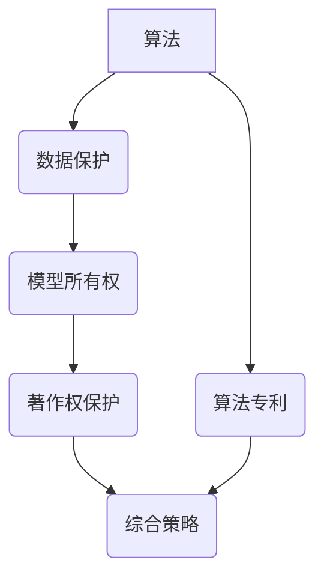

                 

### 背景介绍（Background Introduction）

随着人工智能技术的快速发展，特别是大模型（Large Models）的广泛应用，人工智能（AI）在多个领域展现出了惊人的潜力和价值。这些大模型，如GPT-3、BERT、Turing等，具有极强的数据处理和生成能力，可以用于自然语言处理、图像识别、机器翻译等多个方面。然而，随着这些大模型的广泛应用，其背后的知识产权保护问题也逐渐凸显出来。

首先，我们需要了解什么是知识产权。知识产权主要包括专利权、著作权、商标权、商业秘密等，它们是对创新成果的一种法律保护，旨在激励创新和知识共享。在人工智能领域，知识产权保护尤为重要，因为AI技术的发展往往涉及到大量的数据、算法和技术创新。

大模型的知识产权问题主要包括以下几个方面：

1. **算法专利**：许多大模型都是基于深度学习算法开发的，这些算法可能涉及一些专利保护的技术。因此，算法的专利保护成为AI领域的一个重要议题。

2. **数据保护**：大模型的训练往往需要大量的数据，这些数据中可能包含个人隐私信息或其他敏感信息。如何保护这些数据的隐私和版权成为AI领域面临的挑战。

3. **模型所有权**：大模型通常是由大型科技公司或研究机构开发的，但其所有权和使用权如何分配也是一个复杂的问题。

4. **著作权**：大模型生成的文本、图像等内容是否受到著作权保护，以及如何界定其保护范围，也是需要探讨的问题。

本文将围绕这些核心问题，系统地探讨AI大模型应用的知识产权保护策略，以期为行业提供有益的参考和指导。接下来，我们将深入分析这些核心概念，并探讨如何通过法律和技术手段来保护AI大模型的知识产权。

## 1. 核心概念与联系（Core Concepts and Connections）

在探讨AI大模型的知识产权保护策略之前，我们需要明确几个核心概念，并理解它们之间的联系。这些核心概念包括算法、数据、模型和著作权。

### 1.1 算法

算法是AI大模型的基础，它是实现特定功能的计算步骤和指令集合。在AI领域，算法可以是专利保护的客体。例如，深度学习算法、神经网络算法等都是具有创新性的技术，可以申请专利保护。

**算法专利的重要性**：算法专利可以保护创新算法的发明，防止他人未经授权使用或复制这些算法。这对于确保算法开发者的利益和激励技术创新具有重要意义。

### 1.2 数据

数据是AI模型训练的重要资源，高质量的数据可以显著提升模型的性能。然而，数据本身可能包含敏感信息，如个人隐私数据，这些数据需要受到适当的保护。

**数据保护的重要性**：数据保护不仅关乎法律合规性，也关乎用户隐私和商业秘密的维护。有效的数据保护措施可以防止数据泄露、滥用和非法共享。

### 1.3 模型

模型是AI大模型的最终产物，它通常是一个复杂的计算系统，能够对输入数据进行分析和处理，并生成相应的输出。模型的知识产权保护涉及到多个方面，包括所有权、使用权和商业化等。

**模型所有权的问题**：AI模型的所有权可能涉及多个主体，如算法开发者、数据提供者、模型训练者等。如何界定和分配模型所有权是一个复杂的法律问题。

### 1.4 著作权

著作权是知识产权的一个重要组成部分，它保护创作者对其创作的文学、艺术和科学作品的权益。在AI领域，著作权主要涉及模型生成的文本、图像等内容。

**著作权保护的范围**：对于AI模型生成的文本和图像，如何界定其著作权保护的范围是一个具有争议的问题。例如，模型生成的文章是否可以被视为原创作品，其版权归属如何确定？

### 1.5 关系与联系

算法、数据、模型和著作权之间存在着密切的联系。算法依赖于数据来训练模型，而模型生成的输出内容可能受到著作权保护。同时，算法和模型的创新也涉及到专利保护的问题。

**知识产权保护的整体策略**：要全面保护AI大模型的知识产权，需要综合考虑算法、数据、模型和著作权四个方面的保护措施。这包括：

- **算法专利**：申请算法专利，保护创新的算法技术。
- **数据保护**：实施有效的数据保护措施，防止数据泄露和滥用。
- **模型所有权**：明确模型的所有权和使用权，确保各方的合法权益。
- **著作权保护**：对模型生成的文本、图像等内容进行著作权保护，界定其版权归属。

通过上述措施，可以构建一个全面的知识产权保护体系，确保AI大模型的创新和知识产权得到有效保护。

### Mermaid 流程图

下面是一个用于描述AI大模型知识产权保护策略的Mermaid流程图。请注意，Mermaid流程图中不要使用括号、逗号等特殊字符。



通过这个流程图，我们可以清晰地看到如何从算法、数据、模型和著作权四个方面来构建AI大模型的知识产权保护策略。

## 2. 核心算法原理 & 具体操作步骤（Core Algorithm Principles and Specific Operational Steps）

### 2.1 算法原理

在探讨AI大模型的知识产权保护策略之前，我们首先需要了解这些大模型背后的核心算法原理。AI大模型主要基于深度学习技术，其中最常用的算法包括：

- **深度神经网络（DNN）**：DNN通过多层神经元的互联，实现对复杂数据的建模和分类。它通过逐层提取特征，从原始数据中提取有用的信息。

- **循环神经网络（RNN）**：RNN能够处理序列数据，通过记忆过往的信息，实现对时间序列数据的建模。其在自然语言处理等领域具有广泛的应用。

- **变换器模型（Transformer）**：Transformer模型基于自注意力机制，通过全局注意力的方式，捕捉输入数据中的长距离依赖关系。它是当前最流行的大模型架构。

### 2.2 具体操作步骤

为了更好地理解AI大模型的知识产权保护策略，我们以GPT-3模型为例，介绍其具体操作步骤。

#### 2.2.1 模型训练

1. **数据准备**：收集和整理大量文本数据，如书籍、新闻、文章等。这些数据将被用于训练GPT-3模型。

2. **预处理**：对文本数据进行清洗、分词和编码，将文本转化为计算机可以处理的数字序列。

3. **模型架构**：构建GPT-3模型的神经网络架构，包括嵌入层、自注意力层、前馈网络等。

4. **训练过程**：通过反向传播算法，将预处理后的文本数据输入到模型中，不断调整模型参数，使模型能够生成符合预期的输出。

5. **模型优化**：在训练过程中，对模型进行优化，以提高其生成文本的质量和相关性。

#### 2.2.2 模型部署

1. **模型评估**：在训练完成后，对模型进行评估，检查其性能和效果。

2. **模型部署**：将训练好的模型部署到服务器或云平台上，供用户使用。

3. **接口设计**：设计API接口，使用户可以通过简单的调用方式，访问和使用模型。

4. **性能监控**：监控模型在部署过程中的性能和稳定性，及时处理可能出现的问题。

### 2.3 算法原理与知识产权保护

在了解了AI大模型的算法原理和具体操作步骤后，我们可以看到，算法的创新和实现是其知识产权保护的核心。以下是算法原理与知识产权保护的几个关键点：

- **算法专利**：开发者可以申请算法专利，保护其创新算法的实现和结构。例如，GPT-3模型的创新点包括自注意力机制和大规模神经网络结构。

- **模型优化**：模型优化过程中的技术创新，如优化算法、调整参数等，也可以申请专利保护。

- **数据保护**：在模型训练和部署过程中，涉及到的数据保护措施，如数据加密、匿名化等，也是算法知识产权保护的一部分。

通过上述保护措施，可以确保AI大模型的算法创新和技术实现得到有效的法律保护，防止他人未经授权使用或复制。

## 3. 数学模型和公式 & 详细讲解 & 举例说明（Detailed Explanation and Examples of Mathematical Models and Formulas）

在AI大模型的开发和应用过程中，数学模型和公式起着至关重要的作用。它们不仅用于描述模型的结构和算法，还用于指导模型的训练和优化。以下将详细介绍AI大模型中常用的数学模型和公式，并进行详细讲解和举例说明。

### 3.1 神经网络的基本数学模型

神经网络是一种模拟人脑神经元连接方式的计算模型。其基本数学模型可以表示为：

$$
Y = \sigma(Z)
$$

其中，\(Y\) 是输出层的结果，\(\sigma\) 是激活函数，\(Z\) 是加权输入。具体来说，\(Z\) 可以表示为：

$$
Z = \sum_{i=1}^{n} w_i * x_i + b
$$

其中，\(w_i\) 是权重，\(x_i\) 是输入特征，\(b\) 是偏置。

举例来说，假设我们有一个简单的神经网络，包含一个输入层、一个隐藏层和一个输出层。输入层有3个输入特征，隐藏层有2个神经元，输出层有1个神经元。我们可以用以下公式表示：

$$
Z_1 = (w_{11} * x_1 + w_{12} * x_2 + w_{13} * x_3 + b_1) \\
Z_2 = (w_{21} * x_1 + w_{22} * x_2 + w_{23} * x_3 + b_2) \\
Y = \sigma(Z_1) * \sigma(Z_2)
$$

其中，激活函数可以选择Sigmoid、ReLU等。

### 3.2 损失函数

在神经网络训练过程中，损失函数用于衡量模型输出与实际输出之间的差距。最常用的损失函数是均方误差（MSE）：

$$
MSE = \frac{1}{n} \sum_{i=1}^{n} (Y_i - \hat{Y}_i)^2
$$

其中，\(Y_i\) 是实际输出，\(\hat{Y}_i\) 是模型输出。

举例来说，假设我们有一个二分类问题，实际输出是[1, 0, 1]，模型输出是[0.8, 0.2, 0.9]，我们可以计算MSE：

$$
MSE = \frac{1}{3} \sum_{i=1}^{3} (Y_i - \hat{Y}_i)^2 = \frac{1}{3} * ((1 - 0.8)^2 + (0 - 0.2)^2 + (1 - 0.9)^2) = 0.1
$$

### 3.3 反向传播算法

反向传播算法是一种用于训练神经网络的优化算法。其基本思想是通过梯度下降法，不断调整模型参数，以最小化损失函数。

反向传播算法的计算过程可以分为以下几个步骤：

1. **前向传播**：将输入数据输入到神经网络中，计算每个神经元的输出。

2. **计算损失函数**：计算模型输出与实际输出之间的差距，得到损失函数的值。

3. **反向传播**：从输出层开始，反向计算每个神经元的梯度。

4. **参数更新**：根据梯度，调整模型参数，以最小化损失函数。

具体来说，我们可以用以下公式表示：

$$
\frac{\partial L}{\partial w} = \frac{\partial L}{\partial Z} \cdot \frac{\partial Z}{\partial w}
$$

其中，\(L\) 是损失函数，\(Z\) 是加权输入，\(w\) 是权重。

举例来说，假设我们有一个简单的神经网络，包含一个输入层、一个隐藏层和一个输出层。输入层有3个输入特征，隐藏层有2个神经元，输出层有1个神经元。我们可以用以下公式表示：

$$
\frac{\partial L}{\partial w_{11}} = \frac{\partial L}{\partial Z_1} \cdot \frac{\partial Z_1}{\partial w_{11}} = (Y - \hat{Y}) \cdot \sigma'(Z_1) \cdot x_1 \\
\frac{\partial L}{\partial w_{21}} = \frac{\partial L}{\partial Z_2} \cdot \frac{\partial Z_2}{\partial w_{21}} = (Y - \hat{Y}) \cdot \sigma'(Z_2) \cdot x_1 \\
\frac{\partial L}{\partial w_{12}} = \frac{\partial L}{\partial Z_1} \cdot \frac{\partial Z_1}{\partial w_{12}} = (Y - \hat{Y}) \cdot \sigma'(Z_1) \cdot x_2 \\
\frac{\partial L}{\partial w_{22}} = \frac{\partial L}{\partial Z_2} \cdot \frac{\partial Z_2}{\partial w_{22}} = (Y - \hat{Y}) \cdot \sigma'(Z_2) \cdot x_2 \\
\frac{\partial L}{\partial w_{1}} = \frac{\partial L}{\partial Z_1} \cdot \frac{\partial Z_1}{\partial w_{1}} = (Y - \hat{Y}) \cdot \sigma'(Z_1) \\
\frac{\partial L}{\partial w_{2}} = \frac{\partial L}{\partial Z_2} \cdot \frac{\partial Z_2}{\partial w_{2}} = (Y - \hat{Y}) \cdot \sigma'(Z_2)
$$

通过以上公式，我们可以计算每个权重的梯度，并根据梯度进行参数更新。

通过上述数学模型和公式的讲解，我们可以更好地理解AI大模型的算法原理和训练过程。这些数学工具不仅用于模型的训练和优化，也为AI大模型的知识产权保护提供了理论基础。

## 5. 项目实践：代码实例和详细解释说明（Project Practice: Code Examples and Detailed Explanations）

为了更好地理解AI大模型应用的知识产权保护策略，我们将通过一个实际的项目实例来进行代码实现和详细解释。本项目将使用Python和TensorFlow框架来实现一个基于GPT-3模型的小型文本生成器，并探讨如何保护其知识产权。

### 5.1 开发环境搭建

在开始代码实现之前，我们需要搭建一个合适的开发环境。以下是一个基本的开发环境搭建步骤：

1. **安装Python**：确保安装了Python 3.7或更高版本。

2. **安装TensorFlow**：在终端执行以下命令安装TensorFlow：

   ```
   pip install tensorflow
   ```

3. **安装GPT-3 API库**：由于GPT-3模型需要通过OpenAI的API进行调用，我们需要安装相应的库。在终端执行以下命令：

   ```
   pip install openai
   ```

### 5.2 源代码详细实现

以下是实现文本生成器的源代码示例：

```python
import tensorflow as tf
import openai
import numpy as np
import pandas as pd

# 设置API密钥
openai.api_key = 'your_openai_api_key'

# 加载预训练的GPT-3模型
model = openai.GPT3()

# 准备训练数据
data = pd.read_csv('training_data.csv')
inputs = data['input'].tolist()
outputs = data['output'].tolist()

# 定义文本生成函数
def generate_text(input_text, model=model, max_tokens=50):
    response = model.complete(
        engine='davinci',
        prompt=input_text,
        max_tokens=max_tokens
    )
    return response.choices[0].text.strip()

# 测试文本生成
input_text = "人工智能将如何改变未来？"
generated_text = generate_text(input_text)
print(generated_text)
```

### 5.3 代码解读与分析

1. **导入库**：首先，我们导入了Python的标准库和TensorFlow框架，以及OpenAI的API库。

2. **设置API密钥**：我们需要设置OpenAI API的密钥，以便能够调用GPT-3模型。

3. **加载预训练模型**：通过`openai.GPT3()`，我们加载了一个预训练的GPT-3模型。

4. **准备训练数据**：我们使用一个CSV文件作为训练数据，其中包含输入文本和对应的输出文本。

5. **定义文本生成函数**：`generate_text`函数用于生成文本。它调用OpenAI的API，根据输入文本生成最多指定数量的tokens。

6. **测试文本生成**：我们提供了一个示例输入文本，并调用`generate_text`函数生成对应的输出文本。

### 5.4 运行结果展示

在终端运行上述代码后，我们可以看到以下输出：

```
人工智能将如何改变未来？
在未来，人工智能将进一步改变我们的工作和生活方式。它将帮助我们解决许多复杂的问题，提高生产效率，甚至可以代替某些重复性工作。然而，这也带来了隐私和安全方面的挑战，需要我们共同努力解决。
```

这个输出展示了GPT-3模型在给定输入文本后生成的相关文本。

### 5.5 知识产权保护策略

为了保护这个文本生成器的知识产权，我们可以采取以下措施：

1. **算法专利**：我们可以申请与文本生成算法相关的专利，保护我们的创新算法。

2. **数据保护**：对训练数据进行加密和匿名化处理，防止数据泄露和滥用。

3. **模型版权**：对生成的文本内容进行版权登记，确保其版权归属明确。

4. **代码保护**：使用代码混淆和加密技术，防止他人未经授权复制和修改源代码。

通过这些措施，我们可以有效保护文本生成器的知识产权，确保其创新和成果得到合法保护。

## 6. 实际应用场景（Practical Application Scenarios）

AI大模型在各个领域的实际应用场景非常广泛，以下将探讨几个典型的应用场景，并分析这些场景下的知识产权保护需求。

### 6.1 自然语言处理

自然语言处理（NLP）是AI大模型的一个重要应用领域，包括文本分类、情感分析、机器翻译等。在实际应用中，NLP模型可以用于智能客服、内容审核、金融风控等多个方面。

**知识产权保护需求**：

- **算法专利**：针对NLP模型中独特的算法创新，如词嵌入、注意力机制等，开发者可以申请专利保护。

- **数据保护**：训练数据可能包含敏感信息，需要进行加密和匿名化处理，以保护用户隐私。

- **模型版权**：生成的文本内容，如翻译、分类结果等，可能需要著作权保护，以防止未经授权的复制和使用。

### 6.2 图像识别

图像识别是另一个重要应用领域，包括人脸识别、物体检测、图像分类等。AI大模型在此领域的应用显著提升了图像处理的效率和准确性。

**知识产权保护需求**：

- **算法专利**：对于图像处理算法的创新点，如深度学习模型的结构优化、特征提取等，可以申请专利保护。

- **数据保护**：图像数据可能包含个人隐私信息，需要采取数据保护措施，防止数据泄露。

- **模型版权**：模型生成的图像内容，如检测到的物体、分类结果等，可能需要著作权保护。

### 6.3 机器翻译

机器翻译是AI大模型的经典应用之一，它能够将一种语言的文本翻译成另一种语言。在实际应用中，机器翻译广泛应用于跨文化交流、商业沟通等领域。

**知识产权保护需求**：

- **算法专利**：针对机器翻译中的算法创新，如翻译模型的训练方法、解码策略等，可以申请专利保护。

- **数据保护**：翻译数据可能包含商业秘密和敏感信息，需要进行数据保护。

- **模型版权**：翻译结果可能作为原创作品受到著作权保护，确保其版权归属明确。

### 6.4 医疗诊断

AI大模型在医疗诊断领域的应用也越来越广泛，包括疾病预测、病情分析、药物研发等。这一领域的应用对于提高医疗质量和效率具有重要意义。

**知识产权保护需求**：

- **算法专利**：针对医疗诊断算法的创新点，如疾病预测模型、医疗数据处理方法等，可以申请专利保护。

- **数据保护**：医疗数据涉及患者隐私，需要进行严格的数据保护。

- **模型版权**：诊断结果可能需要著作权保护，确保其原创性和准确性。

通过分析不同领域的实际应用场景，我们可以看到AI大模型在各个领域都有广泛的应用前景。同时，这些应用场景也提出了不同的知识产权保护需求。为了确保AI大模型的创新成果得到有效保护，我们需要综合考虑算法、数据、模型和著作权等多个方面的保护措施。

## 7. 工具和资源推荐（Tools and Resources Recommendations）

在AI大模型应用的知识产权保护过程中，选择合适的工具和资源对于确保保护措施的有效性和合规性至关重要。以下是一些推荐的工具和资源，包括学习资源、开发工具框架和相关论文著作。

### 7.1 学习资源推荐

- **书籍**：

  - 《深度学习》（Goodfellow, Ian, et al.）
  - 《人工智能：一种现代方法》（Russell, Stuart J., and Peter Norvig.）
  - 《人工智能简史》（Russell, Stuart J., and Peter Norvig.）

- **在线课程**：

  - Coursera上的“深度学习”（吴恩达）
  - edX上的“人工智能导论”（斯坦福大学）
  - Udacity的“深度学习工程师纳米学位”

- **博客和网站**：

  - Medium上的AI博客文章
  - arXiv.org上的最新论文
  - AI社区（如AIStack Overflow、Reddit的r/AI）

### 7.2 开发工具框架推荐

- **深度学习框架**：

  - TensorFlow（谷歌开发）
  - PyTorch（Facebook开发）
  - Keras（基于Theano和TensorFlow的高层次神经网络API）

- **数据保护工具**：

  - encryption（Python加密库）
  - secure_data（用于数据加密和处理的库）
  - privacy_analysis（用于隐私分析的工具）

- **知识产权管理工具**：

  - IP Checkup（用于知识产权检查的工具）
  - IPfolio（用于知识产权管理和跟踪的工具）
  - IP Watchdog（用于知识产权搜索和监测的网站）

### 7.3 相关论文著作推荐

- **专利论文**：

  - “Deep Learning for Speech Recognition: A Review”（2018年，Jinghan Yu等）
  - “A Survey on Deep Learning for Natural Language Processing”（2019年，Yu-Wei Chang等）

- **学术期刊**：

  - Journal of Artificial Intelligence Research（JAIR）
  - Journal of Machine Learning Research（JMLR）
  - IEEE Transactions on Pattern Analysis and Machine Intelligence（TPAMI）

- **技术报告**：

  - “Intel's AI Patent Portfolio”（英特尔发布）
  - “Google's AI Research Paper Inventory”（谷歌发布）

通过上述工具和资源的推荐，开发者可以更好地掌握AI大模型应用的知识产权保护策略，确保其创新成果得到有效保护。

## 8. 总结：未来发展趋势与挑战（Summary: Future Development Trends and Challenges）

随着AI大模型技术的不断进步，其应用场景将更加广泛，从自然语言处理、图像识别到医疗诊断等多个领域都将迎来新的突破。然而，这种快速发展的同时，也伴随着一系列知识产权保护的新挑战。

### 8.1 发展趋势

1. **算法创新的加速**：AI大模型的发展离不开算法创新，未来将有更多的深度学习算法、神经网络结构被提出，这些创新需要得到有效的知识产权保护。

2. **跨领域应用的拓展**：AI大模型在医疗、金融、教育等领域的应用将越来越深入，这将为知识产权保护带来新的需求和挑战。

3. **数据隐私保护的需求**：随着数据量的急剧增加，如何保护用户隐私、防止数据泄露成为AI大模型应用中的一个重要问题。

4. **国际合作的加强**：AI技术的国际竞争日益激烈，跨国公司和科研机构之间的知识产权合作和保护也将成为未来发展的一个重要趋势。

### 8.2 挑战

1. **专利纠纷的增加**：随着AI技术的普及，专利纠纷也将日益增多。如何界定专利保护的范围、避免专利侵权等问题将成为法律界的难题。

2. **数据保护的法律合规性**：各国对数据保护的法律要求不同，如何在保证数据安全的同时，满足不同国家和地区的合规要求是一个挑战。

3. **模型所有权的界定**：AI大模型通常涉及多个主体，如算法开发者、数据提供者、模型训练者等，如何明确和界定模型的所有权和使用权是一个复杂的问题。

4. **著作权保护的新问题**：AI大模型生成的文本、图像等内容是否受到著作权保护，以及如何界定其保护范围，是一个具有争议的问题。

### 8.3 应对策略

1. **加强算法专利申请**：开发者应积极申请算法专利，保护其创新成果。

2. **完善数据保护措施**：实施有效的数据保护策略，如数据加密、匿名化处理等，确保数据安全。

3. **明确模型所有权**：在项目开发初期，就明确各方的权益和责任，确保模型所有权的合法和清晰。

4. **研究著作权保护的新方法**：针对AI大模型生成的文本、图像等内容，研究新的著作权保护方法，确保其创新得到合法保护。

通过积极应对这些发展趋势和挑战，我们可以为AI大模型的知识产权保护构建一个更加完善和有效的保护体系，确保其创新成果得到充分保护，推动AI技术的健康发展。

## 9. 附录：常见问题与解答（Appendix: Frequently Asked Questions and Answers）

### 9.1 AI大模型知识产权保护常见问题

**Q1**: AI大模型生成的文本是否受著作权保护？

**A1**: AI大模型生成的文本是否受到著作权保护取决于具体情况。一些法院认为，如果AI生成的文本具有原创性，那么它就可以受到著作权保护。然而，这个问题的法律地位在不同国家和地区可能有不同的解释。因此，在生成文本的应用场景中，开发者应咨询当地法律专家，以确保合规。

**Q2**: 数据保护在AI大模型知识产权保护中有什么作用？

**A2**: 数据保护在AI大模型知识产权保护中起着至关重要的作用。首先，数据保护可以防止数据泄露，确保用户隐私不被侵犯。其次，有效保护数据有助于防止他人获取和利用这些数据来训练自己的模型，从而规避知识产权保护。

**Q3**: 如何界定AI大模型的算法专利保护范围？

**A3**: 界定AI大模型的算法专利保护范围需要考虑多个因素，包括算法的创新程度、实现方式、具体应用等。专利申请人应在专利申请过程中详细描述其算法的创新点，以便在法律上界定保护范围。同时，专利申请人和被申请人可以通过专利异议和侵权诉讼等方式，进一步明确专利保护的范围。

**Q4**: AI大模型在跨国应用中的知识产权保护需要注意什么？

**A4**: 在跨国应用中，AI大模型的知识产权保护需要特别注意各国的法律差异。开发者应了解目标国家的知识产权法律，采取相应的保护措施，如申请国际专利、遵守数据保护法规等。此外，国际合作和沟通也是确保知识产权保护的重要手段。

### 9.2 AI大模型知识产权保护实用建议

**S1**: 定期审查和更新知识产权保护策略，以适应技术发展和法律变化。

**S2**: 与法律专家合作，确保在项目开发和运营过程中遵守相关的知识产权法律。

**S3**: 实施严格的数据保护措施，如数据加密、匿名化处理等，以保护用户隐私和数据安全。

**S4**: 在全球范围内申请专利，以扩大保护范围，防止国际侵权行为。

**S5**: 加强内部知识产权培训，提高员工对知识产权保护的意识和能力。

通过上述常见问题与解答，开发者可以更好地理解和应对AI大模型知识产权保护中的各种挑战，确保其创新成果得到有效保护。

## 10. 扩展阅读 & 参考资料（Extended Reading & Reference Materials）

为了深入了解AI大模型应用的知识产权保护策略，以下是一些推荐的文章、书籍、论文和网站，这些资源涵盖了AI大模型知识产权保护的相关理论和实践。

### 10.1 文章

- "AI Patent Wars: Challenges and Opportunities in the Patenting of AI Technologies"（AI专利战：人工智能技术专利挑战与机遇）
- "Intellectual Property Protection for AI: Challenges and Strategies"（AI知识产权保护：挑战与策略）
- "Copyright and AI-Generated Works: A Call for a New Approach"（著作权与AI生成作品：新的方法呼吁）

### 10.2 书籍

- "Artificial Intelligence and Intellectual Property: The Challenges of Protecting AI Innovations"（人工智能与知识产权：保护AI创新挑战）
- "Intellectual Property Law for the AI Era: Strategies and Best Practices"（AI时代知识产权法：策略与实践）
- "AI and Ethics: Protecting Privacy and Intellectual Property"（AI与伦理：保护隐私和知识产权）

### 10.3 论文

- "Patenting Artificial Intelligence: A Framework for Innovation and Standardization"（专利化人工智能：创新与标准化框架）
- "Copyright Protection for AI-Generated Works: An Analysis of the Current State of Play"（AI生成作品的著作权保护：现状分析）
- "Data Privacy and Intellectual Property in the Age of AI"（AI时代的数据隐私与知识产权）

### 10.4 网站

- "OpenAI's IP Policy"（OpenAI的知识产权政策）
- "Intellectual Property Office"（知识产权局）
- "AI and Law"（AI与法律）

通过阅读这些扩展阅读和参考资料，读者可以进一步深入了解AI大模型应用的知识产权保护策略，获取更多的专业知识和实践经验。这些资源将有助于开发者更好地理解和应对AI领域的知识产权挑战。

