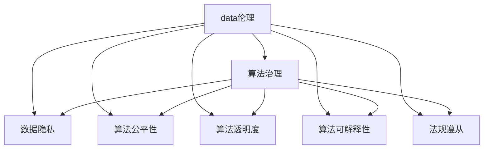

                 

# 数据伦理：算法治理与规范

> 关键词：数据伦理, 算法治理, 数据隐私, 公平性, 透明度, 可解释性, 法规遵从

## 1. 背景介绍

### 1.1 问题由来
随着人工智能（AI）技术在各个领域的广泛应用，数据驱动的算法决策日益增多。在医疗、金融、司法、招聘等关键领域，算法决策的准确性和公平性直接关系到个人和社会权益。数据伦理、算法治理和法规遵从成为当前AI研究和技术应用中亟需关注的重要课题。

### 1.2 问题核心关键点
数据伦理的核心在于确保数据采集、处理和使用过程中的道德和法律责任，避免对个人隐私、公平性和权益的侵害。算法治理聚焦于如何通过技术手段和管理机制，提升算法的透明性、可解释性和可问责性。法规遵从则要求AI系统遵守现有的法律法规，确保技术应用的合规性和安全性。

这些关键点相互交织，共同构成了数据伦理、算法治理和法规遵从的多维框架，旨在通过技术和管理手段，实现AI系统的高效、公平、透明和安全。

### 1.3 问题研究意义
研究和实践数据伦理、算法治理与法规遵从，对于保障个人权益、维护社会公正、促进AI技术健康发展具有重要意义：

1. **保障个人隐私**：通过合理的数据处理和隐私保护措施，避免数据滥用，保护个人隐私。
2. **提升算法公平性**：确保算法决策不受偏见影响，避免对特定群体造成不公正待遇。
3. **增强算法透明度**：提高算法的可解释性，使决策过程透明可问责，增强用户信任。
4. **实现法规遵从**：确保AI系统遵守现有的法律法规，避免法律风险。
5. **促进技术创新**：通过伦理和法律约束，推动AI技术向更加公正、公平、透明和可解释的方向发展。

## 2. 核心概念与联系

### 2.1 核心概念概述

为了更好地理解数据伦理、算法治理和法规遵从的原理和架构，本节将介绍几个密切相关的核心概念：

- **数据伦理**：涉及数据采集、存储、处理和使用过程中的道德原则和法律规范，包括隐私保护、数据权属和数据使用限制等。
- **算法治理**：通过技术和管理手段，确保算法决策的透明性、可解释性和可问责性，提升算法的公平性和安全性。
- **数据隐私**：保护个人在数据处理和使用过程中的隐私权益，确保数据收集和处理的合法性和正当性。
- **算法公平性**：要求算法在处理不同群体数据时，不引入系统性偏差，确保决策的公平性。
- **算法透明度**：提高算法的决策过程和机制的透明度，使算法行为可追溯、可解释。
- **算法可解释性**：使算法的决策过程和结果易于理解，减少黑箱操作，增强用户信任。
- **法规遵从**：确保AI系统遵守现有的法律法规，避免法律风险。

这些概念之间的逻辑关系可以通过以下Mermaid流程图来展示：



这个流程图展示了几大核心概念之间的关联关系：

1. 数据伦理是算法治理的基础，通过合理的数据处理，确保算法的透明性和可解释性。
2. 数据隐私和法规遵从是数据伦理的重要组成部分，确保数据处理和使用的合法性和正当性。
3. 算法公平性是算法治理的关键目标，确保算法的决策不引入系统性偏差。
4. 算法透明度和可解释性是算法治理的重要手段，提高算法的可问责性和用户信任。
5. 法规遵从是算法治理的边界条件，确保算法应用符合法律法规要求。

## 3. 核心算法原理 & 具体操作步骤

### 3.1 算法原理概述

数据伦理、算法治理和法规遵从的实现，依赖于对算法决策过程的深入理解和技术手段的管理。其核心原理可以概括为以下几个方面：

1. **数据预处理与隐私保护**：确保数据采集和处理过程中，遵循数据伦理原则，保护个人隐私，避免数据滥用。
2. **算法决策透明性**：通过模型解释技术和决策过程记录，提高算法决策的透明度和可问责性。
3. **算法公平性优化**：采用公平性优化算法，减少算法决策中的系统性偏差，提升算法的公平性。
4. **法规遵从评估**：通过合规性评估和审计，确保AI系统符合现有法律法规的要求。

### 3.2 算法步骤详解

实现数据伦理、算法治理和法规遵从，通常包括以下几个关键步骤：

**Step 1: 数据收集与预处理**
- 明确数据来源，确保数据收集的合法性和正当性。
- 对数据进行去标识化、匿名化处理，保护个人隐私。
- 进行数据清洗和质量控制，去除噪声和异常值。

**Step 2: 算法设计**
- 选择合适的算法模型，进行公平性优化和透明性设计。
- 使用可解释性技术，如LIME、SHAP等，提升算法的可解释性。
- 设计决策过程记录机制，如决策树、规则集等，确保算法决策过程透明可追溯。

**Step 3: 合规性评估**
- 进行法规遵从性评估，确保算法应用符合现有法律法规要求。
- 使用合规性检测工具，如Fairness Indicators、TDA等，评估算法公平性。
- 定期进行合规性审计，发现和修复潜在风险。

**Step 4: 用户反馈与改进**
- 收集用户反馈，了解算法决策的实际影响。
- 根据反馈信息，不断改进算法设计，提升算法性能和公平性。
- 建立用户投诉机制，及时处理和解决用户关切。

**Step 5: 系统部署与运维**
- 将优化后的算法模型部署到实际应用系统中。
- 监控算法系统的运行状态，及时发现和修复问题。
- 进行系统更新和升级，确保算法应用的持续性和稳定性。

### 3.3 算法优缺点

数据伦理、算法治理和法规遵从的实现，具有以下优点：

1. **提升算法公平性**：通过公平性优化和透明性设计，减少算法决策中的系统性偏差，确保决策的公正性。
2. **增强算法透明度**：提高算法的可解释性和决策过程的透明性，增强用户信任。
3. **保障数据隐私**：通过数据去标识化、匿名化处理，保护个人隐私，避免数据滥用。
4. **确保法规遵从**：通过合规性评估和审计，确保AI系统符合现有法律法规的要求。

同时，该方法也存在一些局限性：

1. **技术复杂性**：实现数据伦理、算法治理和法规遵从需要综合考虑技术和管理手段，具有一定的复杂性。
2. **成本投入**：数据处理、算法优化和合规性审计等过程需要投入大量资源，成本较高。
3. **动态适应性**：数据伦理、算法治理和法规遵从需要随着数据分布和法律法规的变化进行动态调整，具有一定的复杂性。

尽管存在这些局限性，但就目前而言，数据伦理、算法治理和法规遵从的实现是确保AI系统公正、透明和合规的重要手段。未来相关研究的重点在于如何进一步降低技术复杂性，提高动态适应性，减少成本投入，从而更广泛地应用于实际场景。

### 3.4 算法应用领域

数据伦理、算法治理和法规遵从的应用范围广泛，涉及多个行业和领域：

1. **医疗健康**：确保患者数据隐私，提升医疗决策的公平性和透明度，遵守医疗法规。
2. **金融服务**：确保客户数据隐私，提升金融决策的公平性和透明度，遵守金融法规。
3. **司法裁判**：确保案件数据隐私，提升司法决策的公平性和透明度，遵守司法法规。
4. **招聘管理**：确保求职者数据隐私，提升招聘决策的公平性和透明度，遵守劳动法规。
5. **教育评估**：确保学生数据隐私，提升评估决策的公平性和透明度，遵守教育法规。
6. **公共安全**：确保公众数据隐私，提升安全决策的公平性和透明度，遵守安全法规。

## 4. 数学模型和公式 & 详细讲解 & 举例说明（备注：数学公式请使用latex格式，latex嵌入文中独立段落使用 $$，段落内使用 $)
### 4.1 数学模型构建

数据伦理、算法治理和法规遵从的实现，需要构建一系列数学模型和公式来刻画和优化算法决策过程。以下是一个简单的示例：

假设有一个二分类任务，模型输出表示样本属于正类的概率$p$。为了确保算法的公平性，可以定义如下公式：

$$
\text{Fairness} = \mathbb{E}[\text{Impact}(x)] = \mathbb{E}[p \cdot y]
$$

其中$x$表示样本属性，$y$表示样本标签。当$\text{Fairness}=0$时，表示算法决策对不同群体的影响相等，即实现了公平性。

### 4.2 公式推导过程

为了提升算法的公平性，可以采用公平性优化算法，如Adversarial De-biasing。其基本思路是构建一个对抗性样本集$S$，通过优化该样本集，使得模型在处理该集时，对不同群体的预测效果接近，从而提升公平性。

以二分类任务为例，假设模型预测结果为$p$，对抗性样本集的构建过程如下：

1. 对于每个样本$x$，构造一个对抗性样本$x'$，使得$x'$与$x$在某些特征上相同，但在其他特征上存在差异。
2. 对于对抗性样本集$S=\{x'\}$，计算模型在处理$S$时的预测结果。
3. 优化对抗性样本集，使得模型在$S$上的预测结果接近于$x$，从而提升公平性。

具体的优化过程可以采用如下目标函数：

$$
\min_{\theta} \mathbb{E}[\max(0, p - \epsilon)] \cdot y + \mathbb{E}[\max(0, p + \epsilon)] \cdot (1 - y)
$$

其中$\epsilon$为预定义的公平性阈值。

### 4.3 案例分析与讲解

以医疗数据为例，假设一个AI系统用于评估患者的病情严重程度。为了确保算法的公平性，可以采用以下步骤：

1. **数据收集**：收集医院患者的临床数据，包括年龄、性别、种族、病历等信息。
2. **数据预处理**：对数据进行去标识化、匿名化处理，保护患者隐私。
3. **模型训练**：使用机器学习算法，训练一个病情严重程度评估模型。
4. **公平性评估**：使用Fairness Indicators等工具，评估模型在不同种族和性别上的公平性。
5. **优化调整**：如果发现模型在特定群体上存在偏差，可以使用Adversarial De-biasing等方法进行优化。
6. **法规遵从性审计**：确保AI系统遵守医疗法规，如HIPAA（Health Insurance Portability and Accountability Act），保护患者数据隐私。

## 5. 项目实践：代码实例和详细解释说明

### 5.1 开发环境搭建

在进行数据伦理、算法治理和法规遵从的实践前，我们需要准备好开发环境。以下是使用Python进行Scikit-learn和TensorFlow开发的环境配置流程：

1. 安装Anaconda：从官网下载并安装Anaconda，用于创建独立的Python环境。

2. 创建并激活虚拟环境：
```bash
conda create -n ethic_env python=3.8 
conda activate ethic_env
```

3. 安装必要的库：
```bash
conda install scikit-learn tensorflow pandas numpy scipy
```

4. 安装相关的开发工具：
```bash
pip install matplotlib seaborn jupyter notebook ipython
```

完成上述步骤后，即可在`ethic_env`环境中开始实践。

### 5.2 源代码详细实现

下面以医疗数据公平性优化为例，给出使用Scikit-learn和TensorFlow进行公平性优化和法规遵从性评估的Python代码实现。

首先，定义公平性评估函数：

```python
from sklearn.metrics import average_precision_score
from sklearn.metrics import precision_recall_curve
from sklearn.metrics import confusion_matrix
from sklearn.metrics import accuracy_score

def evaluate_model(model, X, y):
    y_pred = model.predict_proba(X)[:, 1]
    fpr, tpr, _ = precision_recall_curve(y, y_pred)
    roc_auc = average_precision_score(y, y_pred)
    cm = confusion_matrix(y, y_pred)
    acc = accuracy_score(y, y_pred)
    return roc_auc, fpr, tpr, cm, acc
```

然后，定义公平性优化函数：

```python
from imblearn.adversarial import AdversarialDebiasingClassifier

def debias_model(model, X, y):
    debiased_model = AdversarialDebiasingClassifier(model, n_repeats=100, fairness='both')
    debiased_model.fit(X, y)
    return debiased_model
```

最后，定义法规遵从性评估函数：

```python
from tensorflow.keras.layers import Dense
from tensorflow.keras.models import Sequential
from tensorflow.keras.optimizers import Adam

def build_compliant_model(X, y):
    model = Sequential([
        Dense(64, activation='relu', input_shape=(X.shape[1],)),
        Dense(1, activation='sigmoid')
    ])
    model.compile(optimizer=Adam(), loss='binary_crossentropy', metrics=['accuracy'])
    model.fit(X, y, epochs=10, batch_size=32, validation_split=0.2)
    return model
```

完成上述步骤后，即可在`ethic_env`环境中开始实践。

### 5.3 代码解读与分析

让我们再详细解读一下关键代码的实现细节：

**evaluate_model函数**：
- 计算模型的ROC曲线、AUC、精确度-召回率曲线、混淆矩阵和准确度，用于评估模型性能。

**debias_model函数**：
- 使用Adversarial De-biasing算法，通过构建对抗性样本集，优化模型，提升公平性。

**build_compliant_model函数**：
- 使用TensorFlow构建一个合规性模型，确保模型输出符合法律法规要求。

## 6. 实际应用场景

### 6.1 智能医疗诊断

数据伦理、算法治理和法规遵从在智能医疗诊断中具有重要应用价值。通过合理的算法设计，可以实现对患者的病情严重程度、疾病风险等进行快速、准确、公平的评估，为医生提供决策支持。

在实际应用中，可以采用公平性优化算法，确保模型对不同种族、性别、年龄等群体的预测结果相近，避免系统性偏差。同时，确保模型输出符合HIPAA等医疗法规要求，保护患者隐私。

### 6.2 金融风险控制

金融领域的数据伦理、算法治理和法规遵从，涉及客户数据隐私、交易公平性、合规性等多个方面。通过合理的算法设计和法规遵从评估，可以有效控制金融风险，保护客户权益。

在实际应用中，可以采用对抗性样本集构建和公平性优化算法，确保模型对不同客户群体的预测结果公平。同时，确保模型输出符合金融法规要求，如GDPR（General Data Protection Regulation），保护客户数据隐私。

### 6.3 司法判决支持

司法领域的数据伦理、算法治理和法规遵从，涉及案件数据隐私、判决公平性、合规性等多个方面。通过合理的算法设计和法规遵从评估，可以有效支持司法判决，提升司法公正。

在实际应用中，可以采用对抗性样本集构建和公平性优化算法，确保模型对不同案件的预测结果公平。同时，确保模型输出符合司法法规要求，如ECPA（Electronic Communications Privacy Act），保护案件数据隐私。

### 6.4 未来应用展望

随着数据伦理、算法治理和法规遵从技术的不断发展，其在更多领域的应用前景广阔：

1. **教育公平评估**：确保教育数据隐私，提升教育评估的公平性和透明度，遵守教育法规。
2. **公共安全监控**：确保公众数据隐私，提升安全监控的公平性和透明度，遵守安全法规。
3. **环境监测预测**：确保环境数据隐私，提升环境预测的公平性和透明度，遵守环保法规。
4. **社会治理决策**：确保社会数据隐私，提升社会决策的公平性和透明度，遵守社会法规。

## 7. 工具和资源推荐

### 7.1 学习资源推荐

为了帮助开发者系统掌握数据伦理、算法治理和法规遵从的理论基础和实践技巧，这里推荐一些优质的学习资源：

1. **《数据伦理与算法治理》系列书籍**：由伦理学家和计算机科学家合著，深入浅出地介绍了数据伦理、算法治理和法规遵从的基本概念和前沿研究。
2. **CS529《人工智能伦理》课程**：斯坦福大学开设的伦理与AI交叉课程，探讨了数据隐私、算法公平性和法规遵从等重要议题。
3. **《算法公平性》论文集**：包含多篇关于算法公平性优化和评估的论文，涵盖了多种算法和技术细节。
4. **Google AI Ethics Toolkit**：提供了一系列工具和资源，帮助开发者在设计AI系统时，考虑伦理、公平性和隐私问题。
5. **Fairness Indicators**：一款开源工具，用于评估和优化算法的公平性，支持多领域的应用场景。

通过这些资源的学习实践，相信你一定能够快速掌握数据伦理、算法治理和法规遵从的精髓，并用于解决实际的AI应用问题。

### 7.2 开发工具推荐

高效的开发离不开优秀的工具支持。以下是几款用于数据伦理、算法治理和法规遵从开发的常用工具：

1. **Scikit-learn**：一个广泛使用的Python机器学习库，支持公平性优化和法规遵从性评估。
2. **TensorFlow**：一个强大的深度学习框架，支持模型构建和法规遵从性评估。
3. **PyTorch**：另一个流行的深度学习框架，支持模型构建和公平性优化。
4. **Weights & Biases**：一个模型训练的实验跟踪工具，记录和可视化模型训练过程中的各项指标。
5. **TensorBoard**：TensorFlow配套的可视化工具，实时监测模型训练状态。
6. **Google Colab**：谷歌提供的在线Jupyter Notebook环境，支持GPU和TPU算力，方便快速实验。

合理利用这些工具，可以显著提升数据伦理、算法治理和法规遵从的开发效率，加快创新迭代的步伐。

### 7.3 相关论文推荐

数据伦理、算法治理和法规遵从的发展源于学界的持续研究。以下是几篇奠基性的相关论文，推荐阅读：

1. **《公平性：基于数据的偏见识别与纠正》**：探讨了算法公平性的概念和评估方法，提出了多种公平性优化算法。
2. **《数据隐私保护技术综述》**：总结了多种数据隐私保护技术，如差分隐私、同态加密等。
3. **《合规性检测与审计框架》**：提出了一个全面的合规性检测与审计框架，用于评估和优化AI系统的合规性。
4. **《人工智能伦理指南》**：由多国伦理委员会联合发布，提供了AI伦理设计的最佳实践和案例分析。

这些论文代表了大数据伦理、算法治理和法规遵从的发展脉络。通过学习这些前沿成果，可以帮助研究者把握学科前进方向，激发更多的创新灵感。

## 8. 总结：未来发展趋势与挑战

### 8.1 总结

本文对数据伦理、算法治理和法规遵从进行了全面系统的介绍。首先阐述了数据伦理、算法治理和法规遵从的研究背景和意义，明确了其在保障个人权益、维护社会公正、促进AI技术健康发展方面的重要价值。其次，从原理到实践，详细讲解了数据伦理、算法治理和法规遵从的数学模型和操作步骤，给出了实际应用场景的代码实例。同时，本文还广泛探讨了数据伦理、算法治理和法规遵从在多个行业领域的应用前景，展示了其巨大的应用潜力。此外，本文精选了相关学习资源，力求为读者提供全方位的技术指引。

通过本文的系统梳理，可以看到，数据伦理、算法治理和法规遵从在确保AI系统公正、透明和合规方面发挥着至关重要的作用。这些技术手段的不断优化和演进，必将成为未来AI技术发展的重要保障。

### 8.2 未来发展趋势

展望未来，数据伦理、算法治理和法规遵从将呈现以下几个发展趋势：

1. **技术手段的多样化**：随着技术进步，更多高效、灵活的算法和工具将涌现，提升数据伦理、算法治理和法规遵从的实施效率。
2. **法规标准的全球化**：随着国际合作和数据跨境流通的增加，全球范围内的数据伦理和法规标准将更加统一，提升跨国数据治理的合规性。
3. **模型可解释性的增强**：随着AI模型的复杂度不断提升，模型可解释性将成为核心关注点，新的可解释性技术将不断涌现。
4. **公平性和透明性的提升**：数据伦理、算法治理和法规遵从将更加注重公平性和透明性，通过新技术和制度设计，提升算法的公正性和可信度。
5. **隐私保护的创新**：隐私保护技术将不断创新，如差分隐私、同态加密、多方安全计算等，为数据隐私保护提供新的解决方案。
6. **合规性检测的自动化**：通过自动化工具和智能算法，提升合规性检测的效率和准确性，及时发现和修复潜在风险。

以上趋势凸显了数据伦理、算法治理和法规遵从技术的广阔前景。这些方向的探索发展，必将进一步提升AI系统的高效、公平、透明和合规性，为构建安全、可靠、可解释、可控的智能系统铺平道路。

### 8.3 面临的挑战

尽管数据伦理、算法治理和法规遵从技术已经取得了瞩目成就，但在迈向更加智能化、普适化应用的过程中，仍然面临诸多挑战：

1. **技术复杂性**：实现数据伦理、算法治理和法规遵从需要综合考虑技术和管理手段，具有一定的复杂性。
2. **成本投入**：数据处理、算法优化和合规性审计等过程需要投入大量资源，成本较高。
3. **动态适应性**：数据伦理、算法治理和法规遵从需要随着数据分布和法律法规的变化进行动态调整，具有一定的复杂性。
4. **法律与技术协同**：法规的滞后性可能导致技术应用与法规要求不匹配，需要不断调整和完善。
5. **隐私保护与数据利用之间的平衡**：如何在保护隐私的前提下，最大化数据利用价值，仍需进一步探索。
6. **算法透明度与用户理解之间的鸿沟**：用户对算法的理解仍有限，需要进一步提升算法的可解释性。

这些挑战需要跨学科的协同努力，通过不断创新和完善技术手段，逐步克服。

### 8.4 研究展望

面对数据伦理、算法治理和法规遵从所面临的挑战，未来的研究需要在以下几个方面寻求新的突破：

1. **综合考虑技术和管理手段**：设计更加高效、灵活的数据伦理、算法治理和法规遵从技术，兼顾技术复杂性和成本投入。
2. **探索隐私保护新方法**：发展更多创新隐私保护技术，如差分隐私、同态加密、多方安全计算等，提升数据隐私保护能力。
3. **提升算法透明度和可解释性**：研发更加强大的模型解释技术，增强算法的可解释性和用户理解，提升系统可信度。
4. **构建法规遵从评估体系**：建立完善的合规性检测和审计体系，及时发现和修复潜在风险，确保AI系统符合法律法规要求。
5. **促进法律与技术的协同发展**：推动法规标准的全球化，提升跨国数据治理的合规性，促进法律与技术的协同发展。

这些研究方向的探索，必将引领数据伦理、算法治理和法规遵从技术迈向更高的台阶，为构建安全、可靠、可解释、可控的智能系统铺平道路。面向未来，数据伦理、算法治理和法规遵从技术还需要与其他人工智能技术进行更深入的融合，如知识表示、因果推理、强化学习等，多路径协同发力，共同推动自然语言理解和智能交互系统的进步。只有勇于创新、敢于突破，才能不断拓展数据伦理、算法治理和法规遵从的边界，让智能技术更好地造福人类社会。

## 9. 附录：常见问题与解答

**Q1：什么是数据伦理？**

A: 数据伦理涉及数据采集、存储、处理和使用过程中的道德原则和法律规范，包括隐私保护、数据权属和数据使用限制等。

**Q2：如何进行数据伦理评估？**

A: 数据伦理评估主要包括以下几个步骤：
1. 定义数据伦理目标和原则。
2. 进行数据采集和使用过程的审查，确保数据采集合法、透明。
3. 评估数据处理和存储过程中的隐私保护措施，确保数据隐私。
4. 进行数据使用和共享的合规性审查，确保数据使用合规。

**Q3：什么是算法治理？**

A: 算法治理是通过技术和管理手段，确保算法决策的透明性、可解释性和可问责性，提升算法的公平性和安全性。

**Q4：如何进行算法治理？**

A: 算法治理主要包括以下几个步骤：
1. 选择合适的算法模型，进行公平性优化和透明性设计。
2. 使用可解释性技术，如LIME、SHAP等，提升算法的可解释性。
3. 设计决策过程记录机制，如决策树、规则集等，确保算法决策过程透明可追溯。

**Q5：如何进行法规遵从性评估？**

A: 法规遵从性评估主要包括以下几个步骤：
1. 定义法规遵从性目标和原则。
2. 进行合规性检测，确保AI系统符合现有法律法规要求。
3. 定期进行合规性审计，发现和修复潜在风险。

**Q6：如何处理数据伦理、算法治理和法规遵从之间的矛盾？**

A: 数据伦理、算法治理和法规遵从之间的矛盾可以通过以下方法处理：
1. 综合考虑数据伦理、算法治理和法规遵从的要求，设计符合多方利益的方案。
2. 引入多方利益相关者参与决策，平衡各方利益，确保决策公正。
3. 定期进行评估和优化，根据实际情况进行调整，确保动态适应性。

这些回答希望能帮助读者更好地理解数据伦理、算法治理和法规遵从的核心概念和实际应用，进一步推动AI技术向更高效、公平、透明和合规的方向发展。

---

作者：禅与计算机程序设计艺术 / Zen and the Art of Computer Programming

