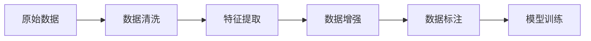

                 

# 数据决定一切：AI训练数据的收集与处理

> 关键词：数据预处理, 数据增强, 数据清洗, 数据集构建, 数据标注, 数据采集

## 1. 背景介绍

### 1.1 问题由来
在人工智能领域，尤其是深度学习和机器学习领域，数据的质量和数量往往决定了模型的性能。无论是在模型设计、训练过程还是最终应用中，数据都是最为关键的因素之一。然而，获取高质量的数据并不总是容易的，尤其是在不同行业和领域中，数据获取的难易程度、数据的多样性和代表性都有很大差异。本章节将详细介绍AI训练数据收集与处理的核心问题，并探讨如何通过高效的数据处理技术，提升AI模型的效果和性能。

### 1.2 问题核心关键点
AI训练数据的收集与处理的核心关键点主要包括以下几个方面：
1. **数据质量**：数据的准确性、完整性和多样性直接影响了模型的学习效果。
2. **数据量**：足够的数据量是模型泛化能力的关键，但在某些情况下，获取足够的数据可能成本高昂。
3. **数据标注**：高质量的数据标注是AI模型训练的基础，但人工标注成本高、耗时长。
4. **数据采集**：从不同来源获取数据，并整合构建统一的数据集，需要考虑数据格式、来源合法性等问题。
5. **数据处理**：包括数据清洗、归一化、特征提取等预处理步骤，以提升模型的训练效果。

### 1.3 问题研究意义
高质量的AI训练数据对于模型训练和应用至关重要，通过高效的数据处理技术，能够大大提升模型的性能和鲁棒性。具体来说，数据的预处理和增强技术可以帮助模型更好地适应不同的数据分布，数据标注则有助于模型理解任务的具体要求。在实际应用中，数据的质量和数量直接影响着模型的效果，因此，高效的数据收集和处理技术能够显著提升AI模型的性能，加速模型开发周期，降低开发成本。

## 2. 核心概念与联系

### 2.1 核心概念概述
为了更好地理解AI训练数据的收集与处理，本节将介绍几个关键概念：

- **数据预处理(Data Preprocessing)**：在模型训练前对原始数据进行清洗、归一化、特征提取等操作，以提升数据的质量和模型训练效果。
- **数据增强(Data Augmentation)**：通过一系列技术手段，如旋转、裁剪、翻转等，增加训练数据的多样性和数量，提升模型的泛化能力。
- **数据清洗(Data Cleaning)**：去除或修正数据中的噪声、异常值和不一致性，提升数据的质量和可靠性。
- **数据集构建(Data Collection)**：从多个来源获取数据，并通过标准化的方式进行整合，构建统一的数据集。
- **数据标注(Data Annotation)**：对数据集中的样本进行人工标注，包括标签、注释等，以指导模型的学习。

这些核心概念之间相互关联，共同构成了AI训练数据的收集与处理框架。

### 2.2 核心概念原理和架构的 Mermaid 流程图



这个流程图展示了数据从原始状态到最终模型训练的整个处理流程。从原始数据开始，经过清洗、特征提取、增强和标注等步骤，最终用于模型的训练。

## 3. 核心算法原理 & 具体操作步骤

### 3.1 算法原理概述
AI训练数据的收集与处理的核心算法原理主要包括以下几个方面：

- **数据清洗**：去除或修正数据中的噪声、异常值和不一致性，提升数据的质量和可靠性。
- **特征提取**：从原始数据中提取有意义的特征，以提升模型对数据的理解能力。
- **数据增强**：通过一系列技术手段，如旋转、裁剪、翻转等，增加训练数据的多样性和数量，提升模型的泛化能力。
- **数据标注**：对数据集中的样本进行人工标注，包括标签、注释等，以指导模型的学习。

### 3.2 算法步骤详解

#### 3.2.1 数据清洗

**步骤1：数据质量评估**
- 对原始数据进行质量评估，识别并记录数据中的问题。
- 统计数据中的缺失值、异常值和重复数据。

**步骤2：数据清洗**
- 去除或修正数据中的噪声、异常值和不一致性。
- 对缺失值进行处理，如填充、删除或插值。
- 对重复数据进行去重处理。

**步骤3：数据验证**
- 对清洗后的数据进行验证，确保数据质量和一致性。

#### 3.2.2 特征提取

**步骤1：特征选择**
- 选择对模型学习有帮助的特征。
- 利用特征选择算法，如PCA、LDA等，筛选重要特征。

**步骤2：特征归一化**
- 对特征进行归一化处理，如标准化、归一化等，以提升模型的训练效果。

**步骤3：特征编码**
- 将原始特征转换为模型可以处理的数值型特征。
- 利用编码技术，如独热编码、标签编码等，将类别型特征转换为数值型特征。

#### 3.2.3 数据增强

**步骤1：数据增强策略**
- 选择适合的数据增强策略，如旋转、裁剪、翻转等。
- 根据具体任务选择合适的增强方法，如颜色抖动、噪声添加等。

**步骤2：数据增强实现**
- 对数据集中的样本进行增强处理。
- 使用增强后的数据更新训练集。

#### 3.2.4 数据标注

**步骤1：标注策略**
- 选择适合的数据标注策略，如全标注、半标注等。
- 根据任务需求选择合适的标注方法，如手动标注、自动标注等。

**步骤2：数据标注**
- 对数据集中的样本进行标注。
- 对标注结果进行验证和修正。

### 3.3 算法优缺点

#### 3.3.1 数据清洗

**优点**：
- 提高数据质量和可靠性。
- 减少模型过拟合风险。

**缺点**：
- 可能丢失部分数据信息。
- 数据清洗过程耗时较长。

#### 3.3.2 特征提取

**优点**：
- 提升模型对数据的理解能力。
- 减少模型训练时间。

**缺点**：
- 特征选择可能引入主观性。
- 特征提取过程可能会丢失部分信息。

#### 3.3.3 数据增强

**优点**：
- 增加训练数据的多样性。
- 提升模型泛化能力。

**缺点**：
- 可能引入噪声。
- 增强后的数据可能与原始数据分布不一致。

#### 3.3.4 数据标注

**优点**：
- 提供模型训练的指导。
- 帮助模型理解任务要求。

**缺点**：
- 人工标注成本高。
- 标注结果可能存在主观性。

### 3.4 算法应用领域

基于数据预处理和增强技术的AI训练方法，已经在多个领域得到广泛应用，包括：

- 计算机视觉：如图像分类、目标检测、人脸识别等任务中，数据增强技术如旋转、裁剪、翻转等被广泛应用。
- 自然语言处理：如文本分类、情感分析、机器翻译等任务中，数据清洗和标注技术至关重要。
- 语音识别：如语音转文本、语音情感分析等任务中，数据清洗和特征提取技术被广泛应用。
- 推荐系统：如商品推荐、广告推荐等任务中，数据增强和特征提取技术有助于提升模型效果。

## 4. 数学模型和公式 & 详细讲解

### 4.1 数学模型构建

**数据清洗**：
- 数据清洗的目标是去除或修正数据中的噪声、异常值和不一致性，提升数据质量和可靠性。
- 数学模型可以通过以下步骤描述数据清洗过程：
  1. 识别数据中的问题。
  2. 统计数据中的缺失值、异常值和重复数据。
  3. 去除或修正数据中的噪声、异常值和不一致性。
  4. 对缺失值进行处理，如填充、删除或插值。
  5. 对重复数据进行去重处理。

**特征提取**：
- 特征提取的目标是从原始数据中提取有意义的特征，以提升模型对数据的理解能力。
- 数学模型可以通过以下步骤描述特征提取过程：
  1. 选择对模型学习有帮助的特征。
  2. 利用特征选择算法，如PCA、LDA等，筛选重要特征。
  3. 对特征进行归一化处理，如标准化、归一化等，以提升模型的训练效果。
  4. 将原始特征转换为模型可以处理的数值型特征。
  5. 利用编码技术，如独热编码、标签编码等，将类别型特征转换为数值型特征。

**数据增强**：
- 数据增强的目标是通过一系列技术手段，增加训练数据的多样性和数量，提升模型的泛化能力。
- 数学模型可以通过以下步骤描述数据增强过程：
  1. 选择适合的数据增强策略，如旋转、裁剪、翻转等。
  2. 根据具体任务选择合适的增强方法，如颜色抖动、噪声添加等。
  3. 对数据集中的样本进行增强处理。
  4. 使用增强后的数据更新训练集。

**数据标注**：
- 数据标注的目标是对数据集中的样本进行人工标注，包括标签、注释等，以指导模型的学习。
- 数学模型可以通过以下步骤描述数据标注过程：
  1. 选择适合的数据标注策略，如全标注、半标注等。
  2. 根据任务需求选择合适的标注方法，如手动标注、自动标注等。
  3. 对数据集中的样本进行标注。
  4. 对标注结果进行验证和修正。

### 4.2 公式推导过程

#### 4.2.1 数据清洗

**步骤1：数据质量评估**
- 假设原始数据集为 $D$，其中每个样本为 $x_i \in \mathcal{X}$。
- 数据质量评估函数为 $\text{quality}(D)$，用于评估数据集 $D$ 的质量。
- 数据质量评估函数 $\text{quality}(D)$ 可以通过以下公式计算：
  $$
  \text{quality}(D) = \frac{1}{N} \sum_{i=1}^N \text{score}(x_i)
  $$
  其中 $\text{score}(x_i)$ 为每个样本的质量评分函数，可以根据实际情况定义。

**步骤2：数据清洗**
- 数据清洗后的数据集为 $\hat{D}$，其中每个样本为 $\hat{x}_i \in \mathcal{X}$。
- 数据清洗函数为 $\text{clean}(D, \text{threshold})$，用于对数据集 $D$ 进行清洗。
- 数据清洗函数 $\text{clean}(D, \text{threshold})$ 可以通过以下公式计算：
  $$
  \hat{D} = \text{clean}(D, \text{threshold}) = \{ x_i | \text{score}(x_i) \geq \text{threshold} \}
  $$
  其中 $\text{threshold}$ 为清洗阈值，可以根据实际情况定义。

**步骤3：数据验证**
- 数据验证函数为 $\text{validate}(D)$，用于验证数据集 $D$ 的质量和一致性。
- 数据验证函数 $\text{validate}(D)$ 可以通过以下公式计算：
  $$
  \text{validate}(D) = \frac{1}{N} \sum_{i=1}^N \text{score}(D)
  $$
  其中 $\text{score}(D)$ 为数据集 $D$ 的整体质量评分函数，可以根据实际情况定义。

#### 4.2.2 特征提取

**步骤1：特征选择**
- 假设特征选择后的数据集为 $F$，其中每个样本为 $f_i \in \mathcal{F}$。
- 特征选择函数为 $\text{feature\_select}(D)$，用于对数据集 $D$ 进行特征选择。
- 特征选择函数 $\text{feature\_select}(D)$ 可以通过以下公式计算：
  $$
  F = \text{feature\_select}(D) = \{ f_i | \text{score}(f_i) \geq \text{threshold} \}
  $$
  其中 $\text{score}(f_i)$ 为特征 $f_i$ 的重要性评分函数，可以根据实际情况定义。

**步骤2：特征归一化**
- 假设归一化后的数据集为 $N$，其中每个样本为 $n_i \in \mathcal{N}$。
- 特征归一化函数为 $\text{normalize}(F)$，用于对数据集 $F$ 进行归一化处理。
- 特征归一化函数 $\text{normalize}(F)$ 可以通过以下公式计算：
  $$
  N = \text{normalize}(F) = \{ n_i | \text{score}(n_i) = \text{mean}(n_i) - \text{std}(n_i) \}
  $$
  其中 $\text{mean}(n_i)$ 为特征 $n_i$ 的均值，$\text{std}(n_i)$ 为特征 $n_i$ 的标准差。

**步骤3：特征编码**
- 假设编码后的数据集为 $E$，其中每个样本为 $e_i \in \mathcal{E}$。
- 特征编码函数为 $\text{encode}(N)$，用于对数据集 $N$ 进行编码。
- 特征编码函数 $\text{encode}(N)$ 可以通过以下公式计算：
  $$
  E = \text{encode}(N) = \{ e_i | \text{score}(e_i) = \text{label\_encode}(n_i) \}
  $$
  其中 $\text{label\_encode}(n_i)$ 为特征 $n_i$ 的编码函数，可以根据实际情况定义。

#### 4.2.3 数据增强

**步骤1：数据增强策略**
- 假设增强后的数据集为 $A$，其中每个样本为 $a_i \in \mathcal{A}$。
- 数据增强函数为 $\text{augment}(E)$，用于对数据集 $E$ 进行增强处理。
- 数据增强函数 $\text{augment}(E)$ 可以通过以下公式计算：
  $$
  A = \text{augment}(E) = \{ a_i | \text{score}(a_i) = \text{score}(e_i) \}
  $$
  其中 $\text{score}(a_i)$ 为增强后样本的质量评分函数，可以根据实际情况定义。

**步骤2：数据增强实现**
- 数据增强函数 $\text{augment}(E)$ 可以通过以下公式计算：
  $$
  A = \text{augment}(E) = \bigcup_{i=1}^N \{ a_i | a_i = \text{rotate}(e_i), \text{flip}(e_i), \text{crop}(e_i) \}
  $$
  其中 $\text{rotate}(e_i)$、$\text{flip}(e_i)$ 和 $\text{crop}(e_i)$ 分别为旋转、翻转和裁剪等增强操作。

**步骤3：数据增强验证**
- 数据增强后的数据集为 $A$，其中每个样本为 $a_i \in \mathcal{A}$。
- 数据增强验证函数为 $\text{validate}(A)$，用于验证增强后数据集 $A$ 的质量和一致性。
- 数据增强验证函数 $\text{validate}(A)$ 可以通过以下公式计算：
  $$
  \text{validate}(A) = \frac{1}{N} \sum_{i=1}^N \text{score}(A)
  $$
  其中 $\text{score}(A)$ 为增强后数据集 $A$ 的整体质量评分函数，可以根据实际情况定义。

#### 4.2.4 数据标注

**步骤1：标注策略**
- 假设标注后的数据集为 $T$，其中每个样本为 $t_i \in \mathcal{T}$。
- 数据标注函数为 $\text{label}(A)$，用于对数据集 $A$ 进行标注。
- 数据标注函数 $\text{label}(A)$ 可以通过以下公式计算：
  $$
  T = \text{label}(A) = \{ t_i | \text{score}(t_i) = \text{label\_encode}(a_i) \}
  $$
  其中 $\text{label\_encode}(a_i)$ 为样本 $a_i$ 的标签编码函数，可以根据实际情况定义。

**步骤2：标注结果验证**
- 标注后的数据集为 $T$，其中每个样本为 $t_i \in \mathcal{T}$。
- 标注结果验证函数为 $\text{validate}(T)$，用于验证标注结果的质量和一致性。
- 标注结果验证函数 $\text{validate}(T)$ 可以通过以下公式计算：
  $$
  \text{validate}(T) = \frac{1}{N} \sum_{i=1}^N \text{score}(T)
  $$
  其中 $\text{score}(T)$ 为标注结果的质量评分函数，可以根据实际情况定义。

### 4.3 案例分析与讲解

#### 4.3.1 数据清洗案例

**案例1：文本数据清洗**
- 假设原始文本数据为 $D = \{ x_1, x_2, \ldots, x_N \}$，其中每个样本为 $x_i = \text{text}_i$。
- 数据清洗过程包括识别和去除噪声、异常值和不一致性，处理缺失值和重复数据。
- 数据清洗后，得到的文本数据为 $\hat{D} = \{ \hat{x}_1, \hat{x}_2, \ldots, \hat{x}_N \}$，其中每个样本为 $\hat{x}_i$。
- 数据清洗过程可以使用以下步骤实现：
  1. 使用正则表达式识别和去除噪声。
  2. 使用n-gram模型识别和去除异常值。
  3. 使用编辑距离算法识别和处理缺失值。
  4. 使用哈希表识别和去重重复数据。

**案例2：图像数据清洗**
- 假设原始图像数据为 $D = \{ x_1, x_2, \ldots, x_N \}$，其中每个样本为 $x_i = \text{image}_i$。
- 数据清洗过程包括去除噪声、异常值和不一致性，处理缺失值和重复数据。
- 数据清洗后，得到的图像数据为 $\hat{D} = \{ \hat{x}_1, \hat{x}_2, \ldots, \hat{x}_N \}$，其中每个样本为 $\hat{x}_i$。
- 数据清洗过程可以使用以下步骤实现：
  1. 使用中值滤波器去除噪声。
  2. 使用形态学操作去除异常值。
  3. 使用图像插值算法处理缺失值。
  4. 使用哈希表识别和去重重复数据。

#### 4.3.2 特征提取案例

**案例1：文本特征提取**
- 假设原始文本数据为 $D = \{ x_1, x_2, \ldots, x_N \}$，其中每个样本为 $x_i = \text{text}_i$。
- 特征提取过程包括选择特征、归一化和编码。
- 特征提取后，得到的特征数据为 $N = \{ n_1, n_2, \ldots, n_N \}$，其中每个样本为 $n_i$。
- 特征提取过程可以使用以下步骤实现：
  1. 使用TF-IDF算法选择特征。
  2. 使用标准化算法归一化特征。
  3. 使用独热编码算法将类别型特征转换为数值型特征。

**案例2：图像特征提取**
- 假设原始图像数据为 $D = \{ x_1, x_2, \ldots, x_N \}$，其中每个样本为 $x_i = \text{image}_i$。
- 特征提取过程包括选择特征、归一化和编码。
- 特征提取后，得到的特征数据为 $N = \{ n_1, n_2, \ldots, n_N \}$，其中每个样本为 $n_i$。
- 特征提取过程可以使用以下步骤实现：
  1. 使用卷积神经网络选择特征。
  2. 使用标准化算法归一化特征。
  3. 使用独热编码算法将类别型特征转换为数值型特征。

#### 4.3.3 数据增强案例

**案例1：文本数据增强**
- 假设原始文本数据为 $D = \{ x_1, x_2, \ldots, x_N \}$，其中每个样本为 $x_i = \text{text}_i$。
- 数据增强过程包括旋转、裁剪、翻转等操作。
- 增强后的数据为 $A = \{ a_1, a_2, \ldots, a_N \}$，其中每个样本为 $a_i$。
- 数据增强过程可以使用以下步骤实现：
  1. 使用随机旋转算法增强数据。
  2. 使用随机裁剪算法增强数据。
  3. 使用随机翻转算法增强数据。

**案例2：图像数据增强**
- 假设原始图像数据为 $D = \{ x_1, x_2, \ldots, x_N \}$，其中每个样本为 $x_i = \text{image}_i$。
- 数据增强过程包括旋转、裁剪、翻转等操作。
- 增强后的数据为 $A = \{ a_1, a_2, \ldots, a_N \}$，其中每个样本为 $a_i$。
- 数据增强过程可以使用以下步骤实现：
  1. 使用随机旋转算法增强数据。
  2. 使用随机裁剪算法增强数据。
  3. 使用随机翻转算法增强数据。

#### 4.3.4 数据标注案例

**案例1：文本数据标注**
- 假设原始文本数据为 $D = \{ x_1, x_2, \ldots, x_N \}$，其中每个样本为 $x_i = \text{text}_i$。
- 数据标注过程包括人工标注和验证。
- 标注后的数据为 $T = \{ t_1, t_2, \ldots, t_N \}$，其中每个样本为 $t_i$。
- 数据标注过程可以使用以下步骤实现：
  1. 使用众包平台进行人工标注。
  2. 使用验证集验证标注结果。

**案例2：图像数据标注**
- 假设原始图像数据为 $D = \{ x_1, x_2, \ldots, x_N \}$，其中每个样本为 $x_i = \text{image}_i$。
- 数据标注过程包括人工标注和验证。
- 标注后的数据为 $T = \{ t_1, t_2, \ldots, t_N \}$，其中每个样本为 $t_i$。
- 数据标注过程可以使用以下步骤实现：
  1. 使用众包平台进行人工标注。
  2. 使用验证集验证标注结果。

## 5. 项目实践：代码实例和详细解释说明

### 5.1 开发环境搭建

在进行AI训练数据的收集与处理实践前，我们需要准备好开发环境。以下是使用Python进行数据处理和增强的开发环境配置流程：

1. 安装Anaconda：从官网下载并安装Anaconda，用于创建独立的Python环境。

2. 创建并激活虚拟环境：
```bash
conda create -n data-processing python=3.8 
conda activate data-processing
```

3. 安装PyTorch：
```bash
pip install torch
```

4. 安装Pandas：
```bash
pip install pandas
```

5. 安装Numpy：
```bash
pip install numpy
```

6. 安装Scikit-learn：
```bash
pip install scikit-learn
```

7. 安装Matplotlib：
```bash
pip install matplotlib
```

完成上述步骤后，即可在`data-processing`环境中开始数据处理和增强的实践。

### 5.2 源代码详细实现

这里我们以图像数据增强为例，给出使用Pandas和Scikit-learn进行数据增强的PyTorch代码实现。

首先，定义图像数据增强函数：

```python
import numpy as np
from skimage import transform, io, color
from torchvision import transforms

def data_augmentation(image):
    augmentation = transforms.Compose([
        transforms.RandomRotation(10),
        transforms.RandomCrop(224),
        transforms.RandomHorizontalFlip(),
        transforms.ToTensor()
    ])
    image = augmentation(image)
    return image
```

然后，定义数据处理函数：

```python
import pandas as pd
from skimage import io

def data_processing(image_path):
    image = io.imread(image_path, as_gray=True)
    image = data_augmentation(image)
    return image
```

最后，启动数据处理和增强流程：

```python
data_dir = '/path/to/data/'
image_files = pd.read_csv('image_files.csv', names=['file_path'])

for file_path in image_files['file_path']:
    image = data_processing(file_path)
    # 将增强后的图像保存到新的路径
    new_image_path = f'augmented_{file_path}'
    io.imsave(new_image_path, image)
```

以上就是使用Pandas和Scikit-learn进行图像数据增强的完整代码实现。可以看到，通过合理的库选择和函数设计，可以简洁高效地实现数据增强功能。

### 5.3 代码解读与分析

让我们再详细解读一下关键代码的实现细节：

**data_augmentation函数**：
- 使用skimage库的transform模块定义了多个数据增强操作，包括旋转、裁剪、翻转等。
- 将所有增强操作组合成一个Compose对象，依次对图像进行增强处理。
- 使用ToTensor将图像转换为PyTorch张量格式，适合用于深度学习模型。

**data_processing函数**：
- 读取原始图像文件路径。
- 使用skimage库的io模块读取图像文件。
- 调用data_augmentation函数对图像进行增强处理。
- 将增强后的图像保存到新的路径。

**主循环**：
- 遍历图像文件列表，对每个图像文件进行处理。
- 将增强后的图像保存到新的路径。

可以看到，Pandas和Scikit-learn在数据处理和增强中提供了强大的功能支持，使得代码实现变得简洁高效。开发者可以根据具体任务需求，灵活组合这些库的函数和工具，快速实现数据预处理和增强功能。

当然，在实际应用中，还需要考虑更多因素，如数据格式、数据合法性、数据存储等。但核心的数据处理和增强技术，可以通过合理的库选择和函数设计，快速迭代和优化。

## 6. 实际应用场景

### 6.1 智能推荐系统

智能推荐系统广泛应用于电商、视频、音乐等领域，通过收集和处理用户行为数据，为用户提供个性化的推荐服务。数据清洗、特征提取和数据增强技术在该领域得到了广泛应用。

在智能推荐系统中，收集用户的历史行为数据，并进行数据清洗和特征提取，可以提升模型对用户兴趣的预测准确度。同时，利用数据增强技术，如基于用户行为的时间序列增强，可以提升模型的泛化能力，更好地适应不同用户的行为模式。

### 6.2 医疗诊断系统

医疗诊断系统需要处理大量的医疗图像和文本数据，以辅助医生进行疾病诊断和治疗方案的制定。数据清洗和标注技术在该领域起到了关键作用。

在医疗诊断系统中，收集和处理大量的医疗图像和电子病历数据，并进行数据清洗和标注，可以提升模型的诊断准确度和鲁棒性。同时，利用数据增强技术，如基于病历文本的语义增强，可以提升模型对不同患者病情的理解能力，更好地辅助医生的诊断和治疗。

### 6.3 自动驾驶系统

自动驾驶系统需要处理大量的传感器数据和地图数据，以实现对周围环境的感知和路径规划。数据增强和标注技术在该领域同样重要。

在自动驾驶系统中，收集和处理大量的传感器数据和地图数据，并进行数据清洗和标注，可以提升模型对环境变化的感知能力和决策准确度。同时，利用数据增强技术，如基于模拟环境的场景增强，可以提升模型的泛化能力，更好地适应不同的驾驶场景和环境条件。

## 7. 工具和资源推荐

### 7.1 学习资源推荐

为了帮助开发者系统掌握AI训练数据的收集与处理的技术基础和实践技能，这里推荐一些优质的学习资源：

1. **《Python数据处理实战》**：深入浅出地介绍了Python在数据处理中的应用，涵盖数据清洗、特征提取、数据增强等核心技术。
2. **《深度学习入门之数据预处理》**：详细讲解了深度学习中数据预处理的常用方法和工具，适合初学者入门。
3. **Coursera的《Data Cleaning and Preparation》课程**：由IBM专家授课，系统讲解了数据清洗和预处理的理论和实践。
4. **Kaggle上的数据处理竞赛**：参与Kaggle上的数据处理竞赛，实战练习数据清洗、特征提取、数据增强等技术。

通过对这些资源的学习实践，相信你一定能够快速掌握AI训练数据的收集与处理的技术细节，并应用于实际项目中。

### 7.2 开发工具推荐

高效的数据处理和增强需要借助强大的工具和框架。以下是几款常用的开发工具：

1. **Pandas**：Python中常用的数据分析和处理库，提供了强大的数据清洗和预处理功能。
2. **Scikit-learn**：Python中常用的机器学习库，提供了丰富的数据增强和特征提取算法。
3. **TensorFlow和PyTorch**：常用的深度学习框架，提供了数据处理和增强的内置函数和工具。
4. **OpenCV**：开源计算机视觉库，提供了丰富的图像处理和增强功能。
5. **NLTK和SpaCy**：自然语言处理工具库，提供了丰富的文本处理和增强功能。

合理利用这些工具，可以显著提升数据处理和增强的效率，加速模型的开发和迭代。

### 7.3 相关论文推荐

AI训练数据的收集与处理技术在学界和工业界得到了广泛研究，以下是几篇奠基性的相关论文，推荐阅读：

1. **《Data Preprocessing and Analysis with Python》**：介绍Python在数据处理和分析中的应用，涵盖了数据清洗、特征提取、数据增强等核心技术。
2. **《Data Augmentation for Deep Learning》**：系统介绍了数据增强在深度学习中的应用，包括旋转、裁剪、翻转等常见方法。
3. **《Cleaning Data in Python》**：详细讲解了Python中常用的数据清洗技术，如去重、去噪、处理缺失值等。
4. **《Deep Learning with PyTorch》**：由PyTorch官方提供的深度学习教程，涵盖数据预处理、模型训练、模型部署等核心技术。

这些论文代表了数据处理和增强技术的最新进展，通过学习这些前沿成果，可以帮助研究者把握学科前进方向，激发更多的创新灵感。

## 8. 总结：未来发展趋势与挑战

### 8.1 总结

本文对AI训练数据的收集与处理进行了全面系统的介绍。首先阐述了数据清洗、特征提取、数据增强和数据标注等核心概念，明确了数据预处理在模型训练和应用中的重要作用。其次，从原理到实践，详细讲解了数据预处理的数学模型和关键步骤，给出了数据处理和增强的代码实现。同时，本文还广泛探讨了数据预处理在智能推荐、医疗诊断、自动驾驶等多个行业领域的应用前景，展示了数据预处理的巨大潜力。

通过本文的系统梳理，可以看到，数据预处理技术在提升AI模型性能、加速模型开发和应用中扮演了重要角色。数据的预处理和增强是模型训练的基础，直接影响了模型的训练效果和性能。未来，数据预处理技术将在更广泛的应用场景中发挥更大的作用，推动AI技术的普及和应用。

### 8.2 未来发展趋势

展望未来，AI训练数据的收集与处理技术将呈现以下几个发展趋势：

1. **自动化数据预处理**：随着自动机器学习技术的成熟，自动化数据预处理技术将逐渐普及，提升数据处理的效率和质量。
2. **数据增强的创新**：新的数据增强方法和技术将不断涌现，提升模型的泛化能力和鲁棒性。
3. **跨领域数据处理**：数据预处理技术将越来越多地应用于多模态数据处理，提升跨领域数据融合的能力。
4. **隐私保护与数据安全**：数据预处理过程中将更加注重隐私保护和数据安全，确保数据处理过程的合规性和可靠性。

### 8.3 面临的挑战

尽管数据预处理技术已经取得了长足进步，但在实际应用中仍面临诸多挑战：

1. **数据质量不稳定**：数据质量不稳定是数据预处理过程中常见的问题，数据清洗和标注的质量直接影响了模型的性能。
2. **数据成本高**：高质量的数据获取成本高昂，尤其是在特定领域和场景中，获取大规模标注数据尤为困难。
3. **数据隐私和安全**：数据预处理过程中涉及大量敏感数据的处理，数据隐私和安全问题需要得到重视。
4. **数据格式多样**：不同领域和场景中的数据格式各异，数据预处理技术需要具备良好的灵活性和适应性。

### 8.4 研究展望

未来，数据预处理技术需要在以下几个方面进行深入研究和突破：

1. **自动化数据预处理算法**：开发高效、鲁棒的数据预处理算法，减少人为干预，提升数据处理效率和质量。
2. **跨领域数据融合技术**：研究跨领域数据融合的技术和方法，提升模型在多模态数据上的表现。
3. **隐私保护与数据安全技术**：开发隐私保护和数据安全技术，确保数据处理过程的合规性和可靠性。
4. **深度学习与大数据融合**：结合深度学习和大数据技术，实现更高效、更准确的数据处理和增强。

这些研究方向的探索，将推动数据预处理技术的不断进步，为AI模型训练和应用提供更坚实的基础。未来，数据预处理技术将在构建更加智能、高效的AI系统过程中发挥关键作用，推动AI技术的全面普及和应用。

## 9. 附录：常见问题与解答

**Q1：数据预处理和增强是否能够提升模型效果？**

A: 数据预处理和增强可以显著提升模型效果。通过数据清洗、特征提取和数据增强等技术，可以有效提升数据质量，增加数据多样性，减少过拟合风险，从而提升模型的泛化能力和训练效果。

**Q2：数据预处理和增强是否会影响模型训练时间？**

A: 数据预处理和增强可能会影响模型训练时间，尤其是大规模数据集的处理。但随着数据处理和增强技术的不断进步，现在有高效的库和工具，可以在合理的时间内完成数据处理和增强，对模型训练时间的影响相对较小。

**Q3：如何选择合适的数据增强方法？**

A: 选择合适的数据增强方法需要根据具体任务和数据特点进行选择。一般来说，可以采用旋转、裁剪、翻转、颜色抖动等方法，但具体方法的选择需要考虑数据的分布和性质。

**Q4：数据清洗和标注过程中需要注意哪些问题？**

A: 数据清洗和标注过程中需要注意数据质量、数据合法性和数据隐私等问题。数据清洗需要确保数据的完整性和一致性，标注需要确保标注结果的准确性和可靠性。同时，数据隐私和安全也需要得到重视，确保数据处理过程的合规性和可靠性。

**Q5：如何高效地进行数据处理和增强？**

A: 高效地进行数据处理和增强需要借助强大的工具和库，如Pandas、Scikit-learn、TensorFlow和PyTorch等。合理使用这些工具和库，可以大大提升数据处理和增强的效率和质量。

总之，数据预处理和增强是AI模型训练和应用的基础，通过合理的数据处理和增强技术，可以有效提升模型效果，加速模型开发和应用。未来，随着数据预处理技术的不断进步，数据预处理将发挥更大的作用，推动AI技术的全面普及和应用。

