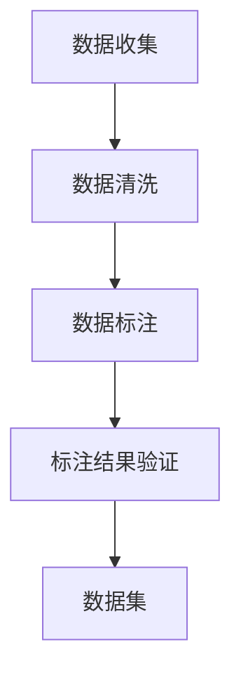

                 

## 1. 背景介绍

数据标注，作为一种最基础的人工智能(AI)技术，往往被忽视，但正是它为人工智能的各个领域提供了必不可少的支持。无论是图像分类、语音识别还是自然语言处理，高质量的数据标注都是构建AI模型不可或缺的一环。本文旨在深入探讨数据标注在人工智能发展中的重要性，以及如何更高效、更准确地进行数据标注。

## 2. 核心概念与联系

### 2.1 核心概念概述

数据标注（Data Annotation）是指将原始数据与人类对数据的理解或解释相结合，生成可被机器学习模型利用的训练数据。这一过程通常包括数据收集、数据清洗、数据标注以及标注结果验证等多个步骤。

- **数据收集**：通过人工或自动化工具从各种数据源中获取原始数据。
- **数据清洗**：移除噪声、错误或不相关的数据，确保数据的准确性和一致性。
- **数据标注**：根据任务需求，为数据打上标签，生成可供训练的数据集。
- **标注结果验证**：通过人工或半自动化工具对标注结果进行审核和校验，保证标注的准确性和一致性。

数据标注的核心在于准确性和效率。高质量的标注数据能够显著提升模型的性能，而低质量标注则会严重影响模型效果，甚至导致错误决策。因此，如何高效、准确地进行数据标注，是当前AI技术发展的关键点之一。

### 2.2 核心概念原理和架构的 Mermaid 流程图



## 3. 核心算法原理 & 具体操作步骤

### 3.1 算法原理概述

数据标注的算法原理主要涉及以下几个方面：

- **监督学习**：通过大量已标注数据训练模型，使用模型对新数据进行标注。
- **半监督学习**：使用少量已标注数据和大量未标注数据共同训练模型，利用未标注数据的分布信息提升标注效果。
- **无监督学习**：通过数据本身的特征，无需标注数据进行学习，自动生成标签。
- **强化学习**：通过奖励机制引导模型生成高质量标注。

### 3.2 算法步骤详解

#### 3.2.1 数据收集

数据收集是数据标注的第一步，通常涉及以下步骤：

- **确定数据来源**：从公共数据集、行业数据库、社交媒体等渠道获取数据。
- **数据格式转换**：将不同格式的数据转换为统一格式，便于后续处理。
- **数据质量保证**：确保数据来源可靠，数据格式一致，数据内容丰富。

#### 3.2.2 数据清洗

数据清洗是确保数据质量的关键步骤，主要包括以下操作：

- **去除噪声**：通过统计分析和过滤算法，去除数据中的异常值和噪声。
- **数据归一化**：对数据进行标准化处理，使其符合统一的标准格式。
- **缺失值处理**：使用插值、删除等方法处理缺失值，确保数据完整性。

#### 3.2.3 数据标注

数据标注过程主要依赖标注工具和标注规则，通常包括以下步骤：

- **标注工具选择**：选择合适的标注工具，如Labelbox、Prodigy、Amazon Mechanical Turk等。
- **标注规则制定**：制定详细的标注规则和标准，确保标注一致性和准确性。
- **人工标注**：将数据分配给标注员，进行手动标注。
- **机器辅助标注**：使用预训练模型进行辅助标注，提升效率和准确性。

#### 3.2.4 标注结果验证

标注结果验证是确保数据质量的最后一道防线，主要包括以下步骤：

- **人工审核**：由专业人员对标注结果进行审核，确保标注准确性。
- **自动验证**：使用机器学习模型进行结果验证，发现标注不一致或错误。
- **反馈迭代**：根据审核结果，对标注数据进行修正和补充。

### 3.3 算法优缺点

#### 3.3.1 优点

- **高效性**：利用机器学习模型进行辅助标注，大幅提升标注效率。
- **准确性**：通过多次审核和验证，确保标注结果的准确性。
- **可扩展性**：标注工具和规则可以灵活调整，适应不同应用场景。

#### 3.3.2 缺点

- **成本高**：人工标注和审核成本高昂，对标注员技能要求高。
- **时间消耗**：标注和审核过程时间较长，特别是在数据量大的情况下。
- **数据依赖**：标注质量高度依赖标注员和标注工具的可靠性。

### 3.4 算法应用领域

数据标注广泛应用于以下几个领域：

- **计算机视觉**：图像分类、目标检测、语义分割等任务。
- **自然语言处理**：文本分类、命名实体识别、情感分析等任务。
- **语音识别**：语音转文本、情感识别、语种识别等任务。
- **医学影像**：疾病诊断、病理分析、影像配准等任务。
- **金融分析**：交易数据分析、风险评估、信用评分等任务。

## 4. 数学模型和公式 & 详细讲解 & 举例说明

### 4.1 数学模型构建

数据标注的数学模型通常涉及以下组件：

- **数据集**：包含原始数据和标注数据。
- **标注函数**：将原始数据映射为标注结果的函数。
- **损失函数**：衡量标注结果与真实标注之间的差距。

### 4.2 公式推导过程

以文本分类任务为例，假设我们有一个包含 $N$ 个样本的数据集，每个样本 $x_i$ 的标注为 $y_i$。标注函数为 $f(x_i) = y_i$，其中 $f$ 为线性分类器。标注结果与真实标注的损失函数为交叉熵损失函数：

$$
\mathcal{L}(f) = -\frac{1}{N} \sum_{i=1}^N y_i \log f(x_i) + (1-y_i) \log (1-f(x_i))
$$

### 4.3 案例分析与讲解

在实际应用中，我们可以使用半监督学习的方法进行数据标注。假设我们有一小部分标注数据 $D_{train}$ 和大量未标注数据 $D_{unlabeled}$，可以使用以下公式进行标注：

$$
f(x_i) = \frac{\alpha f_{supervised}(x_i) + (1-\alpha) f_{unsupervised}(x_i)}{\alpha + (1-\alpha)}
$$

其中 $f_{supervised}$ 为监督学习的分类器，$f_{unsupervised}$ 为无监督学习的分类器，$\alpha$ 为监督学习的权重。这种方法能够在保证标注准确性的同时，最大化利用未标注数据的信息。

## 5. 项目实践：代码实例和详细解释说明

### 5.1 开发环境搭建

在实际开发中，我们通常使用Python语言和TensorFlow框架进行数据标注。以下是开发环境的搭建步骤：

1. 安装Anaconda：
   ```
   conda create -n py36 python=3.6
   conda activate py36
   ```

2. 安装TensorFlow：
   ```
   pip install tensorflow==2.1
   ```

3. 安装Labelbox：
   ```
   pip install labelbox
   ```

### 5.2 源代码详细实现

以下是一个使用TensorFlow和Labelbox进行数据标注的代码实现：

```python
import tensorflow as tf
from labelbox import LabelboxClient

# 初始化Labelbox客户端
client = LabelboxClient(api_key='YOUR_API_KEY', project_id='YOUR_PROJECT_ID')

# 获取数据集
data = client.datasets.get('YOUR_DATASET_ID')

# 获取数据集中的样本
samples = data.get('items')
```

### 5.3 代码解读与分析

在上述代码中，我们首先初始化了Labelbox客户端，并通过API获取了指定数据集和样本信息。

在实际标注过程中，我们可以将样本数据提交给标注员进行手动标注。Labelbox提供了可视化的标注界面，标注员可以在线标注数据。标注完成后，Labelbox会将标注结果提交回系统中。

### 5.4 运行结果展示

运行上述代码后，标注员将收到一个标注任务，通过在线界面完成标注，并提交结果。最终，标注结果将存储在Labelbox系统中，可供后续的数据分析和模型训练使用。

## 6. 实际应用场景

### 6.1 智能客服系统

在智能客服系统中，数据标注起到了至关重要的作用。客服系统的训练数据通常来自历史客服记录，需要进行标注才能用于模型训练。标注数据包括用户输入的问题、客服的回答以及用户的满意度等信息。

### 6.2 金融分析

在金融领域，标注数据对于模型的训练和预测至关重要。标注数据可以包括交易记录、财务报表、新闻事件等，用于训练金融预测模型。

### 6.3 医学影像

医学影像标注通常涉及对影像中的病变区域进行标注。标注数据可以包括CT、MRI、超声等医学影像的标注结果，用于训练病变检测模型。

### 6.4 未来应用展望

未来，数据标注技术将在更多领域得到应用，如自动驾驶、机器人视觉、语音识别等。随着技术的不断进步，数据标注的自动化程度将不断提高，标注质量和效率也将得到显著提升。

## 7. 工具和资源推荐

### 7.1 学习资源推荐

为了帮助开发者系统掌握数据标注技术，以下是一些优质的学习资源：

1. Coursera《机器学习基础》课程：由斯坦福大学教授Andrew Ng主讲，涵盖了机器学习的基本概念和算法。
2. Udacity《机器学习工程师纳米学位》课程：涵盖从数据预处理到模型训练的机器学习全流程。
3. Labelbox官方文档：提供详细的标注工具使用指南和API文档。
4. TensorFlow官方文档：提供丰富的机器学习算法和框架示例。

### 7.2 开发工具推荐

以下是几款用于数据标注开发的常用工具：

1. Labelbox：提供可视化的标注界面和API支持，支持多种数据标注任务。
2. Amazon Mechanical Turk：提供大量的标注员资源，适合大规模标注任务。
3. Prodigy：基于深度学习的数据标注工具，支持多种标注任务和模型。
4. LabelImg：开源图像标注工具，支持绘制和编辑图像中的标注框。
5. vScribe：支持文本、图像、音频等多种数据类型的标注工具，提供丰富的标注规则和工具。

### 7.3 相关论文推荐

以下是几篇重要的数据标注相关论文，推荐阅读：

1. "OntoNotes: A Linked Data Resource for the Study of Vision and Language"（ontonotes数据集论文）：构建了一个大规模的多模态数据集，用于研究视觉和语言之间的关系。
2. "Kaggle-Style Annotation Platform for Open Data"（Kaggle平台论文）：介绍了Kaggle平台的数据标注机制和标注规则。
3. "Data Augmentation for Deep Learning: A Review"（数据增强论文）：综述了数据增强技术在机器学习中的应用。

## 8. 总结：未来发展趋势与挑战

### 8.1 未来发展趋势

未来，数据标注技术将呈现以下几个发展趋势：

1. **自动化标注**：随着深度学习技术的发展，越来越多的任务可以实现自动化标注，减少人工干预。
2. **分布式标注**：通过分布式技术，标注任务可以在全球范围内进行，提升标注效率和数据多样性。
3. **跨模态标注**：将文本、图像、音频等多种模态的数据进行联合标注，提升模型的综合能力。
4. **数据共享与开放**：更多的标注数据将公开共享，促进数据标注技术的普及和应用。

### 8.2 面临的挑战

尽管数据标注技术已经取得了一些进展，但在未来发展过程中，仍面临以下挑战：

1. **标注成本高**：高质量的标注数据需要耗费大量人力和时间，成本较高。
2. **数据隐私保护**：标注数据可能涉及个人隐私和敏感信息，如何保护数据隐私成为一大难题。
3. **标注一致性**：多个标注员对同一数据进行标注时，可能存在不一致的情况，需要建立规范的标注规则和审核机制。

### 8.3 研究展望

未来的研究需要在以下几个方面进行突破：

1. **自动化标注算法**：开发高效、准确、可靠的自动化标注算法，减少人工干预。
2. **多模态标注技术**：研究跨模态的数据标注方法，提升模型的综合能力。
3. **数据隐私保护**：研究数据匿名化、差分隐私等技术，保护标注数据隐私。
4. **标注规则与标准**：制定统一的标注规则和标准，提升标注质量。

## 9. 附录：常见问题与解答

**Q1：数据标注需要考虑哪些因素？**

A: 数据标注需要考虑以下因素：

1. **数据质量**：确保数据的准确性、完整性和一致性。
2. **标注规则**：制定详细的标注规则和标准，确保标注一致性。
3. **标注员选择**：选择合适的标注员，确保标注结果的可靠性。
4. **标注工具**：选择适合的数据标注工具，提升标注效率。

**Q2：如何进行数据标注的质量控制？**

A: 数据标注的质量控制主要包括以下步骤：

1. **随机抽样**：随机抽取部分标注数据进行审核和验证。
2. **人工审核**：由专业人员对标注结果进行审核，确保标注准确性。
3. **自动验证**：使用机器学习模型进行结果验证，发现标注不一致或错误。
4. **反馈迭代**：根据审核结果，对标注数据进行修正和补充。

**Q3：数据标注的自动化程度如何提升？**

A: 数据标注的自动化程度可以通过以下方式提升：

1. **半监督学习**：使用少量已标注数据和大量未标注数据共同训练模型，提升标注效果。
2. **深度学习模型**：使用预训练模型进行辅助标注，提升标注效率和准确性。
3. **自动化标注工具**：使用自动标注工具和算法，减少人工干预。

**Q4：数据标注过程中如何保证数据隐私？**

A: 数据标注过程中，可以通过以下方式保证数据隐私：

1. **数据匿名化**：对数据进行匿名化处理，保护个人隐私。
2. **差分隐私**：使用差分隐私技术，限制模型对数据隐私的访问。
3. **访问控制**：严格控制对标注数据的访问权限，确保数据安全。

作者：禅与计算机程序设计艺术 / Zen and the Art of Computer Programming

