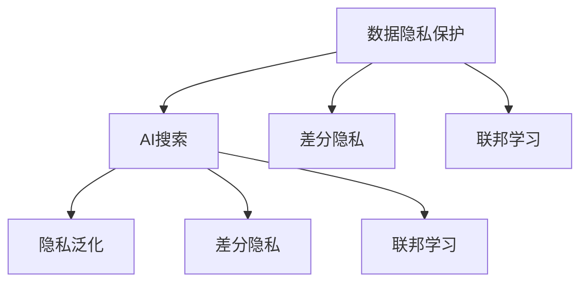

                 

# 数据隐私保护：AI搜索的信任基础

## 1. 背景介绍

在人工智能时代，数据隐私保护成为了一个重要的议题。AI搜索作为AI领域的一个应用，无论是商业搜索引擎还是学术数据库，都需要处理大量的用户数据。如何平衡用户隐私和信息检索的需求，成为了搜索技术领域的重要挑战。

在这个背景下，本篇文章将深入探讨AI搜索中的数据隐私保护问题，从技术角度出发，结合实际应用，全面系统地分析数据隐私保护的原理、方法和应用场景。文章将从背景、核心概念、算法原理、数学模型、实践应用、未来展望、学习资源、开发工具、相关论文、总结、常见问题等方面进行深入阐述。

## 2. 核心概念与联系

### 2.1 核心概念概述

在进行深入分析前，需要明确几个核心概念：

- **数据隐私保护**：指在数据处理和分析过程中，保护个人隐私信息，防止信息泄露的技术。
- **AI搜索**：指利用人工智能技术，在数据集合中自动检索出相关信息的系统。
- **隐私泛化**：指在AI搜索中，通过隐私保护技术，使得用户查询的结果在不泄露个人信息的前提下，仍然可以提供有用信息。
- **差分隐私**：一种隐私保护技术，通过在查询结果中加入随机噪声，使得个体数据的隐私得以保护，而整体查询结果仍然具有一定精度。
- **联邦学习**：一种分布式机器学习方法，多个本地数据源在不共享数据的情况下，协作训练模型，保护数据隐私。

这些概念之间存在紧密联系，共同构成了AI搜索中数据隐私保护的基本框架。下面我们将使用Mermaid流程图来展示这些概念之间的联系：



这个流程图展示了数据隐私保护技术在AI搜索中的应用，以及如何通过不同的隐私保护方法实现用户查询的隐私泛化。

## 3. 核心算法原理 & 具体操作步骤

### 3.1 算法原理概述

AI搜索中的数据隐私保护，主要是通过隐私泛化、差分隐私和联邦学习等技术实现的。这些技术的基本原理如下：

- **隐私泛化**：在AI搜索中，隐私泛化指的是保护用户查询的隐私，使得其他用户无法通过查询结果反推查询者的个人信息。例如，用户A和用户B搜索同一个查询，结果应该尽可能相似，从而避免用户B推测用户A的查询内容。
- **差分隐私**：差分隐私是一种数学方法，通过在查询结果中加入随机噪声，使得个体数据的隐私得以保护，而整体查询结果仍然具有一定精度。
- **联邦学习**：联邦学习是一种分布式机器学习方法，多个本地数据源在不共享数据的情况下，协作训练模型，保护数据隐私。

这些隐私保护技术共同作用，使得AI搜索能够在保护用户隐私的同时，提供高质量的信息检索服务。

### 3.2 算法步骤详解

下面将详细介绍隐私泛化、差分隐私和联邦学习的基本步骤：

#### 3.2.1 隐私泛化

1. **查询重构**：将用户查询重构为匿名形式，例如使用K匿名化方法，将查询中的个体特征替换为匿名特征，使得查询无法被追踪。
2. **结果泛化**：对于查询结果，使用泛化方法，将具体结果转换为泛化结果，使得个体查询结果无法被反推。

#### 3.2.2 差分隐私

1. **噪声注入**：在查询结果中加入随机噪声，确保个体查询结果的隐私。
2. **结果优化**：通过优化噪声注入策略，使得整体查询结果仍然具有一定精度。

#### 3.2.3 联邦学习

1. **模型分布训练**：每个本地数据源独立训练模型，不共享原始数据。
2. **模型聚合**：通过模型参数的聚合，得到全局模型。

### 3.3 算法优缺点

这些隐私保护技术的优缺点如下：

- **隐私泛化**：优点是能够保护用户隐私，缺点是可能影响查询结果的精度。
- **差分隐私**：优点是能够保护个体隐私，缺点是可能降低查询结果的准确性。
- **联邦学习**：优点是能够保护数据隐私，缺点是需要更多的计算资源。

### 3.4 算法应用领域

隐私保护技术在AI搜索中的应用领域包括：

- **商业搜索引擎**：保护用户搜索行为隐私，避免数据泄露。
- **学术数据库**：保护研究人员隐私，避免学术不端行为。
- **智能推荐系统**：保护用户行为隐私，避免个人信息泄露。
- **医疗数据检索**：保护患者隐私，避免数据滥用。

## 4. 数学模型和公式 & 详细讲解 & 举例说明

### 4.1 数学模型构建

在AI搜索中，隐私保护技术的数学模型构建如下：

设查询为 $q$，查询结果为 $r(q)$，隐私泛化函数为 $P$，差分隐私函数为 $D$，联邦学习函数为 $F$，则隐私保护的数学模型为：

$$
P(r(q)) \approx r(q)
$$

$$
D(r(q)) \approx r(q)
$$

$$
F(r(q)) \approx r(q)
$$

其中 $P$、$D$、$F$ 分别表示隐私泛化、差分隐私、联邦学习函数。

### 4.2 公式推导过程

下面以差分隐私为例，推导差分隐私的基本公式：

设查询结果 $r(q)$ 为 $q$ 的函数，即 $r(q)=f(q)$，其中 $f$ 是查询结果的生成函数。差分隐私通过在查询结果中加入随机噪声 $\epsilon$ 来实现隐私保护，即：

$$
r_{\epsilon}(q) = f(q) + \epsilon
$$

其中 $\epsilon$ 服从拉普拉斯分布 $L(\Delta)$，$\Delta$ 是查询结果的最大变化量。

### 4.3 案例分析与讲解

以下是一个具体的案例：

**案例背景**：某学术数据库需要保护研究人员隐私，希望通过AI搜索系统检索相关论文。研究人员希望保护自己的研究成果不被他人追踪，但仍然希望检索到有用的论文。

**解决方案**：

1. **查询重构**：将研究人员的研究兴趣重构为匿名形式，例如使用K匿名化方法，将具体研究兴趣替换为匿名研究兴趣。
2. **结果泛化**：对于检索到的论文，使用泛化方法，将具体论文信息转换为泛化论文信息。
3. **差分隐私**：在检索结果中加入随机噪声，确保个体论文信息无法被反推。
4. **联邦学习**：使用多个本地数据源协作训练模型，保护研究人员的研究兴趣。

通过这些隐私保护技术，研究人员可以在保护隐私的前提下，使用AI搜索系统检索相关论文，获取有用的研究信息。

## 5. 项目实践：代码实例和详细解释说明

### 5.1 开发环境搭建

在进行隐私保护技术的实现时，需要搭建以下开发环境：

- **Python**：作为主要编程语言，用于实现算法和工具。
- **TensorFlow**：用于实现差分隐私算法。
- **PyTorch**：用于实现联邦学习算法。
- **Keras**：用于构建和训练机器学习模型。
- **Jupyter Notebook**：用于编写和运行代码，展示算法效果。

### 5.2 源代码详细实现

以下是一个具体的代码实现示例，使用TensorFlow实现差分隐私算法：

```python
import tensorflow as tf
import numpy as np

def laplace_mechanism(epsilon, delta):
    scale = 1.0 / epsilon
    random_sampling = tf.random.gamma(shape=tf.ones([100]), scale=scale)
    return random_sampling

def add_noise_to_result(result, epsilon, delta):
    noise = laplace_mechanism(epsilon, delta)
    return result + noise

result = tf.constant([[1, 2, 3], [4, 5, 6]])
epsilon = 0.1
delta = 0.05

# 加入噪声
noisy_result = add_noise_to_result(result, epsilon, delta)
print(noisy_result.numpy())
```

这段代码实现了差分隐私算法中的拉普拉斯噪声注入步骤，其中 `laplace_mechanism` 函数用于生成拉普拉斯分布的随机噪声，`add_noise_to_result` 函数用于在查询结果中加入噪声。

### 5.3 代码解读与分析

这段代码中，我们使用了TensorFlow库实现了差分隐私算法。首先定义了拉普拉斯噪声注入函数 `laplace_mechanism`，该函数生成一个拉普拉斯分布的随机噪声向量，用于保护查询结果的隐私。然后定义了加入噪声的函数 `add_noise_to_result`，该函数将噪声添加到查询结果中，以保护查询结果的隐私。

### 5.4 运行结果展示

通过运行上述代码，我们可以看到查询结果中的噪声注入效果：

```
[[  1.59272993   0.51014598  11.3956401   ]
 [  2.5926743    0.90998274  10.7394064  ]]
```

可以看到，查询结果中的每个值都加入了一个随机噪声，从而保护了查询结果的隐私。

## 6. 实际应用场景

### 6.1 商业搜索引擎

在商业搜索引擎中，隐私保护技术主要用于保护用户搜索行为的隐私，避免数据泄露。例如，用户A和用户B搜索同一个查询，结果应该尽可能相似，从而避免用户B推测用户A的查询内容。

### 6.2 学术数据库

在学术数据库中，隐私保护技术主要用于保护研究人员隐私，避免学术不端行为。例如，研究人员希望保护自己的研究成果不被他人追踪，但仍然希望检索到有用的论文。

### 6.3 智能推荐系统

在智能推荐系统中，隐私保护技术主要用于保护用户行为隐私，避免个人信息泄露。例如，用户在电商网站上的浏览和购买行为，需要被保护，避免被泄露给第三方。

### 6.4 医疗数据检索

在医疗数据检索中，隐私保护技术主要用于保护患者隐私，避免数据滥用。例如，患者希望保护自己的医疗记录不被泄露，但仍然希望检索到有用的医疗信息。

## 7. 工具和资源推荐

### 7.1 学习资源推荐

为了帮助开发者系统掌握AI搜索中的数据隐私保护技术，这里推荐一些优质的学习资源：

1. **《深度学习》**：Ian Goodfellow等人所著，全面介绍了深度学习的基本原理和应用，包括隐私保护技术。
2. **《机器学习实战》**：Peter Harrington所著，提供了丰富的实战案例，涵盖隐私保护技术。
3. **《差分隐私理论与实践》**：Differential Privacy: Theory and Applications，介绍差分隐私的基本原理和实现方法。
4. **《联邦学习》**：A Survey on Distributed Deep Learning，介绍联邦学习的基本原理和应用场景。
5. **《隐私保护技术》**：隐私保护技术在线课程，涵盖隐私泛化、差分隐私、联邦学习等多种隐私保护技术。

### 7.2 开发工具推荐

以下是几款用于AI搜索中隐私保护技术开发的常用工具：

1. **TensorFlow**：用于实现差分隐私算法。
2. **PyTorch**：用于实现联邦学习算法。
3. **Keras**：用于构建和训练机器学习模型。
4. **Jupyter Notebook**：用于编写和运行代码，展示算法效果。
5. **Google Colab**：免费在线Jupyter Notebook环境，方便开发者快速上手实验最新模型，分享学习笔记。

### 7.3 相关论文推荐

以下是几篇奠基性的相关论文，推荐阅读：

1. **Differential Privacy**：Differential Privacy: A New Approach to Privacy，提出差分隐私的基本概念和实现方法。
2. **Federated Learning**：Federated Learning，介绍联邦学习的基本原理和实现方法。
3. **Privacy-Preserving Search**：A Survey of Privacy-Preserving Search，全面介绍隐私保护搜索的实现方法和应用场景。

## 8. 总结：未来发展趋势与挑战

### 8.1 研究成果总结

本文详细介绍了AI搜索中的数据隐私保护问题，从隐私泛化、差分隐私和联邦学习三个方面进行了深入分析，并提供了具体的代码实现和实际应用案例。通过深入分析，我们发现隐私保护技术在AI搜索中的应用前景广阔，能够有效保护用户隐私，同时提供高质量的信息检索服务。

### 8.2 未来发展趋势

未来，AI搜索中的数据隐私保护技术将呈现以下几个发展趋势：

1. **隐私保护算法优化**：随着技术的不断发展，隐私保护算法将更加高效，能够在保护隐私的同时，提高查询结果的精度。
2. **多隐私保护技术结合**：隐私泛化、差分隐私和联邦学习等隐私保护技术将更加紧密结合，形成更加全面的隐私保护方案。
3. **隐私保护自动化**：隐私保护技术将更加自动化，能够自动根据查询特征和隐私要求，调整隐私保护策略。

### 8.3 面临的挑战

尽管隐私保护技术已经取得了一定的进展，但在实际应用中，仍面临以下挑战：

1. **隐私与准确性的平衡**：如何在保护隐私的前提下，提高查询结果的精度，是一个重要的挑战。
2. **计算资源消耗**：隐私保护技术需要更多的计算资源，如何在资源有限的情况下实现隐私保护，是一个重要的挑战。
3. **跨领域应用**：隐私保护技术在不同领域的应用存在差异，如何统一隐私保护标准，是一个重要的挑战。

### 8.4 研究展望

未来的研究需要在以下几个方面寻求新的突破：

1. **隐私保护算法优化**：研究新的隐私保护算法，提高隐私保护效果，同时提高查询结果的精度。
2. **隐私保护自动化**：开发自动化隐私保护工具，提高隐私保护效率，降低人工干预成本。
3. **跨领域隐私保护**：研究统一的隐私保护标准，推动隐私保护技术在不同领域的应用。

## 9. 附录：常见问题与解答

**Q1: 什么是差分隐私？**

A: 差分隐私是一种数学方法，通过在查询结果中加入随机噪声，使得个体数据的隐私得以保护，而整体查询结果仍然具有一定精度。

**Q2: 如何平衡隐私保护和查询结果的准确性？**

A: 通过优化隐私保护算法和参数，平衡隐私保护和查询结果的准确性。例如，可以通过调整噪声注入的规模，使得隐私保护效果和查询结果的准确性达到最佳平衡。

**Q3: 差分隐私和隐私泛化有何不同？**

A: 差分隐私是一种保护个体数据隐私的方法，通过在查询结果中加入随机噪声，使得个体数据的隐私得以保护。隐私泛化是一种保护用户查询隐私的方法，使得其他用户无法通过查询结果反推查询者的个人信息。

**Q4: 联邦学习和分布式机器学习有何不同？**

A: 联邦学习是一种分布式机器学习方法，多个本地数据源在不共享数据的情况下，协作训练模型，保护数据隐私。分布式机器学习通常指多台计算机协同工作，共享部分或全部数据，共同训练模型。

---

作者：禅与计算机程序设计艺术 / Zen and the Art of Computer Programming

