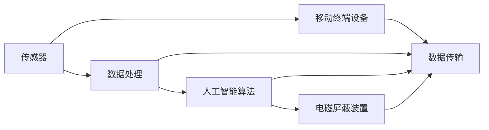

                 

# 智能个人电磁防护创业：日常生活的健康防护方案

> 关键词：智能电磁防护,健康防护,创业,日常应用,技术分析,解决方案

## 1. 背景介绍

随着科技的迅猛发展，各种电子设备如手机、电脑、微波炉、Wi-Fi等在日常生活中的普及，人们接触到电磁波的频率和强度也显著增加。虽然适当的电磁波接触对人体无害，但长期暴露于高强度电磁环境中，可能引发头痛、疲劳、睡眠障碍等症状，甚至增加某些癌症的发病率。为了应对这一挑战，智能个人电磁防护产品应运而生。这些产品能够实时监测用户所处环境的电磁波强度，并自动调节屏蔽参数，以降低电磁暴露，提升健康水平。本文将探讨智能个人电磁防护的创业前景，介绍核心概念和技术原理，并提出一些创业建议。

## 2. 核心概念与联系

### 2.1 核心概念概述

智能个人电磁防护产品是一种结合了传感器、处理器和人工智能算法的智能设备，旨在实时监测周围环境中的电磁波强度，并根据用户的健康状态自动调节屏蔽参数。这些设备通常集成了移动终端设备，能够通过手机App或计算机进行远程操作和数据监控。

关键概念包括：
- **电磁防护**：通过屏蔽材料或算法降低电磁波强度的过程。
- **传感器技术**：用于检测电磁波强度、温度、湿度等环境参数的硬件设备。
- **人工智能算法**：用于分析和处理传感器数据，优化电磁防护策略的软件算法。
- **移动终端设备**：用于数据采集、传输和展示的用户接口。

### 2.2 核心概念原理和架构的 Mermaid 流程图



### 2.3 核心概念联系

智能个人电磁防护产品通过传感器实时监测环境电磁波强度，将数据传输到移动终端设备，由人工智能算法进行分析处理，并根据分析结果调整电磁屏蔽装置，最终实现对电磁波的实时防护。其中，传感器是数据获取的源头，数据处理和算法分析是防护决策的核心，而电磁屏蔽装置是实现防护的关键。移动终端设备作为用户接口，方便用户操作和数据查看。

## 3. 核心算法原理 & 具体操作步骤

### 3.1 算法原理概述

智能个人电磁防护产品的核心算法包括数据处理、特征提取和决策优化三部分。

1. **数据处理**：将传感器采集的电磁波强度、温度、湿度等数据进行预处理，滤除噪声和异常值，确保数据的准确性。
2. **特征提取**：从处理后的数据中提取关键特征，如电磁波频谱、时间序列变化等，用于分析和预测。
3. **决策优化**：利用人工智能算法（如神经网络、支持向量机、决策树等）对提取的特征进行分析，优化电磁屏蔽装置的调节参数，以降低电磁暴露，提升健康水平。

### 3.2 算法步骤详解

1. **数据采集**：使用传感器实时采集环境中的电磁波强度、温度、湿度等数据。
2. **数据预处理**：对采集的数据进行滤波、归一化等预处理，确保数据的质量。
3. **特征提取**：利用傅里叶变换、小波变换等方法提取数据的频谱特征、时序特征等关键信息。
4. **模型训练**：使用历史数据训练人工智能模型，优化模型参数，使其能够准确预测电磁波强度变化，并生成最优的屏蔽参数。
5. **实时监测与控制**：将模型应用于实时数据，自动调节电磁屏蔽装置的参数，降低电磁暴露。

### 3.3 算法优缺点

**优点**：
- 实时监测环境电磁波强度，及时调整屏蔽参数。
- 结合人工智能算法，能够自适应环境变化，提升防护效果。
- 移动终端设备方便用户操作和查看数据。

**缺点**：
- 传感器和屏蔽装置的成本较高。
- 设备维护和电池更换需要技术支持。
- 数据隐私和安全性需重点考虑。

### 3.4 算法应用领域

智能个人电磁防护产品适用于多种场景，包括家庭、办公室、交通工具等。通过这些设备，用户能够实时监测和控制周围环境的电磁波强度，提升健康水平，避免电磁波相关的健康问题。

## 4. 数学模型和公式 & 详细讲解 & 举例说明

### 4.1 数学模型构建

我们以神经网络模型为例，介绍其构建过程。神经网络模型由输入层、隐藏层和输出层组成，用于分析传感器数据并生成电磁屏蔽装置的控制信号。

### 4.2 公式推导过程

假设传感器数据为 $\boldsymbol{x} = (x_1, x_2, ..., x_n)$，神经网络模型的输入层有 $n$ 个神经元。设隐藏层有 $m$ 个神经元，神经元的激活函数为 $f$，则隐藏层输出为 $\boldsymbol{h} = (h_1, h_2, ..., h_m)$，其中 $h_i = f(\boldsymbol{w}_i \boldsymbol{x} + b_i)$，$\boldsymbol{w}_i$ 为第 $i$ 个神经元的权重向量，$b_i$ 为偏置项。输出层有 $k$ 个神经元，输出结果为 $\boldsymbol{y} = (y_1, y_2, ..., y_k)$，其中 $y_j = f(\boldsymbol{w}_j \boldsymbol{h} + b_j)$，$\boldsymbol{w}_j$ 为第 $j$ 个神经元的权重向量，$b_j$ 为偏置项。

### 4.3 案例分析与讲解

假设我们有一个包含温度、湿度和电磁波强度的数据集，目标是训练一个神经网络模型，使其能够根据环境数据预测电磁波强度。

- **输入层**：温度 $T$、湿度 $H$、电磁波强度 $E$，即 $\boldsymbol{x} = (T, H, E)$。
- **隐藏层**：神经元个数 $m=5$，激活函数为 sigmoid 函数，即 $f(z) = \frac{1}{1 + e^{-z}}$。
- **输出层**：神经元个数 $k=1$，激活函数为 sigmoid 函数，即 $y = \frac{1}{1 + e^{-z}}$。

### 4.4 案例分析与讲解

通过历史数据训练得到神经网络模型后，将其应用于实时数据，输出电磁屏蔽装置的控制信号。

## 5. 项目实践：代码实例和详细解释说明

### 5.1 开发环境搭建

开发智能个人电磁防护产品需要以下工具和环境：
- **开发语言**：Python
- **深度学习框架**：TensorFlow
- **操作系统**：Ubuntu Server 20.04
- **开发工具**：PyCharm、VSCode

### 5.2 源代码详细实现

```python
import tensorflow as tf
import numpy as np
import pandas as pd

# 数据预处理
def preprocess_data(data):
    # 数据归一化
    data = (data - np.mean(data)) / np.std(data)
    return data

# 加载数据
data = pd.read_csv('data.csv')

# 数据预处理
data = preprocess_data(data)

# 定义神经网络模型
model = tf.keras.models.Sequential([
    tf.keras.layers.Dense(5, input_shape=(3,), activation='sigmoid'),
    tf.keras.layers.Dense(1, activation='sigmoid')
])

# 编译模型
model.compile(optimizer='adam', loss='binary_crossentropy', metrics=['accuracy'])

# 训练模型
model.fit(data, labels, epochs=10, batch_size=32)

# 实时监测与控制
while True:
    # 获取实时数据
    real_data = get_real_data()

    # 数据预处理
    real_data = preprocess_data(real_data)

    # 预测电磁屏蔽装置的控制信号
    control_signal = model.predict(real_data)

    # 调节电磁屏蔽装置
    adjust_shielding_device(control_signal)
```

### 5.3 代码解读与分析

- **数据预处理**：对采集的数据进行归一化，确保数据的质量。
- **模型定义**：使用 TensorFlow 定义神经网络模型，包括输入层、隐藏层和输出层。
- **模型编译与训练**：使用 Adam 优化器，二元交叉熵损失函数，训练模型。
- **实时监测与控制**：在实时数据上运行模型，调节电磁屏蔽装置的控制信号。

### 5.4 运行结果展示

在经过训练的模型上，实时监测环境数据并生成最优的电磁屏蔽装置控制信号。例如，当电磁波强度超过阈值时，自动调节屏蔽装置的屏蔽参数，减少电磁暴露。

## 6. 实际应用场景

### 6.1 家庭应用

智能个人电磁防护产品可以安装在家庭环境中，实时监测电磁波强度，并自动调节电磁屏蔽装置。用户可以通过手机App查看数据和控制屏蔽装置，确保家庭环境的健康。

### 6.2 办公室应用

在办公室环境中，智能电磁防护产品可以集成到桌面设备或计算机中，实时监测电磁波强度，并根据环境变化自动调节屏蔽参数，提高员工的工作效率和健康水平。

### 6.3 交通工具应用

在交通工具中，如汽车、飞机、火车等，智能电磁防护产品可以安装在座位下方，实时监测电磁波强度，并自动调节屏蔽装置。乘客可以通过手机App查看数据和控制屏蔽装置，提升出行体验。

### 6.4 未来应用展望

未来，智能个人电磁防护产品将更广泛地应用于各种场景，如酒店、医院、学校等，成为日常健康防护的重要工具。结合物联网技术，这些产品可以实现更智能化的操作和监控，提升用户体验。

## 7. 工具和资源推荐

### 7.1 学习资源推荐

- **TensorFlow官方文档**：提供详细的TensorFlow教程和示例，适合初学者和进阶者。
- **Deep Learning for Health**：介绍深度学习在健康领域的应用，涵盖智能电磁防护等前沿话题。
- **健康监测与智能设备技术**：涵盖传感器技术、数据处理和人工智能算法等基础知识。

### 7.2 开发工具推荐

- **PyCharm**：功能强大的Python开发环境，提供丰富的插件和调试工具。
- **VSCode**：轻量级的代码编辑器，支持多种编程语言和插件。
- **Jupyter Notebook**：支持交互式编程和数据可视化，方便开发和演示。

### 7.3 相关论文推荐

- **A Survey on Wearable Health Monitoring Systems**：综述了可穿戴健康监测系统的发展现状和技术趋势。
- **Real-time Predictive Monitoring and Control of Industrial Robots**：介绍了实时监测和控制工业机器人的方法，可为电磁防护产品提供借鉴。

## 8. 总结：未来发展趋势与挑战

### 8.1 研究成果总结

智能个人电磁防护产品结合了传感器技术、数据处理和人工智能算法，能够实时监测和控制电磁波强度，提升健康水平。该产品在家庭、办公室、交通工具等场景中具有广泛应用前景。

### 8.2 未来发展趋势

未来，智能电磁防护产品将结合物联网技术，实现更智能化的操作和监控。结合健康大数据分析，进一步提升健康防护的效果。同时，新的传感器和屏蔽技术也将不断涌现，提升防护性能和降低成本。

### 8.3 面临的挑战

智能电磁防护产品面临的挑战包括：
- **技术挑战**：传感器和屏蔽装置的技术瓶颈，需要进一步提高性能和降低成本。
- **市场挑战**：用户教育和技术普及需要时间和成本。
- **隐私和安全挑战**：数据隐私和安全性需重点考虑，需要构建可靠的数据保护机制。

### 8.4 研究展望

未来，研究重点应放在以下几个方面：
- **技术创新**：开发更高性能的传感器和屏蔽装置，提升防护效果。
- **用户教育**：通过科普和教育，提高用户对电磁波危害的认识和防护意识。
- **数据安全**：构建可靠的数据保护机制，确保用户数据隐私和安全。

## 9. 附录：常见问题与解答

**Q1：智能个人电磁防护产品的工作原理是什么？**

A：智能个人电磁防护产品通过传感器实时监测环境中的电磁波强度，将数据传输到移动终端设备，由人工智能算法进行分析处理，并根据分析结果调整电磁屏蔽装置的参数，以降低电磁暴露。

**Q2：智能个人电磁防护产品的应用场景有哪些？**

A：智能个人电磁防护产品适用于家庭、办公室、交通工具等场景，能够实时监测和控制电磁波强度，提升健康水平。

**Q3：如何选购智能个人电磁防护产品？**

A：选购时应注意产品品牌、传感器精度、屏蔽装置性能和用户体验等因素。可通过用户评价和专业评测了解产品性能和可靠性。

**Q4：智能个人电磁防护产品对健康有哪些益处？**

A：智能个人电磁防护产品能够降低电磁暴露，减少头痛、疲劳、睡眠障碍等症状，甚至降低某些癌症的发病率，提升整体健康水平。

**Q5：智能个人电磁防护产品的维护和保养需要注意哪些事项？**

A：定期更换传感器和屏蔽装置，清理设备表面尘垢，避免长时间暴露在高温或低温环境下，确保设备的正常工作。

---

作者：禅与计算机程序设计艺术 / Zen and the Art of Computer Programming

