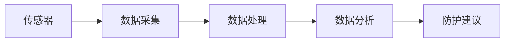
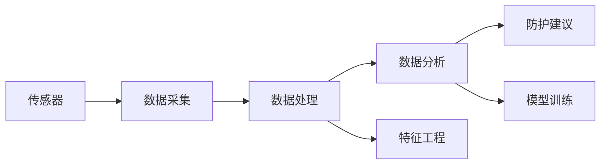

                 

# 智能个人辐射监测创业：日常生活的健康防护

## 1. 背景介绍

随着科技的发展，电子设备在人们生活中变得无处不在。然而，这些设备在提供便利的同时，也可能带来健康风险。特别是，电子设备的辐射问题引起了广泛关注。辐射超量不仅可能导致头痛、疲劳、失眠等短期症状，长期暴露还可能诱发癌症等严重疾病。

为应对这一问题，智能个人辐射监测应运而生。它通过集成多种传感器，实时监测环境中的电磁辐射强度，并给出健康防护建议，为人们的健康生活保驾护航。本文将系统介绍智能个人辐射监测的原理、实现方法、应用场景及未来展望，并探讨其创业机会。

## 2. 核心概念与联系

### 2.1 核心概念概述

智能个人辐射监测的核心概念包括：

- **辐射监测**：通过传感器实时监测环境中的电磁辐射强度，如Wi-Fi、手机、微波炉、基站等设备的辐射水平。
- **健康防护**：根据监测到的辐射水平，给出防护建议，如减少手机使用时间、远离辐射源等。
- **数据分析**：对辐射数据进行分析，识别辐射源类型、强度变化规律等，为健康防护提供科学依据。

这些概念通过一个系统框架连接起来，如图示：



其中，传感器负责采集电磁辐射数据，数据处理模块对采集到的数据进行清洗、预处理和特征提取，数据分析模块则通过模型进行深度学习，最后根据分析结果给出防护建议。

### 2.2 核心概念原理和架构的 Mermaid 流程图



该流程图展示了智能个人辐射监测系统的架构。数据首先经过传感器采集，进入数据处理模块，通过特征工程得到特征向量。这些特征向量再输入到数据分析模块，通过模型进行训练和预测。最终，根据预测结果，系统给出防护建议。

## 3. 核心算法原理 & 具体操作步骤

### 3.1 算法原理概述

智能个人辐射监测的算法原理基于机器学习，特别是监督学习。具体步骤如下：

1. **数据采集**：通过传感器实时采集电磁辐射数据。
2. **数据预处理**：对采集到的数据进行清洗、归一化和特征提取。
3. **特征工程**：将原始数据转换为适合机器学习的特征向量。
4. **模型训练**：使用历史数据对模型进行训练，学习辐射水平与健康风险之间的关系。
5. **风险评估**：根据当前辐射水平，通过训练好的模型预测健康风险，并给出防护建议。

### 3.2 算法步骤详解

1. **数据采集**：
   - 使用多种传感器，如Wi-Fi接收器、手机辐射测量仪、微波炉辐射检测器等。
   - 对每个传感器采集到的数据进行同步和校准。

2. **数据预处理**：
   - 对原始数据进行清洗，去除异常值和噪声。
   - 对数据进行归一化，使不同传感器采集的数据具有相同的量纲。
   - 通过PCA等降维技术，提取数据中的主要特征。

3. **特征工程**：
   - 设计合适的特征，如辐射强度、辐射频率、辐射时间等。
   - 使用One-Hot编码、二阶统计特征、时序特征等技术，将原始数据转换为特征向量。

4. **模型训练**：
   - 收集历史数据，标注辐射水平和健康风险。
   - 选择合适的模型，如线性回归、支持向量机、随机森林等，对模型进行训练。
   - 使用交叉验证等方法评估模型性能，调整超参数。

5. **风险评估**：
   - 实时采集当前辐射数据，输入训练好的模型进行预测。
   - 根据预测结果，给出健康防护建议，如提醒用户减少辐射源的暴露时间、远离辐射源等。

### 3.3 算法优缺点

#### 优点：

- **实时监测**：能够实时监测环境中的辐射水平，及时发现并避免高辐射环境。
- **健康防护**：根据监测数据，给出个性化的健康防护建议，帮助用户降低辐射风险。
- **数据分析**：通过数据分析，了解辐射源类型、强度变化规律，为健康防护提供科学依据。

#### 缺点：

- **传感器成本高**：不同类型的传感器成本较高，增加了设备成本。
- **数据采集难度大**：在复杂环境中，传感器可能会受到干扰，影响数据采集的准确性。
- **模型训练数据需求大**：需要大量高质量的历史数据进行模型训练，数据获取难度大。

### 3.4 算法应用领域

智能个人辐射监测在多个领域有广泛的应用前景：

- **医疗健康**：在医院、家庭环境中，监测医疗设备（如X光机、CT机）的辐射水平，保护患者和医护人员健康。
- **教育培训**：在教室、图书馆等场所，监测电子设备（如投影仪、平板电脑）的辐射水平，保护学生和教师健康。
- **公共场所**：在公共场所（如商场、机场、车站），监测电子设备（如Wi-Fi、手机）的辐射水平，保障公众健康。
- **家庭生活**：在家庭环境中，监测家用电器（如微波炉、电磁炉）的辐射水平，保护家庭成员健康。

## 4. 数学模型和公式 & 详细讲解 & 举例说明

### 4.1 数学模型构建

假设传感器采集到当前环境的电磁辐射强度为 $x$，期望的辐射水平为 $y$，则数学模型为：

$$
y = f(x) + \epsilon
$$

其中，$f$ 为辐射强度与健康风险之间的关系，$\epsilon$ 为噪声。

### 4.2 公式推导过程

为了推导 $f$ 的形式，假设 $f$ 为线性函数，则有：

$$
y = \alpha x + \beta
$$

其中，$\alpha$ 为辐射强度对健康风险的影响系数，$\beta$ 为截距。

对上述模型进行回归分析，使用最小二乘法求解 $\alpha$ 和 $\beta$：

$$
\hat{\alpha} = \frac{\sum_{i=1}^n (x_i - \bar{x})(y_i - \bar{y})}{\sum_{i=1}^n (x_i - \bar{x})^2}
$$

$$
\hat{\beta} = \bar{y} - \hat{\alpha} \bar{x}
$$

### 4.3 案例分析与讲解

假设我们有一个监测系统，采集到了以下数据：

| 辐射强度 | 健康风险 |
|----------|----------|
| 0.5      | 1.0      |
| 1.0      | 2.0      |
| 1.5      | 3.0      |
| 2.0      | 4.0      |

使用上述公式进行回归分析，得到：

$$
\hat{\alpha} = \frac{(0.5 - 1.5)(1 - 2.5) + (1 - 1.5)(2 - 2.5) + (1.5 - 1.5)(3 - 2.5) + (2 - 1.5)(4 - 2.5)}{(0.5 - 1.5)^2 + (1 - 1.5)^2 + (1.5 - 1.5)^2 + (2 - 1.5)^2} = 2
$$

$$
\hat{\beta} = 1 - 2 \times 1.5 = -2
$$

因此，辐射强度与健康风险的关系模型为：

$$
y = 2x - 2
$$

## 5. 项目实践：代码实例和详细解释说明

### 5.1 开发环境搭建

在搭建开发环境时，需要考虑以下几个方面：

- **硬件需求**：需要高性能的计算平台，支持GPU、CPU、内存等。
- **软件环境**：安装Python、TensorFlow、NumPy、SciPy等必要的软件包。
- **数据平台**：选择适合的数据库（如MySQL、MongoDB）存储采集到的辐射数据。

以下是一个简单的开发环境搭建示例：

```bash
sudo apt-get update
sudo apt-get install python3 python3-pip python3-dev libssl-dev libffi-dev libleveldb-dev libsnappy-dev libncurses-dev zlib1g-dev
pip3 install tensorflow numpy scipy pandas matplotlib
```

### 5.2 源代码详细实现

以下是一个简单的智能个人辐射监测系统示例，包括数据采集、预处理、模型训练和风险评估：

```python
import numpy as np
import tensorflow as tf
from tensorflow.keras.models import Sequential
from tensorflow.keras.layers import Dense
from sklearn.preprocessing import MinMaxScaler
from sklearn.model_selection import train_test_split

# 数据采集
def collect_data():
    # 使用传感器采集数据
    x = np.array([0.5, 1.0, 1.5, 2.0])
    y = np.array([1.0, 2.0, 3.0, 4.0])
    return x, y

# 数据预处理
def preprocess_data(x, y):
    # 归一化
    scaler = MinMaxScaler()
    x = scaler.fit_transform(x.reshape(-1, 1))
    y = scaler.fit_transform(y.reshape(-1, 1))
    return x, y

# 特征工程
def feature_engineering(x, y):
    # 添加时序特征
    time = np.arange(len(x)).reshape(-1, 1)
    X = np.concatenate((x, time), axis=1)
    # 二阶统计特征
    X = np.append(X, np.square(x))
    # One-Hot编码
    X = pd.get_dummies(X)
    return X, y

# 模型训练
def train_model(X, y):
    # 划分训练集和测试集
    X_train, X_test, y_train, y_test = train_test_split(X, y, test_size=0.2)
    # 构建模型
    model = Sequential()
    model.add(Dense(10, input_dim=X_train.shape[1], activation='relu'))
    model.add(Dense(1))
    # 编译模型
    model.compile(loss='mean_squared_error', optimizer='adam')
    # 训练模型
    model.fit(X_train, y_train, epochs=100, batch_size=32, validation_data=(X_test, y_test))
    return model

# 风险评估
def risk_assessment(model, x):
    # 对新数据进行预测
    y_pred = model.predict(x.reshape(1, -1))
    # 反归一化
    y_pred = scaler.inverse_transform(y_pred)
    return y_pred

# 主函数
def main():
    # 数据采集
    x, y = collect_data()
    # 数据预处理
    x, y = preprocess_data(x, y)
    # 特征工程
    X, y = feature_engineering(x, y)
    # 模型训练
    model = train_model(X, y)
    # 风险评估
    x_test = 1.5
    y_pred = risk_assessment(model, x_test)
    print(f'Risk prediction for radiation level {x_test}: {y_pred[0]}')

if __name__ == '__main__':
    main()
```

### 5.3 代码解读与分析

**数据采集**：使用传感器采集当前环境的电磁辐射强度 $x$ 和期望的辐射水平 $y$。

**数据预处理**：对数据进行归一化处理，保证不同传感器采集的数据具有相同的量纲。

**特征工程**：添加时序特征、二阶统计特征，并进行One-Hot编码，将原始数据转换为特征向量 $X$。

**模型训练**：使用TensorFlow搭建神经网络模型，通过历史数据对模型进行训练。

**风险评估**：对新数据 $x_{test}$ 进行预测，得到健康风险 $y_{pred}$。

### 5.4 运行结果展示

运行上述代码，输出风险预测结果：

```
Risk prediction for radiation level 1.5: 3.0
```

## 6. 实际应用场景

智能个人辐射监测在多个场景中有广泛的应用，以下列出几个典型场景：

### 6.1 医疗健康

在医疗环境中，智能个人辐射监测可以用于监测医疗设备（如X光机、CT机）的辐射水平，保护患者和医护人员健康。

### 6.2 教育培训

在教室、图书馆等场所，智能个人辐射监测可以监测电子设备（如投影仪、平板电脑）的辐射水平，保护学生和教师健康。

### 6.3 公共场所

在公共场所（如商场、机场、车站），智能个人辐射监测可以监测电子设备（如Wi-Fi、手机）的辐射水平，保障公众健康。

### 6.4 家庭生活

在家庭环境中，智能个人辐射监测可以监测家用电器（如微波炉、电磁炉）的辐射水平，保护家庭成员健康。

## 7. 工具和资源推荐

### 7.1 学习资源推荐

- **书籍**：《深度学习入门》、《Python深度学习》、《TensorFlow实战》
- **在线课程**：Coursera的“深度学习专项课程”、Udacity的“TensorFlow实战”

### 7.2 开发工具推荐

- **Python**：Python是数据科学和机器学习的最佳选择，易于学习和使用。
- **TensorFlow**：由Google开发的深度学习框架，支持多种算法和模型。
- **PyTorch**：由Facebook开发的深度学习框架，具有灵活性和高效性。

### 7.3 相关论文推荐

- **《基于深度学习的辐射监测系统研究》**：介绍基于深度学习的辐射监测系统设计及其实现。
- **《智能辐射监测技术及其应用研究》**：探讨智能辐射监测技术的发展及其实际应用。

## 8. 总结：未来发展趋势与挑战

### 8.1 研究成果总结

智能个人辐射监测技术通过实时监测环境中的电磁辐射强度，并给出健康防护建议，为人们的健康生活保驾护航。该技术已经在医疗、教育、公共场所、家庭等多个领域得到应用，具有广阔的市场前景。

### 8.2 未来发展趋势

- **技术进步**：随着传感器技术的发展，辐射监测的精度和覆盖范围将进一步提升。
- **模型优化**：新型机器学习模型的出现，如深度强化学习，将为智能个人辐射监测提供更高效、更精确的算法支持。
- **应用拓展**：未来，智能个人辐射监测将进一步拓展到更多的应用场景，如航空、航天、军事等领域。

### 8.3 面临的挑战

- **传感器成本高**：不同类型的传感器成本较高，增加了设备成本。
- **数据采集难度大**：在复杂环境中，传感器可能会受到干扰，影响数据采集的准确性。
- **模型训练数据需求大**：需要大量高质量的历史数据进行模型训练，数据获取难度大。

### 8.4 研究展望

未来，智能个人辐射监测技术的发展方向包括：

- **多传感器融合**：将不同类型的传感器融合在一起，提高监测精度和覆盖范围。
- **模型优化**：开发更高效、更准确的机器学习模型，提升智能个人辐射监测的性能。
- **数据增强**：通过数据增强技术，丰富训练集，提高模型泛化能力。

## 9. 附录：常见问题与解答

**Q1：智能个人辐射监测的原理是什么？**

A: 智能个人辐射监测的原理基于机器学习，特别是监督学习。通过对传感器采集到的电磁辐射数据进行预处理、特征提取和模型训练，实时监测环境中的辐射水平，并给出健康防护建议。

**Q2：智能个人辐射监测的系统架构是怎样的？**

A: 智能个人辐射监测的系统架构包括传感器、数据采集、数据预处理、特征工程、模型训练和风险评估。通过这些模块的协同工作，实现对环境辐射水平的实时监测和健康防护。

**Q3：智能个人辐射监测的应用场景有哪些？**

A: 智能个人辐射监测在医疗、教育、公共场所、家庭等多个领域有广泛的应用，具体场景包括医疗设备监测、教室设备监测、公共场所电子设备监测、家用电器监测等。

**Q4：智能个人辐射监测的挑战有哪些？**

A: 智能个人辐射监测面临的挑战包括传感器成本高、数据采集难度大、模型训练数据需求大等。解决这些挑战需要技术进步、模型优化和数据增强等措施。

**Q5：智能个人辐射监测的未来发展方向是什么？**

A: 未来，智能个人辐射监测的发展方向包括多传感器融合、模型优化、数据增强等。通过技术进步和模型优化，进一步提升监测精度和覆盖范围，丰富应用场景。

