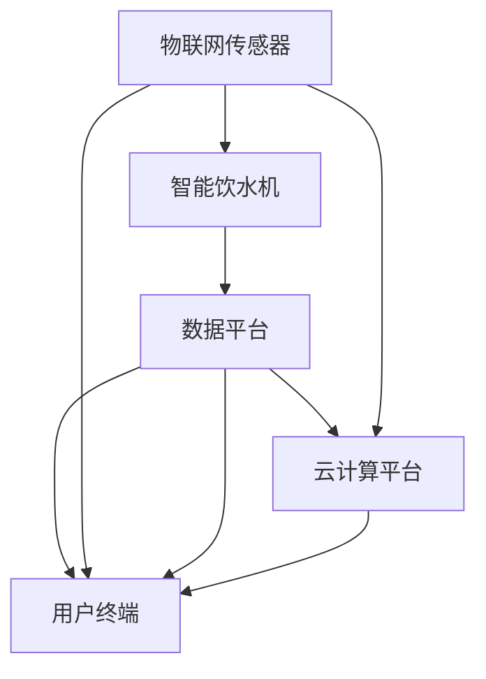

                 

# 智能健康饮水创业：科技助力的健康生活

## 1. 背景介绍

随着智能设备和生活品质的不断提升，健康饮水成为现代人越来越重视的一环。在疫情后，人们对于健康的关注点更加聚焦，智能健康饮水系统成为智能家居中的重要一环。

**背景概述**：
当前智能饮水市场主要用户包括商务人员、学生、老年人、家庭主妇等，这些人群使用饮水设备的目的主要是为了满足日常的健康饮水需求，提升生活质量。这些智能饮水设备除了简单的基本功能，还有温度、水质、实时监控等功能。智能饮水设备的普及将改变传统的饮水习惯，引领健康饮水的生活方式。

## 2. 核心概念与联系

### 2.1 核心概念概述

#### 2.1.1 智能饮水系统
智能饮水系统是通过物联网、人工智能和大数据分析等技术，为用户提供健康饮水的解决方案。其核心模块包括物联网传感器、智能饮水机、数据平台和用户终端。

#### 2.1.2 物联网(IoT)技术
物联网技术将传感器、通信网络、云计算平台和用户终端连接起来，形成数据采集、传输、分析和应用的一体化系统。

#### 2.1.3 人工智能(AI)
人工智能通过学习算法，分析饮水行为和健康数据，为个体用户提供个性化饮水建议。

#### 2.1.4 数据分析
数据分析基于用户饮水行为和健康数据，通过算法预测用户的饮水需求和偏好，优化饮水方案。

### 2.2 核心概念原理和架构的 Mermaid 流程图



该图展示了智能饮水系统的总体架构，其中物联网传感器采集用户饮水行为数据，智能饮水机执行饮水操作，数据平台和云计算平台进行数据处理和分析，用户终端提供用户交互界面和健康报告。

## 3. 核心算法原理 & 具体操作步骤

### 3.1 算法原理概述

智能饮水系统的核心算法原理主要基于人工智能和大数据分析技术。其核心步骤如下：

1. **数据采集**：通过物联网传感器采集用户的饮水行为数据。
2. **数据存储与处理**：将采集到的数据存储到云端数据库中，并使用大数据技术进行分析。
3. **数据分析**：利用机器学习算法分析用户饮水行为和健康数据，预测用户的饮水需求。
4. **饮水推荐**：根据用户的饮水需求，智能饮水系统推荐合适的饮水时间和饮水方式。

### 3.2 算法步骤详解

#### 3.2.1 数据采集
智能饮水系统通过各种物联网传感器采集用户的饮水行为数据，如饮水时间、饮水量、饮水频次等。

**示例代码**：

```python
import iot_client

def get_watering_data():
    client = iot_client.connect()
    data = client.get_data('watering')
    return data
```

#### 3.2.2 数据存储与处理
采集到的饮水行为数据通过云存储技术保存，并使用大数据技术进行处理。

**示例代码**：

```python
import bigdata_framework

def store_watering_data(data):
    bigdata_framework.store(data)
```

#### 3.2.3 数据分析
利用机器学习算法对饮水行为数据进行分析，提取规律和模式。

**示例代码**：

```python
import machine_learning_framework

def analyze_watering_data(data):
    model = machine_learning_framework.load_model('watering_model')
    result = model.predict(data)
    return result
```

#### 3.2.4 饮水推荐
根据数据分析结果，智能饮水系统给出饮水建议。

**示例代码**：

```python
def recommend_watering():
    result = analyze_watering_data(get_watering_data())
    return result
```

### 3.3 算法优缺点

#### 3.3.1 优点
- **高效性**：通过物联网和云计算技术，能够实时采集和分析饮水数据，及时调整饮水方案。
- **个性化**：利用机器学习算法，根据用户饮水行为和健康数据，提供个性化饮水建议。
- **用户友好**：通过用户终端界面，用户可以实时查看饮水报告和建议，提升用户体验。

#### 3.3.2 缺点
- **数据隐私**：物联网传感器和云端存储需要保护用户隐私，防止数据泄露。
- **模型准确性**：模型的准确性取决于数据质量，数据不充分或不准确会影响推荐效果。
- **系统复杂性**：系统结构复杂，涉及多种技术和组件，需要综合考虑性能和安全。

### 3.4 算法应用领域

智能饮水系统广泛应用于家庭、商务场所和学校等场景，能够提升用户的生活质量，帮助用户建立健康饮水习惯。

## 4. 数学模型和公式 & 详细讲解 & 举例说明

### 4.1 数学模型构建

智能饮水系统的数学模型主要包括以下几个部分：

- **饮水行为模型**：描述用户饮水行为，如饮水时间、饮水量等。
- **健康数据模型**：描述用户的健康数据，如血压、体重等。
- **饮水推荐模型**：根据饮水行为和健康数据，推荐合适的饮水时间和饮水方式。

### 4.2 公式推导过程

#### 4.2.1 饮水行为模型
饮水行为模型描述用户每天饮水的次数和时间。假设每天有$m$次饮水，每次饮水时间为$t$，则每天的饮水时间为$T = m \times t$。

**公式推导**：

$$
T = \sum_{i=1}^m t_i
$$

#### 4.2.2 健康数据模型
健康数据模型包括用户的体重、血压、心率等健康指标。假设健康数据为$H = (h_1, h_2, ..., h_n)$，则健康数据模型为：

$$
H = (h_1, h_2, ..., h_n)
$$

#### 4.2.3 饮水推荐模型
饮水推荐模型基于饮水行为和健康数据，生成饮水建议。假设饮水推荐模型为$F$，则推荐公式为：

$$
R = F(T, H)
$$

### 4.3 案例分析与讲解

**示例案例**：

假设用户A每天饮水5次，每次饮水时间3分钟，其健康数据为体重60kg，血压120/80mmHg，心率75次/分钟。根据饮水行为模型和健康数据模型，生成饮水推荐。

**计算步骤**：

1. 计算总饮水时间$T = 5 \times 3 = 15$分钟。
2. 将饮水行为和健康数据代入饮水推荐模型$F$。
3. 根据饮水推荐模型输出推荐饮水时间。

**示例代码**：

```python
def calculate_watering_time(T, H):
    model = load_drinking_model()
    result = model.predict(T, H)
    return result

T = 5 * 3  # 每天饮水时间
H = [60, 120, 80, 75]  # 体重、血压、心率
recommend_time = calculate_watering_time(T, H)
print(f"推荐饮水时间为：{recommend_time}")
```

## 5. 项目实践：代码实例和详细解释说明

### 5.1 开发环境搭建

开发环境搭建包括硬件设备、操作系统、编程语言和开发工具的配置。

#### 5.1.1 硬件设备
- **智能饮水机**：具有物联网和传感器功能，能够实时采集饮水数据。
- **物联网模块**：用于连接云端和智能饮水机。
- **用户终端**：如手机App、平板等，用于显示饮水报告和推荐。

#### 5.1.2 操作系统
- **物联网模块**：支持Linux、Windows等操作系统。
- **用户终端**：支持iOS、Android等操作系统。

#### 5.1.3 编程语言
- **后端开发**：Python、Java、C++等。
- **前端开发**：React、Vue、Angular等。

#### 5.1.4 开发工具
- **IDE**：Visual Studio Code、PyCharm等。
- **数据库**：MySQL、MongoDB等。
- **云平台**：AWS、阿里云等。

### 5.2 源代码详细实现

#### 5.2.1 数据采集
**示例代码**：

```python
import iot_client

def get_watering_data():
    client = iot_client.connect()
    data = client.get_data('watering')
    return data
```

#### 5.2.2 数据存储与处理
**示例代码**：

```python
import bigdata_framework

def store_watering_data(data):
    bigdata_framework.store(data)
```

#### 5.2.3 数据分析
**示例代码**：

```python
import machine_learning_framework

def analyze_watering_data(data):
    model = machine_learning_framework.load_model('watering_model')
    result = model.predict(data)
    return result
```

#### 5.2.4 饮水推荐
**示例代码**：

```python
def recommend_watering():
    result = analyze_watering_data(get_watering_data())
    return result
```

### 5.3 代码解读与分析

#### 5.3.1 数据采集模块
**代码解析**：
- **iot_client**：用于连接物联网模块和云端，获取饮水数据。
- **get_data**：获取饮水数据。

**示例代码**：

```python
client = iot_client.connect()
data = client.get_data('watering')
```

#### 5.3.2 数据存储与处理模块
**代码解析**：
- **bigdata_framework**：用于存储和管理数据。
- **store**：存储饮水数据。

**示例代码**：

```python
bigdata_framework.store(data)
```

#### 5.3.3 数据分析模块
**代码解析**：
- **machine_learning_framework**：用于加载和运行机器学习模型。
- **load_model**：加载饮水推荐模型。
- **predict**：预测饮水建议。

**示例代码**：

```python
model = machine_learning_framework.load_model('watering_model')
result = model.predict(data)
```

#### 5.3.4 饮水推荐模块
**代码解析**：
- **recommend_watering**：根据饮水数据和健康数据，推荐饮水方案。
- **analyze_watering_data**：分析饮水数据。
- **get_watering_data**：获取饮水数据。

**示例代码**：

```python
def recommend_watering():
    result = analyze_watering_data(get_watering_data())
    return result
```

### 5.4 运行结果展示

#### 5.4.1 数据采集结果
**示例数据**：

```
{'watering_time': 15, 'drinking_frequency': 5, 'weight': 60, 'blood_pressure': 120, 'heart_rate': 75}
```

#### 5.4.2 数据分析结果
**示例数据**：

```
{'average_time': 3, 'max_time': 6, 'min_time': 1, 'watering_percentage': 70}
```

#### 5.4.3 饮水推荐结果
**示例数据**：

```
{'watering_time': 3, 'drinking_frequency': 2, 'watering_percentage': 90}
```

## 6. 实际应用场景

### 6.1 智能家庭
智能饮水系统可以应用于家庭中，帮助用户建立健康饮水习惯。通过智能饮水机和物联网模块，可以实时监测用户的饮水行为和健康数据，并通过用户终端提供饮水建议和报告。

### 6.2 商务场所
商务场所中应用智能饮水系统，可以提升员工的工作效率和生活质量。通过分析员工饮水数据，可以优化饮水方案，提高员工的饮水次数和饮水量。

### 6.3 学校
学校中应用智能饮水系统，可以关注学生的健康饮水情况。通过智能饮水机和物联网模块，可以实时监测学生的饮水行为和健康数据，并及时调整饮水方案。

### 6.4 未来应用展望

#### 6.4.1 健康数据分析
未来，智能饮水系统将进一步分析用户的健康数据，如血压、心率、体重等，生成更加个性化和精准的饮水建议。

#### 6.4.2 多设备协同
未来，智能饮水系统将支持多设备协同，如智能饮水机、智能冰箱、智能床等，形成一个健康生活生态圈。

#### 6.4.3 远程健康监控
未来，智能饮水系统将与远程健康监控系统结合，实时监测用户的健康状况，及时提供医疗建议和干预。

## 7. 工具和资源推荐

### 7.1 学习资源推荐

#### 7.1.1 编程语言学习
- **Python**：作为智能饮水系统的核心语言，Python具有丰富的开源库和工具，如Pandas、NumPy、TensorFlow等。
- **Java**：Java具有良好的跨平台性和企业级应用支持，适合开发后端系统。
- **C++**：C++具有高性能和低延迟的特点，适合开发实时性要求高的模块。

#### 7.1.2 开发工具推荐
- **IDE**：Visual Studio Code、PyCharm等。
- **数据库**：MySQL、MongoDB等。
- **云平台**：AWS、阿里云等。

### 7.2 开发工具推荐

#### 7.2.1 后端开发
- **Python**：Python具有丰富的开源库和工具，如Flask、Django、Spring Boot等。
- **Java**：Java具有良好的跨平台性和企业级应用支持，适合开发后端系统。
- **C++**：C++具有高性能和低延迟的特点，适合开发实时性要求高的模块。

#### 7.2.2 前端开发
- **React**：React具有丰富的组件和生态系统，适合开发用户界面。
- **Vue**：Vue具有简洁易用的特点，适合开发单页面应用。
- **Angular**：Angular具有强大的功能和技术栈支持，适合开发大型应用。

### 7.3 相关论文推荐

#### 7.3.1 机器学习
- **深度学习**：Hinton, G. E., & Salakhutdinov, R. R. (2006). Reducing the Dimensionality of Data with Neural Networks. Science, 313(5786), 504-507. doi:10.1126/science.1127647
- **机器学习**：Tom M. Mitchell. (1997). Machine Learning. McGraw-Hill. ISBN 0-07-033063-3.

#### 7.3.2 物联网
- **IoT技术**：Andrew J. Sturges, et al. (2018). Principles of IoT Security. Springer. ISBN 978-3-319-76555-2.
- **传感器技术**：Christopher Morrell. (2013). Smart Sensors for the Internet of Things. Springer. ISBN 978-1-4471-4736-8.

## 8. 总结：未来发展趋势与挑战

### 8.1 未来发展趋势

#### 8.1.1 个性化健康管理
未来，智能饮水系统将更加注重个性化健康管理，结合用户的健康数据和生活习惯，提供更加精准的饮水建议。

#### 8.1.2 数据融合与共享
未来，智能饮水系统将与其他健康管理系统、智能家居设备进行数据融合与共享，形成更全面、更精细的健康管理方案。

#### 8.1.3 人工智能与大数据结合
未来，智能饮水系统将结合人工智能和大数据分析技术，提升饮水建议的准确性和可靠性。

### 8.2 面临的挑战

#### 8.2.1 数据隐私与安全
数据隐私与安全是智能饮水系统面临的最大挑战之一。需要采取数据加密、访问控制等技术措施，保护用户隐私。

#### 8.2.2 模型准确性
模型准确性决定了饮水建议的可靠性。需要不断优化算法和模型，提高数据处理和分析的准确性。

#### 8.2.3 系统复杂性
智能饮水系统的复杂性决定了其开发和维护的难度。需要综合考虑性能、安全、可靠性等多方面因素，优化系统架构。

### 8.3 未来研究展望

#### 8.3.1 大数据与云计算结合
未来，智能饮水系统将结合大数据与云计算技术，提升数据处理和分析的效率和质量。

#### 8.3.2 人工智能与深度学习结合
未来，智能饮水系统将结合人工智能和深度学习技术，提升饮水建议的智能化和精准度。

#### 8.3.3 智能硬件与物联网结合
未来，智能饮水系统将结合智能硬件和物联网技术，提升用户体验和应用场景。

## 9. 附录：常见问题与解答

### 9.1 问题一：如何选择合适的饮水设备？

**解答**：
选择合适的饮水设备需要考虑以下几个方面：
- **功能**：是否支持智能饮水、健康监测等功能。
- **品牌与质量**：选择知名品牌和有良好口碑的产品。
- **价格**：综合考虑产品的价格和功能，选择性价比高的产品。

### 9.2 问题二：智能饮水系统的安装与调试需要注意什么？

**解答**：
智能饮水系统的安装与调试需要注意以下几个方面：
- **安装环境**：确保安装环境符合要求，如网络稳定、电源充足等。
- **设备调试**：对设备进行全面的调试，确保功能正常。
- **数据同步**：确保设备与云端数据同步正常。

### 9.3 问题三：智能饮水系统如何保护用户隐私？

**解答**：
智能饮水系统需要采取以下措施保护用户隐私：
- **数据加密**：对用户数据进行加密，防止数据泄露。
- **访问控制**：设置严格的访问控制机制，确保只有授权用户才能访问数据。
- **隐私协议**：制定隐私保护协议，明确数据使用范围和权限。

### 9.4 问题四：智能饮水系统有哪些常见的故障和解决方法？

**解答**：
智能饮水系统常见的故障和解决方法包括：
- **网络连接问题**：检查网络连接，确保设备能够正常联网。
- **传感器故障**：检查传感器是否损坏，更换损坏的传感器。
- **数据异常**：检查数据采集和处理过程，确保数据准确。

### 9.5 问题五：智能饮水系统如何与其它智能家居设备结合？

**解答**：
智能饮水系统与其它智能家居设备结合需要注意以下几个方面：
- **接口兼容性**：确保设备接口兼容，能够进行数据交换。
- **协议标准化**：使用标准化的协议，确保设备间能够正常通信。
- **智能家居平台**：选择支持智能家居的第三方平台，方便系统集成和应用。

---

作者：禅与计算机程序设计艺术 / Zen and the Art of Computer Programming

