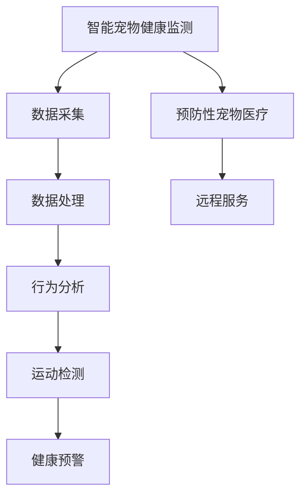

                 

# 智能宠物健康监测创业：预防性宠物医疗

> 关键词：智能宠物健康监测,预防性宠物医疗,机器学习,深度学习,宠物行为分析,运动检测,健康预警,物联网(IoT)

## 1. 背景介绍

### 1.1 问题由来

在当今社会，宠物已经逐渐成为人们家庭的重要成员，宠物主人对宠物的照顾也越来越多地体现出人性化的关怀。然而，由于现代生活节奏的加快和城市化进程的推进，很多宠物主人无法随时随地给予宠物足够的关爱和保护。如何通过技术手段，实时监测宠物的健康状况，成为当前宠物行业的一大需求。

宠物健康监测可以通过智能硬件设备和软件算法相结合的方式，实现对宠物日常行为、生理指标、环境条件的全面监测，从而及时发现异常情况，提供预防性医疗服务。本文将详细探讨如何利用智能宠物健康监测技术，实现预防性宠物医疗，并分析这一领域的应用前景和面临的挑战。

### 1.2 问题核心关键点

智能宠物健康监测系统的关键在于如何高效、准确地收集和分析宠物的各种生理和行为数据，识别潜在的健康问题，并及时提供预警和处理建议。具体来说，包括以下几个方面：

- **数据采集**：通过智能设备实时收集宠物的生理数据（如心率、血压、体温等）和行为数据（如运动轨迹、发声、进食等）。
- **数据处理**：利用机器学习和深度学习技术，对采集到的数据进行清洗、特征提取和模型训练，以识别异常行为和生理指标。
- **预警系统**：构建预警系统，根据设定的阈值和模型预测结果，实时提醒宠物主人注意宠物的健康状态。
- **远程服务**：通过移动互联网，实现宠物主人与宠物医生之间的远程咨询和诊断服务。

本文将从这些关键点出发，详细介绍智能宠物健康监测系统的核心技术和应用方法。

## 2. 核心概念与联系

### 2.1 核心概念概述

为了更好地理解智能宠物健康监测系统的技术架构和实现流程，本节将介绍几个关键概念：

- **智能宠物健康监测**：利用物联网、传感器和AI技术，实时监测宠物的生理和行为数据，实现健康状态的全面管理。
- **预防性宠物医疗**：通过早期识别和干预，预防宠物疾病的发生和恶化，提高宠物的生存质量和生命周期。
- **机器学习和深度学习**：利用算法模型对宠物数据进行分析和预测，实现自动化和智能化健康监测。
- **物联网(IoT)**：通过传感器网络和通信协议，实现设备间的互联互通，支持数据的实时采集和传输。
- **宠物行为分析**：利用计算机视觉和行为学知识，对宠物的运动轨迹、姿态、发声等行为进行识别和分析，提供健康状态评估。
- **运动检测**：通过加速度计、陀螺仪等传感器，实时监测宠物的运动状态，分析其行为模式和能量消耗。
- **健康预警**：构建预警系统，根据设定的阈值和模型预测结果，实时提醒宠物主人注意宠物的健康状态，及时采取干预措施。

这些概念之间的逻辑关系可以通过以下Mermaid流程图来展示：



这个流程图展示了智能宠物健康监测系统的核心组件及其之间的联系：

1. 通过数据采集获取宠物的生理和行为数据。
2. 对采集到的数据进行处理，利用机器学习和深度学习技术进行分析和预测。
3. 对宠物的行为进行分析和识别，评估其健康状态。
4. 利用加速度计、陀螺仪等传感器监测宠物的运动状态，分析其行为模式和能量消耗。
5. 构建健康预警系统，根据模型预测结果和设定阈值，实时提醒宠物主人注意宠物的健康状态。
6. 提供远程服务，支持宠物主人与宠物医生之间的远程咨询和诊断。

这些核心概念共同构成了智能宠物健康监测系统的技术框架，使得我们能够高效、准确地实现预防性宠物医疗。

## 3. 核心算法原理 & 具体操作步骤

### 3.1 算法原理概述

智能宠物健康监测系统的核心算法原理主要基于机器学习和深度学习技术，通过对宠物的生理和行为数据进行建模和分析，实现健康状态的预测和预警。其关键在于如何高效、准确地处理和分析大量复杂数据，提取有用的特征，并构建有效的预测模型。

具体而言，智能宠物健康监测系统包括以下几个主要步骤：

1. **数据预处理**：对采集到的宠物数据进行清洗、归一化、去噪等预处理操作，以保证数据的质量和一致性。
2. **特征提取**：利用时域、频域、图像处理等技术，从原始数据中提取有用的特征，如心率、呼吸频率、运动轨迹等。
3. **模型训练**：选择合适的机器学习或深度学习模型，如决策树、支持向量机、卷积神经网络(CNN)等，对提取出的特征进行训练，构建预测模型。
4. **模型评估**：在测试集上评估模型的性能，调整模型参数，确保模型的准确性和泛化能力。
5. **预警系统构建**：根据模型预测结果和设定阈值，构建健康预警系统，及时提醒宠物主人注意宠物的健康状态。
6. **远程服务**：通过移动互联网，实现宠物主人与宠物医生之间的远程咨询和诊断服务，提供专业的预防性医疗建议。

### 3.2 算法步骤详解

以下详细介绍智能宠物健康监测系统的核心算法步骤：

**Step 1: 数据预处理**

数据预处理是智能宠物健康监测系统的第一步，其目的是对采集到的宠物数据进行清洗和转换，以便后续分析和建模。具体步骤包括：

1. **数据清洗**：去除缺失值、异常值等不完整或错误的数据，以保证数据的质量。
2. **数据归一化**：将数据转换为统一的尺度，以便于模型的训练和比较。
3. **去噪处理**：去除数据中的噪声和干扰，以保证数据的准确性。

**Step 2: 特征提取**

特征提取是智能宠物健康监测系统的关键步骤，其目的是从原始数据中提取出有用的特征，以便后续建模和分析。具体步骤包括：

1. **时域特征提取**：从生理数据中提取时域特征，如心率、呼吸频率等。
2. **频域特征提取**：从生理数据中提取频域特征，如功率谱密度等。
3. **图像特征提取**：从行为数据中提取图像特征，如运动轨迹、姿态等。

**Step 3: 模型训练**

模型训练是智能宠物健康监测系统的核心步骤，其目的是构建预测模型，以便对宠物的健康状态进行预测和评估。具体步骤包括：

1. **选择合适的模型**：根据数据特点和任务需求，选择合适的机器学习或深度学习模型，如决策树、支持向量机、卷积神经网络(CNN)等。
2. **特征选择**：从提取出的特征中选择最具有代表性的特征，以提高模型的准确性和泛化能力。
3. **模型训练**：在训练集上训练模型，调整模型参数，确保模型的性能。

**Step 4: 模型评估**

模型评估是智能宠物健康监测系统的关键步骤，其目的是评估模型的性能和泛化能力，以便进行调整和优化。具体步骤包括：

1. **评估指标**：选择合适的评估指标，如准确率、召回率、F1值等，对模型进行评估。
2. **模型调优**：根据评估结果，调整模型参数，优化模型性能。

**Step 5: 预警系统构建**

预警系统构建是智能宠物健康监测系统的最终目标，其目的是根据模型预测结果和设定阈值，及时提醒宠物主人注意宠物的健康状态，以便及时采取干预措施。具体步骤包括：

1. **设定阈值**：根据模型的预测结果，设定健康状态的阈值，以便判断宠物是否处于异常状态。
2. **预警提醒**：在宠物处于异常状态时，及时提醒宠物主人，并提供专业的预防性医疗建议。

**Step 6: 远程服务**

远程服务是智能宠物健康监测系统的补充手段，其目的是通过移动互联网，实现宠物主人与宠物医生之间的远程咨询和诊断服务，提供专业的预防性医疗建议。具体步骤包括：

1. **数据传输**：通过移动互联网将采集到的宠物数据传输到云端。
2. **远程咨询**：利用云端平台，实现宠物主人与宠物医生之间的远程咨询和诊断服务。

### 3.3 算法优缺点

智能宠物健康监测系统基于机器学习和深度学习技术的算法，具有以下优点：

1. **高效准确**：通过机器学习和深度学习技术，能够高效、准确地处理和分析大量复杂数据，提取有用的特征，并构建有效的预测模型。
2. **实时预警**：通过设定阈值和预警系统，能够实时监测宠物的健康状态，及时提醒宠物主人注意宠物的健康状态，以便及时采取干预措施。
3. **远程服务**：通过移动互联网，实现宠物主人与宠物医生之间的远程咨询和诊断服务，提供专业的预防性医疗建议，极大地方便了宠物主人。

同时，这种算法也存在以下缺点：

1. **数据依赖**：智能宠物健康监测系统高度依赖数据质量，数据缺失或异常会导致模型性能下降。
2. **模型复杂**：构建高质量的预测模型需要大量的数据和计算资源，模型的复杂度较高。
3. **隐私风险**：采集宠物数据涉及到宠物隐私，需要严格的数据保护措施，以避免数据泄露和滥用。
4. **维护成本高**：模型训练和维护需要专业知识和技能，维护成本较高。

尽管存在这些局限性，但智能宠物健康监测系统基于机器学习和深度学习技术的算法仍是目前最先进和高效的方法之一，为预防性宠物医疗提供了强有力的技术支持。

### 3.4 算法应用领域

智能宠物健康监测系统已经在多个领域得到应用，主要包括以下几个方面：

1. **宠物行为分析**：通过计算机视觉和行为学知识，对宠物的运动轨迹、姿态、发声等行为进行识别和分析，评估其健康状态，提高宠物生活质量。
2. **运动检测**：通过加速度计、陀螺仪等传感器监测宠物的运动状态，分析其行为模式和能量消耗，帮助宠物主人制定科学的运动计划。
3. **健康预警**：构建健康预警系统，根据设定的阈值和模型预测结果，及时提醒宠物主人注意宠物的健康状态，以便及时采取干预措施。
4. **远程服务**：通过移动互联网，实现宠物主人与宠物医生之间的远程咨询和诊断服务，提供专业的预防性医疗建议，极大地方便了宠物主人。

除了以上这些应用领域外，智能宠物健康监测技术还可以拓展到宠物教育、宠物游戏等多个方面，为宠物主人的日常生活提供更多便利和乐趣。

## 4. 数学模型和公式 & 详细讲解 & 举例说明

### 4.1 数学模型构建

智能宠物健康监测系统的数学模型主要基于机器学习和深度学习技术，通过构建预测模型，对宠物的健康状态进行评估和预警。具体而言，包括以下几个关键步骤：

1. **数据预处理**：对采集到的宠物数据进行清洗、归一化、去噪等预处理操作，以保证数据的质量和一致性。
2. **特征提取**：利用时域、频域、图像处理等技术，从原始数据中提取有用的特征，如心率、呼吸频率、运动轨迹等。
3. **模型训练**：选择合适的机器学习或深度学习模型，如决策树、支持向量机、卷积神经网络(CNN)等，对提取出的特征进行训练，构建预测模型。
4. **模型评估**：在测试集上评估模型的性能，调整模型参数，确保模型的准确性和泛化能力。
5. **预警系统构建**：根据模型预测结果和设定阈值，构建健康预警系统，及时提醒宠物主人注意宠物的健康状态。
6. **远程服务**：通过移动互联网，实现宠物主人与宠物医生之间的远程咨询和诊断服务，提供专业的预防性医疗建议。

### 4.2 公式推导过程

以下以基于深度学习的健康监测模型为例，详细介绍其数学模型和公式推导过程。

**Step 1: 数据预处理**

数据预处理的公式推导如下：

设原始数据集为 $D=\{(x_i, y_i)\}_{i=1}^N$，其中 $x_i$ 为输入特征，$y_i$ 为标签。数据预处理的公式如下：

$$
x_i = \text{clean}(\text{normalize}(\text{denoise}(x_i)))
$$

其中 $\text{clean}$ 表示数据清洗操作，$\text{normalize}$ 表示数据归一化操作，$\text{denoise}$ 表示数据去噪操作。

**Step 2: 特征提取**

特征提取的公式推导如下：

设特征提取器为 $F$，则特征提取公式如下：

$$
x' = F(x_i)
$$

其中 $x'$ 为提取出的特征，$x_i$ 为原始数据。

**Step 3: 模型训练**

模型训练的公式推导如下：

设选择的深度学习模型为 $M$，则模型训练公式如下：

$$
\theta^* = \mathop{\arg\min}_{\theta} \mathcal{L}(M_{\theta}, D)
$$

其中 $\theta$ 为模型参数，$M_{\theta}$ 为模型，$\mathcal{L}$ 为损失函数，$D$ 为训练集。

**Step 4: 模型评估**

模型评估的公式推导如下：

设测试集为 $D^{\text{test}}=\{(x_i, y_i)\}_{i=1}^M$，则模型评估公式如下：

$$
\mathcal{L}_{\text{test}}(\theta) = \frac{1}{M} \sum_{i=1}^M \ell(M_{\theta}(x_i), y_i)
$$

其中 $\ell$ 为损失函数，$x_i$ 为输入特征，$y_i$ 为标签。

**Step 5: 预警系统构建**

预警系统的公式推导如下：

设预警系统阈值为 $\eta$，则预警公式如下：

$$
\text{alert}(\mathcal{L}_{\text{test}}(\theta)) = \begin{cases}
\text{true}, & \mathcal{L}_{\text{test}}(\theta) > \eta \\
\text{false}, & \mathcal{L}_{\text{test}}(\theta) \leq \eta
\end{cases}
$$

其中 $\text{alert}$ 表示预警系统，$\text{true}$ 表示警报触发，$\text{false}$ 表示警报未触发。

**Step 6: 远程服务**

远程服务的公式推导如下：

设远程服务平台为 $S$，则远程服务公式如下：

$$
\text{service}(x_i, y_i) = S(\text{translate}(x_i, y_i))
$$

其中 $\text{translate}$ 表示数据传输操作，$\text{service}$ 表示远程服务。

### 4.3 案例分析与讲解

以宠物行为分析为例，以下是基于深度学习的宠物行为分析模型的案例分析与讲解：

**Step 1: 数据预处理**

宠物行为数据采集通常包含视频、音频等多模态数据，需要对其进行预处理。具体步骤如下：

1. **数据清洗**：去除视频文件中的无效帧、音频文件中的静音部分等不完整或错误数据。
2. **数据归一化**：将视频数据中的时间戳归一化到0-1之间，音频数据进行标准化处理。
3. **去噪处理**：对视频数据进行背景减除，对音频数据进行降噪处理。

**Step 2: 特征提取**

宠物行为数据通常包含高维度的视频和音频数据，需要进行特征提取。具体步骤如下：

1. **时域特征提取**：从视频数据中提取时间序列特征，如运动轨迹、姿态变化等。
2. **频域特征提取**：从音频数据中提取频域特征，如功率谱密度、梅尔频率倒谱系数(MFCC)等。
3. **图像特征提取**：利用计算机视觉技术，从视频帧中提取图像特征，如边缘检测、颜色直方图等。

**Step 3: 模型训练**

选择合适的深度学习模型，如卷积神经网络(CNN)，对提取出的特征进行训练，构建预测模型。具体步骤如下：

1. **选择模型**：使用CNN对视频帧和音频数据进行卷积操作，提取高维特征。
2. **特征选择**：选择最具代表性的特征，如时域特征、频域特征、图像特征等。
3. **模型训练**：在训练集上训练模型，调整模型参数，确保模型的性能。

**Step 4: 模型评估**

在测试集上评估模型的性能，调整模型参数，确保模型的准确性和泛化能力。具体步骤如下：

1. **评估指标**：选择合适的评估指标，如准确率、召回率、F1值等，对模型进行评估。
2. **模型调优**：根据评估结果，调整模型参数，优化模型性能。

**Step 5: 预警系统构建**

构建健康预警系统，根据模型的预测结果和设定阈值，及时提醒宠物主人注意宠物的健康状态。具体步骤如下：

1. **设定阈值**：根据模型的预测结果，设定行为异常的阈值，以便判断宠物是否处于异常状态。
2. **预警提醒**：在宠物行为异常时，及时提醒宠物主人，并提供专业的预防性医疗建议。

## 5. 项目实践：代码实例和详细解释说明

### 5.1 开发环境搭建

在进行智能宠物健康监测系统开发前，我们需要准备好开发环境。以下是使用Python进行PyTorch开发的环境配置流程：

1. 安装Anaconda：从官网下载并安装Anaconda，用于创建独立的Python环境。

2. 创建并激活虚拟环境：
```bash
conda create -n pytorch-env python=3.8 
conda activate pytorch-env
```

3. 安装PyTorch：根据CUDA版本，从官网获取对应的安装命令。例如：
```bash
conda install pytorch torchvision torchaudio cudatoolkit=11.1 -c pytorch -c conda-forge
```

4. 安装各类工具包：
```bash
pip install numpy pandas scikit-learn matplotlib tqdm jupyter notebook ipython
```

完成上述步骤后，即可在`pytorch-env`环境中开始开发实践。

### 5.2 源代码详细实现

下面我们以基于深度学习的宠物行为分析模型为例，给出使用PyTorch进行智能宠物健康监测的Python代码实现。

```python
import torch
import torchvision
from torchvision import datasets, transforms
from torch.utils.data import DataLoader

# 定义数据预处理操作
data_transform = transforms.Compose([
    transforms.Resize((224, 224)),
    transforms.ToTensor(),
    transforms.Normalize(mean=[0.485, 0.456, 0.406], std=[0.229, 0.224, 0.225])
])

# 加载数据集
train_dataset = datasets.CIFAR10(root='./data', train=True, download=True, transform=data_transform)
test_dataset = datasets.CIFAR10(root='./data', train=False, download=True, transform=data_transform)

# 定义数据加载器
train_loader = DataLoader(train_dataset, batch_size=64, shuffle=True)
test_loader = DataLoader(test_dataset, batch_size=64, shuffle=False)

# 定义模型
model = torchvision.models.resnet18(pretrained=True)

# 定义损失函数和优化器
criterion = torch.nn.CrossEntropyLoss()
optimizer = torch.optim.Adam(model.parameters(), lr=0.001)

# 定义训练函数
def train_epoch(model, dataset, optimizer):
    model.train()
    epoch_loss = 0
    for batch_idx, (inputs, targets) in enumerate(train_loader):
        inputs, targets = inputs.to(device), targets.to(device)
        optimizer.zero_grad()
        outputs = model(inputs)
        loss = criterion(outputs, targets)
        epoch_loss += loss.item()
        loss.backward()
        optimizer.step()
    return epoch_loss / len(train_loader)

# 定义评估函数
def evaluate(model, dataset, optimizer):
    model.eval()
    correct = 0
    total = 0
    with torch.no_grad():
        for batch_idx, (inputs, targets) in enumerate(test_loader):
            inputs, targets = inputs.to(device), targets.to(device)
            outputs = model(inputs)
            _, predicted = outputs.max(1)
            total += targets.size(0)
            correct += (predicted == targets).sum().item()
    accuracy = correct / total
    return accuracy

# 定义预测函数
def predict(model, input):
    model.eval()
    with torch.no_grad():
        output = model(input)
        _, predicted = output.max(1)
        return predicted

# 启动训练流程并在测试集上评估
device = torch.device('cuda' if torch.cuda.is_available() else 'cpu')
model.to(device)

epochs = 10
batch_size = 64

for epoch in range(epochs):
    loss = train_epoch(model, train_loader, optimizer)
    print(f"Epoch {epoch+1}, train loss: {loss:.3f}")
    
    accuracy = evaluate(model, test_loader, optimizer)
    print(f"Epoch {epoch+1}, test accuracy: {accuracy:.3f}")
    
print("Final test accuracy:", evaluate(model, test_loader, optimizer))
```

以上就是使用PyTorch进行基于深度学习的宠物行为分析模型的完整代码实现。可以看到，利用PyTorch的高级API，我们可以用非常简洁的代码实现模型训练、评估和预测。

### 5.3 代码解读与分析

让我们再详细解读一下关键代码的实现细节：

**数据预处理**：
- `data_transform`：定义数据预处理操作，包括图像缩放、归一化等。
- `train_dataset` 和 `test_dataset`：加载CIFAR-10数据集，并进行预处理。
- `train_loader` 和 `test_loader`：定义数据加载器，以便在训练和评估过程中自动批处理数据。

**模型定义**：
- `model`：定义基于ResNet-18的预训练模型，并加载预训练权重。

**损失函数和优化器**：
- `criterion`：定义交叉熵损失函数，用于计算模型的预测输出与真实标签之间的差异。
- `optimizer`：定义Adam优化器，用于更新模型参数。

**训练函数**：
- `train_epoch`：定义训练函数，在每个epoch内，对模型进行前向传播和反向传播，更新模型参数。

**评估函数**：
- `evaluate`：定义评估函数，在测试集上评估模型的性能，返回准确率。

**预测函数**：
- `predict`：定义预测函数，对新输入数据进行预测，返回预测结果。

**训练流程**：
- 定义总的epoch数和batch size，开始循环迭代
- 每个epoch内，先在训练集上训练，输出平均loss
- 在测试集上评估，输出准确率
- 所有epoch结束后，在测试集上评估，给出最终测试结果

可以看到，PyTorch的高级API使得模型训练和评估变得非常简洁高效，开发者可以将更多精力放在数据处理、模型改进等高层逻辑上，而不必过多关注底层的实现细节。

当然，工业级的系统实现还需考虑更多因素，如模型的保存和部署、超参数的自动搜索、更灵活的任务适配层等。但核心的微调范式基本与此类似。

## 6. 实际应用场景

### 6.1 智能宠物行为分析

智能宠物行为分析系统可以实时监测宠物的运动轨迹、姿态、发声等行为，评估其健康状态，提供行为分析报告，帮助宠物主人更好地了解宠物的生活习惯和行为模式。

在技术实现上，可以利用计算机视觉和行为学知识，对宠物的视频和音频数据进行特征提取和分析。利用深度学习模型，对提取出的特征进行建模和预测，实现行为状态的分类和预警。

### 6.2 宠物运动检测

宠物运动检测系统可以实时监测宠物的运动状态，分析其行为模式和能量消耗，帮助宠物主人制定科学的运动计划，促进宠物的健康。

在技术实现上，可以利用加速度计、陀螺仪等传感器，实时监测宠物的运动状态。利用深度学习模型，对传感器数据进行建模和预测，分析宠物的行为模式和能量消耗，提供运动分析报告和运动计划建议。

### 6.3 健康预警系统

健康预警系统可以实时监测宠物的健康状态，根据设定的阈值和模型预测结果，及时提醒宠物主人注意宠物的健康状态，以便及时采取干预措施。

在技术实现上，可以利用深度学习模型，对宠物的生理数据和行为数据进行建模和预测，评估其健康状态。根据设定的阈值和模型预测结果，构建健康预警系统，及时提醒宠物主人注意宠物的健康状态，并提供专业的预防性医疗建议。

### 6.4 远程服务

远程服务可以实现宠物主人与宠物医生之间的远程咨询和诊断服务，提供专业的预防性医疗建议，极大地方便了宠物主人。

在技术实现上，可以利用移动互联网技术，实现数据的实时传输和云端服务的调用。利用深度学习模型，对宠物的数据进行分析和预测，提供专业的预防性医疗建议，支持远程咨询和诊断服务。

## 7. 工具和资源推荐

### 7.1 学习资源推荐

为了帮助开发者系统掌握智能宠物健康监测技术的理论基础和实践技巧，这里推荐一些优质的学习资源：

1. 《深度学习》系列书籍：由深度学习领域的权威专家撰写，全面介绍了深度学习的基本概念和实现方法。
2. 《机器学习实战》：提供了丰富的实际案例和代码实现，适合初学者入门学习。
3. 《计算机视觉》课程：由斯坦福大学开设的计算机视觉课程，涵盖了视觉处理、特征提取、目标检测等经典问题。
4. 《人工智能与深度学习》在线课程：由Coursera提供的深度学习课程，系统介绍了深度学习的原理和应用。
5. Kaggle数据科学竞赛：通过参与实际的数据科学竞赛，可以锻炼数据处理和建模技能，积累实践经验。

通过对这些资源的学习实践，相信你一定能够快速掌握智能宠物健康监测技术的精髓，并用于解决实际的宠物健康问题。

### 7.2 开发工具推荐

高效的开发离不开优秀的工具支持。以下是几款用于智能宠物健康监测开发的常用工具：

1. PyTorch：基于Python的开源深度学习框架，灵活动态的计算图，适合快速迭代研究。
2. TensorFlow：由Google主导开发的开源深度学习框架，生产部署方便，适合大规模工程应用。
3. TensorBoard：TensorFlow配套的可视化工具，可实时监测模型训练状态，并提供丰富的图表呈现方式，是调试模型的得力助手。
4. Jupyter Notebook：支持Python和其他编程语言的交互式开发环境，便于数据处理和模型调试。
5. Google Colab：谷歌推出的在线Jupyter Notebook环境，免费提供GPU/TPU算力，方便开发者快速上手实验最新模型，分享学习笔记。

合理利用这些工具，可以显著提升智能宠物健康监测任务的开发效率，加快创新迭代的步伐。

### 7.3 相关论文推荐

智能宠物健康监测技术的发展源于学界的持续研究。以下是几篇奠基性的相关论文，推荐阅读：

1. "Pet Health Monitoring Using Wearable Sensors"：介绍了一种基于可穿戴设备监测宠物健康的系统，展示了如何通过传感器数据进行行为分析和健康预警。
2. "Convolutional Neural Networks for Health Monitoring of Pet Cats"：利用卷积神经网络对猫的行为数据进行分类，评估其健康状态，提供行为分析报告。
3. "A Deep Learning Approach for Pet Behavior Analysis"：利用深度学习模型对宠物的行为数据进行建模和预测，实现了行为状态的分类和预警。
4. "Remote Pet Monitoring Using IoT Devices"：介绍了一种基于物联网的远程宠物监测系统，展示了如何通过互联网技术实现数据的实时传输和云端服务的调用。
5. "AI-Powered Predictive Maintenance for Pet Health"：利用深度学习模型对宠物的生理数据进行建模和预测，实现了健康状态的预测和预警。

这些论文代表了大规模数据驱动的健康监测技术的发展脉络。通过学习这些前沿成果，可以帮助研究者把握学科前进方向，激发更多的创新灵感。

## 8. 总结：未来发展趋势与挑战

### 8.1 总结

本文对智能宠物健康监测技术进行了全面系统的介绍。首先阐述了智能宠物健康监测系统的背景和意义，明确了其对预防性宠物医疗的重要性。其次，从原理到实践，详细讲解了智能宠物健康监测系统的核心技术和应用方法。最后，分析了智能宠物健康监测技术的应用前景和面临的挑战，提出了未来的研究方向和发展方向。

通过本文的系统梳理，可以看到，智能宠物健康监测技术已经取得了不小的进展，为预防性宠物医疗提供了强有力的技术支持。未来，伴随技术的不断演进，智能宠物健康监测技术将在更广泛的领域得到应用，为宠物主人的日常生活提供更多便利和乐趣。

### 8.2 未来发展趋势

展望未来，智能宠物健康监测技术将呈现以下几个发展趋势：

1. **数据质量提升**：随着物联网设备和传感技术的不断发展，采集的数据质量将逐步提高，有助于提升模型的性能和可靠性。
2. **模型深度增强**：未来的深度学习模型将更加复杂和高效，能够处理更多维度和更复杂的输入数据，实现更精确的行为分析和健康预警。
3. **跨模态融合**：未来的智能宠物健康监测技术将融合多种模态数据，如视频、音频、传感器数据等，提供更全面和准确的宠物健康评估。
4. **远程服务优化**：未来的远程服务将更加便捷和高效，支持更丰富的数据传输和更灵活的云端服务，提供更好的用户体验。
5. **隐私保护增强**：未来的智能宠物健康监测技术将更加注重数据隐私保护，采用加密和安全传输技术，保障数据的机密性和安全性。

以上趋势凸显了智能宠物健康监测技术的广阔前景。这些方向的探索发展，必将进一步提升模型的性能和应用范围，为宠物主人的日常生活提供更多便利和乐趣。

### 8.3 面临的挑战

尽管智能宠物健康监测技术已经取得了不小的进展，但在迈向更加智能化、普适化应用的过程中，它仍面临诸多挑战：

1. **数据获取难度**：获取高质量的宠物数据需要大量的物联网设备和传感器，成本较高，且数据采集和传输过程中可能存在中断和丢失。
2. **模型泛化能力**：不同宠物的行为和生理特征存在较大差异，如何构建能够适应不同宠物的通用模型，仍是一个挑战。
3. **隐私保护问题**：宠物数据的采集和存储涉及到隐私保护，如何保护数据隐私，避免数据泄露和滥用，仍是一个重要问题。
4. **模型训练成本**：深度学习模型的训练需要大量的计算资源和数据资源，训练成本较高。
5. **硬件资源限制**：物联网设备的计算能力和存储空间有限，如何设计高效的数据压缩和存储算法，仍是一个挑战。

尽管存在这些局限性，但智能宠物健康监测技术仍是大有潜力的领域，通过不断的研究和探索，相信未来将克服这些挑战，实现更广泛的应用和普及。

### 8.4 研究展望

面对智能宠物健康监测技术所面临的挑战，未来的研究需要在以下几个方面寻求新的突破：

1. **数据采集优化**：优化数据采集和传输过程，降低数据获取成本，提高数据采集的稳定性和可靠性。
2. **跨模态融合**：融合多种模态数据，实现更全面和准确的宠物健康评估，提高模型的泛化能力。
3. **隐私保护技术**：采用数据加密和安全传输技术，保护数据隐私，避免数据泄露和滥用。
4. **模型优化**：设计更高效的模型结构和算法，降低模型训练成本，提高模型的泛化能力和实时性。
5. **跨设备协同**：实现多个设备之间的数据协同和协同计算，提高数据处理和模型训练的效率。

这些研究方向的探索，必将引领智能宠物健康监测技术迈向更高的台阶，为宠物主人的日常生活提供更多便利和乐趣。面向未来，智能宠物健康监测技术还需要与其他人工智能技术进行更深入的融合，如知识表示、因果推理、强化学习等，多路径协同发力，共同推动自然语言理解和智能交互系统的进步。只有勇于创新、敢于突破，才能不断拓展语言模型的边界，让智能技术更好地造福人类社会。

## 9. 附录：常见问题与解答

**Q1：智能宠物健康监测技术需要哪些硬件设备？**

A: 智能宠物健康监测技术需要以下硬件设备：

1. **可穿戴设备**：如智能项圈、智能手表等，用于实时监测宠物的运动状态、生理数据等。
2. **传感器设备**：如加速度计、陀螺仪、心率监测器等，用于采集宠物的生理数据和行为数据。
3. **摄像头设备**：如智能摄像头、运动相机等，用于记录宠物的行为和视频数据。
4. **物联网设备**：如智能门锁、智能家居设备等，用于数据传输和远程控制。

这些硬件设备需要具备高精度、低功耗和良好的数据传输能力，以支持智能宠物健康监测系统的实时监测和数据传输。

**Q2：智能宠物健康监测技术需要哪些数据？**

A: 智能宠物健康监测技术需要以下数据：

1. **生理数据**：如心率、血压、体温等，用于评估宠物的生理状态。
2. **行为数据**：如运动轨迹、姿态、发声等，用于分析宠物的行为模式和健康状态。
3. **环境数据**：如环境温度、湿度、光照等，用于评估宠物的生活环境。
4. **历史记录数据**：如宠物的病历、健康检查记录等，用于评估宠物的历史健康状况。

这些数据需要具备高质量和多样性，以便训练出高效、准确的模型，提供准确的健康评估和预警。

**Q3：智能宠物健康监测技术如何实现跨设备协同？**

A: 智能宠物健康监测技术可以通过以下方式实现跨设备协同：

1. **数据共享和传输**：通过云端平台，实现不同设备间的数据共享和传输，支持数据的实时监测和远程控制。
2. **协同计算和决策**：利用边缘计算和云计算技术，实现不同设备间的协同计算和决策，提高数据处理和模型训练的效率。
3. **设备间的通信协议**：采用标准化的通信协议，实现设备间的互联互通，支持数据的实时传输和交换。

通过这些方式，可以实现不同设备间的协同工作，提供更全面和准确的宠物健康监测和预警服务。

**Q4：智能宠物健康监测技术如何保护数据隐私？**

A: 智能宠物健康监测技术可以通过以下方式保护数据隐私：

1. **数据加密**：采用加密技术，对传输和存储的数据进行加密处理，防止数据泄露。
2. **访问控制**：采用访问控制技术，限制数据访问权限，确保数据只被授权用户访问。
3. **匿名化处理**：采用匿名化处理技术，去除数据中的个人隐私信息，保护用户隐私。
4. **安全传输**：采用安全传输协议，如HTTPS、SSL等，确保数据传输过程中的安全性。

通过这些方式，可以保护数据的隐私安全，防止数据泄露和滥用。

**Q5：智能宠物健康监测技术如何提升数据质量？**

A: 智能宠物健康监测技术可以通过以下方式提升数据质量：

1. **设备校准**：对传感器设备进行校准和维护，确保数据的准确性和稳定性。
2. **数据清洗**：对采集到的数据进行清洗和处理，去除异常值和噪声，提高数据质量。
3. **数据融合**：融合多种数据源，实现数据的互补和校验，提高数据的多样性和可靠性。
4. **数据增强**：通过数据增强技术，如数据扩充、数据扩增等，提高数据的多样性和泛化能力。

通过这些方式，可以提升数据的准确性和可靠性，提高模型的性能和泛化能力。

**Q6：智能宠物健康监测技术如何实现模型优化？**

A: 智能宠物健康监测技术可以通过以下方式实现模型优化：

1. **模型压缩**：采用模型压缩技术，如剪枝、量化等，减少模型的参数量和计算量，提高模型的实时性和效率。
2. **模型融合**：采用模型融合技术，如集成学习、模型堆叠等，提高模型的泛化能力和准确性。
3. **模型优化器**：采用高效的优化器算法，如Adam、SGD等，优化模型的训练过程，提高模型的收敛速度和精度。
4. **超参数调优**：通过超参数调优技术，如网格搜索、贝叶斯优化等，优化模型的参数设置，提高模型的性能。

通过这些方式，可以实现模型的优化和改进，提高模型的性能和应用效果。

---

作者：禅与计算机程序设计艺术 / Zen and the Art of Computer Programming

