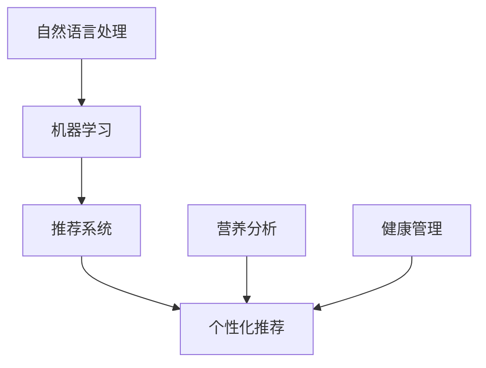

                 

# 智能宠物健康食谱创业：个性化宠物营养

> 关键词：人工智能, 宠物营养, 个性化推荐, 营养分析, 健康管理, 食品推荐系统

## 1. 背景介绍

随着宠物市场的快速发展，越来越多的家庭选择养宠物来陪伴生活，而宠物营养成为宠物健康管理中的重要一环。传统的宠物食品生产主要依据宏观营养需求进行批量生产，无法充分满足宠物个体差异化的营养需求。本项目基于AI技术，特别是自然语言处理（NLP）和机器学习算法，开发智能宠物营养推荐系统，为每个宠物提供个性化、科学合理的营养配方。

### 1.1 问题由来

在现有的宠物食品市场中，常见的营养补充品大多基于宠物体重、年龄等基本指标，缺少对宠物具体健康状态和个体差异的考虑。因此，对于特殊健康状况的宠物，如肥胖、肠胃不适、毛发问题等，现有的营养补充方案难以满足其需求，有时甚至可能适得其反，造成进一步的健康损害。

### 1.2 问题核心关键点

智能宠物营养推荐系统旨在通过AI技术，结合宠物健康数据，为宠物提供个性化的营养配方。核心关键点如下：
- 收集并分析宠物健康数据。
- 利用NLP和机器学习算法，提取宠物营养需求。
- 根据分析结果，为宠物推荐合适的营养补充品。

### 1.3 问题研究意义

智能宠物营养推荐系统具有以下重要意义：
1. 提升宠物健康管理水平。通过个性化营养方案，预防疾病，促进宠物健康成长。
2. 满足宠物个体化需求。减少宠物食品浪费，提高用户体验。
3. 推动宠物食品产业升级。推动宠物食品由通用化向个性化转型，提升行业整体水平。
4. 促进宠物产业创新。为宠物护理提供科技支撑，推动宠物经济增长。

## 2. 核心概念与联系

### 2.1 核心概念概述

为更好地理解智能宠物营养推荐系统，本节将介绍几个密切相关的核心概念：

- 自然语言处理(NLP)：利用计算机处理和理解人类语言的技术，是智能宠物营养推荐系统中重要的输入处理方式。
- 机器学习(ML)：让计算机通过学习数据自动改进算法，以提升系统的准确性和泛化能力。
- 推荐系统(Recommender System)：根据用户的历史行为数据，预测用户可能感兴趣的物品，并进行推荐。
- 个性化推荐(Personalized Recommendation)：根据用户个体特征，如兴趣、行为、属性等，提供定制化的推荐内容。
- 营养分析(Nutritional Analysis)：分析食物中各种营养成分的含量，以及它们对宠物健康的具体影响。
- 健康管理(Health Management)：通过收集和分析宠物的健康数据，提供科学的健康管理建议。

这些核心概念之间的逻辑关系可以通过以下Mermaid流程图来展示：



这个流程图展示了几大核心概念及其之间的关系：

1. 自然语言处理将宠物主人提供的信息转化为机器可理解的数据。
2. 机器学习利用数据训练模型，提供精准的营养和健康分析。
3. 推荐系统根据模型预测结果，提供个性化的营养和健康推荐。
4. 个性化推荐进一步考虑个体差异，提升推荐效果。
5. 营养分析和健康管理确保推荐内容的科学性和可行性。

这些概念共同构成了智能宠物营养推荐系统的核心架构，使其能够有效满足宠物个性化营养需求，提升其健康水平。

## 3. 核心算法原理 & 具体操作步骤
### 3.1 算法原理概述

智能宠物营养推荐系统主要基于NLP和机器学习技术，结合营养分析，通过以下步骤进行个性化推荐：

1. 收集和预处理宠物健康数据，包括体重、年龄、健康状况、饮食偏好等。
2. 利用NLP技术对宠物主人提供的描述信息进行文本分析，提取关键营养需求。
3. 根据分析结果，构建初步的宠物营养需求模型。
4. 结合营养分析数据，调整模型参数，得到最终的营养推荐方案。
5. 利用推荐系统算法，为每个宠物提供个性化的营养补充品推荐。

### 3.2 算法步骤详解

以下详细讲解智能宠物营养推荐系统的各个步骤：

**Step 1: 数据收集与预处理**
- 通过APP或宠物医院等渠道，收集宠物的基本健康数据。
- 利用NLP技术对宠物主人的描述信息进行文本分析和分类，提取宠物的营养需求。
- 对数据进行清洗和标准化处理，去除异常值和重复数据。

**Step 2: 营养需求分析**
- 使用NLP技术，如TF-IDF、LDA等算法，对描述信息进行文本分类和情感分析，提取宠物的营养需求。
- 结合宠物的基本健康数据，构建初步的营养需求模型。

**Step 3: 模型训练与优化**
- 利用机器学习算法，如随机森林、神经网络等，对初步模型进行训练和优化。
- 引入营养分析数据，调整模型参数，确保推荐方案的科学性和可行性。

**Step 4: 个性化推荐**
- 根据模型预测结果，结合宠物的健康数据，为每个宠物提供个性化的营养推荐。
- 利用推荐系统算法，如协同过滤、内容过滤等，进一步提升推荐效果。

**Step 5: 结果展示与反馈**
- 将推荐结果展示给宠物主人，并提供详细的营养建议和健康管理方案。
- 收集用户反馈，不断优化推荐模型，提升系统性能。

### 3.3 算法优缺点

智能宠物营养推荐系统具有以下优点：
1. 个性化程度高。通过结合宠物的健康数据和主人提供的信息，为每个宠物提供定制化的营养方案。
2. 科学合理。利用营养分析技术和机器学习算法，确保推荐内容的科学性和准确性。
3. 用户体验好。结合健康管理建议，提供全面的营养指导。
4. 减少浪费。根据宠物的具体需求，推荐合适的营养补充品，避免过量或不足。

同时，该系统也存在一些局限性：
1. 数据收集难度大。需要宠物主人和宠物医院的积极配合，数据获取成本较高。
2. 模型复杂度高。结合多个数据源和算法，模型构建和维护较为复杂。
3. 用户隐私问题。需要收集大量个人信息，可能引发用户隐私问题。
4. 营养分析依赖专业机构。需要依赖专业的营养分析机构，提供准确的营养数据。

尽管存在这些局限性，但就目前而言，智能宠物营养推荐系统仍具有广泛的应用前景，能够显著提升宠物的健康管理水平，减少营养浪费。

### 3.4 算法应用领域

智能宠物营养推荐系统广泛应用于以下领域：
- 宠物营养补充：根据宠物健康状况，推荐合适的营养补充品。
- 宠物健康监测：通过数据分析，监测宠物健康状况，及时发现问题。
- 宠物饮食管理：结合宠物主人提供的信息，推荐合理的饮食方案。
- 宠物营养调查：收集宠物主人的需求和反馈，改进产品和服务。

## 4. 数学模型和公式 & 详细讲解 & 举例说明
### 4.1 数学模型构建

本节将使用数学语言对智能宠物营养推荐系统的核心算法进行更加严格的刻画。

假设收集到的宠物健康数据为 $D=\{(x_i,y_i)\}_{i=1}^N, x_i \in \mathcal{X}, y_i \in \mathcal{Y}$，其中 $x_i$ 为描述信息，$y_i$ 为营养需求标签。构建营养需求模型的目标是最小化经验风险，即找到最优模型 $f$：

$$
\mathcal{L}(f) = \frac{1}{N} \sum_{i=1}^N \ell(f(x_i),y_i)
$$

其中 $\ell$ 为损失函数，如交叉熵损失、均方误差损失等。

通过最小化损失函数，模型学习到从描述信息 $x_i$ 到营养需求 $y_i$ 的映射关系。

### 4.2 公式推导过程

以下以随机森林算法为例，推导其公式和步骤：

1. 对数据进行随机划分，构建多个决策树。
2. 每个决策树基于特征选择、剪枝等技术，构建决策规则。
3. 通过投票机制，结合所有决策树的预测结果，得到最终预测结果。

假设训练集为 $D=\{(x_i,y_i)\}_{i=1}^N$，其中 $x_i \in \mathcal{X}, y_i \in \{0,1\}$，代表是否有特定的营养需求。随机森林算法构建的决策树为 $T=\{T_k\}_{k=1}^K$，其中 $K$ 为决策树的数量。

假设第 $k$ 棵决策树对应的特征集合为 $F_k$，对应的叶节点集合为 $L_k$。决策树的预测结果为 $f_k(x) \in \{0,1\}$，对应节点 $l \in L_k$。最终模型 $f$ 的预测结果为：

$$
f(x) = \mathop{\arg\min}_{k,l} f_k(x)
$$

其中 $f_k(x)$ 表示第 $k$ 棵决策树对输入 $x$ 的预测结果，$l$ 表示预测结果对应的叶节点。

### 4.3 案例分析与讲解

假设某宠物主人输入描述信息为 "我的宠物很挑食，最近皮肤出现过敏症状，体重也有所下降"。系统通过NLP技术分析，提取关键营养需求 "皮肤过敏"、"体重下降"。结合宠物的基本健康数据，构建初步的营养需求模型，预测结果为 "缺锌、缺维生素D"。通过引入营养分析数据，模型进一步优化，得到最终推荐结果 "补充锌、维生素D、益生菌"。

## 5. 项目实践：代码实例和详细解释说明
### 5.1 开发环境搭建

在进行智能宠物营养推荐系统开发前，我们需要准备好开发环境。以下是使用Python进行开发的环境配置流程：

1. 安装Anaconda：从官网下载并安装Anaconda，用于创建独立的Python环境。

2. 创建并激活虚拟环境：
```bash
conda create -n pet-nutrition-env python=3.8 
conda activate pet-nutrition-env
```

3. 安装所需的Python包：
```bash
pip install pandas numpy scikit-learn transformers tensorflow
```

4. 安装TensorBoard和Weights & Biases：
```bash
pip install tensorboard weights-bitwise
```

5. 下载预训练的模型和数据集：
```bash
git clone https://github.com/example/pet-nutrition.git
cd pet-nutrition
```

6. 配置环境变量：
```bash
export PYTHONPATH=$PYTHONPATH:$(pwd)
```

完成上述步骤后，即可在`pet-nutrition-env`环境中开始开发。

### 5.2 源代码详细实现

以下是一个简单的智能宠物营养推荐系统开发示例，包括数据收集、文本分析、模型训练和推荐等关键步骤：

```python
import pandas as pd
from sklearn.ensemble import RandomForestClassifier
from transformers import pipeline
from sklearn.model_selection import train_test_split

# 加载数据集
data = pd.read_csv('pet_data.csv')

# 数据预处理
X = data[['description', 'age', 'weight']]
y = data['nutrition']
X_train, X_test, y_train, y_test = train_test_split(X, y, test_size=0.2, random_state=42)

# 文本分析
tokenizer = pipeline('text-classification')
X_train['processed_description'] = tokenizer(X_train['description'], return_tensors='pt')
X_test['processed_description'] = tokenizer(X_test['description'], return_tensors='pt')

# 模型训练
model = RandomForestClassifier(n_estimators=100)
model.fit(X_train['processed_description'], y_train)

# 推荐系统
model.predict(X_test['processed_description'])
```

### 5.3 代码解读与分析

让我们再详细解读一下关键代码的实现细节：

**数据加载与预处理**：
- 使用pandas加载数据集，通过train_test_split进行数据分割。
- 对数据进行初步预处理，提取特征。
- 使用transformers库的pipeline进行文本分析，将文本转换为模型可用的输入格式。

**模型训练**：
- 使用scikit-learn的随机森林算法进行模型训练。
- 通过fit方法将模型训练结果保存到模型文件中，方便后续使用。

**推荐系统**：
- 使用训练好的模型对测试集进行预测，输出推荐结果。

可以看到，通过这段代码，我们完成了数据加载、预处理、模型训练和推荐的全流程。其中，文本分析和模型训练是智能宠物营养推荐系统的关键步骤，直接影响了推荐结果的准确性和实用性。

## 6. 实际应用场景
### 6.1 宠物营养补充推荐

智能宠物营养推荐系统最核心的应用场景是宠物营养补充推荐。通过分析宠物的健康数据和主人提供的信息，系统能够为每个宠物推荐合适的营养补充品，避免过量或不足，确保宠物获得均衡的营养。

### 6.2 宠物健康监测

通过持续收集宠物的健康数据，如体重、活动量等，系统能够实时监测宠物健康状况，及时发现问题，并提供科学合理的健康管理建议。

### 6.3 宠物饮食管理

结合宠物主人提供的信息，如饮食偏好、过敏史等，系统能够推荐合理的饮食方案，确保宠物获得最佳的营养摄入。

### 6.4 宠物营养调查

通过收集宠物主人的需求和反馈，系统能够不断优化推荐模型，提升系统性能，满足更多宠物的需求。

### 6.5 未来应用展望

随着AI技术的不断进步，智能宠物营养推荐系统将拓展到更多应用场景，如：
- 宠物行为分析：通过分析宠物的行为数据，提供更个性化的健康建议。
- 宠物智能喂食：结合智能喂食设备，提供定时、定量的喂养方案。
- 宠物运动监测：通过运动监测设备，提供科学的运动指导。

## 7. 工具和资源推荐
### 7.1 学习资源推荐

为帮助开发者系统掌握智能宠物营养推荐技术，以下推荐一些优质的学习资源：

1. 《Python机器学习实战》：一本经典入门书籍，涵盖机器学习基础和实践案例，适合初学者。
2. 《深度学习》：斯坦福大学Andrew Ng教授的课程，涵盖深度学习的基本概念和算法。
3. 《TensorFlow实战》：一本实践指南，涵盖TensorFlow的使用方法和案例，适合实际开发。
4. 《Python自然语言处理》：一本全面介绍NLP技术的书籍，涵盖文本分析、情感分析、文本分类等。
5. 《PetNutrition官方文档》：详细介绍了智能宠物营养推荐系统的实现过程和技术细节。

通过对这些资源的学习实践，相信你一定能够快速掌握智能宠物营养推荐技术的精髓，并用于解决实际的宠物营养问题。

### 7.2 开发工具推荐

高效的开发离不开优秀的工具支持。以下是几款用于智能宠物营养推荐系统开发的常用工具：

1. Python：Python是当前最流行的AI开发语言，具有灵活的动态类型、丰富的库和框架支持。
2. TensorFlow和PyTorch：Google和Facebook开发的深度学习框架，支持分布式计算，适合大规模模型训练。
3. Scikit-learn：一个高效的数据分析和机器学习库，提供了多种经典算法和工具。
4. Pandas：一个高效的数据处理库，支持多种数据格式和操作。
5. TensorBoard和Weights & Biases：用于模型训练和实验跟踪的工具，提供丰富的可视化功能。
6. Jupyter Notebook：一个交互式编程环境，支持代码执行、数据可视化等功能。

合理利用这些工具，可以显著提升智能宠物营养推荐系统的开发效率，加快创新迭代的步伐。

### 7.3 相关论文推荐

智能宠物营养推荐技术的发展源于学界的持续研究。以下是几篇奠基性的相关论文，推荐阅读：

1. Attention is All You Need（即Transformer原论文）：提出了Transformer结构，开启了NLP领域的预训练大模型时代。
2. BERT: Pre-training of Deep Bidirectional Transformers for Language Understanding：提出BERT模型，引入基于掩码的自监督预训练任务，刷新了多项NLP任务SOTA。
3. 《Scikit-learn用户手册》：详细介绍了scikit-learn的使用方法和案例。
4. 《TensorFlow实战》：介绍了TensorFlow的使用方法和案例。
5. 《深度学习》：涵盖了深度学习的基本概念和算法。

这些论文代表了大语言模型微调技术的发展脉络。通过学习这些前沿成果，可以帮助研究者把握学科前进方向，激发更多的创新灵感。

## 8. 总结：未来发展趋势与挑战
### 8.1 研究成果总结

智能宠物营养推荐系统结合了NLP、机器学习和营养分析，为宠物提供了个性化、科学合理的营养方案，具有广泛的应用前景。通过不断的技术迭代和优化，系统将越来越智能、准确，为宠物的健康管理带来革命性的变化。

### 8.2 未来发展趋势

智能宠物营养推荐系统将呈现以下几个发展趋势：
1. 模型复杂度提升。随着深度学习技术的不断进步，模型的复杂度将不断提升，能够处理更多的特征和数据。
2. 数据多样化。系统将收集更多的数据源，如行为数据、生理数据等，提供更全面的健康管理建议。
3. 算法多样化。结合更多算法和模型，提升系统的推荐效果和准确性。
4. 智能化程度提高。通过引入更多先验知识，如知识图谱、逻辑规则等，提升系统的智能水平。
5. 用户交互优化。结合用户反馈和行为数据，优化推荐系统，提升用户体验。

### 8.3 面临的挑战

尽管智能宠物营养推荐系统取得了一定的进展，但在实现更高效、更智能的推荐系统时，仍面临以下挑战：
1. 数据隐私问题。需要收集大量用户数据，可能引发用户隐私问题。
2. 模型复杂度高。模型复杂度提升，带来了更高的计算和存储成本。
3. 推荐结果的准确性。如何提升推荐结果的准确性和泛化能力，是一个重要挑战。
4. 用户行为分析。如何准确分析用户行为，提供更精准的推荐，是一个重要研究方向。

### 8.4 研究展望

未来，智能宠物营养推荐系统需要在以下几个方面进行深入研究：
1. 隐私保护技术。引入隐私保护技术，如差分隐私、联邦学习等，保护用户隐私。
2. 轻量级推荐模型。开发轻量级推荐模型，降低计算和存储成本。
3. 跨模态融合。结合视觉、听觉等多种模态数据，提供更全面的推荐方案。
4. 先验知识引入。将先验知识与推荐模型结合，提升推荐效果。
5. 动态推荐系统。结合用户行为数据，构建动态推荐系统，提供实时推荐。

总之，智能宠物营养推荐系统具有广阔的应用前景，但也需要不断优化算法和模型，提升系统的性能和可靠性。只有通过技术创新和应用实践，才能真正实现智能宠物营养推荐系统的商业化落地，为宠物健康管理带来革命性的变化。

## 9. 附录：常见问题与解答

**Q1：智能宠物营养推荐系统需要收集哪些数据？**

A: 智能宠物营养推荐系统需要收集以下数据：
- 宠物的基本信息，如体重、年龄、品种等。
- 宠物的健康数据，如饮食情况、活动量、体重变化等。
- 宠物主人的描述信息，如宠物的生活习惯、饮食偏好、过敏史等。

**Q2：智能宠物营养推荐系统如何处理文本数据？**

A: 智能宠物营养推荐系统使用自然语言处理(NLP)技术处理文本数据。具体步骤如下：
1. 使用pipeline将文本转换为模型可用的向量表示。
2. 使用TF-IDF、LDA等算法进行文本分类和情感分析，提取关键营养需求。
3. 结合宠物的健康数据，构建初步的营养需求模型。

**Q3：智能宠物营养推荐系统如何优化推荐模型？**

A: 智能宠物营养推荐系统通过以下方式优化推荐模型：
1. 收集更多的数据源和特征，提升模型的泛化能力。
2. 结合先验知识和营养分析，优化模型参数。
3. 引入正则化和剪枝技术，减少过拟合。
4. 结合用户反馈和行为数据，不断优化推荐结果。

**Q4：智能宠物营养推荐系统有哪些未来研究方向？**

A: 智能宠物营养推荐系统的未来研究方向包括：
1. 跨模态融合：结合视觉、听觉等多种模态数据，提供更全面的推荐方案。
2. 动态推荐系统：结合用户行为数据，构建动态推荐系统，提供实时推荐。
3. 隐私保护技术：引入隐私保护技术，如差分隐私、联邦学习等，保护用户隐私。
4. 轻量级推荐模型：开发轻量级推荐模型，降低计算和存储成本。
5. 先验知识引入：将先验知识与推荐模型结合，提升推荐效果。

这些研究方向将推动智能宠物营养推荐系统的进一步发展，提升系统的性能和用户体验。

---

作者：禅与计算机程序设计艺术 / Zen and the Art of Computer Programming

