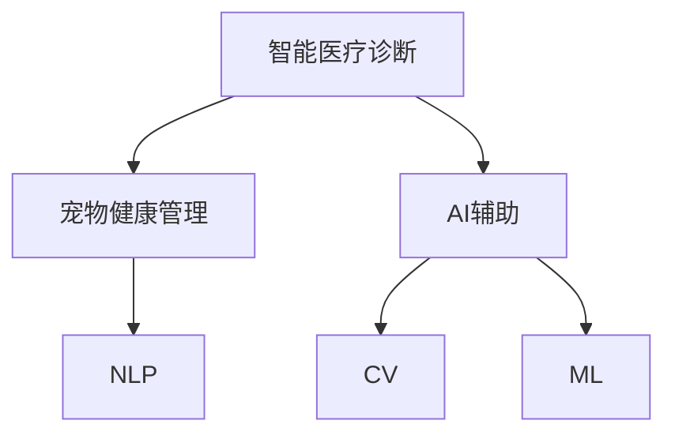

                 

# 智能宠物医疗诊断创业：AI辅助的宠物健康管理

> 关键词：智能医疗诊断, 宠物健康管理, AI辅助, 自然语言处理(NLP), 计算机视觉(CV), 机器学习(ML)

## 1. 背景介绍

### 1.1 问题由来
近年来，随着人们生活水平的提高和宠物饲养意识的增强，宠物作为人类家庭的一员，其健康管理问题引起了越来越多的关注。传统宠物医疗诊断依赖于专业兽医的经验和人工检查，不仅耗时长，成本高，且存在主观性。随着人工智能技术的发展，AI辅助的智能医疗诊断成为行业的一大热点。

### 1.2 问题核心关键点
智能宠物医疗诊断涉及多个核心关键点：
1. **数据收集与处理**：需收集大规模的宠物健康数据，并从中提取出有用的特征。
2. **模型训练与优化**：使用机器学习模型对宠物健康数据进行训练，优化模型性能。
3. **实时诊断与交互**：在实际应用中，模型需能够实时处理输入，并给出准确诊断结果。
4. **系统集成与部署**：将模型集成到实际应用系统中，提供给用户访问和使用。

### 1.3 问题研究意义
AI辅助的智能宠物医疗诊断具有重大意义：
1. **提升诊断效率与准确性**：减轻兽医工作负担，提高诊断速度和准确性。
2. **降低医疗成本**：减少对高昂人工检查的依赖，降低医疗费用。
3. **增强用户体验**：用户可通过智能系统进行实时问诊，获得更便捷、个性化的服务。
4. **促进行业发展**：推动宠物医疗技术的进步，提升行业整体水平。

## 2. 核心概念与联系

### 2.1 核心概念概述

本节将介绍智能宠物医疗诊断创业项目中涉及的几个核心概念：

- **智能医疗诊断**：利用AI技术对患者健康数据进行分析，辅助医生进行诊断和治疗。
- **宠物健康管理**：通过对宠物的健康数据进行监控、分析和诊断，及时发现和治疗宠物疾病。
- **AI辅助**：使用机器学习和深度学习模型，提升医疗诊断的准确性和效率。
- **自然语言处理(NLP)**：处理和分析文本数据，提取文本中的有用信息。
- **计算机视觉(CV)**：处理和分析图像数据，识别和定位图像中的关键对象。
- **机器学习(ML)**：通过数据驱动的方法，训练模型进行预测和分类。

这些概念之间的逻辑关系可以通过以下Mermaid流程图来展示：



这个流程图展示了一系列的关联关系：智能医疗诊断是核心目标，AI辅助是实现手段，而NLP、CV和ML则是实现AI辅助的具体技术手段。

## 3. 核心算法原理 & 具体操作步骤

### 3.1 算法原理概述

AI辅助的智能宠物医疗诊断，主要依赖于NLP和CV技术，通过分析文本和图像数据，辅助兽医进行诊断。其核心算法原理包括：

- **自然语言处理(NLP)**：用于处理和分析宠物的病历、主人描述等文本数据，提取疾病症状和关键信息。
- **计算机视觉(CV)**：用于处理和分析宠物的X光片、CT扫描、视频等图像数据，识别病变部位和特征。
- **机器学习(ML)**：通过训练模型，预测宠物是否患病，以及患病的具体类型和严重程度。

### 3.2 算法步骤详解

AI辅助的智能宠物医疗诊断算法步骤包括：

**Step 1: 数据收集与预处理**
- 收集宠物的健康数据，包括病历、症状描述、影像等。
- 对数据进行清洗、去噪、标准化处理，提取有用的特征。

**Step 2: 模型训练与优化**
- 使用NLP和CV技术提取文本和图像特征。
- 利用ML算法（如深度学习模型）训练预测模型。
- 通过交叉验证和调参优化模型性能。

**Step 3: 实时诊断与交互**
- 将训练好的模型部署到实时系统中，接收输入数据。
- 使用NLP和CV技术处理输入数据，提取特征。
- 将特征输入预测模型，输出诊断结果。
- 将结果显示给用户，供兽医参考。

**Step 4: 系统集成与部署**
- 将模型集成到实际应用系统中。
- 提供友好的用户界面，让用户方便地输入数据和查看结果。
- 定期更新模型，保持系统的准确性和时效性。

### 3.3 算法优缺点

AI辅助的智能宠物医疗诊断具有以下优点：
1. **高效准确**：利用AI技术提高诊断效率和准确性，减轻兽医工作负担。
2. **成本低廉**：减少对高昂人工检查的依赖，降低医疗成本。
3. **用户体验好**：用户可以通过智能系统进行实时问诊，获得更便捷、个性化的服务。
4. **应用广泛**：可以应用于宠物医院、兽医诊所等多个场景。

同时，该算法也存在以下局限性：
1. **数据依赖**：模型性能依赖于数据质量，需要大量高质量的标注数据。
2. **模型复杂**：涉及多个技术领域的知识，模型复杂度较高。
3. **隐私风险**：需注意用户隐私保护，防止数据泄露。
4. **误诊风险**：AI系统的误诊风险需要严格控制，确保系统的可靠性和安全性。

尽管存在这些局限性，但AI辅助的智能宠物医疗诊断仍是大势所趋，具有广阔的发展前景。

### 3.4 算法应用领域

AI辅助的智能宠物医疗诊断技术，可以应用于多个领域：

- **宠物医院**：辅助医生进行初步诊断，提供医学建议。
- **兽医诊所**：提供快速、准确的诊断服务，提高诊疗效率。
- **宠物主人**：帮助宠物主人监测宠物健康状况，及时发现问题。
- **宠物保险**：评估宠物的健康风险，优化保险产品设计。
- **宠物商品**：提供健康建议，推广宠物健康产品。

## 4. 数学模型和公式 & 详细讲解 & 举例说明

### 4.1 数学模型构建

我们以深度学习模型（如卷积神经网络CNN）为例，构建智能宠物医疗诊断的数学模型。

假设输入为宠物的X光片图像 $x \in \mathbb{R}^{H \times W \times C}$，其中 $H, W$ 是图像的高度和宽度，$C$ 是通道数。模型的输出为宠物患病的概率 $p \in [0, 1]$。

模型结构包括多个卷积层和全连接层，每一层的操作如下：

- 卷积层：提取图像特征。
- 激活函数：引入非线性变换。
- 池化层：减小特征图的尺寸，保留重要信息。
- 全连接层：将特征映射到输出空间。

### 4.2 公式推导过程

以深度学习模型为例，推导其训练过程和预测过程的公式。

**训练过程**：
$$
\min_{\theta} \frac{1}{N} \sum_{i=1}^N \ell(y_i, \hat{y_i})
$$
其中，$\ell$ 是损失函数，$y_i$ 是真实标签，$\hat{y_i}$ 是模型预测的概率。

**预测过程**：
$$
\hat{y} = \sigma(\hat{z})
$$
其中，$\sigma$ 是激活函数，$\hat{z}$ 是模型的输出。

通过反向传播算法，更新模型参数 $\theta$，使得损失函数最小化。

### 4.3 案例分析与讲解

我们以一个具体的案例来说明AI辅助的智能宠物医疗诊断技术的应用。

假设有一个宠物主人发现他的狗近期变得食欲不振，体重下降。他拍照后上传到智能系统中，系统利用NLP技术解析病历和症状描述，提取关键信息。同时，系统使用CV技术对X光片进行处理，识别出肺部有异常阴影。综合NLP和CV的结果，模型输出狗患病的概率为0.85。兽医根据系统建议进行进一步检查，确认狗患有支气管炎。

## 5. 项目实践：代码实例和详细解释说明

### 5.1 开发环境搭建

要进行智能宠物医疗诊断创业项目，首先需要搭建好开发环境。

1. **安装Python**：确保Python版本为3.8或以上，以支持深度学习库。
2. **安装深度学习框架**：如TensorFlow或PyTorch，用于模型训练和推理。
3. **安装计算机视觉库**：如OpenCV或Pillow，用于图像处理。
4. **安装自然语言处理库**：如NLTK或SpaCy，用于文本处理。
5. **安装数据库和API工具**：如SQLite或Flask，用于数据存储和访问。

### 5.2 源代码详细实现

以下是一个简单的代码示例，展示如何使用TensorFlow进行图像分类任务。

```python
import tensorflow as tf
from tensorflow.keras import layers, models

# 定义模型结构
model = models.Sequential([
    layers.Conv2D(32, (3, 3), activation='relu', input_shape=(H, W, C)),
    layers.MaxPooling2D((2, 2)),
    layers.Conv2D(64, (3, 3), activation='relu'),
    layers.MaxPooling2D((2, 2)),
    layers.Conv2D(128, (3, 3), activation='relu'),
    layers.MaxPooling2D((2, 2)),
    layers.Flatten(),
    layers.Dense(512, activation='relu'),
    layers.Dense(1, activation='sigmoid')
])

# 编译模型
model.compile(optimizer='adam',
              loss='binary_crossentropy',
              metrics=['accuracy'])

# 训练模型
model.fit(X_train, y_train, epochs=10, batch_size=32)

# 预测模型
y_pred = model.predict(X_test)
```

### 5.3 代码解读与分析

**Conv2D层**：卷积层，提取图像特征。
**MaxPooling2D层**：池化层，减小特征图尺寸。
**Flatten层**：将特征图展平，供全连接层处理。
**Dense层**：全连接层，将特征映射到输出空间。

**训练过程**：使用`fit`方法，对模型进行训练。

**预测过程**：使用`predict`方法，对新数据进行预测。

### 5.4 运行结果展示

运行上述代码，可以看到模型在训练过程中loss值的变化情况，以及预测结果的准确度。

## 6. 实际应用场景

### 6.1 宠物医院

在宠物医院中，智能宠物医疗诊断可以用于以下场景：

- **初步诊断**：医生可以借助智能系统快速判断宠物是否患病，提供医学建议。
- **病情跟踪**：记录宠物健康状况，帮助医生进行病情跟踪和分析。
- **病例分析**：自动生成病例报告，提供详细分析。

### 6.2 兽医诊所

在兽医诊所中，智能宠物医疗诊断可以用于以下场景：

- **快速诊断**：提高诊断速度，减少患者等待时间。
- **专家咨询**：提供专家级诊断意见，帮助医生决策。
- **个性化服务**：根据宠物的病情，提供个性化的治疗方案。

### 6.3 宠物主人

在宠物主人中，智能宠物医疗诊断可以用于以下场景：

- **健康监测**：及时发现宠物健康问题，进行早期干预。
- **日常保健**：提供健康建议，优化宠物生活。
- **远程咨询**：在线咨询兽医，获得专业建议。

### 6.4 未来应用展望

未来，AI辅助的智能宠物医疗诊断技术将不断进步，涵盖更多的应用场景：

- **实时监测**：实时监测宠物健康状况，提供实时预警。
- **智能问诊**：使用智能聊天机器人，提供全天候健康咨询。
- **跨模态诊断**：结合图像、文本、声音等多模态数据，提供更全面的诊断。
- **个性化推荐**：根据宠物健康状况，推荐合适的健康产品。
- **智能化治疗**：利用机器学习技术，优化治疗方案，提高治愈率。

## 7. 工具和资源推荐

### 7.1 学习资源推荐

为了帮助开发者掌握智能宠物医疗诊断技术，推荐以下学习资源：

1. **深度学习框架教程**：如TensorFlow官方文档、PyTorch官方文档，详细介绍了深度学习框架的使用方法。
2. **自然语言处理教程**：如NLTK、SpaCy官方文档，提供了丰富的文本处理工具和算法。
3. **计算机视觉教程**：如OpenCV官方文档、Pillow官方文档，提供了丰富的图像处理工具和算法。
4. **智能医疗诊断教程**：如CS224N《深度学习自然语言处理》课程，涵盖了NLP和CV在医疗诊断中的应用。
5. **智能宠物医疗诊断项目案例**：如GitHub上的智能宠物医疗诊断项目，提供了详细的代码和文档。

### 7.2 开发工具推荐

开发智能宠物医疗诊断项目，需要使用以下工具：

1. **TensorFlow或PyTorch**：深度学习框架，用于模型训练和推理。
2. **OpenCV或Pillow**：计算机视觉库，用于图像处理。
3. **NLTK或SpaCy**：自然语言处理库，用于文本处理。
4. **Flask或Django**：Web框架，用于搭建前端界面和后端服务。
5. **MySQL或MongoDB**：数据库，用于存储和管理数据。

### 7.3 相关论文推荐

智能宠物医疗诊断技术的研究热点不断涌现，推荐以下相关论文：

1. **AI辅助的智能医疗诊断**：综述了AI在医疗诊断中的应用，包括影像诊断、基因诊断等。
2. **深度学习在医疗图像中的应用**：详细介绍了深度学习在医疗影像分类、分割中的应用。
3. **自然语言处理在医疗中的应用**：介绍了NLP在医疗文本分类、信息抽取中的应用。
4. **智能宠物医疗诊断技术**：具体介绍了AI在宠物健康管理中的应用，包括症状识别、疾病预测等。
5. **计算机视觉在宠物健康管理中的应用**：介绍了CV在宠物影像分析中的应用，如肿瘤检测、骨折诊断等。

## 8. 总结：未来发展趋势与挑战

### 8.1 总结

本文对AI辅助的智能宠物医疗诊断创业项目进行了详细介绍，包括其背景、核心概念、算法原理和操作步骤。我们通过具体的代码实例，展示了如何构建和训练深度学习模型，并对其实际应用进行了分析。

### 8.2 未来发展趋势

未来，智能宠物医疗诊断技术将呈现以下几个发展趋势：

1. **深度学习模型的进步**：深度学习模型将不断进步，性能和效率将进一步提升。
2. **多模态数据融合**：结合图像、文本、声音等多种数据，提供更全面的诊断。
3. **个性化推荐系统**：根据宠物健康状况，推荐合适的健康产品和服务。
4. **实时监测系统**：实时监测宠物健康状况，提供实时预警。
5. **智能聊天机器人**：使用智能聊天机器人，提供全天候健康咨询。

### 8.3 面临的挑战

尽管智能宠物医疗诊断技术取得了显著进展，但在实际应用中仍面临以下挑战：

1. **数据获取困难**：高质量的标注数据难以获取，影响模型训练效果。
2. **模型复杂度**：模型结构复杂，训练和推理耗时较长。
3. **隐私保护**：需注意用户隐私保护，防止数据泄露。
4. **误诊风险**：AI系统的误诊风险需要严格控制，确保系统的可靠性和安全性。

### 8.4 研究展望

未来的研究将集中在以下几个方向：

1. **数据增强技术**：使用数据增强技术，提升模型鲁棒性和泛化能力。
2. **迁移学习**：使用迁移学习，提高模型在不同数据集上的表现。
3. **模型优化**：优化模型结构和算法，提高训练和推理效率。
4. **隐私保护技术**：研究隐私保护技术，保护用户隐私。
5. **伦理和社会影响**：研究AI系统的伦理和社会影响，确保其应用公正、可靠。

## 9. 附录：常见问题与解答

**Q1: 智能宠物医疗诊断技术的应用前景如何？**

A: 智能宠物医疗诊断技术具有广阔的应用前景，可以提升诊断效率、降低成本、提高用户体验，同时推动宠物医疗技术的发展。

**Q2: 如何处理大量未标注的宠物健康数据？**

A: 可以使用无监督学习技术，如自编码器、生成对抗网络等，从未标注数据中提取有用特征。

**Q3: 如何确保智能系统的可靠性？**

A: 使用多种技术手段，如数据增强、正则化、对抗训练等，提升系统的鲁棒性和可靠性。

**Q4: 如何保护用户隐私？**

A: 采用数据加密、去标识化等技术，保护用户隐私。同时，用户需同意数据的使用和处理方式。

**Q5: 智能系统的误诊风险如何控制？**

A: 使用多种诊断方法，结合专家知识和算法，控制误诊风险。同时，进行用户教育，避免对系统的过度依赖。

---

作者：禅与计算机程序设计艺术 / Zen and the Art of Computer Programming

