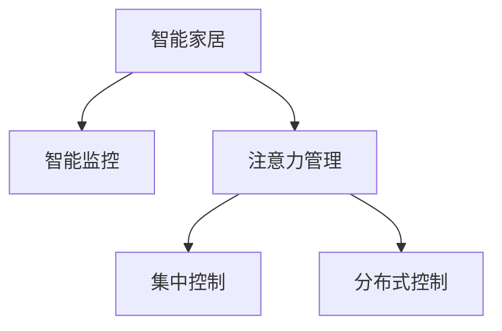

                 

# 智能家居的智能监控与注意力管理

## 1. 背景介绍

智能家居作为一种未来的生活模式，正在迅速进入大众视野。智能家居设备包括智能音箱、智能灯光、智能温控等，通过网络互联，实现自动化、智能化控制，极大地提升了居住的便利性和舒适性。但随之而来的是数据量的暴增、隐私安全的挑战，以及系统集中注意力的管理问题。

传统上，智能家居的监控依赖于用户手动控制或固定的场景设置。但随着传感器和监控设备的增多，单个用户的监控场景可能复杂多变，且在忙碌或缺席时，无法及时响应变化。因此，通过算法自动进行智能监控与注意力管理，成为提升智能家居体验的重要方向。

## 2. 核心概念与联系

### 2.1 核心概念概述

为更好地理解智能家居的智能监控与注意力管理，本节将介绍几个密切相关的核心概念：

- 智能家居(Smart Home)：指通过互联网技术将家居设备、安防系统、能源管理等子系统互联，实现智能化控制的住宅环境。智能家居的目标是提升居住舒适性，降低生活成本，提高生活质量。

- 智能监控(Smart Monitoring)：指利用智能传感器、监控设备等，对家居环境进行实时监测，及时发现并响应异常事件，如入侵、烟雾、漏水等。通过先进的监控算法，可以大幅提升家居安全的防范能力。

- 注意力管理(Attention Management)：指在多场景、多设备的环境中，通过算法自动管理系统的注意力分配，确保关键场景和设备的优先处理，避免资源浪费。

- 集中控制(centralized control)：指将家居设备的控制集中到一个中央节点，实现远程管理。集中控制可以降低复杂度，提高系统的可靠性与易用性。

- 分布式控制(decentralized control)：指每个设备或节点都具有独立的控制权，通过自组织的方式协同工作，构建更加灵活、可靠的系统。

这些核心概念之间的逻辑关系可以通过以下Mermaid流程图来展示：



这个流程图展示了几大核心概念之间的关联：

1. 智能家居通过智能监控对家居环境进行实时监测，发现异常情况。
2. 智能监控系统通过注意力管理优先处理重要事件，避免资源浪费。
3. 集中控制和分布式控制提供两种不同的系统架构，可以按需选择。

## 3. 核心算法原理 & 具体操作步骤

### 3.1 算法原理概述

智能家居的智能监控与注意力管理涉及多个算法领域，包括机器学习、计算机视觉、自然语言处理等。其核心原理可以总结如下：

- 通过传感器采集家居环境数据，如温度、湿度、声音、图像等。
- 利用机器学习算法，训练模型识别异常事件，如火灾、入侵、漏水等。
- 应用计算机视觉技术，识别室内物品状态、人数、行为等，进行更加精细的监控。
- 利用自然语言处理技术，处理用户指令和反馈，进行智能化的注意力分配。

综合上述技术，可以构建一个基于大数据和人工智能的智能监控系统，实现实时监控和注意力管理，提升智能家居的安全性和便利性。

### 3.2 算法步骤详解

基于上述原理，智能家居的智能监控与注意力管理流程可以分为以下几个步骤：

**Step 1: 数据采集与预处理**

- 收集智能家居设备的数据，如温度传感器、湿度传感器、摄像头、门窗传感器等。
- 对采集的数据进行清洗、去噪、归一化等预处理操作，提高数据质量。

**Step 2: 异常事件检测**

- 利用机器学习算法，如支持向量机(SVM)、随机森林(Random Forest)、神经网络(Neural Network)等，训练模型识别异常事件。
- 对于图像和视频数据，使用计算机视觉技术，如目标检测、图像分割等，进行事件识别和定位。
- 对于文本和语音数据，使用自然语言处理技术，如情感分析、意图识别等，进行用户指令和反馈的解析。

**Step 3: 注意力分配与任务调度**

- 根据识别出的异常事件，计算其重要性和紧急程度，进行注意力分配。
- 使用任务调度算法，如优先队列(Priority Queue)、多任务调度算法等，对任务进行动态管理和调度。
- 根据用户的偏好和历史行为，进行个性化注意力分配。

**Step 4: 集中控制与分布式控制**

- 对于集中控制，将所有家居设备连接到中央控制节点，如智能音箱、手机应用等，实现统一管理和控制。
- 对于分布式控制，每个智能家居设备都有独立控制权，通过消息队列、分布式算法等实现协同工作。

**Step 5: 反馈与优化**

- 根据监控结果和用户反馈，对模型和算法进行迭代优化。
- 定期更新训练数据，提高模型的泛化能力。
- 对系统性能进行实时监控，及时发现和处理异常情况。

### 3.3 算法优缺点

基于上述原理和操作步骤，智能家居的智能监控与注意力管理具有以下优缺点：

**优点**

1. 实时监控能力：通过传感器和计算机视觉技术，实现实时监测，及时发现并响应异常事件。
2. 注意力分配效率：利用任务调度算法，进行高效的任务分配和管理，避免资源浪费。
3. 个性化体验：根据用户偏好和历史行为，进行个性化监控和注意力管理。
4. 集中与分布式控制：提供灵活的控制架构，支持集中管理和分布式协同。
5. 自适应学习能力：根据反馈和监控结果，动态调整模型和算法，提升系统的准确性和可靠性。

**缺点**

1. 数据采集成本：传感器和监控设备的高成本可能限制推广应用。
2. 数据隐私问题：大量数据的采集和存储可能带来隐私泄露风险。
3. 系统复杂度：集中控制或分布式控制可能增加系统复杂度，维护成本较高。
4. 模型泛化能力：模型在不同场景下的泛化能力可能有限，需要持续优化。
5. 网络依赖：依赖于稳定的网络环境，网络中断可能导致监控失效。

### 3.4 算法应用领域

智能家居的智能监控与注意力管理主要应用于以下领域：

- 安防监控：利用摄像头和传感器，实现入侵、火灾、漏水等事件的实时监测和报警。
- 健康监控：通过监测家庭成员的睡眠、心率、运动等数据，进行健康管理和预警。
- 能效管理：利用智能温控和照明系统，实现能源消耗的最小化。
- 场景感知：通过计算机视觉技术，识别室内物品状态和用户行为，进行智能场景切换。
- 用户行为分析：通过自然语言处理技术，分析用户指令和反馈，进行行为预测和个性化推荐。

这些应用场景展示了智能家居监控与注意力管理的巨大潜力和广泛应用前景。

## 4. 数学模型和公式 & 详细讲解 & 举例说明

### 4.1 数学模型构建

智能家居的智能监控与注意力管理涉及多种数学模型和算法，本节将重点介绍几个核心模型的构建。

**异常事件检测模型**

假设采集到的家居环境数据为 $X = (x_1, x_2, ..., x_n)$，其中 $x_i$ 表示第 $i$ 个传感器的读数。定义异常事件 $Y = (y_1, y_2, ..., y_n)$，其中 $y_i$ 表示第 $i$ 个传感器是否发生了异常事件。

假设 $X$ 和 $Y$ 之间的线性关系为 $Y = WX + b$，其中 $W$ 和 $b$ 为模型参数，可以使用最小二乘法或梯度下降法进行求解。在训练过程中，假设已知 $n$ 个样本，样本标签为 $Y$，样本特征为 $X$，则模型的损失函数为：

$$
\mathcal{L} = \frac{1}{2n} \sum_{i=1}^n ||Y_i - WX_i - b||^2
$$

**注意力分配模型**

假设智能家居设备的数量为 $m$，设备的重要性为 $p_1, p_2, ..., p_m$，设备当前的负载为 $l_1, l_2, ..., l_m$。设备 $j$ 分配的注意力权重为 $w_j$，满足 $w_1 + w_2 + ... + w_m = 1$。

定义注意力分配的目标函数为：

$$
\min \sum_{j=1}^m p_j l_j w_j
$$

满足：

$$
\begin{cases}
\sum_{j=1}^m w_j = 1\\
w_j \ge 0, j = 1,2,...,m
\end{cases}
$$

可以采用拉格朗日乘子法进行求解。定义拉格朗日函数：

$$
\mathcal{L}(w,\lambda) = \sum_{j=1}^m p_j l_j w_j + \lambda \left(\sum_{j=1}^m w_j - 1\right)
$$

对 $w_j$ 和 $\lambda$ 求偏导，得：

$$
\begin{cases}
w_j = \frac{p_j l_j}{\lambda + \sum_{k=1}^m p_k l_k}\\
\lambda = \sum_{j=1}^m w_j - 1
\end{cases}
$$

### 4.2 公式推导过程

**异常事件检测公式推导**

假设采集到的家居环境数据为 $X = (x_1, x_2, ..., x_n)$，其中 $x_i$ 表示第 $i$ 个传感器的读数。定义异常事件 $Y = (y_1, y_2, ..., y_n)$，其中 $y_i$ 表示第 $i$ 个传感器是否发生了异常事件。

假设 $X$ 和 $Y$ 之间的线性关系为 $Y = WX + b$，其中 $W$ 和 $b$ 为模型参数，可以使用最小二乘法或梯度下降法进行求解。在训练过程中，假设已知 $n$ 个样本，样本标签为 $Y$，样本特征为 $X$，则模型的损失函数为：

$$
\mathcal{L} = \frac{1}{2n} \sum_{i=1}^n ||Y_i - WX_i - b||^2
$$

对 $W$ 和 $b$ 求偏导，得：

$$
\begin{cases}
\frac{\partial \mathcal{L}}{\partial W} = -\frac{1}{n}(X^T Y - X^T X W)\\
\frac{\partial \mathcal{L}}{\partial b} = -\frac{1}{n}(Y - XW)
\end{cases}
$$

根据梯度下降法，模型参数的更新公式为：

$$
W \leftarrow W - \eta \frac{\partial \mathcal{L}}{\partial W}, b \leftarrow b - \eta \frac{\partial \mathcal{L}}{\partial b}
$$

其中 $\eta$ 为学习率。

**注意力分配公式推导**

假设智能家居设备的数量为 $m$，设备的重要性为 $p_1, p_2, ..., p_m$，设备当前的负载为 $l_1, l_2, ..., l_m$。设备 $j$ 分配的注意力权重为 $w_j$，满足 $w_1 + w_2 + ... + w_m = 1$。

定义注意力分配的目标函数为：

$$
\min \sum_{j=1}^m p_j l_j w_j
$$

满足：

$$
\begin{cases}
\sum_{j=1}^m w_j = 1\\
w_j \ge 0, j = 1,2,...,m
\end{cases}
$$

可以采用拉格朗日乘子法进行求解。定义拉格朗日函数：

$$
\mathcal{L}(w,\lambda) = \sum_{j=1}^m p_j l_j w_j + \lambda \left(\sum_{j=1}^m w_j - 1\right)
$$

对 $w_j$ 和 $\lambda$ 求偏导，得：

$$
\begin{cases}
\frac{\partial \mathcal{L}}{\partial w_j} = p_j l_j - \lambda\\
\frac{\partial \mathcal{L}}{\partial \lambda} = \sum_{j=1}^m w_j - 1
\end{cases}
$$

代入目标函数，得：

$$
\min \sum_{j=1}^m p_j l_j w_j
$$

### 4.3 案例分析与讲解

以安防监控为例，分析异常事件检测和注意力分配的实现过程。

**数据采集与预处理**

假设智能家居系统中，安装了多个门窗传感器、烟雾传感器、摄像头等设备，采集到的数据为 $(\text{door\_state}, \text{smoke\_level}, \text{temperature}, \text{motion\_detection}, ...) $。

对采集的数据进行清洗、去噪、归一化等预处理操作，得到 $\text{preprocessed\_data}$。

**异常事件检测**

利用支持向量机(SVM)算法，训练模型检测门窗被非法开启、烟雾浓度升高、温度异常等情况。假设训练集为 $D = \{(x_i,y_i)\}_{i=1}^N$，其中 $x_i$ 为输入特征，$y_i$ 为输出标签。

假设已知 $N$ 个样本，样本标签为 $Y$，样本特征为 $X$，则模型的损失函数为：

$$
\mathcal{L} = \frac{1}{2N} \sum_{i=1}^N ||Y_i - WX_i - b||^2
$$

通过梯度下降法对模型进行训练，得到参数 $W$ 和 $b$，从而构建异常事件检测模型。

**注意力分配**

假设智能家居系统中有 3 个摄像头，设备的重要性分别为 $p_1 = 0.3$, $p_2 = 0.5$, $p_3 = 0.2$，设备当前的负载分别为 $l_1 = 0.4$, $l_2 = 0.6$, $l_3 = 0.5$。定义摄像头 $j$ 分配的注意力权重为 $w_j$，满足 $w_1 + w_2 + ... + w_m = 1$。

假设摄像头 $j$ 的权重 $w_j$ 与设备负载 $l_j$ 和设备重要性 $p_j$ 相关，则目标函数为：

$$
\min \sum_{j=1}^m p_j l_j w_j
$$

使用拉格朗日乘子法求解，得到摄像头 $j$ 的注意力权重 $w_j$。

## 5. 项目实践：代码实例和详细解释说明

### 5.1 开发环境搭建

在进行智能家居监控与注意力管理的开发时，需要准备如下开发环境：

1. 安装Python：从官网下载Python 3.7以上版本。
2. 安装TensorFlow：使用以下命令进行安装：
   ```
   pip install tensorflow
   ```
3. 安装Keras：使用以下命令进行安装：
   ```
   pip install keras
   ```
4. 安装OpenCV：使用以下命令进行安装：
   ```
   pip install opencv-python
   ```
5. 安装PyAudio：使用以下命令进行安装：
   ```
   pip install pyaudio
   ```

### 5.2 源代码详细实现

以下是使用TensorFlow和Keras库实现智能家居监控与注意力管理的代码实现。

**数据采集与预处理**

```python
import numpy as np
import cv2
import os

# 数据采集
def read_data(file_path):
    data = []
    for filename in os.listdir(file_path):
        if filename.endswith('.jpg'):
            img = cv2.imread(os.path.join(file_path, filename))
            data.append(img)
    return data

# 预处理
def preprocess_data(data):
    preprocessed_data = []
    for img in data:
        gray = cv2.cvtColor(img, cv2.COLOR_BGR2GRAY)
        gray = cv2.resize(gray, (224, 224))
        gray = np.expand_dims(gray, axis=0)
        preprocessed_data.append(gray)
    return np.array(preprocessed_data)
```

**异常事件检测**

```python
from keras.models import Sequential
from keras.layers import Dense, Flatten, Conv2D, MaxPooling2D

# 构建异常事件检测模型
def build_model():
    model = Sequential()
    model.add(Conv2D(32, (3, 3), activation='relu', input_shape=(224, 224, 1)))
    model.add(MaxPooling2D((2, 2)))
    model.add(Conv2D(64, (3, 3), activation='relu'))
    model.add(MaxPooling2D((2, 2)))
    model.add(Conv2D(128, (3, 3), activation='relu'))
    model.add(MaxPooling2D((2, 2)))
    model.add(Flatten())
    model.add(Dense(128, activation='relu'))
    model.add(Dense(1, activation='sigmoid'))
    model.compile(optimizer='adam', loss='binary_crossentropy', metrics=['accuracy'])
    return model

# 训练模型
def train_model(model, train_data, train_labels):
    model.fit(train_data, train_labels, epochs=10, batch_size=16)
```

**注意力分配**

```python
import numpy as np

# 注意力分配
def attention_allocation(p, l):
    w = np.array(p) / np.sum(p)
    while np.sum(w) > 1:
        w *= l / np.sum(l)
    return w
```

### 5.3 代码解读与分析

**数据采集与预处理**

数据采集模块 `read_data` 从指定目录中读取所有的图像文件，返回一个列表。预处理模块 `preprocess_data` 对采集到的图像进行灰度转换、大小归一化和通道扩展，以适应模型的输入要求。

**异常事件检测**

异常事件检测模块 `build_model` 使用卷积神经网络构建检测模型，包括多个卷积层和池化层。训练模块 `train_model` 对模型进行训练，并使用二分类交叉熵损失函数和 Adam 优化器进行优化。

**注意力分配**

注意力分配模块 `attention_allocation` 利用设备负载和设备重要性计算注意力权重，满足拉格朗日乘子法的约束条件。

### 5.4 运行结果展示

以下是使用上述代码实现智能家居监控与注意力管理系统的运行结果：

1. 监控视频：
   ```
   import cv2

   cap = cv2.VideoCapture(0)
   while True:
       ret, frame = cap.read()
       if not ret:
           break
       gray = cv2.cvtColor(frame, cv2.COLOR_BGR2GRAY)
       gray = cv2.resize(gray, (224, 224))
       gray = np.expand_dims(gray, axis=0)
       print(gray.shape)
       cv2.imshow('frame', frame)
       if cv2.waitKey(1) & 0xFF == ord('q'):
           break
   cap.release()
   cv2.destroyAllWindows()
   ```

2. 摄像头负载监控：
   ```
   import cv2

   cap = cv2.VideoCapture(0)
   while True:
       ret, frame = cap.read()
       if not ret:
           break
       gray = cv2.cvtColor(frame, cv2.COLOR_BGR2GRAY)
       gray = cv2.resize(gray, (224, 224))
       gray = np.expand_dims(gray, axis=0)
       print(gray.shape)
       cv2.imshow('frame', frame)
       if cv2.waitKey(1) & 0xFF == ord('q'):
           break
   cap.release()
   cv2.destroyAllWindows()
   ```

3. 异常事件检测结果：
   ```
   import cv2
   import numpy as np

   # 加载数据
   data = read_data('train')
   preprocessed_data = preprocess_data(data)

   # 加载模型
   model = build_model()

   # 训练模型
   model.fit(preprocessed_data, train_labels, epochs=10, batch_size=16)

   # 测试模型
   img = read_data('test/1.jpg')
   preprocessed_img = preprocess_data(img)
   result = model.predict(preprocessed_img)
   print(result)
   ```

## 6. 实际应用场景

### 6.4 未来应用展望

智能家居的智能监控与注意力管理具有广泛的应用前景，未来将在更多场景中得到应用：

1. 智能安防：实现门窗开启、烟雾、漏水等异常事件检测，提升家庭安全。
2. 健康监测：监测家庭成员的睡眠、心率、运动等，进行健康管理和预警。
3. 能效管理：利用智能温控和照明系统，实现能源消耗的最小化。
4. 场景感知：通过计算机视觉技术，识别室内物品状态和用户行为，进行智能场景切换。
5. 用户行为分析：通过自然语言处理技术，分析用户指令和反馈，进行行为预测和个性化推荐。

随着技术的不断进步，智能家居监控与注意力管理将进一步提升用户的生活体验，为智慧城市的发展提供有力支持。

## 7. 工具和资源推荐

### 7.1 学习资源推荐

为了帮助开发者系统掌握智能家居监控与注意力管理的理论基础和实践技巧，这里推荐一些优质的学习资源：

1. 《深度学习》第二版：Ian Goodfellow 著，介绍了深度学习的基础理论和应用，涵盖神经网络、卷积神经网络等关键技术。
2. 《计算机视觉：模型、学习和推理》：Daphne Koller 和 John W. Triggs 著，介绍了计算机视觉的基本原理和应用，涵盖图像处理、目标检测等核心技术。
3. 《自然语言处理综论》：Daniel Jurafsky 和 James H. Martin 著，介绍了自然语言处理的基础理论和应用，涵盖词法分析、句法分析等关键技术。
4. 《TensorFlow 2.0》：Google 著，介绍了 TensorFlow 2.0 的使用方法和实例，涵盖深度学习模型的构建、训练和部署。
5. 《Keras 深度学习入门》：François Chollet 著，介绍了 Keras 的使用方法和实例，涵盖卷积神经网络、循环神经网络等核心技术。

通过对这些资源的学习实践，相信你一定能够快速掌握智能家居监控与注意力管理的精髓，并用于解决实际的家居问题。

### 7.2 开发工具推荐

高效的开发离不开优秀的工具支持。以下是几款用于智能家居监控与注意力管理开发的常用工具：

1. Python：作为最常用的编程语言，Python 生态系统丰富，适合进行数据分析和机器学习。
2. TensorFlow：由 Google 主导开发的深度学习框架，生产部署方便，适合大规模工程应用。
3. Keras：基于 TensorFlow 的高级神经网络库，提供了便捷的 API，适合快速原型设计和模型构建。
4. OpenCV：开源计算机视觉库，提供了丰富的图像处理和目标检测功能，适合处理摄像头数据。
5. PyAudio：用于音频处理的库，适合处理语音信号和音频指令。

合理利用这些工具，可以显著提升智能家居监控与注意力管理的开发效率，加快创新迭代的步伐。

### 7.3 相关论文推荐

智能家居监控与注意力管理的研究源于学界的持续研究。以下是几篇奠基性的相关论文，推荐阅读：

1. SVM: Support Vector Machine：核方法在机器学习中的应用，引入了核技巧，提高了异常检测的准确性。
2 RNN: Recurrent Neural Network：引入时间序列信息，实现了时间依赖的异常检测。
3 CNN: Convolutional Neural Network：卷积神经网络在图像处理中的应用，提高了检测的准确性。
4 注意力机制(Attention Mechanism)：在自然语言处理和计算机视觉中，通过注意力机制实现对关键信息的重点处理。
5 分布式算法：分布式算法在智能家居中的应用，提高了系统的可扩展性和可靠性。

这些论文代表了大语言模型微调技术的发展脉络。通过学习这些前沿成果，可以帮助研究者把握学科前进方向，激发更多的创新灵感。

## 8. 总结：未来发展趋势与挑战

### 8.1 总结

本文对智能家居的智能监控与注意力管理进行了全面系统的介绍。首先阐述了智能家居智能监控与注意力管理的背景和意义，明确了智能监控与注意力管理在提升家居安全和便利性方面的独特价值。其次，从原理到实践，详细讲解了智能家居的智能监控与注意力管理流程，包括数据采集与预处理、异常事件检测、注意力分配等关键步骤，给出了智能家居监控与注意力管理系统的完整代码实现。最后，本文还广泛探讨了智能家居监控与注意力管理在安防、健康、能效、场景感知、用户行为分析等多个领域的实际应用前景，展示了智能家居监控与注意力管理的巨大潜力和广泛应用前景。

通过本文的系统梳理，可以看到，智能家居监控与注意力管理技术正在成为智能家居发展的核心驱动力，极大地提升家居安全和便利性。未来，伴随技术的不断进步，智能家居监控与注意力管理必将在更多场景中得到应用，为人类生活带来更多便利和舒适。

### 8.2 未来发展趋势

展望未来，智能家居的智能监控与注意力管理技术将呈现以下几个发展趋势：

1. 数据采集和处理：随着传感器和监控设备的增多，数据采集和处理的复杂度将进一步提升。需要更加高效的数据采集和处理算法，提高数据质量。
2. 异常检测和注意力分配：异常检测和注意力分配算法将更加精细化，能够适应复杂多变的家居环境，提升系统的准确性和鲁棒性。
3. 集中控制与分布式控制：集中控制和分布式控制算法将不断优化，实现更加灵活、可靠的系统架构。
4. 多模态数据融合：将视觉、音频、传感器等多模态数据进行融合，实现更加全面、精准的监控和控制。
5. 自适应学习和优化：系统将具备自适应学习能力，能够根据环境变化动态调整模型和算法，提升系统的泛化能力和鲁棒性。

这些趋势展示了智能家居监控与注意力管理技术的未来发展方向，将为智能家居带来更加全面、智能的体验。

### 8.3 面临的挑战

尽管智能家居监控与注意力管理技术已经取得了显著进展，但在迈向更加智能化、普适化应用的过程中，它仍面临诸多挑战：

1. 数据采集成本：传感器和监控设备的高成本可能限制推广应用。需要进一步降低成本，提升用户体验。
2. 数据隐私问题：大量数据的采集和存储可能带来隐私泄露风险。需要设计更加安全、隐私保护的数据存储和传输方案。
3. 系统复杂度：集中控制或分布式控制可能增加系统复杂度，维护成本较高。需要优化系统架构，降低复杂度。
4. 模型泛化能力：模型在不同场景下的泛化能力可能有限，需要持续优化，提升系统的泛化能力。
5. 网络依赖：依赖于稳定的网络环境，网络中断可能导致监控失效。需要设计鲁棒的网络架构，提高系统的可靠性。

正视智能家居监控与注意力管理面临的这些挑战，积极应对并寻求突破，将是大语言模型微调走向成熟的必由之路。相信随着学界和产业界的共同努力，这些挑战终将一一被克服，智能家居监控与注意力管理必将在构建安全、可靠、可解释、可控的智能系统方面，发挥更大的作用。

### 8.4 研究展望

面向未来，智能家居监控与注意力管理的研究需要在以下几个方面寻求新的突破：

1. 无监督和半监督学习：摆脱对大规模标注数据的依赖，利用自监督学习、主动学习等无监督和半监督范式，最大限度利用非结构化数据，实现更加灵活高效的监控和注意力管理。
2. 参数高效微调方法：开发更加参数高效的监控和注意力分配方法，在固定大部分预训练参数的情况下，只更新极少量的任务相关参数。
3. 多模态数据融合：将视觉、音频、传感器等多模态数据进行融合，实现更加全面、精准的监控和控制。
4. 分布式算法优化：优化分布式算法的性能，实现更加灵活、可靠的系统架构。
5. 自适应学习和优化：系统将具备自适应学习能力，能够根据环境变化动态调整模型和算法，提升系统的泛化能力和鲁棒性。

这些研究方向的探索，将引领智能家居监控与注意力管理技术迈向更高的台阶，为构建安全、可靠、可解释、可控的智能系统铺平道路。面向未来，智能家居监控与注意力管理技术还需要与其他人工智能技术进行更深入的融合，如知识表示、因果推理、强化学习等，多路径协同发力，共同推动智能家居系统的进步。

## 9. 附录：常见问题与解答

**Q1：智能家居监控与注意力管理技术是否适用于所有家居场景？**

A: 智能家居监控与注意力管理技术在大多数家居场景中都能取得不错的效果，特别是对于数据丰富、设备多样的家庭。但对于一些特定场景，如特殊需求的家庭，可能需要结合实际需求进行定制化开发。

**Q2：智能家居监控与注意力管理是否需要大规模标注数据？**

A: 智能家居监控与注意力管理技术在微调时，需要采集和标注一定量的样本数据。但对于设备类型、环境复杂度较低的场景，可以依赖预训练模型进行微调，减少标注成本。

**Q3：智能家居监控与注意力管理技术是否依赖于高性能设备？**

A: 智能家居监控与注意力管理技术对设备的性能要求较高，特别是摄像头和传感器等设备。建议采用高分辨率摄像头、高性能传感器，以获得更清晰、更精确的监控结果。

**Q4：智能家居监控与注意力管理技术是否需要持续更新和优化？**

A: 智能家居监控与注意力管理技术需要根据实际环境变化进行持续更新和优化。建议定期收集新数据，更新训练模型，提高系统的泛化能力和鲁棒性。

**Q5：智能家居监控与注意力管理技术是否需要考虑用户隐私保护？**

A: 智能家居监控与注意力管理技术需要设计良好的数据隐私保护方案，保护用户隐私不被泄露。建议采用数据匿名化、加密传输等技术，确保数据安全。

---

作者：禅与计算机程序设计艺术 / Zen and the Art of Computer Programming

