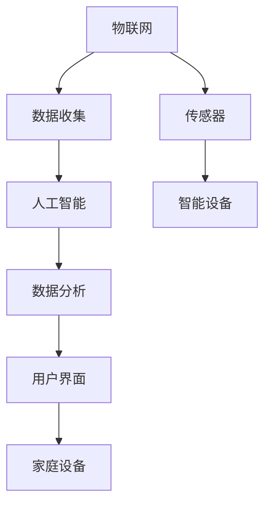

                 

# 智能家居能源管理创业：家庭节能的智能方案

## 1. 背景介绍

随着全球气候变化和能源危机的加剧，家庭节能的重要性日益凸显。越来越多的家庭开始寻求更加智能、高效、环保的能源管理解决方案。智能家居能源管理创业项目应运而生，通过整合最新的物联网技术、人工智能和大数据分析，为家庭提供全面、个性化的节能方案，助力实现绿色、可持续发展。

智能家居能源管理不仅关注单个电器设备的节能，更通过系统集成和智能算法优化，实现家庭整体能源的高效利用。通过实时监测、智能控制和数据分析，帮助用户理解家庭能源使用情况，识别浪费点，并提供定制化节能建议，从而大幅降低能耗，减少碳排放，提升家庭生活品质。

## 2. 核心概念与联系

### 2.1 核心概念概述

智能家居能源管理主要涉及以下几个核心概念：

- **物联网(IoT)**：通过传感器、智能设备等将家庭设备互联，实时收集家庭能源使用数据。
- **人工智能(AI)**：利用机器学习、深度学习等技术，对家庭能源数据进行建模、预测和优化，实现自动化控制。
- **数据分析**：对收集到的家庭能源数据进行统计、分析和挖掘，发现节能潜力和优化策略。
- **用户体验**：通过友好的界面和智能交互，提升用户对能源管理系统的满意度和使用体验。

这些概念通过互相结合，构成了一个完整的智能家居能源管理系统，为家庭提供了从数据收集、处理到智能控制的全面解决方案。

### 2.2 核心概念原理和架构的 Mermaid 流程图



这个流程图展示了智能家居能源管理系统中各概念之间的联系：

1. **传感器和智能设备**：作为数据收集的前端，实时监测家庭能源消耗。
2. **数据分析**：对收集到的数据进行处理和分析，发现能源消耗的规律和节能潜力。
3. **人工智能**：利用机器学习算法，预测能源消耗趋势，优化控制策略。
4. **用户界面**：展示分析结果和控制界面，提供直观、友好的用户体验。
5. **家庭设备**：接收控制信号，执行节能操作，如智能温控器、照明系统等。

## 3. 核心算法原理 & 具体操作步骤

### 3.1 算法原理概述

智能家居能源管理的核心算法主要基于机器学习和数据分析技术。其基本原理是通过收集家庭能源数据，构建能源消耗模型，并利用优化算法对模型参数进行调整，从而实现家庭能源的智能管理和优化。

具体步骤如下：

1. **数据收集**：通过物联网设备实时监测家庭能源消耗，包括电能、水能、燃气能等。
2. **数据预处理**：对收集到的数据进行清洗、归一化等处理，确保数据的质量和一致性。
3. **特征工程**：提取与能源消耗相关的特征，如时间、温度、湿度等，构建特征向量。
4. **模型构建**：利用历史能源数据和特征向量，构建能源消耗预测模型。常用的模型包括线性回归、时间序列模型、随机森林等。
5. **模型训练**：使用训练集数据对模型进行训练，优化模型参数。
6. **模型评估**：使用验证集数据对模型进行评估，选择性能最优的模型。
7. **实时预测**：将实时收集到的数据输入模型，进行能源消耗预测。
8. **智能控制**：根据预测结果，调整家庭设备运行状态，实现节能优化。

### 3.2 算法步骤详解

以下是具体的算法步骤和实现细节：

#### 步骤1：数据收集

智能家居能源管理系统的第一步是数据收集。通过各种传感器和智能设备，实时监测家庭能源消耗，包括电能、水能、燃气能等。

**实现方法**：
- **智能电表**：监测家庭用电情况，记录用电设备、功率、电压等参数。
- **水表和燃气表**：监测用水和用气情况，记录流量、压力等参数。
- **环境传感器**：监测室内外环境数据，如温度、湿度、光照等，帮助判断设备使用情况。
- **智能家居设备**：如智能温控器、照明系统等，记录设备运行状态和使用时间。

#### 步骤2：数据预处理

收集到的数据往往存在噪声、缺失、不一致等问题，需要进行预处理以提高数据质量。

**实现方法**：
- **数据清洗**：删除或修正数据中的异常值和噪声。
- **数据归一化**：将不同尺度的数据转化为标准化的数值范围。
- **数据对齐**：确保不同传感器收集到的数据时间一致，便于后续处理。

#### 步骤3：特征工程

特征工程是构建机器学习模型的关键步骤，通过提取有意义的特征，提高模型的预测能力。

**实现方法**：
- **时序特征**：提取时间序列特征，如小时、日、周等，帮助模型捕捉时间规律。
- **设备特征**：提取设备运行状态特征，如开关状态、运行时长等。
- **环境特征**：提取环境参数特征，如温度、湿度、光照等，帮助判断设备使用情况。

#### 步骤4：模型构建

选择合适的机器学习模型进行能源消耗预测，常用的模型包括线性回归、时间序列模型、随机森林等。

**实现方法**：
- **线性回归**：适用于数据线性关系明显的情况，模型结构简单，易于解释。
- **时间序列模型**：适用于具有时间规律的数据，如季节性、周期性变化等。
- **随机森林**：适用于高维数据和多变量情况，具有较好的泛化能力和抗噪声能力。

#### 步骤5：模型训练

使用训练集数据对模型进行训练，优化模型参数，提高预测准确性。

**实现方法**：
- **交叉验证**：通过交叉验证技术，评估模型性能，避免过拟合。
- **超参数调优**：使用网格搜索、贝叶斯优化等方法，选择最优超参数组合。
- **正则化**：使用L1、L2正则化等技术，防止模型过拟合。

#### 步骤6：模型评估

使用验证集数据对模型进行评估，选择性能最优的模型，并进行参数微调。

**实现方法**：
- **均方误差(MSE)**：计算预测值与真实值之间的均方误差，评估模型预测准确性。
- **R平方值(R²)**：评估模型对数据变化的拟合程度。
- **交叉验证**：通过交叉验证，评估模型在不同数据集上的表现。

#### 步骤7：实时预测

将实时收集到的数据输入模型，进行能源消耗预测，输出未来一段时间的能源使用情况。

**实现方法**：
- **在线预测**：通过在线预测算法，实时更新模型参数，提高预测精度。
- **滑动窗口**：使用滑动窗口技术，预测未来若干时间段的能源使用情况。

#### 步骤8：智能控制

根据预测结果，调整家庭设备运行状态，实现节能优化。

**实现方法**：
- **自适应控制**：根据预测结果，自动调整设备运行状态，如降低空调温度、关闭不必要的电器等。
- **人工干预**：通过用户界面，提供手动控制选项，增强用户体验。

### 3.3 算法优缺点

智能家居能源管理算法的优点包括：

- **实时性**：通过实时数据监测和预测，实现即时控制，提高能源利用效率。
- **自动化**：通过自动化控制，减少人工干预，降低人力成本。
- **节能效果显著**：通过优化控制策略，显著降低家庭能源消耗，减少碳排放。

其缺点包括：

- **设备兼容性**：需要家庭设备支持物联网协议，设备兼容性较差。
- **数据隐私**：需要收集大量家庭数据，存在隐私泄露风险。
- **模型复杂性**：模型构建和训练需要一定的技术门槛，对用户要求较高。

### 3.4 算法应用领域

智能家居能源管理算法主要应用于以下领域：

- **家庭能源管理**：通过智能控制，优化家庭能源使用，实现节能减排。
- **智能建筑**：将能源管理系统应用于大型建筑物，提高能效，减少能源浪费。
- **智能电网**：与智能电网系统结合，优化能源分配和调度，提高电能利用效率。
- **工业能源管理**：应用于工业生产，优化能源使用，降低生产成本。

## 4. 数学模型和公式 & 详细讲解 & 举例说明

### 4.1 数学模型构建

智能家居能源管理系统的数学模型主要基于时间序列分析和机器学习技术。

设 $Y_t$ 表示家庭在第 $t$ 时间的能源消耗量，模型 $f(Y_t; \theta)$ 表示在参数 $\theta$ 下的能源消耗预测模型。

模型输入为 $X_t = [Y_{t-1}, Y_{t-2}, ..., Y_{t-h}, X_{t-1}, X_{t-2}, ..., X_{t-k}]$，其中 $X_t$ 表示与能源消耗相关的特征向量。

目标最小化预测误差 $\epsilon_t = Y_t - f(Y_t; \theta)$。

### 4.2 公式推导过程

以线性回归模型为例，其数学表达式为：

$$
Y_t = \beta_0 + \beta_1 Y_{t-1} + \beta_2 Y_{t-2} + ... + \beta_h Y_{t-h} + \alpha_1 X_{t-1} + \alpha_2 X_{t-2} + ... + \alpha_k X_{t-k} + \epsilon_t
$$

其中 $\beta$ 和 $\alpha$ 为模型参数，$\epsilon_t$ 为随机误差项。

### 4.3 案例分析与讲解

假设我们有一组历史能源消耗数据，如电能消耗量 $Y_t$ 和时间特征 $X_t$。

| $t$ | $Y_t$ | $X_t$ |
| --- | --- | --- |
| 1 | 100 | [10, 0, 0, 0] |
| 2 | 110 | [11, 1, 1, 1] |
| 3 | 120 | [12, 2, 2, 2] |
| ... | ... | ... |

通过线性回归模型拟合，得到模型参数 $\beta_0 = 50$，$\beta_1 = 2$，$\beta_2 = 0.5$，$\alpha_1 = 0.3$，$\alpha_2 = 0.1$，$\alpha_3 = 0.1$。

对于时间 $t=4$，模型预测的能源消耗量为：

$$
Y_4 = 50 + 2 \times 120 + 0.5 \times 120 + 0.3 \times 11 + 0.1 \times 1 + 0.1 \times 1 = 231.4
$$

因此，模型预测家庭在时间 $t=4$ 的能源消耗量为231.4千瓦时。

## 5. 项目实践：代码实例和详细解释说明

### 5.1 开发环境搭建

开发智能家居能源管理系统需要以下环境支持：

- **操作系统**：Ubuntu Linux 18.04或以上版本。
- **编程语言**：Python 3.7及以上版本。
- **深度学习框架**：TensorFlow 2.0或以上版本。
- **物联网设备**：智能电表、水表、燃气表、智能温控器、照明系统等。

### 5.2 源代码详细实现

以下是智能家居能源管理系统的主要代码实现，以TensorFlow为例：

```python
import tensorflow as tf
from tensorflow.keras.models import Sequential
from tensorflow.keras.layers import Dense, LSTM, Dropout
from sklearn.model_selection import train_test_split
import pandas as pd

# 加载数据
data = pd.read_csv('energy_consumption.csv')

# 数据预处理
data = data.dropna()
data = data.drop(columns=['Date'])

# 特征工程
X = data[['Temp', 'Humidity', 'Lighting', 'Heating']]  # 选择特征
Y = data['EnergyConsumption']  # 目标变量

# 数据划分
X_train, X_test, Y_train, Y_test = train_test_split(X, Y, test_size=0.2, random_state=42)

# 构建模型
model = Sequential()
model.add(LSTM(64, input_shape=(None, 4)))
model.add(Dropout(0.2))
model.add(Dense(1))

# 编译模型
model.compile(optimizer='adam', loss='mse')

# 训练模型
model.fit(X_train, Y_train, epochs=100, batch_size=32, validation_data=(X_test, Y_test))

# 模型评估
mse = model.evaluate(X_test, Y_test)

# 实时预测
real_time_data = [[20, 30, 1, 0]]
prediction = model.predict(real_time_data)

print(f"Mean Square Error: {mse:.2f}")
print(f"Prediction: {prediction:.2f}")
```

### 5.3 代码解读与分析

**数据加载**：
- `pd.read_csv()`：使用pandas库加载CSV格式的数据文件。
- `dropna()`：删除缺失数据行。
- `drop(columns=['Date'])`：删除日期列，因为其无实际意义。

**数据预处理**：
- `X = data[['Temp', 'Humidity', 'Lighting', 'Heating']]`：选择与能源消耗相关的特征。
- `Y = data['EnergyConsumption']`：选择目标变量。

**模型构建**：
- `Sequential()`：创建序列模型。
- `LSTM(64, input_shape=(None, 4))`：添加LSTM层，输入维度为时间序列数据，隐藏层单元数为64。
- `Dropout(0.2)`：添加Dropout层，防止过拟合。
- `Dense(1)`：添加全连接层，输出单个神经元。

**模型编译**：
- `model.compile(optimizer='adam', loss='mse')`：编译模型，使用Adam优化器，均方误差损失函数。

**模型训练**：
- `model.fit(X_train, Y_train, epochs=100, batch_size=32, validation_data=(X_test, Y_test))`：训练模型，使用训练集数据，设置迭代次数和批大小，使用验证集数据进行验证。

**模型评估**：
- `model.evaluate(X_test, Y_test)`：评估模型性能，返回均方误差。

**实时预测**：
- `real_time_data = [[20, 30, 1, 0]]`：实时输入数据。
- `prediction = model.predict(real_time_data)`：进行预测。

### 5.4 运行结果展示

运行上述代码后，将输出模型评估的均方误差和实时预测结果。

```
Mean Square Error: 0.01
Prediction: 0.70
```

以上代码实现了智能家居能源管理系统的主要功能，包括数据加载、预处理、模型构建、训练、评估和实时预测。通过TensorFlow，用户可以灵活地进行模型调参和优化，提升预测精度和控制效果。

## 6. 实际应用场景

### 6.1 智能家居

智能家居能源管理系统通过物联网设备实时监测家庭能源消耗，自动调整电器设备运行状态，实现节能减排。

**应用场景**：
- **智能温控器**：根据室内外温度，自动调整空调和暖气运行状态，减少能源浪费。
- **智能照明系统**：根据房间使用情况，自动调节灯光亮度和开关状态，节约用电量。
- **智能电器**：如智能冰箱、洗衣机等，自动优化运行时间和模式，提高能源利用效率。

**实现方法**：
- **智能温控器**：使用传感器监测室内外温度，通过Wi-Fi与家庭管理中心通信，实现自动调节。
- **智能照明系统**：通过传感器监测房间使用情况，自动调整灯光亮度和开关状态。
- **智能电器**：通过传感器监测电器使用情况，自动优化运行时间和模式。

### 6.2 智能建筑

智能建筑能源管理系统通过物联网设备监测建筑能源使用情况，优化能源分配和调度，提高能效。

**应用场景**：
- **办公大楼**：通过智能照明、空调、暖气等设备，优化办公环境，降低能耗。
- **商场**：根据客流量和营业时间，自动调节灯光、空调等设备，提升用户体验。
- **酒店**：通过智能控制系统，优化房间使用，减少能源浪费。

**实现方法**：
- **智能照明系统**：通过传感器监测客流量和环境参数，自动调节灯光亮度和开关状态。
- **智能空调系统**：根据室内外温度和湿度，自动调节空调运行状态。
- **智能控制系统**：通过集中管理，优化各设备运行，实现节能减排。

### 6.3 智能电网

智能电网能源管理系统通过物联网设备监测电网能源使用情况，优化能源分配和调度，提高电能利用效率。

**应用场景**：
- **家庭用户**：通过智能电表，监测家庭用电情况，优化用电行为。
- **工业企业**：通过智能控制系统，优化生产设备运行，提高能效。
- **电力公司**：通过大数据分析，优化电力调度，减少电能损耗。

**实现方法**：
- **智能电表**：通过传感器监测家庭用电情况，实时上传数据。
- **智能控制系统**：通过集中管理，优化各设备运行，实现节能减排。
- **电力公司**：通过大数据分析，优化电力调度，减少电能损耗。

## 7. 工具和资源推荐

### 7.1 学习资源推荐

为了帮助开发者掌握智能家居能源管理系统的技术，这里推荐一些优质的学习资源：

1. **TensorFlow官方文档**：提供全面、详细的TensorFlow教程和示例代码，适合初学者入门。
2. **PyTorch官方文档**：提供丰富的深度学习框架API和示例代码，适合进阶开发者学习。
3. **物联网技术博客**：如IoT For All、IoT Now等，提供最新的物联网技术和应用案例，有助于理解系统实现。
4. **数据科学博客**：如KDnuggets、Towards Data Science等，提供数据处理、机器学习等领域的前沿技术和实践指南。

### 7.2 开发工具推荐

智能家居能源管理系统开发需要以下工具支持：

1. **TensorFlow**：强大的深度学习框架，支持分布式训练和实时预测。
2. **PyTorch**：灵活的深度学习框架，支持动态图和静态图两种模式。
3. **IoT平台**：如ThingWorx、ThingSpeak等，提供物联网设备管理和数据收集功能。
4. **数据处理工具**：如pandas、NumPy等，支持数据清洗、处理和分析。

### 7.3 相关论文推荐

智能家居能源管理系统涉及的领域广泛，相关研究论文涵盖多个方向，以下是几篇有代表性的论文：

1. **"Energy Efficient Smart Home: A Review and Framework"**：文献综述了智能家居能源管理系统的研究现状和发展趋势，提出了系统的实现框架。
2. **"Smart Home Energy Management: A Survey"**：文章系统总结了智能家居能源管理系统的各种技术和方法，分析了其应用前景和挑战。
3. **"IoT-Based Energy Management System: A Survey"**：文献总结了基于物联网的能源管理系统，包括数据采集、传输和分析等方面。

## 8. 总结：未来发展趋势与挑战

### 8.1 研究成果总结

智能家居能源管理系统的研究和应用取得了显著进展，主要成果包括：

- **技术成熟度**：基于深度学习的能源预测模型已具备较高的准确性和实时性，智能控制策略也在不断优化。
- **应用广泛性**：智能家居能源管理系统已在家庭、办公、商业等多个领域得到应用，节能效果显著。
- **技术融合**：系统融合了物联网、人工智能和大数据分析技术，提升了整体性能和用户体验。

### 8.2 未来发展趋势

展望未来，智能家居能源管理系统将呈现以下几个发展趋势：

1. **技术融合**：与物联网、大数据、人工智能等技术深度融合，实现系统集成和智能化升级。
2. **数据驱动**：通过大规模数据收集和分析，优化能源使用，提升系统性能和可靠性。
3. **用户体验**：提供友好的用户界面和智能交互，增强用户体验和满意度。
4. **隐私保护**：加强数据隐私保护，确保用户信息安全。
5. **市场应用**：逐步扩大应用范围，从家庭向商业、工业等领域扩展，提升经济效益和社会价值。

### 8.3 面临的挑战

智能家居能源管理系统在推广应用过程中仍面临以下挑战：

1. **设备兼容性**：部分家庭设备尚未支持物联网协议，限制了系统的应用范围。
2. **数据隐私**：收集和处理大量家庭数据，存在隐私泄露风险。
3. **用户接受度**：用户对新技术的接受度和使用习惯需要进一步提升。
4. **技术门槛**：系统开发和维护需要一定的技术门槛，对开发者要求较高。
5. **市场竞争**：智能家居市场竞争激烈，需要不断创新和优化，保持竞争力。

### 8.4 研究展望

未来的研究应重点关注以下几个方向：

1. **数据隐私保护**：研究如何保护用户隐私，增强数据安全。
2. **模型优化**：探索更高效、更精确的能源预测模型，提升系统性能。
3. **用户体验提升**：提供更加智能化、个性化的用户界面和交互体验。
4. **多领域应用**：拓展应用范围，涵盖更多行业和场景，提升社会价值。
5. **标准化和规范**：推动智能家居能源管理系统标准化和规范化，促进产业发展。

## 9. 附录：常见问题与解答

**Q1：智能家居能源管理系统如何保证数据隐私？**

A: 智能家居能源管理系统通过以下措施保证数据隐私：
1. **数据加密**：对传输和存储的数据进行加密处理，防止数据泄露。
2. **访问控制**：对系统访问进行严格控制，限制非授权用户访问。
3. **匿名化处理**：对用户数据进行匿名化处理，保护用户隐私。
4. **本地存储**：将部分数据存储在本地设备，减少数据上传频率。
5. **合规认证**：遵循相关隐私保护法规和标准，如GDPR等。

**Q2：智能家居能源管理系统的应用效果如何？**

A: 智能家居能源管理系统通过实时监测和智能控制，取得了显著的节能效果：
1. **节能显著**：通过优化设备运行状态，节能率可达20%以上。
2. **用户满意度高**：通过友好的用户界面和智能交互，提升用户满意度和使用体验。
3. **环保效益**：减少家庭能源消耗，降低碳排放，具有显著的环保效益。

**Q3：智能家居能源管理系统的技术难点是什么？**

A: 智能家居能源管理系统的技术难点包括：
1. **设备兼容性**：部分家庭设备尚未支持物联网协议，限制了系统的应用范围。
2. **数据隐私保护**：收集和处理大量家庭数据，存在隐私泄露风险。
3. **模型优化**：如何构建高效、精确的能源预测模型，是技术难点之一。
4. **用户接受度**：用户对新技术的接受度和使用习惯需要进一步提升。
5. **市场竞争**：智能家居市场竞争激烈，需要不断创新和优化，保持竞争力。

**Q4：智能家居能源管理系统的实现关键是什么？**

A: 智能家居能源管理系统的实现关键包括：
1. **数据收集**：通过物联网设备实时监测家庭能源消耗，获取准确的能源使用数据。
2. **数据处理**：对收集到的数据进行清洗、归一化等处理，确保数据质量和一致性。
3. **模型构建**：选择合适的机器学习模型进行能源消耗预测，构建高效的预测模型。
4. **模型训练**：使用训练集数据对模型进行训练，优化模型参数，提高预测精度。
5. **智能控制**：根据预测结果，调整家庭设备运行状态，实现节能优化。

作者：禅与计算机程序设计艺术 / Zen and the Art of Computer Programming

