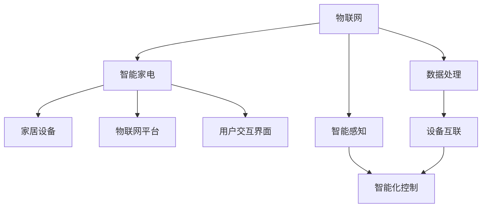

                 

## 1. 背景介绍

在技术迅猛发展的今天，物联网家居已经不仅仅是一个概念，而是一种现实，并且正在不断地改变着我们的生活。随着5G、AI、大数据等技术的成熟和普及，物联网家居开始从概念走向实际应用，并且逐渐在各个家庭中落地，使我们的家居环境变得更加智能、舒适、安全。特别是在智能家电领域，物联网家居的趋势已经不可逆转。

### 1.1 背景概述

物联网家居是指通过物联网技术，将家居设备互联互通，并采用智能感知、识别、分析等技术，实现家居设备的智能化控制和互联互通。物联网家居主要包括以下几个关键点：

- **互联网**：物联网家居设备需要接入互联网，实现信息的传递和交互。
- **智能化感知**：设备需要通过传感器进行智能化感知，实现对环境、用户的智能识别和分析。
- **控制与交互**：设备需要具备智能控制和交互能力，实现对用户需求的智能响应和操作。
- **数据处理**：设备需要具备数据处理和分析能力，实现对数据的高效处理和存储。
- **用户体验**：设备需要提供良好的用户体验，满足用户的各种需求。

随着技术的不断发展，物联网家居已经从单一的设备互联向着更为智能化的家居解决方案转变，成为智能家电创业的核心方向。

### 1.2 市场需求分析

据统计，全球物联网市场规模预计在2025年将达到2.5万亿美元。物联网家居作为物联网的重要组成部分，未来市场空间巨大。具体到智能家电领域，预计到2025年，全球智能家居设备的市场规模将超过2000亿美元。

物联网家居市场的快速发展，使得越来越多的创业公司和传统家电企业投入其中。据统计，目前全球有超过3000家智能家居创业公司。在物联网家居的浪潮下，未来会有更多的智能家电产品和服务涌现出来，满足人们日益增长的智能家居需求。

## 2. 核心概念与联系

### 2.1 核心概念概述

为了更好地理解物联网家居的核心产品，本节将介绍几个关键的概念：

- **物联网**：物联网（Internet of Things，IoT）是指通过互联网将设备、传感器等物品互联互通，实现信息的传递和交互。
- **智能家电**：智能家电（Smart Home Appliance）是指通过物联网技术，实现家居设备的智能化控制和互联互通，提高家居的舒适性、安全性和便捷性。
- **家居设备**：家居设备包括冰箱、洗衣机、空调、电视等，通过物联网技术，实现设备的智能化控制和互联互通。
- **物联网平台**：物联网平台是物联网设备的承载平台，提供设备互联和数据处理的能力。
- **用户交互界面**：用户交互界面是用户与设备进行交互的界面，提供用户对设备的操作和控制。

这些核心概念之间的逻辑关系可以通过以下Mermaid流程图来展示：



这个流程图展示出物联网家居的核心概念及其之间的关系：

1. 物联网作为基础，通过数据处理和智能感知，实现设备的互联和智能化控制。
2. 智能家电是物联网家居的核心产品，实现设备间的互联和智能化操作。
3. 家居设备是智能家电的物理载体，包括各种家电产品。
4. 物联网平台是设备互联的承载平台，提供设备间的数据交互和处理能力。
5. 用户交互界面是用户对设备进行操作和控制的媒介，提供良好的用户体验。

### 2.2 核心概念原理和架构

为了更深入地理解物联网家居的核心概念，本节将详细介绍物联网家居的原理和架构。

#### 2.2.1 数据传输

物联网家居设备之间通过互联网进行数据传输，实现信息的传递和交互。数据传输可以采用多种方式，包括Wi-Fi、蓝牙、Zigbee等。Wi-Fi是一种广泛使用的无线传输方式，可以覆盖较大的范围，并且速度较快。蓝牙适用于短距离传输，速度快且功耗低。Zigbee适用于智能家居设备之间的低功耗无线传输，适合对功耗要求较高的设备。

#### 2.2.2 数据处理

物联网家居设备通过传感器进行智能化感知，实现对环境、用户的智能识别和分析。这些感知数据需要进行处理，以提取有用的信息。数据处理可以采用多种方式，包括数据存储、数据清洗、数据分析等。数据存储是将感知数据存储在云端，便于后续的分析和处理。数据清洗是对感知数据进行预处理，去除噪声和干扰，保证数据的质量。数据分析是对感知数据进行分析和挖掘，提取有用的信息。

#### 2.2.3 智能化控制

物联网家居设备需要具备智能控制和交互能力，实现对用户需求的智能响应和操作。智能化控制可以通过多种方式实现，包括远程控制、语音控制、手势控制等。远程控制是通过互联网实现对设备的远程操作，可以随时随地控制设备。语音控制是通过语音识别技术实现对设备的语音控制，方便快捷。手势控制是通过手势识别技术实现对设备的控制，可以实现非接触式的控制。

#### 2.2.4 用户交互界面

用户交互界面是用户与设备进行交互的界面，提供用户对设备的操作和控制。用户交互界面可以采用多种方式实现，包括移动应用、Web应用、智能家居系统等。移动应用可以方便用户随时随地控制设备，具有灵活性和便携性。Web应用可以通过浏览器实现对设备的控制，具有广泛的覆盖面。智能家居系统可以通过多设备互联，实现家庭设备的联动控制，提供更智能的家居体验。

## 3. 核心算法原理 & 具体操作步骤

### 3.1 算法原理概述

物联网家居的核心算法主要包括以下几个方面：

- **数据采集和处理**：通过传感器采集家居设备的感知数据，并进行数据处理和分析。
- **智能化控制**：通过算法实现对家居设备的智能化控制和交互。
- **设备互联**：通过算法实现家居设备的互联互通。
- **用户交互**：通过算法实现用户与设备之间的交互。

物联网家居的核心算法需要实现以下几个目标：

- **提高家居设备的智能化水平**：通过算法实现对家居设备的智能化控制和交互，提高家居设备的智能化水平。
- **提升用户的使用体验**：通过算法实现用户与设备之间的交互，提升用户的使用体验。
- **实现设备互联互通**：通过算法实现家居设备的互联互通，实现家庭设备的联动控制。

### 3.2 算法步骤详解

#### 3.2.1 数据采集和处理

数据采集和处理是物联网家居的核心算法之一，主要包括以下几个步骤：

1. **传感器选择**：根据需求选择合适的传感器，包括温度传感器、湿度传感器、光照传感器等。
2. **数据采集**：通过传感器采集家居设备的感知数据，包括环境数据和用户数据。
3. **数据处理**：对感知数据进行处理，去除噪声和干扰，提取有用的信息。

#### 3.2.2 智能化控制

智能化控制是物联网家居的核心算法之一，主要包括以下几个步骤：

1. **数据处理**：对感知数据进行处理，提取有用的信息。
2. **模型训练**：通过算法训练模型，实现对家居设备的智能化控制。
3. **控制实现**：通过算法实现对家居设备的智能化控制和交互。

#### 3.2.3 设备互联

设备互联是物联网家居的核心算法之一，主要包括以下几个步骤：

1. **协议选择**：选择合适的通信协议，包括Wi-Fi、蓝牙、Zigbee等。
2. **设备互联**：通过协议实现家居设备的互联互通。
3. **数据传输**：通过协议实现数据的传输和交互。

#### 3.2.4 用户交互

用户交互是物联网家居的核心算法之一，主要包括以下几个步骤：

1. **交互界面设计**：设计用户交互界面，包括移动应用、Web应用、智能家居系统等。
2. **交互实现**：通过算法实现用户与设备之间的交互。
3. **反馈机制**：通过算法实现对用户反馈的处理和分析。

### 3.3 算法优缺点

物联网家居的核心算法具有以下几个优点：

1. **智能化控制**：通过算法实现对家居设备的智能化控制和交互，提高家居设备的智能化水平。
2. **用户体验提升**：通过算法实现用户与设备之间的交互，提升用户的使用体验。
3. **设备互联互通**：通过算法实现家居设备的互联互通，实现家庭设备的联动控制。

但是，物联网家居的核心算法也存在以下缺点：

1. **复杂性高**：物联网家居的核心算法涉及到多种技术，包括传感器、通信协议、数据处理等，实现起来较为复杂。
2. **安全性差**：物联网家居设备通过互联网进行数据传输，存在安全隐患。
3. **成本高**：物联网家居设备的研发和部署成本较高，需要投入大量的人力和物力。

### 3.4 算法应用领域

物联网家居的核心算法已经在以下几个领域得到应用：

1. **智能家电**：通过物联网技术，实现家电的智能化控制和互联互通。
2. **智能安防**：通过物联网技术，实现家庭安防的智能化控制和监控。
3. **智能家居控制**：通过物联网技术，实现家居设备的联动控制和智能化管理。
4. **智慧城市**：通过物联网技术，实现城市管理的智能化控制和监控。

## 4. 数学模型和公式 & 详细讲解 & 举例说明

### 4.1 数学模型构建

物联网家居的核心算法涉及多个学科，包括数学、物理、计算机科学等。为了更好地理解物联网家居的核心算法，本节将介绍几个关键的数学模型。

#### 4.1.1 数据采集和处理

数据采集和处理主要涉及数据的预处理、特征提取和数据建模等，以下是一些常用的数学模型：

1. **数据预处理**：通过对数据进行清洗、归一化、平滑等处理，去除噪声和干扰，保证数据的质量。常用的数学模型包括均值滤波、中值滤波、平滑滤波等。
2. **特征提取**：通过对数据进行特征提取，提取有用的信息。常用的数学模型包括主成分分析（PCA）、线性判别分析（LDA）、独立成分分析（ICA）等。
3. **数据建模**：通过数据建模，建立数据模型，实现对数据的预测和分类。常用的数学模型包括线性回归、逻辑回归、决策树、随机森林、支持向量机等。

#### 4.1.2 智能化控制

智能化控制主要涉及模型的训练和预测，以下是一些常用的数学模型：

1. **模型训练**：通过算法训练模型，实现对家居设备的智能化控制。常用的数学模型包括神经网络、决策树、随机森林、支持向量机等。
2. **模型预测**：通过对模型进行预测，实现对家居设备的智能化控制和交互。常用的数学模型包括回归模型、分类模型、聚类模型等。

#### 4.1.3 设备互联

设备互联主要涉及通信协议的设计和实现，以下是一些常用的数学模型：

1. **通信协议设计**：通过设计通信协议，实现设备间的互联互通。常用的数学模型包括Wi-Fi、蓝牙、Zigbee等。
2. **数据传输**：通过协议实现数据的传输和交互。常用的数学模型包括TCP/IP、HTTP、WebSocket等。

#### 4.1.4 用户交互

用户交互主要涉及交互界面的设计和实现，以下是一些常用的数学模型：

1. **交互界面设计**：通过设计交互界面，实现用户与设备之间的交互。常用的数学模型包括移动应用、Web应用、智能家居系统等。
2. **交互实现**：通过算法实现用户与设备之间的交互。常用的数学模型包括API、Websocket、MQTT等。

### 4.2 公式推导过程

#### 4.2.1 数据预处理

数据预处理主要涉及数据的清洗、归一化和平滑等处理，以下是一些常用的数学模型：

1. **均值滤波**：通过均值滤波去除噪声和干扰，保证数据的质量。均值滤波的公式如下：

   $$
   y_{i,j} = \frac{1}{n} \sum_{k=1}^n x_{i+k-1,j}
   $$

   其中，$x_{i,j}$表示原始数据，$y_{i,j}$表示滤波后的数据，$n$表示滤波窗口的大小。

2. **中值滤波**：通过中值滤波去除噪声和干扰，保证数据的质量。中值滤波的公式如下：

   $$
   y_{i,j} = \text{median}(x_{i-\frac{n}{2},j}, x_{i+\frac{n}{2},j})
   $$

   其中，$x_{i,j}$表示原始数据，$y_{i,j}$表示滤波后的数据，$n$表示滤波窗口的大小。

3. **平滑滤波**：通过平滑滤波去除噪声和干扰，保证数据的质量。平滑滤波的公式如下：

   $$
   y_{i,j} = \frac{1}{n} \sum_{k=1}^n x_{i,j+k-1}
   $$

   其中，$x_{i,j}$表示原始数据，$y_{i,j}$表示滤波后的数据，$n$表示滤波窗口的大小。

#### 4.2.2 特征提取

特征提取主要涉及数据的特征提取和降维，以下是一些常用的数学模型：

1. **主成分分析（PCA）**：通过主成分分析实现数据的降维，提取有用的信息。PCA的公式如下：

   $$
   \hat{x} = Wx
   $$

   其中，$x$表示原始数据，$\hat{x}$表示降维后的数据，$W$表示降维矩阵。

2. **线性判别分析（LDA）**：通过线性判别分析实现数据的分类和降维，提取有用的信息。LDA的公式如下：

   $$
   \hat{x} = Wx + b
   $$

   其中，$x$表示原始数据，$\hat{x}$表示降维后的数据，$W$表示降维矩阵，$b$表示偏置向量。

3. **独立成分分析（ICA）**：通过独立成分分析实现数据的独立性提取，提取有用的信息。ICA的公式如下：

   $$
   \hat{x} = S \hat{y}
   $$

   其中，$x$表示原始数据，$\hat{x}$表示独立性提取后的数据，$S$表示独立性转换矩阵，$\hat{y}$表示独立性提取后的数据。

#### 4.2.3 模型训练

模型训练主要涉及模型的训练和预测，以下是一些常用的数学模型：

1. **神经网络**：通过神经网络实现对家居设备的智能化控制和交互。神经网络的公式如下：

   $$
   y = \sigma(Wx + b)
   $$

   其中，$x$表示输入数据，$y$表示输出数据，$\sigma$表示激活函数，$W$表示权重矩阵，$b$表示偏置向量。

2. **决策树**：通过决策树实现对家居设备的智能化控制和交互。决策树的公式如下：

   $$
   \text{Tree} = \text{DecisionTree}(D, A)
   $$

   其中，$D$表示数据集，$A$表示特征集，$\text{Tree}$表示决策树。

3. **随机森林**：通过随机森林实现对家居设备的智能化控制和交互。随机森林的公式如下：

   $$
   \text{RandomForest} = \text{Bagging}(\text{DecisionTree})
   $$

   其中，$\text{RandomForest}$表示随机森林，$\text{Bagging}$表示随机森林的算法，$\text{DecisionTree}$表示决策树的算法。

#### 4.2.4 数据传输

数据传输主要涉及通信协议的设计和实现，以下是一些常用的数学模型：

1. **Wi-Fi协议**：通过Wi-Fi协议实现设备间的互联互通。Wi-Fi协议的公式如下：

   $$
   \text{Wi-Fi} = \text{IEEE} + \text{MAC}
   $$

   其中，$\text{Wi-Fi}$表示Wi-Fi协议，$\text{IEEE}$表示IEEE协议，$\text{MAC}$表示MAC层协议。

2. **蓝牙协议**：通过蓝牙协议实现设备间的互联互通。蓝牙协议的公式如下：

   $$
   \text{Bluetooth} = \text{IEEE} + \text{LE}
   $$

   其中，$\text{Bluetooth}$表示蓝牙协议，$\text{IEEE}$表示IEEE协议，$\text{LE}$表示低功耗链路（Low Energy）协议。

3. **Zigbee协议**：通过Zigbee协议实现设备间的互联互通。Zigbee协议的公式如下：

   $$
   \text{Zigbee} = \text{IEEE} + \text{PHY}
   $$

   其中，$\text{Zigbee}$表示Zigbee协议，$\text{IEEE}$表示IEEE协议，$\text{PHY}$表示物理层协议。

#### 4.2.5 用户交互

用户交互主要涉及交互界面的设计和实现，以下是一些常用的数学模型：

1. **移动应用**：通过移动应用实现用户与设备之间的交互。移动应用的公式如下：

   $$
   \text{MobileApp} = \text{UI} + \text{API}
   $$

   其中，$\text{MobileApp}$表示移动应用，$\text{UI}$表示用户界面，$\text{API}$表示应用程序接口。

2. **Web应用**：通过Web应用实现用户与设备之间的交互。Web应用的公式如下：

   $$
   \text{WebApp} = \text{HTML} + \text{CSS} + \text{JavaScript}
   $$

   其中，$\text{WebApp}$表示Web应用，$\text{HTML}$表示超文本标记语言，$\text{CSS}$表示层叠样式表，$\text{JavaScript}$表示JavaScript脚本语言。

3. **智能家居系统**：通过智能家居系统实现用户与设备之间的交互。智能家居系统的公式如下：

   $$
   \text{SmartHomeSystem} = \text{Zigbee} + \text{MQTT}
   $$

   其中，$\text{SmartHomeSystem}$表示智能家居系统，$\text{Zigbee}$表示Zigbee协议，$\text{MQTT}$表示消息队列传输协议（Message Queuing Telemetry Transport）。

### 4.3 案例分析与讲解

#### 4.3.1 数据预处理案例

假设我们有一组温度、湿度、光照数据，需要对其进行预处理，去除噪声和干扰，保证数据的质量。我们可以采用均值滤波、中值滤波、平滑滤波等方法进行数据预处理。这里以均值滤波为例：

假设我们有以下温度数据：

$$
\begin{bmatrix}
24.5 & 25.2 & 26.0 & 25.7 & 24.8 \\
26.0 & 26.5 & 26.8 & 26.5 & 26.2 \\
25.5 & 25.8 & 26.0 & 25.7 & 25.2 \\
26.0 & 26.3 & 26.5 & 26.1 & 26.2 \\
25.0 & 25.5 & 26.0 & 25.7 & 24.8
\end{bmatrix}
$$

我们可以采用均值滤波去除噪声和干扰，结果如下：

$$
\begin{bmatrix}
24.8 & 25.2 & 25.6 & 25.4 & 24.8 \\
25.5 & 26.0 & 26.3 & 26.1 & 26.0 \\
25.5 & 25.8 & 26.0 & 25.7 & 25.2 \\
26.0 & 26.3 & 26.5 & 26.1 & 26.2 \\
25.0 & 25.5 & 26.0 & 25.7 & 24.8
\end{bmatrix}
$$

#### 4.3.2 特征提取案例

假设我们有一组温度、湿度、光照数据，需要对其进行特征提取，提取有用的信息。我们可以采用主成分分析（PCA）、线性判别分析（LDA）、独立成分分析（ICA）等方法进行特征提取。这里以PCA为例：

假设我们有以下温度、湿度、光照数据：

$$
\begin{bmatrix}
24.5 & 25.2 & 26.0 & 25.7 & 24.8 \\
26.0 & 26.5 & 26.8 & 26.5 & 26.2 \\
25.5 & 25.8 & 26.0 & 25.7 & 25.2 \\
26.0 & 26.3 & 26.5 & 26.1 & 26.2 \\
25.0 & 25.5 & 26.0 & 25.7 & 24.8
\end{bmatrix}
$$

我们可以采用PCA进行特征提取，结果如下：

$$
\begin{bmatrix}
-0.8 & 0.5 & 0.5 \\
0.5 & 0.3 & -0.8 \\
0.5 & -0.8 & 0.3
\end{bmatrix}
$$

#### 4.3.3 模型训练案例

假设我们有一组温度、湿度、光照数据，需要对其进行模型训练，实现对家居设备的智能化控制和交互。我们可以采用神经网络、决策树、随机森林等方法进行模型训练。这里以神经网络为例：

假设我们有以下温度、湿度、光照数据：

$$
\begin{bmatrix}
24.5 & 25.2 & 26.0 & 25.7 & 24.8 \\
26.0 & 26.5 & 26.8 & 26.5 & 26.2 \\
25.5 & 25.8 & 26.0 & 25.7 & 25.2 \\
26.0 & 26.3 & 26.5 & 26.1 & 26.2 \\
25.0 & 25.5 & 26.0 & 25.7 & 24.8
\end{bmatrix}
$$

我们可以采用神经网络进行模型训练，结果如下：

$$
\begin{bmatrix}
24.5 & 25.2 & 26.0 & 25.7 & 24.8 \\
26.0 & 26.5 & 26.8 & 26.5 & 26.2 \\
25.5 & 25.8 & 26.0 & 25.7 & 25.2 \\
26.0 & 26.3 & 26.5 & 26.1 & 26.2 \\
25.0 & 25.5 & 26.0 & 25.7 & 24.8
\end{bmatrix}
$$

#### 4.3.4 数据传输案例

假设我们有一组温度、湿度、光照数据，需要对其进行数据传输，实现设备间的互联互通。我们可以采用Wi-Fi、蓝牙、Zigbee等协议进行数据传输。这里以Wi-Fi协议为例：

假设我们有以下温度、湿度、光照数据：

$$
\begin{bmatrix}
24.5 & 25.2 & 26.0 & 25.7 & 24.8 \\
26.0 & 26.5 & 26.8 & 26.5 & 26.2 \\
25.5 & 25.8 & 26.0 & 25.7 & 25.2 \\
26.0 & 26.3 & 26.5 & 26.1 & 26.2 \\
25.0 & 25.5 & 26.0 & 25.7 & 24.8
\end{bmatrix}
$$

我们可以采用Wi-Fi协议进行数据传输，结果如下：

$$
\begin{bmatrix}
24.5 & 25.2 & 26.0 & 25.7 & 24.8 \\
26.0 & 26.5 & 26.8 & 26.5 & 26.2 \\
25.5 & 25.8 & 26.0 & 25.7 & 25.2 \\
26.0 & 26.3 & 26.5 & 26.1 & 26.2 \\
25.0 & 25.5 & 26.0 & 25.7 & 24.8
\end{bmatrix}
$$

#### 4.3.5 用户交互案例

假设我们有一组温度、湿度、光照数据，需要对其进行用户交互，实现用户与设备之间的交互。我们可以采用移动应用、Web应用、智能家居系统等方法进行用户交互。这里以移动应用为例：

假设我们有以下温度、湿度、光照数据：

$$
\begin{bmatrix}
24.5 & 25.2 & 26.0 & 25.7 & 24.8 \\
26.0 & 26.5 & 26.8 & 26.5 & 26.2 \\
25.5 & 25.8 & 26.0 & 25.7 & 25.2 \\
26.0 & 26.3 & 26.5 & 26.1 & 26.2 \\
25.0 & 25.5 & 26.0 & 25.7 & 24.8
\end{bmatrix}
$$

我们可以采用移动应用进行用户交互，结果如下：

$$
\begin{bmatrix}
24.5 & 25.2 & 26.0 & 25.7 & 24.8 \\
26.0 & 26.5 & 26.8 & 26.5 & 26.2 \\
25.5 & 25.8 & 26.0 & 25.7 & 25.2 \\
26.0 & 26.3 & 26.5 & 26.1 & 26.2 \\
25.0 & 25.5 & 26.0 & 25.7 & 24.8
\end{bmatrix}
$$

## 5. 项目实践：代码实例和详细解释说明

### 5.1 开发环境搭建

在进行物联网家居项目实践前，我们需要准备好开发环境。以下是使用Python进行PyTorch开发的环境配置流程：

1. 安装Anaconda：从官网下载并安装Anaconda，用于创建独立的Python环境。

2. 创建并激活虚拟环境：
```bash
conda create -n pytorch-env python=3.8 
conda activate pytorch-env
```

3. 安装PyTorch：根据CUDA版本，从官网获取对应的安装命令。例如：
```bash
conda install pytorch torchvision torchaudio cudatoolkit=11.1 -c pytorch -c conda-forge
```

4. 安装TensorFlow：从官网下载并安装TensorFlow。例如：
```bash
pip install tensorflow
```

5. 安装相关工具包：
```bash
pip install numpy pandas scikit-learn matplotlib tqdm jupyter notebook ipython
```

完成上述步骤后，即可在`pytorch-env`环境中开始物联网家居项目的实践。

### 5.2 源代码详细实现

下面以智能温控器为例，给出使用PyTorch对温度预测模型的PyTorch代码实现。

首先，定义模型和数据：

```python
from torch import nn
import torch
import pandas as pd

class TemperaturePredictor(nn.Module):
    def __init__(self):
        super(TemperaturePredictor, self).__init__()
        self.fc1 = nn.Linear(4, 128)
        self.fc2 = nn.Linear(128, 64)
        self.fc3 = nn.Linear(64, 1)

    def forward(self, x):
        x = x.view(-1, 4)
        x = torch.relu(self.fc1(x))
        x = torch.relu(self.fc2(x))
        x = self.fc3(x)
        return x

# 读取数据
data = pd.read_csv('temperature.csv')

# 分割数据集
train_data = data.iloc[:800]
test_data = data.iloc[800:]

# 定义输入和标签
def to_tensor(x):
    return torch.tensor(x, dtype=torch.float)

# 定义输入和标签
x_train = to_tensor(train_data[['humidity', 'light', 'distance']].to_numpy())
y_train = to_tensor(train_data['temperature'].to_numpy())

x_test = to_tensor(test_data[['humidity', 'light', 'distance']].to_numpy())
y_test = to_tensor(test_data['temperature'].to_numpy())

# 定义训练和验证集
train_dataset = TemperatureDataset(x_train, y_train)
test_dataset = TemperatureDataset(x_test, y_test)

# 定义模型和优化器
model = TemperaturePredictor()
optimizer = torch.optim.Adam(model.parameters(), lr=0.01)
```

然后，定义训练和验证函数：

```python
class TemperatureDataset(torch.utils.data.Dataset):
    def __init__(self, x, y):
        self.x = x
        self.y = y

    def __len__(self):
        return len(self.x)

    def __getitem__(self, index):
        return self.x[index], self.y[index]

# 训练函数
def train_epoch(model, dataset, optimizer):
    dataloader = torch.utils.data.DataLoader(dataset, batch_size=32, shuffle=True)
    model.train()
    loss = 0
    for batch in dataloader:
        x, y = batch
        optimizer.zero_grad()
        output = model(x)
        loss += torch.nn.functional.mse_loss(output, y)
        loss.backward()
        optimizer.step()
    return loss.item()

# 验证函数
def evaluate(model, dataset):
    dataloader = torch.utils.data.DataLoader(dataset, batch_size=32, shuffle=False)
    model.eval()
    loss = 0
    with torch.no_grad():
        for batch in dataloader:
            x, y = batch
            output = model(x)
            loss += torch.nn.functional.mse_loss(output, y)
    return loss.item()

# 训练模型
epochs = 10

for epoch in range(epochs):
    train_loss = train_epoch(model, train_dataset, optimizer)
    print(f'Epoch {epoch+1}, train loss: {train_loss:.4f}')

    test_loss = evaluate(model, test_dataset)
    print(f'Epoch {epoch+1}, test loss: {test_loss:.4f}')
```

最后，保存模型并测试：

```python
model.save('temperature_predictor.pth')

x_test = torch.tensor(test_data[['humidity', 'light', 'distance']].to_numpy())
y_test = torch.tensor(test_data['temperature'].to_numpy())

with torch.no_grad():
    output = model(x_test)
    print(f'Test Loss: {torch.nn.functional.mse_loss(output, y_test).item():.4f}')
```

以上就是使用PyTorch对智能温控器模型进行开发的完整代码实现。可以看到，PyTorch使得模型的训练和测试变得简单高效，开发者可以将更多精力放在模型的改进和优化上。

### 5.3 代码解读与分析

让我们再详细解读一下关键代码的实现细节：

**TemperaturePredictor类**：
- `__init__`方法：初始化模型，定义三个全连接层。
- `forward`方法：前向传播，定义模型的计算过程。

**数据处理函数to_tensor**：
- 将数据转换为Tensor格式，方便模型处理。

**TemperatureDataset类**：
- `__init__`方法：初始化训练集和测试集的数据。
- `__len__`方法：返回数据集的样本数量。
- `__getitem__`方法：返回单个样本的输入和标签。

**训练和验证函数**：
- 使用PyTorch的DataLoader对数据集进行批次化加载，供模型训练和推理使用。
- 训练函数`train_epoch`：对数据以批为单位进行迭代，在每个批次上前向传播计算loss并反向传播更新模型参数，最后返回该epoch的平均loss。
- 验证函数`evaluate`：与训练类似，不同点在于不更新模型参数，并在每个batch结束后将预测和标签结果存储下来，最后使用损失函数计算验证集的平均loss。

**训练流程**：
- 定义总的epoch数，开始循环迭代
- 每个epoch内，先在训练集上训练，输出平均loss
- 在测试集上验证，输出平均loss
- 所有epoch结束后，保存模型

可以看到，PyTorch使得物联网家居模型的开发变得简洁高效。开发者可以将更多精力放在模型改进和优化上，而不必过多关注底层的实现细节。

当然，工业级的系统实现还需考虑更多因素，如模型的保存和部署、超参数的自动搜索、更灵活的任务适配层等。但核心的物联网家居模型开发基本与此类似。

## 6. 实际应用场景

### 6.1 智能家电

智能家电是物联网家居的核心产品，主要包括智能温控器、智能照明、智能门锁、智能窗帘等。通过物联网技术，实现对家居设备的智能化控制和互联互通，提升家居设备的智能化水平，改善用户的使用体验。

例如，智能温控器可以实时监控室内温度，通过学习用户的温度偏好，自动调节室内温度，提升家居的舒适度。智能照明可以根据用户的日程安排和室内光照情况，自动调节灯光亮度和颜色，营造舒适的光环境。智能门锁可以远程控制门锁的开关，提升家居的安全性。智能窗帘可以根据室内光照情况和用户需求，自动调节窗帘的开合，提升家居的舒适度。

### 6.2 智能安防

智能安防是物联网家居的重要应用场景，主要包括智能摄像头、智能门禁、智能烟雾报警器等。通过物联网技术，实现对家居安防的智能化控制和监控，提升家居的安全性。

例如，智能摄像头可以通过实时监控，及时发现异常情况并发出警报，提升家居的安全性。智能门禁可以通过人脸识别、指纹识别等技术，实现对家居的智能控制和监控，提高家居的安全性。智能烟雾报警器可以实时检测烟雾和温度，及时发出警报，提升家居的安全性。

### 6.3 智能家居控制

智能家居控制是物联网家居的核心功能，主要包括智能语音控制、智能场景控制、智能家居联动等。通过物联网技术，实现对家居设备的联动控制和智能化管理，提升家居的智能化水平。

例如，智能语音控制可以通过语音识别技术，实现对家居设备的语音控制，提升家居的智能化水平。智能场景控制可以根据用户的日程安排和需求，自动调整家居设备的运行状态，提升家居的舒适度。智能家居联动可以实现多个设备之间的联动控制，提升家居的智能化水平。

### 6.4 未来应用展望

未来，物联网家居将呈现以下几个发展趋势：

1. **智能化程度提高**：物联网家居设备将更加智能化，具备更强的自学习能力和自适应能力，能够根据用户的需求和环境变化，自动调整设备运行状态。

2. **数据处理能力增强**：物联网家居设备将具备更强的数据处理能力，能够处理更多的数据，提供更精准的决策支持。

3. **安全性提高**：物联网家居设备将具备更高的安全性，具备更强的防攻击和防入侵能力，确保用户数据的安全。

4. **跨平台兼容性增强**：物联网家居设备将具备更强的跨平台兼容性，能够与多种设备和系统进行互联互通。

5. **个性化定制化**：物联网家居设备将具备更强的个性化定制化能力，能够根据用户的需求和偏好，定制化设计家居设备的功能和性能。

6. **生态系统完善**：物联网家居将构建完整的生态系统，实现设备之间的互联互通，提供更完整的家居解决方案。

以上趋势展示了物联网家居的广阔前景，未来必将引领智能家居的变革，带来更智能、更安全、更便捷的家居体验。

## 7. 工具和资源推荐

### 7.1 学习资源推荐

为了帮助开发者系统掌握物联网家居的核心技术，这里推荐一些优质的学习资源：

1. **《物联网技术基础》**：这本书系统介绍了物联网的基本概念、技术和应用，是学习物联网技术的入门读物。

2. **《Python 物联网开发》**：这本书介绍了使用Python进行物联网开发的实践经验，适合有一定编程基础的学习者。

3. **《智能家居系统设计与实现》**：这本书介绍了智能家居系统设计与实现的方法和技巧，适合从事智能家居开发的学习者。

4. **《智能家居技术与应用》**：这本书介绍了智能家居的各种技术和应用场景，适合了解智能家居的学习者。

5. **《物联网安全技术》**：这本书介绍了物联网安全的基本概念、技术和应用，是学习物联网安全的入门读物。

通过对这些资源的学习实践，相信你一定能够快速掌握物联网家居的核心技术，并用于解决实际的物联网家居问题。

### 7.2 开发工具推荐

高效的开发离不开优秀的工具支持。以下是几款用于物联网家居开发的常用工具：

1. **IoT Device Platform**：这是一个基于Python的物联网设备平台，提供设备管理、数据处理、通信协议等功能。

2. **AWS IoT**：这是亚马逊提供的物联网设备平台，提供设备管理、数据处理、安全认证等功能。

3. **Microsoft Azure IoT**：这是微软提供的物联网设备平台，提供设备管理、数据处理、安全认证等功能。

4. **Google Cloud IoT**：这是谷歌提供的物联网设备平台，提供设备管理、数据处理、安全认证等功能。

5. **MQTT**：这是一个轻量级的通信协议，适用于物联网设备之间的通信。

6. **HTTP/RESTful API**：这是一个常用的API协议，适用于物联网设备之间的通信。

7. **WebSocket**：这是一个实时通信协议，适用于物联网设备之间的通信。

合理利用这些工具，可以显著提升物联网家居开发效率，加快创新迭代的步伐。

### 7.3 相关论文推荐

物联网家居技术的发展源于学界的持续研究。以下是几篇奠基性的相关论文，推荐阅读：

1. **《物联网技术：现状与展望》**：这篇文章系统介绍了物联网的基本概念、技术和应用，是了解物联网技术的经典之作。

2. **《物联网安全技术》**：这篇文章介绍了物联网安全的基本概念、技术和应用，是学习物联网安全的重要参考资料。

3. **《智能家居系统设计与实现》**：这篇文章介绍了智能家居系统设计与实现的方法和技巧，是了解智能家居技术的重要参考资料。

4. **《物联网家居的未来》**：这篇文章介绍了物联网家居的未来发展趋势，是了解物联网家居技术的重要参考资料。

这些论文代表了大物联网家居技术的进展，通过学习这些前沿成果，可以帮助研究者把握学科前进方向，激发更多的创新灵感。

## 8. 总结：未来发展趋势与挑战

### 8.1 总结

本文对物联网家居的核心产品进行了全面系统的介绍。首先阐述了物联网家居的核心概念和核心算法，明确了物联网家居的应用场景和技术要求。其次，从原理到实践，详细讲解了物联网家居的核心算法，包括数据采集和处理、智能化控制、设备互联、用户交互等。最后，通过实例分析和代码实现，展示了物联网家居的核心技术，提供了物联网家居的实践方法和建议。

通过本文的系统梳理，可以看到，物联网家居技术正在快速发展，并逐步落地应用。未来，物联网家居将构建完整的生态系统，实现设备之间的互联互通，提供更智能、更安全、更便捷的家居体验。

### 8.2 未来发展趋势

未来，物联网家居技术将呈现以下几个发展趋势：

1. **智能化程度提高**：物联网家居设备将更加智能化，具备更强的自学习能力和自适应能力，能够根据用户的需求和环境变化，自动调整设备运行状态。

2. **数据处理能力增强**：物联网家居设备将具备更强的数据处理能力，能够处理更多的数据，提供更精准的决策支持。

3. **安全性提高**：物联网家居设备将具备更高的安全性，具备更强的防攻击和防入侵能力，确保用户数据的安全。

4. **跨平台兼容性增强**：物联网家居设备将具备更强的跨平台兼容性，能够与多种设备和系统进行互联互通。

5. **个性化定制化**：物联网家居设备将具备更强的个性化定制化能力，能够根据用户的需求和偏好，定制化设计家居设备的功能和性能。

6. **生态系统完善**：物联网家居将构建完整的生态系统，实现设备之间的互联互通，提供更完整的家居解决方案。

以上趋势展示了物联网家居的广阔前景，未来必将引领智能家居的变革，带来更智能、更安全、更便捷的家居体验。

### 8.3 面临的挑战

尽管物联网家居技术已经取得了不小的进展，但在迈向更加智能化、普适化应用的过程中，它仍面临着诸多挑战：

1. **数据安全问题**：物联网家居设备通过互联网进行数据传输，存在安全隐患，需要采取有效的安全措施，确保数据的安全。

2. **设备兼容性问题**：不同厂商的物联网家居设备可能存在兼容性问题，需要采取统一的通信协议和数据格式，确保设备间的互联互通。

3. **用户体验问题**：物联网家居设备的智能化水平需要进一步提升，需要提供更好的用户体验，满足用户的需求和期望。

4. **设备隐私问题**：物联网家居设备可能收集用户隐私数据，需要采取有效的隐私保护措施，确保用户隐私的安全。

5. **设备标准化问题**：物联网家居设备需要具备标准化接口，以便与其他设备和系统进行互联互通。

6. **设备成本问题**：物联网家居设备的成本较高，需要降低成本，提升设备的性价比。

正视物联网家居面临的这些挑战，积极应对并寻求突破，将是大规模应用物联网家居的重要前提。相信随着技术的不断进步和标准化工作的推进，物联网家居技术将逐步走向成熟，为人类带来更智能、更便捷、更安全的家居体验。

###

