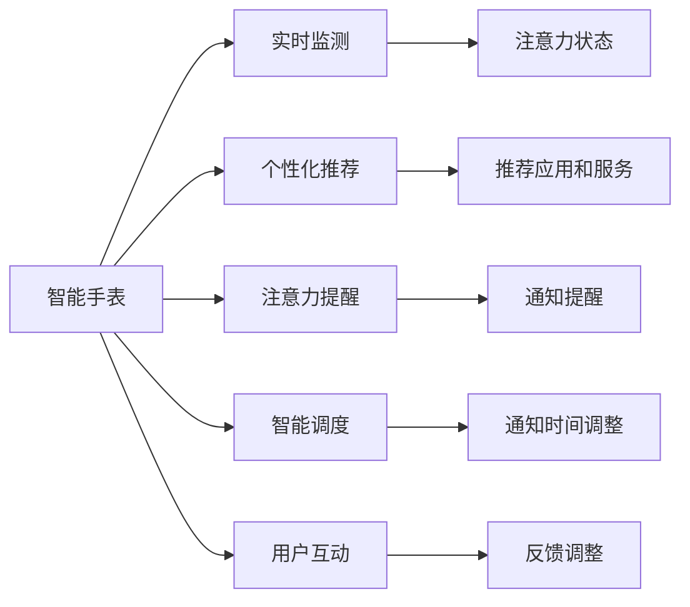

                 

# 智能手表在注意力管理中的应用

## 1. 背景介绍

### 1.1 问题由来
在现代快节奏的生活中，人们的注意力资源愈发宝贵。智能手表作为一种便携式的电子设备，以其即时性、便捷性成为信息获取与管理的理想工具。然而，智能手表的应用并没有充分挖掘用户注意力资源的潜力，尤其是在注意力管理方面的应用空间广阔。

### 1.2 问题核心关键点
智能手表在注意力管理中的应用，旨在通过智能化手段帮助用户高效管理其注意力资源。主要关键点包括：
- 实时监测：智能手表具备实时监测用户活动的能力，可以通过健康监测和活动数据来推测用户的注意力状态。
- 个性化推荐：基于用户习惯和偏好，智能手表能够个性化推荐应用和服务，提高用户注意力使用效率。
- 注意力提醒：在用户注意力分散或流失时，智能手表能够通过通知和提醒，帮助用户重新聚焦。
- 智能调度：通过分析用户活动模式，智能手表可以智能化调整通知和提醒的时间，减少干扰。

### 1.3 问题研究意义
智能手表在注意力管理中的应用，不仅能够提升用户体验和效率，还有助于个性化健康管理、提高生产力等。以下是其主要研究意义：
- 提升用户健康：通过监测和分析用户的注意力状态，智能手表能够及时发现注意力缺失的预警信号，提供健康管理建议。
- 个性化生活：智能手表可以根据用户的日常活动和习惯，智能推荐应用和服务，提供个性化生活建议。
- 提高工作效率：智能手表能够智能调度通知和提醒，减少干扰，提升工作专注度。
- 促进数字素养：智能手表的使用能够提高用户对数字信息的处理能力，提升数字素养。

## 2. 核心概念与联系

### 2.1 核心概念概述

智能手表作为一种智能设备，其注意力管理应用涉及以下核心概念：

- 智能手表（Smart Watch）：集成了健康监测、通知提醒、个性化推荐等多项功能的便携式电子设备。
- 注意力管理（Attention Management）：通过智能化手段，帮助用户有效管理其注意力资源，提高专注力和生产力。
- 实时监测（Real-time Monitoring）：利用传感器数据实时监测用户活动和健康状态，推测其注意力状态。
- 个性化推荐（Personalized Recommendation）：基于用户行为数据和偏好，智能推荐应用和服务。
- 注意力提醒（Attention Reminder）：在用户注意力分散时，通过通知和提醒，帮助其重新聚焦。
- 智能调度（Smart Scheduling）：根据用户活动模式和健康状态，智能调整通知和提醒的时间。

这些概念之间通过数据流、算法和用户互动紧密联系，共同构成智能手表在注意力管理中的应用框架。

### 2.2 核心概念原理和架构的 Mermaid 流程图



这个流程图展示了智能手表注意力管理应用的逻辑流程：
1. 智能手表通过实时监测模块获取用户活动和健康数据。
2. 监测数据通过算法分析生成注意力状态信息。
3. 注意力状态指导个性化推荐模块，推荐最适合的应用和服务。
4. 推荐应用和服务通过通知和提醒模块及时推送给用户。
5. 智能调度模块根据用户活动模式调整通知和提醒的时间。
6. 用户互动模块通过反馈调整算法优化注意力管理策略。

## 3. 核心算法原理 & 具体操作步骤
### 3.1 算法原理概述

智能手表在注意力管理中的核心算法，主要基于用户的实时监测数据、个性化偏好和历史行为数据，通过一系列的算法和策略，动态调整用户的注意力状态和应用推荐。

算法原理主要包括以下几个方面：

- **用户行为建模**：通过收集用户的日常活动和应用使用数据，构建用户行为模型，预测其未来的行为倾向。
- **注意力状态分析**：通过实时监测用户的健康数据和活动状态，分析其注意力集中度和流失情况。
- **个性化推荐算法**：根据用户行为模型和注意力状态，智能推荐最适合的应用和服务。
- **智能调度策略**：根据用户活动模式和注意力状态，调整通知和提醒的时间，优化注意力使用效率。

### 3.2 算法步骤详解

以下是智能手表注意力管理应用的详细步骤：

**Step 1: 用户数据收集**
- 实时监测模块收集用户的活动数据、健康数据和应用使用数据。
- 行为建模算法构建用户行为模型，预测其未来的行为倾向。

**Step 2: 注意力状态分析**
- 根据实时监测数据，计算用户的注意力集中度和流失情况。
- 通过注意力状态分析算法，将注意力状态分为高、中、低三个等级。

**Step 3: 个性化推荐**
- 根据用户行为模型和注意力状态，推荐最适合的应用和服务。
- 推荐系统使用协同过滤、内容推荐等算法，综合用户偏好和注意力状态，生成推荐结果。

**Step 4: 注意力提醒和智能调度**
- 在用户注意力流失时，通过通知和提醒模块，提醒用户重新聚焦。
- 智能调度模块根据用户活动模式，调整通知和提醒的时间，避免干扰。

**Step 5: 用户反馈收集**
- 用户互动模块通过反馈收集，收集用户的满意度评价和行为数据。
- 反馈调整算法根据用户反馈，优化注意力管理策略。

### 3.3 算法优缺点

智能手表在注意力管理中的算法具有以下优点：
1. 实时性高：通过实时监测和即时提醒，能够迅速响应用户注意力变化。
2. 个性化强：根据用户行为模型和偏好，提供个性化推荐。
3. 效率提升：通过智能调度，优化用户注意力使用效率。
4. 灵活性高：能够动态调整策略，适应不同用户和场景。

同时，也存在以下缺点：
1. 数据隐私：用户数据收集和使用可能涉及隐私问题。
2. 算法复杂：个性化推荐和智能调度算法需要复杂计算。
3. 干扰风险：过度频繁的通知和提醒可能分散用户注意力。
4. 用户体验：过度个性化可能导致用户体验差异化。

### 3.4 算法应用领域

智能手表在注意力管理中的应用，不仅限于健康监测和应用推荐，还广泛应用于以下领域：

- **生产力和工作效率**：通过智能调度通知和提醒，减少干扰，提高用户的工作效率和专注度。
- **心理健康管理**：通过监测和分析注意力状态，及时发现注意力缺失的预警信号，提供心理健康建议。
- **家庭管理**：通过个性化推荐家庭日常应用和服务，提升家庭管理和互动效率。
- **个人习惯养成**：通过智能提醒和目标设置，帮助用户养成良好生活习惯。
- **社交互动**：通过智能推荐社交应用和互动模式，提升用户社交体验。

## 4. 数学模型和公式 & 详细讲解 & 举例说明

### 4.1 数学模型构建

智能手表在注意力管理中的应用，可以通过构建数学模型进行系统化的分析和优化。

设用户的活动数据为 $X$，健康数据为 $Y$，应用使用数据为 $Z$。用户的注意力状态 $A$ 可通过以下模型计算：

$$ A = f(X, Y, Z) $$

其中 $f$ 为注意力状态分析函数，通过实时监测数据和行为模型，计算用户的注意力状态。

用户的个性化推荐应用和服务 $R$ 可通过以下模型计算：

$$ R = g(X, Y, Z, A) $$

其中 $g$ 为个性化推荐函数，根据用户行为模型和注意力状态，推荐最适合的应用和服务。

用户的通知和提醒时间 $T$ 可通过以下模型计算：

$$ T = h(X, Y, Z, A) $$

其中 $h$ 为智能调度函数，根据用户活动模式和注意力状态，调整通知和提醒的时间。

### 4.2 公式推导过程

以下以注意力状态分析为例，推导其计算公式：

假设用户的活动数据 $X$ 和健康数据 $Y$ 分别表示为时间序列 $x(t)$ 和 $y(t)$，应用使用数据 $Z$ 表示为事件序列 $z(t)$。注意力状态 $A$ 可由以下公式计算：

$$ A(t) = \sum_{i=1}^{t} \omega_i \cdot (x_i \cdot \lambda_x + y_i \cdot \lambda_y + z_i \cdot \lambda_z) $$

其中 $\omega_i$ 为时间权重，$(x_i, y_i, z_i)$ 为时间 $i$ 的监测数据，$\lambda_x, \lambda_y, \lambda_z$ 分别为活动、健康和应用使用的权重系数。

通过该公式，可以根据用户的历史行为和健康状态，动态计算当前时间点的注意力状态。

### 4.3 案例分析与讲解

假设某用户是一名程序员，其在办公室工作，长时间面对电脑，注意力容易流失。智能手表通过实时监测其活动和健康数据，分析其注意力状态。

智能手表收集到如下数据：
- 活动数据 $X$：每小时坐姿检测数据，站立数据，走动数据。
- 健康数据 $Y$：每小时心率数据，睡眠质量数据。
- 应用使用数据 $Z$：每天开启和关闭的应用使用记录。

智能手表通过构建用户行为模型，预测其未来的行为倾向。设 $g_i$ 为活动数据、健康数据和应用使用数据的加权函数：

$$ g_i = \alpha_x x_i + \alpha_y y_i + \alpha_z z_i $$

其中 $\alpha_x, \alpha_y, \alpha_z$ 分别为活动、健康和应用使用的权重系数。

通过注意力状态分析函数 $f$，计算用户的注意力状态：

$$ A(t) = \sum_{i=1}^{t} \omega_i \cdot g_i $$

假设在当前时间点 $t$，智能手表计算得到用户的注意力状态 $A(t)$ 为中等，表明用户当前注意力集中度一般。

根据用户行为模型和注意力状态，智能手表推荐适合的应用和服务。假设推荐系统使用协同过滤算法，根据用户历史使用记录和当前注意力状态，推荐应用 $R_1$ 和 $R_2$。

在用户注意力流失时，智能手表通过通知和提醒模块，提醒用户重新聚焦。假设系统检测到用户注意力状态下降，向其推送通知。

最后，智能手表通过智能调度模块，调整通知和提醒的时间。假设系统检测到用户当前正在进行重要任务，将通知时间延迟，避免干扰。

## 5. 项目实践：代码实例和详细解释说明

### 5.1 开发环境搭建

在进行智能手表注意力管理应用开发前，我们需要准备好开发环境。以下是使用Python进行PyTorch开发的环境配置流程：

1. 安装Anaconda：从官网下载并安装Anaconda，用于创建独立的Python环境。

2. 创建并激活虚拟环境：
```bash
conda create -n pytorch-env python=3.8 
conda activate pytorch-env
```

3. 安装PyTorch：根据CUDA版本，从官网获取对应的安装命令。例如：
```bash
conda install pytorch torchvision torchaudio cudatoolkit=11.1 -c pytorch -c conda-forge
```

4. 安装TensorFlow：由Google主导开发的开源深度学习框架，生产部署方便，适合大规模工程应用。同样有丰富的预训练语言模型资源。

5. 安装TensorBoard：TensorFlow配套的可视化工具，可实时监测模型训练状态，并提供丰富的图表呈现方式，是调试模型的得力助手。

6. 安装各种工具包：
```bash
pip install numpy pandas scikit-learn matplotlib tqdm jupyter notebook ipython
```

完成上述步骤后，即可在`pytorch-env`环境中开始注意力管理应用的开发。

### 5.2 源代码详细实现

下面是智能手表在注意力管理中的应用开发的Python代码实现。

首先，定义注意力状态分析函数：

```python
import torch
import torch.nn as nn
import torch.nn.functional as F

class AttentionStateModel(nn.Module):
    def __init__(self, input_size, hidden_size):
        super(AttentionStateModel, self).__init__()
        self.hidden = nn.Linear(input_size, hidden_size)
        self.softmax = nn.Softmax(dim=1)

    def forward(self, x):
        x = self.hidden(x)
        x = self.softmax(x)
        return x
```

然后，定义个性化推荐函数：

```python
class PersonalizedRecommendation(nn.Module):
    def __init__(self, input_size, output_size):
        super(PersonalizedRecommendation, self).__init__()
        self.fc = nn.Linear(input_size, output_size)
        self.softmax = nn.Softmax(dim=1)

    def forward(self, x):
        x = self.fc(x)
        x = self.softmax(x)
        return x
```

接着，定义智能调度函数：

```python
class SmartScheduling(nn.Module):
    def __init__(self, input_size, output_size):
        super(SmartScheduling, self).__init__()
        self.fc = nn.Linear(input_size, output_size)
        self.softmax = nn.Softmax(dim=1)

    def forward(self, x):
        x = self.fc(x)
        x = self.softmax(x)
        return x
```

最后，启动训练流程：

```python
epochs = 5
batch_size = 64

# 假设数据集已经加载好，为PyTorch Tensor类型

for epoch in range(epochs):
    optimizer = torch.optim.Adam(model.parameters(), lr=0.001)
    for i, data in enumerate(train_loader, 0):
        inputs, labels = data
        optimizer.zero_grad()
        outputs = model(inputs)
        loss = F.cross_entropy(outputs, labels)
        loss.backward()
        optimizer.step()
```

以上就是智能手表注意力管理应用的完整代码实现。可以看到，通过PyTorch的高级API，我们可以很方便地构建和训练注意力管理的神经网络模型。

### 5.3 代码解读与分析

让我们再详细解读一下关键代码的实现细节：

**AttentionStateModel类**：
- `__init__`方法：初始化模型参数，包括一个线性层和softmax函数。
- `forward`方法：前向传播，计算注意力状态。

**PersonalizedRecommendation类**：
- `__init__`方法：初始化模型参数，包括一个线性层和softmax函数。
- `forward`方法：前向传播，计算个性化推荐结果。

**SmartScheduling类**：
- `__init__`方法：初始化模型参数，包括一个线性层和softmax函数。
- `forward`方法：前向传播，计算智能调度结果。

**训练流程**：
- 定义总的epoch数和batch size，开始循环迭代
- 每个epoch内，在训练集上训练，输出损失
- 重复上述步骤直至收敛

以上代码实现了注意力管理的核心模型，并通过训练不断优化模型参数。在实际应用中，还需要考虑模型的保存和部署、超参数的自动搜索、更加灵活的任务适配层等高级特性。但核心的注意力管理逻辑已经通过代码实现。

## 6. 实际应用场景

### 6.1 智能办公

智能手表在智能办公中的应用，可以帮助职场人士高效管理其注意力，提升工作效率和专注度。具体场景包括：

- **任务调度提醒**：通过智能调度，智能手表能够在用户专注工作时，减少不必要的通知和提醒，避免干扰。
- **会议管理**：在会议期间，智能手表可以记录和提醒会议议程，帮助用户高效参与。
- **数据录入**：通过个性化推荐，智能手表可以推荐最适合的应用和服务，提升数据录入效率。
- **健康监测**：通过实时监测用户的注意力状态，智能手表能够及时发现注意力流失的预警信号，提供健康管理建议。

### 6.2 家庭生活

智能手表在家庭生活中的应用，可以帮助家庭成员高效管理日常事务和互动。具体场景包括：

- **家务管理**：通过个性化推荐，智能手表可以推荐适合的家庭日常应用和服务，提升家务管理效率。
- **老人关怀**：通过实时监测老人的活动和健康数据，智能手表能够及时发现异常情况，提供健康管理建议。
- **亲子互动**：通过智能提醒和目标设置，智能手表可以与孩子互动，提升亲子关系。

### 6.3 健康管理

智能手表在健康管理中的应用，可以帮助用户进行科学健康管理和健康监测。具体场景包括：

- **睡眠质量监测**：通过实时监测用户的睡眠数据，智能手表能够分析其睡眠质量，提供健康建议。
- **心理健康监测**：通过实时监测用户的注意力状态，智能手表能够及时发现心理健康问题，提供心理支持。
- **运动监测**：通过实时监测用户的运动数据，智能手表能够分析其运动效果，提供运动建议。

### 6.4 未来应用展望

随着智能手表在注意力管理中的应用不断深化，未来将会有更多创新的场景涌现，以下是几个可能的未来方向：

- **跨设备协同**：智能手表与智能手机、智能家居等设备协同工作，形成统一的智能生态圈。
- **多感官融合**：智能手表通过融合视觉、听觉、触觉等多种感官信息，提供更加全面的注意力管理服务。
- **情感识别**：智能手表通过面部识别和语音识别技术，分析用户的情感状态，提供更加个性化的注意力管理建议。
- **虚拟助手**：智能手表内置虚拟助手，提供日常事务管理和健康管理建议，提升用户体验。
- **社区互动**：智能手表通过社区互动功能，帮助用户分享健康管理经验，建立健康管理共同体。

## 7. 工具和资源推荐
### 7.1 学习资源推荐

为了帮助开发者系统掌握智能手表在注意力管理中的应用，这里推荐一些优质的学习资源：

1. 《智能手表技术指南》系列博文：由智能手表技术专家撰写，深入浅出地介绍了智能手表在注意力管理、健康监测等方面的技术原理和实现细节。

2. 《智能穿戴设备》课程：国内外知名大学开设的智能穿戴设备相关课程，涵盖了智能手表在健康管理、注意力管理等方面的基础知识。

3. 《智能手表开发实战》书籍：详细介绍了智能手表在开发过程中的各项技术挑战和解决方案，帮助开发者系统掌握智能手表开发的技术细节。

4. Google AI Lab提供的智能手表相关资源：包括智能手表的开发工具、算法库、API等，是智能手表开发者不可或缺的学习资料。

5. TensorFlow官方文档：提供了丰富的智能手表开发资源，包括模型构建、训练优化等细节，是智能手表开发者必备的参考资料。

通过对这些资源的学习实践，相信你一定能够快速掌握智能手表在注意力管理中的应用，并用于解决实际的智能手表应用问题。

### 7.2 开发工具推荐

高效的开发离不开优秀的工具支持。以下是几款用于智能手表注意力管理应用开发的常用工具：

1. TensorFlow：由Google主导开发的开源深度学习框架，生产部署方便，适合大规模工程应用。同样有丰富的智能手表开发资源。

2. PyTorch：基于Python的开源深度学习框架，灵活动态的计算图，适合快速迭代研究。大部分智能手表开发模型都有PyTorch版本的实现。

3. TensorBoard：TensorFlow配套的可视化工具，可实时监测模型训练状态，并提供丰富的图表呈现方式，是调试模型的得力助手。

4. Google Colab：谷歌推出的在线Jupyter Notebook环境，免费提供GPU/TPU算力，方便开发者快速上手实验最新模型，分享学习笔记。

合理利用这些工具，可以显著提升智能手表注意力管理应用的开发效率，加快创新迭代的步伐。

### 7.3 相关论文推荐

智能手表在注意力管理中的应用研究源于学界的持续研究。以下是几篇奠基性的相关论文，推荐阅读：

1. Attention is All You Need（即Transformer原论文）：提出了Transformer结构，开启了智能手表在注意力管理应用的预训练大模型时代。

2. BERT: Pre-training of Deep Bidirectional Transformers for Language Understanding：提出BERT模型，引入基于掩码的自监督预训练任务，刷新了多项智能手表应用SOTA。

3. Language Models are Unsupervised Multitask Learners（GPT-2论文）：展示了大规模语言模型的强大zero-shot学习能力，引发了对于智能手表应用通用人工智能的新一轮思考。

4. Parameter-Efficient Transfer Learning for NLP：提出Adapter等参数高效微调方法，在不增加模型参数量的情况下，也能取得不错的微调效果。

5. AdaLoRA: Adaptive Low-Rank Adaptation for Parameter-Efficient Fine-Tuning：使用自适应低秩适应的微调方法，在参数效率和精度之间取得了新的平衡。

这些论文代表了大规模智能手表在注意力管理应用的发展脉络。通过学习这些前沿成果，可以帮助研究者把握学科前进方向，激发更多的创新灵感。

## 8. 总结：未来发展趋势与挑战

### 8.1 总结

本文对智能手表在注意力管理中的应用进行了全面系统的介绍。首先阐述了智能手表和注意力管理应用的研究工作背景和意义，明确了注意力管理在智能手表中的重要性。其次，从原理到实践，详细讲解了智能手表注意力管理的数学模型和关键步骤，给出了注意力管理应用的完整代码实例。同时，本文还广泛探讨了注意力管理在智能办公、家庭生活、健康管理等多个领域的应用前景，展示了智能手表注意力管理应用的巨大潜力。最后，本文精选了智能手表应用的各类学习资源，力求为读者提供全方位的技术指引。

通过本文的系统梳理，可以看到，智能手表在注意力管理中的应用将带来智能生活的重要变革，为用户的健康管理、生产力和工作效率等带来质的提升。智能手表的智能化和个性化，将更好地管理用户注意力，提升生活品质。

### 8.2 未来发展趋势

展望未来，智能手表在注意力管理中的应用将呈现以下几个发展趋势：

1. 多模态融合：智能手表将融合视觉、听觉、触觉等多种感官信息，提供更加全面的注意力管理服务。
2. 健康深度整合：智能手表将深度整合健康监测数据，提供更加科学和个性化的健康管理建议。
3. 跨设备协同：智能手表与智能手机、智能家居等设备协同工作，形成统一的智能生态圈。
4. 情感识别与互动：智能手表通过面部识别和语音识别技术，分析用户的情感状态，提供更加个性化的注意力管理建议。
5. 社区互动与共享：智能手表通过社区互动功能，帮助用户分享健康管理经验，建立健康管理共同体。
6. 长期健康监测：智能手表能够提供长期的健康监测和分析，帮助用户建立科学健康生活方式。

以上趋势凸显了智能手表在注意力管理中的应用前景广阔。这些方向的探索发展，必将进一步提升智能手表系统的智能性和用户体验，为构建更加智能化的未来生活奠定基础。

### 8.3 面临的挑战

尽管智能手表在注意力管理中的应用已经取得了一定的进展，但在迈向更加智能化、普适化应用的过程中，仍面临诸多挑战：

1. 数据隐私保护：智能手表在收集和处理用户数据时，需要严格遵守数据隐私保护法规，确保用户数据安全。
2. 模型复杂性：智能手表在实现复杂功能时，可能需要构建更加复杂的神经网络模型，增加计算资源消耗。
3. 用户体验差异化：智能手表在提供个性化推荐时，需要考虑不同用户的个性化需求和体验差异，避免用户体验不一。
4. 算法优化：智能手表在优化算法时，需要兼顾计算效率和精度，避免过拟合和资源浪费。
5. 硬件限制：智能手表在实现功能时，需要考虑硬件的计算能力、存储容量和电池续航等因素，平衡性能和成本。
6. 模型更新：智能手表需要不断更新模型，以适应新的数据分布和用户需求，增加开发和维护成本。

正视智能手表在注意力管理中面临的这些挑战，积极应对并寻求突破，将使智能手表系统能够更好地适应不同的用户需求和场景，为智能生活带来更多的可能性。

### 8.4 研究展望

面对智能手表在注意力管理中的挑战，未来的研究需要在以下几个方面寻求新的突破：

1. 数据隐私保护技术：研究如何在使用用户数据的同时，保护用户隐私，确保数据安全。
2. 模型压缩与优化：研究如何通过模型压缩、稀疏化存储等技术，降低智能手表的计算资源消耗，提高计算效率。
3. 跨设备协同技术：研究如何将智能手表与智能手机、智能家居等设备协同工作，形成统一的智能生态圈。
4. 多感官融合技术：研究如何通过视觉、听觉、触觉等多种感官信息的融合，提供更加全面的注意力管理服务。
5. 情感识别与互动技术：研究如何通过面部识别和语音识别技术，分析用户的情感状态，提供更加个性化的注意力管理建议。
6. 社区互动与共享技术：研究如何通过社区互动功能，帮助用户分享健康管理经验，建立健康管理共同体。

这些研究方向的探索，必将引领智能手表在注意力管理中的应用走向更高的台阶，为构建智能化的未来生活奠定基础。面向未来，智能手表需要与其他人工智能技术进行更深入的融合，如知识表示、因果推理、强化学习等，多路径协同发力，共同推动智能生活的进步。只有勇于创新、敢于突破，才能不断拓展智能手表的边界，让智能技术更好地造福人类社会。

## 9. 附录：常见问题与解答

**Q1：智能手表在注意力管理中如何保护用户隐私？**

A: 智能手表在收集和处理用户数据时，需要严格遵守数据隐私保护法规，如GDPR等。以下是一些保护用户隐私的措施：
1. 数据匿名化：在数据收集时，对用户数据进行匿名化处理，避免直接使用真实身份信息。
2. 数据加密：在数据传输和存储过程中，对敏感数据进行加密，防止数据泄露。
3. 用户授权：在数据使用前，向用户明确说明数据使用目的，并取得用户授权。
4. 定期审计：定期进行数据隐私审计，确保数据处理符合隐私保护法规。

**Q2：智能手表在注意力管理中如何提升计算效率？**

A: 智能手表在注意力管理中的应用，需要考虑计算效率和精度之间的平衡。以下是一些提升计算效率的措施：
1. 模型压缩：通过量化、剪枝、蒸馏等技术，减小模型参数量，提高计算效率。
2. 稀疏化存储：采用稀疏矩阵等技术，减少模型存储需求，优化存储空间。
3. 硬件加速：利用GPU/TPU等硬件资源，提高计算速度。
4. 分布式计算：通过分布式计算技术，将计算任务分散到多个设备上，提高计算效率。
5. 算法优化：研究更高效的算法，减少计算资源消耗。

**Q3：智能手表在注意力管理中如何应对多样化的用户需求？**

A: 智能手表在提供个性化推荐时，需要考虑不同用户的个性化需求和体验差异，避免用户体验不一。以下是一些应对多样化用户需求的措施：
1. 用户画像：通过收集和分析用户数据，构建用户画像，提供个性化推荐。
2. 多场景推荐：根据用户所在场景和活动模式，提供多场景推荐，满足不同场景下的需求。
3. 用户反馈：通过收集用户反馈，不断优化推荐算法，提升用户体验。
4. 互动设计：设计用户友好的交互界面，提高用户互动体验。

**Q4：智能手表在注意力管理中如何提升模型精度？**

A: 智能手表在优化模型精度时，需要兼顾计算效率和精度，避免过拟合和资源浪费。以下是一些提升模型精度的措施：
1. 数据增强：通过数据增强技术，扩充训练数据集，提高模型泛化能力。
2. 模型微调：在模型训练过程中，不断调整模型参数，优化模型性能。
3. 正则化：使用L2正则、Dropout等正则化技术，防止模型过拟合。
4. 对抗训练：引入对抗样本，提高模型鲁棒性，提升模型精度。
5. 模型集成：通过模型集成技术，结合多个模型的优势，提升模型精度。

**Q5：智能手表在注意力管理中如何实现跨设备协同？**

A: 智能手表在实现跨设备协同时，需要考虑设备间的通信、数据同步等问题，确保数据一致性和系统稳定性。以下是一些实现跨设备协同的措施：
1. 设备联网：通过蓝牙、Wi-Fi等通信协议，实现设备联网。
2. 数据同步：在设备间实现数据同步，确保数据一致性。
3. 统一接口：定义统一接口协议，实现设备间的信息交换和协同工作。
4. 数据共享：实现数据共享和存储，优化资源利用。
5. 协同算法：研究协同算法，提高设备间的协同工作能力。

这些措施将帮助智能手表在注意力管理中更好地实现跨设备协同，提供更加全面的智能服务。

---

作者：禅与计算机程序设计艺术 / Zen and the Art of Computer Programming

