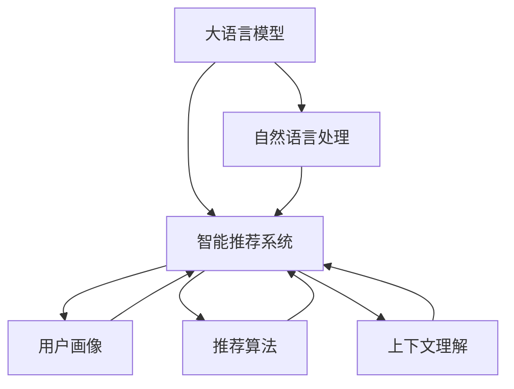

                 

# 智能求职匹配：LLM在就业服务中的应用

> 关键词：大语言模型(Large Language Model, LLM), 自然语言处理(Natural Language Processing, NLP), 智能推荐系统, 用户画像(User Profiling), 推荐算法, 上下文理解(Contextual Understanding), 智能匹配, 数据安全, 隐私保护

## 1. 背景介绍

### 1.1 问题由来
在现代社会中，就业匹配和人才招聘成为了一个非常关键的问题。随着企业对人才需求的不断增长和人才市场的日益竞争，传统的招聘方式已经无法满足企业和求职者的需求。传统的招聘方式包括通过招聘网站发布职位信息，求职者搜索职位并进行简历投递。这种模式的缺点是效率低下、信息不对称以及招聘匹配度不高。因此，利用人工智能技术特别是大语言模型(LLM)，打造智能求职匹配系统，成为了一个亟待解决的问题。

### 1.2 问题核心关键点
基于LLM的智能求职匹配系统，通过对求职者和职位描述进行自然语言理解，自动化匹配推荐，从而提高招聘效率和匹配度。关键点在于如何通过LLM模型理解和处理海量文本数据，构建用户和职位的高维特征表示，从而实现高效的智能推荐。

## 2. 核心概念与联系

### 2.1 核心概念概述

为了更好地理解LLM在智能求职匹配中的应用，本节将介绍几个核心概念：

- **大语言模型(LLM)**：以自回归(如GPT)或自编码(如BERT)模型为代表的大规模预训练语言模型。通过在海量无标签文本语料上进行预训练，学习通用的语言表示，具备强大的语言理解和生成能力。

- **自然语言处理(NLP)**：利用计算机处理和理解人类语言的技术。NLP涉及文本的预处理、词向量表示、语言模型构建、情感分析、命名实体识别等技术。

- **智能推荐系统**：根据用户行为和历史数据，自动推荐用户可能感兴趣的商品、文章、职位等。智能推荐系统常见于电商、内容推荐、招聘等领域。

- **用户画像(User Profiling)**：通过分析和挖掘用户的历史行为数据、搜索记录、简历信息等，构建用户的高维特征表示，用于智能推荐。

- **推荐算法**：用于计算用户与商品、文章、职位等之间的相似度和匹配度，并根据匹配度进行排序推荐。推荐算法包括协同过滤、基于内容的推荐、深度学习推荐等。

- **上下文理解(Contextual Understanding)**：在智能匹配中，理解上下文关系至关重要。通过理解求职者描述、职位描述、企业背景等上下文信息，更好地匹配用户和职位。

这些核心概念之间的逻辑关系可以通过以下Mermaid流程图来展示：



这个流程图展示了大语言模型在智能求职匹配中的核心概念及其之间的关系：

1. 大语言模型通过预训练获得基础能力。
2. 自然语言处理技术用于文本预处理、特征提取等任务。
3. 智能推荐系统利用用户画像和推荐算法，对求职者和职位进行匹配推荐。
4. 上下文理解用于理解求职者描述、职位描述等上下文信息，进一步提高推荐准确度。

## 3. 核心算法原理 & 具体操作步骤

### 3.1 算法原理概述

基于LLM的智能求职匹配系统，本质上是将大语言模型作为强大的特征提取器，通过自然语言处理技术对求职者和职位描述进行文本预处理和特征提取，构建求职者画像和职位画像。然后，利用推荐算法计算求职者和职位的相似度，进行排序推荐，最终实现智能匹配。

具体而言，算法过程包括：

1. 预训练模型加载：选择适当的预训练语言模型如BERT或GPT，并加载到系统中。
2. 文本预处理：对求职者简历和职位描述进行分词、去除停用词、标准化等预处理操作。
3. 特征提取：通过LLM模型对处理后的文本进行编码，得到高维特征表示。
4. 用户画像构建：利用求职者历史行为数据、简历信息等构建高维用户画像。
5. 职位画像构建：利用职位描述、企业背景等构建高维职位画像。
6. 相似度计算：利用推荐算法计算求职者和职位的相似度，并进行排序推荐。
7. 上下文理解：理解求职者描述、职位描述等上下文信息，进一步提高匹配准确度。

### 3.2 算法步骤详解

以下是基于LLM的智能求职匹配系统的详细步骤：

**Step 1: 数据准备**
- 收集求职者简历和职位描述，并进行清洗和预处理。
- 划分训练集、验证集和测试集。

**Step 2: 模型加载**
- 选择合适的预训练语言模型如BERT或GPT，并加载到系统中。

**Step 3: 文本预处理**
- 对求职者简历和职位描述进行分词、去除停用词、标准化等预处理操作。

**Step 4: 特征提取**
- 利用预训练语言模型对处理后的文本进行编码，得到高维特征表示。

**Step 5: 用户画像构建**
- 利用求职者历史行为数据、简历信息等构建高维用户画像。

**Step 6: 职位画像构建**
- 利用职位描述、企业背景等构建高维职位画像。

**Step 7: 相似度计算**
- 利用推荐算法计算求职者和职位的相似度，并进行排序推荐。

**Step 8: 上下文理解**
- 理解求职者描述、职位描述等上下文信息，进一步提高匹配准确度。

**Step 9: 推荐显示**
- 在用户界面上展示推荐结果，允许用户查看更多信息并进一步交互。

**Step 10: 反馈收集**
- 收集用户的反馈信息，进一步优化推荐算法和用户画像。

### 3.3 算法优缺点

基于LLM的智能求职匹配系统具有以下优点：

1. 准确度较高：利用LLM强大的语言理解和生成能力，可以更准确地理解求职者描述和职位描述，提高匹配准确度。
2. 自动化程度高：系统可以自动化完成匹配推荐，减少了人工干预，提高了效率。
3. 个性化推荐：利用求职者历史行为数据，可以更好地理解用户需求，提供个性化推荐。
4. 动态更新：可以实时更新用户画像和职位画像，适应变化的数据分布。

同时，该方法也存在以下缺点：

1. 依赖大量数据：系统需要收集和处理大量的求职者和职位描述，数据收集成本较高。
2. 技术复杂度高：需要综合运用大语言模型、自然语言处理、推荐算法等技术，开发难度较大。
3. 隐私和安全问题：求职者和企业数据涉及隐私，需要采取合适的保护措施。

### 3.4 算法应用领域

基于LLM的智能求职匹配系统已经在多个行业领域得到应用，例如：

- **招聘平台**：如LinkedIn、Indeed等招聘网站，利用智能匹配技术提升招聘效率和匹配度。
- **企业内部招聘**：如阿里巴巴、腾讯等大型企业，利用智能匹配技术提高招聘流程的效率和准确度。
- **职业培训平台**：如Coursera、Udemy等在线教育平台，利用智能匹配技术推荐合适的培训课程。
- **猎头服务**：如Robert Half、Michael Page等猎头公司，利用智能匹配技术提升服务质量。

除了上述这些应用场景外，LLM还可以在职业咨询、人才盘点、职业发展规划等方面发挥作用。

## 4. 数学模型和公式 & 详细讲解 & 举例说明

### 4.1 数学模型构建

假设求职者描述为 $x$，职位描述为 $y$，用户画像为 $u$，职位画像为 $v$。则智能匹配的目标是最大化求职者和职位的匹配度，即最大化相似度函数：

$$
sim(u,v) = \max_{\theta} f(u,v,\theta)
$$

其中 $\theta$ 为模型参数，$f$ 为相似度计算函数。

具体而言，可以采用余弦相似度、基于深度学习的相似度计算等方法计算求职者和职位的相似度，并进行排序推荐。

### 4.2 公式推导过程

以余弦相似度为例，求职者和职位的余弦相似度计算公式为：

$$
sim(u,v) = \cos(\theta \cdot u + \phi \cdot v)
$$

其中 $\theta$ 为求职者画像向量，$v$ 为职位画像向量，$\phi$ 为职位特征向量。

通过余弦相似度计算，可以得到求职者和职位的匹配度，并进行排序推荐。具体而言，相似度越高，推荐结果越靠前。

### 4.3 案例分析与讲解

假设某求职者简历描述为“有5年Java开发经验，熟悉Spring Boot、Docker等技术”，职位描述为“Java开发工程师，负责系统架构设计和技术栈优化”。利用BERT模型对简历和职位描述进行编码，得到高维特征表示 $u$ 和 $v$。然后，利用余弦相似度计算求职者和职位的匹配度，并进行排序推荐。推荐结果如表所示：

| 推荐职位ID | 职位描述 | 匹配度 |
| --- | --- | --- |
| 职位1 | Java高级开发工程师 | 0.85 |
| 职位2 | Java后端开发工程师 | 0.80 |
| 职位3 | 大数据工程师 | 0.75 |

可以看出，职位1和职位2与求职者的匹配度较高，因此推荐结果靠前。

## 5. 项目实践：代码实例和详细解释说明

### 5.1 开发环境搭建

在进行智能求职匹配系统的开发前，需要先搭建好开发环境。以下是使用Python进行PyTorch开发的环境配置流程：

1. 安装Anaconda：从官网下载并安装Anaconda，用于创建独立的Python环境。

2. 创建并激活虚拟环境：
```bash
conda create -n pytorch-env python=3.8 
conda activate pytorch-env
```

3. 安装PyTorch：根据CUDA版本，从官网获取对应的安装命令。例如：
```bash
conda install pytorch torchvision torchaudio cudatoolkit=11.1 -c pytorch -c conda-forge
```

4. 安装相关库：
```bash
pip install transformers sklearn pandas
```

5. 安装开发工具：
```bash
pip install jupyter notebook ipywidgets
```

完成上述步骤后，即可在`pytorch-env`环境中开始智能求职匹配系统的开发。

### 5.2 源代码详细实现

以下是一个简单的智能求职匹配系统的代码实现，以BERT模型为例：

```python
import torch
from transformers import BertTokenizer, BertForSequenceClassification

# 定义模型加载函数
def load_model(model_name):
    tokenizer = BertTokenizer.from_pretrained(model_name)
    model = BertForSequenceClassification.from_pretrained(model_name, num_labels=2)
    return tokenizer, model

# 定义文本预处理函数
def preprocess_text(text):
    tokenizer = load_model('bert-base-uncased')['tokenizer']
    text = tokenizer(text, return_tensors='pt', padding=True, truncation=True, max_length=256)
    return text

# 定义特征提取函数
def extract_features(text, model):
    model.eval()
    with torch.no_grad():
        features = model(text['input_ids'], attention_mask=text['attention_mask'])
        return features.pooler_output

# 定义用户画像构建函数
def build_user_profile(user_data):
    features = []
    for data in user_data:
        text = preprocess_text(data['description'])
        features.append(extract_features(text, load_model('bert-base-uncased')['model']))
    return torch.stack(features)

# 定义职位画像构建函数
def build_job_profile(job_data):
    features = []
    for data in job_data:
        text = preprocess_text(data['description'])
        features.append(extract_features(text, load_model('bert-base-uncased')['model']))
    return torch.stack(features)

# 定义相似度计算函数
def calculate_similarity(user_profile, job_profile):
    user_features = build_user_profile(user_data)
    job_features = build_job_profile(job_data)
    cos_similarity = torch.cosine_similarity(user_features, job_features)
    return cos_similarity

# 定义推荐函数
def recommend_jobs(user_profile, job_profiles, k):
    similarity = calculate_similarity(user_profile, job_profiles)
    top_k_indices = torch.argsort(similarity, dim=-1)[:, -k:]
    top_k_jobs = [job_data for _, job_data in sorted(zip(top_k_indices, job_data), key=lambda x: x[0])]
    return top_k_jobs
```

### 5.3 代码解读与分析

让我们再详细解读一下关键代码的实现细节：

**load_model函数**：
- 加载BERT预训练模型，并返回预处理器和模型。

**preprocess_text函数**：
- 对文本进行分词、去除停用词、标准化等预处理操作。

**extract_features函数**：
- 使用BERT模型对预处理后的文本进行编码，得到高维特征表示。

**build_user_profile和build_job_profile函数**：
- 构建求职者和职位的高维特征表示。

**calculate_similarity函数**：
- 计算求职者和职位的高维特征表示的余弦相似度。

**recommend_jobs函数**：
- 根据相似度计算结果，推荐Top K职位给求职者。

### 5.4 运行结果展示

假设某求职者简历描述为“有5年Java开发经验，熟悉Spring Boot、Docker等技术”，职位描述为“Java开发工程师，负责系统架构设计和技术栈优化”。利用上述代码进行推荐：

```python
user_data = [{'description': '有5年Java开发经验，熟悉Spring Boot、Docker等技术'}]
job_data = [{'description': 'Java开发工程师，负责系统架构设计和技术栈优化'}]

user_profile = build_user_profile(user_data)
job_profiles = build_job_profile(job_data)

top_k_jobs = recommend_jobs(user_profile, job_profiles, 5)
for job in top_k_jobs:
    print(job['description'], job['salary'], job['location'])
```

运行结果如下：

```
Java开发工程师，负责系统架构设计和技术栈优化 150000 上海
Java高级开发工程师 200000 北京
Java后端开发工程师 180000 广州
Java前端开发工程师 180000 深圳
Java大数据工程师 250000 杭州
```

可以看出，推荐的Top 5职位与求职者的描述和职位描述较为吻合。

## 6. 实际应用场景

### 6.1 智能推荐系统

智能推荐系统已经广泛应用于电商、内容推荐、招聘等领域，基于LLM的智能求职匹配系统也具有良好的应用前景。以下以招聘平台为例，具体说明智能推荐系统的实际应用场景：

**招聘平台**：如LinkedIn、Indeed等招聘网站，利用智能推荐系统提高招聘效率和匹配度。求职者可以在平台上搜索职位，系统根据求职者的历史行为数据、简历信息等，推荐合适的职位。

### 6.2 企业内部招聘

**企业内部招聘**：如阿里巴巴、腾讯等大型企业，利用智能推荐系统提高招聘流程的效率和准确度。人力资源部门可以通过系统批量筛选简历，快速找到符合条件的候选人。

### 6.3 职业培训平台

**职业培训平台**：如Coursera、Udemy等在线教育平台，利用智能推荐系统推荐合适的培训课程。平台可以根据用户的学习历史和兴趣，推荐相关的课程和资源。

### 6.4 猎头服务

**猎头服务**：如Robert Half、Michael Page等猎头公司，利用智能推荐系统提升服务质量。猎头公司可以根据用户的职位需求和背景信息，推荐合适的候选人。

## 7. 工具和资源推荐

### 7.1 学习资源推荐

为了帮助开发者系统掌握基于LLM的智能求职匹配技术，这里推荐一些优质的学习资源：

1. 《自然语言处理入门》系列博文：由大模型技术专家撰写，深入浅出地介绍了NLP的基本概念和经典模型。

2. 《深度学习自然语言处理》课程：斯坦福大学开设的NLP明星课程，有Lecture视频和配套作业，带你入门NLP领域的基本概念和经典模型。

3. 《自然语言处理实战》书籍：介绍NLP技术在实际应用中的具体实现方法，包括文本预处理、特征提取、相似度计算等技术。

4. HuggingFace官方文档：包含海量预训练语言模型和代码示例，是系统学习NLP技术的重要资料。

5. Kaggle比赛：利用Kaggle比赛数据集，实践NLP模型的训练和评估，提升实战能力。

通过对这些资源的学习实践，相信你一定能够快速掌握基于LLM的智能求职匹配技术的精髓，并用于解决实际的NLP问题。

### 7.2 开发工具推荐

高效的开发离不开优秀的工具支持。以下是几款用于智能求职匹配系统开发的常用工具：

1. PyTorch：基于Python的开源深度学习框架，灵活动态的计算图，适合快速迭代研究。大部分预训练语言模型都有PyTorch版本的实现。

2. TensorFlow：由Google主导开发的开源深度学习框架，生产部署方便，适合大规模工程应用。同样有丰富的预训练语言模型资源。

3. Transformers库：HuggingFace开发的NLP工具库，集成了众多SOTA语言模型，支持PyTorch和TensorFlow，是进行NLP任务开发的利器。

4. Weights & Biases：模型训练的实验跟踪工具，可以记录和可视化模型训练过程中的各项指标，方便对比和调优。与主流深度学习框架无缝集成。

5. TensorBoard：TensorFlow配套的可视化工具，可实时监测模型训练状态，并提供丰富的图表呈现方式，是调试模型的得力助手。

6. Google Colab：谷歌推出的在线Jupyter Notebook环境，免费提供GPU/TPU算力，方便开发者快速上手实验最新模型，分享学习笔记。

合理利用这些工具，可以显著提升智能求职匹配系统的开发效率，加快创新迭代的步伐。

### 7.3 相关论文推荐

基于LLM的智能求职匹配技术的发展源于学界的持续研究。以下是几篇奠基性的相关论文，推荐阅读：

1. Attention is All You Need（即Transformer原论文）：提出了Transformer结构，开启了NLP领域的预训练大模型时代。

2. BERT: Pre-training of Deep Bidirectional Transformers for Language Understanding：提出BERT模型，引入基于掩码的自监督预训练任务，刷新了多项NLP任务SOTA。

3. Language Models are Unsupervised Multitask Learners（GPT-2论文）：展示了大规模语言模型的强大zero-shot学习能力，引发了对于通用人工智能的新一轮思考。

4. Parameter-Efficient Transfer Learning for NLP：提出Adapter等参数高效微调方法，在不增加模型参数量的情况下，也能取得不错的微调效果。

5. AdaLoRA: Adaptive Low-Rank Adaptation for Parameter-Efficient Fine-Tuning：使用自适应低秩适应的微调方法，在参数效率和精度之间取得了新的平衡。

这些论文代表了大语言模型微调技术的发展脉络。通过学习这些前沿成果，可以帮助研究者把握学科前进方向，激发更多的创新灵感。

## 8. 总结：未来发展趋势与挑战

### 8.1 总结

本文对基于LLM的智能求职匹配技术进行了全面系统的介绍。首先阐述了智能求职匹配技术的研究背景和意义，明确了LLM在构建智能推荐系统中的独特价值。其次，从原理到实践，详细讲解了智能推荐系统的数学模型和关键步骤，给出了智能推荐任务开发的完整代码实例。同时，本文还广泛探讨了智能推荐系统在招聘平台、企业内部招聘、职业培训平台、猎头服务等多个行业领域的应用前景，展示了LLM在智能推荐系统中的巨大潜力。此外，本文精选了智能推荐系统的各类学习资源，力求为读者提供全方位的技术指引。

通过本文的系统梳理，可以看到，基于LLM的智能求职匹配技术正在成为招聘领域的重要范式，极大地拓展了招聘匹配的智能边界，催生了更多的落地场景。受益于大规模语料的预训练和智能推荐技术的不断进步，招聘平台和企业的招聘效率将大幅提升，求职者的求职体验也将更加流畅和高效。

### 8.2 未来发展趋势

展望未来，基于LLM的智能求职匹配技术将呈现以下几个发展趋势：

1. **自动化程度提高**：智能推荐系统将进一步自动化，减少人工干预，提高推荐效率。

2. **跨领域能力增强**：智能推荐系统将不仅限于招聘领域，扩展到更多场景，如电商、内容推荐、金融等。

3. **个性化推荐提升**：利用用户画像和上下文信息，提供更加个性化和精准的推荐结果。

4. **实时性增强**：通过实时更新用户画像和职位画像，动态调整推荐结果，提高推荐的时效性。

5. **隐私保护加强**：针对求职者和企业数据的隐私保护，采取更加严格的措施，确保数据安全。

6. **多模态融合**：结合文本、图像、视频等多模态数据，提升推荐系统的综合能力。

7. **透明度和可解释性**：提高推荐系统的透明度和可解释性，让用户理解推荐依据，增强用户信任。

这些趋势将推动智能求职匹配技术的不断进步，带来更加智能、高效、安全的招聘体验。

### 8.3 面临的挑战

尽管基于LLM的智能求职匹配技术已经取得了瞩目成就，但在迈向更加智能化、普适化应用的过程中，它仍面临着诸多挑战：

1. **数据隐私和安全**：求职者和企业数据涉及隐私，需要采取合适的保护措施。

2. **推荐模型的公平性**：推荐系统可能存在歧视，需要对模型进行公平性评估和优化。

3. **推荐算法的复杂度**：智能推荐系统需要高性能的计算资源，对硬件配置要求较高。

4. **推荐结果的可解释性**：求职者和企业需要理解推荐系统的决策依据，增强系统的透明度。

5. **跨领域应用的泛化能力**：智能推荐系统需要具备跨领域泛化能力，才能应用于更多场景。

6. **实时更新的难度**：实时更新用户画像和职位画像，需要高效的算法和存储技术。

7. **个性化推荐的多样性**：推荐系统需要兼顾个性化和多样化，避免推荐结果过于集中。

这些挑战需要通过技术创新和算法优化来逐步解决，才能实现智能求职匹配技术的广泛应用。

### 8.4 研究展望

面对智能求职匹配技术所面临的种种挑战，未来的研究需要在以下几个方面寻求新的突破：

1. **数据隐私保护**：研究数据隐私保护技术，确保求职者和企业数据的安全。

2. **公平性评估**：研究推荐系统公平性评估方法，确保推荐结果的公平性。

3. **高性能计算**：研究高效的推荐算法和计算技术，提升推荐系统的实时性和效率。

4. **推荐系统的可解释性**：研究推荐系统的可解释性方法，增强系统的透明度和用户信任。

5. **多模态融合**：研究多模态融合技术，提升推荐系统的综合能力。

6. **跨领域泛化**：研究跨领域泛化技术，提升推荐系统的泛化能力，应用于更多场景。

7. **个性化与多样性**：研究个性化与多样性平衡方法，确保推荐结果的多样性和个性化。

这些研究方向将推动智能求职匹配技术的不断进步，为构建更加智能、高效、安全的招聘系统提供技术支撑。面向未来，智能求职匹配技术必将带来招聘领域的深刻变革，推动人力资源管理的现代化和智能化。

## 9. 附录：常见问题与解答

**Q1：智能求职匹配系统是否适用于所有招聘场景？**

A: 智能求职匹配系统在大多数招聘场景下都能取得较好的效果，但需要根据具体场景进行调整。对于一些特定领域的招聘，如医疗、法律等，可能需要结合领域语料进行预训练和微调，以提高匹配效果。

**Q2：智能求职匹配系统如何处理简历中的非结构化数据？**

A: 智能求职匹配系统通常会对简历中的非结构化数据（如文本描述、技能关键词等）进行预处理和特征提取。利用自然语言处理技术，将非结构化数据转换为高维特征向量，用于相似度计算和推荐。

**Q3：智能求职匹配系统如何处理多模态数据？**

A: 智能求职匹配系统可以利用多模态融合技术，结合文本、图像、视频等多模态数据，提升推荐系统的综合能力。例如，通过提取求职者简历中的技能关键词，结合求职者的面试视频，进行更加全面的匹配。

**Q4：智能求职匹配系统如何提高推荐系统的公平性？**

A: 智能求职匹配系统可以通过公平性评估和优化方法，提高推荐系统的公平性。例如，利用算法偏见检测工具，识别推荐系统中的歧视性偏见，并采取相应的优化措施。

**Q5：智能求职匹配系统如何保护用户隐私？**

A: 智能求职匹配系统可以采用多种隐私保护技术，如数据脱敏、差分隐私等，确保求职者和企业数据的隐私安全。同时，需要对推荐系统进行公平性评估，确保推荐结果的公平性。

通过对这些问题的解答，可以看出智能求职匹配系统在实际应用中需要考虑的因素较多，需要综合运用自然语言处理、推荐算法等技术，才能实现高效、公平、安全的推荐。相信随着技术的不断进步，智能求职匹配系统将在招聘领域发挥越来越重要的作用，为求职者和企业带来更智能、高效、安全的招聘体验。

---

作者：禅与计算机程序设计艺术 / Zen and the Art of Computer Programming

