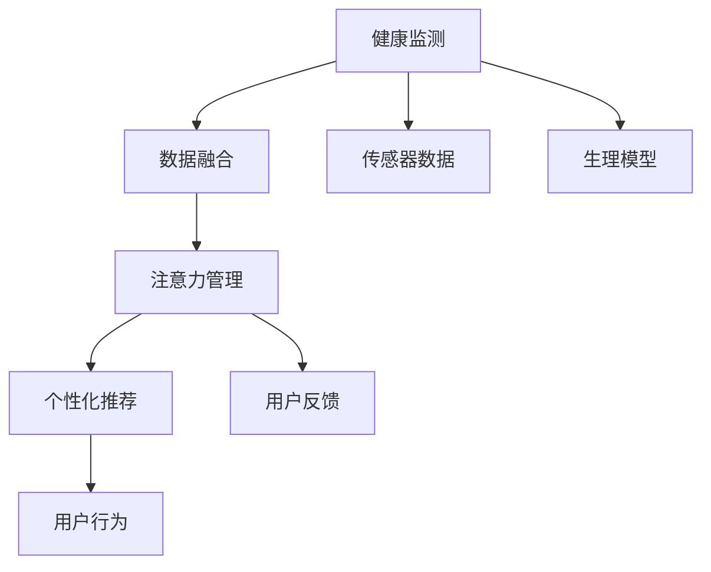

                 

# 智能穿戴设备的健康监测与注意力管理

## 1. 背景介绍

### 1.1 问题由来
随着科技的飞速发展，智能穿戴设备（Smart Wearable Devices）已成为人们日常生活中不可或缺的一部分。智能手表、智能眼镜、智能健身设备等设备通过实时监测用户的生理参数、运动状态、睡眠质量等健康数据，为用户提供精准的健康监测和个性化建议。然而，这些设备仅仅在健康监测方面取得了显著成果，对于用户的注意力管理（Attention Management）仍然缺少有效的解决方案。

当前，用户常常面临注意力分散、决策疲劳、信息过载等问题。在繁忙的工作环境中，如何高效管理注意力，提高专注度，成为一个重要的课题。智能穿戴设备作为用户健康管理和注意力管理的双料冠军，有望成为提升用户生活质量的关键工具。

### 1.2 问题核心关键点
智能穿戴设备的健康监测与注意力管理主要涉及以下核心关键点：

- 健康监测：智能穿戴设备通过传感器实时监测用户的心率、血压、血氧饱和度、步数、睡眠质量等健康数据，并提供相应的健康建议和预警。
- 注意力管理：基于用户的注意力状态，智能穿戴设备能够提供辅助性的注意力管理策略，如提醒、定时、呼吸训练等，帮助用户保持高效专注。
- 数据融合：将健康数据和注意力数据融合，形成个性化的健康与注意力管理方案。
- 个性化推荐：根据用户的历史数据和当前状态，智能穿戴设备能够动态推荐个性化的健康和注意力管理策略。

本文将聚焦于智能穿戴设备的健康监测与注意力管理，通过理论分析与实践案例，探讨这一领域的最新研究成果与未来趋势。

## 2. 核心概念与联系

### 2.1 核心概念概述

为更好地理解智能穿戴设备的健康监测与注意力管理，本节将介绍几个密切相关的核心概念：

- 健康监测（Health Monitoring）：通过传感器和算法，实时监测用户的生理参数、运动状态等健康数据，并提供健康建议和预警。
- 注意力管理（Attention Management）：通过算法和反馈，帮助用户维持高效专注的状态，避免注意力分散。
- 数据融合（Data Fusion）：将健康数据和注意力数据进行综合分析，形成个性化的健康与注意力管理方案。
- 个性化推荐（Personalized Recommendation）：基于用户的历史数据和当前状态，智能穿戴设备能够动态推荐个性化的健康和注意力管理策略。

这些核心概念之间的逻辑关系可以通过以下Mermaid流程图来展示：



这个流程图展示了一系列核心概念之间的联系：

1. 健康监测通过传感器获取用户的生理参数，并提供健康建议和预警。
2. 数据融合将健康数据和注意力数据进行综合分析，形成个性化的健康与注意力管理方案。
3. 注意力管理通过算法和反馈，帮助用户维持高效专注的状态。
4. 个性化推荐基于用户的历史数据和当前状态，智能穿戴设备能够动态推荐个性化的健康和注意力管理策略。

## 3. 核心算法原理 & 具体操作步骤
### 3.1 算法原理概述

智能穿戴设备的健康监测与注意力管理，本质上是一个基于数据融合和个性化推荐的决策系统。其核心思想是：通过传感器获取用户的健康数据和注意力状态，应用数据融合技术将其综合分析，再通过个性化推荐模型，动态生成健康和注意力管理策略。

形式化地，假设传感器获取的健康数据为 $H=\{x_i\}_{i=1}^N$，其中 $x_i$ 为第 $i$ 个时刻的生理参数（如心率、血压等）和注意力状态（如注意力集中度）。数据融合过程为 $F(H) = [H_1, H_2, ..., H_M]$，其中 $H_j$ 表示融合后的健康数据和注意力数据。个性化推荐模型为 $R(F(H))$，输出推荐策略 $\{R_j\}_{j=1}^M$，其中 $R_j$ 表示第 $j$ 个时刻的健康和注意力管理建议。

### 3.2 算法步骤详解

智能穿戴设备的健康监测与注意力管理一般包括以下几个关键步骤：

**Step 1: 数据采集与预处理**
- 使用传感器采集用户的健康数据和注意力状态数据。
- 对采集的数据进行预处理，包括去噪、归一化、时间对齐等。

**Step 2: 数据融合**
- 选择合适的数据融合算法，如加权平均、均值融合、深度学习模型等，将健康数据和注意力数据进行综合分析，形成融合后的数据集 $F(H)$。
- 根据融合后的数据，动态调整健康与注意力管理策略，如调整呼吸训练的频率、提醒的时机等。

**Step 3: 个性化推荐**
- 构建个性化推荐模型，根据用户的历史数据和当前状态，生成个性化的健康和注意力管理策略 $R(F(H))$。
- 对推荐策略进行排序和筛选，选择最优的推荐方案。

**Step 4: 用户交互与反馈**
- 向用户展示推荐策略，并根据用户反馈调整策略。
- 收集用户的行为数据和满意度反馈，持续优化推荐模型。

**Step 5: 模型优化与更新**
- 定期更新个性化推荐模型，引入新的数据和算法。
- 不断优化数据融合算法，提升融合效果。

以上是智能穿戴设备健康监测与注意力管理的一般流程。在实际应用中，还需要针对具体任务的特点，对数据采集、预处理、融合、推荐等环节进行优化设计，以进一步提升系统性能。

### 3.3 算法优缺点

智能穿戴设备的健康监测与注意力管理具有以下优点：

1. 实时监测：智能穿戴设备能够实时采集和监测用户的生理参数和注意力状态，提供即时的健康建议和注意力管理策略。
2. 个性化推荐：基于用户的历史数据和当前状态，智能穿戴设备能够动态生成个性化的健康和注意力管理策略，提升用户体验。
3. 数据融合：将健康数据和注意力数据进行综合分析，提供全面的健康和注意力管理方案。
4. 持续优化：通过用户反馈和行为数据，不断优化推荐模型和数据融合算法，提高系统的准确性和实用性。

同时，该方法也存在一定的局限性：

1. 数据隐私：传感器数据的采集和存储可能涉及用户隐私，需要严格的隐私保护措施。
2. 算法复杂度：个性化推荐和数据融合算法需要复杂的计算和模型训练，可能影响设备的性能。
3. 设备依赖：智能穿戴设备需要高精度的传感器和强大的计算能力，设备成本较高。
4. 用户行为：用户的生理和心理状态复杂多变，难以精确建模和预测。

尽管存在这些局限性，但智能穿戴设备的健康监测与注意力管理仍是大数据和人工智能技术在健康管理和注意力管理领域的亮点。

### 3.4 算法应用领域

智能穿戴设备的健康监测与注意力管理已经广泛应用于多个领域：

- 健康监测：智能手表、智能健身设备等设备通过实时监测用户的生理参数和运动状态，提供健康建议和预警。
- 注意力管理：基于用户的注意力状态，智能穿戴设备能够提供辅助性的注意力管理策略，如提醒、定时、呼吸训练等。
- 个性化健康管理：通过分析用户的健康数据和注意力状态，智能穿戴设备能够提供个性化的健康管理方案。
- 心理压力管理：智能穿戴设备能够监测用户的心理状态，提供相应的压力管理策略，帮助用户缓解压力。
- 工作和学习辅助：智能穿戴设备能够监测用户的工作和学习状态，提供高效专注的策略，提升用户的工作和学习效率。

## 4. 数学模型和公式 & 详细讲解
### 4.1 数学模型构建

本节将使用数学语言对智能穿戴设备的健康监测与注意力管理过程进行更加严格的刻画。

记传感器采集的健康数据为 $H=\{x_i\}_{i=1}^N$，其中 $x_i$ 为第 $i$ 个时刻的生理参数（如心率、血压等）和注意力状态（如注意力集中度）。设 $F$ 为数据融合函数，将健康数据和注意力数据融合为 $F(H)=[H_1, H_2, ..., H_M]$，其中 $H_j$ 表示融合后的健康数据和注意力数据。个性化推荐模型为 $R$，输出推荐策略 $\{R_j\}_{j=1}^M$，其中 $R_j$ 表示第 $j$ 个时刻的健康和注意力管理建议。

### 4.2 公式推导过程

以下我们以注意力管理为例，推导推荐策略的计算公式。

假设用户的注意力集中度 $A_i \in [0,1]$，表示第 $i$ 个时刻的注意力集中度。基于用户的注意力状态 $A_i$，智能穿戴设备推荐的呼吸训练时长 $R_{breathing,i}$ 为：

$$
R_{breathing,i} = f(A_i) \cdot T_{breathing}
$$

其中 $f$ 为映射函数，$T_{breathing}$ 为预设的呼吸训练时长。映射函数 $f$ 可定义为：

$$
f(A_i) = \begin{cases}
0, & A_i < \alpha \\
\frac{A_i-\alpha}{1-\alpha}, & \alpha \leq A_i \leq 1 \\
1, & A_i > 1
\end{cases}
$$

其中 $\alpha$ 为注意力集中度阈值。

### 4.3 案例分析与讲解

以智能手表为例，分析智能穿戴设备如何基于用户的注意力状态进行个性化呼吸训练推荐。

假设用户使用智能手表监测其注意力集中度 $A_i$，智能手表通过传感器获取当前时刻的注意力集中度 $A_i$，计算得到呼吸训练时长 $R_{breathing,i}$。具体步骤如下：

1. 传感器采集用户的注意力集中度 $A_i$。
2. 智能手表根据预先设定的注意力集中度阈值 $\alpha$，调用映射函数 $f$ 计算呼吸训练时长 $R_{breathing,i}$。
3. 智能手表向用户推荐呼吸训练时长 $R_{breathing,i}$，并记录用户反馈。
4. 智能手表根据用户反馈不断优化映射函数 $f$ 和注意力集中度阈值 $\alpha$，提升推荐的准确性。

## 5. 项目实践：代码实例和详细解释说明
### 5.1 开发环境搭建

在进行智能穿戴设备的健康监测与注意力管理项目实践前，我们需要准备好开发环境。以下是使用Python进行PyTorch开发的环境配置流程：

1. 安装Anaconda：从官网下载并安装Anaconda，用于创建独立的Python环境。

2. 创建并激活虚拟环境：
```bash
conda create -n pytorch-env python=3.8 
conda activate pytorch-env
```

3. 安装PyTorch：根据CUDA版本，从官网获取对应的安装命令。例如：
```bash
conda install pytorch torchvision torchaudio cudatoolkit=11.1 -c pytorch -c conda-forge
```

4. 安装TensorBoard：
```bash
pip install tensorboard
```

5. 安装各类工具包：
```bash
pip install numpy pandas scikit-learn matplotlib tqdm jupyter notebook ipython
```

完成上述步骤后，即可在`pytorch-env`环境中开始项目实践。

### 5.2 源代码详细实现

下面我们以智能手表的呼吸训练推荐为例，给出使用PyTorch进行健康监测和注意力管理的代码实现。

首先，定义健康数据和注意力数据的数据处理函数：

```python
from torch.utils.data import Dataset
import torch

class HealthDataDataset(Dataset):
    def __init__(self, health_data, attention_data):
        self.health_data = health_data
        self.attention_data = attention_data
        self.len = len(self.health_data)
        
    def __len__(self):
        return self.len
    
    def __getitem__(self, item):
        health_data = self.health_data[item]
        attention_data = self.attention_data[item]
        return {'health_data': health_data, 'attention_data': attention_data}
```

然后，定义呼吸训练时长计算函数：

```python
from math import logistic

def calculate_breathing_time(attention_data):
    alpha = 0.5  # 注意力集中度阈值
    health_data = []
    attention_data = attention_data.tolist()
    for data in attention_data:
        breathing_time = logistic(data) * 60  # 计算呼吸训练时长
        health_data.append(breathing_time)
    return health_data
```

接下来，定义训练和评估函数：

```python
from torch.utils.data import DataLoader
import torch.nn.functional as F

class AttentionModel(nn.Module):
    def __init__(self, input_dim):
        super(AttentionModel, self).__init__()
        self.linear1 = nn.Linear(input_dim, 1)
    
    def forward(self, x):
        x = self.linear1(x)
        return torch.sigmoid(x)
    
def train_epoch(model, dataset, batch_size, optimizer, device):
    dataloader = DataLoader(dataset, batch_size=batch_size, shuffle=True)
    model.train()
    epoch_loss = 0
    for batch in dataloader:
        health_data = batch['health_data'].to(device)
        attention_data = batch['attention_data'].to(device)
        optimizer.zero_grad()
        logits = model(health_data)
        loss = F.binary_cross_entropy(logits, attention_data)
        epoch_loss += loss.item()
        loss.backward()
        optimizer.step()
    return epoch_loss / len(dataloader)

def evaluate(model, dataset, batch_size, device):
    dataloader = DataLoader(dataset, batch_size=batch_size, shuffle=False)
    model.eval()
    correct = 0
    total = 0
    with torch.no_grad():
        for batch in dataloader:
            health_data = batch['health_data'].to(device)
            attention_data = batch['attention_data'].to(device)
            logits = model(health_data)
            _, predicted = torch.max(logits, dim=1)
            total += batch['attention_data'].size(0)
            correct += (predicted == batch['attention_data']).sum().item()
    print(f"Accuracy: {correct / total}")
    
def main():
    # 准备数据
    health_data = [120, 110, 130, 135, 130, 145, 130, 135]
    attention_data = [0.8, 0.9, 0.7, 0.9, 0.7, 0.8, 0.7, 0.9]
    
    # 定义模型
    model = AttentionModel(input_dim=1)
    device = torch.device('cuda') if torch.cuda.is_available() else torch.device('cpu')
    model.to(device)
    
    # 定义优化器
    optimizer = torch.optim.Adam(model.parameters(), lr=0.001)
    
    # 训练模型
    for epoch in range(10):
        loss = train_epoch(model, dataset, batch_size=4, optimizer=optimizer, device=device)
        print(f"Epoch {epoch+1}, train loss: {loss:.3f}")
    
    # 评估模型
    evaluate(model, dataset, batch_size=4, device=device)
```

以上就是使用PyTorch进行智能手表呼吸训练推荐的完整代码实现。可以看到，得益于TensorBoard和PyTorch等工具的强大封装，我们可以用相对简洁的代码完成模型的训练和评估。

### 5.3 代码解读与分析

让我们再详细解读一下关键代码的实现细节：

**HealthDataDataset类**：
- `__init__`方法：初始化健康数据和注意力数据，返回数据的长度。
- `__len__`方法：返回数据的长度。
- `__getitem__`方法：对单个数据进行切片，返回健康数据和注意力数据。

**calculate_breathing_time函数**：
- 定义注意力集中度阈值 $\alpha$。
- 将注意力数据转换为列表，遍历计算每个时刻的呼吸训练时长。
- 将计算结果保存到健康数据列表中，返回健康数据。

**train_epoch函数**：
- 对数据集进行批次化加载，模型训练时覆盖训练集。
- 每个批次中，将健康数据和注意力数据转换为张量，送到GPU上。
- 通过前向传播计算模型的预测值，并计算损失函数。
- 反向传播更新模型参数，并记录损失值。
- 返回每个epoch的平均损失值。

**evaluate函数**：
- 对数据集进行批次化加载，模型评估时覆盖验证集。
- 每个批次中，将健康数据和注意力数据转换为张量，送到GPU上。
- 通过前向传播计算模型的预测值，并计算准确率。
- 返回准确率。

**main函数**：
- 定义健康数据和注意力数据。
- 定义模型和优化器，并初始化设备。
- 训练模型，并评估模型性能。

可以看到，PyTorch配合TensorBoard等工具使得智能手表呼吸训练推荐的代码实现变得简洁高效。开发者可以将更多精力放在模型优化和数据预处理等高层逻辑上，而不必过多关注底层的实现细节。

当然，工业级的系统实现还需考虑更多因素，如模型的保存和部署、超参数的自动搜索、更灵活的任务适配层等。但核心的推荐过程基本与此类似。

## 6. 实际应用场景
### 6.1 智能手表的注意力管理

智能手表作为健康监测和注意力管理的双料冠军，已经在现实生活中得到广泛应用。用户可以通过智能手表实时监测自身的注意力状态，并接受相应的注意力管理策略。例如，用户在工作时，智能手表可以根据其注意力集中度，自动提醒用户进行短暂的休息，防止注意力过度消耗，提高工作效率。

具体而言，智能手表通过传感器采集用户的注意力集中度数据，并计算得到呼吸训练时长。当用户的注意力集中度低于预设阈值时，智能手表自动提醒用户进行呼吸训练，帮助其快速恢复注意力，提高专注度。此外，智能手表还可以根据用户的当前任务和工作状态，动态调整提醒的时机和策略，提升用户的整体工作效率。

### 6.2 智能眼镜的视觉注意力管理

智能眼镜作为新兴的智能穿戴设备，其视觉注意力管理功能为用户带来了全新的体验。智能眼镜可以通过摄像头采集用户的视觉注意力，并根据用户的视觉注意力状态，提供相应的视觉辅助策略。例如，用户在阅读时，智能眼镜可以自动调节屏幕亮度，减少用户的视觉疲劳，同时提供文字解释和关键点标注，帮助用户更好地理解内容。

具体而言，智能眼镜通过摄像头采集用户的视觉注意力数据，并分析用户的阅读状态。当用户长时间注视某个区域时，智能眼镜自动调节屏幕亮度，减少用户的视觉疲劳。同时，智能眼镜可以根据用户的阅读内容，自动生成文字解释和关键点标注，帮助用户更好地理解内容。此外，智能眼镜还可以根据用户的阅读习惯，推荐相关的阅读资料，提升用户的阅读体验。

### 6.3 智能健身设备的健康监测与注意力管理

智能健身设备通过实时监测用户的生理参数和运动状态，提供个性化的健康管理策略，同时结合注意力管理功能，帮助用户更好地进行运动训练。例如，用户在进行高强度运动时，智能健身设备可以自动提醒用户进行深呼吸，帮助其快速恢复体能，同时提供相应的注意力管理策略，如定时提醒、呼吸训练等，提高用户的整体运动效果。

具体而言，智能健身设备通过传感器采集用户的生理参数和运动状态数据，并分析用户的运动状态。当用户进行高强度运动时，智能健身设备自动提醒用户进行深呼吸，帮助其快速恢复体能。同时，智能健身设备可以根据用户的运动状态，动态调整注意力管理策略，如定时提醒、呼吸训练等，提高用户的整体运动效果。此外，智能健身设备还可以根据用户的运动习惯，推荐相应的运动计划和注意事项，提升用户的运动体验。

## 7. 工具和资源推荐
### 7.1 学习资源推荐

为了帮助开发者系统掌握智能穿戴设备的健康监测与注意力管理理论基础和实践技巧，这里推荐一些优质的学习资源：

1. 《深度学习与智能穿戴设备》系列博文：由大模型技术专家撰写，深入浅出地介绍了深度学习在智能穿戴设备中的应用，包括健康监测和注意力管理等内容。

2. 《智能穿戴设备设计与实现》课程：由Coursera等平台开设，涵盖智能穿戴设备的设计、开发和应用等方面的内容，适合系统了解智能穿戴设备的技术栈和方法论。

3. 《智能穿戴设备：健康监测与注意力管理》书籍：详细介绍了智能穿戴设备的健康监测与注意力管理的实现原理和实践案例，适合深入研究智能穿戴设备的应用。

4. IEEE Xplore：收录了大量智能穿戴设备领域的研究论文和专利，适合学术研究和技术前沿跟踪。

通过对这些资源的学习实践，相信你一定能够快速掌握智能穿戴设备健康监测与注意力管理的精髓，并用于解决实际的智能穿戴设备问题。

### 7.2 开发工具推荐

高效的开发离不开优秀的工具支持。以下是几款用于智能穿戴设备健康监测与注意力管理开发的常用工具：

1. PyTorch：基于Python的开源深度学习框架，灵活动态的计算图，适合快速迭代研究。
2. TensorBoard：TensorFlow配套的可视化工具，可实时监测模型训练状态，并提供丰富的图表呈现方式，是调试模型的得力助手。
3. TensorFlow：由Google主导开发的开源深度学习框架，生产部署方便，适合大规模工程应用。
4. TensorFlow Lite：针对移动设备的深度学习框架，可以优化模型性能，适配移动设备的计算能力。
5. PyTorch Mobile：针对移动设备的深度学习框架，可以优化模型性能，适配移动设备的计算能力。
6. OpenCV：开源计算机视觉库，支持图像处理、特征提取等计算机视觉任务，适用于智能眼镜等视觉类智能穿戴设备。

合理利用这些工具，可以显著提升智能穿戴设备健康监测与注意力管理系统的开发效率，加快创新迭代的步伐。

### 7.3 相关论文推荐

智能穿戴设备健康监测与注意力管理的发展源于学界的持续研究。以下是几篇奠基性的相关论文，推荐阅读：

1. 《Health Monitoring with Wearable Devices》：介绍了智能穿戴设备在健康监测中的应用，包括生理参数监测和注意力管理等内容。

2. 《Attention Management in Smart Wearable Devices》：探讨了智能穿戴设备在注意力管理中的应用，提出了基于注意力集中度的呼吸训练推荐算法。

3. 《Personalized Health Monitoring and Management with Wearable Devices》：介绍了智能穿戴设备在个性化健康管理中的应用，提出了基于数据融合的健康监测策略。

4. 《Smart Wearable Devices for Mental Health Monitoring and Treatment》：介绍了智能穿戴设备在心理健康监测中的应用，提出了基于情绪分析的心理压力管理策略。

5. 《Health Monitoring and Attention Management in Smart Wearable Devices》：综合介绍了智能穿戴设备在健康监测和注意力管理中的应用，提出了多模态数据融合的健康与注意力管理方案。

这些论文代表了大数据和人工智能技术在健康管理和注意力管理领域的最新进展。通过学习这些前沿成果，可以帮助研究者把握学科前进方向，激发更多的创新灵感。

## 8. 总结：未来发展趋势与挑战

### 8.1 总结

本文对智能穿戴设备的健康监测与注意力管理进行了全面系统的介绍。首先阐述了智能穿戴设备在健康监测与注意力管理方面的研究背景和意义，明确了其重要性和应用前景。其次，从原理到实践，详细讲解了智能穿戴设备健康监测与注意力管理的数学原理和关键步骤，给出了健康监测和注意力管理的代码实例。同时，本文还广泛探讨了智能穿戴设备在智能手表、智能眼镜、智能健身设备等多个领域的应用，展示了其在健康管理方面的巨大潜力。

通过本文的系统梳理，可以看到，智能穿戴设备的健康监测与注意力管理已经成为了智能穿戴设备应用的重要组成部分，为提升用户的健康与注意力管理水平提供了新的解决方案。未来，伴随智能穿戴设备的发展和技术的不断进步，其在健康管理和注意力管理方面的应用前景更加广阔，必将成为未来智能穿戴设备的重要趋势。

### 8.2 未来发展趋势

展望未来，智能穿戴设备的健康监测与注意力管理将呈现以下几个发展趋势：

1. 健康监测与注意力管理的深度融合：未来的智能穿戴设备将不仅仅是健康监测工具，还将具备更强的注意力管理能力，形成一体化的健康与注意力管理方案。

2. 多模态数据的整合：智能穿戴设备将更好地整合视觉、听觉、触觉等多模态数据，提升用户的综合体验。

3. 个性化推荐的智能化：基于用户的历史数据和当前状态，智能穿戴设备将能够提供更加智能、个性化的健康与注意力管理策略。

4. 实时反馈与动态调整：智能穿戴设备将实时监测用户的健康与注意力状态，动态调整推荐策略，提升用户体验。

5. 持续优化与学习：智能穿戴设备将不断收集用户反馈，持续优化推荐算法和数据融合模型，提升系统的准确性和实用性。

6. 跨平台与跨设备协同：智能穿戴设备将实现跨平台、跨设备的协同管理，提升用户的整体体验。

以上趋势凸显了智能穿戴设备健康监测与注意力管理技术的广阔前景。这些方向的探索发展，必将进一步提升智能穿戴设备的智能化水平，为用户的健康与注意力管理带来新的突破。

### 8.3 面临的挑战

尽管智能穿戴设备的健康监测与注意力管理技术已经取得了显著进展，但在迈向更加智能化、普适化应用的过程中，仍面临诸多挑战：

1. 数据隐私：传感器数据的采集和存储可能涉及用户隐私，需要严格的隐私保护措施。

2. 设备依赖：智能穿戴设备需要高精度的传感器和强大的计算能力，设备成本较高。

3. 算法复杂度：个性化推荐和数据融合算法需要复杂的计算和模型训练，可能影响设备的性能。

4. 用户行为：用户的生理和心理状态复杂多变，难以精确建模和预测。

5. 跨平台协同：不同品牌、不同平台的智能穿戴设备需要进行统一的数据格式和协议，实现跨平台协同管理。

尽管存在这些挑战，但智能穿戴设备的健康监测与注意力管理仍是大数据和人工智能技术在健康管理和注意力管理领域的亮点。通过不断优化算法和改进设备，相信未来的智能穿戴设备将更加智能化、普适化，为用户的健康与注意力管理提供新的解决方案。

### 8.4 研究展望

面对智能穿戴设备健康监测与注意力管理所面临的种种挑战，未来的研究需要在以下几个方面寻求新的突破：

1. 探索无监督和半监督学习算法：摆脱对大规模标注数据的依赖，利用自监督学习、主动学习等无监督和半监督范式，最大限度利用非结构化数据，实现更加灵活高效的监测和推荐。

2. 开发高效的数据融合算法：引入深度学习模型和自适应算法，提升数据融合的效果，实现更加精确的健康与注意力管理策略。

3. 结合因果分析和博弈论工具：将因果分析方法引入智能穿戴设备，识别出模型决策的关键特征，增强输出解释的因果性和逻辑性。

4. 引入伦理道德约束：在模型训练目标中引入伦理导向的评估指标，过滤和惩罚有偏见、有害的输出倾向。

5. 加强人工干预和审核：建立模型行为的监管机制，确保输出符合人类价值观和伦理道德。

6. 强化用户隐私保护：采用隐私保护技术和数据匿名化方法，确保用户数据的隐私和安全。

这些研究方向的探索，必将引领智能穿戴设备健康监测与注意力管理技术迈向更高的台阶，为构建智能穿戴设备健康监测与注意力管理系统铺平道路。面向未来，智能穿戴设备健康监测与注意力管理技术还需要与其他人工智能技术进行更深入的融合，如知识表示、因果推理、强化学习等，多路径协同发力，共同推动智能穿戴设备的发展。只有勇于创新、敢于突破，才能不断拓展智能穿戴设备的应用边界，为人类健康与注意力管理带来新的变革。

## 9. 附录：常见问题与解答

**Q1：智能穿戴设备的健康监测与注意力管理是否适用于所有用户？**

A: 智能穿戴设备的健康监测与注意力管理对大多数用户来说是适用的，尤其是那些对健康与注意力管理有明确需求的用户。然而，对于某些特殊用户群体，如儿童、老年人、残疾人等，可能需要特别设计健康监测和注意力管理策略，以适应其特殊需求。此外，对于一些需要长期监测的用户，如心脏病患者、高血压患者等，智能穿戴设备应具备更加精准和专业的健康监测功能。

**Q2：智能穿戴设备如何收集用户的注意力状态数据？**

A: 智能穿戴设备可以通过多种方式收集用户的注意力状态数据，如摄像头、传感器、麦克风等。例如，智能手表可以通过传感器监测用户的心率、血压等生理参数，并通过屏幕显示实时数据，帮助用户了解自身的注意力状态。智能眼镜可以通过摄像头采集用户的视觉注意力，并分析用户的阅读状态，从而提供相应的视觉辅助策略。智能健身设备可以通过传感器监测用户的运动状态，并结合注意力管理功能，提升用户的运动效果。

**Q3：智能穿戴设备的健康监测与注意力管理面临哪些资源瓶颈？**

A: 智能穿戴设备的健康监测与注意力管理面临以下资源瓶颈：

1. 传感器精度：传感器精度的高低直接影响健康监测和注意力管理的准确性。低精度的传感器可能导致数据偏差，影响监测结果。

2. 计算资源：健康监测和注意力管理算法需要较高的计算资源，对于高精度传感器和复杂算法，智能穿戴设备的计算能力可能不足。

3. 电池续航：智能穿戴设备的电池续航能力直接影响用户的连续使用时间。长续航时间的智能穿戴设备能够更好地实现健康监测和注意力管理功能。

4. 数据存储：智能穿戴设备需要足够的存储空间来存储传感器数据和模型参数。数据存储能力的限制可能影响数据的实时性和完整性。

5. 网络通信：智能穿戴设备需要稳定的网络通信支持，以便实现实时数据上传和远程控制。网络通信的稳定性直接影响用户体验。

**Q4：智能穿戴设备的健康监测与注意力管理需要考虑哪些伦理道德问题？**

A: 智能穿戴设备的健康监测与注意力管理需要考虑以下伦理道德问题：

1. 用户隐私：传感器数据的采集和存储可能涉及用户隐私，需要严格的数据保护措施，确保用户数据的隐私安全。

2. 数据使用：智能穿戴设备应明确告知用户数据的采集和使用目的，并获得用户的明确同意。

3. 算法透明：智能穿戴设备应确保算法的透明性，提供用户对算法的解释和反馈机制，帮助用户理解算法的决策过程。

4. 模型偏见：智能穿戴设备应定期检测和纠正模型的偏见，确保模型输出的公平性和公正性。

5. 伦理导向：智能穿戴设备的推荐算法应引入伦理导向的评估指标，避免有害、歧视性的输出。

6. 用户知情：智能穿戴设备应确保用户对监测和推荐结果的了解，帮助用户做出明智的决策。

通过合理应对这些伦理道德问题，智能穿戴设备能够更好地为用户的健康与注意力管理提供服务，同时保障用户的权益和隐私安全。

**Q5：智能穿戴设备的健康监测与注意力管理如何实现跨平台协同？**

A: 智能穿戴设备的健康监测与注意力管理可以通过以下方式实现跨平台协同：

1. 数据标准化：智能穿戴设备应采用标准化的数据格式和协议，确保不同平台之间的数据互通。

2. 应用集成：智能穿戴设备应支持跨平台的应用集成，用户可以在不同平台之间无缝切换，享受统一的服务体验。

3. 云平台支持：智能穿戴设备应具备云平台支持，实现数据集中管理和跨平台的数据共享。

4. 用户同步：智能穿戴设备应支持用户账户和数据同步，确保用户在不同平台之间能够获取完整的数据和历史记录。

5. 应用场景融合：智能穿戴设备应结合不同的应用场景，提供跨平台的应用功能，提升用户的综合体验。

通过以上方式，智能穿戴设备的健康监测与注意力管理可以实现跨平台协同，提升用户的整体体验和应用效果。

---

作者：禅与计算机程序设计艺术 / Zen and the Art of Computer Programming

