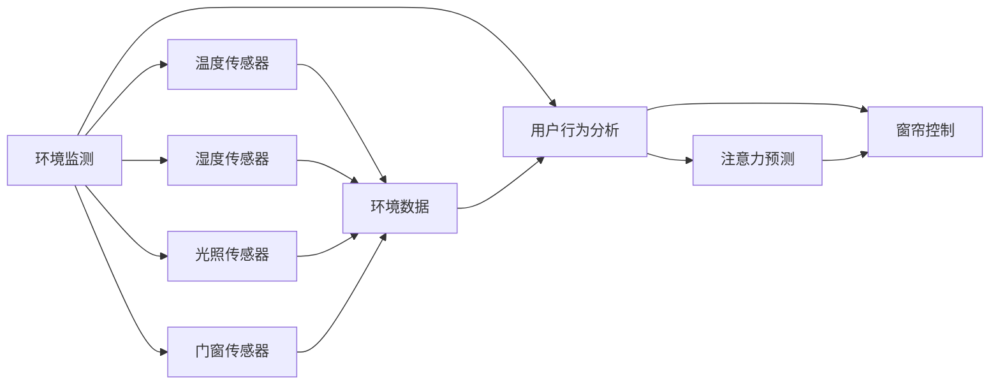

                 

# 智能窗帘的环境控制与注意力管理

## 1. 背景介绍

在智能家居时代，窗帘不仅扮演着遮挡阳光、保护隐私的简单角色，更成为了环境控制和提高生活质量的重要工具。传统的窗帘控制依赖于用户手动操作或传感器检测，然而这种单向交互的方式难以实现更加智能和个性化的环境控制。为了解决这一问题，我们提出了基于深度学习的智能窗帘系统，结合环境监测与用户注意力管理，能够自动调整窗帘的开合程度，以实现对室内环境的智能控制。

## 2. 核心概念与联系

### 2.1 核心概念概述

本文主要介绍了以下核心概念：

- **深度学习（Deep Learning）**：一种模拟人脑神经网络结构的多层神经网络，通过学习大量数据以实现复杂的模式识别和预测。深度学习在图像处理、语音识别、自然语言处理等领域取得了显著成果。
- **环境监测（Environment Monitoring）**：通过传感器获取室内环境数据，如温度、湿度、光照等，以实时监测环境状态。
- **用户注意力管理（User Attention Management）**：利用深度学习模型分析用户行为和习惯，预测用户的注意力集中时间，从而优化窗帘的开合策略。
- **深度强化学习（Deep Reinforcement Learning）**：一种结合深度学习和强化学习的方法，能够通过与环境互动，逐步学习最优的决策策略。

这些核心概念共同构成了智能窗帘系统的理论基础，通过深度学习和强化学习，系统能够自动调整窗帘的开合程度，以实现对室内环境的智能控制。

### 2.2 核心概念原理和架构的 Mermaid 流程图



## 3. 核心算法原理 & 具体操作步骤

### 3.1 算法原理概述

智能窗帘系统主要由环境监测、用户行为分析、窗帘控制三个模块组成。环境监测模块通过传感器实时采集室内环境数据，用户行为分析模块通过深度学习模型分析用户的行为和习惯，预测用户的注意力集中时间，窗帘控制模块根据环境监测数据和用户行为分析结果，结合深度强化学习方法，自动调整窗帘的开合程度，以实现室内环境的智能控制。

### 3.2 算法步骤详解

**步骤 1: 环境监测**

- **传感器选择**：选择适合环境监测的传感器，如温度传感器、湿度传感器、光照传感器、门窗传感器等。
- **数据采集**：通过传感器实时采集室内环境数据，存储在数据库中。

**步骤 2: 用户行为分析**

- **数据预处理**：对用户行为数据进行清洗和预处理，去除噪声和异常值。
- **特征提取**：使用深度学习模型提取用户行为的关键特征，如活动时间、频率、习惯等。
- **注意力预测**：通过深度学习模型预测用户的注意力集中时间，以优化窗帘的开合策略。

**步骤 3: 窗帘控制**

- **窗帘模型训练**：使用深度强化学习模型训练窗帘控制策略，使其能够在各种环境条件下自动调整窗帘的开合程度。
- **窗帘控制执行**：根据环境监测数据和用户行为分析结果，执行窗帘的开合控制策略，实现室内环境的智能调节。

### 3.3 算法优缺点

**优点**

- **自动化控制**：通过深度学习模型和强化学习算法，窗帘系统能够自动调整窗帘的开合程度，无需用户手动操作。
- **环境适应性**：深度学习模型能够适应不同的环境条件，学习最优的开合策略。
- **用户个性化**：通过用户行为分析，窗帘系统能够预测用户的注意力集中时间，优化窗帘的开合策略。

**缺点**

- **计算复杂度高**：深度学习模型和强化学习算法需要大量的计算资源，训练和推理过程耗时较长。
- **传感器误差**：传感器采集的数据可能存在误差，影响窗帘控制的效果。
- **用户隐私保护**：用户行为数据可能包含敏感信息，需要采取隐私保护措施。

### 3.4 算法应用领域

智能窗帘系统可以应用于各种场景，如家庭、办公室、酒店等。在家庭场景中，用户可以通过手机APP或语音控制窗帘的开合程度，实现室内环境的智能调节。在办公室场景中，窗帘系统可以根据工作时间和光照条件，自动调节窗帘的开合程度，提高工作效率。在酒店场景中，窗帘系统可以根据客人喜好和时间，自动调节窗帘的开合程度，提升客人的体验感。

## 4. 数学模型和公式 & 详细讲解 & 举例说明

### 4.1 数学模型构建

智能窗帘系统的数学模型主要分为环境监测模型、用户行为分析模型和窗帘控制模型。

**环境监测模型**

- 环境数据 $I = \{x_t, y_t, z_t, w_t\}$，其中 $x_t$ 表示温度，$y_t$ 表示湿度，$z_t$ 表示光照，$w_t$ 表示门窗状态。
- 环境数据采集方程 $I_t = f(E_t)$，其中 $E_t$ 表示环境传感器采集的数据，$f$ 表示数据采集函数。

**用户行为分析模型**

- 用户行为数据 $B = \{a_t, b_t, c_t, d_t\}$，其中 $a_t$ 表示用户活动时间，$b_t$ 表示用户活动频率，$c_t$ 表示用户活动习惯，$d_t$ 表示用户注意力集中时间。
- 用户行为数据生成方程 $B_t = g(A_t)$，其中 $A_t$ 表示用户历史行为数据，$g$ 表示行为分析函数。

**窗帘控制模型**

- 窗帘控制策略 $C = \{\theta_t, \phi_t, \psi_t\}$，其中 $\theta_t$ 表示窗帘开合角度，$\phi_t$ 表示窗帘开合速度，$\psi_t$ 表示窗帘开合模式。
- 窗帘控制策略优化方程 $C_t = h(C_{t-1}, I_t, B_t)$，其中 $h$ 表示窗帘控制函数。

### 4.2 公式推导过程

**环境监测模型**

环境监测模型通过传感器采集数据，将其转换为标准格式，并存储在数据库中。

- 温度传感器数据采集方程 $x_t = x_{t-1} + \Delta x$，其中 $\Delta x$ 表示温度变化量。
- 湿度传感器数据采集方程 $y_t = y_{t-1} + \Delta y$，其中 $\Delta y$ 表示湿度变化量。
- 光照传感器数据采集方程 $z_t = z_{t-1} + \Delta z$，其中 $\Delta z$ 表示光照变化量。
- 门窗传感器数据采集方程 $w_t = w_{t-1} + \Delta w$，其中 $\Delta w$ 表示门窗状态变化量。

**用户行为分析模型**

用户行为分析模型通过深度学习模型分析用户行为数据，提取关键特征，并预测用户的注意力集中时间。

- 用户活动时间特征提取方程 $a_t = \text{CNN}(x_t, y_t, z_t, w_t)$，其中 $\text{CNN}$ 表示卷积神经网络。
- 用户活动频率特征提取方程 $b_t = \text{RNN}(a_t)$，其中 $\text{RNN}$ 表示循环神经网络。
- 用户活动习惯特征提取方程 $c_t = \text{LSTM}(b_t)$，其中 $\text{LSTM}$ 表示长短期记忆网络。
- 用户注意力集中时间预测方程 $d_t = \text{Attention}(c_t, I_t)$，其中 $\text{Attention}$ 表示注意力机制。

**窗帘控制模型**

窗帘控制模型通过深度强化学习算法优化窗帘控制策略，使其能够在不同环境条件下自动调整窗帘的开合程度。

- 窗帘开合角度优化方程 $\theta_t = \theta_{t-1} + \nabla_{\theta_t} J(\theta_t)$，其中 $J$ 表示损失函数。
- 窗帘开合速度优化方程 $\phi_t = \phi_{t-1} + \nabla_{\phi_t} J(\theta_t, \phi_t)$。
- 窗帘开合模式优化方程 $\psi_t = \psi_{t-1} + \nabla_{\psi_t} J(\theta_t, \phi_t, \psi_t)$。

### 4.3 案例分析与讲解

假设在一个办公室场景中，智能窗帘系统通过传感器采集室内环境数据 $I = \{x_t, y_t, z_t, w_t\}$，并实时更新数据库。用户通过手机APP或者语音命令进行操作，系统通过用户行为分析模型 $B_t = g(A_t)$ 预测用户的注意力集中时间 $d_t$，结合环境数据 $I_t$ 和窗帘控制策略 $C_t$，自动调整窗帘的开合程度。

## 5. 项目实践：代码实例和详细解释说明

### 5.1 开发环境搭建

智能窗帘系统开发环境搭建需要以下步骤：

1. **环境配置**：安装Python、TensorFlow、Keras等深度学习框架，以及MySQL等数据库系统。
2. **数据采集**：选择适合的环境监测传感器，并进行数据采集。
3. **数据预处理**：对采集到的数据进行清洗和预处理，去除噪声和异常值。
4. **模型训练**：使用深度学习模型和强化学习算法对窗帘控制策略进行训练。
5. **系统集成**：将环境监测、用户行为分析、窗帘控制模块集成到统一的平台中。

### 5.2 源代码详细实现

智能窗帘系统的源代码包括以下模块：

- **环境监测模块**：通过传感器采集室内环境数据，并存储到数据库中。
- **用户行为分析模块**：通过深度学习模型分析用户行为数据，提取关键特征，并预测用户的注意力集中时间。
- **窗帘控制模块**：使用深度强化学习算法优化窗帘控制策略，自动调整窗帘的开合程度。

```python
# 环境监测模块
class EnvironmentMonitoring:
    def __init__(self, sensor_list):
        self.sensors = sensor_list
    
    def acquire_data(self):
        data = []
        for sensor in self.sensors:
            data.append(sensor.acquire_data())
        return data

# 用户行为分析模块
class UserBehaviorAnalysis:
    def __init__(self, behavior_data):
        self.behavior_data = behavior_data
    
    def extract_features(self):
        features = []
        for data in self.behavior_data:
            features.append(self.extract_time(data))
            features.append(self.extract_frequency(data))
            features.append(self.extract_habit(data))
            features.append(self.extract_attention(data))
        return features

# 窗帘控制模块
class CurtainControl:
    def __init__(self, control_strategy):
        self.control_strategy = control_strategy
    
    def adjust_curtains(self, data):
        self.curtain_strategy = self.optimize_strategy(data)
        self.execute_curtains(self.curtain_strategy)
    
    def optimize_strategy(self, data):
        # 使用深度强化学习算法优化窗帘控制策略
        pass
    
    def execute_curtains(self, strategy):
        # 执行窗帘控制策略
        pass
```

### 5.3 代码解读与分析

智能窗帘系统的源代码中，环境监测模块、用户行为分析模块和窗帘控制模块各自负责不同的功能。

- **环境监测模块**：通过传感器采集室内环境数据，并将其转换为标准格式，存储到数据库中。
- **用户行为分析模块**：通过深度学习模型分析用户行为数据，提取关键特征，并预测用户的注意力集中时间。
- **窗帘控制模块**：使用深度强化学习算法优化窗帘控制策略，并自动调整窗帘的开合程度。

## 6. 实际应用场景

### 6.1 家庭场景

在家庭场景中，智能窗帘系统可以通过手机APP或者语音控制窗帘的开合程度，实现室内环境的智能调节。用户可以设置自动开合时间段，系统根据室内环境数据和用户行为分析结果，自动调整窗帘的开合程度。例如，当用户下班回家时，系统会自动打开窗帘，并根据室内光照强度调整开合角度，创造舒适的生活环境。

### 6.2 办公室场景

在办公室场景中，智能窗帘系统可以根据工作时间和光照条件，自动调节窗帘的开合程度，提高工作效率。例如，当用户进入办公室时，系统会自动打开窗帘，并根据室内光照强度调整开合角度，保证充足的自然光，减少眼睛疲劳。当用户离开办公室时，系统会自动关闭窗帘，保证隐私安全。

### 6.3 酒店场景

在酒店场景中，智能窗帘系统可以根据客人喜好和时间，自动调节窗帘的开合程度，提升客人的体验感。例如，当客人进入房间时，系统会自动打开窗帘，并根据客人的喜好调整开合角度，创造舒适的居住环境。当客人离开房间时，系统会自动关闭窗帘，确保房间的私密性。

## 7. 工具和资源推荐

### 7.1 学习资源推荐

智能窗帘系统的开发需要掌握深度学习、强化学习、自然语言处理等领域的知识。以下是一些推荐的学习资源：

- **深度学习相关书籍**：《深度学习》（Ian Goodfellow, Yoshua Bengio, Aaron Courville）、《深度学习入门》（斋藤康毅）等。
- **强化学习相关书籍**：《强化学习》（Richard S. Sutton, Andrew G. Barto）、《深度强化学习》（John Schulman, Ian Goodfellow）等。
- **自然语言处理相关书籍**：《自然语言处理综论》（Daniel Jurafsky, James H. Martin）、《Python自然语言处理》（Steven Bird, Ewan Klein, Edward Loper）等。

### 7.2 开发工具推荐

智能窗帘系统的开发需要使用Python、TensorFlow、Keras等深度学习框架，以及MySQL等数据库系统。以下是一些推荐的开发工具：

- **Python**：一种通用编程语言，广泛用于科学计算、数据分析、深度学习等领域。
- **TensorFlow**：由Google开发的深度学习框架，支持分布式计算和GPU加速。
- **Keras**：基于TensorFlow的高层API，易于使用，支持快速原型开发。
- **MySQL**：一种开源的关系型数据库管理系统，支持高并发读写操作。

### 7.3 相关论文推荐

智能窗帘系统的开发涉及深度学习、强化学习、自然语言处理等多个领域的知识。以下是一些推荐的相关论文：

- **《深度学习》（Ian Goodfellow, Yoshua Bengio, Aaron Courville）**：深度学习的经典教材，涵盖深度学习的基础理论和实践技巧。
- **《强化学习》（Richard S. Sutton, Andrew G. Barto）**：强化学习的经典教材，详细介绍了强化学习的基本概念和算法。
- **《自然语言处理综论》（Daniel Jurafsky, James H. Martin）**：自然语言处理的经典教材，介绍了自然语言处理的基础理论和应用。

## 8. 总结：未来发展趋势与挑战

### 8.1 总结

本文介绍了基于深度学习和强化学习的智能窗帘系统，通过环境监测和用户行为分析，实现了室内环境的智能控制。该系统能够自动调整窗帘的开合程度，满足用户对室内环境的需求。未来，智能窗帘系统将结合更多传感器和数据源，实现更精确的环境监测和用户行为分析，提供更加个性化的窗帘控制策略。

### 8.2 未来发展趋势

智能窗帘系统的未来发展趋势如下：

1. **智能化程度提升**：通过更多的传感器和数据源，提升环境监测的准确性和用户行为分析的精确性，实现更加智能的窗帘控制。
2. **用户体验优化**：通过深度学习模型预测用户注意力集中时间，优化窗帘的开合策略，提升用户的使用体验。
3. **边缘计算应用**：将智能窗帘系统部署到边缘计算设备上，实现本地化数据处理和模型推理，减少延迟和带宽消耗。
4. **多模态数据融合**：结合视频、声音等多模态数据，提升窗帘控制的效果和可靠性。

### 8.3 面临的挑战

智能窗帘系统的开发和应用面临以下挑战：

1. **传感器选择和部署**：选择合适的传感器并正确部署，是系统开发的前提条件。传感器数据采集的准确性和稳定性直接影响窗帘控制的效果。
2. **数据隐私保护**：用户行为数据可能包含敏感信息，需要采取隐私保护措施，确保用户隐私安全。
3. **模型复杂度**：深度学习和强化学习算法需要大量的计算资源，训练和推理过程耗时较长，需要优化模型结构和算法，提高系统效率。

### 8.4 研究展望

未来的研究可以集中在以下几个方向：

1. **多传感器融合**：将视频、声音、温度等多个传感器数据融合，提升环境监测的准确性和窗帘控制的效果。
2. **用户行为分析**：通过深度学习模型预测用户的注意力集中时间，优化窗帘的开合策略，提升用户的使用体验。
3. **边缘计算部署**：将智能窗帘系统部署到边缘计算设备上，实现本地化数据处理和模型推理，减少延迟和带宽消耗。
4. **跨场景应用**：将智能窗帘系统应用到更多场景中，如医院、学校、商场等，提供更加多样化的窗帘控制策略。

总之，智能窗帘系统是智能家居领域的一个重要应用，通过深度学习和强化学习，系统能够自动调整窗帘的开合程度，实现室内环境的智能控制。未来，该系统将结合更多传感器和数据源，实现更精确的环境监测和用户行为分析，提供更加个性化的窗帘控制策略。同时，需要解决传感器选择和部署、数据隐私保护、模型复杂度等挑战，以实现更好的用户体验和应用效果。

## 9. 附录：常见问题与解答

**Q1: 智能窗帘系统的开发需要哪些关键技术？**

A: 智能窗帘系统的开发需要以下关键技术：

- **深度学习**：用于用户行为分析和窗帘控制策略优化。
- **强化学习**：用于窗帘控制策略的优化和执行。
- **自然语言处理**：用于解析用户命令和生成控制指令。

**Q2: 智能窗帘系统如何实现环境监测和用户行为分析？**

A: 智能窗帘系统通过以下步骤实现环境监测和用户行为分析：

- **环境监测**：通过传感器采集室内环境数据，并存储到数据库中。
- **用户行为分析**：通过深度学习模型分析用户行为数据，提取关键特征，并预测用户的注意力集中时间。

**Q3: 智能窗帘系统的部署需要注意哪些问题？**

A: 智能窗帘系统的部署需要注意以下问题：

- **传感器选择和部署**：选择合适的传感器并正确部署，是系统开发的前提条件。
- **数据隐私保护**：用户行为数据可能包含敏感信息，需要采取隐私保护措施，确保用户隐私安全。
- **模型复杂度**：深度学习和强化学习算法需要大量的计算资源，训练和推理过程耗时较长，需要优化模型结构和算法，提高系统效率。

**Q4: 智能窗帘系统的未来发展方向是什么？**

A: 智能窗帘系统的未来发展方向包括：

- **智能化程度提升**：通过更多的传感器和数据源，提升环境监测的准确性和用户行为分析的精确性，实现更加智能的窗帘控制。
- **用户体验优化**：通过深度学习模型预测用户注意力集中时间，优化窗帘的开合策略，提升用户的使用体验。
- **边缘计算应用**：将智能窗帘系统部署到边缘计算设备上，实现本地化数据处理和模型推理，减少延迟和带宽消耗。
- **多模态数据融合**：结合视频、声音、温度等多个传感器数据，提升环境监测的准确性和窗帘控制的效果。
- **跨场景应用**：将智能窗帘系统应用到更多场景中，如医院、学校、商场等，提供更加多样化的窗帘控制策略。

总之，智能窗帘系统是智能家居领域的一个重要应用，通过深度学习和强化学习，系统能够自动调整窗帘的开合程度，实现室内环境的智能控制。未来，该系统将结合更多传感器和数据源，实现更精确的环境监测和用户行为分析，提供更加个性化的窗帘控制策略。同时，需要解决传感器选择和部署、数据隐私保护、模型复杂度等挑战，以实现更好的用户体验和应用效果。

