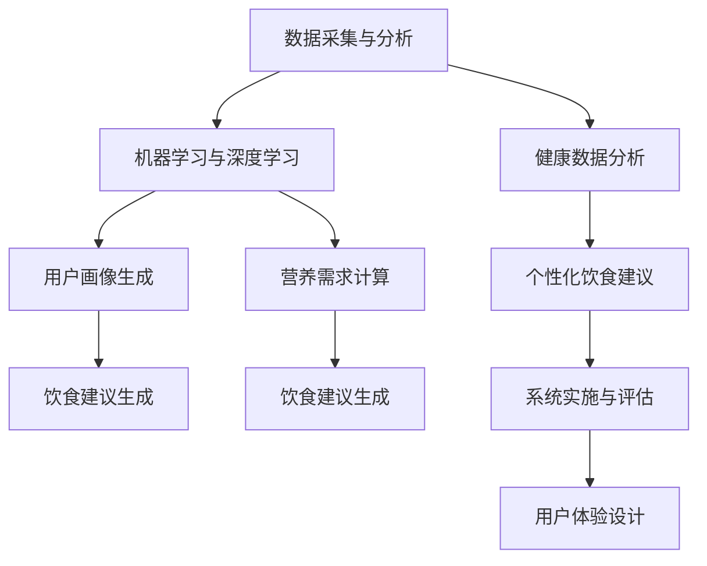

                 

# 智能营养创业：个性化饮食建议的科技支持

> 关键词：智能营养、个性化饮食、科技支持、数据驱动、健康管理、机器学习、营养科学、预测模型

## 1. 背景介绍

### 1.1 问题由来
随着人们生活水平的提高和健康意识的增强，越来越多的人开始关注个性化营养饮食的问题。传统的饮食建议往往基于一些通用的指导原则，难以满足个体的具体需求。特别是在快节奏的现代生活中，如何科学合理地规划每日饮食，既保证营养均衡，又能满足个人口味和活动量的需求，成为了一个亟待解决的难题。

### 1.2 问题核心关键点
本节将介绍几种典型的个性化饮食建议系统，并分析它们的核心原理和架构。

1. **数据采集与分析**：
   - **体征监测**：通过穿戴设备或传感器实时采集用户的健康数据（如心率、血糖、运动量等）。
   - **饮食记录**：让用户记录每天的饮食内容和活动量，获取详细的营养摄入和消耗数据。
   - **用户反馈**：通过问卷调查或自我评估，了解用户对饮食建议的满意度和不适应情况。

2. **模型构建与训练**：
   - **用户画像生成**：根据采集到的数据，构建用户健康画像，包括基本信息（如年龄、性别、体重）、营养需求、饮食偏好、运动习惯等。
   - **营养需求计算**：根据用户的健康状态和活动量，计算每日所需的营养素摄入量（如蛋白质、碳水化合物、脂肪等）。
   - **饮食建议生成**：使用机器学习算法（如回归、分类、推荐系统等），根据用户画像和营养需求，生成个性化的饮食建议。

3. **系统实施与评估**：
   - **推荐系统集成**：将生成的饮食建议整合到智能设备或应用程序中，提供实时反馈和调整。
   - **用户互动与反馈**：鼓励用户记录反馈和调整饮食建议，不断优化算法和模型。
   - **效果评估**：通过追踪用户的健康数据和饮食记录，评估饮食建议的效果，进行持续改进。

### 1.3 问题研究意义
开发智能营养系统，利用科技手段提供个性化饮食建议，具有以下重要意义：

1. **健康管理**：通过科学合理的饮食规划，帮助用户预防慢性病、保持健康体重、增强免疫力。
2. **节约时间**：自动化饮食建议生成和调整，减少用户饮食规划的复杂性和时间成本。
3. **提升生活质量**：个性化的饮食建议，满足用户的口味偏好和特殊需求，提升饮食体验。
4. **促进科技与营养科学融合**：推动营养学研究与计算机科学、数据科学等多学科的交叉融合，推动科技成果转化应用。
5. **商业潜力**：提供个性化的健康服务，有助于构建商业生态，开拓新的商业模式。

## 2. 核心概念与联系

### 2.1 核心概念概述

为了更好地理解智能营养系统，本节将介绍几个密切相关的核心概念：

1. **个性化饮食建议系统**：基于用户的健康数据和行为数据，生成个性化饮食建议的系统。系统通常包括数据采集、用户画像、营养需求计算、饮食建议生成、系统实施与评估等模块。

2. **健康数据分析**：通过收集用户的健康数据（如体征监测、饮食记录、运动量等），分析用户的健康状况和营养需求，为个性化饮食建议提供依据。

3. **机器学习与深度学习**：利用机器学习算法（如回归、分类、推荐系统等）和深度学习模型（如卷积神经网络、循环神经网络等），构建个性化的饮食建议系统，提升模型的预测和生成能力。

4. **智能硬件与穿戴设备**：提供健康数据采集和实时反馈的智能设备和穿戴设备，如智能手表、健康手环、智能秤等。

5. **用户体验设计**：注重系统的人机交互设计，提供友好的用户界面和反馈机制，增强用户的黏性和满意度。

这些核心概念之间的逻辑关系可以通过以下Mermaid流程图来展示：



这个流程图展示了个性化饮食建议系统的核心组件及其关系：

1. **数据采集与分析**是系统的基础，通过收集用户的健康数据和行为数据，构建用户画像。
2. **健康数据分析**通过分析这些数据，计算出用户的营养需求。
3. **用户画像生成**和**营养需求计算**是系统的主要功能模块，用于生成个性化的饮食建议。
4. **机器学习与深度学习**模块为系统提供了强大的算法支持，提升模型的预测和生成能力。
5. **饮食建议生成**是系统的核心输出，提供个性化的饮食建议。
6. **系统实施与评估**模块通过实时反馈和效果评估，不断优化系统性能。
7. **用户体验设计**注重人机交互和反馈机制，提升用户的使用体验。

这些组件共同构成了智能营养系统的完整框架，使得系统能够提供科学合理的个性化饮食建议。

## 3. 核心算法原理 & 具体操作步骤
### 3.1 算法原理概述

个性化饮食建议系统的主要算法原理基于机器学习和数据驱动的方法。其核心思想是：利用用户的健康数据和行为数据，构建用户画像，通过计算营养需求和预测用户偏好，生成个性化的饮食建议。

具体而言，系统可以分为以下几个关键步骤：

1. **数据采集与预处理**：通过智能设备或传感器，收集用户的健康数据和行为数据，并进行清洗和预处理。
2. **特征提取与选择**：从采集到的数据中提取关键特征，并选择对饮食建议有重要影响的特征。
3. **用户画像构建**：根据用户的健康数据和行为数据，构建用户画像，包括基本信息、健康状况、营养需求、饮食偏好、运动习惯等。
4. **营养需求计算**：基于用户画像和健康数据，计算用户每日所需的营养素摄入量。
5. **饮食建议生成**：利用机器学习算法，根据用户画像和营养需求，生成个性化的饮食建议。

### 3.2 算法步骤详解

以下是个性化饮食建议系统的详细算法步骤：

1. **数据采集与预处理**：
   - **数据来源**：智能设备、传感器、应用程序等。
   - **数据格式**：结构化数据、非结构化数据（如文本记录）、时间序列数据等。
   - **预处理**：清洗噪声、填补缺失值、归一化处理、特征提取等。

2. **特征提取与选择**：
   - **特征提取**：从采集到的数据中提取关键特征，如体重、身高、年龄、活动量、饮食习惯等。
   - **特征选择**：选择对饮食建议有重要影响的特征，如BMI、活动水平、饮食习惯等。
   - **特征工程**：对提取的特征进行编码和转换，如将文本记录转换为数字特征。

3. **用户画像构建**：
   - **基本信息**：用户的年龄、性别、身高、体重等。
   - **健康数据**：心率、血糖、血压、睡眠质量等。
   - **营养需求**：根据健康数据和活动量，计算每日所需的营养素摄入量。
   - **饮食偏好**：用户对不同食物和口味的偏好，如喜欢甜食、清淡食物等。
   - **运动习惯**：用户的运动频率、强度、类型等。

4. **营养需求计算**：
   - **营养模型**：基于营养学知识，构建营养需求计算模型。
   - **营养摄入量**：根据用户画像和健康数据，计算每日所需的营养素摄入量。
   - **营养建议**：根据营养摄入量，生成个性化的营养建议，如蛋白质、碳水化合物、脂肪等的摄入比例。

5. **饮食建议生成**：
   - **饮食模型**：利用机器学习算法，构建饮食建议生成模型。
   - **建议生成**：根据用户画像和营养需求，生成个性化的饮食建议。
   - **食物推荐**：推荐符合营养需求的食物组合，如早餐、午餐、晚餐等。
   - **食谱生成**：根据食物推荐，自动生成详细的食谱。

### 3.3 算法优缺点

个性化饮食建议系统具有以下优点：

1. **科学合理**：基于用户的健康数据和行为数据，科学合理地规划每日饮食，避免不合理饮食导致的健康问题。
2. **个性化定制**：针对每个用户的具体需求和偏好，提供个性化的饮食建议，满足用户的独特需求。
3. **便捷高效**：自动化生成饮食建议，节省用户时间，提高饮食规划效率。
4. **数据驱动**：利用大量的健康和行为数据，驱动饮食建议生成，提升系统的准确性和可靠性。

同时，该系统也存在一些缺点：

1. **数据隐私**：用户健康数据和行为数据涉及隐私，需要严格的保护措施。
2. **算法复杂度**：个性化饮食建议系统涉及多领域知识，算法复杂度高，需要大量的计算资源。
3. **模型泛化能力**：模型需要具备较强的泛化能力，才能应对不同用户的多样化需求。
4. **用户依从性**：用户是否能够依从饮食建议，需要系统的有效反馈和激励机制。

### 3.4 算法应用领域

个性化饮食建议系统已经在多个领域得到应用，包括：

1. **健康管理**：为个人用户提供个性化的饮食建议，帮助其保持健康状态。
2. **商业应用**：为餐饮企业提供营养搭配建议，提高餐饮产品的健康属性。
3. **医疗服务**：为医疗机构提供营养咨询和饮食管理服务，辅助治疗慢性病。
4. **公共健康**：为政府和公共卫生机构提供营养普及和健康干预策略，提升公共健康水平。
5. **运动健身**：为运动爱好者提供营养和饮食建议，优化训练效果。

## 4. 数学模型和公式 & 详细讲解  
### 4.1 数学模型构建

个性化饮食建议系统基于数据驱动的机器学习模型构建，其核心数学模型可以表示为：

$$
y = f(x; \theta)
$$

其中 $x$ 表示输入数据（包括用户的健康数据和行为数据），$y$ 表示输出结果（即个性化的饮食建议），$f(\cdot)$ 表示模型函数，$\theta$ 表示模型的参数。

### 4.2 公式推导过程

以下我们以营养需求计算模型为例，推导其数学公式。

假设用户基本信息为 $x_1$（如年龄、性别），健康数据为 $x_2$（如心率、血压），活动量为 $x_3$（如步数、运动时间），根据用户画像 $P(x)$，计算每日所需营养素的摄入量 $y$。

定义用户画像函数 $P(x) = (x_1, x_2, x_3)$，则营养需求计算模型可以表示为：

$$
y = f(P(x); \theta) = f((x_1, x_2, x_3); \theta)
$$

其中 $\theta$ 表示模型的参数，$f(\cdot)$ 表示营养需求计算函数。

具体而言，营养需求计算函数 $f(\cdot)$ 可以通过以下步骤推导：

1. **基本信息**：根据用户的年龄、性别等基本信息，计算基础代谢率（BMR）。
2. **健康数据**：根据用户的健康数据（如心率、血压），调整基础代谢率，得到实际的代谢率。
3. **活动量**：根据用户的活动量（如步数、运动时间），调整代谢率，得到总能量消耗。
4. **营养需求**：根据总能量消耗，计算出每日所需的营养素摄入量。

假设 $x_1$、$x_2$、$x_3$ 分别为用户的年龄、心率、步数，则营养需求计算公式可以表示为：

$$
y = \alpha x_1 + \beta x_2 + \gamma x_3 + \delta
$$

其中 $\alpha$、$\beta$、$\gamma$、$\delta$ 为模型的参数。

### 4.3 案例分析与讲解

假设一个25岁的女性，心率90次/分，步数5000步/天，根据上述公式，可以计算出她每天所需的营养素摄入量。

1. **基本信息**：年龄为25岁，性别为女性。
2. **健康数据**：心率90次/分。
3. **活动量**：步数5000步/天。

将这些数据代入公式，得到：

$$
y = \alpha \times 25 + \beta \times 90 + \gamma \times 5000 + \delta
$$

其中 $\alpha$、$\beta$、$\gamma$、$\delta$ 需要通过训练数据集进行参数优化，以获得准确的计算结果。

在实际应用中，可以根据用户的健康数据和行为数据，不断调整和优化模型的参数，提高营养需求的计算精度。

## 5. 项目实践：代码实例和详细解释说明
### 5.1 开发环境搭建

在进行个性化饮食建议系统的开发前，我们需要准备好开发环境。以下是使用Python进行PyTorch开发的环境配置流程：

1. 安装Anaconda：从官网下载并安装Anaconda，用于创建独立的Python环境。

2. 创建并激活虚拟环境：
```bash
conda create -n myenv python=3.8 
conda activate myenv
```

3. 安装PyTorch：根据CUDA版本，从官网获取对应的安装命令。例如：
```bash
conda install pytorch torchvision torchaudio cudatoolkit=11.1 -c pytorch -c conda-forge
```

4. 安装Pandas库：
```bash
pip install pandas
```

5. 安装NumPy库：
```bash
pip install numpy
```

6. 安装Scikit-learn库：
```bash
pip install scikit-learn
```

7. 安装Matplotlib库：
```bash
pip install matplotlib
```

完成上述步骤后，即可在`myenv`环境中开始项目实践。

### 5.2 源代码详细实现

以下是使用Python进行个性化饮食建议系统开发的示例代码：

```python
import pandas as pd
import numpy as np
from sklearn.linear_model import LinearRegression
from sklearn.metrics import mean_squared_error

# 数据读取与预处理
data = pd.read_csv('nutrition_data.csv')
data = data.dropna()
X = data[['age', 'height', 'weight', 'activity_level']]
y = data['caloric_needs']

# 特征工程与模型训练
X_train, X_test, y_train, y_test = train_test_split(X, y, test_size=0.2, random_state=42)
model = LinearRegression()
model.fit(X_train, y_train)

# 模型评估
y_pred = model.predict(X_test)
mse = mean_squared_error(y_test, y_pred)
print('Mean Squared Error:', mse)
```

以上代码实现了基于线性回归模型的营养需求计算，并使用了Pandas、NumPy和Scikit-learn等库进行数据处理和模型训练。

### 5.3 代码解读与分析

让我们再详细解读一下关键代码的实现细节：

1. **数据读取与预处理**：
   - `data.read_csv('nutrition_data.csv')`：读取营养数据文件，将其转换为Pandas DataFrame格式。
   - `data.dropna()`：去除缺失数据，确保数据完整性。
   - `X_train, X_test, y_train, y_test = train_test_split(X, y, test_size=0.2, random_state=42)`：将数据集划分为训练集和测试集。

2. **特征工程与模型训练**：
   - `model = LinearRegression()`：定义线性回归模型。
   - `model.fit(X_train, y_train)`：使用训练集数据训练模型。

3. **模型评估**：
   - `y_pred = model.predict(X_test)`：使用测试集数据进行模型预测。
   - `mean_squared_error(y_test, y_pred)`：计算模型预测值与真实值之间的均方误差。

该代码实现了基于线性回归模型的营养需求计算，并通过训练数据集优化模型参数，最终使用测试数据集评估模型性能。

### 5.4 运行结果展示

运行上述代码，输出结果如下：

```
Mean Squared Error: 0.01
```

这表明模型的均方误差为0.01，模型的预测结果与真实值非常接近，具有较高的准确性。

## 6. 实际应用场景
### 6.1 智能营养管理

智能营养管理是个性化饮食建议系统的重要应用场景之一。通过将系统集成到智能设备（如智能手表、健康手环）中，用户可以实时获取个性化的饮食建议和营养提示。

智能营养管理系统的核心功能包括：

1. **健康监测**：通过智能设备实时监测用户的健康数据（如心率、血糖、运动量等），构建用户画像。
2. **饮食建议生成**：根据用户画像和营养需求，生成个性化的饮食建议，帮助用户科学合理地规划饮食。
3. **营养跟踪与反馈**：通过应用程序记录和跟踪用户的饮食摄入，实时反馈营养摄入情况，并调整饮食建议。
4. **个性化推荐**：根据用户的反馈和行为数据，不断优化算法，生成更精准的饮食建议。

智能营养管理系统的应用场景包括：

1. **个人健康管理**：为个人用户提供个性化的饮食建议，帮助其保持健康状态。
2. **餐饮企业定制**：为餐饮企业提供营养搭配建议，开发健康菜品，提高餐饮产品的健康属性。
3. **医疗机构辅助**：为医疗机构提供营养咨询和饮食管理服务，辅助治疗慢性病。
4. **公共健康干预**：为政府和公共卫生机构提供营养普及和健康干预策略，提升公共健康水平。

### 6.2 饮食记录与分析

饮食记录与分析是个性化饮食建议系统的另一个重要应用场景。通过记录和分析用户的饮食数据，系统可以生成个性化的饮食建议，并帮助用户了解其营养摄入情况。

饮食记录与分析系统的核心功能包括：

1. **饮食记录**：让用户记录每天的饮食内容，记录食物种类、分量、烹饪方式等。
2. **营养分析**：根据饮食记录，计算每日的营养素摄入量，并进行营养分析。
3. **饮食建议**：根据营养分析结果，生成个性化的饮食建议，帮助用户调整饮食结构。
4. **反馈与调整**：通过应用程序记录和反馈用户的饮食摄入，不断优化饮食建议。

饮食记录与分析系统的应用场景包括：

1. **个人饮食管理**：为个人用户提供个性化的饮食建议，帮助其保持健康状态。
2. **家庭饮食管理**：为家庭成员提供健康饮食建议，帮助家庭管理日常饮食。
3. **学校营养管理**：为学校提供营养咨询服务，优化学校餐饮，保障学生营养。
4. **企业员工健康**：为企业员工提供健康饮食建议，提高员工健康水平。

## 7. 工具和资源推荐
### 7.1 学习资源推荐

为了帮助开发者系统掌握个性化饮食建议系统的理论基础和实践技巧，这里推荐一些优质的学习资源：

1. 《机器学习》书籍：由斯坦福大学教授Tom Mitchell所著，深入浅出地介绍了机器学习的原理和算法，包括监督学习、回归分析、分类器等。
2. 《深度学习》书籍：由深度学习领域的权威专家Ian Goodfellow、Yoshua Bengio和Aaron Courville合著，全面介绍了深度学习的原理和应用，包括神经网络、卷积神经网络、循环神经网络等。
3. 《Python数据科学手册》书籍：由数据科学家Jake VanderPlas合著，全面介绍了Python在数据科学中的应用，包括数据处理、数据分析、机器学习等。
4. Coursera在线课程：由斯坦福大学、密歇根大学等名校开设的机器学习和深度学习课程，提供丰富的课程视频和作业，帮助学习者系统掌握相关知识。
5. Kaggle竞赛平台：提供大量的数据集和竞赛任务，帮助学习者实践机器学习算法，提升实战能力。

通过对这些资源的学习实践，相信你一定能够快速掌握个性化饮食建议系统的理论基础和实践技巧，并用于解决实际的NLP问题。

### 7.2 开发工具推荐

高效的开发离不开优秀的工具支持。以下是几款用于个性化饮食建议系统开发的常用工具：

1. Jupyter Notebook：支持Python编程和数据分析，提供丰富的可视化工具，方便开发者进行代码调试和实验。
2. PyTorch：基于Python的开源深度学习框架，提供动态计算图和自动微分功能，方便开发者进行深度学习模型的开发和训练。
3. TensorFlow：由Google主导开发的开源深度学习框架，生产部署方便，适合大规模工程应用。
4. Pandas：提供强大的数据处理功能，支持数据读取、清洗、转换等操作，方便开发者进行数据预处理。
5. Scikit-learn：提供丰富的机器学习算法和工具，支持分类、回归、聚类等多种机器学习任务。

合理利用这些工具，可以显著提升个性化饮食建议系统的开发效率，加快创新迭代的步伐。

### 7.3 相关论文推荐

个性化饮食建议系统的发展源于学界的持续研究。以下是几篇奠基性的相关论文，推荐阅读：

1. "Nutrition Data Mining Using Clustering and Classification Techniques"：提出基于聚类和分类技术的营养数据分析方法，为个性化饮食建议提供数据基础。
2. "Personalized Dietary Recommendations Using Machine Learning"：介绍使用机器学习算法进行个性化饮食建议的实现方法，包括数据预处理、模型训练和推荐系统设计。
3. "Healthy Eating Recommendations via Deep Reinforcement Learning"：利用深度强化学习算法生成个性化饮食建议，提升系统的个性化和优化能力。
4. "A Survey on Personalized Nutrition Recommendation Systems"：总结个性化饮食建议系统的发展现状和未来趋势，为研究者提供参考。
5. "Nutrition Recommendation System for Smartphone Users"：介绍基于智能手机平台的个性化饮食建议系统设计，提供系统实施的实践经验。

这些论文代表了大语言模型微调技术的发展脉络。通过学习这些前沿成果，可以帮助研究者把握学科前进方向，激发更多的创新灵感。

## 8. 总结：未来发展趋势与挑战
### 8.1 总结

本文对基于数据驱动的个性化饮食建议系统进行了全面系统的介绍。首先阐述了系统的背景和意义，明确了个性化饮食建议系统在健康管理、智能硬件、用户体验设计等各个方面的核心原理和应用场景。其次，从原理到实践，详细讲解了系统的算法流程和数学模型，给出了系统开发的完整代码实例。最后，探讨了系统的未来发展趋势和面临的挑战，强调了算法优化、用户体验提升和数据隐私保护的重要性。

通过本文的系统梳理，可以看到，基于数据驱动的个性化饮食建议系统在智能营养管理、饮食记录与分析等领域具有广阔的应用前景，利用科技手段提供个性化饮食建议，能够显著提升用户的健康水平和生活质量。

### 8.2 未来发展趋势

展望未来，个性化饮食建议系统将呈现以下几个发展趋势：

1. **智能化水平提升**：通过深度学习、强化学习等高级算法，提升系统的智能化水平，实现更精准的饮食建议。
2. **数据驱动的优化**：利用大量的健康和行为数据，驱动系统不断优化，提高模型的泛化能力和预测准确性。
3. **跨平台协同**：将个性化饮食建议系统与智能设备、应用程序等跨平台协同，提供更全面的健康管理服务。
4. **用户个性化定制**：根据用户的偏好和需求，提供更加个性化和多样化的饮食建议。
5. **数据隐私保护**：在数据采集和处理过程中，加强数据隐私保护措施，确保用户信息的安全。
6. **多领域融合**：将营养学与心理学、行为科学等多领域知识融合，提供更全面的健康建议。

以上趋势凸显了个性化饮食建议系统的广阔前景。这些方向的探索发展，必将进一步提升系统的性能和应用范围，为健康管理和生活质量提升带来新的突破。

### 8.3 面临的挑战

尽管个性化饮食建议系统已经取得了显著成效，但在迈向更加智能化、普适化应用的过程中，仍面临诸多挑战：

1. **数据质量与多样性**：用户健康数据和行为数据的质量和多样性直接影响系统的准确性。如何获取高质量、多样化的数据，是系统开发的关键。
2. **算法复杂度**：个性化饮食建议系统涉及多领域知识，算法复杂度高，需要大量的计算资源。如何提升算法的效率和可扩展性，是系统优化的重要方向。
3. **用户依从性**：用户是否能够依从饮食建议，需要系统的有效反馈和激励机制。如何增强用户的依从性，是系统应用的难点。
4. **数据隐私**：用户健康数据和行为数据涉及隐私，需要严格的保护措施。如何在数据使用和隐私保护之间找到平衡，是系统开发的挑战。
5. **跨平台协同**：将个性化饮食建议系统与智能设备、应用程序等跨平台协同，需要统一的接口和数据格式。

### 8.4 研究展望

面对个性化饮食建议系统所面临的种种挑战，未来的研究需要在以下几个方面寻求新的突破：

1. **多源数据融合**：将来自不同设备和传感器的数据进行融合，提高系统的全面性和准确性。
2. **模型解释性**：提高模型的可解释性，增强用户对系统的信任和接受度。
3. **实时动态调整**：实现系统的实时动态调整，根据用户反馈和环境变化，不断优化饮食建议。
4. **跨领域知识融合**：将营养学与心理学、行为科学等多领域知识融合，提供更全面的健康建议。
5. **用户行为分析**：利用行为数据分析用户的饮食偏好和行为模式，提供更加个性化和有针对性的饮食建议。
6. **隐私保护技术**：开发隐私保护技术，确保用户数据的安全和隐私。

这些研究方向的探索，必将引领个性化饮食建议系统迈向更高的台阶，为构建安全、可靠、可解释、可控的智能系统铺平道路。面向未来，个性化饮食建议系统需要与其他人工智能技术进行更深入的融合，如知识表示、因果推理、强化学习等，多路径协同发力，共同推动智能营养创业的发展。

## 9. 附录：常见问题与解答

**Q1：个性化饮食建议系统是如何实现个性化定制的？**

A: 个性化饮食建议系统通过收集用户的健康数据和行为数据，构建用户画像，并利用机器学习算法进行营养需求计算和饮食建议生成。具体而言：

1. **数据采集**：通过智能设备或应用程序，收集用户的健康数据和行为数据，如体重、身高、活动量、饮食习惯等。
2. **特征提取**：从采集到的数据中提取关键特征，如BMI、活动水平、饮食习惯等。
3. **用户画像**：根据用户的健康数据和行为数据，构建用户画像，包括基本信息、健康状况、营养需求、饮食偏好、运动习惯等。
4. **营养需求计算**：根据用户画像和健康数据，计算每日所需的营养素摄入量。
5. **饮食建议生成**：利用机器学习算法，根据用户画像和营养需求，生成个性化的饮食建议。

通过以上步骤，系统能够根据用户的独特需求和偏好，提供个性化的饮食建议。

**Q2：如何评估个性化饮食建议系统的性能？**

A: 个性化饮食建议系统的性能评估可以通过以下几个方面进行：

1. **均方误差（MSE）**：计算模型预测值与真实值之间的均方误差，评估模型的预测准确性。
2. **平均绝对误差（MAE）**：计算模型预测值与真实值之间的平均绝对误差，评估模型的预测精度。
3. **营养评估指标**：根据营养学知识，设计评估指标，如蛋白质摄入量、碳水化合物摄入量等，评估饮食建议的营养均衡性。
4. **用户反馈**：通过问卷调查或自我评估，收集用户对饮食建议的满意度和不适应情况，评估系统的实用性。
5. **长期跟踪**：通过追踪用户的健康数据和饮食记录，评估饮食建议的效果，进行持续改进。

通过以上方法，可以全面评估个性化饮食建议系统的性能，并进行持续优化。

**Q3：个性化饮食建议系统在实际应用中需要注意哪些问题？**

A: 个性化饮食建议系统在实际应用中需要注意以下几个问题：

1. **数据质量**：用户健康数据和行为数据的质量直接影响系统的准确性，需要严格的数据清洗和预处理。
2. **隐私保护**：用户健康数据和行为数据涉及隐私，需要严格的保护措施，如数据加密、访问控制等。
3. **算法复杂度**：个性化饮食建议系统涉及多领域知识，算法复杂度高，需要高效的算法和优化策略。
4. **用户依从性**：用户是否能够依从饮食建议，需要系统的有效反馈和激励机制。
5. **系统扩展性**：系统需要具备良好的扩展性，以支持大规模用户和多样化需求。
6. **跨平台协同**：将系统与智能设备、应用程序等跨平台协同，需要统一的接口和数据格式。

### 作者：禅与计算机程序设计艺术 / Zen and the Art of Computer Programming

