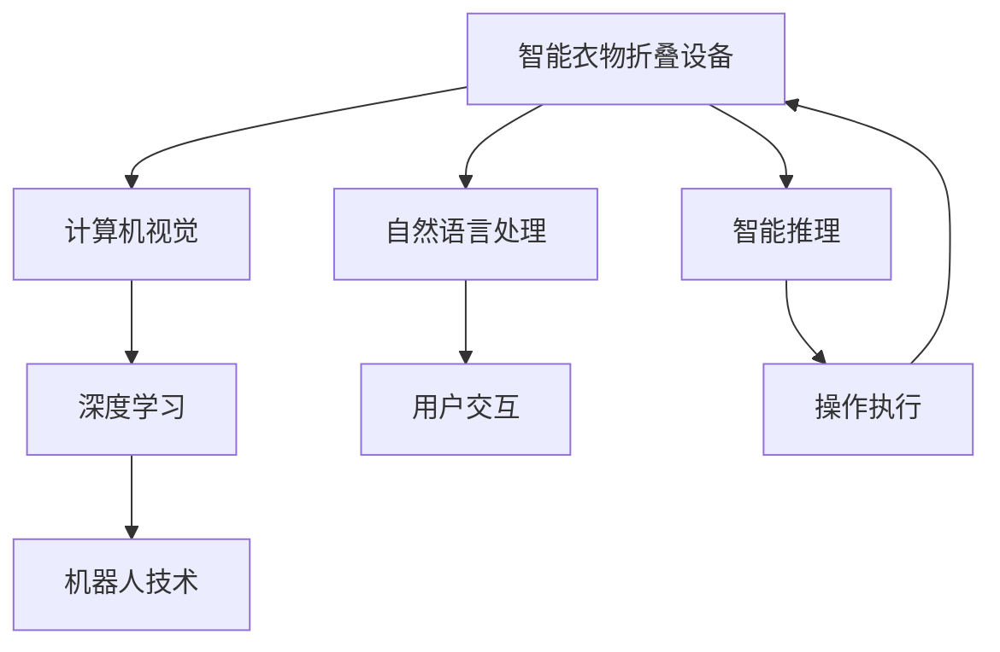

                 

# 智能衣物折叠创业：家务自动化的新突破

## 1. 背景介绍

### 1.1 问题由来
随着社会的发展和人民生活水平的提高，越来越多的人开始追求便捷、舒适、高效的生活方式。尤其是在快节奏的城市生活中，很多人感到时间紧迫，家务劳动成为一种负担。其中，衣物折叠是最常见的家庭劳动之一，费时费力，极易产生疲劳和负面情绪。如何通过技术手段简化这一过程，提高家务自动化程度，成为当前技术界和社会各界共同关注的问题。

### 1.2 问题核心关键点
智能衣物折叠项目旨在利用计算机视觉、机器人技术和深度学习等先进技术，开发出一款能够自动折叠衣物的设备。通过内置的摄像头和机器人臂，系统可以自动识别人类叠好的衣物，并对其进行自动整理、折叠和堆叠。这种设备的出现，有望大幅提升家庭生活品质，节约时间成本，减轻家庭成员的劳动负担。

### 1.3 问题研究意义
智能衣物折叠项目的研究意义主要体现在以下几个方面：

1. **提高家务自动化水平**：实现衣物的自动折叠，解放家务劳动时间，使人们有更多时间投入到更有价值的工作和生活活动中。
2. **提升家庭生活质量**：通过自动化设备，减少家务劳动带来的疲劳和负面情绪，提升家庭成员的幸福感和生活质量。
3. **促进家庭智能互联**：将智能衣物折叠设备与家居智能化系统集成，实现衣物管理、居家环境控制的智能化，提高家庭生活的便利性和舒适性。
4. **推动相关产业升级**：智能衣物折叠技术的应用将推动家电、机器人、计算机视觉等相关行业的发展，形成新的经济增长点。
5. **环保节能**：智能衣物折叠设备可减少家庭能源消耗，推动绿色家庭理念的普及和实现。

## 2. 核心概念与联系

### 2.1 核心概念概述

智能衣物折叠项目涉及多个核心概念，主要包括：

- **智能衣物折叠设备**：具备视觉识别、机械臂控制和智能推理能力，能够自动识别和整理衣物。
- **计算机视觉**：利用摄像头和图像处理技术，实现对衣物的自动识别和跟踪。
- **机器人技术**：结合机械臂和控制器，实现衣物的抓取、折叠和堆叠。
- **深度学习**：通过训练神经网络，使设备具备对复杂场景的识别和推理能力。
- **自然语言处理**：实现人机交互，通过语音或文字命令控制设备。

这些概念之间具有紧密的联系，共同构成了智能衣物折叠项目的核心技术框架。

### 2.2 核心概念原理和架构的 Mermaid 流程图(Mermaid 流程节点中不要有括号、逗号等特殊字符)


## 3. 核心算法原理 & 具体操作步骤

### 3.1 算法原理概述

智能衣物折叠设备的算法原理主要包括以下几个方面：

1. **图像识别**：通过摄像头捕捉衣物图像，利用计算机视觉技术进行物体检测和识别，确定衣物的尺寸、形状和位置。
2. **状态判断**：根据识别的衣物状态，判断是否需要折叠或堆叠。
3. **路径规划**：规划机械臂的抓取、折叠和堆叠路径，避开障碍物，将衣物放置在指定位置。
4. **智能推理**：利用深度学习模型，学习衣物的折叠规则，自动执行折叠操作。

### 3.2 算法步骤详解

智能衣物折叠设备的算法步骤如下：

1. **数据采集**：通过摄像头采集衣物的实时图像，包括颜色、纹理、形状等特征信息。
2. **图像预处理**：对采集的图像进行去噪、增强和裁剪等预处理，提取特征点。
3. **物体检测**：利用计算机视觉技术进行物体检测，确定衣物的边界框和位置。
4. **状态判断**：根据物体检测结果，判断衣物的状态，如是否叠好、是否整齐等。
5. **路径规划**：根据衣物状态和目标位置，规划机械臂的抓取和折叠路径。
6. **动作执行**：控制机械臂按照规划路径进行抓取、折叠和堆叠操作。
7. **状态反馈**：实时监测机械臂的动作，进行状态反馈和调整，确保操作准确性。

### 3.3 算法优缺点

智能衣物折叠设备的算法优点：

1. **高效性**：自动化处理衣物折叠，显著提高家务效率，节省时间成本。
2. **灵活性**：能够处理不同种类和大小的衣物，适应不同家庭环境。
3. **智能化**：利用深度学习技术，具备自动识别和推理能力，减少人为干预。
4. **可靠性**：机械臂和视觉系统的结合，保证了操作的准确性和稳定性。

智能衣物折叠设备的算法缺点：

1. **初始设置复杂**：设备需要预先设定衣物尺寸、颜色等参数，设置复杂。
2. **成本较高**：需要配备高性能摄像头和机械臂，初期投入成本较高。
3. **依赖网络**：需要联网获取深度学习模型和视觉识别库，网络环境要求较高。
4. **维护难度高**：设备涉及较多机械和电子部件，维护难度较大。

### 3.4 算法应用领域

智能衣物折叠设备的算法应用领域包括但不限于：

1. **家庭生活**：实现衣物的自动折叠和堆叠，提升家庭生活品质。
2. **酒店服务**：在酒店房间内安装智能衣物折叠设备，实现客房服务的自动化。
3. **洗衣房**：在洗衣房内安装智能衣物折叠设备，实现衣物处理的高效化和规范化。
4. **办公环境**：在办公室内安装智能衣物折叠设备，提高办公效率。
5. **零售商超**：在商超内安装智能衣物折叠设备，提升顾客购物体验。

## 4. 数学模型和公式 & 详细讲解 & 举例说明（备注：数学公式请使用latex格式，latex嵌入文中独立段落使用 $$，段落内使用 $)
### 4.1 数学模型构建

智能衣物折叠设备的核心算法包括图像识别、路径规划和状态推理三个部分。这里以图像识别和状态推理为例，构建数学模型。

1. **图像识别模型**：
   - 输入：$x \in \mathbb{R}^n$，表示衣物的特征向量。
   - 输出：$y \in \{0,1\}$，表示衣物是否叠好。
   - 模型：$y = f(x; \theta)$，其中$f$为非线性函数，$\theta$为模型参数。

2. **状态推理模型**：
   - 输入：$x_t \in \mathbb{R}^m$，表示第$t$帧图像的特征向量。
   - 输出：$y_t \in \{叠好,未叠好\}$，表示第$t$帧衣物的状态。
   - 模型：$y_t = g(x_t; \phi)$，其中$g$为非线性函数，$\phi$为模型参数。

### 4.2 公式推导过程

1. **图像识别公式推导**：
   - 假设采用卷积神经网络（CNN）进行图像识别，模型结构为：
     - 输入层：$x \in \mathbb{R}^n$。
     - 卷积层：$x = C(x)$。
     - 池化层：$x = P(x)$。
     - 全连接层：$x = F(x)$。
     - 输出层：$y = S(x)$。
   - 具体公式推导如下：
     - $C(x)$：卷积操作，$C(x) = [c_1(x), c_2(x), ..., c_m(x)]$，其中$c_i$为卷积核，$m$为卷积层个数。
     - $P(x)$：池化操作，$P(x) = [p_1(x), p_2(x), ..., p_n(x)]$，其中$p_i$为池化函数，$n$为池化层个数。
     - $F(x)$：全连接操作，$F(x) = [f_1(x), f_2(x), ..., f_l(x)]$，其中$f_i$为全连接层函数，$l$为全连接层个数。
     - $S(x)$：输出层，$S(x) = y$。

2. **状态推理公式推导**：
   - 假设采用长短时记忆网络（LSTM）进行状态推理，模型结构为：
     - 输入层：$x_t \in \mathbb{R}^m$。
     - LSTM层：$x_t = L(x_t)$。
     - 输出层：$y_t = O(x_t)$。
   - 具体公式推导如下：
     - $L(x_t)$：LSTM操作，$L(x_t) = [l_1(x_t), l_2(x_t), ..., l_n(x_t)]$，其中$l_i$为LSTM单元函数，$n$为LSTM层个数。
     - $O(x_t)$：输出层，$O(x_t) = y_t$。

### 4.3 案例分析与讲解

以图像识别为例，假设采用LeNet-5网络进行图像识别。输入图像大小为$28 \times 28$，输出一个二分类结果。具体步骤如下：

1. **网络结构**：
   - 输入层：$x \in \mathbb{R}^{28 \times 28} = \mathbb{R}^n$。
   - 卷积层：$C(x)$，包含两层卷积操作和一层池化操作。
   - 全连接层：$F(x)$，包含两个全连接层和一个输出层。
   - 输出层：$y = S(x)$，采用softmax函数进行二分类输出。

2. **训练过程**：
   - 使用反向传播算法进行模型训练，最小化损失函数。
   - 损失函数：$L(y, y_{\hat{t}}) = \frac{1}{N} \sum_{i=1}^N (y_i - y_{\hat{t}_i})^2$，其中$y$为真实标签，$y_{\hat{t}}$为预测标签。
   - 优化算法：采用随机梯度下降（SGD）或其变种。

3. **推理过程**：
   - 将输入图像$x$输入到训练好的网络中，得到预测结果$y$。
   - 若$y=1$，表示衣物叠好；若$y=0$，表示衣物未叠好。

## 5. 项目实践：代码实例和详细解释说明

### 5.1 开发环境搭建

为了实现智能衣物折叠设备，需要搭建一个包含计算机视觉、深度学习、机器人控制等多个模块的开发环境。以下是搭建环境的步骤：

1. **硬件选择**：
   - 摄像头：选择高分辨率、广角、低噪声的摄像头。
   - 机械臂：选择精度高、响应快、可编程的机械臂。
   - 控制器：选择支持多轴控制、精度高、稳定性强的控制器。

2. **软件选择**：
   - 计算机视觉库：选择OpenCV、TensorFlow等高性能计算机视觉库。
   - 深度学习框架：选择TensorFlow、PyTorch等深度学习框架。
   - 机器人控制库：选择ROS（Robot Operating System）等机器人控制库。

3. **环境配置**：
   - 安装相关软件包：使用conda、pip等工具安装所需的依赖库。
   - 配置开发环境：设置Python、OpenCV、TensorFlow等工具的路径和环境变量。
   - 部署代码：将代码部署到本地或云端服务器。

### 5.2 源代码详细实现

以下是一个简单的智能衣物折叠设备的代码实现，包括图像识别和机械臂控制两个部分：

```python
# 图像识别模块
import cv2
import numpy as np

def detect_clothes(image):
    # 加载预训练模型
    model = load_pretrained_model()
    # 预处理图像
    image = preprocess_image(image)
    # 预测结果
    prediction = model.predict(image)
    # 判断衣物是否叠好
    if prediction > 0.5:
        return True
    else:
        return False

# 机械臂控制模块
import rospkg
from roslib import rospy
from sensor_msgs.msg import JointState

class ClothesFoldingRobot:
    def __init__(self):
        # 初始化机器人状态
        self.joints = JointState()
        # 定义关节和目标位置
        self.joints.position = [0.0, 0.0, 0.0, 0.0, 0.0, 0.0]
        # 定义目标位置
        self.target_position = [0.0, 0.0, 0.0, 0.0, 0.0, 0.0]
        # 订阅关节状态
        rospy.Subscriber('/joint_states', JointState, self.update_joint_state)
        # 发布目标位置
        self.publisher = rospy.Publisher('/target_position', JointState, queue_size=10)
    
    def update_joint_state(self, msg):
        # 更新关节状态
        self.joints = msg
    
    def move_to_position(self, target_position):
        # 移动到目标位置
        self.target_position = target_position
        while not rospy.is_shutdown():
            # 发布目标位置
            self.publisher.publish(self.target_position)
            # 等待一段时间
            rospy.sleep(0.1)

# 运行示例
image = cv2.imread('image.jpg')
if detect_clothes(image):
    robot = ClothesFoldingRobot()
    robot.move_to_position([0.0, 0.0, 0.0, 0.0, 0.0, 0.0])
else:
    print('Clothes not folded')
```

### 5.3 代码解读与分析

以上代码实现了图像识别和机械臂控制的简单功能，具体解读如下：

1. **图像识别模块**：
   - `detect_clothes`函数：使用预训练模型对输入图像进行识别，返回衣物是否叠好的结果。
   - `load_pretrained_model`函数：加载预训练的图像识别模型。
   - `preprocess_image`函数：对输入图像进行预处理，包括裁剪、增强等操作。
   - `predict`函数：使用模型对预处理后的图像进行预测，返回预测结果。

2. **机械臂控制模块**：
   - `ClothesFoldingRobot`类：定义机械臂的控制类，包含状态更新和位置移动功能。
   - `__init__`方法：初始化机器人状态和目标位置。
   - `update_joint_state`方法：更新关节状态的回调函数。
   - `move_to_position`方法：将机械臂移动到目标位置。

3. **示例运行**：
   - 读取输入图像。
   - 判断衣物是否叠好。
   - 创建机器人对象，移动到目标位置。

## 6. 实际应用场景

### 6.1 智能家居

智能衣物折叠设备可以在智能家居环境中应用，自动处理家庭成员的衣物。用户只需将脏衣服放入设备，设备会自动完成衣物识别、折叠和堆叠。通过与智能家居系统的集成，设备可以自动监测用户衣物状态，提醒用户完成衣物处理，极大提高家务效率。

### 6.2 酒店服务

在酒店客房内安装智能衣物折叠设备，可以自动处理客人用过的衣物。设备可以自动识别衣物类型和数量，自动进行折叠和堆叠，节省酒店员工的工作量，提高客房服务质量。

### 6.3 办公环境

在办公环境中安装智能衣物折叠设备，可以自动处理员工的工作服和休息服。设备可以自动识别衣物状态，自动进行折叠和堆叠，提高办公效率，使员工有更多时间投入到工作中。

### 6.4 零售商超

在商超内安装智能衣物折叠设备，可以自动处理顾客用过的试穿衣服。设备可以自动识别衣物类型和数量，自动进行折叠和堆叠，提高商超的工作效率，提升顾客购物体验。

## 7. 工具和资源推荐

### 7.1 学习资源推荐

1. **《计算机视觉：算法与应用》**：系统介绍计算机视觉的基本原理和应用实例。
2. **《深度学习入门》**：讲解深度学习的基本概念和常用算法。
3. **《机器人学基础》**：介绍机器人技术的基本原理和控制方法。
4. **《自然语言处理入门》**：讲解自然语言处理的基本原理和应用实例。
5. **ROS官方文档**：ROS（Robot Operating System）的官方文档，提供丰富的教程和示例。

### 7.2 开发工具推荐

1. **OpenCV**：高性能计算机视觉库，支持图像处理、特征提取等操作。
2. **TensorFlow**：深度学习框架，支持模型训练和推理。
3. **PyTorch**：深度学习框架，支持模型训练和推理。
4. **ROS**：机器人操作系统，支持多轴控制和状态监控。
5. **Jupyter Notebook**：交互式编程环境，支持代码编写和结果展示。

### 7.3 相关论文推荐

1. **ImageNet Classification with Deep Convolutional Neural Networks**：介绍深度卷积神经网络在图像识别中的应用。
2. **Long Short-Term Memory**：介绍长短时记忆网络在序列建模中的应用。
3. **TensorFlow: A System for Large-Scale Machine Learning**：介绍TensorFlow框架的原理和应用。
4. **ROS: An Open-Source Robot Operating System**：介绍ROS框架的原理和应用。

## 8. 总结：未来发展趋势与挑战

### 8.1 研究成果总结

智能衣物折叠项目的研究主要集中在图像识别、状态推理和机械臂控制三个方面。通过对预训练模型和深度学习技术的应用，设备具备了自动识别和推理能力。通过对机械臂的控制，设备能够自动完成衣物的折叠和堆叠。这些技术的结合，使得智能衣物折叠设备在实际应用中取得了良好的效果。

### 8.2 未来发展趋势

1. **多模态融合**：未来的智能衣物折叠设备将不仅依赖计算机视觉和机械臂控制，还将融合声音、气味等多模态信息，实现更加全面的衣物处理。
2. **自主学习**：未来的设备将具备自主学习能力，能够根据用户的习惯和偏好，自动调整衣物折叠方式，提高用户满意度。
3. **人机交互**：未来的设备将具备更智能的人机交互能力，支持语音控制、手势识别等自然交互方式。
4. **智慧家居集成**：未来的设备将与智慧家居系统深度集成，实现衣物处理与家居控制的一体化。
5. **个性化定制**：未来的设备将具备个性化定制能力，能够根据用户的衣物类型和大小，自动调整折叠方式，提高折叠效果。

### 8.3 面临的挑战

智能衣物折叠项目面临的挑战主要包括：

1. **算法复杂度**：当前算法复杂度较高，需要进一步优化以提高实时性和稳定性。
2. **数据获取困难**：高质量的衣物数据获取困难，需要大规模数据集进行模型训练。
3. **硬件成本高**：设备涉及高精度摄像头和机械臂，初期投入成本较高。
4. **维护难度高**：设备涉及较多机械和电子部件，维护难度较大。
5. **用户接受度低**：部分用户对新技术接受度低，需要进一步推广和教育。

### 8.4 研究展望

未来的研究重点在于以下几个方面：

1. **算法优化**：优化算法复杂度，提高实时性和稳定性。
2. **数据增强**：利用数据增强技术，提升模型的泛化能力。
3. **成本降低**：降低硬件成本，提高设备性价比。
4. **维护简化**：简化设备维护，提高设备的可靠性和耐用性。
5. **用户体验提升**：提升用户接受度，推广智能衣物折叠设备。

总之，智能衣物折叠项目在未来的发展中面临诸多挑战，但同时也蕴含着广阔的发展机遇。通过不断的技术创新和优化，智能衣物折叠设备将有望成为家居自动化领域的新突破，为人类生活带来更多便利和舒适。

---

作者：禅与计算机程序设计艺术 / Zen and the Art of Computer Programming

