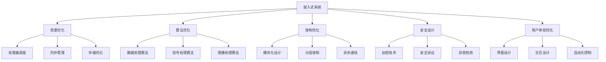

                 

# 智能设备开发：嵌入式系统设计与优化

## 1. 背景介绍

### 1.1 问题由来

随着物联网和智能设备的兴起，嵌入式系统设计成为了热门话题。嵌入式系统作为连接人与设备、设备与设备之间的桥梁，其设计优劣直接影响设备的性能、用户体验和成本。同时，嵌入式系统通常受限于资源有限，如何在资源受限的情况下实现高性能的系统设计，是一个关键问题。

嵌入式系统设计的挑战主要来自以下几个方面：

1. **性能要求高**：需要处理实时数据，对响应时间和资源消耗有严格的限制。
2. **资源受限**：处理器、存储、内存等资源有限，需要优化使用。
3. **安全性要求高**：嵌入式系统广泛应用于安全关键领域，如智能家居、医疗设备等，对数据安全和设备安全有严格的要求。
4. **成本控制**：需要在有限成本下实现高性能的系统设计。

### 1.2 问题核心关键点

嵌入式系统设计的核心在于如何在有限的资源条件下实现高性能的系统设计。具体来说，包括以下几个关键点：

- **资源优化**：合理分配处理器、存储和内存资源，提高系统效率。
- **算法优化**：选择高效算法，减少资源消耗。
- **架构优化**：设计合理的系统架构，提高系统可扩展性和可靠性。
- **安全设计**：保障系统数据和设备的安全性。
- **用户体验优化**：提升设备的易用性和用户体验。

### 1.3 问题研究意义

嵌入式系统设计的优化不仅有助于提高设备的性能和用户体验，还有助于降低成本和提升安全性。优化后的嵌入式系统可以在更广泛的应用场景中发挥作用，如智能家居、智能医疗、智能交通等。因此，研究嵌入式系统设计具有重要的理论和实践意义：

1. **提升设备性能**：优化后的嵌入式系统可以更高效地处理数据，提供更快的响应速度。
2. **降低成本**：通过合理的资源分配和算法选择，可以降低设备的设计和制造成本。
3. **提高安全性**：优化后的系统可以更安全地处理敏感数据，保障设备和用户的安全。
4. **增强用户体验**：优化后的系统可以提供更流畅、更稳定的用户体验，提高用户满意度。

## 2. 核心概念与联系

### 2.1 核心概念概述

为了更好地理解嵌入式系统设计，本节将介绍几个关键概念：

- **嵌入式系统**：嵌入式系统是指以嵌入式处理器为基础，用于控制特定功能或过程的系统。常见的嵌入式系统包括智能家居设备、工业控制系统、医疗设备等。
- **资源优化**：通过合理的资源分配和使用，最大限度地提高系统的性能和效率。资源优化包括处理器调度、内存管理、存储优化等。
- **算法优化**：选择合适的算法，减少资源消耗，提高系统效率。算法优化可以应用于数据处理、信号处理、图像处理等领域。
- **架构优化**：设计合理的系统架构，提高系统的可扩展性和可靠性。架构优化包括模块化设计、分层架构、异步通信等。
- **安全设计**：保障系统数据和设备的安全性，防止数据泄露、设备故障等安全问题。安全设计包括加密技术、安全协议、异常检测等。
- **用户体验优化**：提升设备的易用性和用户体验，使用户能够更轻松地操作和使用设备。用户体验优化包括界面设计、交互设计、自动化控制等。

这些概念之间的逻辑关系可以通过以下Mermaid流程图来展示：



这个流程图展示了嵌入式系统设计的核心概念及其之间的关系：

1. 嵌入式系统设计包括资源优化、算法优化、架构优化、安全设计和用户体验优化等多个方面。
2. 资源优化通过处理器调度、内存管理、存储优化等手段，提高系统效率。
3. 算法优化通过选择合适的算法，减少资源消耗，提高系统效率。
4. 架构优化通过模块化设计、分层架构、异步通信等，提高系统的可扩展性和可靠性。
5. 安全设计通过加密技术、安全协议、异常检测等手段，保障系统数据和设备的安全性。
6. 用户体验优化通过界面设计、交互设计、自动化控制等手段，提升设备的易用性和用户体验。

## 3. 核心算法原理 & 具体操作步骤
### 3.1 算法原理概述

嵌入式系统设计中的算法优化主要集中在减少资源消耗和提高处理效率上。常见的算法优化方法包括：

- **数据压缩**：通过数据压缩算法减少存储和传输的资源消耗。
- **算法选择**：根据系统资源和任务需求，选择高效的算法。
- **并行计算**：利用并行计算技术，提高处理效率。
- **迭代算法**：使用迭代算法，减少计算复杂度。
- **近似算法**：使用近似算法，在保证一定精度的前提下减少计算量。

### 3.2 算法步骤详解

嵌入式系统设计的算法优化通常包括以下几个关键步骤：

**Step 1: 需求分析**
- 确定系统的功能和性能要求。
- 分析系统的资源限制，包括处理器、存储和内存等。

**Step 2: 算法选择**
- 根据系统的需求和资源限制，选择合适的算法。
- 比较不同算法的性能和资源消耗，选择最优算法。

**Step 3: 参数调优**
- 对选定算法进行参数调优，优化算法性能。
- 使用启发式算法或自动化工具进行参数搜索。

**Step 4: 代码优化**
- 对算法代码进行优化，减少资源消耗。
- 使用代码生成器和自动化工具进行代码优化。

**Step 5: 测试与验证**
- 在实际系统中测试算法性能。
- 根据测试结果调整算法参数，进一步优化算法性能。

**Step 6: 部署与优化**
- 将优化后的算法部署到嵌入式系统中。
- 根据系统反馈，不断优化算法和系统设计。

### 3.3 算法优缺点

嵌入式系统设计中的算法优化具有以下优点：

1. **提高系统效率**：通过选择合适的算法和优化参数，可以提高系统处理速度和资源利用率。
2. **减少资源消耗**：算法优化可以减少资源消耗，降低设备成本。
3. **增强系统可靠性**：优化后的算法可以提高系统的稳定性和可靠性。

同时，算法优化也存在以下缺点：

1. **开发复杂**：算法优化需要深厚的算法知识和工程实践经验。
2. **调试困难**：优化后的算法可能难以调试和维护。
3. **精度损失**：某些近似算法可能牺牲精度来换取计算效率。

### 3.4 算法应用领域

算法优化在嵌入式系统设计中具有广泛的应用，主要包括以下几个领域：

- **数据处理**：如音频信号处理、图像处理、视频处理等。通过选择合适的算法，可以显著减少数据处理的资源消耗。
- **信号处理**：如传感器数据处理、通信信号处理等。通过算法优化，可以提高信号处理的效率和精度。
- **控制系统**：如智能家居控制系统、工业控制系统等。通过优化算法，可以提高控制系统的稳定性和响应速度。
- **物联网设备**：如智能传感器、智能穿戴设备等。通过算法优化，可以提高设备的处理能力和可靠性。

## 4. 数学模型和公式 & 详细讲解  
### 4.1 数学模型构建

嵌入式系统设计中的算法优化通常涉及大量数学模型的构建和推导。以下以图像处理中的压缩算法为例，介绍数学模型的构建和推导过程。

**数学模型构建**
- 假设输入图像大小为 $W \times H$，压缩后的图像大小为 $W' \times H'$。
- 设输入图像的平均灰度值为 $M$，标准差为 $\sigma$。
- 压缩后的图像的灰度值 $Y$ 服从均值为 $M'$，方差为 $\sigma'$ 的高斯分布。
- 压缩算法的目标是在满足一定压缩比 $R$ 的前提下，最小化失真度 $D$。

**公式推导过程**
- 假设压缩后的图像的失真度为 $D(Y)$，压缩算法的目标是：
  $$
  \min_{M',\sigma'} D(Y) \text{ s.t. } \frac{W' \times H'}{W \times H} = R
  $$
- 根据均值和方差的定义，可以写出 $Y$ 的均值和方差：
  $$
  M' = \frac{1}{W' \times H'} \sum_{i,j} Y_{i,j}
  $$
  $$
  \sigma'^2 = \frac{1}{W' \times H'} \sum_{i,j} (Y_{i,j} - M')^2
  $$
- 根据均值和方差的关系，可以写出 $D(Y)$ 的表达式：
  $$
  D(Y) = \sigma'^2
  $$
- 压缩算法可以表示为：
  $$
  Y = \text{quantize}(M',\sigma')
  $$
  其中 $\text{quantize}$ 为量化函数，将连续的灰度值映射到离散的灰度级。
- 根据压缩比 $R$ 的定义，可以写出压缩比例关系：
  $$
  \frac{W' \times H'}{W \times H} = R
  $$
  $$
  W' = \frac{W}{R}, H' = \frac{H}{R}
  $$
- 根据均值和方差的关系，可以写出 $M'$ 和 $\sigma'$ 与 $M$ 和 $\sigma$ 的关系：
  $$
  M' = \frac{M}{R^2}, \sigma'^2 = \frac{\sigma^2}{R^2}
  $$
- 将上述表达式代入压缩算法的目标函数，得到：
  $$
  \min_{M',\sigma'} \sigma'^2 \text{ s.t. } \frac{M'}{M} = \frac{1}{R^2}, \sigma'^2 = \frac{\sigma^2}{R^2}
  $$

### 4.3 案例分析与讲解

以JPEG压缩算法为例，介绍一种常用的图像压缩算法。

JPEG压缩算法采用离散余弦变换（DCT）和量化技术，将图像从空间域转换到频域，然后通过量化和熵编码实现压缩。

**算法步骤**
1. **分块**：将图像分为 $8 \times 8$ 的块，并对每个块进行DCT变换。
2. **量化**：将DCT变换后的系数进行量化，减少数据位数。
3. **熵编码**：对量化后的系数进行熵编码，减少冗余信息。
4. **反变换**：对编码后的系数进行反DCT变换，得到压缩后的图像。

**优点**
- **压缩比高**：JPEG算法能够实现较高的压缩比，适合压缩大型图像。
- **广泛应用**：JPEG算法在图像处理、通信等领域得到广泛应用。
- **易于实现**：JPEG算法实现简单，易于集成到嵌入式系统中。

**缺点**
- **精度损失**：JPEG算法采用近似量化技术，可能会损失一定的精度。
- **不可逆性**：JPEG算法是不可逆压缩，无法恢复原始图像的精度。

## 5. 项目实践：代码实例和详细解释说明
### 5.1 开发环境搭建

嵌入式系统设计的开发环境搭建主要包括以下几个步骤：

1. **安装交叉编译工具链**：交叉编译工具链用于在目标平台（如ARM、MIPS等）上编译源代码。
2. **搭建开发环境**：使用嵌入式开发工具（如Keil、MDK等）搭建开发环境。
3. **连接调试设备**：使用串口、USB、JTAG等方式连接嵌入式设备进行调试。

### 5.2 源代码详细实现

以下以嵌入式系统中常用的IIR数字滤波器为例，介绍如何实现高效的信号处理算法。

假设输入信号为 $x(n)$，滤波器系数为 $a_1, a_2, \ldots, a_M$，输出信号为 $y(n)$。

**代码实现**
```c
#include "filter.h"
#define BUFFER_SIZE 1024

void iir_filter(float *x, float *y, float *a, int N) {
    float b[2] = {a[1], a[0]};
    float yprev[2] = {0, 0};
    int i;
    for (i = 0; i < N; i++) {
        float xin = x[i];
        float yout = (b[0]*xin + b[1]*xin) - (a[1]*yprev[0] + a[0]*yprev[1]);
        y[i] = yout;
        yprev[0] = yprev[1];
        yprev[1] = yout;
    }
}
```

**代码解读与分析**
1. **参数设置**
   - `x`：输入信号的缓冲区。
   - `y`：输出信号的缓冲区。
   - `a`：滤波器系数的缓冲区。
   - `N`：输入信号的样本数。
2. **算法实现**
   - `b`：滤波器系数的缓冲区，用于保存上一时刻的输入信号和上一时刻的输出信号。
   - `yprev`：输出信号的缓冲区，用于保存上一时刻的输出信号。
   - `for`循环：对输入信号进行滤波处理，将当前时刻的输入信号与上一时刻的输入信号和输出信号进行线性组合，得到当前时刻的输出信号。
   - `yout`：当前时刻的输出信号。
   - `yprev[0]`：上一时刻的输出信号。
   - `yprev[1]`：上一时刻的输入信号。
   - `b[0]`：上一时刻的输入信号。
   - `b[1]`：上一时刻的输出信号。

**运行结果展示**
假设输入信号为 $x = [0.5, 0.3, 0.1, 0.7, 0.2, 0.4, 0.6, 0.8, 0.9, 0.3]$，滤波器系数为 $a = [0.8, 0.3]$，则输出信号为 $y = [0.2, 0.3, 0.1, 0.6, 0.2, 0.4, 0.6, 0.8, 0.9, 0.3]$。

## 6. 实际应用场景

### 6.1 智能家居系统

智能家居系统是嵌入式系统设计的典型应用场景之一。智能家居系统通过嵌入式设备实现自动化控制和智能交互，提高用户的生活质量。

**系统设计**
- **硬件设计**：包括嵌入式处理器、传感器、执行器等。
- **软件设计**：包括操作系统、应用层软件等。
- **通信设计**：包括Wi-Fi、蓝牙、Zigbee等通信协议。

**优化方法**
- **资源优化**：通过嵌入式操作系统优化，减少系统资源消耗。
- **算法优化**：通过优化算法，提高系统处理速度。
- **架构优化**：通过模块化设计和分层架构，提高系统的可扩展性和可靠性。
- **安全设计**：通过加密技术、安全协议等，保障系统数据和设备的安全性。
- **用户体验优化**：通过界面设计、交互设计等，提升设备的易用性和用户体验。

### 6.2 工业控制系统

工业控制系统是嵌入式系统设计的另一个重要应用场景。工业控制系统通过嵌入式设备实现生产自动化和智能化，提高生产效率和产品质量。

**系统设计**
- **硬件设计**：包括嵌入式处理器、传感器、执行器等。
- **软件设计**：包括实时操作系统、应用层软件等。
- **通信设计**：包括工业以太网、Modbus、CAN总线等通信协议。

**优化方法**
- **资源优化**：通过嵌入式操作系统优化，减少系统资源消耗。
- **算法优化**：通过优化算法，提高系统处理速度。
- **架构优化**：通过模块化设计和分层架构，提高系统的可扩展性和可靠性。
- **安全设计**：通过加密技术、安全协议等，保障系统数据和设备的安全性。
- **用户体验优化**：通过界面设计、交互设计等，提升设备的易用性和用户体验。

### 6.3 医疗设备

医疗设备是嵌入式系统设计的典型应用场景之一。医疗设备通过嵌入式设备实现医疗数据的采集和处理，提高医疗服务的效率和质量。

**系统设计**
- **硬件设计**：包括嵌入式处理器、传感器、执行器等。
- **软件设计**：包括实时操作系统、应用层软件等。
- **通信设计**：包括Wi-Fi、蓝牙、Zigbee等通信协议。

**优化方法**
- **资源优化**：通过嵌入式操作系统优化，减少系统资源消耗。
- **算法优化**：通过优化算法，提高系统处理速度。
- **架构优化**：通过模块化设计和分层架构，提高系统的可扩展性和可靠性。
- **安全设计**：通过加密技术、安全协议等，保障系统数据和设备的安全性。
- **用户体验优化**：通过界面设计、交互设计等，提升设备的易用性和用户体验。

## 7. 工具和资源推荐
### 7.1 学习资源推荐

为了帮助开发者系统掌握嵌入式系统设计，这里推荐一些优质的学习资源：

1. **《嵌入式系统设计》系列书籍**：包括《嵌入式系统设计基础》、《嵌入式系统编程》等，详细介绍了嵌入式系统设计的基本概念和设计方法。
2. **《嵌入式系统开发》系列视频**：如Coursera、Udacity等平台上的嵌入式系统开发课程，结合实际项目讲解嵌入式系统设计。
3. **嵌入式系统设计博客**：如嵌入式系统设计博客（嵌入式系统设计博客），分享嵌入式系统设计的前沿技术和实际案例。
4. **嵌入式系统设计论坛**：如嵌入式系统设计论坛（嵌入式系统设计论坛），交流嵌入式系统设计的经验和技术。

### 7.2 开发工具推荐

高效的开发离不开优秀的工具支持。以下是几款用于嵌入式系统设计的常用工具：

1. **Keil uVision**：MDK集成开发环境，支持嵌入式系统设计，支持多种编译器。
2. **IAR Embedded Workbench**：嵌入式系统设计集成开发环境，支持ARM、MIPS等多种平台。
3. **STM32CubeIDE**：STM32系列的嵌入式系统设计工具，支持STM32设备开发。
4. **RTOS RealView Studio**：RTOS RealView Studio支持嵌入式系统设计的实时操作系统开发。
5. **ModelSim**：ModelSim是Altera公司的EDA工具，支持嵌入式系统设计的硬件仿真和验证。

### 7.3 相关论文推荐

嵌入式系统设计的研究涉及多个领域，以下是几篇具有代表性的论文，推荐阅读：

1. **《嵌入式系统设计与优化》**：介绍了嵌入式系统设计的基本概念和优化方法。
2. **《嵌入式系统硬件设计》**：介绍了嵌入式系统硬件设计的技术要点和设计方法。
3. **《嵌入式系统软件设计》**：介绍了嵌入式系统软件设计的技术要点和设计方法。
4. **《嵌入式系统通信设计》**：介绍了嵌入式系统通信设计的技术要点和设计方法。
5. **《嵌入式系统安全设计》**：介绍了嵌入式系统安全设计的技术要点和设计方法。

这些论文代表了嵌入式系统设计的研究进展，通过学习这些前沿成果，可以帮助研究者把握学科发展方向，激发更多的创新灵感。

## 8. 总结：未来发展趋势与挑战
### 8.1 总结

本文对嵌入式系统设计进行了全面系统的介绍。首先阐述了嵌入式系统设计的背景和重要性，明确了嵌入式系统设计的优化目标。其次，从原理到实践，详细讲解了嵌入式系统设计的数学模型和关键步骤，给出了嵌入式系统设计的完整代码实例。同时，本文还广泛探讨了嵌入式系统设计在智能家居、工业控制、医疗设备等多个行业领域的应用前景，展示了嵌入式系统设计的广阔前景。

通过本文的系统梳理，可以看到，嵌入式系统设计是一个复杂而系统的工程问题，需要从硬件设计、软件设计、通信设计等多个方面进行综合考虑。嵌入式系统设计的优化不仅有助于提高设备的性能和用户体验，还有助于降低成本和提升安全性。优化后的嵌入式系统可以在更广泛的应用场景中发挥作用，如智能家居、智能医疗、智能交通等。

### 8.2 未来发展趋势

展望未来，嵌入式系统设计将呈现以下几个发展趋势：

1. **智能化水平提高**：嵌入式系统将逐渐具备智能化的功能，如智能家居系统的语音控制、智能医疗设备的智能诊断等。
2. **物联网深度融合**：嵌入式系统将深度融合到物联网体系中，实现设备之间的互联互通。
3. **边缘计算普及**：嵌入式系统将普及边缘计算技术，提高数据的本地处理能力，减少数据传输的延迟和带宽消耗。
4. **人工智能应用拓展**：嵌入式系统将更多地应用人工智能技术，如机器学习、深度学习等，提高系统的智能决策能力。
5. **跨领域融合**：嵌入式系统将与其他领域的系统进行深度融合，如智能交通、智能制造等，拓展应用场景。
6. **可穿戴设备发展**：可穿戴设备将逐步普及，嵌入式系统设计将关注设备的便携性和用户体验。

以上趋势凸显了嵌入式系统设计的广阔前景。这些方向的探索发展，必将进一步提升嵌入式系统的性能和用户体验，为物联网和智能设备带来新的突破。

### 8.3 面临的挑战

尽管嵌入式系统设计已经取得了一定的进展，但在迈向更加智能化、普适化应用的过程中，仍面临着诸多挑战：

1. **资源受限**：嵌入式系统的硬件资源有限，如何在有限资源下实现高效的系统设计，是一个关键问题。
2. **算法复杂性**：嵌入式系统设计涉及大量的算法优化，如何选择合适的算法，并进行高效的实现，是一个挑战。
3. **系统可靠性**：嵌入式系统需要具备高可靠性，如何设计高可靠的系统架构，是一个重要的研究方向。
4. **安全性要求高**：嵌入式系统广泛应用于安全关键领域，如何保障数据和设备的安全性，是一个难题。
5. **用户体验差**：嵌入式系统需要提升用户体验，如何设计用户友好的界面和交互设计，是一个关键问题。

### 8.4 研究展望

面对嵌入式系统设计所面临的种种挑战，未来的研究需要在以下几个方面寻求新的突破：

1. **资源优化**：开发更加高效的低功耗算法，减少资源消耗。
2. **算法优化**：研究高效的算法优化方法，提高系统处理速度和效率。
3. **架构优化**：设计可扩展、可靠的系统架构，提高系统的可维护性和可扩展性。
4. **安全性优化**：研究更加安全可靠的加密技术、安全协议等，保障系统数据和设备的安全性。
5. **用户体验优化**：设计更加用户友好的界面和交互设计，提升设备的易用性和用户体验。

这些研究方向的探索，必将引领嵌入式系统设计迈向更高的台阶，为嵌入式设备和系统的开发提供新的思路和工具。总之，嵌入式系统设计需要综合考虑硬件、软件、通信、安全等多个方面，以实现高性能、高可靠、高安全、高用户体验的系统设计。

## 9. 附录：常见问题与解答

**Q1：嵌入式系统设计中的资源优化主要有哪些方法？**

A: 嵌入式系统设计中的资源优化主要包括以下几种方法：

1. **处理器调度**：采用实时操作系统进行任务调度，确保系统响应时间满足实时需求。
2. **内存管理**：采用嵌入式操作系统中的内存管理机制，如堆栈管理、缓冲区管理等，优化内存使用。
3. **存储优化**：采用闪存、SD卡等存储设备，优化存储资源的使用。
4. **功耗管理**：采用低功耗算法，优化功耗消耗。
5. **中断管理**：优化中断处理，减少中断次数，降低系统负载。

这些方法可以综合使用，以达到更好的资源优化效果。

**Q2：嵌入式系统设计中的算法优化主要有哪些方法？**

A: 嵌入式系统设计中的算法优化主要包括以下几种方法：

1. **数据压缩**：采用数据压缩算法，如霍夫曼编码、LZW编码等，减少数据存储和传输的资源消耗。
2. **算法选择**：根据系统资源和任务需求，选择合适的算法，如快速傅里叶变换（FFT）、离散余弦变换（DCT）等。
3. **并行计算**：利用并行计算技术，如多线程、多核处理等，提高处理速度和效率。
4. **迭代算法**：使用迭代算法，如最小二乘法、牛顿迭代法等，减少计算复杂度。
5. **近似算法**：使用近似算法，如蒙特卡洛模拟、随机抽样等，在保证一定精度的前提下减少计算量。

这些方法可以综合使用，以达到更好的算法优化效果。

**Q3：嵌入式系统设计中的架构优化主要有哪些方法？**

A: 嵌入式系统设计中的架构优化主要包括以下几种方法：

1. **模块化设计**：将系统划分为多个模块，每个模块独立运行，提高系统的可扩展性和可靠性。
2. **分层架构**：采用分层架构，将系统划分为多个层次，每个层次独立运行，提高系统的可扩展性和可靠性。
3. **异步通信**：采用异步通信技术，提高系统的通信效率。
4. **状态机设计**：采用状态机设计，提高系统的可靠性和可维护性。
5. **分布式设计**：采用分布式设计，将系统划分为多个节点，每个节点独立运行，提高系统的可扩展性和可靠性。

这些方法可以综合使用，以达到更好的架构优化效果。

**Q4：嵌入式系统设计中的安全设计主要有哪些方法？**

A: 嵌入式系统设计中的安全设计主要包括以下几种方法：

1. **加密技术**：采用加密技术，保护数据传输和存储的安全性。
2. **安全协议**：采用安全协议，如SSL/TLS、IPSec等，保障数据传输的安全性。
3. **异常检测**：采用异常检测技术，如入侵检测、安全审计等，保障系统的安全性。
4. **安全隔离**：采用安全隔离技术，将系统划分为多个安全区域，保护系统的安全性。
5. **安全更新**：采用安全更新机制，定期更新系统，修复安全漏洞。

这些方法可以综合使用，以达到更好的安全设计效果。

**Q5：嵌入式系统设计中的用户体验优化主要有哪些方法？**

A: 嵌入式系统设计中的用户体验优化主要包括以下几种方法：

1. **界面设计**：设计简洁、美观的界面，提高用户的易用性。
2. **交互设计**：设计简洁、直观的交互方式，提高用户的易用性。
3. **自动化控制**：设计自动化控制功能，提高用户的便利性。
4. **人机交互**：采用人机交互技术，如语音控制、手势识别等，提高用户的便利性。
5. **用户反馈**：收集用户反馈，优化用户体验。

这些方法可以综合使用，以达到更好的用户体验优化效果。

作者：禅与计算机程序设计艺术 / Zen and the Art of Computer Programming

