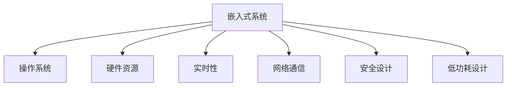

                 

# 智能设备开发：嵌入式系统设计与实现

> 关键词：智能设备,嵌入式系统,设计实现,编程技巧,优化策略,微控制器,驱动程序,通信协议

## 1. 背景介绍

### 1.1 问题由来

随着物联网(IoT)技术的迅猛发展，各种智能设备如智能家居、可穿戴设备、工业物联网等越来越多地融入人们的日常生活和工作之中。这些智能设备不仅需要具备高性能的计算能力，还需要在有限的资源环境下高效稳定运行。嵌入式系统作为智能设备的大脑，其设计和实现对于整个设备性能至关重要。

嵌入式系统通常指一个专用的计算机系统，用于控制特定设备、执行特定任务，通常具有硬件成本低、能耗低、体积小、可靠性高等特点。与通用计算机不同，嵌入式系统通常采用嵌入式操作系统(如RTOS、Linux等)和专用硬件，以优化性能和资源利用。嵌入式系统在军事、航空航天、医疗、工业控制等领域有着广泛的应用，这些领域的智能化需求催生了对嵌入式系统设计和实现技术的深入研究。

### 1.2 问题核心关键点

嵌入式系统的设计和实现需要综合考虑以下关键点：

- 硬件资源有限：嵌入式设备资源有限，需要优化算法和代码，确保软件在资源受限环境下运行。
- 实时性要求高：嵌入式系统需满足高实时性要求，保证系统在短时间内快速响应。
- 可靠性要求高：嵌入式系统需具备高可靠性，保证系统在各种环境下稳定运行。
- 低功耗要求：嵌入式设备通常需要长时间连续工作，需优化功耗，延长电池寿命。
- 网络通信需求：嵌入式设备往往需要通过网络进行通信，需实现高效的通信协议。
- 系统安全性：嵌入式系统需确保数据和操作的安全性，避免受到攻击。

### 1.3 问题研究意义

嵌入式系统设计和实现技术的深入研究，对于推动智能设备的发展、提升智能化水平具有重要意义：

1. 提升设备性能：通过优化算法和代码，可以提升设备的计算速度和响应时间，提升用户体验。
2. 降低成本：通过优化设计和实现，可以降低设备硬件成本，扩大市场应用范围。
3. 增强安全性：通过系统安全性设计，可以有效保护设备数据和操作，防止攻击和滥用。
4. 优化功耗：通过低功耗设计，可以延长设备电池寿命，提升设备使用便利性。
5. 提高可靠性：通过可靠性设计，可以保证设备在各种环境下稳定运行，提升设备可用性。
6. 推动行业发展：通过嵌入式系统技术的研究和应用，可以促进各行各业的智能化转型升级，提升整体技术水平。

## 2. 核心概念与联系

### 2.1 核心概念概述

嵌入式系统的设计和实现涉及多个核心概念，包括：

- 嵌入式系统：一个专用的计算机系统，用于控制特定设备、执行特定任务。
- 硬件资源：嵌入式设备通常具有有限的CPU、内存、存储空间等资源，需优化设计以高效利用。
- 操作系统：嵌入式系统通常采用嵌入式操作系统，如RTOS、Linux等，用于管理硬件资源，提供必要的抽象层。
- 实时性：嵌入式系统需满足高实时性要求，通常通过多任务调度和高优先级任务实现。
- 网络通信：嵌入式系统常需通过网络进行通信，需实现高效的通信协议，如蓝牙、WiFi、Zigbee等。
- 安全设计：嵌入式系统需确保数据和操作的安全性，避免受到攻击，需采用加密、认证等技术手段。
- 低功耗设计：嵌入式设备通常需要长时间连续工作，需优化功耗，延长电池寿命。

### 2.2 核心概念原理和架构的 Mermaid 流程图



以上流程图示意了嵌入式系统的几个核心概念及其相互关系：

1. 嵌入式系统：一个专用的计算机系统，用于控制特定设备、执行特定任务。
2. 操作系统：嵌入式系统通常采用嵌入式操作系统，如RTOS、Linux等，用于管理硬件资源，提供必要的抽象层。
3. 硬件资源：嵌入式设备通常具有有限的CPU、内存、存储空间等资源，需优化设计以高效利用。
4. 实时性：嵌入式系统需满足高实时性要求，通常通过多任务调度和高优先级任务实现。
5. 网络通信：嵌入式系统常需通过网络进行通信，需实现高效的通信协议，如蓝牙、WiFi、Zigbee等。
6. 安全设计：嵌入式系统需确保数据和操作的安全性，避免受到攻击，需采用加密、认证等技术手段。
7. 低功耗设计：嵌入式设备通常需要长时间连续工作，需优化功耗，延长电池寿命。

这些概念构成了嵌入式系统的设计和实现基础，需综合考虑和优化，以实现高效、稳定、安全的智能设备。

## 3. 核心算法原理 & 具体操作步骤

### 3.1 算法原理概述

嵌入式系统的设计和实现涉及算法原理、设计技巧、优化策略等，以下详细介绍这些核心内容：

- 硬件资源优化算法：针对嵌入式设备资源有限的特点，需设计高效的算法，提升资源利用率。
- 实时性算法设计：嵌入式系统需满足高实时性要求，需设计高实时性算法，保证系统快速响应。
- 低功耗算法设计：嵌入式设备需优化功耗，延长电池寿命，需设计低功耗算法，降低能源消耗。
- 网络通信协议设计：嵌入式系统常需通过网络进行通信，需设计高效的网络通信协议，保证通信可靠性。
- 系统安全算法设计：嵌入式系统需确保数据和操作的安全性，需设计安全算法，防止攻击和滥用。

### 3.2 算法步骤详解

以下是嵌入式系统设计和实现的详细步骤：

**Step 1: 需求分析**

- 收集用户需求，明确设备的功能和性能要求。
- 确定设备的外形、尺寸、重量等设计参数。
- 制定系统的功能模块和接口规范。

**Step 2: 硬件选型**

- 根据需求选择适合的微控制器(MCU)和外围设备，如传感器、显示器、存储器等。
- 评估硬件资源限制，如CPU性能、内存大小、功耗限制等。
- 设计硬件电路板布局，确定各模块的位置和连接方式。

**Step 3: 软件设计**

- 设计嵌入式操作系统的内核，实现多任务调度、中断处理等功能。
- 实现嵌入式系统的驱动程序，驱动硬件设备的正常工作。
- 设计应用程序的模块结构，实现设备的功能和接口。

**Step 4: 算法实现**

- 实现嵌入式系统所需的算法，如信号处理、图像处理、路径规划等。
- 实现高效的数据结构，如链表、树、图等，优化内存使用。
- 实现低功耗算法，如动态电压调节、功耗优化算法等。

**Step 5: 系统集成**

- 将硬件电路板和软件系统集成，进行系统调试和测试。
- 优化系统的实时性和稳定性，确保系统满足性能要求。
- 实现嵌入式系统的网络通信功能，实现数据传输和通信。

**Step 6: 系统部署**

- 将嵌入式系统部署到目标设备上，进行现场测试。
- 优化系统的实时性和稳定性，确保系统满足性能要求。
- 实现嵌入式系统的网络通信功能，实现数据传输和通信。

**Step 7: 系统维护**

- 定期更新嵌入式系统的软件和算法，提升系统性能和安全性。
- 定期检测硬件设备的工作状态，防止设备损坏或故障。
- 记录系统运行日志，及时发现和解决系统问题。

### 3.3 算法优缺点

嵌入式系统的设计和实现涉及多种算法，每种算法都有其优缺点：

- 硬件资源优化算法：优点是可以提升资源利用率，但设计复杂，需要专业知识和技能。
- 实时性算法设计：优点是可以满足高实时性要求，但设计难度高，需确保系统稳定。
- 低功耗算法设计：优点是可以延长电池寿命，但需平衡性能和功耗，设计复杂。
- 网络通信协议设计：优点是可以实现高效的通信，但需考虑协议标准和兼容性。
- 系统安全算法设计：优点是可以保护数据和操作安全，但需处理加密、认证等问题，设计复杂。

### 3.4 算法应用领域

嵌入式系统的设计和实现技术广泛应用在以下几个领域：

- 工业控制：嵌入式系统常用于工业自动化设备，如机器人、机床、传感器等。
- 医疗设备：嵌入式系统可用于医疗设备，如心电图机、血氧仪、药物配送设备等。
- 智能家居：嵌入式系统可用于智能家居设备，如智能灯泡、智能音箱、智能门锁等。
- 可穿戴设备：嵌入式系统可用于可穿戴设备，如智能手表、健身追踪器、智能眼镜等。
- 农业设备：嵌入式系统可用于农业设备，如农用机器人、传感器设备、农用无人机等。
- 汽车电子：嵌入式系统可用于汽车电子设备，如导航系统、车载摄像头、自动驾驶系统等。

## 4. 数学模型和公式 & 详细讲解 & 举例说明

### 4.1 数学模型构建

嵌入式系统设计和实现涉及多个数学模型，以下详细介绍这些核心模型：

- 嵌入式系统的实时性模型：描述嵌入式系统的实时性和性能。
- 嵌入式系统的功耗模型：描述嵌入式系统的功耗和能量消耗。
- 嵌入式系统的通信模型：描述嵌入式系统的网络通信协议和数据传输。
- 嵌入式系统的安全模型：描述嵌入式系统的安全设计和加密算法。

### 4.2 公式推导过程

以下给出嵌入式系统设计和实现中的几个核心数学模型的公式推导：

#### 4.2.1 实时性模型

假设嵌入式系统的任务时间为 $T$，系统时钟频率为 $f$，则实时性模型为：

$$
RT = \frac{T}{f}
$$

其中 $RT$ 为任务执行时间，$f$ 为系统时钟频率，$T$ 为任务时间。实时性模型可用于计算任务的最大执行时间，评估系统的性能。

#### 4.2.2 功耗模型

假设嵌入式系统的功耗为 $P$，工作电压为 $V$，时钟频率为 $f$，则功耗模型为：

$$
P = C \times V^2 \times f
$$

其中 $C$ 为电容负载，$V$ 为工作电压，$f$ 为时钟频率。功耗模型可用于计算系统的能耗，优化低功耗设计。

#### 4.2.3 通信模型

假设嵌入式系统的通信速率为 $R$，数据包大小为 $S$，通信延迟为 $D$，则通信模型为：

$$
R = \frac{S}{D}
$$

其中 $R$ 为通信速率，$S$ 为数据包大小，$D$ 为通信延迟。通信模型可用于计算通信带宽和延迟，优化网络通信设计。

#### 4.2.4 安全模型

假设嵌入式系统的数据量为 $D$，加密强度为 $E$，攻击概率为 $P$，则安全模型为：

$$
R = \frac{D}{E} \times \frac{1}{P}
$$

其中 $R$ 为安全性，$D$ 为数据量，$E$ 为加密强度，$P$ 为攻击概率。安全模型可用于评估系统的安全性，优化安全设计。

### 4.3 案例分析与讲解

以下通过一个具体案例，分析嵌入式系统设计和实现的过程：

假设需要设计一个智能音箱，支持语音识别、音乐播放、网络连接等功能，需满足以下需求：

1. 支持实时语音识别和播放。
2. 支持无线WiFi网络连接。
3. 支持低功耗设计，延长电池寿命。
4. 支持安全设计和认证。

**Step 1: 需求分析**

- 功能需求：语音识别、音乐播放、网络连接。
- 性能要求：实时语音识别和播放，低功耗设计，安全设计。
- 硬件需求：高性能MCU，WiFi模块，扬声器，麦克风，存储器等。
- 软件需求：操作系统内核，语音识别算法，音乐播放算法，WiFi驱动，安全算法。

**Step 2: 硬件选型**

- MCU：选择性能较高的ARM Cortex-A系列MCU，如STM32F4。
- WiFi模块：选择符合802.11ac标准的WiFi模块，如ESP8266。
- 扬声器：选择低功耗扬声器，如TDA7382。
- 麦克风：选择高灵敏度的麦克风，如KSC583。
- 存储器：选择NOR Flash存储器，如MX25R32M16S。

**Step 3: 软件设计**

- 操作系统内核：选择RTOS作为操作系统内核，实现多任务调度和中断处理。
- WiFi驱动：实现WiFi模块的驱动，实现WiFi连接和数据传输。
- 语音识别算法：实现实时语音识别算法，如GMM-HMM模型，优化算法性能。
- 音乐播放算法：实现音乐播放算法，如FFT算法，优化播放效果。
- 安全算法：实现安全算法，如AES加密算法，保护数据安全。

**Step 4: 算法实现**

- 实时性算法：优化算法性能，保证系统实时性。
- 低功耗算法：实现动态电压调节，降低功耗，延长电池寿命。
- 网络通信协议：实现高效的网络通信协议，如TCP/IP协议，优化通信性能。
- 系统安全算法：实现加密算法，保护数据安全，防止攻击。

**Step 5: 系统集成**

- 硬件集成：将MCU、WiFi模块、扬声器、麦克风、存储器等模块集成，实现设备功能。
- 软件集成：将操作系统内核、WiFi驱动、语音识别算法、音乐播放算法、安全算法等模块集成，实现系统功能。
- 系统测试：对系统进行全面测试，确保系统性能和稳定性。

**Step 6: 系统部署**

- 部署到目标设备上，进行现场测试，优化系统性能和稳定性。
- 优化功耗设计，延长电池寿命，提升设备可用性。
- 优化网络通信设计，实现高效的数据传输和通信。

**Step 7: 系统维护**

- 定期更新系统软件和算法，提升系统性能和安全性。
- 定期检测硬件设备的工作状态，防止设备损坏或故障。
- 记录系统运行日志，及时发现和解决系统问题。

## 5. 项目实践：代码实例和详细解释说明

### 5.1 开发环境搭建

嵌入式系统开发通常涉及交叉编译工具链、调试工具等，以下详细介绍开发环境搭建步骤：

1. 安装交叉编译工具链：如使用GCC和GNU工具链，进行交叉编译。
2. 安装调试工具：如使用GDB和OpenOCD，进行系统调试。
3. 搭建开发环境：如使用Eclipse和MDK，搭建开发环境，实现代码调试。

### 5.2 源代码详细实现

以下是嵌入式系统设计和实现中的关键代码实现，详细解释每个部分的含义：

#### 5.2.1 硬件驱动

**STM32F4 WiFi驱动**

```c
#include "stm32.h"
#include "driver/driver.h"
#include "driver/wifi.h"

void wifi_init(void) {
    // 初始化WiFi模块
    wifi_enable();
    wifi_set_mode(WIFI_MODE_STA);
    wifi_connect("ssid", "password");
}

void wifi_loop(void) {
    // WiFi循环处理
    while (1) {
        if (wifi_is_connected()) {
            wifi_receive();
            wifi_send();
        }
    }
}

void wifi_receive(void) {
    // WiFi接收数据
    while (wifi_is_received()) {
        char data[255];
        memcpy(data, wifi_recv(), 255);
        // 处理接收到的数据
    }
}

void wifi_send(void) {
    // WiFi发送数据
    char data[255];
    // 构建发送数据
    wifi_send(data, strlen(data));
}
```

**代码解释**：
- `wifi_init`函数：初始化WiFi模块，设置连接参数。
- `wifi_loop`函数：WiFi循环处理，实现网络连接和数据传输。
- `wifi_receive`函数：处理接收到的WiFi数据。
- `wifi_send`函数：发送WiFi数据。

#### 5.2.2 实时性算法

**STM32F4实时性算法**

```c
#include "stm32.h"
#include "driver/timer.h"
#include "driver/irq.h"

#define TIMER_TASK_PRIORITY 5

void timer_init(void) {
    // 初始化定时器
    timer_enable();
    timer_set_period(100);
}

void timer_handler(void) {
    // 定时器中断处理
    if (timer_is_timeout()) {
        // 处理超时事件
    }
}

void timer_loop(void) {
    // 定时器循环处理
    while (1) {
        if (timer_is_timeout()) {
            timer_handler();
        }
    }
}

void system_task(void) {
    // 系统任务处理
    while (1) {
        if (timer_is_timeout()) {
            // 处理超时事件
        }
    }
}

void system_init(void) {
    // 初始化系统
    timer_init();
    timer_loop();
    system_task();
}
```

**代码解释**：
- `timer_init`函数：初始化定时器，设置定时器周期和优先级。
- `timer_handler`函数：处理定时器中断事件。
- `timer_loop`函数：定时器循环处理，实现实时性算法。
- `system_task`函数：系统任务处理，实现实时性算法。
- `system_init`函数：初始化系统，启动定时器和系统任务。

#### 5.2.3 低功耗算法

**STM32F4低功耗算法**

```c
#include "stm32.h"
#include "driver/power.h"
#include "driver/system.h"

void power_init(void) {
    // 初始化电源管理模块
    power_enable();
    power_set_voltage(PowerVoltageLow);
}

void power_loop(void) {
    // 电源管理循环处理
    while (1) {
        // 动态调节电压，优化功耗
    }
}

void system_init(void) {
    // 初始化系统
    power_init();
    power_loop();
    system_task();
}
```

**代码解释**：
- `power_init`函数：初始化电源管理模块，设置工作电压。
- `power_loop`函数：电源管理循环处理，实现低功耗算法。
- `system_task`函数：系统任务处理，实现低功耗算法。
- `system_init`函数：初始化系统，启动电源管理和系统任务。

#### 5.2.4 网络通信协议

**STM32F4 TCP/IP协议**

```c
#include "net/net.h"
#include "driver/network.h"

void network_init(void) {
    // 初始化网络模块
    network_enable();
    network_set_ip(192.168.1.100);
    network_set_mask(255.255.255.0);
    network_set_gateway(192.168.1.1);
}

void network_loop(void) {
    // 网络循环处理
    while (1) {
        if (network_is_connected()) {
            network_receive();
            network_send();
        }
    }
}

void network_receive(void) {
    // 网络接收数据
    char data[255];
    memcpy(data, network_recv(), 255);
    // 处理接收到的数据
}

void network_send(void) {
    // 网络发送数据
    char data[255];
    // 构建发送数据
    network_send(data, strlen(data));
}
```

**代码解释**：
- `network_init`函数：初始化网络模块，设置IP地址、子网掩码和网关。
- `network_loop`函数：网络循环处理，实现网络通信协议。
- `network_receive`函数：处理接收到的网络数据。
- `network_send`函数：发送网络数据。

#### 5.2.5 系统安全算法

**STM32F4 AES加密算法**

```c
#include "stm32.h"
#include "driver/crypto.h"

void aes_init(void) {
    // 初始化AES加密模块
    aes_enable();
    aes_set_key("secret");
}

void aes_encrypt(void) {
    // AES加密处理
    char data[255];
    aes_encrypt(data, strlen(data));
}

void aes_decrypt(void) {
    // AES解密处理
    char data[255];
    aes_decrypt(data, strlen(data));
}
```

**代码解释**：
- `aes_init`函数：初始化AES加密模块，设置密钥。
- `aes_encrypt`函数：AES加密处理。
- `aes_decrypt`函数：AES解密处理。

### 5.3 代码解读与分析

通过上述代码实现，可以看到嵌入式系统设计和实现的关键步骤和实现方法：

1. **硬件驱动**：通过驱动实现对硬件设备的控制和操作，实现设备功能。
2. **实时性算法**：通过多任务调度和中断处理，实现高实时性要求。
3. **低功耗算法**：通过动态调节电压等方法，实现低功耗设计，延长电池寿命。
4. **网络通信协议**：通过实现高效的网络通信协议，实现数据传输和通信。
5. **系统安全算法**：通过实现加密算法，保护数据安全，防止攻击。

通过代码实现，可以更好地理解嵌入式系统设计和实现的细节和方法，为实际开发提供指导。

## 6. 实际应用场景

### 6.4 未来应用展望

嵌入式系统设计和实现技术在未来将有广泛的应用前景，以下是几个典型的应用场景：

#### 6.4.1 工业控制

嵌入式系统在工业控制领域有着广泛的应用，如机器人、机床、传感器等设备。通过设计和实现高性能的嵌入式系统，可以实现设备的实时控制和高效运行。

#### 6.4.2 医疗设备

嵌入式系统可用于医疗设备，如心电图机、血氧仪、药物配送设备等。通过设计和实现高可靠性的嵌入式系统，可以提高设备的稳定性和安全性，保障患者安全。

#### 6.4.3 智能家居

嵌入式系统可用于智能家居设备，如智能灯泡、智能音箱、智能门锁等。通过设计和实现高效的嵌入式系统，可以提升家居设备的智能性和用户体验。

#### 6.4.4 可穿戴设备

嵌入式系统可用于可穿戴设备，如智能手表、健身追踪器、智能眼镜等。通过设计和实现低功耗的嵌入式系统，可以延长设备的电池寿命，提升设备便携性和可用性。

#### 6.4.5 农业设备

嵌入式系统可用于农业设备，如农用机器人、传感器设备、农用无人机等。通过设计和实现高效率的嵌入式系统，可以提升农业生产效率和精准度。

#### 6.4.6 汽车电子

嵌入式系统可用于汽车电子设备，如导航系统、车载摄像头、自动驾驶系统等。通过设计和实现高性能的嵌入式系统，可以提高汽车的智能化水平和安全性。

## 7. 工具和资源推荐

### 7.1 学习资源推荐

为了帮助开发者系统掌握嵌入式系统设计和实现的理论基础和实践技巧，以下是一些优质的学习资源：

1. **《嵌入式系统设计与实现》系列博文**：由嵌入式系统专家撰写，深入浅出地介绍了嵌入式系统设计的全过程。
2. **嵌入式系统课程**：如《嵌入式系统基础》、《嵌入式操作系统》等，涵盖嵌入式系统设计的基础知识和技术细节。
3. **嵌入式系统书籍**：如《嵌入式系统设计》、《嵌入式系统编程》等，全面介绍嵌入式系统设计的原理和实现方法。
4. **嵌入式系统论坛**：如EETI、IoT论坛等，交流嵌入式系统设计和实现的经验和技巧。
5. **嵌入式系统社区**：如嵌入式系统开发社区、嵌入式系统学习社区等，获取最新技术动态和实践指导。

通过对这些资源的学习实践，相信你一定能够快速掌握嵌入式系统设计和实现的精髓，并用于解决实际的嵌入式系统问题。

### 7.2 开发工具推荐

以下是几个常用的嵌入式系统开发工具，可以帮助开发者高效开发：

1. **Eclipse**：一个跨平台的IDE，支持嵌入式系统开发，提供代码调试和版本控制等功能。
2. **MDK**：一个专门针对ARM Cortex-M内核的开发环境，提供ARM Cortex-M的开发工具链和调试工具。
3. **GCC**：一个高性能的编译器，支持嵌入式系统开发，提供交叉编译和优化功能。
4. **GDB**：一个功能强大的调试工具，支持嵌入式系统开发，提供代码调试和异常分析等功能。
5. **OpenOCD**：一个开源的调试工具，支持嵌入式系统开发，提供JTAG调试和程序下载等功能。

合理利用这些工具，可以显著提升嵌入式系统开发效率，加快创新迭代的步伐。

### 7.3 相关论文推荐

嵌入式系统设计和实现涉及多个技术领域，以下是几篇重要的相关论文，推荐阅读：

1. **《嵌入式系统设计与实现》系列论文**：介绍嵌入式系统设计的基本原理和实现方法。
2. **《嵌入式系统功耗优化》系列论文**：研究嵌入式系统低功耗设计的技术和方法。
3. **《嵌入式系统实时性分析》系列论文**：研究嵌入式系统实时性分析的方法和算法。
4. **《嵌入式系统安全设计》系列论文**：研究嵌入式系统安全设计和加密算法。
5. **《嵌入式系统网络通信》系列论文**：研究嵌入式系统网络通信协议和数据传输技术。

这些论文代表了大嵌入式系统设计和实现技术的最新进展，通过学习这些前沿成果，可以帮助研究者把握学科前进方向，激发更多的创新灵感。

## 8. 总结：未来发展趋势与挑战

### 8.1 研究成果总结

嵌入式系统设计和实现技术在过去几十年中取得了显著进展，推动了各行各业的智能化转型升级。嵌入式系统设计和实现的研究成果涵盖多个方面，包括硬件资源优化、实时性设计、低功耗设计、网络通信协议、系统安全设计等。这些成果推动了智能设备的发展，提升了设备的智能化水平和用户体验。

### 8.2 未来发展趋势

嵌入式系统设计和实现技术在未来将呈现以下几个发展趋势：

1. **硬件技术进步**：随着芯片技术和工艺的进步，嵌入式系统硬件性能将不断提升，支持更复杂和智能的功能。
2. **软件算法优化**：未来嵌入式系统的软件算法将更加高效和智能，支持更多的实时任务和网络通信功能。
3. **系统集成和优化**：未来嵌入式系统的硬件和软件将更加紧密集成，实现更高效率和更低功耗的设计。
4. **边缘计算普及**：未来嵌入式系统将更加普及边缘计算技术，支持更多的本地处理和智能分析功能。
5. **人工智能融合**：未来嵌入式系统将融合人工智能技术，实现更智能的决策和控制功能。
6. **系统安全性提升**：未来嵌入式系统将更加注重安全性设计，防止网络攻击和数据泄露。

### 8.3 面临的挑战

嵌入式系统设计和实现技术在发展过程中也面临多个挑战：

1. **资源受限**：嵌入式系统硬件资源有限，需优化算法和代码，确保软件在资源受限环境下运行。
2. **实时性要求高**：嵌入式系统需满足高实时性要求，需设计高实时性算法，保证系统快速响应。
3. **功耗要求低**：嵌入式设备需优化功耗，延长电池寿命，需设计低功耗算法。
4. **网络通信需求高**：嵌入式系统常需通过网络进行通信，需实现高效的通信协议，保证通信可靠性。
5. **系统安全性要求高**：嵌入式系统需确保数据和操作的安全性，需设计安全算法，防止攻击和滥用。
6. **多模态数据融合**：嵌入式系统需融合视觉、语音、传感器等多模态数据，实现更全面的智能感知和决策。

### 8.4 研究展望

未来嵌入式系统设计和实现的研究方向包括：

1. **系统安全设计**：研究如何提升嵌入式系统的安全性，防止网络攻击和数据泄露。
2. **低功耗设计**：研究如何设计低功耗嵌入式系统，延长电池寿命，提升设备便携性和可用性。
3. **边缘计算优化**：研究如何优化边缘计算技术，支持更多的本地处理和智能分析功能。
4. **多模态数据融合**：研究如何融合视觉、语音、传感器等多模态数据，实现更全面的智能感知和决策。
5. **人工智能融合**：研究如何融合人工智能技术，实现更智能的决策和控制功能。
6. **系统集成和优化**：研究如何实现更高效的嵌入式系统硬件和软件集成，实现更高效率和更低功耗的设计。

总之，嵌入式系统设计和实现技术具有广阔的发展前景，需要通过持续的研究和创新，提升系统的性能和安全性，推动各行各业的智能化转型升级。

## 9. 附录：常见问题与解答

**Q1: 嵌入式系统的设计和实现涉及哪些关键点？**

A: 嵌入式系统的设计和实现涉及多个关键点，包括：

1. 硬件资源有限：需优化算法和代码，确保软件在资源受限环境下运行。
2. 实时性要求高：需设计高实时性算法，保证系统快速响应。
3. 可靠性要求高：需保证系统在各种环境下稳定运行。
4. 低功耗要求：需优化功耗，延长电池寿命。
5. 网络通信需求：需实现高效的网络通信协议，保证通信可靠性。
6. 系统安全性：需确保数据和操作的安全性，防止攻击和滥用。

这些关键点需综合考虑和优化，以实现高效、稳定、安全的嵌入式系统。

**Q2: 嵌入式系统的实时性模型如何计算？**

A: 嵌入式系统的实时性模型计算公式为：

$$
RT = \frac{T}{f}
$$

其中 $RT$ 为任务执行时间，$f$ 为系统时钟频率，$T$ 为任务时间。实时性模型可用于计算任务的最大执行时间，评估系统的性能。

**Q3: 嵌入式系统的低功耗算法如何设计？**

A: 嵌入式系统的低功耗算法设计需平衡性能和功耗，实现动态电压调节，降低功耗，延长电池寿命。

**Q4: 嵌入式系统的网络通信协议如何实现？**

A: 嵌入式系统的网络通信协议实现需实现高效的网络通信协议，如TCP/IP协议，优化通信性能。

**Q5: 嵌入式系统的系统安全算法如何设计？**

A: 嵌入式系统的系统安全算法设计需实现加密算法，如AES加密算法，保护数据安全，防止攻击。

通过以上问题与解答，可以更好地理解嵌入式系统设计和实现的关键点和实现方法。

