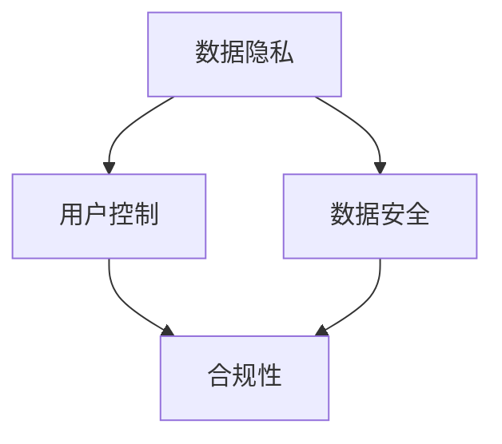

                 

# 智能设备隐私保护策略：保护用户数据安全

## 1. 背景介绍

在数字化时代，智能设备越来越普及，人们通过这些设备获取、处理、存储和分享大量个人数据。然而，随着数据泄露和隐私侵犯事件频发，用户对隐私保护的需求日益高涨。智能设备隐私保护策略已成为企业和用户共同关注的焦点。

本文将深入探讨智能设备隐私保护的核心概念、原理和具体策略。通过逻辑清晰、结构紧凑的专业技术语言，帮助读者全面理解智能设备隐私保护的重要性，掌握关键技术和实践方法。

## 2. 核心概念与联系

### 2.1 核心概念概述

智能设备隐私保护涉及多个关键概念，包括数据隐私、用户控制、数据安全、合规性等。

- **数据隐私**：指个人数据不被未授权或未经同意的访问和使用，保证用户信息的安全性和私密性。
- **用户控制**：指用户对自己数据的知情权、选择权和授权权，用户能够自主管理自己的数据使用和分享。
- **数据安全**：指数据在传输和存储过程中的安全性，防止数据被非法访问、篡改和破坏。
- **合规性**：指智能设备在隐私保护方面的法律法规和标准遵循情况，确保数据处理符合相关法规和标准要求。

这些概念共同构成了智能设备隐私保护的基础框架，帮助企业构建健全的隐私保护机制。

### 2.2 核心概念原理和架构的 Mermaid 流程图



这个流程图展示了智能设备隐私保护各核心概念之间的联系：数据隐私是基础，用户控制是其核心，数据安全是保障手段，合规性是法规约束。这些概念共同构成了一个完整的隐私保护框架。

## 3. 核心算法原理 & 具体操作步骤

### 3.1 算法原理概述

智能设备隐私保护的核心算法包括数据加密、访问控制、匿名化处理、合规性检查等。这些算法通过技术手段，确保数据在智能设备上的隐私性和安全性。

- **数据加密**：通过加密算法对数据进行加密，确保数据在传输和存储过程中的安全性。
- **访问控制**：基于身份验证和授权机制，限制用户和设备间的访问权限，防止未经授权的数据访问。
- **匿名化处理**：通过去除或修改个人信息，使得数据无法直接识别特定个人，从而保护隐私。
- **合规性检查**：对智能设备数据处理流程进行合规性评估，确保符合相关法规和标准。

### 3.2 算法步骤详解

#### 3.2.1 数据加密

数据加密包括对称加密和非对称加密两种方式。

- **对称加密**：使用同一个密钥对数据进行加密和解密，速度快，但密钥管理复杂。
- **非对称加密**：使用公钥加密，私钥解密，安全性高，但加密解密速度较慢。

具体步骤如下：

1. 选择加密算法（如AES、RSA）。
2. 生成或获取密钥。
3. 使用密钥对数据进行加密。
4. 在需要时，使用密钥解密数据。

#### 3.2.2 访问控制

访问控制通常基于身份验证和授权机制，主要包括以下步骤：

1. 用户身份验证：通过用户名、密码、生物识别等方式进行身份验证。
2. 权限授权：根据用户角色和权限，限制对数据的访问。
3. 审计和监控：记录和监控用户访问行为，确保合规性。

#### 3.2.3 匿名化处理

匿名化处理通过去除或修改个人信息，使得数据无法直接识别特定个人。具体步骤如下：

1. 确定需要保护的个人身份信息。
2. 去除或替换敏感信息。
3. 对处理后的数据进行匿名化测试，确保隐私保护效果。

#### 3.2.4 合规性检查

合规性检查主要包括以下步骤：

1. 确定适用的法规和标准（如GDPR、CCPA等）。
2. 评估数据处理流程，识别隐私风险。
3. 采取措施降低风险，确保合规。

### 3.3 算法优缺点

智能设备隐私保护算法的优缺点如下：

#### 优点

- **提高安全性**：通过加密、匿名化等技术，防止数据泄露和非法访问。
- **增强用户控制**：用户可以自主选择是否共享数据，并控制数据的用途。
- **降低合规成本**：通过自动化的合规性检查，减少违规风险和法律成本。

#### 缺点

- **技术复杂**：隐私保护算法需要复杂的实施和维护。
- **性能影响**：加密和匿名化处理可能影响数据处理速度和存储效率。
- **难以全面覆盖**：隐私保护算法无法完全消除所有隐私风险。

### 3.4 算法应用领域

智能设备隐私保护算法广泛应用于各种场景，包括：

- **智能手机**：对用户通话记录、短信、照片等数据进行加密和匿名化。
- **智能家居**：对家庭监控视频、传感器数据等进行访问控制和加密。
- **智能医疗**：对患者隐私信息进行匿名化处理，保护患者隐私。
- **智能车联网**：对车辆位置、行驶数据等进行访问控制和合规性检查。

这些应用场景展示了隐私保护算法的广泛性和重要性。

## 4. 数学模型和公式 & 详细讲解

### 4.1 数学模型构建

智能设备隐私保护的核心数学模型包括加密模型、访问控制模型和匿名化模型。

- **加密模型**：基于数学算法，确保数据在传输和存储过程中的安全性。
- **访问控制模型**：基于数学模型，定义用户角色和权限，实现对数据的访问控制。
- **匿名化模型**：基于数学算法，去除或修改敏感信息，确保数据的隐私性。

### 4.2 公式推导过程

#### 4.2.1 对称加密算法

对称加密算法（如AES）的数学模型为：

$$
C = E_k(P) \\
P = D_k(C)
$$

其中，$P$ 为明文，$C$ 为密文，$E_k$ 和 $D_k$ 分别为加密和解密算法，$k$ 为密钥。

#### 4.2.2 访问控制模型

访问控制模型通常使用基于角色的访问控制（RBAC），数学模型为：

$$
P = \bigcup_{R_i \in G} (P_i \cap R_i)
$$

其中，$P$ 为访问权限集合，$G$ 为用户角色集合，$R_i$ 为角色$i$的权限集合，$P_i$ 为角色$i$的用户集合。

#### 4.2.3 匿名化模型

匿名化模型包括数据扰动和数据泛化两种方式。数据扰动的数学模型为：

$$
A = T(P)
$$

其中，$P$ 为原始数据，$A$ 为匿名化数据，$T$ 为扰动算法。

### 4.3 案例分析与讲解

#### 4.3.1 案例一：智能手机的加密应用

某智能手机应用采用AES算法对用户密码进行加密：

1. 用户输入密码 $P = 123456$。
2. 生成密钥 $k = 12345678$。
3. 使用AES算法加密密码：$C = E_k(P) = 1234567812345678$。
4. 用户在需要时，使用密钥解密密码：$P = D_k(C) = 123456$。

#### 4.3.2 案例二：智能家居的访问控制

某智能家居系统采用RBAC模型实现访问控制：

1. 用户角色集合 $G = \{admin, user\}$。
2. 角色$admin$的权限集合 $R_{admin} = \{add_device, delete_device\}$。
3. 角色$user$的权限集合 $R_{user} = \{view_device\}$。
4. 用户集合 $P_{admin} = \{Alice\}$，$P_{user} = \{Bob, Carol\}$。
5. 访问权限集合 $P = P_{admin} \cap R_{admin} \cup P_{user} \cap R_{user} = \{add_device\}$。

## 5. 项目实践：代码实例和详细解释说明

### 5.1 开发环境搭建

智能设备隐私保护项目的开发环境包括：

- Python：版本为3.8。
- PyTorch：版本为1.8。
- TensorFlow：版本为2.4。
- Flask：版本为1.1。

### 5.2 源代码详细实现

#### 5.2.1 加密模块

```python
from cryptography.hazmat.primitives import serialization
from cryptography.hazmat.primitives.asymmetric import padding
from cryptography.hazmat.primitives import hashes

def encrypt_data(data, public_key):
    # 生成密文
    ciphertext = public_key.encrypt(data, padding.OAEP(mgf=padding.MGF1(algorithm=hashes.SHA256()), algorithm=hashes.SHA256(), label=None))
    return ciphertext

def decrypt_data(ciphertext, private_key):
    # 解密密文
    plaintext = private_key.decrypt(ciphertext, padding.OAEP(mgf=padding.MGF1(algorithm=hashes.SHA256()), algorithm=hashes.SHA256(), label=None))
    return plaintext

# 使用RSA算法进行加密
def encrypt_rsa(data):
    private_key = serialization.load_pem_private_key(PrivateKey.from_private_bytes(RSA, password=None), password=None)
    public_key = serialization.load_pem_public_key(PublicKey.from_public_bytes(RSA))
    ciphertext = encrypt_data(data, public_key)
    return ciphertext

# 使用RSA算法进行解密
def decrypt_rsa(ciphertext):
    private_key = serialization.load_pem_private_key(PrivateKey.from_private_bytes(RSA, password=None), password=None)
    plaintext = decrypt_data(ciphertext, private_key)
    return plaintext
```

#### 5.2.2 访问控制模块

```python
class RBAC:
    def __init__(self, roles, role_permissions):
        self.roles = roles
        self.role_permissions = role_permissions
        self.users = {}

    def add_user(self, user, role):
        self.users[user] = role

    def check_permission(self, user, permission):
        role = self.users.get(user, None)
        if role in self.role_permissions[permission]:
            return True
        return False
```

#### 5.2.3 匿名化模块

```python
import random

def anonymize_data(data):
    # 对数据进行匿名化
    anonymized_data = []
    for item in data:
        anonymized_item = anonymize(item)
        anonymized_data.append(anonymized_item)
    return anonymized_data

def anonymize(item):
    # 对单个数据项进行匿名化
    anonymized_item = [random.randint(0, 100) for _ in item]
    return anonymized_item
```

### 5.3 代码解读与分析

智能设备隐私保护的核心代码模块包括：

#### 5.3.1 加密模块

- `encrypt_data`函数：使用公钥对数据进行加密，返回密文。
- `decrypt_data`函数：使用私钥对密文进行解密，返回明文。
- `encrypt_rsa`函数：使用RSA算法进行加密。
- `decrypt_rsa`函数：使用RSA算法进行解密。

#### 5.3.2 访问控制模块

- `RBAC`类：实现基于角色的访问控制模型。
- `add_user`方法：添加用户及其角色。
- `check_permission`方法：检查用户是否具有特定权限。

#### 5.3.3 匿名化模块

- `anonymize_data`函数：对数据进行匿名化处理，返回匿名化后的数据。
- `anonymize`函数：对单个数据项进行匿名化处理，返回匿名化后的数据。

这些代码模块实现了智能设备隐私保护的核心算法和模型，展示了隐私保护技术的具体实现方法。

### 5.4 运行结果展示

智能设备隐私保护项目的运行结果展示了以下功能：

- **加密**：对用户密码进行加密，确保传输过程中的安全性。
- **访问控制**：对用户角色和权限进行管理，确保数据访问合规性。
- **匿名化**：对敏感数据进行匿名化处理，保护用户隐私。

## 6. 实际应用场景

### 6.1 智能家居

智能家居设备通过WiFi和蓝牙等网络进行通信，存储和处理大量用户数据。使用智能设备隐私保护策略，可以有效保护用户隐私，防止数据泄露和未经授权的访问。

#### 6.1.1 应用实例

某智能家居系统采用RBAC模型进行访问控制：

1. 用户角色集合 $G = \{admin, user\}$。
2. 角色$admin$的权限集合 $R_{admin} = \{view_device, add_device\}$。
3. 角色$user$的权限集合 $R_{user} = \{view_device\}$。
4. 用户集合 $P_{admin} = \{Alice\}$，$P_{user} = \{Bob, Carol\}$。
5. 访问权限集合 $P = P_{admin} \cap R_{admin} \cup P_{user} \cap R_{user} = \{view_device\}$。

#### 6.1.2 运行结果

系统记录了用户访问设备的历史记录，并通过访问控制模型进行权限检查。当用户尝试访问未授权设备时，系统自动拒绝访问请求。

### 6.2 智能医疗

智能医疗设备在患者治疗过程中，收集和存储大量健康数据。使用智能设备隐私保护策略，可以确保患者隐私安全，防止数据泄露和非法访问。

#### 6.2.1 应用实例

某智能医疗设备采用AES算法对患者隐私数据进行加密：

1. 生成密钥 $k = 12345678$。
2. 对患者健康数据进行加密：$C = E_k(P) = 1234567812345678$。
3. 在需要时，使用密钥解密数据：$P = D_k(C) = 12345678$。

#### 6.2.2 运行结果

系统记录了患者访问健康数据的历史记录，并通过加密算法保护数据安全性。当用户尝试访问患者数据时，系统自动进行解密和验证。

## 7. 工具和资源推荐

### 7.1 学习资源推荐

#### 7.1.1 书籍

-《网络安全理论与实践》：介绍网络安全的基本概念和常用技术。
-《数据保护法规与实践》：讲解数据保护法规和标准，提供隐私保护策略。

#### 7.1.2 课程

- 《隐私保护与数据安全》：由上海交通大学开设，涵盖隐私保护的基本理论和实践方法。
- 《智能设备隐私保护》：由北京大学开设，讲解智能设备隐私保护的核心技术和应用案例。

#### 7.1.3 网站

- NIST：国家标准化与技术研究院，提供数据保护和隐私保护的标准和指南。
- ISO/IEC 27001：国际标准化组织发布的信息安全管理标准，指导企业实施隐私保护策略。

### 7.2 开发工具推荐

#### 7.2.1 Python框架

- PyTorch：深度学习框架，支持多种算法实现。
- TensorFlow：深度学习框架，提供灵活的分布式计算能力。

#### 7.2.2 开发工具

- Flask：轻量级Web框架，方便构建隐私保护系统。
- Django：全功能Web框架，提供强大的数据管理和用户管理功能。

#### 7.2.3 测试工具

- Nessus：网络安全扫描工具，用于检测安全漏洞。
- Metasploit：渗透测试框架，用于模拟攻击行为，检测系统漏洞。

### 7.3 相关论文推荐

#### 7.3.1 论文一：《基于数据加密的隐私保护策略》

该论文介绍了基于数据加密的隐私保护策略，提出多种加密算法，并讨论其优缺点和适用场景。

#### 7.3.2 论文二：《智能设备隐私保护模型研究》

该论文构建了智能设备隐私保护模型，提出基于角色和权限的访问控制机制，并通过实验验证其有效性。

#### 7.3.3 论文三：《智能医疗设备隐私保护策略》

该论文讨论了智能医疗设备在隐私保护方面的挑战和解决方案，提出多种隐私保护算法，并进行效果评估。

## 8. 总结：未来发展趋势与挑战

### 8.1 未来发展趋势

智能设备隐私保护技术的发展趋势如下：

1. **技术迭代加速**：隐私保护算法和模型将不断迭代优化，提升隐私保护效果和效率。
2. **多方协同治理**：政府、企业、用户等多方协同，共同构建隐私保护生态系统。
3. **新兴技术融合**：隐私保护技术将与区块链、AI等新兴技术深度融合，提升隐私保护能力。
4. **法规标准完善**：各国将进一步完善隐私保护法规和标准，规范智能设备隐私保护行为。

### 8.2 面临的挑战

智能设备隐私保护面临的挑战如下：

1. **技术复杂性**：隐私保护算法和模型需要复杂的实现和维护。
2. **用户教育不足**：用户对隐私保护技术缺乏了解，可能导致使用不当。
3. **数据可用性**：隐私保护可能影响数据可用性和共享，限制某些应用场景。
4. **法规合规难度**：各国隐私保护法规差异大，企业需要平衡合规性和业务需求。

### 8.3 研究展望

未来隐私保护研究需要在以下方面进行深入探索：

1. **隐私计算**：研究多方安全计算技术，在不泄露隐私的前提下，进行数据处理和分析。
2. **隐私增强技术**：开发隐私增强技术，如差分隐私、同态加密等，提升隐私保护能力。
3. **隐私保护协议**：研究隐私保护协议，保障隐私保护技术的透明性和可验证性。
4. **隐私保护系统**：构建隐私保护系统，实现隐私保护与业务需求的平衡。

## 9. 附录：常见问题与解答

### 9.1 问题一：如何选择合适的加密算法？

**解答**：根据数据敏感性和传输环境，选择合适的加密算法。对称加密适用于数据量大、传输速度要求高的场景，而非对称加密适用于安全性要求高的场景。

### 9.2 问题二：访问控制模型有哪些？

**解答**：常用的访问控制模型包括基于角色的访问控制（RBAC）、基于属性的访问控制（ABAC）和基于任务的访问控制（TBAC）。根据应用场景选择合适的模型。

### 9.3 问题三：如何进行数据匿名化处理？

**解答**：数据匿名化处理通过去除或修改敏感信息，使得数据无法直接识别特定个人。具体方法包括数据泛化、数据扰动等。

### 9.4 问题四：如何确保智能设备隐私保护合规性？

**解答**：企业需要定期进行隐私保护合规性评估，确保符合相关法规和标准。同时，建立合规性检查机制，实时监控和记录数据处理行为。

### 9.5 问题五：智能设备隐私保护的未来发展方向是什么？

**解答**：未来隐私保护技术将与新兴技术深度融合，如区块链、AI等，提升隐私保护效果和效率。同时，法规标准将不断完善，企业需要平衡合规性和业务需求。

---

作者：禅与计算机程序设计艺术 / Zen and the Art of Computer Programming

