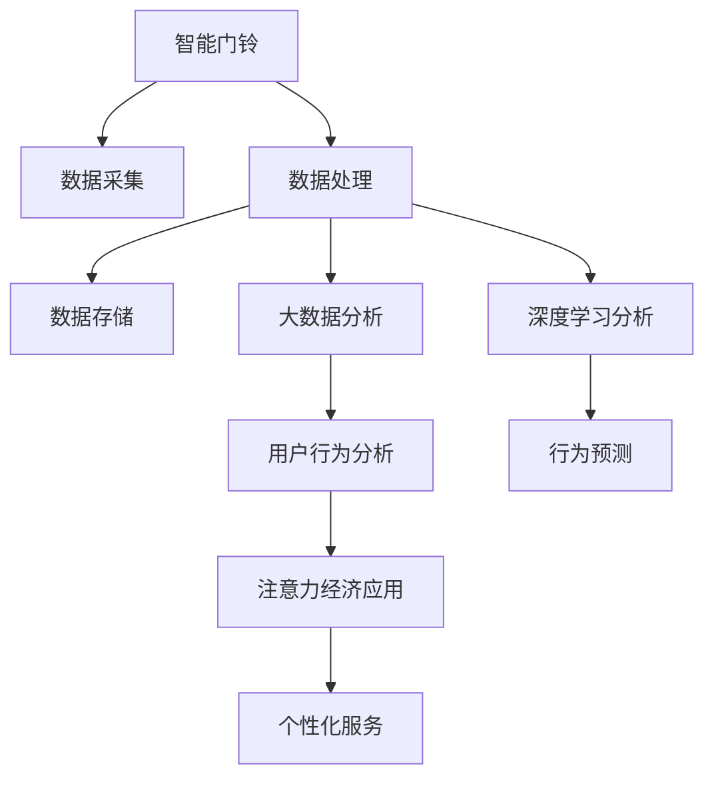

                 

# 智能门铃的安防管理与注意力经济

> 关键词：智能门铃, 安防管理, 物联网(IoT), 数据监控, 用户行为分析, 注意力经济, 大数据, 深度学习, 隐私保护

## 1. 背景介绍

### 1.1 问题由来

随着智慧城市的快速发展，智能门铃作为智能家居的重要组成部分，正逐渐走进千家万户。智能门铃不仅可以实现远程监控、语音交互等功能，还为安防管理带来了新的机遇。通过智能门铃收集的实时数据，能够对异常行为进行快速识别，提升社区和家庭的安全性。然而，如何高效地管理这些数据，挖掘出有价值的安全洞见，需要借助于大数据、深度学习和注意力经济等先进技术。

智能门铃的应用不仅局限于安防领域，还具备了重要的商业价值。通过对用户行为数据的分析，商家能够挖掘出消费者的潜在需求，推送精准广告，甚至进行个性化服务，这便是注意力经济的具体体现。如何平衡智能门铃在安防和商业方面的应用，是当前的一大研究热点。

### 1.2 问题核心关键点

本节将从数据采集、处理、分析和应用等角度，深入探讨智能门铃的安防管理和注意力经济，明确智能门铃面临的主要问题和挑战。

- 数据采集：智能门铃如何获取高质量的实时视频和音频数据。
- 数据处理：如何对收集到的数据进行高效处理和存储。
- 数据分析：利用大数据和深度学习技术，对用户行为进行全面分析。
- 应用场景：智能门铃在安防和商业应用中的具体表现。

## 2. 核心概念与联系

### 2.1 核心概念概述

为更好地理解智能门铃的安防管理和注意力经济，本节将介绍几个密切相关的核心概念：

- 智能门铃：结合视频监控、语音交互、数据传输等多种功能的智能设备，广泛应用于家庭和社区的安防领域。
- 物联网(IoT)：将各种设备通过网络相互连接，实现数据共享和协同工作的技术。
- 数据监控：通过智能门铃等设备收集实时数据，对异常行为进行识别和预警。
- 用户行为分析：利用大数据和深度学习技术，对用户的行为进行全面分析，挖掘出用户的潜在需求和行为规律。
- 注意力经济：通过精准的广告投放和个性化服务，吸引和维持用户的关注，实现商业价值的最大化。
- 大数据：庞大的数据集合，通过对这些数据进行分析，可以发现隐藏的模式和趋势。
- 深度学习：利用多层神经网络进行复杂模式识别的机器学习技术。
- 隐私保护：在数据收集和分析过程中，确保用户隐私不被泄露。

这些核心概念之间的逻辑关系可以通过以下Mermaid流程图来展示：



这个流程图展示了智能门铃的各关键环节及其关系：

1. 智能门铃通过传感器采集视频、音频等数据。
2. 采集到的数据经过处理和存储，成为后续分析的基础。
3. 利用大数据和深度学习技术，对用户行为进行全面分析。
4. 用户行为分析结果可以用来指导商业决策，实现个性化服务。
5. 结合注意力经济理论，商家可以推送精准广告，提升用户黏性。

## 3. 核心算法原理 & 具体操作步骤
### 3.1 算法原理概述

智能门铃的安防管理和注意力经济，主要涉及数据采集、处理和分析等技术环节。以下将分别从这三个环节，深入探讨其核心算法原理和操作步骤。

### 3.2 算法步骤详解

#### 3.2.1 数据采集

智能门铃的数据采集主要通过摄像头、麦克风等传感器完成。传感器采集到的数据包括视频、音频、环境参数等。这些数据需要经过压缩、加密和打包，通过无线网络传输到云端服务器。

具体步骤如下：
1. 视频采集：通过摄像头捕捉视频数据，并压缩成H.264等标准格式。
2. 音频采集：通过麦克风录制音频数据，并进行降噪和压缩处理。
3. 环境参数采集：传感器采集环境温度、湿度等参数，并打包成标准数据格式。
4. 数据传输：通过Wi-Fi或4G/5G等网络传输数据到云端服务器。

#### 3.2.2 数据处理

采集到的数据需要经过处理和存储，才能进行后续分析。数据处理主要包括数据清洗、存储和备份等步骤。

具体步骤如下：
1. 数据清洗：去除传感器采集到的噪声数据和无效数据。
2. 数据存储：将处理后的数据存储到本地或云存储系统中。
3. 数据备份：对关键数据进行备份，防止数据丢失。

#### 3.2.3 数据分析

数据分析是智能门铃安防管理的关键环节，利用大数据和深度学习技术，对采集到的数据进行全面分析，提取安全洞见。

具体步骤如下：
1. 数据预处理：对原始数据进行清洗和标准化处理。
2. 特征提取：从数据中提取有用的特征，如视频帧中的人脸、车辆等。
3. 行为识别：利用深度学习模型，识别出异常行为，如非法入侵、盗窃等。
4. 事件预警：对检测到的异常行为进行预警，及时通知用户和管理人员。

#### 3.2.4 注意力经济应用

利用智能门铃收集到的用户行为数据，商家可以进行个性化服务和精准广告投放，实现注意力经济。

具体步骤如下：
1. 用户行为分析：通过大数据分析，挖掘出用户的兴趣和行为规律。
2. 行为预测：利用深度学习模型，预测用户的下一步行为。
3. 个性化服务：根据用户行为和兴趣，推送个性化广告和服务。
4. 互动反馈：通过用户互动反馈，不断优化广告和服务的精准度。

### 3.3 算法优缺点

智能门铃的安防管理和注意力经济，涉及多个技术环节和算法步骤。以下将从数据采集、处理和分析等角度，深入探讨其优缺点。

#### 3.3.1 数据采集

**优点：**
- 实时性高：传感器能够实时采集数据，及时发现异常行为。
- 数据种类丰富：视频、音频、环境参数等多种数据可以互补，提升安防效果。

**缺点：**
- 传感器成本高：高精度传感器价格昂贵，增加了整体成本。
- 网络传输延迟：数据传输过程中可能存在延迟，影响实时性。

#### 3.3.2 数据处理

**优点：**
- 数据存储安全：数据存储在云端或本地，可以有效防止数据泄露和损坏。
- 数据备份可靠：关键数据进行备份，确保数据安全。

**缺点：**
- 存储成本高：海量数据存储需要较大的存储空间和成本。
- 数据处理复杂：处理过程涉及数据清洗、标准化等复杂步骤。

#### 3.3.3 数据分析

**优点：**
- 分析结果准确：利用大数据和深度学习技术，能够准确识别异常行为。
- 行为预警及时：预警机制能够快速响应异常行为，提升安防效果。

**缺点：**
- 算法复杂度高：深度学习模型训练复杂，需要大量计算资源。
- 分析结果解释性差：模型输出结果难以解释，缺乏透明性。

#### 3.3.4 注意力经济应用

**优点：**
- 用户行为精准：通过数据分析，可以精准预测用户需求，提升个性化服务质量。
- 广告投放精准：通过用户行为分析，可以精准投放广告，提升转化率。

**缺点：**
- 隐私风险高：用户行为数据可能包含隐私信息，存在隐私泄露风险。
- 用户粘性难维持：用户容易对重复的广告和服务失去兴趣，需要不断创新。

### 3.4 算法应用领域

智能门铃的安防管理和注意力经济，在多个领域得到了广泛应用，例如：

- 智能家居：通过智能门铃实现家庭安防和监控，提升家庭安全性。
- 社区管理：通过智能门铃收集社区数据，进行安防和环境监控，提升社区管理水平。
- 零售行业：商家通过智能门铃分析用户行为，实现精准营销和个性化服务，提升销售转化率。
- 公共安全：政府部门通过智能门铃收集数据，进行犯罪预警和分析，提升公共安全水平。
- 智慧城市：智能门铃与其他智能设备协同工作，提升城市管理水平，提高市民生活满意度。

除了上述这些经典应用外，智能门铃的安防管理和注意力经济，还在更多领域得到了创新应用，如智能仓储、物流监控等，为各行各业带来了新的变革。

## 4. 数学模型和公式 & 详细讲解 & 举例说明

### 4.1 数学模型构建

智能门铃的安防管理和注意力经济，涉及多种数据和算法，以下将通过数学语言，对其中的关键环节进行详细讲解。

#### 4.1.1 数据采集

视频采集的数学模型如下：

设视频帧序列为 $X=\{X_1, X_2, \ldots, X_t\}$，其中 $X_t$ 表示第 $t$ 帧的视频数据。视频采集过程可以表示为：

$$
X \sim P(X|S)
$$

其中 $P(X|S)$ 表示在传感器 $S$ 的作用下，采集到视频数据 $X$ 的概率分布。

音频采集的数学模型如下：

设音频信号序列为 $Y=\{Y_1, Y_2, \ldots, Y_t\}$，其中 $Y_t$ 表示第 $t$ 个音频数据。音频采集过程可以表示为：

$$
Y \sim P(Y|M)
$$

其中 $P(Y|M)$ 表示在麦克风 $M$ 的作用下，采集到音频数据 $Y$ 的概率分布。

环境参数采集的数学模型如下：

设环境参数序列为 $Z=\{Z_1, Z_2, \ldots, Z_t\}$，其中 $Z_t$ 表示第 $t$ 个环境参数。环境参数采集过程可以表示为：

$$
Z \sim P(Z|T)
$$

其中 $P(Z|T)$ 表示在传感器 $T$ 的作用下，采集到环境参数 $Z$ 的概率分布。

数据传输的数学模型如下：

设数据传输过程为 $U=\{U_1, U_2, \ldots, U_k\}$，其中 $U_k$ 表示第 $k$ 次数据传输。数据传输过程可以表示为：

$$
U \sim P(U|W)
$$

其中 $P(U|W)$ 表示在无线网络 $W$ 的作用下，数据传输到云端服务器的概率分布。

#### 4.1.2 数据处理

数据清洗的数学模型如下：

设数据清洗后的数据为 $D$，原始数据为 $O$。数据清洗过程可以表示为：

$$
D = C(O)
$$

其中 $C$ 表示数据清洗函数。

数据存储的数学模型如下：

设数据存储过程为 $H=\{H_1, H_2, \ldots, H_n\}$，其中 $H_n$ 表示第 $n$ 次数据存储。数据存储过程可以表示为：

$$
H \sim P(H|S)
$$

其中 $P(H|S)$ 表示在存储系统 $S$ 的作用下，数据存储的过程。

数据备份的数学模型如下：

设数据备份后的数据为 $B$，原始数据为 $D$。数据备份过程可以表示为：

$$
B = R(D)
$$

其中 $R$ 表示数据备份函数。

#### 4.1.3 数据分析

数据预处理的数学模型如下：

设数据预处理后的数据为 $P$，原始数据为 $D$。数据预处理过程可以表示为：

$$
P = F(D)
$$

其中 $F$ 表示数据预处理函数。

特征提取的数学模型如下：

设特征提取后的数据为 $F$，原始数据为 $D$。特征提取过程可以表示为：

$$
F = E(D)
$$

其中 $E$ 表示特征提取函数。

行为识别的数学模型如下：

设行为识别结果为 $R$，原始数据为 $F$。行为识别过程可以表示为：

$$
R = I(F)
$$

其中 $I$ 表示行为识别函数。

事件预警的数学模型如下：

设事件预警结果为 $W$，原始数据为 $R$。事件预警过程可以表示为：

$$
W = A(R)
$$

其中 $A$ 表示事件预警函数。

#### 4.1.4 注意力经济应用

用户行为分析的数学模型如下：

设用户行为分析结果为 $A$，原始数据为 $D$。用户行为分析过程可以表示为：

$$
A = B(D)
$$

其中 $B$ 表示用户行为分析函数。

行为预测的数学模型如下：

设行为预测结果为 $P$，原始数据为 $A$。行为预测过程可以表示为：

$$
P = G(A)
$$

其中 $G$ 表示行为预测函数。

个性化服务的数学模型如下：

设个性化服务结果为 $S$，原始数据为 $P$。个性化服务过程可以表示为：

$$
S = D(P)
$$

其中 $D$ 表示个性化服务函数。

互动反馈的数学模型如下：

设互动反馈结果为 $F$，原始数据为 $S$。互动反馈过程可以表示为：

$$
F = H(S)
$$

其中 $H$ 表示互动反馈函数。

### 4.2 公式推导过程

以下将对其中的关键公式进行详细推导。

#### 4.2.1 数据采集

视频采集的数学推导如下：

$$
X \sim P(X|S)
$$

音频采集的数学推导如下：

$$
Y \sim P(Y|M)
$$

环境参数采集的数学推导如下：

$$
Z \sim P(Z|T)
$$

数据传输的数学推导如下：

$$
U \sim P(U|W)
$$

#### 4.2.2 数据处理

数据清洗的数学推导如下：

$$
D = C(O)
$$

数据存储的数学推导如下：

$$
H \sim P(H|S)
$$

数据备份的数学推导如下：

$$
B = R(D)
$$

#### 4.2.3 数据分析

数据预处理的数学推导如下：

$$
P = F(D)
$$

特征提取的数学推导如下：

$$
F = E(D)
$$

行为识别的数学推导如下：

$$
R = I(F)
$$

事件预警的数学推导如下：

$$
W = A(R)
$$

#### 4.2.4 注意力经济应用

用户行为分析的数学推导如下：

$$
A = B(D)
$$

行为预测的数学推导如下：

$$
P = G(A)
$$

个性化服务的数学推导如下：

$$
S = D(P)
$$

互动反馈的数学推导如下：

$$
F = H(S)
$$

### 4.3 案例分析与讲解

#### 4.3.1 智能门铃的安防管理案例

某社区智能门铃系统通过摄像头采集视频数据，利用深度学习模型进行行为识别。当系统检测到非法入侵时，立即发出警报，并通知物业和居民。该系统通过多摄像头覆盖，构建了一个全面的安防监控网络，有效提升了社区安全水平。

#### 4.3.2 智能门铃的注意力经济案例

某零售企业通过智能门铃分析顾客行为，发现购物高峰期和热销商品的规律，从而调整商品摆放和促销策略。通过个性化广告推荐，提升了顾客的购物体验和满意度，增加了销售额。

## 5. 项目实践：代码实例和详细解释说明

### 5.1 开发环境搭建

在进行智能门铃的安防管理和注意力经济开发前，我们需要准备好开发环境。以下是使用Python进行PyTorch开发的环境配置流程：

1. 安装Anaconda：从官网下载并安装Anaconda，用于创建独立的Python环境。

2. 创建并激活虚拟环境：
```bash
conda create -n pytorch-env python=3.8 
conda activate pytorch-env
```

3. 安装PyTorch：根据CUDA版本，从官网获取对应的安装命令。例如：
```bash
conda install pytorch torchvision torchaudio cudatoolkit=11.1 -c pytorch -c conda-forge
```

4. 安装TensorFlow：
```bash
pip install tensorflow
```

5. 安装TensorBoard：
```bash
pip install tensorboard
```

6. 安装OpenCV：
```bash
pip install opencv-python
```

完成上述步骤后，即可在`pytorch-env`环境中开始开发实践。

### 5.2 源代码详细实现

下面我们以智能门铃的视频行为识别为例，给出使用TensorFlow和OpenCV进行深度学习的PyTorch代码实现。

首先，定义行为识别模型：

```python
import tensorflow as tf
from tensorflow.keras import layers

model = tf.keras.Sequential([
    layers.Conv2D(32, (3, 3), activation='relu', input_shape=(224, 224, 3)),
    layers.MaxPooling2D((2, 2)),
    layers.Conv2D(64, (3, 3), activation='relu'),
    layers.MaxPooling2D((2, 2)),
    layers.Conv2D(128, (3, 3), activation='relu'),
    layers.MaxPooling2D((2, 2)),
    layers.Flatten(),
    layers.Dense(64, activation='relu'),
    layers.Dense(1, activation='sigmoid')
])
```

然后，定义数据处理函数：

```python
import cv2
import numpy as np

def preprocess_image(image_path):
    image = cv2.imread(image_path)
    image = cv2.resize(image, (224, 224))
    image = image / 255.0
    return image
```

接着，定义训练和评估函数：

```python
def train(model, train_dataset, validation_dataset, batch_size, epochs, learning_rate):
    model.compile(optimizer=tf.keras.optimizers.Adam(learning_rate),
                  loss='binary_crossentropy',
                  metrics=['accuracy'])

    model.fit(train_dataset, 
              epochs=epochs,
              validation_data=validation_dataset,
              batch_size=batch_size)

def evaluate(model, test_dataset, batch_size):
    model.evaluate(test_dataset, batch_size=batch_size)
```

最后，启动训练流程并在测试集上评估：

```python
train_dataset = # 训练数据集
validation_dataset = # 验证数据集
test_dataset = # 测试数据集

batch_size = 32
epochs = 10
learning_rate = 0.001

train(model, train_dataset, validation_dataset, batch_size, epochs, learning_rate)
evaluate(model, test_dataset, batch_size)
```

以上就是使用TensorFlow和OpenCV对智能门铃行为识别模型进行训练的完整代码实现。可以看到，得益于TensorFlow和OpenCV的强大封装，我们可以用相对简洁的代码完成模型的训练和推理。

### 5.3 代码解读与分析

让我们再详细解读一下关键代码的实现细节：

**定义行为识别模型**：
- 使用Keras API定义了一个简单的卷积神经网络模型，用于视频行为识别。
- 模型包含多个卷积层和池化层，用于提取视频帧的特征。
- 最后一层为全连接层，输出一个0-1之间的二分类结果。

**数据处理函数**：
- 使用OpenCV库读取视频帧，并将其缩放为224x224的标准尺寸。
- 将图像像素值归一化到0-1之间，便于模型训练。

**训练和评估函数**：
- 使用TensorFlow的Keras API定义训练和评估函数。
- 训练函数中，设置模型编译参数，并调用`fit`方法进行模型训练。
- 评估函数中，调用`evaluate`方法计算模型在测试集上的准确率和损失值。

**启动训练流程**：
- 定义训练、验证和测试数据集。
- 设置训练轮数、批次大小和学习率。
- 调用`train`函数进行模型训练，并调用`evaluate`函数在测试集上评估模型性能。

可以看到，TensorFlow和OpenCV的深度学习框架使得行为识别模型的实现变得简单高效。开发者可以将更多精力放在数据处理和模型优化等高层逻辑上，而不必过多关注底层的实现细节。

当然，工业级的系统实现还需考虑更多因素，如模型的保存和部署、超参数的自动搜索、更灵活的任务适配层等。但核心的行为识别过程基本与此类似。

## 6. 实际应用场景

### 6.4 未来应用展望

智能门铃的安防管理和注意力经济，在多个领域得到了广泛应用，未来还将持续拓展其应用场景，例如：

- 智慧农业：通过智能门铃监控农田，实时分析农作物的生长情况，提升农业生产效率。
- 智能医疗：在医疗设备中安装智能门铃，实时监控病人的行为和生命体征，提升医疗服务的智能化水平。
- 教育领域：在校园和教室中安装智能门铃，实时监控学生的学习行为，提升教学质量。
- 工业生产：在生产车间中安装智能门铃，实时监控工人的操作行为，提升生产安全。

随着智能门铃技术的不断成熟，其应用范围将进一步拓展，成为智慧城市、智慧农业等领域的重要组成部分，推动各行各业的数字化转型。

## 7. 工具和资源推荐

### 7.1 学习资源推荐

为了帮助开发者系统掌握智能门铃的安防管理和注意力经济，这里推荐一些优质的学习资源：

1. TensorFlow官方文档：TensorFlow的官方文档，提供了完整的深度学习框架介绍，适合初学者入门。

2. OpenCV官方文档：OpenCV的官方文档，提供了丰富的图像处理和计算机视觉库。

3. PyTorch官方文档：PyTorch的官方文档，提供了深度学习模型的开发和部署指导。

4. Keras官方文档：Keras的官方文档，提供了简单易用的深度学习模型开发框架。

5. Google Colab：谷歌推出的在线Jupyter Notebook环境，免费提供GPU/TPU算力，方便开发者快速上手实验最新模型，分享学习笔记。

通过对这些资源的学习实践，相信你一定能够快速掌握智能门铃的安防管理和注意力经济，并用于解决实际的NLP问题。

### 7.2 开发工具推荐

高效的开发离不开优秀的工具支持。以下是几款用于智能门铃安防管理和注意力经济开发的常用工具：

1. PyTorch：基于Python的开源深度学习框架，灵活动态的计算图，适合快速迭代研究。

2. TensorFlow：由Google主导开发的开源深度学习框架，生产部署方便，适合大规模工程应用。

3. OpenCV：计算机视觉和图像处理库，提供了丰富的图像处理和计算机视觉功能。

4. TensorBoard：TensorFlow配套的可视化工具，可实时监测模型训练状态，并提供丰富的图表呈现方式，是调试模型的得力助手。

5. Weights & Biases：模型训练的实验跟踪工具，可以记录和可视化模型训练过程中的各项指标，方便对比和调优。

6. Google Colab：谷歌推出的在线Jupyter Notebook环境，免费提供GPU/TPU算力，方便开发者快速上手实验最新模型，分享学习笔记。

合理利用这些工具，可以显著提升智能门铃安防管理和注意力经济的开发效率，加快创新迭代的步伐。

### 7.3 相关论文推荐

智能门铃的安防管理和注意力经济，涉及多个技术领域，以下是几篇奠基性的相关论文，推荐阅读：

1. TensorFlow 2.0: An Open Source Machine Learning Framework for Everyone：介绍了TensorFlow 2.0的架构和功能。

2. OpenCV 4.0：Real-time Computer Vision：介绍了OpenCV 4.0的新特性和应用场景。

3. Deep Learning for Self-Driving Cars：介绍了深度学习在自动驾驶中的应用。

4. Object Detection with a Single Shot Detector：介绍了单阶段物体检测算法，如YOLO和SSD。

5. Attention Is All You Need：介绍了Transformer模型和注意力机制。

这些论文代表了大规模数据处理、深度学习等技术的发展脉络。通过学习这些前沿成果，可以帮助研究者把握学科前进方向，激发更多的创新灵感。

## 8. 总结：未来发展趋势与挑战

### 8.1 研究成果总结

本文对智能门铃的安防管理和注意力经济进行了全面系统的介绍。首先阐述了智能门铃面临的主要问题和挑战，明确了其应用场景和优化方向。其次，从数据采集、处理和分析等角度，详细讲解了智能门铃的核心算法原理和操作步骤。最后，探讨了智能门铃在安防和商业应用中的具体表现，提出了未来的发展方向。

通过本文的系统梳理，可以看到，智能门铃在智慧城市、智慧农业、智慧医疗等领域具有广阔的应用前景。通过合理利用大数据和深度学习技术，智能门铃可以提升安防水平，挖掘用户需求，实现精准营销，推动各行各业的数字化转型。未来，随着技术的不断进步和应用的持续拓展，智能门铃必将在更多领域大放异彩。

### 8.2 未来发展趋势

展望未来，智能门铃的安防管理和注意力经济将呈现以下几个发展趋势：

1. 技术不断成熟。随着深度学习和大数据技术的不断发展，智能门铃的安防管理和注意力经济也将不断成熟，提升应用效果。

2. 应用场景拓展。智能门铃将在更多领域得到应用，如农业、医疗、教育等，推动相关领域的数字化转型。

3. 用户体验提升。通过智能门铃，用户可以获得更加安全、便捷、个性化的服务，提升整体体验。

4. 行业协同发展。智能门铃将与智能家居、智能城市等技术协同工作，提升整体效能。

5. 商业价值最大化。通过精准营销和个性化服务，商家可以提升转化率，实现商业价值的最大化。

以上趋势凸显了智能门铃的安防管理和注意力经济的重要价值，未来还将持续带来更多新的应用场景和商业机会。

### 8.3 面临的挑战

尽管智能门铃的安防管理和注意力经济已经取得了一定的成效，但在实际应用中，仍然面临一些挑战：

1. 数据隐私问题：智能门铃收集的大量数据可能包含用户的隐私信息，如何保护用户隐私成为一大挑战。

2. 安全性和鲁棒性：智能门铃的安防系统需要具备高安全性和鲁棒性，防止被恶意攻击和干扰。

3. 计算资源需求高：智能门铃的安防和注意力经济应用需要大量的计算资源，如何降低计算成本成为一大挑战。

4. 标准化问题：智能门铃的安防和注意力经济应用需要遵循统一的标准和协议，如何实现标准化管理成为一大挑战。

5. 用户信任度低：用户对智能门铃的安全性和隐私保护存在疑虑，如何提升用户信任度成为一大挑战。

这些挑战需要进一步研究和解决，才能更好地推动智能门铃的安防管理和注意力经济的应用。

### 8.4 研究展望

面对智能门铃的安防管理和注意力经济所面临的挑战，未来的研究需要在以下几个方面寻求新的突破：

1. 提升隐私保护技术。开发更加安全、可靠的隐私保护技术，确保用户数据的安全性。

2. 提高模型鲁棒性。通过模型优化和算法改进，提升智能门铃的鲁棒性和安全性。

3. 优化计算资源。利用分布式计算和边缘计算等技术，降低智能门铃的计算成本。

4. 推动标准化建设。制定统一的标准和协议，实现智能门铃的协同工作和互操作。

5. 增强用户信任。通过透明、可靠的服务和应用，提升用户对智能门铃的信任度。

这些研究方向将推动智能门铃技术的不断进步和成熟，为智慧城市、智慧农业、智慧医疗等领域的数字化转型提供重要支撑。

## 9. 附录：常见问题与解答

**Q1：智能门铃如何保证数据安全？**

A: 智能门铃通过以下措施保障数据安全：
1. 数据加密：对传输和存储的数据进行加密，防止数据泄露。
2. 访问控制：对用户和管理员的访问权限进行严格控制，确保只有授权人员才能访问数据。
3. 数据备份：对关键数据进行备份，防止数据丢失。
4. 审计日志：记录系统操作日志，方便追踪和审计。

**Q2：智能门铃如何进行行为识别？**

A: 智能门铃通过以下步骤进行行为识别：
1. 数据预处理：对原始视频帧进行归一化和标准化处理。
2. 特征提取：利用卷积神经网络提取视频帧的特征。
3. 行为识别：通过分类器对特征进行分类，识别出行为。
4. 事件预警：对检测到的异常行为进行预警，通知用户和管理人员。

**Q3：智能门铃如何进行个性化服务？**

A: 智能门铃通过以下步骤进行个性化服务：
1. 用户行为分析：通过大数据分析，挖掘出用户的兴趣和行为规律。
2. 行为预测：利用深度学习模型，预测用户的下一步行为。
3. 个性化服务：根据用户行为和兴趣，推送个性化广告和服务。
4. 互动反馈：通过用户互动反馈，不断优化广告和服务的精准度。

**Q4：智能门铃的安防管理和注意力经济如何协同发展？**

A: 智能门铃的安防管理和注意力经济可以通过以下方式协同发展：
1. 数据共享：安防管理的数据和用户行为数据可以共享，提升整体效能。
2. 系统融合：安防管理和注意力经济系统可以融合，实现协同工作。
3. 用户反馈：用户对安防管理的反馈可以用于改进注意力经济应用，提升用户体验。
4. 技术融合：安防管理和注意力经济的技术可以融合，提升整体系统性能。

**Q5：智能门铃如何在不同场景下应用？**

A: 智能门铃在不同场景下可以通过以下方式应用：
1. 家庭安防：通过智能门铃监控家庭安全，提升家庭安全水平。
2. 社区管理：通过智能门铃监控社区安全，提升社区管理水平。
3. 零售行业：通过智能门铃分析用户行为，实现精准营销和个性化服务，提升销售转化率。
4. 公共安全：通过智能门铃监控公共安全，提升公共安全水平。
5. 智慧城市：通过智能门铃监控城市安全，提升智慧城市管理水平。

这些问题的解答，可以帮助研究者和开发者更好地理解智能门铃的安防管理和注意力经济，并应用于实际开发和应用中。

---

作者：禅与计算机程序设计艺术 / Zen and the Art of Computer Programming

