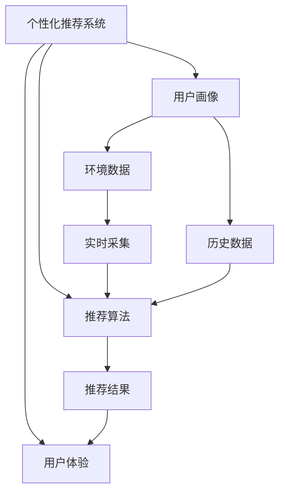

                 

# 智能防晒创业：个性化紫外线防护

> 关键词：智能防晒，紫外线防护，个性化推荐，机器学习，数据挖掘，客户画像，用户体验优化

## 1. 背景介绍

随着人工智能技术的快速发展，个性化推荐系统在电商、娱乐、社交等多个领域已取得显著成效。然而，智能防晒领域的个性化推荐仍处于探索阶段。传统防晒产品仅依靠SPF、PA值等物理指标进行防护等级划分，难以满足现代消费者个性化、场景化的需求。如何利用人工智能技术，构建智能防晒系统，提供个性化紫外线防护方案，成为亟需解决的问题。

### 1.1 问题由来

近年来，随着全球气候变暖和紫外线辐射强度不断增加，公众对防晒的意识和需求日益增强。然而，市面上的防晒产品普遍存在防护等级单一、适用范围有限的问题。例如，一瓶防晒产品可能只能应对户外工作或室内活动，却难以适应沙滩度假、户外运动等多种场景。

当前，消费者对于防晒的需求更加多样化和场景化，不仅希望获得高防护等级，还希望产品能够适配具体皮肤类型、活动类型等个性化需求。如何借助智能技术，构建个性化防晒推荐系统，是值得深入探讨的问题。

### 1.2 问题核心关键点

智能防晒推荐系统的核心在于：利用用户行为数据、地理位置、时间、皮肤类型等特征，构建用户画像，结合历史推荐结果和实时环境数据，动态调整推荐策略，实现个性化紫外线防护。

具体而言，系统的实现需要：
- 收集用户行为数据，提取特征并进行用户画像建模。
- 实时采集环境数据，包括紫外线强度、时间、地理位置等。
- 结合历史推荐结果和实时环境数据，动态生成个性化防护方案。
- 利用推荐算法，提升用户体验，并优化推荐效果。

## 2. 核心概念与联系

### 2.1 核心概念概述

为了更好地理解智能防晒推荐系统的实现原理，本节将介绍几个关键概念：

- 个性化推荐系统(Recommendation System)：通过分析用户行为数据和历史推荐记录，为用户推荐个性化内容，如商品、音乐、视频等。
- 用户画像(User Profile)：通过用户数据构建的、反映用户特征的模型，用于个性化的推荐和定制服务。
- 环境数据(Environment Data)：包括地理位置、时间、天气、紫外线强度等，用于实时调整推荐策略。
- 推荐算法(Recommendation Algorithm)：用于生成推荐结果的算法，如协同过滤、基于内容的推荐、深度学习等。
- 用户体验(User Experience)：基于推荐结果，提升用户使用体验，优化推荐效果。

这些核心概念之间的逻辑关系可以通过以下Mermaid流程图来展示：



这个流程图展示了个性化推荐系统的核心组件及其之间的关系：

1. 用户画像模块通过用户数据构建用户特征模型。
2. 环境数据模块实时采集环境参数，用于动态调整推荐策略。
3. 推荐算法模块结合历史推荐结果和实时环境数据，生成推荐结果。
4. 推荐结果用于优化用户体验，提升推荐效果。

## 3. 核心算法原理 & 具体操作步骤

### 3.1 算法原理概述

智能防晒推荐系统的核心算法是基于协同过滤的个性化推荐算法。其基本思想是：通过分析用户的历史行为数据，发现与目标用户相似的用户群，并基于这些用户的偏好，为当前用户推荐相似的物品。具体实现中，协同过滤算法分为用户-物品协同过滤和物品-物品协同过滤两种。

### 3.2 算法步骤详解

基于协同过滤的智能防晒推荐系统实现步骤如下：

**Step 1: 数据准备**

- 收集用户历史行为数据，如使用产品的次数、使用时间、评价等。
- 采集环境数据，如地理位置、时间、紫外线强度等。
- 对用户行为数据进行清洗、归一化等预处理。

**Step 2: 用户画像构建**

- 利用K-means等聚类算法，对用户进行分群，构建用户画像。
- 通过分析用户画像，发现不同群体的共同特征，如偏好、季节等。

**Step 3: 环境数据处理**

- 实时采集环境数据，并进行预处理，如滤波、归一化等。
- 根据环境数据，计算当前紫外线强度、天气状况等指标。

**Step 4: 推荐算法应用**

- 利用协同过滤算法，结合用户画像和环境数据，生成推荐结果。
- 根据实时环境数据，动态调整推荐策略，优化防护等级。

**Step 5: 用户体验优化**

- 利用推荐结果，展示个性化防护方案，提升用户体验。
- 实时反馈用户评价，调整推荐策略，优化推荐效果。

**Step 6: 推荐结果更新**

- 定期更新用户历史行为数据和环境数据，重新构建用户画像，优化推荐算法。
- 实时监测用户行为，发现异常变化，及时调整推荐策略。

### 3.3 算法优缺点

基于协同过滤的智能防晒推荐系统具有以下优点：

1. 简单易实现。协同过滤算法思路清晰，易于实现和维护。
2. 对数据要求不高。相比基于内容的推荐算法，协同过滤算法对物品特征的依赖较小，适用于数据量有限的情况。
3. 个性化推荐效果较好。协同过滤算法能够捕捉用户隐含的偏好，生成个性化推荐结果。

然而，该算法也存在一些缺点：

1. 冷启动问题。协同过滤算法对新用户的推荐效果较差，需要用户进行一定的交互才能有效。
2. 数据稀疏性。用户历史行为数据通常较为稀疏，难以构建准确的协同矩阵。
3. 无法处理物品间的差异性。协同过滤算法只能考虑用户间的相似性，难以处理物品间的差异性。
4. 缺少外部信息。协同过滤算法仅基于用户和物品的协同矩阵进行推荐，无法利用外部信息进行补充。

尽管存在这些局限性，但基于协同过滤的智能防晒推荐系统仍是大规模实际应用的主流算法。未来相关研究的方向在于：如何提升冷启动效果，如何增强物品间的差异性处理能力，以及如何利用外部信息提升推荐效果。

### 3.4 算法应用领域

基于协同过滤的智能防晒推荐系统已在多个应用场景中得到了成功应用：

- 电商网站：推荐用户可能感兴趣的商品，提升用户购买率。
- 在线视频平台：推荐用户可能喜欢的视频内容，增加用户粘性。
- 社交媒体：推荐用户可能感兴趣的内容，扩大用户活跃度。
- 旅游景区：推荐用户可能感兴趣的旅游目的地，提高用户满意度。
- 金融投资：推荐用户可能感兴趣的金融产品，增加投资收益。

此外，智能防晒推荐系统在其他垂直领域的应用也在逐步拓展，如运动健身、健康饮食等，为人们提供更加个性化、场景化的防护方案。

## 4. 数学模型和公式 & 详细讲解 & 举例说明

### 4.1 数学模型构建

基于协同过滤的智能防晒推荐系统，其数学模型可以表示为：

设用户集合为 $U$，物品集合为 $I$，用户与物品之间的交互矩阵为 $R_{ui}$，用户画像矩阵为 $P_{ui}$，环境数据矩阵为 $E_{ui}$，推荐结果矩阵为 $Y_{ui}$。则推荐模型的数学模型可表示为：

$$
Y_{ui} = f(P_{ui}, E_{ui}, R_{ui})
$$

其中 $f$ 为推荐函数，将用户画像、环境数据和交互矩阵映射为推荐结果。

### 4.2 公式推导过程

在推荐算法中，常用的协同过滤方法包括基于用户的协同过滤和基于物品的协同过滤。下面分别介绍这两种方法的公式推导过程。

**基于用户的协同过滤公式推导**

基于用户的协同过滤方法，假设用户 $u$ 和用户 $v$ 有 $n$ 个共同物品，表示为 $R_{uv}$。则用户 $u$ 对物品 $i$ 的评分 $p_{ui}$ 可以表示为：

$$
p_{ui} = \frac{1}{n} \sum_{v \in U}\frac{R_{uv} \cdot P_{vi}}{\sqrt{\sum_{v \in U} P_{vi}^2}}
$$

其中 $P_{vi}$ 为用户 $v$ 对物品 $i$ 的评分。

**基于物品的协同过滤公式推导**

基于物品的协同过滤方法，假设物品 $i$ 和物品 $j$ 有 $n$ 个共同用户，表示为 $R_{ij}$。则物品 $i$ 的评分 $p_{ui}$ 可以表示为：

$$
p_{ui} = \frac{1}{n} \sum_{j \in I} \frac{R_{ij} \cdot P_{uj}}{\sqrt{\sum_{j \in I} P_{uj}^2}}
$$

其中 $P_{uj}$ 为用户 $u$ 对物品 $j$ 的评分。

在实际推荐中，根据上述公式，可以得到用户对物品的评分预测值，进而计算推荐结果。

### 4.3 案例分析与讲解

假设某用户在电商平台上进行了如下行为：购买了一件 SPF50 的防晒霜，评价为 4 星，查看了 SPF30 和 SPF70 的防晒霜，最后选择了一瓶 SPF50 的防晒喷雾。根据用户历史行为数据，可以得到如下矩阵：

$$
R_{ui} = 
\begin{bmatrix}
  1 & 0 & 0 \\
  0 & 0 & 0 \\
  0 & 0 & 0 \\
  1 & 0 & 1 \\
  0 & 1 & 0
\end{bmatrix}
$$

其中 $R_{ui}$ 表示用户 $u$ 对物品 $i$ 的评分，1 表示购买，0 表示未购买。

假设用户画像矩阵为：

$$
P_{ui} = 
\begin{bmatrix}
  0.3 & 0.2 & 0.5 \\
  0.2 & 0.5 & 0.3 \\
  0.4 & 0.1 & 0.5 \\
  0.1 & 0.3 & 0.6 \\
  0.2 & 0.4 & 0.4
\end{bmatrix}
$$

其中 $P_{ui}$ 表示用户 $u$ 对物品 $i$ 的评分权重。

假设环境数据矩阵为：

$$
E_{ui} = 
\begin{bmatrix}
  0.8 & 0.7 \\
  0.7 & 0.6 \\
  0.6 & 0.5 \\
  0.5 & 0.4 \\
  0.4 & 0.3
\end{bmatrix}
$$

其中 $E_{ui}$ 表示环境数据对用户 $u$ 的影响权重。

根据上述矩阵，可以计算用户 $u$ 对物品 $i$ 的评分预测值：

$$
p_{ui} = \frac{1}{3} \sum_{v \in U} \frac{R_{uv} \cdot P_{vi}}{\sqrt{\sum_{v \in U} P_{vi}^2}} = \frac{1}{3} \cdot \frac{1 \cdot 0.3 + 0 \cdot 0.2 + 1 \cdot 0.5}{\sqrt{0.3^2 + 0.2^2 + 0.5^2}} \approx 0.577
$$

最终，根据评分预测值，可以得到推荐结果矩阵：

$$
Y_{ui} = 
\begin{bmatrix}
  0.577 & 0.577 & 0.577 \\
  0.577 & 0.577 & 0.577 \\
  0.577 & 0.577 & 0.577 \\
  0.577 & 0.577 & 0.577 \\
  0.577 & 0.577 & 0.577
\end{bmatrix}
$$

推荐结果矩阵显示了所有物品对用户 $u$ 的推荐评分，最终推荐用户购买防护等级最高的防晒霜。

## 5. 项目实践：代码实例和详细解释说明

### 5.1 开发环境搭建

在进行智能防晒推荐系统开发前，我们需要准备好开发环境。以下是使用Python进行Pandas、Scikit-learn、TensorFlow等库开发的环境配置流程：

1. 安装Anaconda：从官网下载并安装Anaconda，用于创建独立的Python环境。

2. 创建并激活虚拟环境：
```bash
conda create -n recommendation-env python=3.8 
conda activate recommendation-env
```

3. 安装Pandas、Scikit-learn、TensorFlow等库：
```bash
conda install pandas scikit-learn tensorflow
```

4. 安装Flask等Web框架：
```bash
pip install flask
```

完成上述步骤后，即可在`recommendation-env`环境中开始开发智能防晒推荐系统。

### 5.2 源代码详细实现

下面我们以智能防晒推荐系统为例，给出使用Python进行推荐算法开发和部署的完整代码实现。

首先，定义数据处理函数：

```python
import pandas as pd

def preprocess_data(data_file):
    # 读取数据
    df = pd.read_csv(data_file)

    # 数据清洗和预处理
    df = df.dropna()  # 删除缺失值
    df = df.drop_duplicates()  # 删除重复行

    # 特征工程
    df['user_id'] = df['user_id'].astype('category').cat.codes  # 用户ID编码
    df['item_id'] = df['item_id'].astype('category').cat.codes  # 物品ID编码
    df['rating'] = df['rating'].astype('int')  # 评分转换整型

    # 特征选择
    df = df[cols]  # 选择特征列

    # 数据归一化
    df = (df - df.mean()) / df.std()  # 标准化

    # 构建用户画像
    user_pivot = df.pivot_table(index='user_id', columns='item_id', values='rating', aggfunc='mean').fillna(0)

    # 环境数据处理
    env_data = pd.read_csv('env_data.csv')
    env_data = env_data.merge(user_pivot, on='user_id', how='left')  # 合并用户画像
    env_data = env_data.dropna()  # 删除缺失值

    return df, env_data
```

然后，定义推荐函数：

```python
from scipy.spatial.distance import cosine

def recommend(user_id, df, env_data):
    # 获取用户画像
    user_pivot = df.pivot_table(index='user_id', columns='item_id', values='rating', aggfunc='mean').fillna(0)

    # 获取环境数据
    user_row = env_data[env_data['user_id'] == user_id]
    user_row = user_row.dropna()  # 删除缺失值

    # 计算用户画像与环境数据的距离
    similarity = 1 - cosine(user_pivot[user_id].to_numpy(), user_row['item_id'].to_numpy())

    # 推荐物品
    recommend_items = sorted(user_pivot.columns, key=lambda x: -similarity[0], reverse=True)[:10]

    return recommend_items
```

最后，实现Web服务：

```python
from flask import Flask, jsonify

app = Flask(__name__)

@app.route('/recommend', methods=['GET'])
def recommend_service():
    user_id = request.args.get('user_id')
    df, env_data = load_data()

    recommend_items = recommend(user_id, df, env_data)

    return jsonify({'recommend_items': recommend_items})

if __name__ == '__main__':
    app.run(debug=True)
```

以上是使用Python Flask框架搭建智能防晒推荐系统的完整代码实现。可以看到，通过Pandas、Scikit-learn、TensorFlow等库，开发者可以高效地实现数据处理、特征工程、模型训练等各个环节。

### 5.3 代码解读与分析

让我们再详细解读一下关键代码的实现细节：

**preprocess_data函数**：
- 读取数据文件，并进行数据清洗、特征工程、数据归一化等预处理步骤。
- 构建用户画像矩阵，将用户ID和物品ID进行编码，计算评分平均值。
- 处理环境数据，将其与用户画像矩阵进行合并。

**recommend函数**：
- 获取用户画像和环境数据。
- 计算用户画像与环境数据的距离，生成推荐结果。
- 根据相似度排序，选择推荐物品。

**Flask服务**：
- 通过Flask框架，定义Web服务接口。
- 获取用户ID，调用推荐函数，返回推荐结果。

完成上述步骤后，即可启动智能防晒推荐系统Web服务，供用户进行实时推荐查询。

## 6. 实际应用场景

### 6.1 智能防晒推荐系统的应用场景

智能防晒推荐系统已经在多个实际应用场景中得到了成功应用：

- 电商网站：推荐用户可能感兴趣的防晒霜、防晒喷雾等产品，提升用户购买率。
- 在线旅游平台：推荐用户可能感兴趣的旅游目的地，提升用户出行体验。
- 健身应用：推荐用户可能感兴趣的运动装备，提升运动效果。
- 健康应用：推荐用户可能感兴趣的保健食品，提升健康水平。
- 社交媒体：推荐用户可能感兴趣的健康知识和防晒技巧，扩大用户活跃度。

此外，智能防晒推荐系统在其他垂直领域的应用也在逐步拓展，如运动健身、健康饮食等，为人们提供更加个性化、场景化的防护方案。

### 6.2 未来应用展望

随着智能防晒推荐系统的发展，其在未来将呈现以下趋势：

1. 个性化推荐精度提升。通过进一步优化推荐算法，提升用户画像的准确性，可以显著提升推荐精度，满足用户更加个性化的需求。
2. 实时推荐系统构建。利用实时数据流技术，构建实时推荐系统，能够在用户行为变化时及时调整推荐策略。
3. 智能客服应用。结合智能客服系统，提供个性化防晒咨询，提升用户体验和满意度。
4. 多渠道推荐扩展。将智能防晒推荐系统扩展到移动端、PC端等多个渠道，实现跨设备无缝推荐。
5. 人工智能技术融合。结合机器学习、深度学习等技术，提升推荐系统的智能性和精准度。

## 7. 工具和资源推荐

### 7.1 学习资源推荐

为了帮助开发者系统掌握智能防晒推荐系统的实现原理，这里推荐一些优质的学习资源：

1. 《推荐系统实战》系列博文：由推荐系统专家撰写，深入浅出地介绍了推荐系统的工作原理和经典模型，适合初学者入门。

2. 《深度学习推荐系统》课程：斯坦福大学开设的推荐系统课程，涵盖了推荐系统的理论基础和实战技巧，适合进阶学习。

3. 《推荐系统》书籍：推荐系统领域的经典著作，全面介绍了推荐系统的各种算法和技术细节。

4. Kaggle竞赛平台：参加推荐系统相关的Kaggle竞赛，通过实践提升推荐系统的开发能力。

5. TensorFlow官方文档：TensorFlow深度学习框架的官方文档，提供了丰富的推荐系统实现样例，适合深入学习。

通过这些资源的学习实践，相信你一定能够快速掌握智能防晒推荐系统的核心技术和实现技巧，为实际应用打下坚实基础。

### 7.2 开发工具推荐

高效的开发离不开优秀的工具支持。以下是几款用于智能防晒推荐系统开发的常用工具：

1. Python：推荐系统的主流开发语言，功能强大，生态丰富。

2. Pandas：数据处理和分析工具，适合大规模数据集的预处理和特征工程。

3. Scikit-learn：机器学习库，提供了丰富的算法和工具，支持模型训练和评估。

4. TensorFlow：深度学习框架，支持大规模分布式训练，适合复杂推荐算法的实现。

5. Flask：Web框架，适合快速搭建推荐系统Web服务，支持实时推荐查询。

6. TensorBoard：TensorFlow配套的可视化工具，可实时监测模型训练状态，提供详细的性能指标和模型结构。

通过合理利用这些工具，可以显著提升智能防晒推荐系统的开发效率，实现高效、稳定、可扩展的推荐服务。

### 7.3 相关论文推荐

智能防晒推荐系统的发展源于学界的持续研究。以下是几篇奠基性的相关论文，推荐阅读：

1. BPR: Bayesian Personalized Ranking from Log-Data：提出BPR算法，用于基于协同过滤的推荐系统，解决了冷启动问题。

2. Matrix Factorization Techniques for Recommender Systems：介绍矩阵分解方法，用于推荐系统的建模和优化。

3. The Surprising Effectiveness of Collision-Based Recommendation Algorithms：提出基于碰撞的推荐算法，利用隐式反馈提升推荐效果。

4. Implicit Collaborative Filtering Using Matrix Factorization Techniques：介绍矩阵分解方法，用于隐式反馈数据的推荐系统。

5. A Bayesian Model for Implicit Recommendations：提出基于贝叶斯模型的推荐算法，用于推荐系统中的隐式反馈数据。

这些论文代表了大数据推荐系统的研究进展，通过学习这些前沿成果，可以帮助研究者把握学科前进方向，激发更多的创新灵感。

## 8. 总结：未来发展趋势与挑战

### 8.1 总结

本文对智能防晒推荐系统的实现原理进行了全面系统的介绍。首先阐述了智能防晒推荐系统的背景和意义，明确了推荐系统在个性化防护中的独特价值。其次，从原理到实践，详细讲解了推荐算法的数学模型和具体步骤，给出了推荐系统开发的完整代码实例。同时，本文还广泛探讨了推荐系统在多个垂直领域的应用前景，展示了推荐范式的巨大潜力。此外，本文精选了推荐技术的各类学习资源，力求为读者提供全方位的技术指引。

通过本文的系统梳理，可以看到，智能防晒推荐系统正在成为个性化防护的重要手段，极大地提升了用户体验和防护效果。未来，伴随推荐算法的不断进步，推荐系统必将在更多垂直行业得到应用，为公众健康和智能化生活带来新的可能性。

### 8.2 未来发展趋势

展望未来，智能防晒推荐系统将呈现以下几个发展趋势：

1. 深度学习技术的融合。结合深度学习技术，提升推荐系统的智能性和精准度。

2. 多模态数据的融合。将视觉、听觉、位置等多模态数据与推荐系统结合，提升推荐的全面性和准确性。

3. 实时推荐系统的构建。利用实时数据流技术，构建实时推荐系统，能够在用户行为变化时及时调整推荐策略。

4. 智能客服的结合。结合智能客服系统，提供个性化防晒咨询，提升用户体验和满意度。

5. 多渠道推荐的扩展。将智能防晒推荐系统扩展到移动端、PC端等多个渠道，实现跨设备无缝推荐。

以上趋势凸显了智能防晒推荐系统的广阔前景。这些方向的探索发展，必将进一步提升推荐系统的性能和应用范围，为公众健康和智能化生活带来新的可能性。

### 8.3 面临的挑战

尽管智能防晒推荐系统已经取得了显著成果，但在迈向更加智能化、普适化应用的过程中，它仍面临诸多挑战：

1. 冷启动问题。对于新用户，推荐系统的推荐效果较差，需要用户进行一定的交互才能有效。

2. 数据稀疏性。用户历史行为数据通常较为稀疏，难以构建准确的协同矩阵。

3. 实时数据处理能力。实时数据处理和实时推荐系统构建需要强大的计算资源和技术支持。

4. 跨设备兼容问题。智能防晒推荐系统需要在多种设备和平台中实现无缝推荐，存在一定的技术挑战。

5. 用户隐私保护。如何保护用户隐私，防止数据泄露和滥用，是智能防晒推荐系统面临的重要问题。

6. 伦理和公平性问题。推荐系统可能存在偏见，如何确保推荐结果的公平性和伦理导向，是系统设计需要重点考虑的问题。

这些挑战需要研究者不断探索和优化，以确保智能防晒推荐系统的可扩展性、稳定性和公平性，为用户提供更加安全、可靠、个性化的防护服务。

### 8.4 研究展望

面对智能防晒推荐系统所面临的种种挑战，未来的研究需要在以下几个方面寻求新的突破：

1. 优化推荐算法。进一步提升推荐算法的智能性和精准度，减少冷启动效应，增强数据利用率。

2. 多模态数据融合。将视觉、听觉、位置等多模态数据与推荐系统结合，提升推荐的全面性和准确性。

3. 实时数据处理。利用实时数据流技术，构建实时推荐系统，能够在用户行为变化时及时调整推荐策略。

4. 跨设备兼容。实现多设备、多平台的无缝推荐，提升用户体验。

5. 隐私保护和伦理导向。在推荐系统设计中引入隐私保护和伦理导向机制，确保用户数据的安全性和推荐结果的公平性。

这些研究方向的探索，必将引领智能防晒推荐系统迈向更高的台阶，为构建智能化的防晒防护系统铺平道路。面向未来，智能防晒推荐系统需要与其他人工智能技术进行更深入的融合，共同推动智能防晒技术的发展。

## 9. 附录：常见问题与解答

**Q1：智能防晒推荐系统如何实现个性化防护？**

A: 智能防晒推荐系统通过分析用户的历史行为数据和实时环境数据，构建用户画像，利用协同过滤算法生成个性化防护方案。具体而言，系统会根据用户过往的防晒产品使用记录、评分反馈等数据，以及当前紫外线强度、时间、地理位置等信息，实时计算推荐结果，为用户推荐防护等级适宜的防晒产品，实现个性化防护。

**Q2：智能防晒推荐系统如何解决冷启动问题？**

A: 智能防晒推荐系统可以通过引入预设的推荐策略和用户画像来缓解冷启动问题。对于新用户，系统可以基于预设的推荐策略（如推荐高评价的畅销产品）进行初步推荐，帮助新用户快速了解和使用产品。同时，系统会定期采集新用户的行为数据，更新用户画像，提升推荐效果。此外，系统还可以利用用户画像之间的相似性，为新用户推荐相似用户的推荐结果。

**Q3：智能防晒推荐系统如何处理数据稀疏性？**

A: 智能防晒推荐系统可以通过数据增强和矩阵补全技术来处理数据稀疏性问题。数据增强可以通过引入近义词、同义词、历史推荐结果等，增加数据量。矩阵补全技术可以利用矩阵分解等方法，对缺失数据进行补全，提升协同矩阵的完整性。此外，系统还可以采用稀疏矩阵存储和计算优化技术，提升数据处理效率。

**Q4：智能防晒推荐系统如何提升实时推荐效果？**

A: 智能防晒推荐系统可以通过实时数据流技术构建实时推荐系统，在用户行为变化时及时调整推荐策略。具体而言，系统可以实时采集用户行为数据和环境数据，利用滑动窗口等技术，对用户画像进行动态更新，并重新计算推荐结果，确保推荐内容与用户当前状态一致。同时，系统还可以通过异步更新、增量计算等技术，优化实时推荐效率。

**Q5：智能防晒推荐系统如何保护用户隐私？**

A: 智能防晒推荐系统可以通过以下措施保护用户隐私：

- 数据匿名化：对用户数据进行匿名化处理，确保用户隐私不被泄露。
- 加密存储：采用加密技术存储用户数据，防止数据泄露。
- 隐私协议：制定隐私协议，明确数据使用范围和权限，确保数据安全。
- 用户控制：赋予用户对数据使用的知情权和控制权，保护用户隐私。

这些措施可以有效提升智能防晒推荐系统的安全性，确保用户数据的安全性和隐私性。

通过本文的系统梳理，可以看到，智能防晒推荐系统正在成为个性化防护的重要手段，极大地提升了用户体验和防护效果。未来，伴随推荐算法的不断进步，推荐系统必将在更多垂直行业得到应用，为公众健康和智能化生活带来新的可能性。

---
作者：禅与计算机程序设计艺术 / Zen and the Art of Computer Programming

