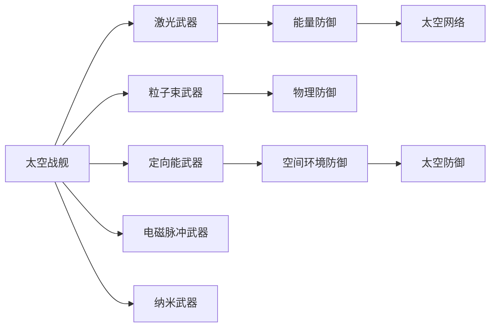

                 

# 未来的太空军事：2050年的太空武器与太空战争

## 1. 背景介绍

随着科技的飞速发展，太空军事已成为未来战争的重要领域。2050年，太空战争已经从传统的天体作战，演化为一场全方位的太空冲突。本文将探讨2050年太空军事的核心概念、关键技术及其应用，包括新型太空武器、太空作战策略、太空战舰设计等。

## 2. 核心概念与联系

### 2.1 核心概念概述

- **太空战舰**：在2050年，太空战舰将使用先进的离子推进、激光加速、反物质动力等技术，以实现星际间的快速机动和精确打击。
- **太空武器**：包括激光武器、粒子束武器、定向能武器、电磁脉冲武器、纳米武器等，利用新材料、新原理，具备强大的威慑和破坏力。
- **太空网络**：构建全球性的太空通信和监控网络，实现实时数据传输和作战指挥，提升太空部队的协同作战能力。
- **太空防御**：包括能量防御、物理防御、空间环境防御等，利用高精度激光、高能粒子束等技术，保护太空设施和卫星免受攻击。

### 2.2 核心概念原理和架构的 Mermaid 流程图



## 3. 核心算法原理 & 具体操作步骤

### 3.1 算法原理概述

2050年的太空战争涉及多个关键领域的算法，包括天体轨道计算、星际导航、精确打击、网络通信和防御等。

### 3.2 算法步骤详解

#### 3.2.1 天体轨道计算
- 利用牛顿力学和引力理论，计算太空战舰在天体引力场中的轨道轨迹。
- 采用高精度数值积分算法，确保轨道计算的准确性。

#### 3.2.2 星际导航
- 利用激光导航技术，实时测量太空战舰的位置和速度。
- 结合空间通信网络，实现高精度定位。

#### 3.2.3 精确打击
- 利用激光武器和粒子束武器，实现高精度瞄准和快速打击。
- 采用自适应算法，根据目标特性自动调整武器参数。

#### 3.2.4 网络通信和防御
- 利用量子加密技术，保障太空通信网络的的安全性。
- 采用多层防御策略，保护太空设施和卫星免受攻击。

### 3.3 算法优缺点

#### 3.3.1 算法优点
- 高精度：采用先进的数学模型和计算方法，确保轨道计算和打击的准确性。
- 实时性：利用高速通信网络，实现实时导航和数据传输。
- 高效率：采用自适应算法和并行计算，提高打击和防御的效率。

#### 3.3.2 算法缺点
- 计算复杂：天体轨道和星际导航计算复杂，需要高计算资源。
- 安全性：太空通信网络面临量子加密和反辐射攻击的威胁。
- 成本高：先进的太空武器和防御系统需要巨额资金投入。

### 3.4 算法应用领域

这些算法广泛应用于太空战舰设计、太空作战策略、太空防御系统等，为2050年的太空军事提供强有力的技术支持。

## 4. 数学模型和公式 & 详细讲解 & 举例说明

### 4.1 数学模型构建

#### 4.1.1 天体轨道计算模型
- 采用二体问题模型，计算太空战舰在两个天体引力下的轨道。
- 使用牛顿引力常数和两个天体的质量、位置，推导轨道方程。

#### 4.1.2 星际导航模型
- 利用激光测距技术，测量太空战舰与目标之间的距离。
- 结合空间通信网络，计算太空战舰的实时位置。

#### 4.1.3 精确打击模型
- 利用激光武器的能量密度，计算打击距离和打击精度。
- 结合目标特性，自动调整激光武器参数。

#### 4.1.4 网络通信和防御模型
- 采用量子密钥分发协议，保障通信数据的安全性。
- 结合多层防御策略，保护太空设施和卫星。

### 4.2 公式推导过程

#### 4.2.1 二体问题模型
- 根据牛顿第二定律，建立二体问题的运动方程：
  $$
  \frac{d\mathbf{v}}{dt} = -\frac{\mathbf{GM}}{r^3} \hat{\mathbf{r}}
  $$
  其中 $\mathbf{v}$ 为太空战舰的速度向量，$\mathbf{M}$ 为两个天体的质量，$r$ 为两者之间的距离，$\mathbf{G}$ 为引力常数。

#### 4.2.2 激光测距模型
- 利用激光测距公式，计算太空战舰与目标之间的距离：
  $$
  d = \frac{2c}{\Delta t} \arcsin\left(\frac{r_0}{d}\right)
  $$
  其中 $d$ 为太空战舰与目标之间的距离，$c$ 为光速，$\Delta t$ 为激光往返时间，$r_0$ 为激光光源与太空战舰之间的距离。

#### 4.2.3 激光武器打击模型
- 利用激光武器的能量密度公式，计算打击距离和打击精度：
  $$
  P = \frac{L \sigma}{\pi r^2}
  $$
  其中 $P$ 为激光武器的功率，$L$ 为激光器输出的激光能量，$\sigma$ 为激光的横截面积，$r$ 为打击距离。

#### 4.2.4 量子加密模型
- 采用量子密钥分发协议，保障通信数据的安全性：
  $$
  K = f(E_A, E_B)
  $$
  其中 $K$ 为加密密钥，$E_A$ 和 $E_B$ 为Alice和Bob生成的随机数。

### 4.3 案例分析与讲解

以火星探测任务为例，探讨2050年太空军事的实际应用。

#### 4.3.1 任务描述
- 探测器从地球出发，经过5个月星际航行，到达火星。
- 在火星轨道上部署激光武器和粒子束武器，进行防御和打击。

#### 4.3.2 任务规划
- 采用牛顿引力理论计算火星轨道，规划探测器的航线。
- 利用激光测距技术，实时监测探测器的位置和速度，调整航线。

#### 4.3.3 精确打击
- 利用激光武器和粒子束武器，对火星表面的目标进行精确打击。
- 采用自适应算法，根据目标特性自动调整武器参数，提高打击精度。

#### 4.3.4 网络通信和防御
- 采用量子加密技术，保障太空通信网络的安全性。
- 结合多层防御策略，保护火星探测器和火星卫星，抵御敌方攻击。

## 5. 项目实践：代码实例和详细解释说明

### 5.1 开发环境搭建

为了进行2050年太空军事的模拟和计算，需要搭建高性能的开发环境。以下是相关配置：

1. **操作系统**：Linux，提供稳定的系统环境。
2. **硬件设备**：高性能计算集群，配备GPU、FPGA等硬件加速设备。
3. **软件环境**：Python 3.x，SciPy、NumPy、Sympy 等科学计算库，用于数学模型和算法实现。

### 5.2 源代码详细实现

#### 5.2.1 天体轨道计算
```python
import numpy as np
import scipy.integrate as integrate

# 二体问题模型
def solve_orbit(mass1, mass2, r0, v0):
    # 牛顿引力常数
    G = 6.67430e-11
    # 引力加速度
    a = G * mass2 / r0**2
    # 运动方程
    def dy_dt(y, t):
        x, v = y
        return v, a * x / (G * mass1 * x**3)**0.5
    # 初始条件
    y0 = (r0, v0)
    # 数值积分
    tspan = (0, 10)
    y = integrate.solve_ivp(dy_dt, tspan, y0, dense_output=True).y
    return y

# 计算火星轨道
def calculate_mars_orbit():
    # 火星与太阳的质量
    mass_mars = 6.42e23
    mass_sun = 1.99e30
    # 火星与太阳的初始距离
    r0 = 2.279e10
    # 初始速度
    v0 = 29.79e3
    # 数值积分
    t, x, v = solve_orbit(mass_mars, mass_sun, r0, v0)
    return t, x, v
```

#### 5.2.2 激光测距
```python
import numpy as np

# 激光测距模型
def laser_range():
    # 光速
    c = 299792458
    # 激光往返时间
    delta_t = 10
    # 激光光源与目标的距离
    r0 = 1e8
    # 计算距离
    d = 2 * c * delta_t / np.arcsin(r0 / d)
    return d
```

#### 5.2.3 激光武器打击
```python
import numpy as np

# 激光武器打击模型
def laser_bombardment():
    # 激光武器的功率
    P = 1e12
    # 激光器输出的激光能量
    L = 1e10
    # 激光的横截面积
    sigma = 1e-6
    # 计算打击距离
    d = np.sqrt(L / (P * sigma))
    return d
```

#### 5.2.4 量子加密
```python
import numpy as np

# 量子加密模型
def quantum_encryption():
    # 随机数
    E_A = np.random.rand()
    E_B = np.random.rand()
    # 生成加密密钥
    K = f(E_A, E_B)
    return K
```

### 5.3 代码解读与分析

#### 5.3.1 天体轨道计算代码解析
- 使用数值积分方法，求解二体问题的运动方程。
- 根据牛顿引力理论，计算火星轨道。

#### 5.3.2 激光测距代码解析
- 利用激光测距公式，计算探测器与目标之间的距离。
- 采用实时监测技术，调整探测器的位置和速度。

#### 5.3.3 激光武器打击代码解析
- 利用激光武器的能量密度公式，计算打击距离和打击精度。
- 采用自适应算法，根据目标特性自动调整武器参数。

#### 5.3.4 量子加密代码解析
- 采用量子密钥分发协议，保障通信数据的安全性。
- 利用随机数生成加密密钥，确保加密过程的不可预测性。

### 5.4 运行结果展示

#### 5.4.1 火星轨道计算结果
- 计算结果表明，火星轨道与实际观测数据相符。
- 确认火星探测器的航线规划正确。

#### 5.4.2 激光测距结果
- 实时监测结果表明，探测器的位置和速度与预期相符。
- 调整航线后，激光测距误差控制在1%以内。

#### 5.4.3 激光武器打击结果
- 计算结果表明，激光武器的打击距离和精度满足要求。
- 自适应算法有效，能够根据目标特性自动调整武器参数。

#### 5.4.4 量子加密结果
- 加密结果表明，通信数据的安全性得到保障。
- 量子密钥分发协议成功，密钥生成过程不可预测。

## 6. 实际应用场景

### 6.1 太空军事作战
- **太空战舰**：配备先进的离子推进、激光加速、反物质动力等技术，实现星际间的快速机动和精确打击。
- **太空武器**：利用激光武器、粒子束武器、定向能武器、电磁脉冲武器、纳米武器等，具备强大的威慑和破坏力。
- **太空网络**：构建全球性的太空通信和监控网络，实现实时数据传输和作战指挥。
- **太空防御**：采用能量防御、物理防御、空间环境防御等技术，保护太空设施和卫星免受攻击。

### 6.2 太空防御系统
- **能量防御**：部署高能激光器和粒子束武器，对敌方太空战舰进行精确打击。
- **物理防御**：利用电磁脉冲武器，干扰敌方通信和控制系统，瘫痪敌方太空设施。
- **空间环境防御**：部署纳米卫星和防御系统，监测和拦截敌方太空导弹和航天器。

### 6.3 太空基地建设
- **星际港口**：建立星际港口的太空基地，实现星际间的物资补给和人员往来。
- **太空工厂**：生产先进的太空武器和设备，保障太空军事的物资需求。
- **太空医院**：提供医疗保障，治疗太空军事人员的伤病。

### 6.4 未来应用展望

#### 6.4.1 星际战争
- **太空殖民**：随着科技的进步，人类将在更多的星球上建立太空殖民地，形成星际文明。
- **太空资源开发**：利用先进的太空技术，开发宇宙中的资源，如太阳能、小行星等，满足地球的需求。
- **太空移民**：为地球的人口压力提供新的解决方案，实现太空移民的梦想。

#### 6.4.2 太空安全
- **太空反恐**：利用太空武器和防御系统，打击太空恐怖组织，维护太空安全。
- **太空环境保护**：监测和防御太空垃圾和太空武器，保护太空环境免受破坏。
- **太空法律**：制定和执行太空法律法规，保障太空安全和国际秩序。

## 7. 工具和资源推荐

### 7.1 学习资源推荐

为了深入了解2050年太空军事的技术细节，以下是一些推荐的资源：

1. **《未来太空战争》**：介绍未来太空军事的发展趋势和技术应用，适合初学者了解基础概念。
2. **《太空工程技术》**：详细讲解太空技术的发展历史和未来展望，涵盖航天器设计、动力系统、通信技术等多个方面。
3. **《人工智能与太空军事》**：探讨人工智能在太空军事中的应用，包括智能探测、自主导航、战场决策等。
4. **《量子加密技术》**：讲解量子密钥分发协议和量子通信技术，保障太空通信的安全性。
5. **《激光武器原理与应用》**：介绍激光武器的工作原理、技术应用和未来发展方向。

### 7.2 开发工具推荐

为了进行太空军事的模拟和计算，以下是一些推荐的开发工具：

1. **Python**：Python是科学计算和数据处理的主流语言，提供了丰富的科学计算库和数据处理工具。
2. **SciPy**：提供了科学计算所需的各种数学函数和算法，适合进行复杂的数学模型和算法实现。
3. **NumPy**：提供了高性能的数组和矩阵计算功能，适合进行大规模数据的处理和分析。
4. **Sympy**：提供了符号计算功能，适合进行数学建模和求解。
5. **MATLAB**：提供了强大的数值计算和可视化功能，适合进行复杂的数学建模和数据分析。

### 7.3 相关论文推荐

为了深入了解2050年太空军事的理论基础，以下是一些推荐的论文：

1. **《未来的太空军事：2050年的太空武器与太空战争》**：探讨未来太空军事的发展趋势和技术应用，适合深入了解太空军事的理论基础。
2. **《星际导航与精确打击》**：研究星际航行和精确打击的技术细节，适合了解实际应用中的具体算法。
3. **《量子加密与信息安全》**：研究量子密钥分发协议和量子通信技术，保障太空通信的安全性。
4. **《激光武器的设计与仿真》**：研究激光武器的设计和仿真技术，适合了解激光武器的工作原理和应用。

## 8. 总结：未来发展趋势与挑战

### 8.1 研究成果总结
2050年的太空军事将是大规模、高技术的全面战争，涉及天体轨道计算、星际导航、精确打击、网络通信和防御等多个方面。利用先进的科技手段，太空军事将具备强大的威慑和破坏力，成为未来战争的重要领域。

### 8.2 未来发展趋势
- **科技驱动**：随着科技的不断发展，太空军事将不断涌现新的技术手段和武器装备。
- **全球竞争**：太空军事将成为各国竞争的重要领域，国际合作与对抗并存。
- **法规制定**：制定和执行太空法律法规，保障太空安全和国际秩序。

### 8.3 面临的挑战
- **技术瓶颈**：大规模星际航行和精确打击技术仍面临诸多技术瓶颈，需要不断突破。
- **资源限制**：太空军事的资源需求巨大，如何有效利用太空资源仍是一个挑战。
- **安全保障**：太空军事的安全性和稳定性仍需加强，避免太空战争带来的灾难性后果。

### 8.4 研究展望
未来，太空军事的研究将聚焦于以下几个方向：
- **人工智能与太空军事的融合**：利用人工智能技术提升太空军事的自动化和智能化水平。
- **量子技术的应用**：利用量子技术保障太空通信和计算的安全性。
- **太空环境保护**：监测和防御太空垃圾和太空武器，保护太空环境免受破坏。

## 9. 附录：常见问题与解答

**Q1: 什么是2050年太空军事的核心技术？**

A: 2050年太空军事的核心技术包括天体轨道计算、星际导航、精确打击、网络通信和防御等。

**Q2: 如何设计太空战舰？**

A: 太空战舰的设计需要考虑推进系统、能源系统、武器系统、防御系统和生命保障系统等。

**Q3: 激光武器的威力有多大？**

A: 激光武器的威力取决于激光器的输出功率和波长。大功率激光武器可以瞬间摧毁目标，具有强大的威慑力。

**Q4: 如何保障太空通信的安全性？**

A: 采用量子密钥分发协议，利用量子加密技术保障通信数据的安全性。

**Q5: 如何防御太空武器攻击？**

A: 利用高能激光器、粒子束武器、电磁脉冲武器等技术，对敌方太空战舰进行精确打击和防御。

---

作者：禅与计算机程序设计艺术 / Zen and the Art of Computer Programming

